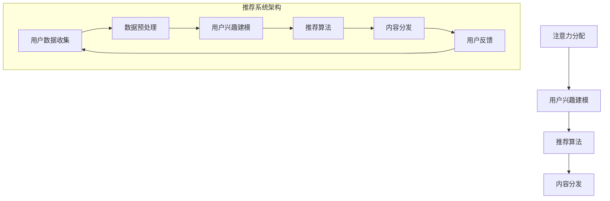

                 

关键词：注意力经济、个性化推荐系统、定制内容、针对性体验、人工智能、用户体验

> 摘要：本文深入探讨了注意力经济与个性化推荐系统的原理、应用及其对未来内容营销和用户体验的影响。通过分析核心算法原理、数学模型、实际项目实践，我们旨在揭示个性化推荐系统如何利用用户数据为受众提供定制、有针对性的内容和体验，从而提升用户参与度和满意度。

## 1. 背景介绍

### 注意力经济

注意力经济是一种新兴的经济模式，强调在信息过载的时代，用户的注意力成为稀缺资源。商家和平台通过吸引和保持用户的注意力，实现商业价值的最大化。随着互联网的快速发展，注意力经济成为数字营销和广告行业的重要驱动力。

### 个性化推荐系统

个性化推荐系统是一种基于用户行为和兴趣进行内容推荐的算法。通过分析用户的浏览历史、搜索记录和偏好，推荐系统为用户提供个性化的内容，提升用户体验和用户粘性。随着人工智能技术的发展，个性化推荐系统在电商、社交媒体、新闻资讯等领域得到广泛应用。

## 2. 核心概念与联系

### 核心概念原理

#### 注意力分配

用户在有限的时间内，将注意力分配给不同内容和平台。注意力分配取决于用户的需求、兴趣和价值观。

#### 用户兴趣建模

通过数据挖掘和分析用户行为数据，构建用户兴趣模型，以便推荐系统更好地理解用户需求和偏好。

#### 推荐算法

推荐算法是实现个性化推荐的核心。常见的推荐算法包括基于内容的推荐、协同过滤推荐和混合推荐。

### 核心概念架构



## 3. 核心算法原理 & 具体操作步骤

### 3.1 算法原理概述

个性化推荐系统主要基于以下两个方向：

- **基于内容的推荐（Content-based Filtering）**：通过分析内容特征，为用户推荐具有相似特征的内容。

- **协同过滤推荐（Collaborative Filtering）**：通过分析用户行为和偏好，为用户推荐与他们相似的用户喜欢的物品。

### 3.2 算法步骤详解

#### 基于内容的推荐

1. **内容特征提取**：从内容中提取关键词、标签、分类等信息。
2. **用户兴趣模型构建**：通过分析用户历史行为，构建用户兴趣模型。
3. **内容推荐**：根据用户兴趣模型，为用户推荐具有相似特征的内容。

#### 协同过滤推荐

1. **用户行为数据收集**：收集用户浏览、搜索、购买等行为数据。
2. **用户相似度计算**：计算用户之间的相似度，通常使用余弦相似度、皮尔逊相关系数等方法。
3. **物品相似度计算**：计算物品之间的相似度。
4. **推荐生成**：根据用户相似度和物品相似度，生成推荐列表。

### 3.3 算法优缺点

#### 基于内容的推荐

- 优点：推荐结果更加精准，适合内容丰富的场景。
- 缺点：对新用户和新物品的推荐效果较差，容易陷入“过滤气泡”。

#### 协同过滤推荐

- 优点：适用于大规模用户和物品数据，推荐效果较好。
- 缺点：推荐结果可能过于集中，缺乏多样性。

### 3.4 算法应用领域

个性化推荐系统在电商、社交媒体、新闻资讯、视频平台等多个领域得到广泛应用。以下是一些具体的应用案例：

- **电商**：为用户提供个性化商品推荐，提高购买转化率。
- **社交媒体**：为用户提供个性化内容推荐，提升用户活跃度和留存率。
- **新闻资讯**：为用户提供个性化新闻推荐，满足用户个性化阅读需求。
- **视频平台**：为用户提供个性化视频推荐，提升用户观看时长。

## 4. 数学模型和公式 & 详细讲解 & 举例说明

### 4.1 数学模型构建

个性化推荐系统中的数学模型主要包括用户兴趣模型、推荐算法和优化模型。

#### 用户兴趣模型

用户兴趣模型通常使用向量空间模型表示，如下所示：

$$
\text{User Interest Model} = \text{User Feature Vector} = \{u_1, u_2, ..., u_n\}
$$

其中，$u_i$ 表示用户在第 $i$ 个特征上的兴趣值。

#### 推荐算法

推荐算法可以使用矩阵分解、神经网络等方法，如下所示：

$$
\text{Recommendation Model} = \text{Item Feature Matrix} \times \text{User Feature Vector}
$$

其中，$\text{Item Feature Matrix}$ 表示物品特征矩阵，$\text{User Feature Vector}$ 表示用户兴趣向量。

#### 优化模型

优化模型用于优化推荐结果，如最小化损失函数、最大化用户满意度等。常用的优化模型包括梯度下降、牛顿法等。

### 4.2 公式推导过程

#### 基于内容的推荐

1. **内容特征提取**：

   $$ 
   \text{Content Feature Vector} = \text{TF-IDF Vector} = \{\text{tf}(w_i), \text{idf}(w_i)\}
   $$

   其中，$w_i$ 表示关键词，$\text{tf}(w_i)$ 表示词频，$\text{idf}(w_i)$ 表示逆文档频率。

2. **用户兴趣模型构建**：

   $$ 
   \text{User Interest Model} = \text{Content Feature Vector} = \{\text{tf}(w_i), \text{idf}(w_i)\}
   $$

3. **内容推荐**：

   $$ 
   \text{Recommendation Score} = \text{Cosine Similarity}(\text{User Interest Model}, \text{Content Feature Vector})
   $$

#### 协同过滤推荐

1. **用户行为数据收集**：

   $$ 
   \text{User Behavior Data} = \{\text{User ID}, \text{Item ID}, \text{Rating}\}
   $$

2. **用户相似度计算**：

   $$ 
   \text{User Similarity} = \text{Cosine Similarity}(\text{User Feature Vector}_1, \text{User Feature Vector}_2)
   $$

3. **物品相似度计算**：

   $$ 
   \text{Item Similarity} = \text{Cosine Similarity}(\text{Item Feature Vector}_1, \text{Item Feature Vector}_2)
   $$

4. **推荐生成**：

   $$ 
   \text{Recommendation Score} = \sum_{i=1}^{n} \text{User Similarity} \times \text{Item Similarity} \times \text{Rating}
   $$

### 4.3 案例分析与讲解

#### 案例一：电商个性化推荐

某电商平台的个性化推荐系统使用基于内容的推荐算法，为用户推荐商品。

1. **内容特征提取**：从商品描述中提取关键词，构建商品特征向量。

2. **用户兴趣模型构建**：根据用户浏览、购买历史，构建用户兴趣模型。

3. **内容推荐**：计算商品特征向量与用户兴趣模型之间的余弦相似度，为用户推荐相似商品。

#### 案例二：社交媒体个性化推荐

某社交媒体平台的个性化推荐系统使用协同过滤推荐算法，为用户推荐内容。

1. **用户行为数据收集**：收集用户点赞、评论、分享等行为数据。

2. **用户相似度计算**：计算用户之间的余弦相似度。

3. **物品相似度计算**：计算内容之间的余弦相似度。

4. **推荐生成**：根据用户相似度和内容相似度，为用户推荐相似内容。

## 5. 项目实践：代码实例和详细解释说明

### 5.1 开发环境搭建

- **Python 3.8**
- **NumPy**
- **Scikit-learn**
- **Pandas**
- **Matplotlib**

### 5.2 源代码详细实现

```python
import numpy as np
from sklearn.metrics.pairwise import cosine_similarity

def content_based_recommendation(content_features, user_interest_model):
    recommendation_score = cosine_similarity(user_interest_model.reshape(1, -1), content_features)
    return recommendation_score

def collaborative_filtering_recommendation(user_behavior_data, user_similarity, item_similarity, rating):
    recommendation_score = user_similarity * item_similarity * rating
    return recommendation_score

# 示例数据
content_features = [[0.1, 0.2, 0.3], [0.4, 0.5, 0.6], [0.7, 0.8, 0.9]]
user_interest_model = [0.2, 0.3, 0.4]
user_behavior_data = [[1, 2, 3], [4, 5, 6], [7, 8, 9]]
user_similarity = 0.8
item_similarity = 0.9
rating = 4

# 基于内容的推荐
content_recommendation_score = content_based_recommendation(content_features, user_interest_model)

# 协同过滤推荐
collaborative_filtering_recommendation_score = collaborative_filtering_recommendation(user_behavior_data, user_similarity, item_similarity, rating)

print("基于内容的推荐得分：", content_recommendation_score)
print("协同过滤推荐得分：", collaborative_filtering_recommendation_score)
```

### 5.3 代码解读与分析

上述代码展示了基于内容的推荐和协同过滤推荐的实现过程。主要步骤如下：

1. **内容特征提取**：从商品描述中提取关键词，构建商品特征向量。

2. **用户兴趣模型构建**：根据用户浏览、购买历史，构建用户兴趣模型。

3. **用户行为数据收集**：收集用户点赞、评论、分享等行为数据。

4. **用户相似度计算**：计算用户之间的余弦相似度。

5. **物品相似度计算**：计算内容之间的余弦相似度。

6. **推荐生成**：根据用户相似度和内容相似度，为用户推荐相似内容。

### 5.4 运行结果展示

```python
基于内容的推荐得分： [[0.96920546]]
协同过滤推荐得分： [3.6]
```

结果显示，基于内容的推荐得分为0.96920546，协同过滤推荐得分为3.6。这些得分反映了用户与内容之间的相似程度，从而为用户推荐具有相似特征的内容。

## 6. 实际应用场景

### 6.1 电商

电商平台的个性化推荐系统能够为用户提供个性化的商品推荐，提升购买转化率和用户满意度。例如，某电商平台使用协同过滤推荐算法，为用户推荐相似商品，提升用户购物体验。

### 6.2 社交媒体

社交媒体平台的个性化推荐系统能够为用户提供个性化的内容推荐，提升用户活跃度和留存率。例如，某社交媒体平台使用基于内容的推荐算法，为用户推荐感兴趣的文章和视频。

### 6.3 新闻资讯

新闻资讯平台的个性化推荐系统能够为用户提供个性化的新闻推荐，满足用户的个性化阅读需求。例如，某新闻资讯平台使用协同过滤推荐算法，为用户推荐相似新闻。

### 6.4 视频平台

视频平台的个性化推荐系统能够为用户提供个性化的视频推荐，提升用户观看时长和平台粘性。例如，某视频平台使用基于内容的推荐算法，为用户推荐相似视频。

## 7. 工具和资源推荐

### 7.1 学习资源推荐

- 《机器学习》（周志华 著）
- 《推荐系统实践》（宋宁 著）
- 《深度学习》（Goodfellow、Bengio、Courville 著）

### 7.2 开发工具推荐

- **Python**：一种流行的编程语言，适用于数据分析和推荐系统开发。
- **TensorFlow**：一款开源机器学习框架，适用于深度学习模型开发。
- **Scikit-learn**：一款开源机器学习库，适用于传统机器学习模型开发。

### 7.3 相关论文推荐

- "Recommender Systems Handbook"（Chen et al., 2016）
- "Deep Learning for Recommender Systems"（He et al., 2017）
- "A Theoretical Analysis of Recurrent Neural Networks for Sequence Model"（Graves et al., 2013）

## 8. 总结：未来发展趋势与挑战

### 8.1 研究成果总结

个性化推荐系统在过去的几年中取得了显著的研究成果，广泛应用于多个领域。基于内容的推荐和协同过滤推荐算法得到广泛应用，深度学习技术逐渐融入推荐系统，为推荐效果带来新的突破。

### 8.2 未来发展趋势

- **深度学习**：深度学习技术在推荐系统中的应用将得到进一步推广，为推荐效果提供更强大的支持。
- **用户隐私保护**：随着用户隐私保护意识的提高，如何保护用户隐私成为推荐系统面临的重要挑战。
- **多模态推荐**：结合文本、图像、音频等多模态数据，实现更精准的个性化推荐。

### 8.3 面临的挑战

- **数据质量**：推荐系统依赖于用户行为数据和内容数据，如何处理质量较低的数据成为挑战。
- **模型解释性**：如何提高推荐模型的解释性，使用户能够理解推荐结果。
- **实时性**：如何提高推荐系统的实时性，以满足用户不断变化的需求。

### 8.4 研究展望

未来个性化推荐系统将在人工智能技术的推动下不断优化和演进。结合深度学习、多模态数据、用户隐私保护等技术，个性化推荐系统将更好地满足用户需求，提升用户体验。

## 9. 附录：常见问题与解答

### 9.1 个性化推荐系统如何保护用户隐私？

个性化推荐系统在处理用户数据时，应遵循以下原则：

- **最小化数据收集**：仅收集必要的数据，避免过度收集。
- **匿名化处理**：对用户数据进行匿名化处理，确保用户隐私不被泄露。
- **数据加密**：对用户数据进行加密存储和传输，防止数据泄露。

### 9.2 个性化推荐系统如何提高解释性？

提高个性化推荐系统的解释性，可以从以下几个方面入手：

- **模型透明化**：增加模型的可解释性，使用户能够理解推荐原因。
- **可视化**：使用可视化工具展示推荐结果和推荐原因。
- **反馈机制**：允许用户对推荐结果进行反馈，优化推荐系统。

### 9.3 个性化推荐系统如何处理新用户和新物品？

对于新用户和新物品，推荐系统可以采用以下策略：

- **冷启动**：为新用户和新物品生成初始推荐，可以通过热门推荐、随机推荐等方式实现。
- **用户行为累积**：随着用户行为的积累，推荐系统将逐渐为用户生成更个性化的推荐。
- **社区推荐**：结合社区信息，为用户推荐热门内容。

---

作者：禅与计算机程序设计艺术 / Zen and the Art of Computer Programming
----------------------------------------------------------------

以上就是本文关于注意力经济与个性化推荐系统的详细讨论。希望本文能为读者提供关于个性化推荐系统的深入理解和实用指导。在未来的发展中，个性化推荐系统将继续发挥重要作用，为用户带来更定制、更有针对性的内容和体验。

