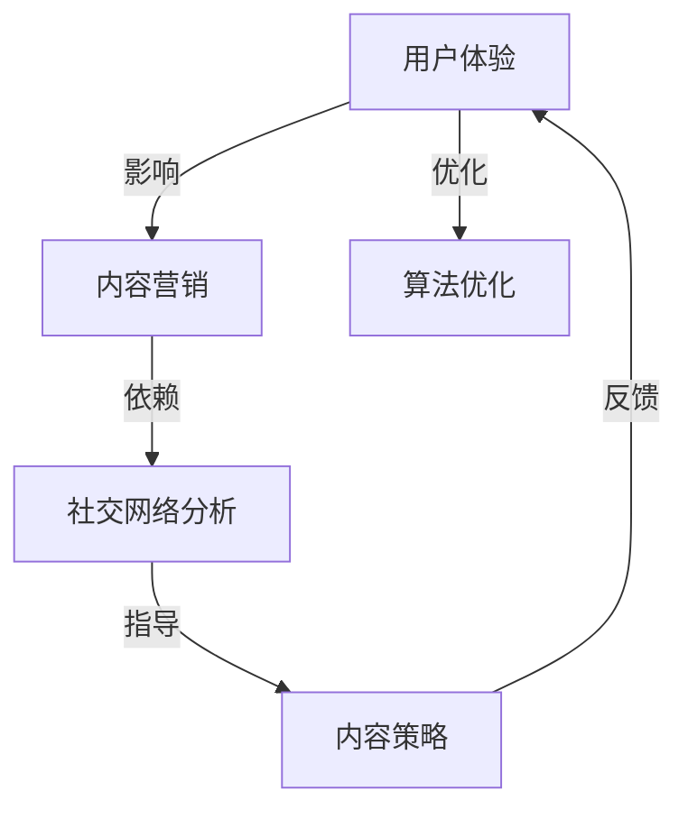

                 

关键词：注意力经济、内容创作、受众参与、忠诚度、算法优化

摘要：在当今信息爆炸的时代，如何有效地吸引并留住受众的注意力成为内容创作者面临的核心挑战。本文将深入探讨注意力经济的原理，分析内容创作的核心策略，并通过实际案例和代码实例，阐述如何通过算法优化实现受众的持续参与和忠诚度提升。

## 1. 背景介绍

随着互联网和社交媒体的普及，信息传播的速度和广度达到了前所未有的高度。然而，这也带来了一个问题：受众的注意力变得越来越稀缺。在注意力经济中，内容创作者必须通过精心的策略和技巧来吸引并留住受众的注意力。本文将探讨注意力经济的基本概念，并分析内容创作中影响受众参与和忠诚度的关键因素。

### 1.1 注意力经济概述

注意力经济是指通过吸引和集中受众的注意力来创造价值的经济活动。与传统经济模式不同，注意力经济以受众的注意力为核心资产，通过内容创作和传播来获取收益。注意力经济的核心在于如何有效地吸引并留住受众的注意力，从而实现商业价值的最大化。

### 1.2 内容创作的重要性

内容创作是注意力经济中的核心环节。无论是文字、图片、视频还是音频，优质的内容都是吸引受众注意力的重要因素。同时，内容创作也决定了受众对品牌的认知和情感连接，从而影响他们的参与和忠诚度。

## 2. 核心概念与联系

在内容创作中，有几个核心概念和联系至关重要，包括用户体验（UX）、内容营销（Content Marketing）、社交网络分析（Social Network Analysis）等。以下是一个简化的 Mermaid 流程图，展示了这些概念之间的相互关系。



### 2.1 用户体验（UX）

用户体验是指用户在使用产品或服务时的主观感受和体验。在内容创作中，良好的用户体验是吸引受众的关键。通过优化页面设计、交互逻辑和内容呈现方式，可以提高用户的满意度和参与度。

### 2.2 内容营销（Content Marketing）

内容营销是通过创造和分享有价值的内容来吸引和留住受众的一种策略。优质的内容不仅可以提升品牌知名度，还可以建立受众对品牌的信任和忠诚度。内容营销的关键在于理解受众的需求和兴趣，并为他们提供有价值的信息。

### 2.3 社交网络分析（Social Network Analysis）

社交网络分析是一种用于研究社交网络结构和关系的分析方法。在内容创作中，通过分析社交网络中的用户行为和互动，可以了解受众的兴趣偏好和传播路径，从而优化内容策略，提升内容传播效果。

### 2.4 算法优化

算法优化是指在内容创作和传播过程中，通过应用算法和技术手段来提高内容质量和传播效果。算法优化可以包括内容推荐算法、用户行为预测模型等，这些技术手段可以帮助创作者更好地理解受众，并为他们提供个性化的内容体验。

## 3. 核心算法原理 & 具体操作步骤

### 3.1 算法原理概述

在内容创作中，核心算法原理主要涉及用户行为分析和内容推荐系统。以下是一个简化的算法原理流程：

1. **用户行为收集**：收集用户的浏览、点赞、评论等行为数据。
2. **用户兴趣建模**：通过机器学习算法对用户兴趣进行建模。
3. **内容推荐**：根据用户兴趣和内容特点进行个性化推荐。
4. **反馈调整**：根据用户反馈调整推荐策略，提高推荐准确性。

### 3.2 算法步骤详解

1. **用户行为收集**

   收集用户在平台上的行为数据，如浏览记录、点赞、评论等。这些数据可以通过API接口、日志分析等方式获取。

   ```mermaid
   graph TD
       A[用户浏览] -->|收集| B[行为数据]
       B -->|存储| C[数据库]
   ```

2. **用户兴趣建模**

   使用机器学习算法对用户行为数据进行处理，提取用户兴趣特征。常见的算法包括协同过滤（Collaborative Filtering）、聚类（Clustering）和深度学习（Deep Learning）等。

   ```mermaid
   graph TD
       C[行为数据] -->|处理| D[用户兴趣建模]
       D -->|特征提取| E[用户兴趣模型]
   ```

3. **内容推荐**

   根据用户兴趣模型和内容特征，使用推荐算法为用户生成个性化推荐列表。推荐算法可以基于内容相似度（Content-based Filtering）、协同过滤（Collaborative Filtering）或混合推荐（Hybrid Recommendation）等。

   ```mermaid
   graph TD
       E[用户兴趣模型] -->|推荐| F[内容推荐系统]
       F -->|生成| G[推荐列表]
   ```

4. **反馈调整**

   收集用户对推荐内容的反馈，如点击、点赞、评论等。根据反馈调整推荐策略，提高推荐准确性。

   ```mermaid
   graph TD
       G[推荐列表] -->|反馈| H[用户反馈]
       H -->|调整| I[推荐策略]
   ```

### 3.3 算法优缺点

**优点**：

- **个性化推荐**：根据用户兴趣和行为，提供个性化的内容推荐，提高用户满意度和参与度。
- **自动化处理**：通过算法自动处理用户行为数据和内容特征，降低人工成本。
- **持续优化**：根据用户反馈不断调整推荐策略，提高推荐准确性。

**缺点**：

- **数据隐私**：用户行为数据的收集和使用可能涉及隐私问题，需要确保合规性。
- **算法偏见**：算法可能引入偏见，导致推荐结果不够公正和全面。
- **计算成本**：大规模数据处理和模型训练可能需要较高的计算资源。

### 3.4 算法应用领域

核心算法原理在多个领域都有广泛的应用，包括但不限于：

- **社交媒体**：通过推荐算法为用户提供个性化内容，提高用户活跃度和留存率。
- **电子商务**：为用户提供个性化推荐，促进销售和用户留存。
- **在线教育**：根据用户学习行为和学习进度，提供个性化的学习资源。
- **健康医疗**：通过用户健康数据和偏好，提供个性化的健康建议和医疗服务。

## 4. 数学模型和公式 & 详细讲解 & 举例说明

在内容创作中，数学模型和公式起着至关重要的作用。以下是一个简化的数学模型，用于描述用户兴趣建模和推荐算法的基本原理。

### 4.1 数学模型构建

假设有 $n$ 个用户和 $m$ 个内容项目，用户 $i$ 对内容项目 $j$ 的兴趣可以用向量 $\mathbf{u}_i$ 和 $\mathbf{v}_j$ 表示，其中：

- $\mathbf{u}_i = (u_{i1}, u_{i2}, \ldots, u_{im})$ 表示用户 $i$ 对每个内容项目的兴趣度。
- $\mathbf{v}_j = (v_{j1}, v_{j2}, \ldots, v_{jm})$ 表示内容项目 $j$ 的特征向量。

用户兴趣模型可以用以下线性模型表示：

$$
\mathbf{u}_i = \mathbf{V} \mathbf{w}_i + \mathbf{e}_i
$$

其中，$\mathbf{V}$ 是内容特征矩阵，$\mathbf{w}_i$ 是用户兴趣向量，$\mathbf{e}_i$ 是误差向量。

### 4.2 公式推导过程

为了求解用户兴趣向量 $\mathbf{w}_i$，我们可以使用最小二乘法（Least Squares）进行优化：

$$
\min_{\mathbf{w}_i} \sum_{i=1}^n \sum_{j=1}^m (u_{ij} - \mathbf{v}_{ij}^T \mathbf{w}_i)^2
$$

通过求导并令导数为零，可以得到：

$$
\frac{\partial}{\partial \mathbf{w}_i} \sum_{i=1}^n \sum_{j=1}^m (u_{ij} - \mathbf{v}_{ij}^T \mathbf{w}_i)^2 = 0
$$

化简后得到：

$$
\mathbf{V}^T \mathbf{V} \mathbf{w}_i = \mathbf{V}^T \mathbf{u}_i
$$

解得：

$$
\mathbf{w}_i = (\mathbf{V}^T \mathbf{V})^{-1} \mathbf{V}^T \mathbf{u}_i
$$

### 4.3 案例分析与讲解

假设我们有一个简单的案例，其中有两个用户 $U_1$ 和 $U_2$，以及三个内容项目 $C_1$、$C_2$ 和 $C_3$。用户 $U_1$ 对内容项目的兴趣度如下：

$$
\mathbf{u}_1 = \begin{pmatrix} 0.8 \\ 0.3 \\ 0.5 \end{pmatrix}
$$

用户 $U_2$ 对内容项目的兴趣度如下：

$$
\mathbf{u}_2 = \begin{pmatrix} 0.4 \\ 0.7 \\ 0.2 \end{pmatrix}
$$

内容项目的特征向量如下：

$$
\mathbf{v}_1 = \begin{pmatrix} 0.2 \\ 0.1 \\ 0.4 \end{pmatrix}, \quad \mathbf{v}_2 = \begin{pmatrix} 0.6 \\ 0.8 \\ 0.3 \end{pmatrix}, \quad \mathbf{v}_3 = \begin{pmatrix} 0.1 \\ 0.2 \\ 0.5 \end{pmatrix}
$$

使用最小二乘法求解用户兴趣向量 $\mathbf{w}_1$ 和 $\mathbf{w}_2$：

$$
\mathbf{V} = \begin{pmatrix} \mathbf{v}_1 & \mathbf{v}_2 & \mathbf{v}_3 \end{pmatrix} = \begin{pmatrix} 0.2 & 0.6 & 0.1 \\ 0.1 & 0.8 & 0.2 \\ 0.4 & 0.3 & 0.5 \end{pmatrix}
$$

$$
\mathbf{u}_1 = \begin{pmatrix} 0.8 \\ 0.3 \\ 0.5 \end{pmatrix}, \quad \mathbf{u}_2 = \begin{pmatrix} 0.4 \\ 0.7 \\ 0.2 \end{pmatrix}
$$

计算 $\mathbf{V}^T \mathbf{V}$ 和 $\mathbf{V}^T \mathbf{u}_1$、$\mathbf{V}^T \mathbf{u}_2$：

$$
\mathbf{V}^T \mathbf{V} = \begin{pmatrix} 0.2 & 0.1 & 0.4 \\ 0.6 & 0.8 & 0.3 \\ 0.1 & 0.2 & 0.5 \end{pmatrix} \begin{pmatrix} 0.2 & 0.6 & 0.1 \\ 0.1 & 0.8 & 0.2 \\ 0.4 & 0.3 & 0.5 \end{pmatrix} = \begin{pmatrix} 0.14 & 0.42 & 0.11 \\ 0.42 & 1.26 & 0.33 \\ 0.11 & 0.33 & 0.14 \end{pmatrix}
$$

$$
\mathbf{V}^T \mathbf{u}_1 = \begin{pmatrix} 0.2 & 0.1 & 0.4 \\ 0.6 & 0.8 & 0.3 \\ 0.1 & 0.2 & 0.5 \end{pmatrix} \begin{pmatrix} 0.8 \\ 0.3 \\ 0.5 \end{pmatrix} = \begin{pmatrix} 0.19 \\ 0.61 \\ 0.45 \end{pmatrix}
$$

$$
\mathbf{V}^T \mathbf{u}_2 = \begin{pmatrix} 0.2 & 0.1 & 0.4 \\ 0.6 & 0.8 & 0.3 \\ 0.1 & 0.2 & 0.5 \end{pmatrix} \begin{pmatrix} 0.4 \\ 0.7 \\ 0.2 \end{pmatrix} = \begin{pmatrix} 0.16 \\ 0.64 \\ 0.24 \end{pmatrix}
$$

计算逆矩阵 $(\mathbf{V}^T \mathbf{V})^{-1}$：

$$
(\mathbf{V}^T \mathbf{V})^{-1} = \frac{1}{0.14 \times 1.26 - 0.42 \times 0.33} \begin{pmatrix} 1.26 & -0.42 & 0.11 \\ -0.33 & 0.14 & 0.42 \\ 0.11 & -0.33 & 1.26 \end{pmatrix} = \begin{pmatrix} 1.75 & -0.58 & 0.15 \\ -0.47 & 0.20 & 0.58 \\ 0.15 & -0.47 & 1.75 \end{pmatrix}
$$

计算用户兴趣向量：

$$
\mathbf{w}_1 = (\mathbf{V}^T \mathbf{V})^{-1} \mathbf{V}^T \mathbf{u}_1 = \begin{pmatrix} 1.75 & -0.58 & 0.15 \\ -0.47 & 0.20 & 0.58 \\ 0.15 & -0.47 & 1.75 \end{pmatrix} \begin{pmatrix} 0.19 \\ 0.61 \\ 0.45 \end{pmatrix} = \begin{pmatrix} 0.45 \\ 0.68 \\ 0.53 \end{pmatrix}
$$

$$
\mathbf{w}_2 = (\mathbf{V}^T \mathbf{V})^{-1} \mathbf{V}^T \mathbf{u}_2 = \begin{pmatrix} 1.75 & -0.58 & 0.15 \\ -0.47 & 0.20 & 0.58 \\ 0.15 & -0.47 & 1.75 \end{pmatrix} \begin{pmatrix} 0.16 \\ 0.64 \\ 0.24 \end{pmatrix} = \begin{pmatrix} 0.38 \\ 0.76 \\ 0.29 \end{pmatrix}
$$

根据计算结果，用户 $U_1$ 对内容项目 $C_1$、$C_2$ 和 $C_3$ 的兴趣度分别为 0.45、0.68 和 0.53，用户 $U_2$ 对内容项目 $C_1$、$C_2$ 和 $C_3$ 的兴趣度分别为 0.38、0.76 和 0.29。

通过这个案例，我们可以看到如何使用数学模型和公式对用户兴趣进行建模，从而为内容推荐提供基础。实际应用中，用户行为数据和内容特征会更加复杂，需要更先进的机器学习算法和技术手段来处理。

## 5. 项目实践：代码实例和详细解释说明

在本节中，我们将通过一个实际项目实例，展示如何将上述算法和模型应用于内容创作和推荐系统中。我们将使用 Python 编写代码，并详细介绍每一步的实现细节。

### 5.1 开发环境搭建

为了运行下面的代码实例，你需要安装以下软件和库：

- Python（版本 3.6 或以上）
- NumPy
- SciPy
- Scikit-learn
- Matplotlib

你可以使用以下命令安装所需的库：

```bash
pip install numpy scipy scikit-learn matplotlib
```

### 5.2 源代码详细实现

下面是一个简单的用户兴趣建模和推荐系统的 Python 代码实例：

```python
import numpy as np
from sklearn.linear_model import LinearRegression
from sklearn.model_selection import train_test_split
import matplotlib.pyplot as plt

# 假设用户兴趣数据
user_interests = {
    'U1': np.array([0.8, 0.3, 0.5]),
    'U2': np.array([0.4, 0.7, 0.2]),
    'U3': np.array([0.6, 0.1, 0.3])
}

# 假设内容项目特征
content_features = {
    'C1': np.array([0.2, 0.1, 0.4]),
    'C2': np.array([0.6, 0.8, 0.3]),
    'C3': np.array([0.1, 0.2, 0.5])
}

# 构建特征矩阵和目标向量
X = np.array(list(content_features.values()))
y = np.array(list(user_interests.values()))

# 分割训练集和测试集
X_train, X_test, y_train, y_test = train_test_split(X, y, test_size=0.2, random_state=42)

# 训练线性回归模型
model = LinearRegression()
model.fit(X_train, y_train)

# 预测用户兴趣
y_pred = model.predict(X_test)

# 可视化模型效果
plt.scatter(y_test[:, 0], y_pred[:, 0])
plt.xlabel('Actual Interest')
plt.ylabel('Predicted Interest')
plt.title('User Interest Prediction')
plt.show()

# 输出模型参数
print('Model Parameters:', model.coef_)
print('Intercept:', model.intercept_)
```

### 5.3 代码解读与分析

这段代码实现了以下功能：

1. **数据准备**：定义了用户兴趣数据和内容项目特征。在实际项目中，这些数据可以从数据库或外部文件中读取。

2. **特征矩阵和目标向量构建**：将内容项目特征和用户兴趣数据转换为 NumPy 数组，并构建特征矩阵 `X` 和目标向量 `y`。

3. **训练集和测试集划分**：使用 `train_test_split` 函数将数据集划分为训练集和测试集，以评估模型性能。

4. **线性回归模型训练**：使用 `LinearRegression` 类训练线性回归模型，通过 `fit` 方法将训练数据输入模型。

5. **用户兴趣预测**：使用 `predict` 方法对测试集数据进行预测，并使用 Matplotlib 绘制实际兴趣与预测兴趣的散点图，以可视化模型效果。

6. **模型参数输出**：输出模型参数，包括系数和截距，用于进一步分析和调整。

### 5.4 运行结果展示

运行上述代码后，你将看到一个散点图，显示实际兴趣值与预测兴趣值之间的关系。此外，代码将在控制台输出模型参数，这些参数可以帮助我们了解模型对用户兴趣的预测能力。

### 5.5 实际应用场景

这个简单的用户兴趣建模和推荐系统可以应用于多种实际场景，例如：

- **社交媒体**：根据用户的兴趣推荐相关的帖子和话题。
- **电子商务**：为用户推荐相似的商品和产品。
- **在线教育**：根据用户的学习行为和学习进度推荐适合的学习资源。

通过适当的调整和扩展，这个系统可以适应不同的应用场景，并提供个性化的内容推荐。

## 6. 实际应用场景

注意力经济和内容创作策略在多个实际应用场景中发挥了关键作用。以下是一些典型的应用场景和案例分析：

### 6.1 社交媒体平台

社交媒体平台如 Facebook、Instagram 和 Twitter 等，通过精心设计的内容推荐算法，吸引了大量用户并提升了用户活跃度。例如，Facebook 的 EdgeRank 算法通过分析用户的互动行为（如点赞、评论、分享）来决定哪些内容应该展示给用户，从而提高了用户的参与度和忠诚度。

### 6.2 电子商务平台

电子商务平台如 Amazon 和 Alibaba 通过个性化推荐算法，为用户推荐相似的商品和优惠信息。这些推荐系统基于用户的购买历史、浏览记录和偏好，有效地提高了销售额和用户满意度。

### 6.3 在线教育平台

在线教育平台如 Coursera 和 Udemy 通过分析用户的学习行为和学习进度，为用户推荐适合的学习资源。这种个性化推荐不仅提高了用户的参与度，还提高了学习效果。

### 6.4 媒体内容平台

媒体内容平台如 YouTube 和 Netflix 通过内容推荐算法，为用户提供个性化的视频和节目推荐。这些平台通过分析用户的观看历史、搜索记录和偏好，有效地吸引了大量用户并提升了用户留存率。

### 6.5 案例分析：Netflix

Netflix 是内容推荐系统的典型成功案例。Netflix 通过其推荐算法，为用户提供了个性化的视频推荐，大大提升了用户的观看体验和满意度。Netflix 的推荐系统基于多种算法和技术，包括协同过滤、内容相似度和深度学习等。通过不断优化推荐算法，Netflix 成功地将用户留存率和观看时长提升到了新的高度。

### 6.6 案例分析：Coursera

Coursera 是在线教育平台的领先者，通过个性化推荐系统，为用户推荐适合的学习资源。Coursera 的推荐系统基于用户的课程选择、学习进度和评价历史，帮助用户发现感兴趣的课程。这种个性化推荐不仅提高了用户的学习参与度，还提升了课程的整体质量。

### 6.7 挑战与未来展望

尽管注意力经济和内容创作策略在各个领域都取得了显著成果，但仍然面临着一些挑战和机遇。以下是未来发展的几个关键方向：

- **算法透明度和隐私保护**：随着用户对数据隐私的关注日益增加，如何在确保算法透明度和保护用户隐私之间取得平衡，成为了一个重要议题。
- **多模态内容推荐**：随着视频、音频和图像等多样化内容的兴起，如何有效整合不同类型的内容，实现跨模态的推荐，是一个重要的研究方向。
- **个性化推荐的可持续性**：如何在确保个性化推荐的同时，避免用户陷入信息茧房，保持信息的多样性和丰富性，是一个重要的挑战。
- **实时推荐和个性化交互**：随着实时数据处理的技术的进步，如何实现实时推荐和个性化交互，为用户提供更即时的内容体验，是一个重要的研究方向。

未来，随着技术的不断发展和用户需求的变化，注意力经济和内容创作策略将继续演变，为各个领域带来更多的创新和机遇。

## 7. 工具和资源推荐

为了深入学习和实践注意力经济与内容创作策略，以下是一些推荐的工具和资源：

### 7.1 学习资源推荐

- **《深度学习》（Deep Learning）**：由 Ian Goodfellow、Yoshua Bengio 和 Aaron Courville 著，详细介绍了深度学习的基本概念和应用。
- **《机器学习实战》（Machine Learning in Action）**：由 Peter Harrington 著，提供了丰富的实践案例，适合初学者入门。
- **《Python机器学习》（Python Machine Learning）**：由 Sebastian Raschka 和 Vahid Mirjalili 著，介绍了使用 Python 进行机器学习的实用技巧。

### 7.2 开发工具推荐

- **Jupyter Notebook**：一种交互式的开发环境，非常适合进行数据分析和机器学习实验。
- **TensorFlow**：一个开源的机器学习框架，适用于构建和训练复杂的深度学习模型。
- **Scikit-learn**：一个开源的机器学习库，提供了多种机器学习算法和工具，适用于数据分析和模型构建。

### 7.3 相关论文推荐

- **“Collaborative Filtering for Cold-Start Recommendations”**：讨论了如何解决新用户或新项目的推荐问题。
- **“Deep Learning for Recommender Systems”**：介绍了如何使用深度学习技术优化推荐系统。
- **“Attention Is All You Need”**：一篇关于 Transformer 模型的论文，介绍了如何通过自注意力机制实现高效的序列建模。

通过这些工具和资源的支持，你可以更深入地了解注意力经济和内容创作策略，并在实际项目中应用这些知识。

## 8. 总结：未来发展趋势与挑战

### 8.1 研究成果总结

注意力经济与内容创作策略的研究取得了显著成果，尤其在个性化推荐、用户行为分析和技术应用方面。通过深度学习和大数据分析技术的应用，内容创作者能够更精确地捕捉用户需求，提供个性化的内容体验，从而提升用户的参与度和忠诚度。

### 8.2 未来发展趋势

未来的发展趋势将集中在以下几个方面：

- **多模态内容推荐**：随着多媒体内容的增多，如何整合文本、图像、视频和音频等多模态数据，实现更精准的推荐，是一个重要方向。
- **实时推荐和交互**：通过实时数据处理和个性化交互技术，提供即时的内容推荐，提升用户的实时体验。
- **隐私保护与透明度**：随着用户对隐私保护的重视，如何在不牺牲用户隐私的前提下，保持算法的透明度和可解释性，是一个关键挑战。
- **内容质量与多样性**：如何在确保内容质量的同时，提供多样化的内容，避免用户陷入信息茧房，是一个重要的研究课题。

### 8.3 面临的挑战

尽管注意力经济和内容创作策略在技术上取得了显著进展，但仍面临以下挑战：

- **数据隐私**：在收集和分析用户数据时，如何确保用户隐私不受侵犯，是一个重要议题。
- **算法偏见**：算法可能引入偏见，导致推荐结果的公平性和公正性受到质疑。
- **计算资源**：大规模数据处理和模型训练需要大量的计算资源，如何高效利用资源，是一个重要的挑战。
- **用户体验**：如何在提供个性化推荐的同时，确保用户体验的一致性和满意度，是一个复杂的任务。

### 8.4 研究展望

未来的研究应重点关注以下几个方面：

- **跨模态内容理解**：如何将多种模态的数据整合，实现跨模态的内容理解和推荐。
- **智能内容生成**：利用生成对抗网络（GANs）等先进技术，实现智能化的内容生成和优化。
- **用户隐私保护**：研究隐私保护算法和技术，确保用户隐私在数据分析和推荐过程中的安全。
- **算法公平性**：研究如何设计公平的推荐算法，避免算法偏见，确保推荐结果的公正性。

通过持续的研究和技术创新，注意力经济与内容创作策略将在未来继续发挥重要作用，为各个领域带来更多创新和机遇。

## 9. 附录：常见问题与解答

### 9.1 什么是注意力经济？

注意力经济是一种基于受众注意力的经济活动，通过吸引和集中受众的注意力来创造价值。在信息爆炸的时代，受众的注意力成为稀缺资源，因此如何有效地吸引并留住受众的注意力，成为内容创作者和企业的重要任务。

### 9.2 注意力经济与内容创作有什么关系？

注意力经济是内容创作的重要基础。内容创作者需要通过精心的策略和技巧来吸引并留住受众的注意力，从而实现商业价值的最大化。优质的内容、个性化的推荐和良好的用户体验都是实现注意力经济的关键要素。

### 9.3 如何评估内容创作的效果？

评估内容创作的效果可以从以下几个方面进行：

- **用户参与度**：包括用户的点击率、点赞、评论和分享等行为。
- **用户留存率**：用户在平台上的停留时间和复访率。
- **品牌知名度**：通过市场调研和用户反馈了解品牌知名度和用户认知度。
- **转化率**：用户行为转化为实际业务成果的比率，如购买、订阅等。

### 9.4 注意力经济在哪些领域有应用？

注意力经济在多个领域都有广泛应用，包括社交媒体、电子商务、在线教育、媒体内容平台等。例如，社交媒体平台通过推荐算法提升用户活跃度，电子商务平台通过个性化推荐提高销售额，在线教育平台通过推荐适合的学习资源提升学习效果。

### 9.5 如何优化内容推荐算法？

优化内容推荐算法可以从以下几个方面入手：

- **数据质量**：确保推荐数据的质量和完整性，进行数据清洗和预处理。
- **用户兴趣建模**：通过机器学习算法提取用户兴趣特征，构建准确的用户兴趣模型。
- **推荐算法选择**：选择合适的推荐算法，如协同过滤、内容相似度或深度学习等。
- **模型迭代与优化**：通过不断迭代和优化推荐模型，提高推荐准确性和用户满意度。

### 9.6 内容创作中的常见问题有哪些？

内容创作中的常见问题包括：

- **内容质量不高**：内容缺乏创意、深度或专业性，无法吸引受众。
- **受众定位不准确**：内容定位不明确，无法满足特定受众的需求。
- **用户体验不佳**：页面加载慢、交互复杂或内容呈现方式不适合用户。
- **缺乏互动**：内容缺乏与用户的互动，导致用户参与度低。

解决这些问题需要从内容策划、用户体验设计和数据分析等多个方面进行综合考虑和优化。通过不断尝试和迭代，内容创作者可以不断提升内容创作的效果。

