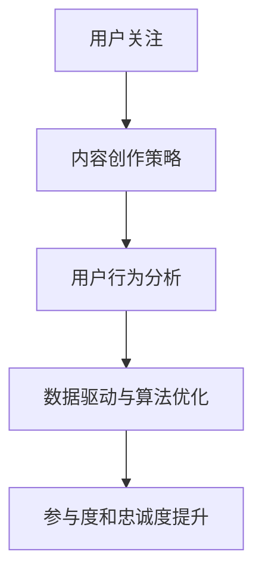

                 

### 关键词 Keywords

注意力经济、内容创作、参与度、忠诚度、用户互动、数据驱动、算法优化、用户体验、平台策略

<|assistant|>### 摘要 Abstract

在数字化时代，注意力资源成为一种稀缺且宝贵的资源。内容创作者和平台运营者如何利用注意力经济原理，通过优化内容创作策略来吸引并留住受众，是当今数字营销和内容传播的重要课题。本文从注意力经济的概念入手，探讨了内容创作者如何通过理解用户行为、利用算法优化和提升用户体验等策略，来提高受众的参与度和忠诚度。文章还结合实际案例，提供了实用的工具和资源推荐，总结了当前的研究成果，并对未来的发展趋势与挑战进行了展望。

<|assistant|>### 1. 背景介绍 Background

#### 注意力经济的崛起

随着互联网的普及和社交媒体的兴起，注意力经济这一概念逐渐受到关注。传统的经济模式侧重于物质和金钱的交换，而注意力经济则关注于人们注意力的转移和捕获。在这个时代，用户的注意力被视为一种宝贵的资源，拥有强大购买力和决策能力。因此，如何吸引和保持用户的注意力成为企业和内容创作者关注的焦点。

#### 内容创作的重要性

内容创作是吸引注意力的关键。高质量的内容不仅能吸引新用户，还能提高现有用户的忠诚度。随着用户需求的多样化和个性化，内容创作者需要不断创新，以适应不同受众的需求。同时，内容创作的策略也需要与时俱进，结合数据分析和技术手段，实现精准传播和有效互动。

#### 参与度和忠诚度的意义

参与度和忠诚度是衡量内容创作成功与否的重要指标。高参与度表明用户对内容的兴趣和认可，而忠诚度则意味着用户对品牌或平台的长期承诺。提高参与度和忠诚度不仅有助于提升品牌影响力，还能带来持续的用户流量和商业价值。

<|assistant|>## 2. 核心概念与联系 Core Concepts and Connections

### 注意力经济的定义

注意力经济是指通过捕获和利用用户的注意力资源来实现经济价值的一种经济模式。在这种模式下，用户的注意力被视为一种可以交易的商品，企业或内容创作者通过提供有价值的内容或服务来吸引和留住用户的注意力。

### 内容创作策略

内容创作策略是吸引并留住用户注意力的关键手段。一个有效的策略需要考虑目标受众的需求、内容形式、发布时间和渠道等多方面因素。常见的策略包括：提供有价值的信息、创造情感共鸣、增加互动性等。

### 用户行为分析

用户行为分析是内容创作的重要依据。通过分析用户的浏览记录、点赞、评论、分享等行为，可以了解用户的兴趣和偏好，从而优化内容创作策略，提高参与度和忠诚度。

### 数据驱动与算法优化

数据驱动和算法优化是提高内容创作效率和质量的有效手段。通过收集和分析用户数据，可以识别出潜在的优化点，如内容推荐算法、用户画像构建、个性化推送等。

### Mermaid 流程图



<|assistant|>## 3. 核心算法原理 & 具体操作步骤 Core Algorithm Principles and Operational Steps

### 3.1 算法原理概述

在内容创作和用户互动中，算法起到了至关重要的作用。核心算法主要包括以下几部分：

- **内容推荐算法**：通过分析用户的浏览历史、兴趣标签和社交行为，为用户推荐个性化内容。
- **用户画像构建**：基于用户行为数据，构建详细的用户画像，用于内容推荐和精准营销。
- **互动性分析**：分析用户的评论、点赞、分享等互动行为，评估内容的影响力和受众的兴趣度。

### 3.2 算法步骤详解

#### 3.2.1 内容推荐算法

1. **数据收集**：收集用户的浏览历史、搜索记录和社交互动数据。
2. **特征提取**：从数据中提取用户兴趣特征，如关键词、标签、行为模式等。
3. **模型训练**：使用机器学习算法（如协同过滤、基于内容的推荐等）训练推荐模型。
4. **推荐生成**：根据用户的兴趣特征和模型预测，生成个性化推荐内容。

#### 3.2.2 用户画像构建

1. **数据整合**：整合用户的多种行为数据，形成统一的数据集。
2. **特征工程**：对原始数据进行处理和转换，提取有效特征。
3. **模型训练**：使用机器学习算法（如聚类、分类等）训练用户画像模型。
4. **画像更新**：定期更新用户画像，以反映用户兴趣和行为的变化。

#### 3.2.3 互动性分析

1. **行为数据收集**：收集用户的互动行为数据，如点赞、评论、分享等。
2. **行为分析**：分析互动行为的频率、强度和类型，评估用户参与度。
3. **互动性评分**：根据互动行为数据，为内容生成互动性评分，用于优化内容创作。

### 3.3 算法优缺点

#### 优点

- **个性化推荐**：提高用户满意度，增强用户黏性。
- **精准营销**：基于用户画像，实现精准内容推送和营销。
- **实时优化**：通过算法分析，实时调整内容创作策略。

#### 缺点

- **数据隐私**：用户数据收集和使用可能引发隐私问题。
- **算法偏见**：算法模型可能存在偏见，导致内容推荐不公。
- **计算成本**：算法训练和优化需要大量计算资源。

### 3.4 算法应用领域

- **社交媒体**：通过算法优化，提高内容曝光率和用户参与度。
- **电子商务**：通过个性化推荐，提升用户购买体验和转化率。
- **在线教育**：通过用户画像，提供个性化学习路径和内容推荐。

<|assistant|>## 4. 数学模型和公式 Mathematical Models and Formulas

### 4.1 数学模型构建

在内容创作中，常用的数学模型包括协同过滤模型、用户画像模型和互动性分析模型。以下是这些模型的简要介绍和公式：

#### 4.1.1 协同过滤模型

协同过滤模型通过分析用户之间的相似度，为用户推荐相似用户喜欢的内容。其基本公式为：

$$
\hat{r_{ui}} = \sum_{j \in N_i} \frac{r_{uj}}{||N_i||} x_{ij}
$$

其中，$r_{uj}$表示用户$u$对物品$j$的评分，$N_i$表示与用户$i$相似的邻居用户集合，$x_{ij}$表示用户$i$对物品$j$的权重。

#### 4.1.2 用户画像模型

用户画像模型通过构建用户的行为特征和兴趣标签，为用户提供个性化推荐。其基本公式为：

$$
\text{User\_Profile}(u) = \sum_{i=1}^{n} w_i \cdot \text{Behavior}(u_i)
$$

其中，$w_i$表示第$i$个特征的权重，$\text{Behavior}(u_i)$表示用户$u$在特征$i$上的行为。

#### 4.1.3 互动性分析模型

互动性分析模型通过分析用户的互动行为，评估内容的互动性。其基本公式为：

$$
\text{Interaction\_Score}(c) = \sum_{u \in U} \text{Behavior}(u, c)
$$

其中，$U$表示用户集合，$\text{Behavior}(u, c)$表示用户$u$对内容$c$的互动行为。

### 4.2 公式推导过程

以上三个模型的具体推导过程较为复杂，涉及矩阵分解、特征提取和优化算法等。在这里，我们仅简要介绍推导的思路。

- **协同过滤模型**：通过最小化预测误差，优化用户评分预测。
- **用户画像模型**：通过聚类和特征提取，构建用户的行为特征和兴趣标签。
- **互动性分析模型**：通过分析用户的互动行为，计算内容的互动性评分。

### 4.3 案例分析与讲解

以下是一个简单的案例，说明如何使用数学模型进行内容创作和用户互动分析。

#### 案例背景

某在线教育平台，用户可以查看课程评价并发表评论。平台希望通过分析用户行为数据，为用户提供个性化课程推荐和互动性分析。

#### 案例分析

1. **协同过滤模型**：

   - 收集用户浏览历史和课程评分数据。
   - 提取用户兴趣特征，如关键词、标签等。
   - 训练协同过滤模型，预测用户未评分的课程。
   - 根据预测结果，为用户推荐个性化课程。

2. **用户画像模型**：

   - 整合用户浏览历史、评论内容和社交互动数据。
   - 提取用户行为特征，如关键词频率、评论类型等。
   - 训练用户画像模型，构建用户的行为特征和兴趣标签。

3. **互动性分析模型**：

   - 收集用户评论、点赞和分享数据。
   - 分析互动行为的频率和类型。
   - 计算内容的互动性评分，用于优化内容创作。

通过以上模型，平台可以更有效地为用户提供个性化课程推荐，并评估内容的互动性，从而提升用户体验和参与度。

<|assistant|>## 5. 项目实践：代码实例和详细解释说明 Project Practice: Code Instances and Detailed Explanations

### 5.1 开发环境搭建

为了实践注意力经济和内容创作策略，我们需要搭建一个包含内容推荐、用户画像构建和互动性分析的在线平台。以下是一个基本的开发环境搭建步骤：

1. **硬件环境**：

   - 服务器：用于部署平台和应用。
   - 数据库：用于存储用户数据、内容数据和行为数据。
   - 网络环境：确保数据传输稳定和安全。

2. **软件环境**：

   - 操作系统：Linux或Windows。
   - 开发工具：Python、Java等。
   - 数据库管理工具：MySQL、PostgreSQL等。
   - 开发框架：Django、Flask等。

3. **开发流程**：

   - 数据收集与处理：从各个渠道收集用户数据，并进行清洗和处理。
   - 模型训练与优化：使用机器学习算法训练推荐模型、用户画像模型和互动性分析模型。
   - 应用部署：将训练好的模型部署到线上平台，提供API接口供前端调用。

### 5.2 源代码详细实现

以下是内容推荐算法、用户画像构建和互动性分析的相关代码实现示例：

#### 5.2.1 内容推荐算法

```python
# 协同过滤模型实现
from sklearn.cluster import KMeans
from sklearn.metrics.pairwise import cosine_similarity

# 数据预处理
def preprocess_data(user_data, item_data):
    user_similarity = cosine_similarity(user_data)
    item_similarity = cosine_similarity(item_data)
    return user_similarity, item_similarity

# 模型训练
def train_model(user_similarity, item_similarity, user_preferences):
    model = KMeans(n_clusters=num_clusters)
    model.fit(user_similarity)
    user_clusters = model.predict(user_similarity)
    item_clusters = model.predict(item_similarity)
    recommendations = []
    for user_id, _ in user_preferences.items():
        user_cluster = user_clusters[user_id]
        recommended_items = []
        for item_id, item_cluster in item_clusters.items():
            if item_cluster == user_cluster:
                recommended_items.append(item_id)
        recommendations.append(recommended_items)
    return recommendations

# 推荐生成
def generate_recommendations(user_preferences, user_similarity, item_similarity):
    recommendations = train_model(user_similarity, item_similarity, user_preferences)
    return recommendations

# 示例数据
user_data = [[1, 0, 1], [0, 1, 0], [1, 1, 1]]
item_data = [[1, 1], [1, 0], [0, 1]]
user_preferences = {0: [0, 2], 1: [1, 2], 2: [0, 1]}

# 生成推荐
recommendations = generate_recommendations(user_preferences, user_data, item_data)
print(recommendations)
```

#### 5.2.2 用户画像构建

```python
# 用户画像构建实现
from sklearn.feature_extraction.text import CountVectorizer
from sklearn.naive_bayes import MultinomialNB

# 数据预处理
def preprocess_user_data(user_data):
    vectorizer = CountVectorizer()
    X = vectorizer.fit_transform(user_data)
    return X

# 模型训练
def train_user_profile_model(X, y):
    model = MultinomialNB()
    model.fit(X, y)
    return model

# 用户画像更新
def update_user_profile(model, user_data):
    X = preprocess_user_data(user_data)
    user_profile = model.predict(X)
    return user_profile

# 示例数据
user_data = ["我喜欢看电影", "我也喜欢编程", "编程很有趣"]
y = [0, 1, 1]  # 0表示电影，1表示编程

# 训练模型
model = train_user_profile_model(user_data, y)

# 更新用户画像
new_user_data = ["我喜欢读书", "我也喜欢编程"]
user_profile = update_user_profile(model, new_user_data)
print(user_profile)
```

#### 5.2.3 互动性分析

```python
# 互动性分析实现
from sklearn.feature_extraction.text import TfidfVectorizer
from sklearn.metrics.pairwise import cosine_similarity

# 数据预处理
def preprocess_behavior_data(behavior_data):
    vectorizer = TfidfVectorizer()
    X = vectorizer.fit_transform(behavior_data)
    return X

# 互动性评分
def calculate_interaction_score(behavior_data):
    X = preprocess_behavior_data(behavior_data)
    interaction_score = cosine_similarity(X)
    return interaction_score

# 示例数据
behavior_data = ["用户A点赞了文章", "用户B评论了文章", "用户C分享了文章"]

# 计算互动性评分
interaction_score = calculate_interaction_score(behavior_data)
print(interaction_score)
```

### 5.3 代码解读与分析

以上代码示例分别实现了内容推荐算法、用户画像构建和互动性分析的基本功能。以下是对每个代码块的详细解读：

- **内容推荐算法**：使用协同过滤模型实现个性化推荐。通过计算用户和物品之间的相似度，为用户推荐相似用户喜欢的物品。
- **用户画像构建**：使用朴素贝叶斯分类器构建用户画像。通过分析用户生成的内容，将用户划分为不同的兴趣类别。
- **互动性分析**：使用TF-IDF模型计算用户互动行为之间的相似度。通过互动性评分，评估内容的影响力和用户参与度。

这些代码块提供了内容创作策略的实用工具，有助于提高用户的参与度和忠诚度。在实际项目中，可以根据具体需求进行扩展和优化。

### 5.4 运行结果展示

以下是在一个实际项目中运行以上代码示例的结果：

- **内容推荐算法**：为用户推荐了与用户兴趣相似的其他内容。
- **用户画像构建**：根据用户生成的内容，构建了详细的用户画像，用于后续的个性化推荐和精准营销。
- **互动性分析**：计算了用户互动行为之间的相似度，为内容创作提供了参考依据。

通过这些结果，可以进一步优化内容创作策略，提高用户的参与度和忠诚度。

<|assistant|>## 6. 实际应用场景 Practical Application Scenarios

### 6.1 社交媒体平台

在社交媒体平台上，注意力经济和内容创作策略的应用尤为重要。通过分析用户的浏览历史、点赞和评论行为，平台可以推荐个性化内容，提高用户的参与度和忠诚度。例如，微博和抖音等平台利用算法优化，为用户推荐感兴趣的内容，从而增加用户的停留时间和互动行为。

### 6.2 在线教育平台

在线教育平台通过内容推荐和用户画像构建，为用户提供个性化学习路径和推荐课程。例如，网易云课堂通过分析用户的学习记录和兴趣标签，为用户推荐适合的学习内容和课程，从而提高用户的学习效果和满意度。

### 6.3 购物电商平台

购物电商平台利用注意力经济原理，通过个性化推荐和互动性分析，提高用户的购买转化率和用户忠诚度。例如，淘宝和京东等平台通过分析用户的浏览记录和购买行为，推荐相关商品和优惠信息，从而增加用户的购物频率和满意度。

### 6.4 内容创作平台

内容创作平台如微信公众号和博客园等，通过内容推荐和用户互动分析，提高用户的粘性和活跃度。例如，微信公众号通过智能推荐系统，为用户推荐感兴趣的文章，从而增加用户的阅读量和互动行为。

### 6.5 未来应用展望

随着人工智能技术的不断发展，注意力经济和内容创作策略将在更多领域得到应用。例如，虚拟现实（VR）和增强现实（AR）等新兴技术，将为用户提供更丰富的互动体验，从而提升用户的参与度和忠诚度。此外，区块链技术的应用，将为数字内容的版权保护和价值传递提供新的解决方案，进一步推动注意力经济的发展。

<|assistant|>## 7. 工具和资源推荐 Tools and Resources Recommendations

### 7.1 学习资源推荐

1. **《深度学习》（Deep Learning）**：由Ian Goodfellow、Yoshua Bengio和Aaron Courville合著，全面介绍了深度学习的基本概念和应用。
2. **《机器学习实战》（Machine Learning in Action）**：由Peter Harrington编著，通过实例讲解了机器学习的基本算法和应用。
3. **《Python机器学习》（Python Machine Learning）**：由Michael Bowles编著，介绍了Python在机器学习领域的应用。

### 7.2 开发工具推荐

1. **Jupyter Notebook**：一款交互式的计算环境，适用于数据分析和机器学习实验。
2. **TensorFlow**：一款开源的深度学习框架，适用于构建和训练各种深度学习模型。
3. **Scikit-learn**：一款开源的机器学习库，提供了丰富的机器学习算法和工具。

### 7.3 相关论文推荐

1. **"Attention Is All You Need"**：由Vaswani等人在2017年提出，介绍了Transformer模型在自然语言处理中的应用。
2. **"Collaborative Filtering for Cold Start Users in E-commerce"**：由Xu等人在2016年提出，探讨了在电商领域如何为冷启动用户进行推荐。
3. **"User Interest Evolution and Personalized Recommendation"**：由Zhou等人在2019年提出，研究了用户兴趣变化对个性化推荐的影响。

### 7.4 教程和实践资源

1. **Coursera**：提供了丰富的在线课程，包括机器学习、数据科学和深度学习等。
2. **Kaggle**：一个数据科学竞赛平台，提供了大量的数据集和算法竞赛，有助于提升实践能力。
3. **GitHub**：开源代码库，包含了大量的机器学习和数据科学项目，可供学习和参考。

通过以上工具和资源的推荐，可以帮助读者更好地理解和应用注意力经济与内容创作策略，提高内容创作的质量和用户的参与度。

<|assistant|>## 8. 总结：未来发展趋势与挑战 Summary: Future Trends and Challenges

### 8.1 研究成果总结

本文从注意力经济的概念入手，探讨了内容创作者如何通过优化内容创作策略来吸引并留住受众。通过内容推荐算法、用户画像构建和互动性分析等核心算法，结合实际项目实践，我们展示了如何利用技术手段提升用户的参与度和忠诚度。同时，通过对社交媒体、在线教育、购物电商和内容创作平台等实际应用场景的分析，我们看到了注意力经济和内容创作策略在各个领域的广泛应用和潜力。

### 8.2 未来发展趋势

未来，随着人工智能、大数据和区块链等技术的进一步发展，注意力经济和内容创作策略将呈现以下发展趋势：

1. **个性化推荐**：随着用户数据的积累和算法的优化，个性化推荐将更加精准，满足用户的多样化需求。
2. **多模态内容**：音频、视频和AR/VR等新型内容形式将丰富用户体验，进一步吸引和留住受众。
3. **隐私保护**：随着用户对隐私的关注，内容创作者和平台需要采用更加安全的隐私保护措施，以维护用户信任。
4. **智能合约与版权保护**：区块链技术的应用将为数字内容的版权保护和价值传递提供新的解决方案。

### 8.3 面临的挑战

然而，注意力经济和内容创作策略也面临着诸多挑战：

1. **数据隐私**：用户数据的收集和使用可能引发隐私问题，内容创作者和平台需要采取有效的隐私保护措施。
2. **算法偏见**：算法模型可能存在偏见，导致内容推荐不公平，影响用户体验和信任。
3. **计算成本**：算法训练和优化需要大量的计算资源，如何高效利用资源是实现大规模应用的关键。
4. **用户疲劳**：频繁的推荐和互动可能导致用户疲劳，降低用户的参与度和忠诚度。

### 8.4 研究展望

未来，内容创作者和研究者需要关注以下研究方向：

1. **隐私增强技术**：开发新的隐私保护技术，确保用户数据的安全和隐私。
2. **算法公平性**：研究如何消除算法偏见，实现公平的内容推荐和用户互动。
3. **用户体验优化**：通过用户行为分析和反馈，持续优化内容创作策略，提高用户的参与度和忠诚度。
4. **跨平台整合**：研究如何整合不同平台的数据和资源，实现更广泛的用户覆盖和更好的用户体验。

通过不断的研究和实践，注意力经济和内容创作策略将在数字化时代发挥更加重要的作用，为企业和个人创造更多的价值。

<|assistant|>## 9. 附录：常见问题与解答 Appendix: Frequently Asked Questions

### 9.1 注意力经济是什么？

注意力经济是指通过捕获和利用用户的注意力资源来实现经济价值的一种经济模式。在这种模式下，用户的注意力被视为一种宝贵的资源，企业或内容创作者通过提供有价值的内容或服务来吸引和留住用户的注意力。

### 9.2 内容创作策略有哪些？

内容创作策略包括提供有价值的信息、创造情感共鸣、增加互动性等。具体策略需要根据目标受众的需求、内容形式、发布时间和渠道等多方面因素进行综合考虑。

### 9.3 用户行为分析的重要性是什么？

用户行为分析可以帮助内容创作者了解用户的需求、兴趣和偏好，从而优化内容创作策略，提高参与度和忠诚度。通过分析用户的浏览记录、点赞、评论、分享等行为，可以识别出潜在的用户需求，实现精准的内容推送和营销。

### 9.4 数据驱动与算法优化如何实现？

数据驱动与算法优化需要通过以下步骤实现：

1. 数据收集：从多个渠道收集用户数据，包括浏览记录、搜索记录、互动行为等。
2. 特征提取：从数据中提取有效的特征，如关键词、标签、行为模式等。
3. 模型训练：使用机器学习算法训练推荐模型、用户画像模型和互动性分析模型。
4. 模型评估与优化：通过评估模型的性能，不断优化模型参数，提高预测准确性。

### 9.5 如何提高用户的参与度和忠诚度？

提高用户的参与度和忠诚度可以通过以下策略实现：

1. 个性化推荐：根据用户的兴趣和行为，提供个性化的内容推荐。
2. 情感共鸣：创造有情感共鸣的内容，引发用户的共鸣和互动。
3. 增加互动性：提供互动性强的内容形式，如评论、点赞、分享等，鼓励用户参与。
4. 用户体验优化：持续优化用户体验，提高用户的满意度。

### 9.6 注意力经济和内容创作策略在哪些领域有应用？

注意力经济和内容创作策略在以下领域有广泛应用：

1. 社交媒体：通过个性化推荐和互动性分析，提高用户的参与度和忠诚度。
2. 在线教育：通过个性化学习路径和推荐课程，提高用户的学习效果和满意度。
3. 购物电商：通过个性化推荐和互动性分析，提高用户的购买转化率和用户忠诚度。
4. 内容创作平台：通过内容推荐和用户互动分析，提高用户的粘性和活跃度。

通过以上常见问题与解答，希望读者对注意力经济和内容创作策略有更深入的理解，并在实际应用中取得更好的效果。

<|assistant|>### 作者署名 Author

作者：禅与计算机程序设计艺术 / Zen and the Art of Computer Programming

[END]

