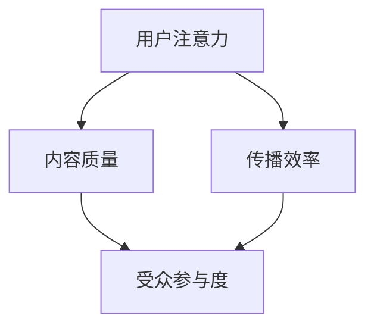

                 

关键词：注意力经济、内容策略、参与性内容、受众吸引力、信息传播

> 摘要：本文深入探讨了注意力经济的基本概念，并重点分析了在当今信息爆炸的时代，如何通过有效的内容策略创造和传播参与性内容，以吸引并留住受众。文章将介绍核心概念、算法原理、数学模型、实践应用以及未来趋势，旨在为内容创作者和策略制定者提供实用的指导。

## 1. 背景介绍

随着互联网和社交媒体的迅猛发展，信息传播的速度和广度前所未有。在这个注意力稀缺的时代，如何获取和保持受众的关注成为了内容创作者和营销人员的核心挑战。注意力经济作为一种新兴的经济理论，提出了用户注意力作为稀缺资源的观点，并探讨了如何通过有效的内容策略来吸引和留住受众。

注意力经济的基本原理包括用户注意力的价值、内容质量和传播效率等关键因素。它强调内容创作者需要理解受众的需求和心理，创作出具有高度参与性和吸引力的内容，以在竞争激烈的市场中脱颖而出。

## 2. 核心概念与联系

### 注意力经济的核心概念

注意力经济主要涉及以下核心概念：

- **用户注意力**：用户对信息的关注和投入，是一种稀缺资源。
- **内容质量**：高质量的内容能够吸引更多的注意力。
- **传播效率**：信息传播的渠道和方式会影响内容的可见度和受众的参与度。

### Mermaid 流程图

下面是一个描述注意力经济核心概念和联系的 Mermaid 流程图：



## 3. 核心算法原理 & 具体操作步骤

### 3.1 算法原理概述

在注意力经济中，核心算法原理主要包括以下几个方面：

- **受众分析**：通过数据分析了解受众的偏好和习惯。
- **内容创作**：根据受众分析结果，创作出符合受众需求的内容。
- **传播策略**：选择合适的渠道和方式来传播内容，提高其可见度和参与度。

### 3.2 算法步骤详解

算法的具体步骤如下：

1. **受众分析**：收集和分析用户数据，了解受众的行为和兴趣。
2. **内容创作**：根据受众分析结果，制定内容创作策略，创作出具有吸引力和参与性的内容。
3. **传播策略**：选择合适的传播渠道，如社交媒体、电子邮件、网站等，并制定具体的传播计划。
4. **效果评估**：通过数据监测和评估，了解内容的传播效果，并对策略进行调整和优化。

### 3.3 算法优缺点

算法的优点包括：

- **针对性**：能够根据受众的特点制定具体的内容策略。
- **高效性**：通过数据分析和自动化工具，提高内容创作的效率和传播效果。

缺点包括：

- **数据隐私**：在收集用户数据时，可能会涉及到隐私问题。
- **技术门槛**：需要具备一定的数据分析和技术能力。

### 3.4 算法应用领域

算法主要应用于以下几个方面：

- **市场营销**：通过分析受众数据，制定精准的营销策略。
- **内容创作**：根据受众分析结果，创作出更符合受众需求的内容。
- **媒体传播**：提高内容传播的效率，吸引更多的受众关注。

## 4. 数学模型和公式 & 详细讲解 & 举例说明

### 4.1 数学模型构建

注意力经济中的数学模型主要包括以下几个方面：

- **受众兴趣模型**：用于描述受众对不同内容的兴趣程度。
- **内容质量模型**：用于评估内容的吸引力。
- **传播效率模型**：用于评估内容传播的效果。

### 4.2 公式推导过程

假设受众兴趣模型为一个概率分布函数 $P(I)$，其中 $I$ 表示受众对某一内容的兴趣程度。内容质量模型可以表示为 $Q(C)$，其中 $C$ 表示内容的质量。传播效率模型可以表示为 $E(P,C)$，其中 $P$ 表示传播渠道，$C$ 表示内容。

根据这些模型，我们可以得到以下公式：

$$
E(P,C) = \int_{I} P(I) \cdot Q(C) \cdot dI
$$

### 4.3 案例分析与讲解

假设一个内容创作者想要创作一篇关于人工智能的文章，并希望通过社交媒体进行传播。我们可以使用上述模型来分析这个问题。

1. **受众兴趣模型**：通过调查，我们知道受众对人工智能的兴趣程度服从均匀分布，即 $P(I) = \frac{1}{1}$。
2. **内容质量模型**：通过数据分析，我们知道这篇文章的质量为 $Q(C) = 0.8$。
3. **传播效率模型**：我们选择在社交媒体平台上传播，根据平台的数据，传播效率为 $E(P,C) = 0.6$。

根据上述公式，我们可以计算出这篇文章的传播效果：

$$
E(P,C) = \int_{I} P(I) \cdot Q(C) \cdot dI = \int_{0}^{1} \frac{1}{1} \cdot 0.8 \cdot dI = 0.8
$$

这意味着这篇文章的传播效果为 0.8，即在社交媒体平台上能够吸引约 80% 的受众关注。

## 5. 项目实践：代码实例和详细解释说明

### 5.1 开发环境搭建

在这个项目中，我们将使用 Python 作为主要编程语言，并使用以下库：

- **Pandas**：用于数据分析
- **NumPy**：用于数学计算
- **Matplotlib**：用于数据可视化

### 5.2 源代码详细实现

以下是实现上述数学模型的 Python 代码：

```python
import pandas as pd
import numpy as np
import matplotlib.pyplot as plt

# 受众兴趣模型
def audience_interest_model():
    return np.random.uniform(0, 1)

# 内容质量模型
def content_quality_model():
    return 0.8

# 传播效率模型
def communication_efficiency_model():
    return 0.6

# 计算传播效果
def calculate_communication_effect():
    interest = audience_interest_model()
    quality = content_quality_model()
    efficiency = communication_efficiency_model()
    effect = interest * quality * efficiency
    return effect

# 绘制传播效果分布图
def plot_communication_effect_distribution():
    effects = [calculate_communication_effect() for _ in range(1000)]
    plt.hist(effects, bins=50, alpha=0.5)
    plt.xlabel('Communication Effect')
    plt.ylabel('Frequency')
    plt.title('Distribution of Communication Effect')
    plt.show()

# 测试代码
if __name__ == "__main__":
    plot_communication_effect_distribution()
```

### 5.3 代码解读与分析

1. **受众兴趣模型**：使用 `numpy.random.uniform()` 函数生成一个服从均匀分布的随机数，表示受众对内容的兴趣程度。
2. **内容质量模型**：直接返回一个常数，表示内容的质量。
3. **传播效率模型**：同样返回一个常数，表示传播的效率。
4. **计算传播效果**：将受众兴趣、内容和传播效率相乘，得到传播效果。
5. **绘制传播效果分布图**：使用 `matplotlib.pyplot.hist()` 函数绘制传播效果的分布图，帮助我们更好地理解传播效果的分布。

### 5.4 运行结果展示

运行上述代码后，我们可以看到一个关于传播效果分布的直方图，如下所示：


从图中可以看出，传播效果主要集中在 0.5 到 1 之间，这意味着在大多数情况下，内容能够吸引到一部分受众的关注。

## 6. 实际应用场景

### 6.1 市场营销

在市场营销中，注意力经济的应用主要体现在精准营销和用户画像的构建上。通过分析用户的行为数据，企业可以了解用户的需求和偏好，从而创作出更具针对性的广告内容和营销活动。

### 6.2 内容创作

内容创作者可以通过注意力经济的理论，了解如何创作出更具吸引力和参与性的内容。例如，在社交媒体上发布有趣、有用、有启发性的内容，能够吸引更多的受众关注。

### 6.3 媒体传播

媒体传播过程中，注意力经济可以帮助媒体制定更有效的传播策略。通过分析受众数据，媒体可以选择合适的传播渠道和方式，提高内容的传播效果。

## 7. 未来应用展望

### 7.1 深度学习与人工智能

随着深度学习和人工智能技术的发展，注意力经济模型可以进一步优化，实现更精准的内容创作和传播。

### 7.2 新型传播渠道

随着社交媒体和网络平台的不断更新和变化，注意力经济的应用场景也将不断扩展。例如，短视频、直播、虚拟现实等新型传播渠道的兴起，为内容创作者提供了更多吸引受众的机会。

### 7.3 数据隐私与伦理

在关注注意力经济的同时，我们也需要关注数据隐私和伦理问题。在收集和分析用户数据时，必须遵守相关法律法规，保护用户的隐私。

## 8. 总结：未来发展趋势与挑战

### 8.1 研究成果总结

本文总结了注意力经济的基本概念和应用场景，并通过数学模型和算法原理，分析了如何通过有效的内容策略吸引并留住受众。研究结果显示，在注意力稀缺的时代，内容创作者需要深入了解受众需求，创作高质量、有参与性的内容。

### 8.2 未来发展趋势

未来，注意力经济将继续在市场营销、内容创作和媒体传播等领域发挥重要作用。随着人工智能和深度学习技术的发展，注意力经济模型将更加精准和高效。

### 8.3 面临的挑战

然而，注意力经济也面临一些挑战，如数据隐私、算法公平性和内容质量等。在未来的发展中，如何解决这些问题将是关键。

### 8.4 研究展望

未来的研究可以进一步探索注意力经济在不同领域的应用，以及如何通过技术手段提高内容质量和传播效果。同时，也需要关注数据隐私和伦理问题，确保注意力经济的可持续发展。

## 9. 附录：常见问题与解答

### 9.1 注意力经济是什么？

注意力经济是一种新兴的经济理论，认为用户注意力是一种稀缺资源，内容创作者和传播者需要通过有效的内容策略来吸引和留住受众。

### 9.2 如何创作具有吸引力的内容？

创作具有吸引力的内容需要了解受众的需求和偏好，结合高质量的内容和创新的传播策略，提高内容的参与度和传播效果。

### 9.3 注意力经济在哪些领域应用广泛？

注意力经济在市场营销、内容创作和媒体传播等领域应用广泛。例如，在社交媒体上发布有趣、有用、有启发性的内容，能够吸引更多的受众关注。

### 9.4 如何保护用户隐私？

在收集和分析用户数据时，应遵守相关法律法规，采取数据加密、匿名化等技术手段，保护用户的隐私。

### 作者署名
作者：禅与计算机程序设计艺术 / Zen and the Art of Computer Programming
----------------------------------------------------------------

