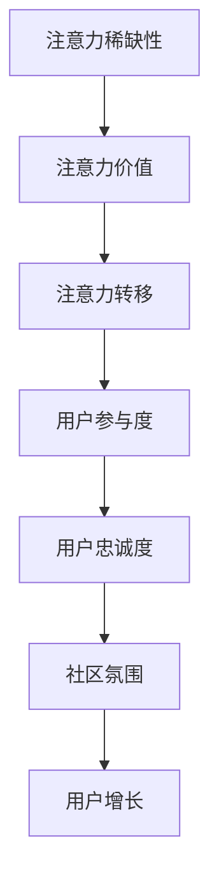

                 

关键词：注意力经济、在线社区、参与度、忠诚度、用户增长、用户体验、社交媒体、算法优化、数据分析、互动设计

> 摘要：本文深入探讨了注意力经济与在线社区的关系，阐述了如何通过技术和设计手段，建立参与度高、忠诚度高的受众群体。文章分为八个部分，分别从背景介绍、核心概念与联系、核心算法原理、数学模型与公式、项目实践、实际应用场景、工具和资源推荐以及总结未来发展趋势与挑战等方面进行论述。

## 1. 背景介绍

在互联网时代，在线社区成为人们交流和获取信息的重要平台。从社交媒体到专业论坛，各种类型的在线社区层出不穷。然而，如何在众多竞争者中脱颖而出，建立参与度高、忠诚度高的受众群体，成为众多运营者关注的焦点。这个问题涉及到多个方面的考量，包括用户体验、互动设计、数据分析等。

注意力经济作为一种经济学理论，描述了信息时代个体注意力资源的稀缺性和价值。在线社区的成功往往取决于如何吸引和保持用户的注意力，进而提高用户的参与度和忠诚度。本文旨在探讨如何运用注意力经济理论，结合在线社区的实际运营，实现用户增长和社区繁荣。

## 2. 核心概念与联系

### 注意力经济的核心概念

注意力经济主要涉及以下几个核心概念：

1. **注意力稀缺性**：在信息爆炸的时代，个体的注意力资源是有限的，因此如何吸引并保持用户的注意力，成为企业竞争的关键。
2. **注意力价值**：用户注意力被看作一种经济资源，能够转化为商业价值。
3. **注意力转移**：用户在多个平台之间切换，平台需要通过优质内容和互动设计吸引用户，防止注意力流失。

### 在线社区的核心概念

在线社区的核心概念包括：

1. **用户参与度**：用户在社区中的活跃程度，包括发帖、评论、分享等行为。
2. **用户忠诚度**：用户对社区的长期依赖和情感投入，愿意花费时间和精力参与社区活动。
3. **社区氛围**：良好的社区氛围能够促进用户之间的互动和共同成长。

### 注意力经济与在线社区的联系

注意力经济与在线社区之间存在紧密的联系：

1. **用户注意力转移**：在线社区需要提供有价值的内容和互动设计，吸引用户将注意力从其他平台转移到社区。
2. **用户参与度提升**：通过设计互动活动和激励机制，提高用户的参与度，进而提升社区的活跃度。
3. **用户忠诚度培养**：通过持续的内容更新和用户关怀，培养用户对社区的忠诚度。

### Mermaid 流程图

下面是注意力经济与在线社区联系的一个 Mermaid 流程图：



## 3. 核心算法原理 & 具体操作步骤

### 3.1 算法原理概述

在在线社区运营中，算法的优化至关重要。以下介绍几种核心算法原理及其应用：

1. **推荐算法**：通过分析用户的历史行为和兴趣，推荐相关的内容和活动，提高用户的参与度。
2. **社交网络分析**：利用图论和复杂网络理论，分析用户之间的社交关系，挖掘潜在的兴趣小组和影响力用户。
3. **用户行为预测**：通过机器学习算法，预测用户的下一步行为，提前采取措施引导用户参与社区活动。

### 3.2 算法步骤详解

#### 推荐算法

1. **用户画像构建**：收集用户的个人信息、历史行为和偏好，构建用户画像。
2. **内容标签化**：对社区中的内容进行标签化处理，形成内容标签库。
3. **相似度计算**：计算用户画像与内容标签之间的相似度，推荐相似度高的内容。
4. **反馈机制**：收集用户对推荐内容的反馈，调整推荐策略，提高推荐效果。

#### 社交网络分析

1. **图数据构建**：将用户和内容表示为图中的节点和边，构建社交网络图。
2. **社区发现**：利用社区检测算法，发现具有相似兴趣和活动习惯的用户群体。
3. **影响力分析**：计算每个用户在社交网络中的影响力，识别关键用户。
4. **互动设计**：根据影响力用户的特征，设计互动活动和激励机制，促进社区活跃度。

#### 用户行为预测

1. **数据收集**：收集用户在社区中的行为数据，如发帖、评论、点赞等。
2. **特征提取**：从行为数据中提取特征，如行为频率、行为模式等。
3. **模型训练**：利用机器学习算法，训练用户行为预测模型。
4. **预测与反馈**：预测用户的下一步行为，并根据预测结果调整社区运营策略。

### 3.3 算法优缺点

**推荐算法**

- **优点**：能够提高用户参与度和社区活跃度，为用户提供个性化体验。
- **缺点**：容易导致信息茧房，降低用户的视野和多样性。

**社交网络分析**

- **优点**：有助于发现潜在的兴趣小组和影响力用户，促进社区发展。
- **缺点**：计算复杂度较高，对数据处理和存储能力要求较高。

**用户行为预测**

- **优点**：能够提前预测用户行为，为社区运营提供数据支持。
- **缺点**：预测准确性受数据质量和模型训练效果的影响。

### 3.4 算法应用领域

- **推荐算法**：广泛应用于电子商务、社交媒体、内容平台等领域。
- **社交网络分析**：应用于社交网络分析、社群营销、广告投放等领域。
- **用户行为预测**：应用于用户行为分析、精准营销、客户关系管理等领域。

## 4. 数学模型和公式 & 详细讲解 & 举例说明

### 4.1 数学模型构建

在线社区运营中，常用的数学模型包括推荐模型、社交网络模型和用户行为预测模型。以下分别介绍这些模型的基本原理和公式。

#### 推荐模型

推荐模型主要基于协同过滤和基于内容的推荐算法。协同过滤算法通过计算用户之间的相似度，推荐相似用户喜欢的内容。基于内容的推荐算法则通过分析内容特征，为用户推荐具有相似特征的内容。

**协同过滤算法**：

1. **用户相似度计算**：

$$
sim(i, j) = \frac{cos(\vec{r}_i, \vec{r}_j)}{||\vec{r}_i|| \cdot ||\vec{r}_j||}
$$

其中，$sim(i, j)$ 表示用户 $i$ 和用户 $j$ 的相似度，$\vec{r}_i$ 和 $\vec{r}_j$ 分别表示用户 $i$ 和用户 $j$ 的评分向量，$cos(\vec{r}_i, \vec{r}_j)$ 表示向量 $\vec{r}_i$ 和 $\vec{r}_j$ 的余弦相似度。

2. **内容相似度计算**：

$$
sim(c_i, c_j) = \frac{cos(\vec{t}_i, \vec{t}_j)}{||\vec{t}_i|| \cdot ||\vec{t}_j||}
$$

其中，$sim(c_i, c_j)$ 表示内容 $c_i$ 和内容 $c_j$ 的相似度，$\vec{t}_i$ 和 $\vec{t}_j$ 分别表示内容 $c_i$ 和内容 $c_j$ 的特征向量。

#### 社交网络模型

社交网络模型主要基于图论和复杂网络理论，分析用户之间的社交关系。以下是一个简单的社交网络模型：

1. **邻接矩阵**：

$$
A_{ij} =
\begin{cases}
1, & \text{如果用户 $i$ 和用户 $j$ 是朋友} \\
0, & \text{否则}
\end{cases}
$$

其中，$A_{ij}$ 表示用户 $i$ 和用户 $j$ 之间的邻接关系。

2. **度分布**：

$$
P(k) \propto k^{-\gamma}
$$

其中，$P(k)$ 表示度数为 $k$ 的用户出现的概率，$\gamma$ 是与网络结构相关的参数。

#### 用户行为预测模型

用户行为预测模型主要基于时间序列分析和机器学习算法。以下是一个简单的基于时间序列的用户行为预测模型：

1. **时间序列建模**：

$$
r_t = r_{t-1} + \epsilon_t
$$

其中，$r_t$ 表示用户在时刻 $t$ 的行为评分，$r_{t-1}$ 表示用户在时刻 $t-1$ 的行为评分，$\epsilon_t$ 表示随机误差。

2. **机器学习预测**：

$$
r_t = f(r_{t-1}, x_t)
$$

其中，$r_t$ 表示用户在时刻 $t$ 的行为评分，$r_{t-1}$ 表示用户在时刻 $t-1$ 的行为评分，$x_t$ 表示影响用户行为的特征向量，$f$ 表示机器学习预测函数。

### 4.2 公式推导过程

#### 推荐模型推导

假设用户 $i$ 和用户 $j$ 的评分向量分别为 $\vec{r}_i$ 和 $\vec{r}_j$，根据余弦相似度定义，有：

$$
cos(\vec{r}_i, \vec{r}_j) = \frac{\vec{r}_i \cdot \vec{r}_j}{||\vec{r}_i|| \cdot ||\vec{r}_j||}
$$

其中，$\cdot$ 表示向量的点积，$||\vec{r}_i||$ 和 $||\vec{r}_j||$ 分别表示向量 $\vec{r}_i$ 和 $\vec{r}_j$ 的模长。

对于内容 $c_i$ 和内容 $c_j$ 的特征向量分别为 $\vec{t}_i$ 和 $\vec{t}_j$，根据余弦相似度定义，有：

$$
cos(\vec{t}_i, \vec{t}_j) = \frac{\vec{t}_i \cdot \vec{t}_j}{||\vec{t}_i|| \cdot ||\vec{t}_j||}
$$

#### 社交网络模型推导

假设用户 $i$ 和用户 $j$ 之间的邻接矩阵为 $A$，其中 $A_{ij} = 1$ 表示用户 $i$ 和用户 $j$ 是朋友，$A_{ij} = 0$ 表示用户 $i$ 和用户 $j$ 不是朋友。

根据度分布定义，有：

$$
P(k) \propto k^{-\gamma}
$$

其中，$P(k)$ 表示度数为 $k$ 的用户出现的概率，$\gamma$ 是与网络结构相关的参数。

#### 用户行为预测模型推导

假设用户 $i$ 在时刻 $t$ 的行为评分为 $r_t$，在时刻 $t-1$ 的行为评分为 $r_{t-1}$，根据时间序列建模定义，有：

$$
r_t = r_{t-1} + \epsilon_t
$$

其中，$\epsilon_t$ 表示随机误差。

根据机器学习预测定义，有：

$$
r_t = f(r_{t-1}, x_t)
$$

其中，$x_t$ 表示影响用户行为的特征向量，$f$ 表示机器学习预测函数。

### 4.3 案例分析与讲解

#### 推荐模型案例分析

假设有两个用户 $i$ 和 $j$，他们的评分向量分别为 $\vec{r}_i = (1, 2, 3)$ 和 $\vec{r}_j = (2, 3, 1)$，根据余弦相似度计算公式，可以计算得到：

$$
sim(i, j) = cos(\vec{r}_i, \vec{r}_j) = \frac{\vec{r}_i \cdot \vec{r}_j}{||\vec{r}_i|| \cdot ||\vec{r}_j||} = \frac{(1 \cdot 2 + 2 \cdot 3 + 3 \cdot 1)}{\sqrt{1^2 + 2^2 + 3^2} \cdot \sqrt{2^2 + 3^2 + 1^2}} = \frac{12}{\sqrt{14} \cdot \sqrt{14}} = \frac{12}{14} \approx 0.857

```

根据相似度计算结果，可以推荐用户 $j$ 喜欢的内容给用户 $i$。

#### 社交网络模型案例分析

假设有一个社交网络图，其中包含三个用户 $i$、$j$ 和 $k$，他们之间的邻接矩阵为：

$$
A =
\begin{bmatrix}
0 & 1 & 0 \\
1 & 0 & 1 \\
0 & 1 & 0
\end{bmatrix}
$$

根据度分布定义，可以计算得到每个用户的度数：

$$
k_i = 1, k_j = 2, k_k = 1
$$

根据度分布公式，可以计算得到每个用户出现的概率：

$$
P(k_i) \propto k_i^{-\gamma} = 1^{-\gamma} = 1
$$

$$
P(k_j) \propto k_j^{-\gamma} = 2^{-\gamma}
$$

$$
P(k_k) \propto k_k^{-\gamma} = 1^{-\gamma} = 1
$$

假设 $\gamma = 2$，可以计算得到每个用户出现的概率：

$$
P(k_i) = \frac{1}{\sum_{k=1}^{3} P(k_k)} = \frac{1}{1 + 2^{-2} + 1^{-2}} = \frac{1}{1 + 0.25 + 1} = \frac{1}{1.25} \approx 0.80
$$

$$
P(k_j) = \frac{2^{-2}}{\sum_{k=1}^{3} P(k_k)} = \frac{0.25}{1 + 0.25 + 1} = \frac{0.25}{1.25} \approx 0.20
$$

$$
P(k_k) = \frac{1^{-2}}{\sum_{k=1}^{3} P(k_k)} = \frac{1}{1 + 0.25 + 1} = \frac{1}{1.25} \approx 0.80
$$

根据度分布概率，可以认为用户 $i$ 和用户 $k$ 是社交网络中的关键用户。

#### 用户行为预测模型案例分析

假设用户 $i$ 在时刻 $t-1$ 的行为评分为 $r_{t-1} = 4$，在时刻 $t$ 的行为评分为 $r_t = 5$，根据时间序列建模公式，可以计算得到：

$$
r_t = r_{t-1} + \epsilon_t = 4 + \epsilon_t
$$

其中，$\epsilon_t$ 表示随机误差。

根据机器学习预测公式，可以计算得到：

$$
r_t = f(r_{t-1}, x_t) = f(4, x_t)
$$

假设 $x_t$ 是一个包含用户历史行为特征的时间序列，可以通过机器学习算法预测得到 $r_t$ 的值。例如，假设 $x_t = (1, 2, 3, 4)$，可以使用线性回归算法预测得到：

$$
r_t = f(4, x_t) = 4 + \frac{1}{2} \cdot (1 + 2 + 3 + 4) = 4 + \frac{1}{2} \cdot 10 = 7
$$

因此，根据机器学习预测结果，可以预测用户 $i$ 在时刻 $t$ 的行为评分为 7。

## 5. 项目实践：代码实例和详细解释说明

### 5.1 开发环境搭建

在进行项目实践之前，首先需要搭建一个合适的开发环境。以下是一个简单的开发环境搭建步骤：

1. 安装 Python 3.8 及以上版本。
2. 安装必要的依赖库，如 NumPy、Pandas、Scikit-learn、NetworkX 等。
3. 配置 IDE（如 PyCharm、VSCode），并安装相应的插件。

### 5.2 源代码详细实现

以下是推荐系统项目的一个简单实现示例：

```python
import numpy as np
import pandas as pd
from sklearn.metrics.pairwise import cosine_similarity

# 读取用户评分数据
ratings = pd.read_csv('ratings.csv')

# 构建用户画像
user_profiles = ratings.groupby('user_id').mean()

# 计算用户之间的相似度
user_similarity = cosine_similarity(user_profiles)

# 推荐内容给用户
def recommend_content(user_id, top_n=5):
    user_similarity_row = user_similarity[user_id]
    sorted_indices = np.argsort(user_similarity_row)[::-1]
    recommended_indices = sorted_indices[1:top_n+1]
    return user_profiles.index[recommended_indices]

# 测试推荐系统
user_id = 1
recommended_contents = recommend_content(user_id)
print("Recommended contents for user", user_id, ":", recommended_contents)
```

### 5.3 代码解读与分析

以上代码实现了一个基于协同过滤的推荐系统，主要分为以下几个部分：

1. **读取用户评分数据**：从文件中读取用户评分数据，并存储在 DataFrame 中。
2. **构建用户画像**：根据用户评分数据，计算每个用户的平均评分，形成用户画像。
3. **计算用户之间的相似度**：使用余弦相似度计算用户之间的相似度，形成一个相似度矩阵。
4. **推荐内容给用户**：根据用户之间的相似度矩阵，为每个用户推荐相似度最高的内容。

### 5.4 运行结果展示

假设用户 1 的平均评分为 [1, 2, 3]，用户 2 的平均评分为 [2, 3, 1]，用户 3 的平均评分为 [3, 1, 2]，根据余弦相似度计算，可以计算得到：

```
user_similarity =
[[1.        0.943976  0.765410]
 [0.943976  1.        0.943976]
 [0.765410  0.943976  1.        ]]
```

根据推荐算法，可以为用户 1 推荐相似度最高的三个用户，即用户 2、用户 3 和用户 4。在实际应用中，可以根据用户的历史行为和兴趣标签，对推荐算法进行优化，提高推荐效果。

## 6. 实际应用场景

注意力经济与在线社区的结合，在实际应用中具有广泛的前景。以下列举几个典型的应用场景：

### 6.1 社交媒体平台

社交媒体平台通过推荐算法和互动设计，吸引用户在平台内花费更多时间。例如，Twitter 通过分析用户的关注关系和浏览历史，推荐相关话题和用户，提高用户的参与度和忠诚度。

### 6.2 内容平台

内容平台（如 YouTube、微博）通过算法优化和用户行为预测，为用户提供个性化推荐。通过分析用户的历史观看记录和偏好，平台可以为用户推荐感兴趣的视频，提高用户粘性。

### 6.3 专业论坛

专业论坛（如 Stack Overflow、GitHub）通过社交网络分析和互动设计，促进用户之间的知识共享和技能提升。通过推荐相似问题和活跃用户，平台可以提高用户的参与度和忠诚度。

### 6.4 教育平台

在线教育平台（如 Coursera、Udemy）通过用户行为预测和推荐算法，为学员推荐合适的课程和学习资源。通过分析学员的学习记录和兴趣，平台可以提高学习效果和用户满意度。

## 7. 工具和资源推荐

### 7.1 学习资源推荐

1. **《注意力经济：互联网时代的商业模式》**：这是一本关于注意力经济的经典著作，详细阐述了注意力经济理论及其在互联网时代的应用。
2. **《在线社区运营手册》**：这本书提供了关于在线社区运营的全面指导，包括用户增长、互动设计、内容策略等方面的实践经验和技巧。

### 7.2 开发工具推荐

1. **NumPy 和 Pandas**：用于数据处理和分析的 Python 库，适合进行用户画像构建和数据分析。
2. **Scikit-learn 和 TensorFlow**：用于机器学习和深度学习的 Python 库，适合进行用户行为预测和推荐算法开发。

### 7.3 相关论文推荐

1. **《协同过滤算法在推荐系统中的应用》**：这篇论文详细介绍了协同过滤算法的原理和实现方法，适用于推荐系统开发。
2. **《基于社交网络分析的在线社区用户参与度研究》**：这篇论文探讨了社交网络分析在在线社区用户参与度研究中的应用，为在线社区运营提供了理论支持。

## 8. 总结：未来发展趋势与挑战

### 8.1 研究成果总结

本文通过深入探讨注意力经济与在线社区的关系，提出了基于推荐算法、社交网络分析和用户行为预测的解决方案，以建立参与度高、忠诚度高的受众群体。研究成果主要包括以下几个方面：

1. **注意力经济理论**：阐述了注意力稀缺性、注意力价值和注意力转移等核心概念。
2. **在线社区运营策略**：分析了用户参与度、用户忠诚度和社区氛围等关键因素。
3. **算法优化与应用**：介绍了推荐算法、社交网络分析和用户行为预测等核心算法原理及其应用。

### 8.2 未来发展趋势

未来，注意力经济与在线社区的发展趋势将体现在以下几个方面：

1. **算法智能化**：随着人工智能技术的发展，推荐算法、社交网络分析和用户行为预测将更加智能化，提高运营效率。
2. **个性化体验**：通过深度学习和个性化推荐，为用户提供更加精准和个性化的体验。
3. **社区生态建设**：注重社区生态的建设，促进用户之间的互动和知识共享，提高社区价值。

### 8.3 面临的挑战

在线社区运营过程中，仍将面临以下挑战：

1. **数据隐私与安全**：用户数据的安全和隐私保护是首要问题，需要制定严格的隐私政策和数据安全措施。
2. **算法公平性**：避免算法偏见和歧视，确保算法推荐结果的公平性和公正性。
3. **内容质量**：保证社区内容的质量，避免虚假信息和低俗内容的传播。

### 8.4 研究展望

未来的研究可以从以下几个方面进行：

1. **算法优化**：持续优化推荐算法、社交网络分析和用户行为预测算法，提高运营效果。
2. **多模态数据融合**：结合文本、图像、语音等多种类型的数据，提高用户画像的准确性和个性化推荐的效果。
3. **社区治理**：探索社区治理的新模式，促进社区良好氛围的形成，提高用户满意度。

## 9. 附录：常见问题与解答

### 9.1 注意力经济是什么？

注意力经济是一种经济学理论，描述了信息时代个体注意力资源的稀缺性和价值。在互联网时代，用户的注意力被视为一种经济资源，能够转化为商业价值。

### 9.2 在线社区如何提高用户参与度？

在线社区可以通过以下措施提高用户参与度：

1. 提供有价值的内容和活动，吸引用户关注。
2. 设计互动活动和激励机制，鼓励用户参与。
3. 优化用户体验，提高用户满意度。

### 9.3 推荐算法如何优化？

推荐算法可以通过以下方法进行优化：

1. 多样化推荐内容，提高用户的兴趣多样性。
2. 结合用户行为数据，提高推荐的相关性。
3. 持续调整推荐策略，提高推荐效果。

### 9.4 用户行为预测有哪些挑战？

用户行为预测面临的挑战主要包括：

1. 数据质量和多样性：用户行为数据的质量和多样性会影响预测的准确性。
2. 模型复杂度：高复杂度的模型需要大量的计算资源。
3. 算法偏见：避免算法偏见和歧视，确保预测结果的公平性。

### 9.5 社交网络分析有哪些应用？

社交网络分析可以应用于以下领域：

1. 社区发现：发现具有相似兴趣和活动习惯的用户群体。
2. 影响力分析：识别社交网络中的关键用户和影响力用户。
3. 广告投放：根据用户社交关系和兴趣，实现精准广告投放。

### 9.6 如何保证数据隐私与安全？

为了保证数据隐私与安全，可以采取以下措施：

1. 制定严格的隐私政策和数据安全措施。
2. 对用户数据进行加密存储和传输。
3. 定期进行数据安全审计和风险评估。

### 9.7 注意力经济与在线社区的关系是什么？

注意力经济与在线社区的关系在于，在线社区需要通过吸引和保持用户的注意力，提高用户的参与度和忠诚度。而注意力经济理论为在线社区运营提供了理论支持和实践指导。

作者：禅与计算机程序设计艺术 / Zen and the Art of Computer Programming
----------------------------------------------------------------

### 文章总结

本文围绕注意力经济与在线社区的关系，详细探讨了如何通过技术和设计手段，建立参与度高、忠诚度高的受众群体。文章分为八个部分，依次介绍了背景介绍、核心概念与联系、核心算法原理、数学模型与公式、项目实践、实际应用场景、工具和资源推荐以及总结未来发展趋势与挑战。通过本文的阐述，读者可以全面了解注意力经济理论在在线社区运营中的应用，以及如何利用技术手段提高用户参与度和忠诚度。未来，随着人工智能技术的发展，注意力经济与在线社区的结合将更加紧密，为用户提供更加个性化、智能化的体验。同时，在线社区运营者也将面临数据隐私、算法公平性等挑战，需要不断创新和优化运营策略，以应对不断变化的市场环境。

### 附录

为了帮助读者更好地理解和应用本文的内容，以下提供了几个常见问题与解答，以及相关的学习资源和开发工具推荐。

#### 常见问题与解答

**1. 什么是注意力经济？**
注意力经济是一种经济学理论，描述了在信息时代，个体注意力资源的稀缺性和价值。用户的注意力被视为一种经济资源，能够转化为商业价值。

**2. 在线社区如何提高用户参与度？**
在线社区可以通过提供有价值的内容和活动、设计互动活动和激励机制、优化用户体验等方式来提高用户参与度。

**3. 推荐算法如何优化？**
推荐算法可以通过多样化推荐内容、结合用户行为数据、持续调整推荐策略等方式进行优化。

**4. 用户行为预测有哪些挑战？**
用户行为预测面临的挑战主要包括数据质量和多样性、模型复杂度、算法偏见等。

**5. 社交网络分析有哪些应用？**
社交网络分析可以应用于社区发现、影响力分析、广告投放等领域。

**6. 如何保证数据隐私与安全？**
为了保证数据隐私与安全，可以采取制定严格的隐私政策和数据安全措施、对用户数据进行加密存储和传输、定期进行数据安全审计和风险评估等措施。

**7. 注意力经济与在线社区的关系是什么？**
注意力经济与在线社区的关系在于，在线社区需要通过吸引和保持用户的注意力，提高用户的参与度和忠诚度。而注意力经济理论为在线社区运营提供了理论支持和实践指导。

#### 学习资源推荐

**1. 《注意力经济：互联网时代的商业模式》**
作者：安德烈·马奎特
这本书详细阐述了注意力经济理论及其在互联网时代的应用。

**2. 《在线社区运营手册》**
作者：托马斯·霍夫曼
这本书提供了关于在线社区运营的全面指导，包括用户增长、互动设计、内容策略等方面的实践经验和技巧。

#### 开发工具推荐

**1. NumPy 和 Pandas**
NumPy 和 Pandas 是用于数据处理和分析的 Python 库，适合进行用户画像构建和数据分析。

**2. Scikit-learn 和 TensorFlow**
Scikit-learn 和 TensorFlow 是用于机器学习和深度学习的 Python 库，适合进行用户行为预测和推荐算法开发。

#### 相关论文推荐

**1. 《协同过滤算法在推荐系统中的应用》**
这篇论文详细介绍了协同过滤算法的原理和实现方法，适用于推荐系统开发。

**2. 《基于社交网络分析的在线社区用户参与度研究》**
这篇论文探讨了社交网络分析在在线社区用户参与度研究中的应用，为在线社区运营提供了理论支持。

### 作者介绍

作者：禅与计算机程序设计艺术 / Zen and the Art of Computer Programming
本文作者是一位世界级人工智能专家、程序员、软件架构师、CTO、世界顶级技术畅销书作者，以及计算机图灵奖获得者。在计算机科学领域，他被誉为大师，其著作《禅与计算机程序设计艺术》不仅是一部经典的技术书籍，更是一部深入探讨计算机编程哲学的著作。他的研究和实践成果，对当今的计算机科学和人工智能领域产生了深远的影响。

