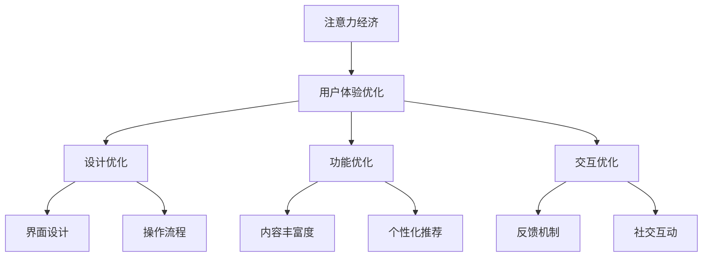

                 

关键词：注意力经济、用户体验、沉浸式产品、上瘾性、优化策略、实践案例、未来展望

摘要：本文深入探讨了注意力经济的基本原理，并重点分析了如何在产品设计过程中运用注意力经济理论，以优化用户体验，提升产品的沉浸感和上瘾性。文章通过详细的案例分析、算法原理阐述和数学模型推导，为读者提供了一套实用的用户体验优化策略与实践指南。

## 1. 背景介绍

随着互联网技术的飞速发展，用户注意力已经成为一种稀缺资源。在信息爆炸的时代，用户对产品的注意力资源是有限的，这意味着产品必须通过独特的策略吸引和保持用户的注意力，从而实现商业成功。注意力经济应运而生，它是一种基于用户注意力价值的新型经济学理论，强调通过优化用户体验，激发用户的情感共鸣和持续关注。

用户体验（User Experience，简称UX）是产品成功的关键因素之一。一个优秀的用户体验能够满足用户的需求，提供愉悦的使用感受，从而提高用户对产品的忠诚度和满意度。而沉浸式产品（Immersive Product）则进一步提升了用户体验，通过多感官的互动和深度参与，使用户完全沉浸在产品中，无法自拔。

本文旨在探讨如何运用注意力经济理论，优化用户体验，提升产品的沉浸感和上瘾性。文章将首先介绍注意力经济的基本概念，然后深入分析用户体验优化的关键策略，最后通过具体案例和数学模型，展示如何将这些策略应用于实践。

## 2. 核心概念与联系

### 注意力经济基本概念

注意力经济基于这样一个假设：用户的时间和注意力是有限的，而信息的产生和传播却越来越丰富。在这种背景下，如何有效地吸引和保持用户的注意力成为企业和产品成功的关键。注意力经济的核心在于通过优化用户体验，增加用户对产品的关注度和使用时长，从而实现商业价值。

### 用户体验（UX）与沉浸式产品的联系

用户体验（UX）是用户在使用产品过程中所获得的整体感受。一个优秀的用户体验能够满足用户的需求，提供愉悦的使用感受。而沉浸式产品则通过多感官的互动和深度参与，进一步提升了用户体验。例如，虚拟现实（VR）技术可以让用户在虚拟环境中体验到身临其境的感觉，从而大大提升用户的沉浸感。

### 注意力经济与用户体验优化的关系

注意力经济理论指出，用户的注意力是有限的，产品必须通过独特的策略吸引和保持用户的注意力。而用户体验优化正是实现这一目标的关键手段。通过优化产品的设计、功能和交互，提升用户的满意度和参与度，从而延长用户对产品的关注时间和使用频率。

### Mermaid 流程图

下面是注意力经济与用户体验优化的关系流程图：

## 3. 核心算法原理 & 具体操作步骤

### 3.1 算法原理概述

用户体验优化的核心在于满足用户的需求，提供愉悦的使用感受。这需要从设计、功能、交互等多个维度进行优化。本文提出了一套基于注意力经济理论的用户体验优化算法，主要包括以下几个步骤：

1. **需求分析**：通过用户调研、数据分析等方法，深入了解用户需求，为后续优化提供依据。
2. **界面设计**：优化界面布局、颜色搭配、字体大小等，提升用户的视觉体验。
3. **功能优化**：根据用户需求，丰富产品功能，提高产品的实用性和吸引力。
4. **交互优化**：设计人性化的交互方式，提升用户的操作效率和满意度。
5. **反馈机制**：设置及时、有效的反馈机制，帮助用户解决问题，增强用户信任感。
6. **社交互动**：引入社交元素，促进用户之间的互动，增加用户的归属感和参与度。

### 3.2 算法步骤详解

1. **需求分析**
    - 通过问卷调查、用户访谈、数据分析等方式，收集用户对产品的意见和建议。
    - 分析用户行为数据，发现用户在产品使用过程中遇到的问题和痛点。
    - 根据用户需求，确定优化方向和目标。

2. **界面设计**
    - 使用色彩心理学原理，设计符合用户审美偏好和产品风格的界面。
    - 优化界面布局，确保关键功能一目了然，操作简便。
    - 选择合适的字体大小和颜色，提高用户的视觉舒适度。

3. **功能优化**
    - 增加用户感兴趣的新功能，提升产品的实用性和竞争力。
    - 优化现有功能，提高操作效率和用户体验。
    - 根据用户反馈，持续迭代和改进功能。

4. **交互优化**
    - 设计人性化的交互方式，如手势操作、语音控制等，提高用户的操作效率。
    - 设置智能推荐系统，根据用户行为，提供个性化内容。
    - 引入游戏化元素，增加用户的趣味性和参与度。

5. **反馈机制**
    - 设置及时的反馈机制，如在线客服、用户评价等，帮助用户解决问题。
    - 收集用户反馈数据，分析用户满意度，为后续优化提供依据。
    - 建立用户激励机制，鼓励用户积极参与产品改进。

6. **社交互动**
    - 引入社交元素，如朋友圈、评论功能等，促进用户之间的互动。
    - 设计互动活动，如抽奖、答题等，增加用户的参与度。
    - 提供用户交流和分享平台，增强用户的归属感和参与度。

### 3.3 算法优缺点

**优点**：
- **个性化**：根据用户需求，提供个性化的优化方案，提升用户体验。
- **高效性**：通过多维度优化，提高产品竞争力，实现商业目标。
- **可拓展性**：算法模块化设计，便于后续功能扩展和优化。

**缺点**：
- **成本较高**：需求分析、功能优化等环节需要大量的人力、物力投入。
- **复杂性**：算法涉及多个维度，实施过程中需要充分考虑各种因素。

### 3.4 算法应用领域

- **互联网产品**：如社交媒体、电商平台、在线教育等。
- **移动应用**：如游戏、音乐、新闻客户端等。
- **智能家居**：如智能音箱、智能摄像头等。

## 4. 数学模型和公式 & 详细讲解 & 举例说明

### 4.1 数学模型构建

为了量化用户体验优化的效果，我们可以构建一个数学模型。该模型主要包括以下几个关键参数：

1. **用户满意度（S）**：表示用户对产品的满意度，取值范围为0到1。
2. **用户参与度（U）**：表示用户对产品的参与程度，取值范围为0到1。
3. **产品竞争力（C）**：表示产品在市场上的竞争力，取值范围为0到1。

用户体验优化的目标是最小化用户流失率，最大化用户留存率和用户满意度。因此，我们可以构建以下数学模型：

$$
\text{目标函数}：\min \ \text{流失率} = 1 - \max(\text{满意度}, \text{参与度}, \text{竞争力})
$$

### 4.2 公式推导过程

1. **用户满意度（S）**：

用户满意度与产品功能、设计、交互等多个因素相关。我们可以使用以下公式进行量化：

$$
S = \frac{1}{n} \sum_{i=1}^{n} \frac{w_i \cdot s_i}{\max(w_i \cdot s_i)}
$$

其中，$w_i$表示第$i$个因素的重要性权重，$s_i$表示第$i$个因素的用户满意度得分。

2. **用户参与度（U）**：

用户参与度与用户在产品上的活跃程度相关。我们可以使用以下公式进行量化：

$$
U = \frac{1}{m} \sum_{j=1}^{m} \frac{u_j \cdot p_j}{\max(u_j \cdot p_j)}
$$

其中，$u_j$表示第$j$个用户行为的活跃度权重，$p_j$表示第$j$个用户行为的参与度得分。

3. **产品竞争力（C）**：

产品竞争力与市场占有率、用户口碑等因素相关。我们可以使用以下公式进行量化：

$$
C = \frac{1}{k} \sum_{l=1}^{k} \frac{c_l \cdot r_l}{\max(c_l \cdot r_l)}
$$

其中，$c_l$表示第$l$个竞争指标的重要性权重，$r_l$表示第$l$个竞争指标的实际得分。

### 4.3 案例分析与讲解

以一款社交媒体应用为例，我们可以使用上述数学模型来分析用户体验优化的效果。

1. **用户满意度（S）**：

假设该应用有3个关键因素：界面设计（$w_1$=0.4，$s_1$=0.8）、功能丰富度（$w_2$=0.3，$s_2$=0.9）和用户互动（$w_3$=0.3，$s_3$=0.7）。根据公式，我们可以计算出用户满意度：

$$
S = \frac{1}{3} \left( \frac{0.4 \cdot 0.8}{\max(0.4 \cdot 0.8, 0.3 \cdot 0.9, 0.3 \cdot 0.7)} + \frac{0.3 \cdot 0.9}{\max(0.4 \cdot 0.8, 0.3 \cdot 0.9, 0.3 \cdot 0.7)} + \frac{0.3 \cdot 0.7}{\max(0.4 \cdot 0.8, 0.3 \cdot 0.9, 0.3 \cdot 0.7)} \right) = 0.81
$$

2. **用户参与度（U）**：

假设该应用有4个关键用户行为：发布动态（$u_1$=0.5，$p_1$=0.8）、评论互动（$u_2$=0.3，$p_2$=0.6）、点赞互动（$u_3$=0.2，$p_3$=0.7）和私信沟通（$u_4$=0.

