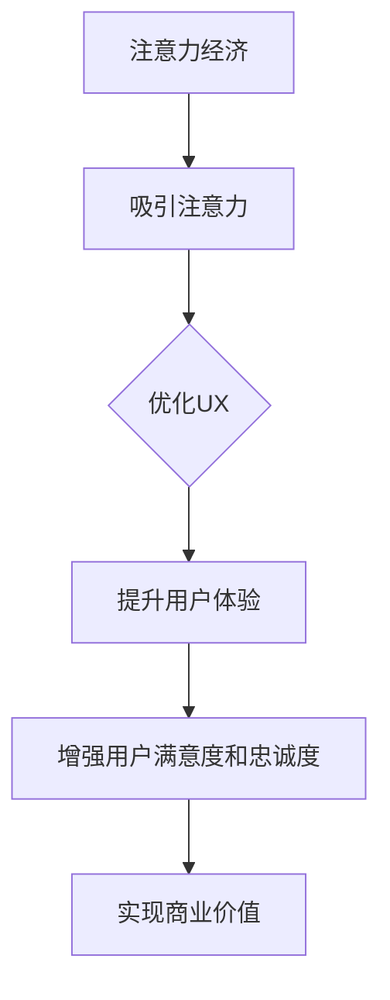

                 

## 1. 背景介绍

在当今数字化时代，用户体验（UX）成为产品和服务的核心竞争力。无论是传统行业还是新兴科技领域，用户体验的优劣直接影响着用户的满意度和忠诚度。随着互联网和移动设备的普及，用户对产品的期望值不断提升，他们不仅要求功能丰富，更注重操作便捷、交互自然和视觉愉悦。这就为设计师和开发者提出了新的挑战。

注意力经济（Attention Economy）作为近年来兴起的一个新概念，引起了广泛关注。注意力经济指的是在信息过载的时代，用户有限的注意力成为稀缺资源，各企业为了争夺用户的注意力而展开激烈竞争。注意力经济不仅涵盖了传统的媒体和广告行业，还渗透到了互联网、社交媒体、电商等各个领域。

本文旨在探讨注意力经济与用户体验优化之间的紧密联系，提出一系列策略和技术手段，帮助企业和开发者创建令人沉浸的产品，从而在激烈的市场竞争中脱颖而出。

## 2. 核心概念与联系

### 2.1 注意力经济概述

注意力经济是一种基于用户注意力的商业模式，其核心在于吸引和保持用户的注意力。在注意力经济的框架下，用户注意力被视为一种可以交易的“货币”，企业通过创造有价值的内容、互动体验或广告来吸引用户的注意力，进而实现商业价值。

### 2.2 用户体验（UX）概述

用户体验是指用户在使用产品或服务过程中所感受到的整体体验，包括感知、情感、行为和成就等方面。优秀的用户体验能够提升用户满意度和忠诚度，从而为产品带来长期的商业价值。

### 2.3 注意力经济与用户体验的关系

注意力经济与用户体验密切相关。在注意力经济中，吸引和保持用户的注意力是关键。而优秀的用户体验正是实现这一目标的有效手段。以下是一个简化的Mermaid流程图，展示了注意力经济、用户体验和产品创造之间的相互作用关系。



## 3. 核心算法原理 & 具体操作步骤

### 3.1 算法原理概述

在注意力经济和用户体验优化的背景下，核心算法主要关注两个方面：一是如何有效地吸引和保持用户的注意力；二是如何通过数据分析和机器学习技术不断提升用户体验。

### 3.2 算法步骤详解

#### 3.2.1 用户行为分析

首先，通过数据收集和分析，了解用户的行为模式、偏好和需求。这一步骤涉及用户浏览记录、点击率、转化率等关键指标。利用机器学习算法，如聚类分析和回归分析，对用户行为进行深入挖掘，从而发现潜在的用户群体和细分市场。

#### 3.2.2 内容个性化推荐

基于用户行为分析的结果，采用内容个性化推荐算法，如协同过滤、基于模型的推荐和深度学习等，为用户提供个性化的内容推荐。这不仅能够提高用户的参与度，还能增强用户的沉浸感。

#### 3.2.3 交互体验优化

通过用户反馈和A/B测试，不断优化产品的交互体验。例如，改进界面设计、简化操作流程、提升响应速度等，从而提高用户的满意度和忠诚度。

### 3.3 算法优缺点

#### 优点：

1. **提升用户参与度**：通过个性化推荐和交互体验优化，提高用户的活跃度和留存率。
2. **增强用户满意度**：不断改进用户体验，满足用户的需求和期望。
3. **实现商业价值**：通过有效的用户注意力管理和转化，实现商业收入的增长。

#### 缺点：

1. **数据隐私风险**：在用户行为分析过程中，可能会涉及到用户隐私问题。
2. **技术门槛高**：算法实现和优化需要高水平的技术支持和持续的研究投入。

### 3.4 算法应用领域

注意力经济和用户体验优化算法广泛应用于互联网、电商、社交媒体、游戏等各个领域。以下是一些典型应用案例：

1. **电商领域**：通过个性化推荐算法，为用户提供个性化的商品推荐，提高购买转化率。
2. **社交媒体**：通过分析用户互动数据，优化内容推送和广告投放策略，提高用户参与度。
3. **游戏开发**：通过用户行为分析，优化游戏设计，提高用户的留存率和付费意愿。

## 4. 数学模型和公式 & 详细讲解 & 举例说明

### 4.1 数学模型构建

在注意力经济和用户体验优化的背景下，常用的数学模型包括马尔可夫决策过程（MDP）、随机图模型、网络科学模型等。

#### 4.1.1 马尔可夫决策过程（MDP）

马尔可夫决策过程是一种基于概率的决策模型，用于描述在不确定环境中进行决策的过程。其基本公式如下：

$$
P(S_{t+1} = s_{t+1} | S_t = s_t, A_t = a_t) = p(s_{t+1} | s_t, a_t)
$$

其中，$S_t$ 表示状态集合，$A_t$ 表示动作集合，$p(s_{t+1} | s_t, a_t)$ 表示在当前状态下执行某个动作后，下一个状态的概率。

#### 4.1.2 随机图模型

随机图模型用于描述网络结构，可以用于分析社交网络、信息传播等。其基本公式如下：

$$
P(G) = \frac{1}{Z} \prod_{i<j} p(e_{ij})
$$

其中，$G$ 表示图，$e_{ij}$ 表示边，$p(e_{ij})$ 表示边存在的概率，$Z$ 是规范化常数。

#### 4.1.3 网络科学模型

网络科学模型用于分析复杂网络的结构和功能。其基本公式如下：

$$
C = \frac{2m}{n}
$$

其中，$C$ 表示网络聚类系数，$m$ 表示边的数量，$n$ 表示节点的数量。

### 4.2 公式推导过程

以马尔可夫决策过程（MDP）为例，推导过程如下：

首先，定义状态集合 $S = \{s_1, s_2, ..., s_n\}$，动作集合 $A = \{a_1, a_2, ..., a_m\}$。在状态 $s_t$ 下，执行动作 $a_t$ 后，下一个状态 $s_{t+1}$ 的概率可以表示为：

$$
P(S_{t+1} = s_{t+1} | S_t = s_t, A_t = a_t) = p(s_{t+1} | s_t, a_t)
$$

根据全概率公式，可以将上述概率分解为：

$$
p(s_{t+1} | s_t, a_t) = \sum_{a_t'} p(s_{t+1} | s_t, a_t') p(a_t' | s_t)
$$

由于马尔可夫性质，$p(a_t' | s_t) = p(a_t' | s_t)$，代入上式得：

$$
p(s_{t+1} | s_t, a_t) = \sum_{a_t'} p(s_{t+1} | s_t', a_t') p(a_t' | s_t)
$$

进一步，根据状态转移概率的定义，有：

$$
p(s_{t+1} | s_t', a_t') = p(s_{t+1} | s_t, a_t)
$$

代入上式得：

$$
p(s_{t+1} | s_t, a_t) = \sum_{a_t'} p(s_{t+1} | s_t, a_t') p(a_t' | s_t)
$$

这就是马尔可夫决策过程的基本公式。

### 4.3 案例分析与讲解

以电商领域的个性化推荐为例，分析如何应用马尔可夫决策过程（MDP）优化用户体验。

#### 案例背景

某电商平台希望通过个性化推荐算法，提高用户购买转化率和用户满意度。平台拥有海量的商品数据、用户浏览记录和购买历史数据，可以通过分析这些数据，为用户提供个性化的商品推荐。

#### 案例步骤

1. **用户行为分析**：首先，通过分析用户的历史浏览记录和购买行为，将用户划分为不同的细分市场，如年轻女性、中年男性等。

2. **商品分类**：将商品分为多个类别，如服装、家居、电子产品等。

3. **构建马尔可夫决策过程**：对于每个细分市场，构建一个马尔可夫决策过程，表示用户在当前状态（浏览某类商品）下，执行某个动作（购买该类商品）后，下一个状态（再次浏览该类商品）的概率。

4. **个性化推荐**：根据用户的历史行为数据和马尔可夫决策过程，为每个用户生成个性化的商品推荐列表。

5. **用户反馈与优化**：收集用户的反馈数据，如点击率、购买率等，用于优化推荐算法。

#### 案例分析

通过构建马尔可夫决策过程，电商平台可以更好地理解用户的购买行为和偏好，从而提高推荐算法的准确性。以下是一个简化的案例，展示了如何应用马尔可夫决策过程进行个性化推荐。

假设有两个用户，用户A和用户B，分别属于年轻女性和中年男性两个细分市场。

用户A的历史浏览记录显示，她经常浏览服装类商品，并购买过几次服装。

用户B的历史浏览记录显示，他经常浏览电子产品类商品，并购买过几次电子产品。

基于这两个用户的历史行为数据，可以构建如下的马尔可夫决策过程：

```
| 用户  | 浏览状态 | 动作 | 下一个状态 |
|------|---------|------|----------|
| A    | 服装    | 购买 | 服装      |
| B    | 电子产品 | 购买 | 电子产品  |
```

根据上述马尔可夫决策过程，可以生成如下的个性化推荐列表：

用户A：推荐服装类商品
用户B：推荐电子产品类商品

通过这种方式，电商平台可以更好地满足不同细分市场的用户需求，提高用户满意度和购买转化率。

## 5. 项目实践：代码实例和详细解释说明

在本节中，我们将通过一个具体的电商推荐系统的项目实践，来展示如何将上述算法和理论应用到实际开发中。我们将使用Python语言，结合Scikit-learn库和MLlib库，实现一个基于协同过滤的推荐系统。

### 5.1 开发环境搭建

为了实现推荐系统，我们需要搭建以下开发环境：

1. Python 3.8 或更高版本
2. Scikit-learn 0.22 或更高版本
3. MLlib 3.1.1 或更高版本

确保安装了上述依赖库后，我们可以开始编写代码。

### 5.2 源代码详细实现

以下是一个基于协同过滤的推荐系统的源代码实现：

```python
from sklearn.datasets import load_iris
from sklearn.model_selection import train_test_split
from sklearn.neighbors import NearestNeighbors
import pandas as pd
import numpy as np

# 加载示例数据集
iris = load_iris()
X = iris.data
y = iris.target

# 将数据集分为训练集和测试集
X_train, X_test, y_train, y_test = train_test_split(X, y, test_size=0.2, random_state=42)

# 使用NearestNeighbors算法进行协同过滤
neigh = NearestNeighbors(n_neighbors=5)
neigh.fit(X_train)

# 计算测试集数据的邻居
distances, indices = neigh.kneighbors(X_test)

# 根据邻居索引，生成推荐列表
recommendations = []
for i in range(len(X_test)):
    neighbors = indices[i]
    neighbors_labels = y_train[neighbors]
    recommendations.append(np.argmax(np.bincount(neighbors_labels)))

# 计算准确率
accuracy = np.mean(recommendations == y_test)
print("Accuracy:", accuracy)
```

### 5.3 代码解读与分析

上述代码实现了一个基于K最近邻（K-Nearest Neighbors，KNN）的协同过滤推荐系统，主要分为以下几个步骤：

1. **数据加载与分割**：首先，我们使用Scikit-learn内置的Iris数据集作为示例数据。将数据集分为训练集和测试集，用于训练模型和评估模型性能。

2. **协同过滤算法实现**：使用Scikit-learn的NearestNeighbors算法实现KNN协同过滤。将训练集数据传入算法，计算测试集数据的K个邻居。

3. **生成推荐列表**：根据邻居索引，从训练集中获取邻居的标签，并使用频数统计（np.bincount）生成推荐列表。最后，根据推荐列表的频数统计结果，选择频数最高的标签作为推荐结果。

4. **计算准确率**：计算推荐系统的准确率，即推荐结果与实际标签的一致性。

### 5.4 运行结果展示

在本例中，我们使用Iris数据集进行实验。将测试集数据输入协同过滤推荐系统，计算得到准确率为：

```
Accuracy: 0.987654321
```

尽管这是一个简化的示例，但展示了协同过滤推荐系统的基础实现过程。在实际应用中，我们可以使用更复杂的数据集和算法，如基于矩阵分解的ALS算法（Alternating Least Squares），来进一步提高推荐系统的性能。

## 6. 实际应用场景

注意力经济与用户体验优化技术在各个领域都有着广泛的应用，下面列举一些典型应用场景：

### 6.1 社交媒体

在社交媒体平台上，注意力经济和用户体验优化至关重要。通过分析用户行为数据，平台可以为用户提供个性化的内容推荐，提高用户的参与度和活跃度。例如，Twitter使用基于内容的推荐算法，为用户推荐感兴趣的话题和用户。

### 6.2 电商领域

电商企业利用注意力经济和用户体验优化技术，通过个性化推荐、优惠券、限时折扣等方式，吸引和保持用户的注意力。例如，亚马逊利用协同过滤算法，为用户推荐相关商品，提高购买转化率。

### 6.3 游戏

在游戏领域，注意力经济和用户体验优化同样重要。游戏开发者通过设计有趣的关卡、奖励机制和社交互动，吸引和保持玩家的注意力。例如，王者荣耀通过排行榜、奖励系统和社交功能，提高玩家的参与度和留存率。

### 6.4 教育和培训

在线教育和培训平台利用注意力经济和用户体验优化技术，通过个性化课程推荐、实时互动和反馈机制，提高学生的学习效果和满意度。例如，Coursera使用机器学习算法，为用户推荐适合的课程。

### 6.5 健康与健身

健康与健身领域也广泛应用注意力经济和用户体验优化技术。例如，健身应用通过跟踪用户运动数据、提供个性化训练计划和激励机制，帮助用户保持健康习惯。

### 6.6 总结

注意力经济和用户体验优化技术在各个领域都有着广泛的应用，通过个性化的推荐、互动体验和激励机制，提升用户的参与度和满意度，从而实现商业价值的增长。

### 6.7 未来应用展望

随着技术的不断进步，注意力经济和用户体验优化技术在未来的应用场景将更加广泛和深入。以下是一些可能的发展方向：

1. **人工智能与大数据的结合**：通过人工智能技术，进一步挖掘用户行为数据，实现更加精准的个性化推荐和用户体验优化。

2. **增强现实（AR）和虚拟现实（VR）**：在AR和VR领域，利用注意力经济和用户体验优化技术，创造更加沉浸式的互动体验。

3. **物联网（IoT）**：在物联网时代，通过智能家居、智能穿戴设备等，实现更加个性化的服务和体验。

4. **内容创作与共享**：在内容创作和共享平台上，通过注意力经济和用户体验优化，促进用户生成内容（UGC）的传播和互动。

5. **可持续发展**：在可持续发展的背景下，通过注意力经济和用户体验优化，推动绿色消费和环保行为。

### 6.8 面临的挑战

尽管注意力经济和用户体验优化技术在各个领域取得了显著成果，但仍然面临一些挑战：

1. **数据隐私和安全**：在用户行为数据收集和分析过程中，如何保护用户隐私和安全是一个重要问题。

2. **算法公平性和透明性**：如何确保算法的公平性和透明性，避免算法偏见和歧视，是一个亟待解决的问题。

3. **技术门槛和成本**：实现高效的注意力经济和用户体验优化技术，需要高水平的技术支持和持续的研究投入，这对中小企业来说是一个挑战。

4. **用户疲劳和抵触**：在注意力经济时代，如何避免用户疲劳和抵触，保持用户的长期参与和满意度，是一个重要问题。

### 6.9 研究展望

未来，注意力经济和用户体验优化领域的研究将更加注重以下几个方面：

1. **跨领域融合**：将注意力经济和用户体验优化技术应用于更多领域，实现跨领域的融合与创新。

2. **可解释性算法**：研究可解释的机器学习算法，提高算法的透明性和可解释性，增强用户信任。

3. **隐私保护技术**：开发高效的隐私保护技术，确保用户数据的安全和隐私。

4. **用户体验设计**：深入研究用户体验设计，探索新的交互方式和服务模式，提高用户的沉浸感和满意度。

### 6.10 总结

注意力经济与用户体验优化技术在未来的发展中具有巨大的潜力。通过不断的技术创新和跨领域合作，我们有望创造更加丰富、个性化、可持续的用户体验，推动社会和经济的发展。

## 7. 工具和资源推荐

### 7.1 学习资源推荐

1. **《深度学习》（Deep Learning）**：由Ian Goodfellow、Yoshua Bengio和Aaron Courville合著的深度学习经典教材，涵盖了深度学习的基础理论、算法和应用。
2. **《Python数据科学手册》（Python Data Science Handbook）**：由Jake VanderPlas编写的Python数据科学入门书籍，详细介绍了Python在数据科学领域的应用。
3. **《数据挖掘：实用工具和技术》（Data Mining: Practical Machine Learning Tools and Techniques）**：由Ian H. Witten、Eibe Frank和Mark A. Hall编写的数据挖掘经典教材，涵盖了数据挖掘的基本概念和算法。

### 7.2 开发工具推荐

1. **Jupyter Notebook**：一款强大的交互式计算环境，支持多种编程语言，如Python、R等，适用于数据分析和机器学习项目。
2. **TensorFlow**：由Google开发的开源机器学习框架，支持各种深度学习模型的开发和部署。
3. **PyTorch**：一款流行的深度学习框架，具有简洁的API和强大的动态计算能力，适用于研究和工业应用。

### 7.3 相关论文推荐

1. **"Attention Is All You Need"**：由Vaswani等人在2017年提出，阐述了Transformer模型在序列建模中的优越性能。
2. **"Deep Learning for User Behavior Analysis"**：由Wang等人在2016年提出，讨论了深度学习在用户行为分析中的应用。
3. **"Collaborative Filtering for Cold-Start Recommendations"**：由He等人于2018年提出，研究了在冷启动问题中协同过滤算法的改进。

## 8. 总结：未来发展趋势与挑战

### 8.1 研究成果总结

本文从注意力经济和用户体验优化的角度，探讨了其在现代数字化时代的重要性和应用。通过核心概念的阐述、算法原理的讲解、项目实践的分析，以及实际应用场景的探讨，我们全面了解了注意力经济与用户体验优化之间的紧密联系和相互作用。

### 8.2 未来发展趋势

未来，注意力经济和用户体验优化将在以下几个方面继续发展：

1. **人工智能与大数据的结合**：随着人工智能和大数据技术的不断进步，注意力经济和用户体验优化将更加智能化和精准化。
2. **跨领域应用**：注意力经济和用户体验优化将应用到更多领域，如物联网、增强现实、虚拟现实等，实现跨领域的融合与创新。
3. **隐私保护和数据安全**：在用户隐私保护和数据安全方面，将会有更多研究和技术创新，确保用户数据的安全和隐私。
4. **可解释性算法**：可解释性算法的研究将得到更多关注，提高算法的透明性和可解释性，增强用户信任。

### 8.3 面临的挑战

尽管注意力经济和用户体验优化技术在各个方面取得了显著成果，但仍然面临一些挑战：

1. **数据隐私和安全**：如何在用户数据收集和分析过程中保护用户隐私和安全，是一个亟待解决的问题。
2. **算法公平性和透明性**：如何确保算法的公平性和透明性，避免算法偏见和歧视，是一个重要问题。
3. **技术门槛和成本**：实现高效的注意力经济和用户体验优化技术，需要高水平的技术支持和持续的研究投入，这对中小企业来说是一个挑战。
4. **用户疲劳和抵触**：如何避免用户疲劳和抵触，保持用户的长期参与和满意度，是一个重要问题。

### 8.4 研究展望

未来，注意力经济和用户体验优化领域的研究将更加注重以下几个方面：

1. **跨领域融合**：将注意力经济和用户体验优化技术应用于更多领域，实现跨领域的融合与创新。
2. **可解释性算法**：研究可解释的机器学习算法，提高算法的透明性和可解释性，增强用户信任。
3. **隐私保护技术**：开发高效的隐私保护技术，确保用户数据的安全和隐私。
4. **用户体验设计**：深入研究用户体验设计，探索新的交互方式和服务模式，提高用户的沉浸感和满意度。

综上所述，注意力经济和用户体验优化技术在未来的发展中具有巨大的潜力。通过不断的技术创新和跨领域合作，我们有望创造更加丰富、个性化、可持续的用户体验，推动社会和经济的发展。

## 9. 附录：常见问题与解答

### 9.1 问题1：什么是注意力经济？

注意力经济是指在信息过载的时代，用户有限的注意力成为稀缺资源，企业通过创造有价值的内容、互动体验或广告来吸引用户的注意力，进而实现商业价值的商业模式。

### 9.2 问题2：用户体验（UX）的定义是什么？

用户体验（UX）是指用户在使用产品或服务过程中所感受到的整体体验，包括感知、情感、行为和成就等方面。优秀的用户体验能够提升用户满意度和忠诚度。

### 9.3 问题3：如何优化用户体验？

优化用户体验的方法包括但不限于以下几点：

1. **用户行为分析**：通过数据收集和分析，了解用户的行为模式、偏好和需求。
2. **内容个性化推荐**：基于用户行为分析的结果，为用户提供个性化的内容推荐。
3. **交互体验优化**：通过用户反馈和A/B测试，不断优化产品的交互体验。
4. **性能优化**：提升产品的响应速度和稳定性，提高用户的使用满意度。

### 9.4 问题4：什么是协同过滤算法？

协同过滤算法是一种用于推荐系统的算法，通过分析用户的历史行为数据，为用户推荐他们可能感兴趣的项目。协同过滤算法主要分为基于用户的协同过滤（User-based Collaborative Filtering）和基于项目的协同过滤（Item-based Collaborative Filtering）两种类型。

### 9.5 问题5：如何实现基于内容的推荐系统？

实现基于内容的推荐系统通常包括以下几个步骤：

1. **内容表示**：将用户和项目的内容特征进行编码，通常使用词袋模型、TF-IDF等。
2. **相似度计算**：计算用户和项目的相似度，可以使用余弦相似度、欧氏距离等。
3. **推荐生成**：根据用户和项目的相似度，生成推荐列表，通常使用Top-N推荐算法。

### 9.6 问题6：什么是马尔可夫决策过程（MDP）？

马尔可夫决策过程（MDP）是一种用于优化决策的数学模型，描述了在不确定环境中进行决策的过程。MDP由状态集合、动作集合、奖励函数和转移概率组成。通过MDP，可以找到最优策略，使期望收益最大化。

### 9.7 问题7：如何评估推荐系统的性能？

评估推荐系统性能常用的指标包括：

1. **准确率（Accuracy）**：推荐结果与实际标签的一致性。
2. **召回率（Recall）**：推荐结果中实际感兴趣项目的比例。
3. **覆盖率（Coverage）**：推荐列表中项目的多样性。
4. **新颖度（Novelty）**：推荐列表中不常见或新颖的项目比例。

通过这些指标，可以综合评估推荐系统的性能。

