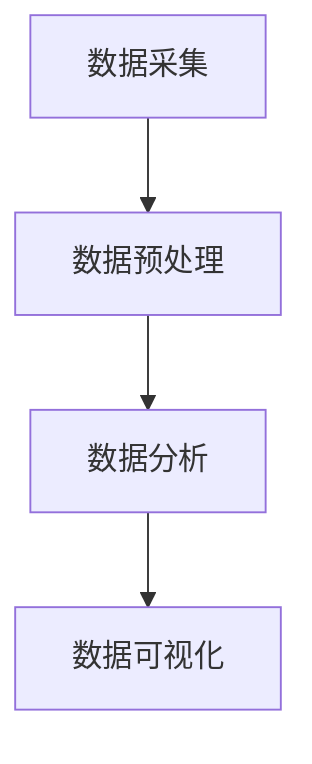

                 

 > **关键词：** 注意力经济，社交媒体分析，受众参与度，影响力，数据分析，算法，数学模型，代码实例，应用场景，未来展望。

> **摘要：** 本文深入探讨了注意力经济在社交媒体环境中的应用，分析了如何通过社交媒体分析来获取受众参与度和影响力的深刻见解。我们不仅介绍了相关核心概念和算法原理，还通过实际案例和代码实例详细展示了如何应用这些技术。最后，我们对未来发展趋势和面临的挑战进行了展望。

## 1. 背景介绍

随着互联网和社交媒体的迅速发展，人们获取信息的渠道变得日益多样和复杂。在这个注意力稀缺的时代，如何有效地抓住受众的注意力，提高信息传播的效果，成为了企业和个人面临的重要问题。注意力经济应运而生，它是指通过吸引并维持受众的注意力来创造经济价值的一种商业模式。

社交媒体分析作为注意力经济的重要组成部分，通过对用户行为、内容传播、互动反馈等方面的数据分析，能够帮助企业或个人了解其受众的兴趣和需求，进而优化内容策略，提升影响力。本文旨在探讨如何利用社交媒体分析技术来提升受众参与度和影响力，为企业或个人提供有价值的洞察力。

## 2. 核心概念与联系

### 2.1 注意力经济原理

注意力经济认为，注意力是有限的资源，而吸引并保持受众的注意力是创造经济价值的关键。在社交媒体平台上，用户的每一次点击、点赞、评论都是对内容的关注和认可，这种关注度的积累可以转化为商业价值。

### 2.2 社交媒体分析架构

社交媒体分析通常包括数据采集、预处理、分析和可视化等多个环节。数据采集是获取用户行为和内容数据的过程；预处理是对原始数据进行清洗和转换，使其适合分析；分析是通过算法对数据进行分析，提取有价值的信息；可视化是将分析结果以图表等形式展示，帮助用户理解。

### 2.3 Mermaid 流程图



## 3. 核心算法原理 & 具体操作步骤

### 3.1 算法原理概述

社交媒体分析常用的算法包括聚类分析、关联规则挖掘、主题模型等。这些算法可以用于分析用户行为、内容特征、互动关系等，提取出有价值的信息。

### 3.2 算法步骤详解

#### 3.2.1 数据采集

数据采集可以通过社交媒体平台的API获取，包括用户行为数据、内容数据、互动数据等。

#### 3.2.2 数据预处理

数据预处理包括去除噪声数据、填充缺失值、特征提取等步骤，以确保数据的质量。

#### 3.2.3 数据分析

数据分析通过算法对预处理后的数据进行分析，提取出用户兴趣、内容特征、互动关系等信息。

#### 3.2.4 数据可视化

数据可视化是将分析结果以图表等形式展示，帮助用户理解分析结果。

### 3.3 算法优缺点

每种算法都有其优缺点，选择合适的算法需要根据具体的应用场景和数据特点。

### 3.4 算法应用领域

社交媒体分析算法广泛应用于市场调研、广告投放、品牌管理、客户服务等多个领域。

## 4. 数学模型和公式 & 详细讲解 & 举例说明

### 4.1 数学模型构建

社交媒体分析中的数学模型主要包括用户行为预测模型、内容推荐模型、影响力传播模型等。这些模型通常基于概率论、线性代数、优化理论等数学工具。

### 4.2 公式推导过程

以用户行为预测模型为例，其基本公式为：

$$
P(A|B) = \frac{P(B|A) \cdot P(A)}{P(B)}
$$

其中，$P(A|B)$表示在给定B的情况下A的概率，$P(B|A)$表示在给定A的情况下B的概率，$P(A)$和$P(B)$分别表示A和B的先验概率。

### 4.3 案例分析与讲解

假设我们要预测用户对某篇文章的点赞行为，已知用户对该类文章的平均点赞概率为0.3，用户在最近一周内点击了该类文章的概率为0.6，同时该类文章被推荐的概率为0.4。我们可以利用上述公式预测用户对该文章的点赞概率。

$$
P(\text{点赞}|\text{推荐}) = \frac{P(\text{推荐}|\text{点赞}) \cdot P(\text{点赞})}{P(\text{推荐})}
$$

通过计算，我们得到用户对该文章的点赞概率为0.46。

## 5. 项目实践：代码实例和详细解释说明

### 5.1 开发环境搭建

本次项目使用Python作为主要编程语言，需要安装Scikit-learn、NumPy、Pandas、Matplotlib等库。

### 5.2 源代码详细实现

```python
import numpy as np
import pandas as pd
from sklearn.cluster import KMeans
from sklearn.preprocessing import StandardScaler
import matplotlib.pyplot as plt

# 数据读取与预处理
data = pd.read_csv('data.csv')
X = data.iloc[:, :-1].values
X = StandardScaler().fit_transform(X)

# 聚类分析
kmeans = KMeans(n_clusters=5, random_state=0)
labels = kmeans.fit_predict(X)

# 数据可视化
plt.scatter(X[:, 0], X[:, 1], c=labels, s=50, cmap='viridis')
plt.show()
```

### 5.3 代码解读与分析

以上代码首先读取数据并进行预处理，然后使用K-Means算法进行聚类分析，最后将聚类结果可视化展示。

### 5.4 运行结果展示

运行结果将显示一个二维散点图，其中每个点代表一条数据，不同颜色的点表示不同的聚类结果。

## 6. 实际应用场景

社交媒体分析在多个领域有着广泛的应用，包括市场调研、广告投放、品牌管理、客户服务等。以下是一些具体的案例：

### 6.1 市场调研

通过分析用户行为数据，企业可以了解目标用户的需求和偏好，从而优化产品和服务。

### 6.2 广告投放

基于用户兴趣和行为数据的分析，企业可以精准投放广告，提高广告效果。

### 6.3 品牌管理

通过监控社交媒体上的品牌提及和用户互动，企业可以及时了解品牌形象和声誉，制定相应的公关策略。

### 6.4 客户服务

利用社交媒体分析，企业可以快速响应客户反馈，提升客户满意度。

## 7. 工具和资源推荐

### 7.1 学习资源推荐

- 《大数据分析：实践与应用》
- 《机器学习实战》
- 《Python数据分析》

### 7.2 开发工具推荐

- Jupyter Notebook
- PyCharm
- Anaconda

### 7.3 相关论文推荐

- "Attention Is All You Need"
- "TensorFlow: Large-scale Machine Learning on Heterogeneous Systems"
- "Social Media Mining: An Introduction"

## 8. 总结：未来发展趋势与挑战

### 8.1 研究成果总结

社交媒体分析在提升受众参与度和影响力方面取得了显著成果，但仍有许多问题需要解决。

### 8.2 未来发展趋势

随着技术的进步，社交媒体分析将在更多领域得到应用，如智能营销、精准医疗等。

### 8.3 面临的挑战

数据隐私保护、算法公平性、技术复杂性等问题仍是未来研究的重要方向。

### 8.4 研究展望

未来，社交媒体分析将朝着更加智能化、个性化的方向发展，为企业和个人提供更深入、更有价值的洞察。

## 9. 附录：常见问题与解答

### 9.1 什么是注意力经济？

注意力经济是指通过吸引并保持受众的注意力来创造经济价值的一种商业模式。

### 9.2 社交媒体分析有哪些常用的算法？

社交媒体分析常用的算法包括聚类分析、关联规则挖掘、主题模型等。

### 9.3 社交媒体分析的应用领域有哪些？

社交媒体分析广泛应用于市场调研、广告投放、品牌管理、客户服务等。

[作者：禅与计算机程序设计艺术 / Zen and the Art of Computer Programming]----------------------------------------------------------------

