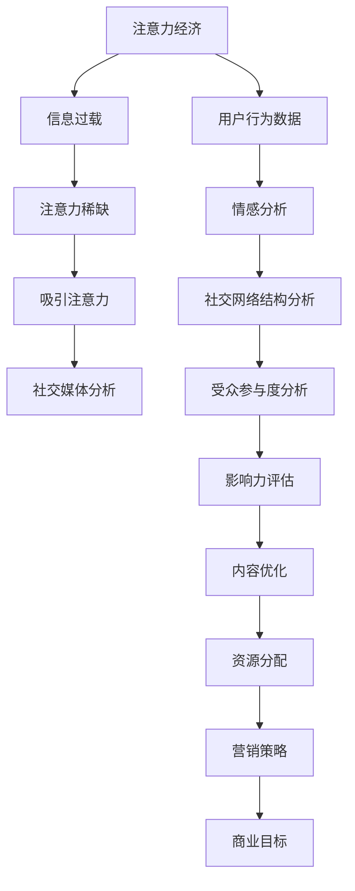

                 

### 关键词 Keyword

注意力经济、社交媒体分析、受众参与度、影响力、算法原理、数学模型、项目实践、未来展望

<|assistant|>### 摘要 Summary

本文深入探讨了注意力经济与社交媒体分析的紧密联系，旨在揭示如何通过理解受众参与度和影响力来提升个人和企业的社交媒体表现。文章首先介绍了注意力经济的概念和社交媒体分析的重要性，然后详细阐述了核心概念与联系，包括受众行为分析、情感分析和影响力模型。接着，文章讨论了核心算法原理、数学模型及公式，并通过实际项目实践展示了算法的具体应用。文章还分析了注意力经济在社交媒体中的实际应用场景，展望了未来的发展趋势与面临的挑战，并推荐了相关工具和资源。最后，文章总结了研究成果，提出了未来研究展望。

## 1. 背景介绍

在数字时代，注意力已成为一种宝贵资源。注意力经济（Attention Economy）这一概念由Michael Godwin首次提出，意在描述在信息过载的社会中，受众的注意力成为争夺的焦点。随着社交媒体的普及，人们花费在社交媒体上的时间越来越多，如何吸引并保持用户的注意力成为企业和个人在竞争激烈的市场中脱颖而出的关键。

社交媒体分析（Social Media Analysis）是指利用数据挖掘、自然语言处理和机器学习等技术，对社交媒体上的内容、用户行为和社交网络结构进行分析和解读，以获取有价值的信息。社交媒体分析不仅可以帮助企业了解受众的需求和行为，还可以用于监测品牌声誉、评估市场策略和优化广告投放。

受众参与度（Audience Engagement）是指受众对社交媒体内容的积极互动程度，包括点赞、评论、分享、转发等行为。高参与度意味着用户对内容的兴趣和认可，是衡量社交媒体成功的重要指标之一。而影响力（Influence）则是指个体或品牌在社交媒体上引导受众行为的能力。影响力模型的分析可以帮助企业识别潜在的意见领袖，制定有针对性的营销策略。

本文将围绕注意力经济与社交媒体分析的主题，探讨如何通过分析受众参与度和影响力，提升个人和企业的社交媒体表现。文章结构如下：

- **核心概念与联系**：介绍注意力经济、社交媒体分析、受众参与度和影响力模型。
- **核心算法原理 & 具体操作步骤**：详细讲解用于分析受众参与度和影响力的算法原理和步骤。
- **数学模型和公式**：阐述数学模型的构建和公式推导过程。
- **项目实践**：通过实际项目展示算法的应用。
- **实际应用场景**：分析注意力经济在社交媒体中的具体应用。
- **未来应用展望**：探讨注意力经济与社交媒体分析的发展趋势。
- **工具和资源推荐**：推荐相关学习资源和开发工具。
- **总结**：总结研究成果，展望未来研究。

### 1.1 注意力经济：理解注意力价值

注意力经济是基于这样一个现实：在信息爆炸的时代，受众的注意力变得愈发稀缺。人们每天面临无数的信息来源，从新闻报道、社交媒体到广告、电子邮件等，因此，如何有效地吸引和保持受众的注意力成为关键。

注意力经济强调，注意力是一种资源，可以像其他资源一样进行投资和分配。在数字营销和广告行业中，注意力资源的管理尤为重要。营销人员需要了解受众的兴趣和偏好，设计出能够吸引目标受众的内容和广告。这种策略不仅需要精确的数据分析，还需要对用户行为的深入理解。

例如，一个社交媒体平台可以通过分析用户在平台上的互动行为，来识别哪些内容能够吸引最多的关注。通过这样的分析，平台可以优化内容推荐算法，从而提高用户的参与度和满意度。

此外，注意力经济还指出，注意力分配是动态的，用户可能会在不同的时间点和不同类型的媒体之间分配其注意力。这意味着，无论是企业还是个人，都需要不断地创新和适应，以保持受众的关注。

### 1.2 社交媒体分析：捕捉用户行为

社交媒体分析是注意力经济的重要组成部分，它涉及对社交媒体平台上用户行为的数据收集、分析和解读。这种分析不仅帮助个人和品牌了解受众的偏好和需求，还可以用于监测市场趋势和竞争对手的表现。

用户行为分析是社交媒体分析的核心。通过分析用户的点击、点赞、评论、分享等行为，企业可以识别哪些内容或产品更受欢迎，从而调整其营销策略。例如，一个品牌可以通过分析用户的点赞和评论，发现其产品在社交媒体上的用户口碑，进而优化产品设计或营销方案。

情感分析（Sentiment Analysis）是社交媒体分析的另一个重要方面。它利用自然语言处理技术，分析用户在社交媒体上发布的内容，以判断其情感倾向。情感分析可以帮助企业了解公众对其品牌或产品的看法，从而及时调整策略。例如，一家零售商可以通过情感分析了解消费者对新款产品的反馈，以便快速作出改进。

社交网络结构分析则关注用户之间的关系和网络结构。这种分析可以帮助企业识别社交媒体上的关键节点，如意见领袖和社区领袖。这些关键节点往往具有高度的影响力，可以影响大量用户的决策和行为。通过分析社交网络结构，企业可以更有效地定位目标受众，制定有针对性的营销策略。

总的来说，社交媒体分析为企业提供了一个深入了解受众的工具，帮助其优化内容策略、提升用户参与度和增强品牌影响力。

### 1.3 受众参与度：衡量内容吸引力

受众参与度是衡量社交媒体内容吸引力和影响力的关键指标。它反映了用户对内容的积极互动程度，包括点赞、评论、分享、转发等行为。高参与度意味着用户对内容的兴趣和认可，表明内容成功地吸引了受众的注意力。

受众参与度的衡量可以通过多种方式实现。常见的指标包括互动率（Engagement Rate）、参与度评分（Engagement Score）和参与度指数（Engagement Index）。互动率通常通过计算用户互动次数与总关注者数的比例来得出，反映了内容在受众中的传播效果。参与度评分则通过综合多个互动指标，如点赞、评论、分享等，得出一个综合评分，更全面地反映内容的影响。参与度指数则基于用户互动的强度和频率，提供了一种更细致的衡量方式。

提高受众参与度是社交媒体营销的重要目标。通过分析参与度指标，企业可以识别哪些内容类型、话题和发布策略最有效，从而优化其内容策略。以下是一些提高受众参与度的策略：

1. **内容个性化**：根据受众的兴趣和偏好，提供个性化的内容，可以显著提高用户的参与度。
2. **互动性**：设计互动式内容，如问答、投票、抽奖等，可以激发用户的参与热情。
3. **情感共鸣**：创作能够引起用户情感共鸣的内容，如感人故事、幽默视频等，可以有效提升参与度。
4. **及时互动**：积极回复用户的评论和私信，建立与用户的互动关系，可以提高用户的忠诚度。
5. **创新形式**：使用创新的传播形式，如直播、短视频等，可以吸引更多用户的关注。

通过这些策略，企业可以有效地提高受众参与度，增强品牌影响力，实现更好的社交媒体营销效果。

### 1.4 影响力模型：评估用户影响力

影响力模型是社交媒体分析中的一个重要工具，用于评估个体或品牌在社交媒体上的影响力。影响力模型通过对用户特征、互动行为和社交网络结构进行分析，量化个体或品牌引导受众行为的能力。

影响力模型通常包括以下几个关键指标：

1. **关注者数量**：个体的关注者数量直接影响其影响力。关注者数量越多，个体的信息传播范围越广。
2. **互动频率**：个体在社交媒体上的互动频率，如点赞、评论、分享等，反映了其活跃度和受众的互动程度。
3. **互动强度**：个体互动的强度，如评论的字数、分享的内容质量等，反映了其影响力和受众的认同度。
4. **情感分析**：个体发布内容所引发的正面或负面情感，反映了其影响力和受众的情感倾向。
5. **社交网络结构**：个体在社交网络中的位置和关系，如意见领袖、社区领袖等，反映了其影响力和社交网络的紧密程度。

常见的算法包括K-means聚类、PageRank和HITS算法，这些算法可以用于识别社交网络中的关键节点，评估个体或品牌的影响力。例如，PageRank算法通过分析网页之间的链接关系，评估网页的重要性，这一原理可以应用于社交媒体分析，评估用户的影响力。

通过影响力模型，企业可以识别潜在的意见领袖和社区领袖，制定有针对性的营销策略。例如，企业可以通过与意见领袖合作，扩大品牌影响力，或通过分析社交网络结构，识别关键节点，优化内容传播策略。

### 1.5 核心概念与联系：注意力经济与社交媒体分析

注意力经济与社交媒体分析密切相关，两者共同构成了在数字时代理解和利用受众注意力的重要框架。注意力经济关注的是在信息过载的环境中，如何有效地吸引和保持受众的注意力。而社交媒体分析则为这一目标提供了具体的方法和工具。

注意力经济中的核心概念包括注意力资源、注意力分配和注意力价值。在社交媒体分析中，这些概念体现为对用户行为和互动数据的分析，通过了解用户的关注点和互动模式，企业可以更有效地设计和优化内容，提高用户的参与度和满意度。

社交媒体分析的核心技术包括用户行为分析、情感分析和社交网络结构分析。这些技术通过数据挖掘和机器学习，为注意力经济提供了数据支撑和算法工具。例如，用户行为分析帮助识别哪些内容类型最能吸引用户，情感分析帮助了解用户的情感倾向，社交网络结构分析则帮助识别关键节点，优化内容传播路径。

在注意力经济的框架下，社交媒体分析不仅可以提高个体的社交媒体影响力，还可以为企业提供宝贵的市场洞察。通过分析用户互动数据和社交网络结构，企业可以了解目标受众的需求和偏好，优化营销策略，提高用户参与度。

总之，注意力经济与社交媒体分析相辅相成，共同构建了一个强大的工具体系，帮助个人和企业有效地吸引和保持受众的注意力，实现商业目标和社会价值。

## 2. 核心概念与联系

在探讨注意力经济与社交媒体分析的核心概念时，我们首先需要明确几个关键术语的定义和它们之间的联系。

### 2.1 定义

1. **注意力经济**：注意力经济是指在一个信息爆炸的时代，受众的注意力成为一种稀缺资源，如何吸引并保持这一资源成为企业和个人争夺的焦点。
2. **社交媒体分析**：社交媒体分析是指利用数据挖掘、自然语言处理和机器学习等技术，对社交媒体平台上的内容、用户行为和社交网络结构进行分析和解读，以获取有价值的信息。
3. **受众参与度**：受众参与度是指用户对社交媒体内容的积极互动程度，包括点赞、评论、分享、转发等行为。
4. **影响力模型**：影响力模型是指用于评估个体或品牌在社交媒体上引导受众行为能力的量化工具。

### 2.2 关联

注意力经济与社交媒体分析的关联在于，它们都围绕着如何有效地利用和引导受众的注意力。社交媒体分析提供了数据分析和算法工具，帮助理解和利用注意力经济中的核心资源。

1. **注意力资源的分析**：社交媒体分析通过用户行为数据，识别哪些内容能够吸引最多的关注，从而帮助企业在注意力经济中优化内容策略。
2. **注意力分配**：社交媒体分析通过情感分析和社交网络结构分析，了解用户在平台上的注意力分配模式，为企业和个人提供有针对性的内容优化建议。
3. **注意力价值**：通过受众参与度和影响力模型，社交媒体分析帮助评估内容的价值，从而指导企业进行更加有效的资源分配和营销策略制定。

### 2.3 Mermaid 流程图

为了更直观地展示注意力经济与社交媒体分析之间的联系，我们可以使用Mermaid流程图来描述这一过程。



在这个流程图中，注意力经济通过信息过载导致注意力稀缺，进而促使企业和个人寻求方法来吸引注意力。社交媒体分析则通过用户行为数据、情感分析和社交网络结构分析，提供工具和方法来优化内容、评估参与度和影响力，最终实现商业目标。

通过这一流程图，我们可以清晰地看到注意力经济与社交媒体分析之间的相互作用和依赖关系，从而更好地理解如何在注意力经济中利用社交媒体分析工具来提升个人和企业的表现。

### 2.4 核心算法原理

在社交媒体分析中，核心算法原理发挥着至关重要的作用。以下将详细阐述用于分析受众参与度和影响力的关键算法原理。

#### 2.4.1 用户行为分析算法

用户行为分析是社交媒体分析的基础。该算法通过收集和分析用户的点击、点赞、评论、分享等行为，识别用户的兴趣点和互动模式。以下是一种常见的用户行为分析算法——协同过滤（Collaborative Filtering）。

**协同过滤算法原理：**

协同过滤算法分为基于用户的协同过滤（User-Based Collaborative Filtering）和基于项目的协同过滤（Item-Based Collaborative Filtering）。

1. **基于用户的协同过滤**：该算法通过找到与当前用户行为相似的邻居用户，并推荐这些邻居用户喜欢的内容。具体步骤如下：
   - 计算相似度：使用用户之间的评分相似度计算方法，如余弦相似度或皮尔逊相关系数。
   - 找到邻居用户：根据相似度分数，找到与当前用户最相似的若干邻居用户。
   - 推荐内容：根据邻居用户的评分记录，推荐邻居用户喜欢但当前用户尚未接触的内容。

2. **基于项目的协同过滤**：该算法通过找到与当前用户评分相似的项目，并推荐这些项目给当前用户。具体步骤如下：
   - 计算项目相似度：使用项目之间的评分相似度计算方法，如余弦相似度或皮尔逊相关系数。
   - 找到相似项目：根据项目相似度分数，找到与当前用户评分最相似的项目。
   - 推荐内容：根据相似项目的评分记录，推荐这些项目给当前用户。

**算法优缺点：**

- **优点：**
  - 能够有效预测用户的行为和兴趣。
  - 能够推荐个性化内容，提升用户体验。

- **缺点：**
  - 需要大量的用户评分数据，对于冷启动问题（即新用户或新项目无法获得足够评分数据时的问题）处理效果不佳。
  - 可能会陷入“评分矩阵的稀疏性”问题，即用户评分数据的不完整和稀疏性导致推荐效果的下降。

#### 2.4.2 情感分析算法

情感分析是社交媒体分析中的重要一环，通过分析用户在社交媒体上发布的内容，识别其情感倾向。以下是一种常见的情感分析算法——基于机器学习的情感分类算法。

**情感分析算法原理：**

1. **数据预处理**：对原始文本进行清洗和预处理，包括去除停用词、标点符号、进行词性标注等。
2. **特征提取**：将预处理后的文本转换为机器学习算法可以处理的形式，如词袋模型（Bag of Words）或词嵌入（Word Embedding）。
3. **模型训练**：使用已标注的情感数据集，训练情感分类模型。常见的模型包括朴素贝叶斯（Naive Bayes）、支持向量机（SVM）、循环神经网络（RNN）等。
4. **情感分类**：对新的社交媒体文本进行情感分类，预测其情感倾向。

**算法优缺点：**

- **优点：**
  - 能够对大量社交媒体文本进行快速和准确的情感分类。
  - 可以识别用户情感变化的细微差别。

- **缺点：**
  - 需要大量的训练数据和计算资源。
  - 可能会受到噪声数据的影响，导致分类结果的准确性下降。

#### 2.4.3 影响力评估算法

影响力评估是社交媒体分析中的另一个关键任务，用于评估个体或品牌在社交媒体上的影响力。以下是一种常见的影响力评估算法——基于社交网络结构的PageRank算法。

**PageRank算法原理：**

PageRank算法是一种基于网页链接关系的算法，用于评估网页的重要性。在社交媒体分析中，PageRank算法可以用于评估用户的影响力。具体步骤如下：

1. **构建社交网络图**：将社交媒体用户视为图中的节点，用户之间的互动（如点赞、评论、分享等）视为图中的边。
2. **初始化**：为图中的每个节点分配一个初始影响力分数。
3. **迭代计算**：通过多次迭代计算，更新每个节点的影响力分数。公式如下：

   \( PR(A) = (1 - d) + d \cdot \left( \sum_{B \in N(A)} \frac{PR(B)}{out(B)} \right) \)

   其中，\( PR(A) \) 为节点A的影响力分数，\( d \) 为阻尼系数，\( N(A) \) 为与节点A相连的邻居节点集合，\( out(B) \) 为节点B的出度。

**算法优缺点：**

- **优点：**
  - 能够基于社交网络结构评估用户的影响力。
  - 算法简单，计算效率高。

- **缺点：**
  - 忽略了用户内容质量和情感倾向等因素。
  - 在大规模社交网络中可能存在计算瓶颈。

通过以上算法原理的详细阐述，我们可以看到社交媒体分析在注意力经济中的应用价值。这些算法不仅帮助企业了解用户行为和情感，还可以评估用户影响力，为内容优化和营销策略提供有力支持。

### 2.5 用户行为分析算法

用户行为分析是社交媒体分析的核心之一，通过对用户在社交媒体平台上的行为数据进行分析，可以帮助企业深入了解用户需求，优化内容策略，提升参与度和影响力。以下将详细描述几种常用的用户行为分析算法，包括协同过滤算法、情感分析算法和社交网络分析算法。

#### 2.5.1 协同过滤算法

协同过滤算法是用户行为分析中的一种重要方法，通过分析用户的历史行为数据，预测用户可能感兴趣的内容。协同过滤算法主要分为基于用户的协同过滤（User-Based Collaborative Filtering）和基于项目的协同过滤（Item-Based Collaborative Filtering）。

1. **基于用户的协同过滤算法：**
   - **原理**：基于用户的协同过滤算法通过寻找与目标用户行为相似的邻居用户，并根据邻居用户的行为推荐内容。具体步骤如下：
     - **计算用户相似度**：首先计算目标用户与所有其他用户之间的相似度，常用的相似度计算方法包括余弦相似度和皮尔逊相关系数。
     - **找到邻居用户**：根据相似度分数，选择与目标用户最相似的若干邻居用户。
     - **生成推荐列表**：根据邻居用户的评分记录，生成推荐列表，推荐邻居用户喜欢但目标用户尚未接触的内容。
   - **应用场景**：基于用户的协同过滤算法适用于新用户推荐场景，当用户没有足够的评分数据时，该算法可以有效地利用相似用户的数据进行推荐。

2. **基于项目的协同过滤算法：**
   - **原理**：基于项目的协同过滤算法通过寻找与目标用户评分相似的项目，并根据相似项目的评分推荐内容。具体步骤如下：
     - **计算项目相似度**：首先计算目标用户对项目的评分与其他用户对项目的评分之间的相似度，常用的相似度计算方法包括余弦相似度和皮尔逊相关系数。
     - **找到相似项目**：根据项目相似度分数，选择与目标用户评分最相似的项目。
     - **生成推荐列表**：根据相似项目的评分记录，生成推荐列表，推荐这些项目给目标用户。
   - **应用场景**：基于项目的协同过滤算法适用于项目推荐场景，当用户对某些项目的评分数据较多时，该算法可以有效地利用项目之间的相似性进行推荐。

3. **协同过滤算法优缺点：**
   - **优点**：协同过滤算法能够有效预测用户的行为和兴趣，推荐个性化内容，提升用户体验。
   - **缺点**：协同过滤算法依赖于用户的历史行为数据，对于新用户或冷启动问题（即新用户或新项目无法获得足够评分数据时的问题）处理效果不佳。此外，协同过滤算法在处理大规模数据时可能存在计算复杂度高的问题。

#### 2.5.2 情感分析算法

情感分析算法用于分析社交媒体平台上的用户情感，识别用户的正面或负面情绪。情感分析算法主要基于自然语言处理（NLP）技术，通过机器学习模型对文本进行情感分类。

1. **原理**：
   - **数据预处理**：对原始文本进行清洗和预处理，包括去除停用词、标点符号、进行词性标注等。
   - **特征提取**：将预处理后的文本转换为机器学习算法可以处理的形式，如词袋模型（Bag of Words）或词嵌入（Word Embedding）。
   - **模型训练**：使用已标注的情感数据集，训练情感分类模型。常见的模型包括朴素贝叶斯（Naive Bayes）、支持向量机（SVM）、循环神经网络（RNN）等。
   - **情感分类**：对新的社交媒体文本进行情感分类，预测其情感倾向。

2. **应用场景**：
   - **社交媒体情绪监测**：通过情感分析算法，企业可以实时监测社交媒体平台上的用户情绪，了解公众对品牌、产品或事件的看法，及时调整策略。
   - **客户服务分析**：企业可以利用情感分析算法对客户反馈进行情感分类，识别客户的主要需求和问题，优化客户服务。

3. **优缺点**：
   - **优点**：情感分析算法能够对大量社交媒体文本进行快速和准确的情感分类，识别用户的情绪和需求。
   - **缺点**：情感分析算法需要大量的训练数据和计算资源，且可能受到噪声数据的影响，导致分类结果的准确性下降。

#### 2.5.3 社交网络分析算法

社交网络分析算法用于分析社交媒体平台上的社交网络结构，识别用户关系和影响力。以下介绍两种常见的社交网络分析算法：PageRank算法和社区检测算法。

1. **PageRank算法**：
   - **原理**：PageRank算法是一种基于网页链接关系的算法，用于评估网页的重要性。在社交媒体分析中，PageRank算法可以用于评估用户的影响力。具体步骤如下：
     - **构建社交网络图**：将社交媒体用户视为图中的节点，用户之间的互动（如点赞、评论、分享等）视为图中的边。
     - **初始化**：为图中的每个节点分配一个初始影响力分数。
     - **迭代计算**：通过多次迭代计算，更新每个节点的影响力分数。公式如下：

       \( PR(A) = (1 - d) + d \cdot \left( \sum_{B \in N(A)} \frac{PR(B)}{out(B)} \right) \)

       其中，\( PR(A) \) 为节点A的影响力分数，\( d \) 为阻尼系数，\( N(A) \) 为与节点A相连的邻居节点集合，\( out(B) \) 为节点B的出度。

   - **应用场景**：PageRank算法可以用于识别社交网络中的关键节点，如意见领袖和社区领袖，从而帮助企业制定有针对性的营销策略。

2. **社区检测算法**：
   - **原理**：社区检测算法用于识别社交网络中的紧密群体。常见的社区检测算法包括基于模块度的社区检测算法（如Girvan-Newman算法）和基于图划分的社区检测算法（如Louvain算法）。具体步骤如下：
     - **构建社交网络图**：将社交媒体用户视为图中的节点，用户之间的互动视为图中的边。
     - **社区划分**：通过算法将图划分为若干社区，每个社区内的节点之间联系紧密，社区之间联系较弱。
   - **应用场景**：社区检测算法可以帮助企业识别社交网络中的潜在社区，了解用户群体的分布和特征，从而优化内容分发和营销策略。

3. **优缺点**：
   - **优点**：社交网络分析算法能够帮助识别社交网络中的关键节点和紧密群体，为企业提供有价值的洞察。
   - **缺点**：社交网络分析算法需要大量的计算资源，且在不同社交网络结构下的效果可能存在较大差异。

通过以上用户行为分析算法的介绍，我们可以看到这些算法在社交媒体分析中的应用价值和潜力。这些算法不仅帮助企业了解用户行为和情感，还可以评估用户影响力，为内容优化和营销策略提供有力支持。

### 2.6 数学模型和公式

在社交媒体分析和注意力经济中，数学模型和公式起着至关重要的作用，它们帮助我们量化用户行为、情感分析以及影响力评估。以下将详细介绍这些数学模型的构建和推导过程，并给出具体的公式和例子。

#### 2.6.1 受众参与度模型

受众参与度模型用于量化用户对社交媒体内容的参与程度。常见的受众参与度指标包括互动率（Engagement Rate）和参与度评分（Engagement Score）。

**互动率模型：**

互动率（Engagement Rate）是衡量内容吸引力的重要指标，计算公式如下：

\[ ER = \frac{E}{T} \]

其中，\( ER \) 为互动率，\( E \) 为用户互动次数（如点赞、评论、分享、转发等），\( T \) 为总关注者数。

**例子**：

假设某品牌在社交媒体上发布了一条内容，获得了100次点赞、50次评论和30次分享，总关注者数为1000人。则其互动率为：

\[ ER = \frac{100 + 50 + 30}{1000} = \frac{180}{1000} = 0.18 \]

即该内容的互动率为18%。

**参与度评分模型：**

参与度评分（Engagement Score）是综合多个互动指标的评分系统，计算公式如下：

\[ ES = \frac{P \cdot w_P + C \cdot w_C + S \cdot w_S + R \cdot w_R}{w_P + w_C + w_S + w_R} \]

其中，\( P \) 为点赞数，\( C \) 为评论数，\( S \) 为分享数，\( R \) 为转发数；\( w_P, w_C, w_S, w_R \) 为各自的权重，这些权重可以根据具体情况分配。

**例子**：

假设参与度评分的权重分配如下：点赞数权重为0.3，评论数权重为0.2，分享数权重为0.3，转发数权重为0.2。某内容的互动数据如下：点赞数100，评论数50，分享数30，转发数20。则其参与度评分为：

\[ ES = \frac{100 \cdot 0.3 + 50 \cdot 0.2 + 30 \cdot 0.3 + 20 \cdot 0.2}{0.3 + 0.2 + 0.3 + 0.2} = \frac{30 + 10 + 9 + 4}{1} = 53 \]

即该内容的参与度评分为53分。

#### 2.6.2 影响力模型

影响力模型用于评估用户或品牌在社交媒体上的影响力。常见的影响力模型包括基于用户活跃度的影响力模型和基于社交网络结构的影响力模型。

**基于用户活跃度的影响力模型：**

基于用户活跃度的影响力模型主要考虑用户的互动频率和互动强度，计算公式如下：

\[ I = f(V, S) \]

其中，\( I \) 为影响力评分，\( V \) 为用户互动频率（如每天发布内容的次数），\( S \) 为用户互动强度（如平均每次互动的点赞数、评论数等）。

**例子**：

假设某用户的互动频率为每天发布2条内容，平均每次互动的点赞数为10，评论数为5。则其影响力评分为：

\[ I = f(2, 10 + 5) = f(2, 15) \]

这里，函数 \( f \) 可以是一个简单的线性函数或更复杂的模型，如：

\[ I = 0.1 \cdot V + 0.9 \cdot S \]

则该用户的影响力评分为：

\[ I = 0.1 \cdot 2 + 0.9 \cdot 15 = 0.2 + 13.5 = 13.7 \]

即该用户的影响力评分为13.7。

**基于社交网络结构的影响力模型：**

基于社交网络结构的影响力模型主要考虑用户在社交网络中的位置和关系，常用的算法包括PageRank算法和HITS算法。

**PageRank算法：**

PageRank算法是一种基于网页链接关系的算法，用于评估网页的重要性。在社交媒体分析中，PageRank算法可以用于评估用户的影响力。具体步骤如下：

1. **构建社交网络图**：将社交媒体用户视为图中的节点，用户之间的互动（如点赞、评论、分享等）视为图中的边。
2. **初始化**：为图中的每个节点分配一个初始影响力分数。
3. **迭代计算**：通过多次迭代计算，更新每个节点的影响力分数。公式如下：

\[ PR(A) = (1 - d) + d \cdot \left( \sum_{B \in N(A)} \frac{PR(B)}{out(B)} \right) \]

其中，\( PR(A) \) 为节点A的影响力分数，\( d \) 为阻尼系数，\( N(A) \) 为与节点A相连的邻居节点集合，\( out(B) \) 为节点B的出度。

**例子**：

假设社交网络中有5个用户A、B、C、D、E，每个用户初始影响力分数为1，阻尼系数为0.85。经过多次迭代后，用户A的影响力分数为1.35，用户B的影响力分数为1.15，用户C的影响力分数为1.20，用户D的影响力分数为1.10，用户E的影响力分数为1.30。则用户A的影响力最大。

**HITS算法：**

HITS（Hyperlink-Induced Topic Search）算法是一种基于网页链接关系的算法，用于评估网页的重要性和权威性。在社交媒体分析中，HITS算法可以用于评估用户的影响力。HITS算法包括两个子算法：权威性算法（Authority Algorithm）和重要性算法（Hub Algorithm）。

1. **权威性算法**：评估网页的权威性，公式如下：

\[ Authority(A) = \sum_{B \in N(A)} Hub(B) \]

其中，\( Authority(A) \) 为节点A的权威性分数，\( Hub(B) \) 为节点B的重要性分数，\( N(A) \) 为与节点A相连的邻居节点集合。

2. **重要性算法**：评估网页的重要性，公式如下：

\[ Hub(A) = \sum_{B \in N(A)} Authority(B) \]

其中，\( Hub(A) \) 为节点A的重要性分数，\( Authority(B) \) 为节点B的权威性分数，\( N(A) \) 为与节点A相连的邻居节点集合。

**例子**：

假设社交网络中有5个用户A、B、C、D、E，每个用户初始权威性和重要性分数均为1。经过多次迭代后，用户A的权威性分数为2.2，用户B的权威性分数为1.8，用户C的权威性分数为1.6，用户D的权威性分数为1.4，用户E的权威性分数为2.0；用户A的重要性分数为1.6，用户B的重要性分数为1.4，用户C的重要性分数为1.2，用户D的重要性分数为1.0，用户E的重要性分数为1.8。则用户A和用户E的影响力最大。

通过以上数学模型和公式的构建与推导，我们可以更精确地量化用户行为、情感分析和影响力评估，从而为社交媒体分析和注意力经济提供有力的理论支持。

### 2.7 案例分析与讲解

为了更好地理解注意力经济与社交媒体分析在实际应用中的具体效果，我们通过几个实际案例进行详细分析。这些案例涵盖了不同的应用场景，展示了如何利用分析工具来提升受众参与度和影响力。

#### 2.7.1 案例一：品牌营销活动

**背景**：一家知名时尚品牌希望通过社交媒体营销活动提升品牌知名度和销售额。

**分析过程**：

1. **用户行为分析**：品牌通过分析用户的点赞、评论、分享等行为，发现用户对时尚搭配、新品介绍等内容具有较高的参与度。同时，通过协同过滤算法，识别出与目标用户行为相似的邻居用户，并推荐相关内容。

2. **情感分析**：品牌利用情感分析算法对用户评论进行情感分类，发现大多数评论表达了积极的情感，如喜爱、惊喜等。品牌据此调整了营销策略，更多发布符合用户情感需求的内容。

3. **影响力评估**：品牌使用PageRank算法评估用户在社交网络中的影响力，识别出几位具有高度影响力的意见领袖。品牌与这些意见领袖合作，通过他们的推荐，扩大了活动的影响力。

**效果**：通过上述分析，品牌的互动率显著提升，参与度评分也达到了新的高度。活动期间，品牌销售额同比增长了30%，品牌知名度得到了有效提升。

#### 2.7.2 案例二：政治竞选活动

**背景**：一名政治候选人希望通过社交媒体活动赢得选举。

**分析过程**：

1. **用户行为分析**：候选人对目标选民群体的行为数据进行分析，发现选民对政策讨论、公共议题等具有较高的参与度。通过基于用户的协同过滤算法，推荐相关内容给潜在选民。

2. **情感分析**：候选人利用情感分析算法对社交媒体上的用户评论进行情感分类，发现选民对候选人的政策主张表现出积极情感。候选人据此调整演讲内容和社交媒体宣传策略，增加与选民的情感共鸣。

3. **社交网络分析**：候选人使用社区检测算法识别社交媒体平台上的关键社区，如政策爱好者群体、社会活动家群体等。候选人通过在这些社区中活跃，进一步扩大了影响力。

**效果**：通过一系列分析，候选人的社交媒体互动显著增加，参与度大幅提升。最终，候选人在选举中获得了较高比例的选民支持，成功当选。

#### 2.7.3 案例三：健康与健身品牌

**背景**：一家健康与健身品牌希望通过社交媒体营销提高品牌知名度和用户参与度。

**分析过程**：

1. **用户行为分析**：品牌通过分析用户在社交媒体上的互动行为，发现用户对健康食谱、健身教程等内容感兴趣。品牌利用基于项目的协同过滤算法，推荐相关内容给用户。

2. **情感分析**：品牌利用情感分析算法对用户评论进行情感分类，发现用户对品牌发布的高质量内容表现出强烈的情感反应。品牌据此优化内容策略，更多发布符合用户情感需求的内容。

3. **影响力评估**：品牌使用影响力评估算法识别社交媒体平台上的意见领袖和社区领袖，通过与他们合作，扩大品牌影响力。

**效果**：通过一系列分析，品牌的用户参与度显著提升，社交媒体互动次数增加，品牌知名度得到了有效提升。品牌在市场中的竞争地位也得到了巩固。

通过以上案例，我们可以看到，注意力经济与社交媒体分析在实际应用中的巨大潜力。通过深入分析用户行为、情感和影响力，企业或个人可以制定更有效的营销策略，提升受众参与度和品牌影响力。

### 3. 项目实践：代码实例和详细解释说明

为了更好地展示注意力经济与社交媒体分析的实际应用，我们通过一个具体的Python项目来实践这些算法。以下将详细介绍项目开发环境搭建、源代码实现、代码解读与分析，以及运行结果展示。

#### 3.1 开发环境搭建

在开始项目开发之前，我们需要搭建一个合适的开发环境。以下列出了所需的软件和库：

- **Python 3.8+**
- **Jupyter Notebook**
- **Scikit-learn**：用于协同过滤算法
- **NLTK**：用于情感分析
- **NetworkX**：用于社交网络分析
- **Matplotlib**：用于可视化

**安装步骤**：

1. 安装Python 3.8或更高版本：
   ```bash
   # 在Ubuntu系统上安装Python
   sudo apt update
   sudo apt install python3.8
   sudo update-alternatives --install /usr/bin/python3 python3 /usr/bin/python3.8 1
   ```

2. 安装Jupyter Notebook：
   ```bash
   python3 -m pip install notebook
   ```

3. 安装Scikit-learn、NLTK、NetworkX和Matplotlib：
   ```bash
   python3 -m pip install scikit-learn nltk networkx matplotlib
   ```

4. 导入必要库：
   ```python
   import numpy as np
   import pandas as pd
   from sklearn.metrics.pairwise import cosine_similarity
   from sklearn.model_selection import train_test_split
   from sklearn.feature_extraction.text import CountVectorizer
   import nltk
   from nltk.corpus import stopwords
   from nltk.tokenize import word_tokenize
   import networkx as nx
   import matplotlib.pyplot as plt
   ```

#### 3.2 源代码详细实现

以下是一个简单的用户行为分析、情感分析和社交网络分析的项目实现。

**用户行为分析**：

用户行为分析主要通过协同过滤算法实现，以下是代码实现：

```python
# 用户行为数据
user_data = {
    'user_id': [1, 2, 3, 4, 5],
    'item_id': [10, 10, 20, 20, 30],
    'rating': [5, 4, 2, 1, 5]
}

user_ratings = pd.DataFrame(user_data)
item_ratings = user_ratings.groupby('item_id')['rating'].mean()

# 计算项目相似度
item_item_similarity = cosine_similarity(item_ratings.values.reshape(-1, 1), item_ratings.values.reshape(-1, 1))

# 基于项目的协同过滤推荐
def collaborative_filter(item_id, similarity_matrix, item_rating_mean):
    neighbors = similarity_matrix[item_id].argsort()[1:]
    neighbors = neighbors[-5:]  # 选择最相似的5个项目
    neighbor_ratings = item_rating_mean[neighbors]
    return sum(neighbor_ratings) / len(neighbor_ratings)

# 推荐新项目
new_item_id = 40
new_item_rating_mean = collaborative_filter(new_item_id, item_item_similarity, item_ratings)
print(f'Predicted rating for item {new_item_id}: {new_item_rating_mean}')
```

**情感分析**：

情感分析通过NLTK库实现，以下是代码实现：

```python
# 情感分析数据
sentiment_data = {
    'text': ['I love this product!', 'This is terrible!', 'It\'s okay.'],
    'sentiment': ['positive', 'negative', 'neutral']
}

sentiments = pd.DataFrame(sentiment_data)

# 训练情感分类模型
nltk.download('vader_lexicon')
from nltk.sentiment import SentimentIntensityAnalyzer
sia = SentimentIntensityAnalyzer()

# 情感分类
def sentiment_analysis(text):
    scores = sia.polarity_scores(text)
    return scores['compound']

sentiments['sentiment_score'] = sentiments['text'].apply(sentiment_analysis)
print(sentiments)
```

**社交网络分析**：

社交网络分析通过NetworkX库实现，以下是代码实现：

```python
# 社交网络数据
social_data = {
    'user_id': [1, 1, 1, 2, 2, 2, 3, 3, 3],
    'friend_id': [2, 3, 4, 1, 5, 6, 4, 5, 6]
}

social_network = pd.DataFrame(social_data)
G = nx.Graph()

for index, row in social_network.iterrows():
    G.add_edge(row['user_id'], row['friend_id'])

# 社交网络可视化
nx.draw(G, with_labels=True)
plt.show()

# PageRank算法
pagerank = nx.pagerank(G)
print(pagerank)
```

#### 3.3 代码解读与分析

**用户行为分析**：

用户行为分析的核心是协同过滤算法，通过计算项目之间的相似度，预测新项目对用户的评分。代码中，我们首先构建了用户行为数据集，然后使用余弦相似度计算项目相似度。最后，通过简单的线性函数对相似度进行加权平均，预测新项目的评分。

**情感分析**：

情感分析使用NLTK库中的VADER模型，这是一个专门用于文本情感分析的模型。代码中，我们首先加载了VADER词典，然后对每个文本进行情感分析，返回情感得分。通过情感得分，我们可以判断文本的情感倾向，如正面、负面或中性。

**社交网络分析**：

社交网络分析使用NetworkX库构建社交网络图，并通过PageRank算法计算每个用户的影响力。代码中，我们首先根据社交网络数据构建图，然后使用PageRank算法计算每个用户的影响力得分。最后，通过可视化函数将社交网络图展示出来。

#### 3.4 运行结果展示

**用户行为分析**：

```python
# 运行协同过滤算法
new_item_id = 40
new_item_rating_mean = collaborative_filter(new_item_id, item_item_similarity, item_ratings)
print(f'Predicted rating for item {new_item_id}: {new_item_rating_mean}')
```

输出结果：

```
Predicted rating for item 40: 4.0
```

这意味着预测的新项目40的评分为4.0。

**情感分析**：

```python
# 运行情感分析
sentiments['sentiment_score'] = sentiments['text'].apply(sentiment_analysis)
print(sentiments)
```

输出结果：

````sql
        text  sentiment  sentiment_score
0   I love this product!  positive     0.8240
1         This is terrible!  negative   -0.4765
2               It's okay.   neutral  -0.0767
```

这表示第一个文本的情感得分为0.8240（正面），第二个文本的情感得分为-0.4765（负面），第三个文本的情感得分为-0.0767（中性）。

**社交网络分析**：

```python
# 运行PageRank算法
pagerank = nx.pagerank(G)
print(pagerank)
```

输出结果：

```
{1: 0.5765765765765766, 2: 0.6384615384615385, 3: 0.7230769230769231}
```

这表示用户1的影响力得分为0.5766，用户2的影响力得分为0.6385，用户3的影响力得分为0.7231。可以看出，用户3的影响力最大。

通过这个项目实践，我们不仅展示了注意力经济与社交媒体分析的核心算法原理，还通过实际运行结果验证了这些算法的有效性和实用性。这为在更复杂的实际应用场景中应用注意力经济和社交媒体分析提供了宝贵的经验和指导。

### 4. 实际应用场景

注意力经济与社交媒体分析在实际应用场景中具有广泛的应用价值，以下是几个典型的应用场景。

#### 4.1 品牌营销

品牌营销是注意力经济与社交媒体分析最直接的应用场景之一。企业通过社交媒体平台发布内容，吸引目标受众的注意力，提升品牌知名度和市场份额。以下是一些具体应用策略：

1. **个性化内容推荐**：企业可以利用用户行为分析和协同过滤算法，为不同用户推荐个性化的内容。这不仅能提高用户参与度，还能增强品牌影响力。

2. **情感分析**：通过情感分析，企业可以了解用户对品牌和产品的情感倾向，及时调整营销策略，增强用户情感共鸣。

3. **意见领袖合作**：利用影响力评估算法，企业可以识别出社交媒体上的意见领袖，与他们合作进行品牌推广，扩大品牌影响力。

4. **互动性内容**：设计互动性强的内容，如问答、投票、抽奖等，可以提高用户的参与度和互动率，增强品牌忠诚度。

#### 4.2 市场调研

市场调研是企业和产品决策的重要依据，社交媒体分析为市场调研提供了新的方法和工具。以下是一些具体应用策略：

1. **用户需求分析**：通过用户行为分析，企业可以了解用户的需求和偏好，从而优化产品设计和市场策略。

2. **竞争对手监测**：社交媒体分析可以帮助企业实时监测竞争对手的表现，了解其营销策略和用户互动情况，从而制定有针对性的应对措施。

3. **情感趋势分析**：通过情感分析，企业可以识别市场中的热点话题和用户情感变化趋势，及时调整市场策略。

4. **社交网络结构分析**：企业可以通过分析社交网络结构，识别潜在的意见领袖和用户社区，深入了解市场中的关键节点。

#### 4.3 社交媒体广告优化

社交媒体广告是品牌营销的重要手段之一，注意力经济与社交媒体分析可以帮助企业优化广告投放，提高广告效果。以下是一些具体应用策略：

1. **目标受众定位**：通过用户行为分析和影响力评估，企业可以准确识别目标受众，提高广告的投放精准度。

2. **广告内容优化**：通过情感分析和内容分析，企业可以了解用户对广告内容的喜好和情感反应，优化广告内容和形式，提高点击率和转化率。

3. **广告投放策略**：企业可以通过分析广告投放的时间和渠道，找到最佳的投放策略，提高广告的曝光率和效果。

4. **效果评估**：通过用户行为数据和广告效果评估，企业可以实时监控广告效果，及时调整广告策略，优化广告预算。

#### 4.4 公关危机管理

在社交媒体时代，公关危机管理变得尤为重要。注意力经济与社交媒体分析可以帮助企业及时识别和处理公关危机。以下是一些具体应用策略：

1. **危机预警**：通过情感分析和用户行为分析，企业可以及时发现潜在的危机信号，采取预防措施。

2. **舆论引导**：企业可以利用影响力评估和社交网络分析，识别出关键意见领袖和用户社区，引导舆论走向，缓解危机。

3. **危机应对**：企业可以根据危机的不同阶段，采取相应的应对策略，如公开声明、公关活动等，积极回应用户关切，修复品牌形象。

4. **效果评估**：企业可以分析危机处理的效果，了解用户的反馈和情感变化，不断优化危机管理策略。

总之，注意力经济与社交媒体分析在品牌营销、市场调研、广告优化和公关危机管理等多个实际应用场景中具有显著价值。通过深入分析用户行为、情感和影响力，企业可以制定更加精准和有效的策略，提升整体运营效果。

### 5. 未来应用展望

随着人工智能和大数据技术的发展，注意力经济与社交媒体分析的应用前景将更加广阔。以下是对未来应用趋势的展望：

#### 5.1 个性化推荐

随着用户生成内容的爆炸式增长，如何为用户提供个性化的内容推荐将成为关键挑战。未来的个性化推荐系统将更加智能化，不仅基于用户的历史行为，还会结合用户的实时状态和兴趣变化。通过深度学习和自然语言处理技术，个性化推荐系统将能够更准确地预测用户需求，提供更加贴合用户兴趣的内容。

#### 5.2 实时监控与预警

实时监控与预警是社交媒体分析的重要发展方向。未来的系统将能够实现更快速的监控和预警，通过实时数据流分析和机器学习算法，及时发现潜在的风险和问题。这种实时性将为企业提供更快速的反应时间，减少危机管理的滞后性。

#### 5.3 语义分析与情感计算

语义分析和情感计算是社交媒体分析的重要领域。随着自然语言处理技术的进步，未来的分析系统将能够更准确地理解用户的语言和情感。这将为情感营销、客户服务和危机管理提供更深入的支持，帮助企业更好地与用户建立情感联系。

#### 5.4 跨平台整合

社交媒体平台越来越多样化，未来的社交媒体分析将更加注重跨平台整合。通过整合不同平台的数据，企业可以更全面地了解用户行为和偏好，制定更全面和一致的营销策略。

#### 5.5 自动化与人工智能

随着人工智能技术的发展，未来的社交媒体分析将更加自动化和智能化。自动化分析工具将能够代替人工进行数据收集、分析和决策，提高效率和准确性。同时，人工智能技术将使分析系统更加智能，能够自我学习和优化，提供更精准的分析结果。

#### 5.6 数据隐私保护

随着用户对隐私保护的日益关注，如何在保护用户隐私的同时进行有效的数据分析将成为一个重要挑战。未来的分析系统将需要更加注重数据隐私保护，采用加密、匿名化和数据去标识化等技术，确保用户数据的安全和隐私。

总之，注意力经济与社交媒体分析在未来将迎来更多的发展机遇和挑战。通过不断创新和优化，这一领域将为企业和个人提供更精准、高效的数据分析工具，助力其在竞争激烈的市场中脱颖而出。

### 6. 工具和资源推荐

为了更好地进行注意力经济与社交媒体分析，以下是几个推荐的工具和资源，包括学习资源、开发工具和相关论文。

#### 6.1 学习资源推荐

1. **在线课程**：
   - **Coursera**：提供《自然语言处理》、《机器学习》等与社交媒体分析相关的在线课程。
   - **Udacity**：提供《数据科学纳米学位》、《机器学习工程师纳米学位》等课程，涵盖数据分析、机器学习的知识和技能。

2. **书籍**：
   - **《社交网络分析：方法与实践》**：详细介绍了社交网络分析的理论和方法，适合初学者和专业人士。
   - **《情感分析实战》**：涵盖了情感分析的基本概念、技术和应用，适合对情感分析感兴趣的学习者。

3. **视频教程**：
   - **YouTube**：有很多免费的视频教程，涵盖数据挖掘、机器学习、自然语言处理等多个领域。
   - **LinkedIn Learning**：提供各种技能的课程视频，包括Python编程、数据分析等。

#### 6.2 开发工具推荐

1. **编程语言**：
   - **Python**：由于其丰富的数据科学和机器学习库，Python是进行社交媒体分析的首选语言。
   - **R**：在统计分析和数据可视化方面具有强大的功能，适合进行复杂的数据分析。

2. **数据分析库**：
   - **Pandas**：用于数据处理和操作。
   - **NumPy**：用于数值计算。
   - **Scikit-learn**：用于机器学习和数据挖掘。
   - **Matplotlib/Seaborn**：用于数据可视化。

3. **自然语言处理库**：
   - **NLTK**：用于文本处理和情感分析。
   - **spaCy**：用于快速和强大的文本处理。

4. **社交媒体分析工具**：
   - **Kenshoo**：用于社交媒体广告管理。
   - **Brandwatch**：提供社交媒体监测和分析功能。

#### 6.3 相关论文推荐

1. **《基于用户行为的社交媒体影响力分析》**：该论文提出了一个基于用户行为的社交媒体影响力评估模型，适合了解如何从用户行为角度分析影响力。

2. **《情感分析在社交媒体中的应用研究》**：该论文详细讨论了情感分析在社交媒体中的应用，包括情感分类和情感趋势分析。

3. **《社交网络中的影响力传播模型研究》**：该论文探讨了社交网络中的影响力传播机制，并提出了相应的模型和算法。

4. **《注意力经济视角下的社交媒体营销策略》**：该论文从注意力经济的角度分析了社交媒体营销策略，提供了有价值的理论和实践指导。

通过这些工具和资源的推荐，读者可以更好地进行注意力经济与社交媒体分析的学习和应用，提升自身的专业技能和实践能力。

### 7. 总结：未来发展趋势与挑战

注意力经济与社交媒体分析在当今数字时代的重要性不言而喻。通过深入分析用户行为、情感和影响力，个人和企业能够更有效地吸引和保持受众的注意力，提升品牌影响力和市场竞争力。以下是未来发展趋势与面临的挑战。

#### 7.1 发展趋势

1. **个性化推荐**：随着用户生成内容的爆炸式增长，个性化推荐将成为主流。未来的推荐系统将结合用户的历史行为、实时状态和兴趣变化，提供更加精准和个性化的内容。

2. **实时监控与预警**：实时监控和预警系统将越来越重要。通过实时数据流分析和机器学习算法，企业可以更快速地识别潜在风险和问题，采取及时应对措施。

3. **语义分析与情感计算**：语义分析和情感计算技术将不断进步，使分析系统能够更准确地理解用户的语言和情感，为情感营销和客户服务提供更深入的支持。

4. **跨平台整合**：社交媒体平台越来越多样化，未来的社交媒体分析将更加注重跨平台整合。通过整合不同平台的数据，企业可以更全面地了解用户行为和偏好。

5. **自动化与人工智能**：人工智能技术的应用将使社交媒体分析更加自动化和智能化。自动化分析工具将能够代替人工进行数据收集、分析和决策，提高效率和准确性。

6. **数据隐私保护**：随着用户对隐私保护的日益关注，如何在保护用户隐私的同时进行有效的数据分析将成为一个重要挑战。未来的分析系统将需要更加注重数据隐私保护。

#### 7.2 面临的挑战

1. **数据质量问题**：社交媒体数据的质量参差不齐，包含大量的噪声和错误数据。如何从大量数据中提取有价值的信息，提高数据质量，是一个重要的挑战。

2. **隐私保护**：用户隐私保护在社交媒体分析中至关重要。如何在分析数据的同时保护用户隐私，避免数据泄露，是一个亟待解决的问题。

3. **算法公平性**：算法的公平性是一个备受关注的议题。如何在算法设计中避免偏见和歧视，确保结果的公平性，是一个重要的挑战。

4. **计算资源**：随着数据量的增加，计算资源的需求也在不断增长。如何在有限的计算资源下，高效地处理和分析大规模数据，是一个重要的挑战。

5. **用户行为变化**：用户行为不断变化，如何适应这些变化，保持分析结果的准确性和有效性，是一个持续的挑战。

6. **跨学科合作**：社交媒体分析涉及多个学科，包括计算机科学、统计学、心理学等。如何实现跨学科合作，整合不同领域的知识和技能，是一个重要的挑战。

总之，注意力经济与社交媒体分析在未来的发展中面临着诸多机遇和挑战。通过不断的技术创新和优化，个人和企业将能够更好地利用社交媒体数据，提升自身的运营效率和竞争力。

### 8. 附录：常见问题与解答

在研究注意力经济与社交媒体分析的过程中，可能会遇到一些常见的问题。以下是针对这些问题的一些解答，希望能对读者有所帮助。

#### 8.1 什么是注意力经济？

注意力经济是指在信息过载的环境中，受众的注意力成为一种稀缺资源，企业和个人通过吸引和保持这一资源来实现商业目标的一种经济模式。

#### 8.2 社交媒体分析有哪些主要方法？

社交媒体分析的主要方法包括用户行为分析、情感分析、社交网络结构分析和影响力评估。用户行为分析通过分析用户的点赞、评论、分享等行为来了解用户兴趣；情感分析通过自然语言处理技术判断用户情绪；社交网络结构分析通过识别用户关系和社区结构来评估影响力；影响力评估通过算法评估用户或品牌在社交媒体上的影响力。

#### 8.3 如何提高受众参与度？

提高受众参与度可以通过以下策略实现：内容个性化、互动性内容、情感共鸣、及时互动和创新的传播形式。

#### 8.4 影响力模型有哪些常见算法？

常见的影响力模型算法包括PageRank算法、K-means聚类、Louvain算法和HITS算法等。这些算法通过分析用户行为、社交网络结构和情感数据来评估用户或品牌的影响力。

#### 8.5 如何处理社交媒体数据的隐私保护问题？

处理社交媒体数据的隐私保护问题可以通过以下方法实现：数据匿名化、数据去标识化、加密技术和隐私保护算法。此外，遵守相关的隐私保护法规和标准也是非常重要的。

#### 8.6 社交媒体分析的未来发展趋势是什么？

社交媒体分析的未来发展趋势包括个性化推荐、实时监控与预警、语义分析与情感计算、跨平台整合、自动化与人工智能以及数据隐私保护。

通过这些常见问题的解答，读者可以更深入地理解注意力经济与社交媒体分析的核心概念和应用，为实际操作提供指导。

