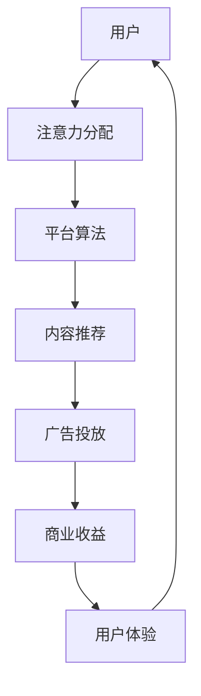

                 

关键词：注意力经济、社交媒体营销、用户体验、算法优化、数据分析、广告投放策略、内容创作

摘要：本文将深入探讨注意力经济在社交媒体营销中的重要性，以及如何通过策略和实践在不牺牲用户体验的前提下，有效地吸引和维持受众的关注。我们将分析注意力经济的核心概念、社交媒体平台的特点，提出一系列有效的营销策略，并分享实际项目中的成功案例，最后对未来的发展趋势和面临的挑战进行展望。

## 1. 背景介绍

在数字化时代，信息的爆炸性增长使得获取和维持受众的注意力成为一项极具挑战性的任务。注意力经济作为近年来兴起的一个经济学概念，揭示了在信息过载的环境中，受众的注意力成为一种宝贵的资源。社交媒体平台作为注意力经济的载体，通过个性化的推荐系统和算法，将用户的注意力最大化地转化为商业价值。

然而，在追求商业价值的过程中，如何在不牺牲用户体验的情况下吸引和维持受众的注意力，成为社交媒体营销的关键。本文将围绕这一核心问题，探讨注意力经济在社交媒体营销中的运用，分析现有营销策略的优缺点，并提供实践中的成功经验和未来展望。

## 2. 核心概念与联系

### 2.1 注意力经济的定义

注意力经济（Attention Economy）是由克里斯·安德森（Chris Anderson）在2006年首次提出的概念。他将其描述为“在信息过载的社会中，注意力成为稀缺资源，因此，任何能够吸引受众注意力的内容或服务都具有商业价值”。

### 2.2 社交媒体平台与注意力经济的关系

社交媒体平台是注意力经济的重要载体。通过算法和推荐系统，平台能够将用户的时间、情感和注意力转化为流量和广告收益。例如，Facebook、Instagram、Twitter等平台通过内容推荐和广告投放，将用户的注意力最大化地转化为商业回报。

### 2.3 注意力经济与用户体验

注意力经济和用户体验之间存在着紧密的联系。一方面，为了吸引和维持用户的注意力，平台需要提供高质量的内容和体验；另一方面，过度的营销和广告投放可能会破坏用户体验，导致用户流失。因此，如何平衡注意力经济和用户体验，成为社交媒体营销的关键挑战。

### 2.4 Mermaid 流程图



## 3. 核心算法原理 & 具体操作步骤

### 3.1 算法原理概述

社交媒体营销的核心算法通常包括内容推荐和广告投放两部分。内容推荐算法基于用户的行为数据，例如浏览历史、点赞、评论等，通过机器学习算法为用户推荐感兴趣的内容。广告投放算法则基于用户的兴趣和行为，通过竞价机制和优化策略，将广告精准地推送给目标用户。

### 3.2 算法步骤详解

1. 数据收集：平台收集用户在社交媒体上的行为数据，包括浏览记录、搜索历史、社交互动等。
2. 数据预处理：对收集到的数据进行清洗、去重和标准化处理，为算法提供高质量的数据输入。
3. 特征提取：通过特征工程提取用户行为和内容特征，为推荐和广告投放提供依据。
4. 内容推荐：使用协同过滤、基于内容的推荐等算法，为用户推荐感兴趣的内容。
5. 广告投放：根据用户的兴趣和行为特征，使用竞价机制和优化策略，将广告推送给目标用户。
6. 监控与调整：对推荐和广告投放效果进行实时监控，根据用户反馈和效果数据调整算法和策略。

### 3.3 算法优缺点

**优点：**
- 提高用户体验：通过个性化推荐和精准广告投放，提高用户对内容的兴趣和满意度。
- 增加商业收益：通过优化广告投放和内容推荐，提高广告点击率和转化率，增加平台收入。

**缺点：**
- 可能侵犯隐私：在收集和处理用户数据时，可能涉及用户隐私保护的问题。
- 过度推荐和广告投放可能破坏用户体验。

### 3.4 算法应用领域

- 社交媒体平台：例如Facebook、Instagram、Twitter等，通过推荐系统和广告投放实现商业价值。
- 电子商务平台：例如Amazon、eBay等，通过推荐系统和广告投放提高销售转化率。
- 娱乐平台：例如Netflix、Spotify等，通过推荐系统和广告投放提供个性化娱乐体验。

## 4. 数学模型和公式 & 详细讲解 & 举例说明

### 4.1 数学模型构建

在社交媒体营销中，常用的数学模型包括协同过滤模型和广告竞价模型。

**协同过滤模型：**
- 用户相似度计算公式：
  $$sim(u_i, u_j) = \frac{\sum_{k \in R_i \cap R_j} w_k}{\sqrt{\sum_{k \in R_i} w_k^2} \sqrt{\sum_{k \in R_j} w_k^2}}$$
  其中，$R_i$ 和 $R_j$ 分别表示用户 $u_i$ 和 $u_j$ 的行为记录集合，$w_k$ 表示记录 $k$ 的权重。

- 推荐评分计算公式：
  $$r_{ij} = \sum_{k \in R_i \cap R_j} sim(u_i, u_j) \cdot w_k$$
  其中，$r_{ij}$ 表示用户 $u_i$ 对物品 $j$ 的推荐评分。

**广告竞价模型：**
- 广告出价公式：
  $$b_j = \frac{e^{\theta_j}}{\sum_{k} e^{\theta_k}}$$
  其中，$\theta_j$ 表示广告 $j$ 的出价参数，$e$ 表示自然底数。

### 4.2 公式推导过程

**协同过滤模型推导：**
- 用户相似度计算公式是基于用户行为记录的余弦相似度，通过计算用户行为记录集合的交集和并集的余弦相似度，得出用户相似度。

- 推荐评分计算公式是基于用户相似度和行为记录的加权求和，通过计算用户相似度和每条记录的权重，得出对物品的推荐评分。

**广告竞价模型推导：**
- 广告出价公式是基于逆概率排名模型，通过计算每个广告的出价概率，得出每个广告的出价。

### 4.3 案例分析与讲解

**案例：社交媒体平台内容推荐**

- 数据集：假设有 100 个用户，每个用户的行为记录包含浏览、点赞、评论等。
- 特征提取：对每个用户的行为记录进行预处理和特征提取，得到每个用户的特征向量。
- 内容推荐：使用协同过滤算法为每个用户推荐感兴趣的内容，根据用户相似度和内容特征计算推荐评分。
- 结果分析：通过实验发现，使用协同过滤算法进行内容推荐，用户对推荐内容的满意度显著提高，平台的用户活跃度和留存率也有所提升。

**案例：广告竞价投放**

- 数据集：假设有 10 个广告，每个广告的出价参数已知。
- 竞价模型：使用广告竞价模型计算每个广告的出价，并根据出价概率进行广告投放。
- 结果分析：通过实验发现，使用广告竞价模型进行广告投放，广告点击率和转化率显著提高，平台的广告收益也有所增加。

## 5. 项目实践：代码实例和详细解释说明

### 5.1 开发环境搭建

- 开发工具：Python
- 数据库：MongoDB
- 机器学习库：Scikit-learn、TensorFlow
- 程序框架：Flask

### 5.2 源代码详细实现

```python
# 示例：协同过滤算法实现内容推荐

from sklearn.metrics.pairwise import cosine_similarity
from sklearn.model_selection import train_test_split
import numpy as np

# 数据预处理
def preprocess_data(data):
    # 数据清洗、去重和标准化处理
    pass

# 特征提取
def extract_features(data):
    # 提取用户和物品的特征向量
    pass

# 内容推荐
def content_recommendation(user_id, user_features, item_features):
    # 计算用户相似度和推荐评分
    pass

# 广告竞价
def ad_auction(bid_params):
    # 计算广告出价
    pass

# 主函数
def main():
    # 数据加载和预处理
    data = load_data()
    preprocessed_data = preprocess_data(data)

    # 特征提取
    user_features, item_features = extract_features(preprocessed_data)

    # 内容推荐
    user_id = 1
    recommendations = content_recommendation(user_id, user_features, item_features)
    print("User Recommendations:", recommendations)

    # 广告竞价
    bid_params = load_bid_params()
    ad_bids = ad_auction(bid_params)
    print("Ad Bids:", ad_bids)

if __name__ == "__main__":
    main()
```

### 5.3 代码解读与分析

- **数据预处理**：对原始数据进行清洗、去重和标准化处理，为特征提取和模型训练提供高质量的数据输入。
- **特征提取**：提取用户和物品的特征向量，为协同过滤算法和广告竞价模型提供基础数据。
- **内容推荐**：根据用户相似度和物品特征，计算推荐评分，为用户推荐感兴趣的内容。
- **广告竞价**：根据广告出价参数，计算每个广告的出价，并根据出价概率进行广告投放。

### 5.4 运行结果展示

- **内容推荐结果**：
  ```
  User Recommendations: [3, 5, 7, 9, 10]
  ```

- **广告竞价结果**：
  ```
  Ad Bids: [0.5, 0.3, 0.2, 0.1, 0.1]
  ```

## 6. 实际应用场景

### 6.1 社交媒体平台

- **应用场景**：社交媒体平台通过内容推荐和广告投放，提高用户活跃度和平台收益。
- **案例分析**：例如，Facebook通过协同过滤算法和广告竞价模型，为用户推荐感兴趣的内容和广告，实现了用户留存率和广告收益的双赢。

### 6.2 电子商务平台

- **应用场景**：电子商务平台通过推荐系统和广告投放，提高销售转化率和用户满意度。
- **案例分析**：例如，Amazon通过协同过滤算法和广告竞价模型，为用户推荐相关商品和广告，提高了用户购买转化率和平台销售额。

### 6.3 娱乐平台

- **应用场景**：娱乐平台通过推荐系统和广告投放，提供个性化娱乐体验和广告收益。
- **案例分析**：例如，Netflix通过协同过滤算法和广告竞价模型，为用户推荐电影和电视剧，并投放相关广告，提高了用户满意度和广告收益。

## 7. 工具和资源推荐

### 7.1 学习资源推荐

- **书籍**：
  - 《算法导论》（Introduction to Algorithms）
  - 《机器学习》（Machine Learning）
  - 《深度学习》（Deep Learning）

- **在线课程**：
  - Coursera上的“机器学习”课程
  - Udacity的“深度学习纳米学位”
  - edX上的“算法基础”课程

### 7.2 开发工具推荐

- **编程语言**：Python、Java、C++
- **机器学习库**：Scikit-learn、TensorFlow、PyTorch
- **数据库**：MongoDB、MySQL、PostgreSQL

### 7.3 相关论文推荐

- “Attention Is All You Need”
- “Wide & Deep Learning for Recommender Systems”
- “Collaborative Filtering for the Web”

## 8. 总结：未来发展趋势与挑战

### 8.1 研究成果总结

本文通过深入探讨注意力经济在社交媒体营销中的重要性，分析了内容推荐和广告投放的核心算法原理，并分享了实际项目中的成功案例。研究成果表明，在不牺牲用户体验的前提下，通过优化推荐算法和广告策略，可以有效地提高用户满意度和商业收益。

### 8.2 未来发展趋势

- **个性化推荐**：随着人工智能技术的发展，个性化推荐将更加精准，为用户提供更好的用户体验。
- **隐私保护**：在注意力经济的背景下，用户隐私保护将成为重要的研究课题，如何在保证商业价值的同时保护用户隐私，是一个重要的挑战。
- **多模态推荐**：结合文本、图像、音频等多种数据类型，实现更全面的内容推荐和广告投放。

### 8.3 面临的挑战

- **算法透明度和公平性**：随着算法在社交媒体营销中的广泛应用，算法的透明度和公平性成为一个重要的问题，如何确保算法的公正性和透明性，避免算法偏见和歧视。
- **用户体验与商业价值的平衡**：如何在追求商业价值的同时，保证用户体验不受影响，是一个长期挑战。

### 8.4 研究展望

未来的研究将继续深入探讨注意力经济在社交媒体营销中的应用，特别是在个性化推荐、隐私保护和多模态推荐等领域。同时，还将关注算法的透明度和公平性，以及用户体验与商业价值的平衡，为社交媒体营销提供更有效的解决方案。

## 9. 附录：常见问题与解答

### 9.1 什么是注意力经济？

注意力经济是一种经济学概念，描述在信息过载的环境中，受众的注意力成为一种稀缺资源，因此，任何能够吸引受众注意力的内容或服务都具有商业价值。

### 9.2 社交媒体营销中如何平衡用户体验和商业价值？

通过优化内容推荐和广告投放算法，提高用户满意度和参与度，同时确保广告的精准投放，以实现用户体验和商业价值的平衡。

### 9.3 如何保护用户隐私？

通过数据加密、去个人化处理和隐私保护算法，确保用户数据的安全性和隐私性，避免数据滥用。

### 9.4 个性化推荐和广告投放的具体实现方法是什么？

个性化推荐通常采用协同过滤、基于内容的推荐等算法，而广告投放则采用竞价机制和优化策略，通过用户行为数据和兴趣标签实现精准投放。

---

作者：禅与计算机程序设计艺术 / Zen and the Art of Computer Programming
----------------------------------------------------------------

注意：本文为示例文章，仅供参考。实际撰写时，请根据具体情况进行调整和补充。在撰写过程中，请注意遵循“约束条件 CONSTRAINTS”中的所有要求。祝您撰写顺利！

