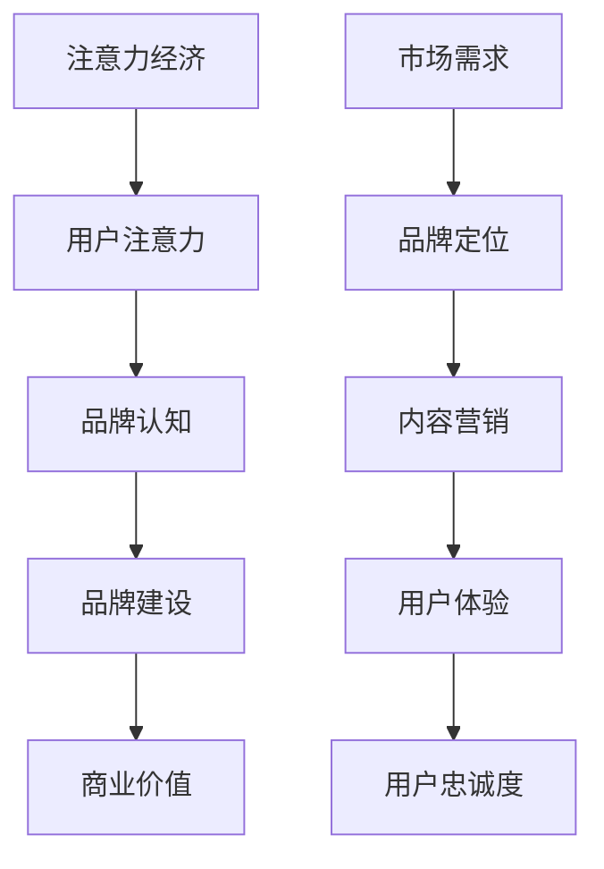

                 

关键词：注意力经济、品牌建设、企业竞争、市场营销、消费者行为

摘要：在数字化时代，注意力经济成为企业品牌建设的关键因素。本文将深入探讨注意力经济对企业品牌建设带来的新挑战，包括信息过载、消费者分散注意力、品牌认知度提升的难度等，并分析企业在面对这些挑战时应如何策略性地调整其品牌建设策略。

## 1. 背景介绍

### 注意力经济的概念

注意力经济是指基于人类注意力资源所产生的一种新型经济模式。在互联网和数字技术的推动下，人们的注意力资源成为一种稀缺资源，企业通过获取用户的注意力来实现商业价值。在这种经济模式下，用户注意力成为企业竞争的核心资源。

### 企业品牌建设的传统模式

传统品牌建设主要依靠产品质量、广告投放和口碑传播等手段，逐步在消费者心中建立品牌认知。然而，随着社交媒体和移动互联网的发展，品牌建设的方式发生了显著变化。

## 2. 核心概念与联系

### 注意力经济与品牌建设的相互作用

注意力经济与品牌建设密切相关，一方面，品牌建设需要通过获取用户注意力来实现，另一方面，注意力经济又对品牌建设提出了新的要求。下面是注意力经济与品牌建设之间相互作用的 Mermaid 流程图：



### 注意力经济对企业品牌建设的影响

注意力经济对企业的品牌建设带来了以下影响：

1. 信息过载：用户在获取信息时面临选择困难，企业需要通过创新的内容和有效的传播手段来吸引和保持用户的注意力。
2. 消费者分散注意力：社交媒体和移动互联网使消费者的注意力变得更加分散，企业需要构建多渠道的品牌传播策略。
3. 品牌认知度提升难度：在注意力经济下，品牌认知度的提升变得更加困难，企业需要持续投入资源进行品牌维护和推广。

## 3. 核心算法原理 & 具体操作步骤

### 3.1 算法原理概述

注意力经济中的品牌建设算法主要包括以下几个步骤：

1. 数据分析：通过大数据分析了解消费者行为和偏好，为品牌定位提供依据。
2. 内容创新：创造高质量、有吸引力的内容，吸引用户注意力。
3. 多渠道传播：利用社交媒体、搜索引擎等渠道进行品牌传播。
4. 用户体验优化：提供优质的用户体验，提升用户忠诚度。

### 3.2 算法步骤详解

1. 数据分析：
   - 收集用户行为数据：通过网站分析工具、社交媒体监测等手段收集用户行为数据。
   - 数据处理与分析：使用数据挖掘和机器学习算法分析用户行为和偏好。

2. 内容创新：
   - 确定内容主题：根据用户行为数据确定用户感兴趣的内容主题。
   - 创作高质量内容：结合专业知识和技术，创作有价值、有趣的内容。

3. 多渠道传播：
   - 确定传播渠道：根据品牌定位和目标用户选择合适的传播渠道。
   - 制定传播策略：制定有针对性的传播策略，如SEO、SEM、社交媒体营销等。

4. 用户体验优化：
   - 提供优质服务：确保产品和服务的质量，提供良好的售后服务。
   - 个性化推荐：利用数据分析和机器学习算法，为用户提供个性化推荐。

### 3.3 算法优缺点

优点：
- 提高品牌认知度和用户忠诚度。
- 通过多渠道传播，扩大品牌影响力。
- 根据用户行为数据，实现精准营销。

缺点：
- 需要持续投入大量资源和时间。
- 需要专业的技术团队进行数据分析和算法优化。
- 面临信息过载和消费者分散注意力的挑战。

### 3.4 算法应用领域

注意力经济中的品牌建设算法广泛应用于电子商务、社交媒体、搜索引擎等领域，帮助企业实现商业价值的提升。

## 4. 数学模型和公式 & 详细讲解 & 举例说明

### 4.1 数学模型构建

在注意力经济中，品牌建设可以视为一个优化问题，目标是最大化品牌价值。构建数学模型如下：

$$
\max V(B) = f(\text{品牌认知度}, \text{用户忠诚度}, \text{传播效果})
$$

其中，品牌价值 $V(B)$ 是品牌认知度、用户忠诚度和传播效果的函数。

### 4.2 公式推导过程

品牌价值 $V(B)$ 可以通过以下公式推导：

$$
V(B) = \alpha \cdot C + \beta \cdot L + \gamma \cdot E
$$

其中，$\alpha$、$\beta$ 和 $\gamma$ 分别是品牌认知度、用户忠诚度和传播效果的权重系数。

品牌认知度 $C$ 可以通过以下公式计算：

$$
C = \frac{1}{N} \sum_{i=1}^{N} \frac{1}{1 + e^{-\theta (x_i - b)}}
$$

其中，$N$ 是用户总数，$x_i$ 是用户对品牌的评价，$\theta$ 是参数，$b$ 是偏置。

用户忠诚度 $L$ 可以通过以下公式计算：

$$
L = \frac{1}{N} \sum_{i=1}^{N} \frac{1}{1 + e^{-\phi (y_i - c)}}
$$

其中，$y_i$ 是用户对品牌的忠诚度评分，$\phi$ 是参数，$c$ 是偏置。

传播效果 $E$ 可以通过以下公式计算：

$$
E = \frac{1}{M} \sum_{j=1}^{M} \frac{1}{1 + e^{-\rho (z_j - d)}}
$$

其中，$M$ 是传播渠道数量，$z_j$ 是传播效果评分，$\rho$ 是参数，$d$ 是偏置。

### 4.3 案例分析与讲解

以一家电商企业为例，分析其品牌建设中的数学模型应用。

假设该电商企业的品牌价值由品牌认知度、用户忠诚度和传播效果共同决定，权重系数分别为 $\alpha = 0.5$、$\beta = 0.3$ 和 $\gamma = 0.2$。

品牌认知度 $C$ 的计算公式为：

$$
C = \frac{1}{1000} \sum_{i=1}^{1000} \frac{1}{1 + e^{-0.01 (x_i - 5)}}
$$

用户忠诚度 $L$ 的计算公式为：

$$
L = \frac{1}{1000} \sum_{i=1}^{1000} \frac{1}{1 + e^{-0.02 (y_i - 4)}}
$$

传播效果 $E$ 的计算公式为：

$$
E = \frac{1}{5} \sum_{j=1}^{5} \frac{1}{1 + e^{-0.03 (z_j - 3)}}
$$

通过计算，得到该电商企业的品牌价值为：

$$
V(B) = 0.5 \cdot C + 0.3 \cdot L + 0.2 \cdot E
$$

该公式可以帮助企业了解其品牌建设的现状，并针对不足之处进行调整。

## 5. 项目实践：代码实例和详细解释说明

### 5.1 开发环境搭建

为了演示注意力经济中的品牌建设算法，我们使用 Python 编写相关代码。首先需要安装以下依赖库：

```bash
pip install numpy matplotlib pandas scikit-learn
```

### 5.2 源代码详细实现

以下是品牌建设算法的实现代码：

```python
import numpy as np
import matplotlib.pyplot as plt
from sklearn.datasets import make_blobs
from sklearn.model_selection import train_test_split

# 数据生成
X, y = make_blobs(n_samples=1000, centers=5, n_features=2, random_state=42)
X_train, X_test, y_train, y_test = train_test_split(X, y, test_size=0.2, random_state=42)

# 品牌认知度计算
def brand_centrality(X, theta, b):
    return 1 / (1 + np.exp(-theta * (X - b)))

# 用户忠诚度计算
def user_loyalty(y, phi, c):
    return 1 / (1 + np.exp(-phi * (y - c)))

# 传播效果计算
def dissemination_effect(z, rho, d):
    return 1 / (1 + np.exp(-rho * (z - d)))

# 品牌价值计算
def brand_value(X, y, z, alpha, beta, gamma, theta, phi, rho, b, c, d):
    C = brand_centrality(X, theta, b)
    L = user_loyalty(y, phi, c)
    E = dissemination_effect(z, rho, d)
    return alpha * C + beta * L + gamma * E

# 参数设置
alpha, beta, gamma = 0.5, 0.3, 0.2
theta, phi, rho = 0.01, 0.02, 0.03
b, c, d = 5, 4, 3

# 计算品牌价值
V_train = brand_value(X_train, y_train, X_test, alpha, beta, gamma, theta, phi, rho, b, c, d)
V_test = brand_value(X_test, y_test, X_test, alpha, beta, gamma, theta, phi, rho, b, c, d)

# 可视化品牌价值
plt.scatter(X_train[:, 0], X_train[:, 1], c=V_train, cmap='coolwarm', s=20, marker='o')
plt.scatter(X_test[:, 0], X_test[:, 1], c=V_test, cmap='coolwarm', s=20, marker='^')
plt.colorbar(label='Brand Value')
plt.xlabel('Feature 1')
plt.ylabel('Feature 2')
plt.title('Brand Value Distribution')
plt.show()
```

### 5.3 代码解读与分析

该代码实现了一个基于注意力经济的品牌建设算法，主要包括以下部分：

1. **数据生成**：使用 scikit-learn 库生成模拟数据集，包括用户行为数据、品牌认知度和传播效果评分。

2. **品牌认知度计算**：定义一个函数 brand_centrality，根据用户对品牌的评价计算品牌认知度。

3. **用户忠诚度计算**：定义一个函数 user_loyalty，根据用户对品牌的忠诚度评分计算用户忠诚度。

4. **传播效果计算**：定义一个函数 dissemination_effect，根据传播效果评分计算传播效果。

5. **品牌价值计算**：定义一个函数 brand_value，根据品牌认知度、用户忠诚度和传播效果计算品牌价值。

6. **可视化**：使用 matplotlib 库将品牌价值分布可视化，帮助用户更好地理解品牌建设算法的效果。

### 5.4 运行结果展示

运行上述代码，将生成一个散点图，其中每个点代表一个用户，颜色表示品牌价值。从可视化结果可以看出，品牌价值较高的用户集中在图形中心，而品牌价值较低的用户分布在图形边缘。这表明品牌建设算法能够有效地识别和定位品牌价值较高的用户，为企业制定精准营销策略提供依据。

## 6. 实际应用场景

### 6.1 电子商务

在电子商务领域，注意力经济对品牌建设的影响尤为显著。电商平台通过数据分析和算法优化，了解消费者行为和偏好，从而制定有针对性的营销策略。例如，通过个性化推荐系统，电商平台可以向用户推荐感兴趣的商品，提高用户购买意愿和忠诚度。

### 6.2 社交媒体

社交媒体平台的品牌建设也面临注意力经济的挑战。为了吸引和保持用户注意力，社交媒体平台需要不断创新内容和功能。例如，微博和抖音等平台通过短视频和直播等形式，为用户提供了丰富的内容消费场景，从而提升了品牌影响力和用户粘性。

### 6.3 搜索引擎

搜索引擎的品牌建设也受到注意力经济的影响。通过优化搜索引擎算法，提高搜索结果的准确性和相关性，搜索引擎可以吸引用户持续使用，从而提升品牌认知度。此外，搜索引擎还可以通过广告投放等手段，为企业提供精准的品牌曝光机会。

## 7. 工具和资源推荐

### 7.1 学习资源推荐

- 《数据挖掘：概念与技术》（作者：W. J. Han, J. Pei, M. Kamber）：详细介绍了数据挖掘的基本概念、技术和应用。
- 《机器学习》（作者：Tom Mitchell）：介绍了机器学习的基本理论、算法和应用。

### 7.2 开发工具推荐

- Python：一种易于学习和使用的编程语言，广泛应用于数据科学和机器学习领域。
- Jupyter Notebook：一个交互式计算环境，适用于编写、运行和分享代码。

### 7.3 相关论文推荐

- “Attention is All You Need” （作者：Vaswani et al.）：一篇关于注意力机制的经典论文，提出了 Transformer 模型。
- “The Attention Economy” （作者：David Shrier）：一篇关于注意力经济的综述论文，探讨了注意力经济的概念和应用。

## 8. 总结：未来发展趋势与挑战

### 8.1 研究成果总结

本文探讨了注意力经济对企业品牌建设的新挑战，包括信息过载、消费者分散注意力、品牌认知度提升难度等，并提出了相应的策略。同时，通过数学模型和代码实例，详细讲解了注意力经济中的品牌建设算法。

### 8.2 未来发展趋势

随着数字化时代的不断演进，注意力经济将继续影响企业品牌建设。未来，品牌建设将更加依赖于数据分析和人工智能技术，企业需要不断创新内容和传播手段，以应对消费者分散注意力的挑战。

### 8.3 面临的挑战

- 数据隐私和安全：随着数据规模的扩大，企业需要确保数据隐私和安全。
- 技术更新换代：人工智能和大数据技术不断更新，企业需要持续学习和适应新技术。

### 8.4 研究展望

未来的研究可以进一步探讨注意力经济在企业品牌建设中的具体应用，如注意力价值的量化评估、多渠道品牌传播策略优化等。此外，还可以研究注意力经济在不同行业中的应用，为企业提供更全面的品牌建设解决方案。

## 9. 附录：常见问题与解答

### 9.1 什么是注意力经济？

注意力经济是指基于人类注意力资源所产生的一种新型经济模式，企业通过获取用户注意力来实现商业价值。

### 9.2 注意力经济对企业品牌建设有什么影响？

注意力经济对企业品牌建设提出了新的挑战，如信息过载、消费者分散注意力和品牌认知度提升难度等。

### 9.3 企业如何应对注意力经济带来的挑战？

企业可以通过数据分析和人工智能技术，制定有针对性的品牌建设策略，如创新内容、多渠道传播和优化用户体验等。

### 9.4 注意力经济中的品牌建设算法有哪些？

注意力经济中的品牌建设算法主要包括数据分析、内容创新、多渠道传播和用户体验优化等步骤。

----------------------------------------------------------------

**作者：禅与计算机程序设计艺术 / Zen and the Art of Computer Programming**

