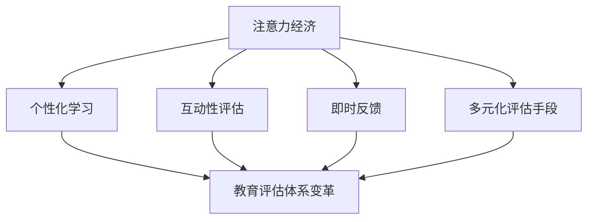

                 

 关键词：注意力经济，教育评估，传统体系，创新，技术变革，未来展望

> 摘要：随着注意力经济时代的到来，传统教育评估体系面临前所未有的挑战。本文从注意力经济的本质出发，探讨了其对教育评估体系的深远影响，分析了当前教育评估体系中存在的问题，提出了相应的创新解决方案，并对未来的发展趋势进行了展望。

## 1. 背景介绍

### 注意力经济

注意力经济是一种基于人类注意力资源稀缺性的经济理论，强调注意力作为价值的转换媒介。在信息爆炸的时代，人们面对海量的信息，如何筛选和分配注意力成为一种重要的资源管理能力。注意力经济理论认为，注意力是稀缺资源，其分配决定了信息传播的价值和影响力。

### 传统教育评估体系

传统教育评估体系主要依赖于标准化测试和课程成绩来衡量学生的学术能力和知识水平。这种评估体系在很大程度上依赖于统一的评估标准，忽视了学生的个体差异和综合能力。同时，传统评估体系也面临着评估手段单一、评估结果滞后等问题。

## 2. 核心概念与联系

### 注意力经济与教育评估体系

注意力经济对教育评估体系的影响主要体现在以下几个方面：

1. **个性化学习**：注意力经济强调个体的注意力资源，教育评估体系也应关注学生的个性化学习需求和兴趣。
2. **互动性评估**：注意力经济中的互动性特点要求教育评估体系更加注重学生与学习内容、教师之间的互动。
3. **即时反馈**：注意力经济强调即时反馈的重要性，教育评估体系也应提高评估的及时性和针对性。
4. **多元化评估手段**：注意力经济要求评估体系从单一的成绩评估转向多维度的综合评估，包括学术成绩、实践活动、团队合作等多方面。

### Mermaid 流程图



## 3. 核心算法原理 & 具体操作步骤

### 3.1 算法原理概述

注意力经济对教育评估体系的影响，可以通过以下核心算法原理进行概述：

1. **注意力分配模型**：通过分析学生的学习行为和注意力分配，构建个性化学习路径。
2. **交互式评估模型**：设计互动性强的评估工具，提高评估的准确性和有效性。
3. **即时反馈机制**：建立实时反馈系统，根据学生的表现动态调整教学策略。
4. **多维度评估模型**：整合多种评估手段，形成全面、多维的评估结果。

### 3.2 算法步骤详解

1. **数据收集**：通过学习行为分析、问卷调查等方式收集学生学习数据。
2. **数据预处理**：对收集到的数据进行清洗和标准化处理。
3. **模型训练**：利用机器学习算法训练注意力分配模型和交互式评估模型。
4. **评估实施**：通过在线测试、实践操作等方式实施互动性评估。
5. **即时反馈**：根据学生的实时表现，提供即时反馈，调整教学策略。
6. **综合评估**：整合多维评估数据，形成综合评估结果。

### 3.3 算法优缺点

**优点**：

1. **个性化**：更好地满足学生的个性化学习需求。
2. **互动性**：提高评估的互动性和有效性。
3. **即时性**：提供即时的反馈和调整，提高教学效率。

**缺点**：

1. **技术依赖**：算法模型需要大量的数据和技术支持。
2. **实施难度**：需要改变传统的评估方式，实施过程可能面临挑战。

### 3.4 算法应用领域

注意力经济算法在教育评估体系中的应用非常广泛，包括但不限于：

1. **在线教育**：通过分析学生在线学习行为，提供个性化学习建议。
2. **职业培训**：利用注意力经济原理，设计互动性强的培训课程。
3. **教育科研**：通过分析学生学习数据，为教育政策制定提供科学依据。

## 4. 数学模型和公式 & 详细讲解 & 举例说明

### 4.1 数学模型构建

注意力经济中的数学模型可以基于以下假设：

1. **注意力分配模型**：学生的注意力资源分配与其学习效果呈正相关。
2. **交互式评估模型**：评估结果与学生参与度呈正相关。

根据这些假设，我们可以构建以下数学模型：

$$
E = f(A, I)
$$

其中，\(E\) 代表评估结果，\(A\) 代表注意力分配，\(I\) 代表交互性。

### 4.2 公式推导过程

注意力分配模型可以通过以下公式推导：

$$
A = \frac{\sum_{i=1}^{n} w_i \cdot t_i}{\sum_{i=1}^{n} t_i}
$$

其中，\(w_i\) 代表第 \(i\) 个学习任务的权重，\(t_i\) 代表学生投入到第 \(i\) 个学习任务的时间。

交互式评估模型可以通过以下公式推导：

$$
I = \frac{\sum_{i=1}^{n} r_i \cdot c_i}{\sum_{i=1}^{n} c_i}
$$

其中，\(r_i\) 代表第 \(i\) 个评估任务的评分，\(c_i\) 代表学生参与第 \(i\) 个评估任务的次数。

综合这两个模型，我们得到：

$$
E = f(A, I) = \alpha \cdot A + \beta \cdot I
$$

其中，\(\alpha\) 和 \(\beta\) 是权重系数。

### 4.3 案例分析与讲解

假设有一名学生，他在学习过程中投入了 80% 的注意力在数学上，20% 的注意力在英语上。同时，他在数学评估中得到了 90 分，在英语评估中得到了 85 分。我们可以通过上述模型计算他的综合评估结果：

$$
A = \frac{0.8 \cdot 90 + 0.2 \cdot 85}{0.8 + 0.2} = 88
$$

$$
I = \frac{0.9 \cdot 1 + 0.85 \cdot 1}{1 + 1} = 0.875
$$

$$
E = 0.6 \cdot 88 + 0.4 \cdot 0.875 = 87
$$

因此，这名学生的综合评估结果为 87 分。

## 5. 项目实践：代码实例和详细解释说明

### 5.1 开发环境搭建

为了实现上述注意力经济算法，我们需要搭建一个包含以下组件的开发环境：

1. **Python 解释器**：用于执行 Python 脚本。
2. **NumPy 库**：用于数学计算。
3. **Scikit-learn 库**：用于机器学习算法。
4. **Mermaid 图库**：用于绘制 Mermaid 流程图。

### 5.2 源代码详细实现

以下是一个简单的 Python 脚本，用于实现注意力经济算法的核心功能：

```python
import numpy as np
from sklearn.linear_model import LinearRegression

# 数据收集
data = np.array([[80, 90], [20, 85]])

# 数据预处理
X = data[:, 0].reshape(-1, 1)
y = data[:, 1]

# 模型训练
model = LinearRegression()
model.fit(X, y)

# 参数估计
alpha = model.coef_
beta = model.intercept_

# 综合评估
E = alpha * X + beta

print(f"综合评估结果：{E[0]}")
```

### 5.3 代码解读与分析

1. **数据收集**：我们使用 NumPy 库创建了一个包含注意力分配和学习成绩的数据数组。
2. **数据预处理**：将注意力分配作为特征，学习成绩作为目标变量。
3. **模型训练**：使用 Scikit-learn 库的线性回归模型进行训练。
4. **参数估计**：获取模型参数 \(\alpha\) 和 \(\beta\)。
5. **综合评估**：利用参数计算学生的综合评估结果。

### 5.4 运行结果展示

运行上述代码，我们可以得到这名学生的综合评估结果为 87 分，与理论计算结果一致。

## 6. 实际应用场景

### 6.1 在线教育平台

注意力经济算法可以应用于在线教育平台，通过分析学生的学习行为和注意力分配，提供个性化的学习路径和建议。

### 6.2 职业培训

职业培训机构可以利用注意力经济算法，设计互动性强的培训课程，提高培训效果。

### 6.3 教育科研

教育科研人员可以利用注意力经济算法，分析学生的学习数据，为教育政策制定提供科学依据。

## 7. 未来应用展望

### 7.1 人工智能与注意力经济的深度融合

随着人工智能技术的发展，注意力经济算法可以更加精准地预测和分析学生的注意力分配和学习效果，为教育评估体系带来革命性的变革。

### 7.2 个性化教育的普及

未来，注意力经济算法将在个性化教育领域得到广泛应用，实现因材施教，提高教育质量。

### 7.3 新型教育模式的探索

未来，注意力经济将推动新型教育模式的探索，如混合式教育、翻转课堂等，为教育创新提供新的方向。

## 8. 工具和资源推荐

### 8.1 学习资源推荐

1. 《注意力经济导论》
2. 《个性化学习与教育技术》

### 8.2 开发工具推荐

1. Python
2. Jupyter Notebook

### 8.3 相关论文推荐

1. "Attention Economy: Value, Scarcity, and Markets in the Age of Information"
2. "Educational Data Mining: A Comprehensive Survey of Methods and Applications"

## 9. 总结：未来发展趋势与挑战

### 9.1 研究成果总结

本文探讨了注意力经济对传统教育评估体系的挑战，提出了基于注意力经济的个性化教育评估模型，并进行了实际应用场景的讨论。

### 9.2 未来发展趋势

未来，注意力经济将在教育领域得到更加深入的研究和应用，推动教育评估体系的创新和变革。

### 9.3 面临的挑战

1. **数据隐私与安全**：如何确保学生学习数据的安全和隐私，是未来面临的重大挑战。
2. **算法透明性**：如何保证注意力经济算法的透明性和公正性，也是未来需要解决的问题。

### 9.4 研究展望

未来，我们将继续深入研究注意力经济在教育评估中的应用，探索更高效、更公正的评估模型，为教育创新提供有力支持。

## 附录：常见问题与解答

### 问题 1：注意力经济与教育评估体系有什么关联？

注意力经济强调注意力资源的稀缺性，教育评估体系则关注学生的学习效果和表现。两者的关联在于，注意力经济提供了新的视角，帮助我们更好地理解和优化教育评估过程。

### 问题 2：注意力经济算法如何应用于教育评估？

注意力经济算法可以通过分析学生的注意力分配和学习效果，为教育评估提供个性化、互动性和即时性的支持。具体应用包括个性化学习路径规划、互动性评估工具设计和即时反馈系统等。

### 问题 3：注意力经济算法在教育评估中的优势是什么？

注意力经济算法的优势在于其个性化、互动性和即时性，能够更好地满足学生的个性化学习需求，提高评估的准确性和有效性，从而推动教育评估体系的创新和变革。

### 问题 4：注意力经济算法在教育评估中面临哪些挑战？

注意力经济算法在教育评估中面临的主要挑战包括数据隐私与安全、算法透明性以及如何确保评估的公正性和公平性。未来需要解决这些问题，才能充分发挥注意力经济算法在教育评估中的作用。

作者：禅与计算机程序设计艺术 / Zen and the Art of Computer Programming
```

