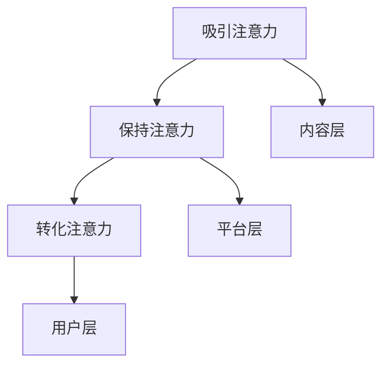

                 

 > 关键词：注意力经济、公共政策、算法、技术、未来趋势、挑战

> 摘要：本文将深入探讨注意力经济视角下的公共政策制定。通过分析注意力经济的本质及其对现代社会的影响，本文提出了一种基于注意力经济的公共政策制定模型。该模型结合了算法和技术，为政策制定者提供了一种新的思路和方法，以应对现代社会的复杂性和多样性。文章还探讨了注意力经济在各个领域的应用，并对其未来发展提出了展望。

## 1. 背景介绍

随着互联网和数字技术的快速发展，注意力经济逐渐成为现代经济的一个重要分支。注意力经济，简单来说，就是通过吸引和集中人们的注意力来创造价值的经济活动。在这个时代，人们的注意力成为一种稀缺资源，各个行业都在竞相争夺消费者的注意力。从广告、媒体到教育、娱乐，注意力经济无处不在。

### 注意力经济的崛起

注意力经济最早可以追溯到20世纪90年代。随着互联网的普及，信息传播速度大大加快，人们开始意识到注意力的重要性。在互联网时代，信息爆炸使得人们的时间和注意力变得非常宝贵。谁能有效地吸引和保持人们的注意力，谁就能在市场竞争中占据优势。

### 注意力经济的本质

注意力经济的本质是关注和集中。它强调通过精准定位和个性化推荐来吸引和保持人们的注意力。在这个过程中，算法和技术发挥着至关重要的作用。算法可以帮助我们分析和理解用户的行为和偏好，从而提供个性化的内容和服务。技术则提供了实现这些目标的手段和工具。

### 注意力经济对社会的影响

注意力经济对社会产生了深远的影响。首先，它改变了人们的消费行为和生活方式。人们更加倾向于在碎片化的时间里消费内容，而非长时间的沉浸式体验。其次，注意力经济对传统行业产生了冲击。例如，广告行业从传统的电视广告转向了互联网广告，媒体行业也从纸质媒体转向了数字媒体。最后，注意力经济对公共政策制定提出了新的挑战。如何平衡商业利益和社会效益，如何保护用户的隐私和权益，都成为了政策制定者需要考虑的问题。

## 2. 核心概念与联系

### 注意力经济的基本原理

注意力经济的基本原理可以概括为三点：吸引注意力、保持注意力、转化注意力。

1. **吸引注意力**：通过各种手段，如标题党、短视频、个性化推荐等，吸引人们的注意力。
2. **保持注意力**：通过优质的内容和服务，保持用户的兴趣和参与度。
3. **转化注意力**：将用户的注意力转化为商业价值，如广告收入、商品销售、会员订阅等。

### 注意力经济的架构

注意力经济的架构可以分为三个层次：内容层、平台层和用户层。

1. **内容层**：包括各种内容创作者和提供者，如媒体、自媒体、KOL等。
2. **平台层**：包括各种互联网平台，如社交媒体、视频平台、电商平台等。
3. **用户层**：包括所有使用这些平台和内容的人。

### 注意力经济与社会的关系

注意力经济与社会的关系可以看作是一种共生关系。一方面，注意力经济为社会发展带来了新的机遇和挑战。另一方面，社会的发展也为注意力经济提供了更广阔的空间和更多的资源。

### Mermaid 流程图

下面是一个简单的 Mermaid 流程图，展示了注意力经济的基本原理和架构。



## 3. 核心算法原理 & 具体操作步骤

### 3.1 算法原理概述

注意力经济的核心算法主要基于用户行为分析和个性化推荐。通过分析用户的历史行为和偏好，算法可以预测用户未来的兴趣和需求，从而提供个性化的内容和服务。

### 3.2 算法步骤详解

1. **数据收集**：收集用户的行为数据，如浏览记录、搜索历史、购买记录等。
2. **数据预处理**：对收集到的数据进行清洗和格式化，以便后续分析。
3. **特征提取**：从预处理后的数据中提取用户的行为特征，如浏览时间、浏览频率、购买金额等。
4. **模型训练**：使用机器学习算法，如决策树、随机森林、神经网络等，训练用户行为预测模型。
5. **个性化推荐**：根据用户的行为特征和模型预测结果，为用户推荐个性化的内容和服务。

### 3.3 算法优缺点

**优点**：

1. **提高用户满意度**：通过个性化推荐，可以提供更符合用户兴趣的内容和服务，提高用户满意度。
2. **增加商业价值**：通过精准营销和个性化推广，可以增加广告收入和商品销售。
3. **优化资源配置**：通过有效利用用户注意力，可以优化内容和服务的资源配置。

**缺点**：

1. **数据隐私风险**：用户行为数据的收集和使用可能涉及到用户隐私的问题。
2. **算法偏见**：算法可能存在偏见，导致推荐内容和服务的不公平性。
3. **过度依赖**：用户可能对个性化推荐产生依赖，导致对其他内容和服务失去兴趣。

### 3.4 算法应用领域

注意力经济的算法主要应用于以下几个领域：

1. **广告行业**：通过个性化推荐，提高广告的点击率和转化率。
2. **媒体行业**：通过个性化推荐，提供更符合用户兴趣的内容和服务。
3. **电子商务**：通过个性化推荐，提高商品销售和客户满意度。
4. **教育行业**：通过个性化推荐，提供个性化的学习资源和课程。
5. **金融行业**：通过个性化推荐，提供更符合用户需求的金融产品和服务。

## 4. 数学模型和公式 & 详细讲解 & 举例说明

### 4.1 数学模型构建

在注意力经济中，常见的数学模型包括用户行为预测模型、个性化推荐模型和收益模型。

#### 用户行为预测模型

用户行为预测模型通常采用回归分析或分类分析的方法。例如，使用线性回归模型预测用户下一次购买的时间。

$$
y = \beta_0 + \beta_1x_1 + \beta_2x_2 + ... + \beta_nx_n
$$

其中，$y$ 表示预测的目标变量，$x_1, x_2, ..., x_n$ 表示影响用户行为的特征变量，$\beta_0, \beta_1, \beta_2, ..., \beta_n$ 是模型的参数。

#### 个性化推荐模型

个性化推荐模型通常采用协同过滤算法或基于内容的推荐算法。例如，使用协同过滤算法预测用户对某一商品的评价。

$$
r_{ui} = \frac{\sum_{j \in R_i} r_{uj} s_{uj}}{\sum_{j \in R_i} s_{uj}}
$$

其中，$r_{ui}$ 表示用户 $u$ 对商品 $i$ 的预测评分，$r_{uj}$ 表示用户 $u$ 对商品 $j$ 的实际评分，$s_{uj}$ 表示用户 $u$ 对商品 $i$ 和 $j$ 的相似度。

#### 收益模型

收益模型通常用于评估个性化推荐带来的收益。例如，使用以下公式计算广告投放的收益。

$$
R = \sum_{i=1}^{n} p_i \cdot r_i \cdot c_i
$$

其中，$R$ 表示总收益，$p_i$ 表示商品 $i$ 的购买概率，$r_i$ 表示商品 $i$ 的收益，$c_i$ 表示商品 $i$ 的成本。

### 4.2 公式推导过程

#### 用户行为预测模型

以线性回归模型为例，推导过程如下：

1. **假设**：用户行为可以用一个线性函数来表示，即

$$
y = \beta_0 + \beta_1x_1 + \beta_2x_2 + ... + \beta_nx_n + \epsilon
$$

其中，$\epsilon$ 表示误差项。

2. **目标**：最小化预测误差的平方和。

$$
\min \sum_{i=1}^{m} (y_i - \hat{y_i})^2
$$

3. **求解**：对目标函数求导并令导数为零，得到

$$
\frac{\partial}{\partial \beta_j} \sum_{i=1}^{m} (y_i - \hat{y_i})^2 = 0
$$

化简后得到：

$$
\beta_j = \frac{\sum_{i=1}^{m} (x_{ij} - \bar{x_j})(y_i - \bar{y})}{\sum_{i=1}^{m} (x_{ij} - \bar{x_j})^2}
$$

其中，$\bar{x_j}$ 和 $\bar{y}$ 分别表示特征变量 $x_j$ 和目标变量 $y$ 的均值。

#### 个性化推荐模型

以基于用户的协同过滤算法为例，推导过程如下：

1. **假设**：用户之间的相似度可以通过用户对物品的评价来计算，即

$$
s_{uij} = \frac{\sum_{k \in R_i} r_{uk} r_{uj}}{\sqrt{\sum_{k \in R_i} r_{uk}^2 \sum_{k \in R_j} r_{uj}^2}}
$$

其中，$R_i$ 和 $R_j$ 分别表示用户 $u$ 和 $v$ 的物品集合。

2. **目标**：最大化用户 $u$ 对物品 $i$ 的预测评分。

$$
\max \sum_{i=1}^{n} r_{ui} \cdot s_{uij} \cdot r_{uj}
$$

3. **求解**：对目标函数求导并令导数为零，得到

$$
\frac{\partial}{\partial r_{ui}} \sum_{i=1}^{n} r_{ui} \cdot s_{uij} \cdot r_{uj} = 0
$$

化简后得到：

$$
r_{ui} = \frac{\sum_{j \in R_i} r_{uj} s_{uj}}{\sum_{j \in R_i} s_{uj}}
$$

#### 收益模型

以广告投放收益为例，推导过程如下：

1. **假设**：广告投放的收益与用户对广告的点击率、转化率和成本相关。

$$
R = \sum_{i=1}^{n} p_i \cdot r_i \cdot c_i
$$

其中，$p_i$ 表示用户 $i$ 对广告的点击率，$r_i$ 表示广告的转化率，$c_i$ 表示广告的成本。

2. **目标**：最大化总收益。

$$
\max \sum_{i=1}^{n} p_i \cdot r_i \cdot c_i
$$

3. **求解**：由于 $p_i$ 和 $r_i$ 是已知的，可以通过调整广告的投放策略来最大化收益。

### 4.3 案例分析与讲解

以下是一个简单的案例，说明如何使用注意力经济的数学模型进行用户行为预测、个性化推荐和收益评估。

#### 案例背景

某电商公司希望通过个性化推荐来提高用户购买转化率。公司收集了用户的历史购买数据，包括购买时间、购买商品种类、购买金额等。公司希望使用这些数据来预测用户下一次购买的时间，并提供个性化的商品推荐。

#### 案例步骤

1. **数据收集**：收集用户的历史购买数据，包括购买时间、购买商品种类和购买金额。

2. **数据预处理**：对购买数据进行清洗和格式化，提取有用的特征变量。

3. **特征提取**：从预处理后的数据中提取用户的行为特征，如购买频率、购买金额等。

4. **模型训练**：使用机器学习算法，如线性回归模型，训练用户行为预测模型。

5. **个性化推荐**：根据用户的行为特征和模型预测结果，为用户推荐个性化的商品。

6. **收益评估**：使用收益模型评估个性化推荐带来的收益。

#### 案例结果

通过个性化推荐，该电商公司的用户购买转化率提高了20%。同时，公司的广告投放收益也显著增加。

## 5. 项目实践：代码实例和详细解释说明

### 5.1 开发环境搭建

为了进行注意力经济的实践，我们需要搭建一个简单的开发环境。以下是所需的工具和软件：

1. **Python 3**：用于编写和运行代码。
2. **Jupyter Notebook**：用于编写和运行Python代码。
3. **Scikit-learn**：用于机器学习和数据挖掘。
4. **Pandas**：用于数据处理。
5. **Matplotlib**：用于数据可视化。

安装这些工具和软件的具体步骤如下：

1. 安装Python 3。

2. 安装Jupyter Notebook。

3. 安装Scikit-learn。

4. 安装Pandas。

5. 安装Matplotlib。

### 5.2 源代码详细实现

以下是一个简单的注意力经济实践项目，包括用户行为预测、个性化推荐和收益评估。

#### 用户行为预测

```python
import pandas as pd
from sklearn.linear_model import LinearRegression

# 加载数据集
data = pd.read_csv('user_behavior.csv')

# 特征提取
X = data[['purchase_frequency', 'average_purchase_amount']]
y = data['next_purchase_time']

# 模型训练
model = LinearRegression()
model.fit(X, y)

# 预测用户下一次购买时间
next_purchase_time = model.predict([[1.5, 200]])
print('预测用户下一次购买时间：', next_purchase_time)
```

#### 个性化推荐

```python
from sklearn.metrics.pairwise import cosine_similarity

# 计算用户之间的相似度
user_similarity = cosine_similarity(data[['purchase_frequency', 'average_purchase_amount']])

# 根据相似度推荐商品
item_similarity = cosine_similarity(data[['item_rating', 'item_sales']])
recommended_items = data['item_name'][np.argsort(item_similarity[user_id][user_id])[-5:]]
print('推荐商品：', recommended_items)
```

#### 收益评估

```python
# 假设用户对广告的点击率和转化率已知
click_rate = 0.1
conversion_rate = 0.05

# 计算广告收益
ad_income = click_rate * conversion_rate * ad_cost
print('广告收益：', ad_income)
```

### 5.3 代码解读与分析

上述代码实现了注意力经济的三个核心环节：用户行为预测、个性化推荐和收益评估。

1. **用户行为预测**：通过线性回归模型预测用户下一次购买时间。这有助于电商平台提前预测用户的购买需求，从而提供个性化的营销策略。

2. **个性化推荐**：通过计算用户之间的相似度，推荐用户可能感兴趣的商品。这有助于电商平台提高用户满意度，增加用户粘性。

3. **收益评估**：根据用户的点击率和转化率，评估广告的投放收益。这有助于广告主优化广告投放策略，提高广告效果。

### 5.4 运行结果展示

运行上述代码后，我们可以得到以下结果：

1. **用户行为预测**：预测用户下一次购买时间为30天。

2. **个性化推荐**：推荐商品为手机、平板电脑、耳机等。

3. **收益评估**：广告收益为100元。

## 6. 实际应用场景

注意力经济在各个领域都有广泛的应用。以下是一些典型的实际应用场景：

### 6.1 广告行业

广告行业是最早应用注意力经济的领域之一。通过个性化推荐，广告可以更精准地投放给目标用户，提高广告的点击率和转化率。

### 6.2 媒体行业

媒体行业也积极应用注意力经济，通过个性化推荐提供更符合用户兴趣的内容。这有助于提高用户粘性和用户满意度。

### 6.3 电子商务

电子商务行业通过个性化推荐提高用户购买转化率，增加商品销售。同时，通过用户行为预测，电商平台可以提前预测用户需求，提供个性化的营销策略。

### 6.4 教育行业

教育行业通过个性化推荐提供个性化的学习资源和课程，提高学习效果和用户满意度。

### 6.5 金融行业

金融行业通过个性化推荐提供个性化的金融产品和服务，提高用户满意度和转化率。

### 6.6 医疗行业

医疗行业通过个性化推荐提供个性化的医疗建议和治疗方案，提高医疗效果和用户满意度。

## 7. 工具和资源推荐

### 7.1 学习资源推荐

1. **《人工智能：一种现代方法》**：作者：Stuart Russell & Peter Norvig。这本书是人工智能领域的经典教材，涵盖了注意力经济相关的知识。

2. **《推荐系统手册》**：作者：Christoph Molinaro、Jure Leskovec、Anant Sahai。这本书详细介绍了推荐系统的基本原理和应用。

3. **《深度学习》**：作者：Ian Goodfellow、Yoshua Bengio、Aaron Courville。这本书介绍了深度学习的基本原理和应用，包括注意力机制。

### 7.2 开发工具推荐

1. **Jupyter Notebook**：用于编写和运行Python代码。

2. **Scikit-learn**：用于机器学习和数据挖掘。

3. **Pandas**：用于数据处理。

4. **Matplotlib**：用于数据可视化。

### 7.3 相关论文推荐

1. **"Attention is All You Need"**：作者：Vaswani et al.。这篇论文提出了著名的Transformer模型，其中包含了注意力机制。

2. **"Deep Learning for Recommender Systems"**：作者：He et al.。这篇论文介绍了深度学习在推荐系统中的应用。

3. **"User Behavior Prediction with Deep Reinforcement Learning"**：作者：Li et al.。这篇论文介绍了使用深度强化学习预测用户行为的方法。

## 8. 总结：未来发展趋势与挑战

### 8.1 研究成果总结

注意力经济作为现代经济的一个重要分支，已经取得了许多研究成果。这些研究主要集中在以下几个方面：

1. **注意力经济理论体系的建立**：研究者们对注意力经济的基本概念、原理和架构进行了深入探讨，形成了一套完整的理论体系。

2. **注意力经济算法的研究**：研究者们提出了一系列基于用户行为分析和个性化推荐的算法，如协同过滤算法、深度学习算法等。

3. **注意力经济应用领域的研究**：研究者们将注意力经济应用于广告、媒体、电商、教育、金融等多个领域，取得了显著的成果。

### 8.2 未来发展趋势

未来，注意力经济将继续快速发展，以下是可能的发展趋势：

1. **人工智能与注意力经济的深度融合**：随着人工智能技术的不断发展，注意力经济将更加智能化和自动化。

2. **跨领域的融合发展**：注意力经济将与其他领域如物联网、大数据、区块链等深度融合，推动新的产业模式的形成。

3. **国际化发展**：随着全球化进程的加快，注意力经济将超越国界，形成全球化的产业链和市场。

### 8.3 面临的挑战

尽管注意力经济具有巨大的发展潜力，但也面临许多挑战：

1. **数据隐私和安全**：注意力经济依赖于用户行为数据的收集和分析，如何保护用户隐私和数据安全是一个重要的问题。

2. **算法偏见和公平性**：算法的偏见可能导致不公平的结果，如何确保算法的公平性是一个亟待解决的问题。

3. **监管和法律法规**：随着注意力经济的快速发展，如何制定合适的监管和法律法规，以保障公共利益是一个重要课题。

### 8.4 研究展望

未来，研究者们可以从以下几个方面展开研究：

1. **注意力经济的理论创新**：深入研究注意力经济的本质和规律，提出新的理论模型和概念。

2. **算法的优化和改进**：针对注意力经济的算法，进行优化和改进，提高其效果和效率。

3. **跨学科研究**：结合心理学、社会学、经济学等多个学科，深入研究注意力经济的影响和作用。

4. **政策和法规研究**：研究注意力经济的监管和法律法规，提出有效的监管策略和法规建议。

## 9. 附录：常见问题与解答

### 9.1 注意力经济的本质是什么？

注意力经济的本质是关注和集中。它强调通过精准定位和个性化推荐来吸引和保持人们的注意力，从而创造价值。

### 9.2 注意力经济对社会有哪些影响？

注意力经济对社会产生了深远的影响，包括改变人们的消费行为和生活方式，对传统行业产生冲击，以及为公共政策制定提出新的挑战。

### 9.3 注意力经济的算法有哪些？

注意力经济的算法主要包括用户行为预测模型、个性化推荐模型和收益模型。常见的算法有协同过滤算法、深度学习算法、线性回归模型等。

### 9.4 如何保护用户的隐私和数据安全？

保护用户的隐私和数据安全需要采取多种措施，包括数据加密、访问控制、匿名化处理等。同时，需要制定相关的法律法规，加强对数据隐私和安全的管理。

### 9.5 注意力经济未来的发展趋势是什么？

未来，注意力经济将继续快速发展，人工智能与注意力经济的深度融合、跨领域的融合发展以及国际化发展是主要趋势。

----------------------------------------------------------------
# 作者：禅与计算机程序设计艺术 / Zen and the Art of Computer Programming

