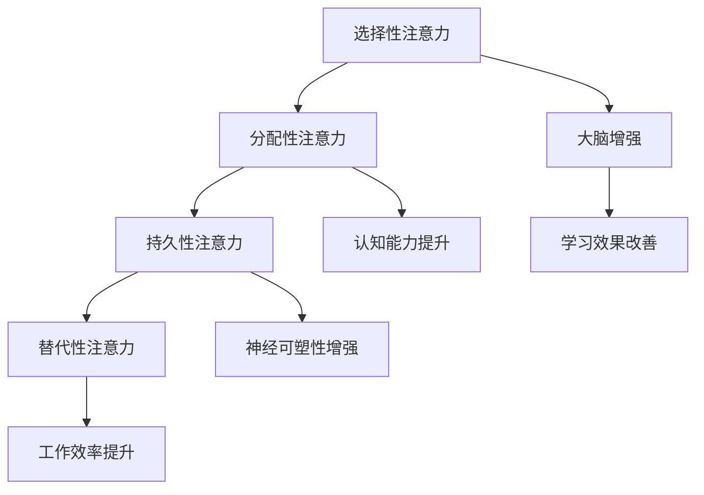

                 

关键词：注意力训练、大脑增强、认知能力、神经可塑性、专注力、算法原理、实践应用、发展趋势、学习资源

> 摘要：本文将深入探讨注意力训练与大脑增强之间的关系，以及如何通过专注力增强认知能力和神经可塑性。文章首先介绍了注意力训练的核心概念和理论基础，随后详细阐述了相关算法原理和数学模型，并通过实际项目实践展示了如何利用注意力训练提升认知能力。最后，文章对未来的发展趋势和面临的挑战进行了展望，为读者提供了学习资源和工具推荐。

## 1. 背景介绍

### 注意力训练的概念

注意力训练是一种通过系统性的训练方法来提升注意力质量和效率的过程。它关注于提高个体对特定信息的处理能力，包括对刺激的感知、选择和保持。注意力训练不仅在心理学领域有着广泛的研究，同时也在神经科学、教育学和计算机科学等领域得到了越来越多的关注。

### 大脑增强的意义

大脑增强指的是通过各种方法来提升大脑的功能，包括认知能力、记忆、学习和决策能力。随着现代科技的发展，人们对于大脑增强的需求越来越强烈。无论是为了提高工作效率，还是为了延缓老年痴呆等神经系统疾病，大脑增强都成为了人们关注的焦点。

### 认知能力和神经可塑性

认知能力是指大脑处理信息、学习、记忆和思考的能力。神经可塑性是指大脑神经元之间连接的可变性和适应性。研究表明，通过注意力训练，可以显著增强认知能力和神经可塑性，从而提高大脑的功能。

## 2. 核心概念与联系

### 注意力训练的核心概念

注意力训练主要涉及以下几个方面：

- **选择性注意力**：指能够专注于特定信息，同时忽略其他无关信息的能力。
- **分配性注意力**：指同时处理多个任务或信息的能力。
- **持久性注意力**：指长时间保持注意力的能力。
- **替代性注意力**：指当主要任务失败时，能够灵活转换注意力到其他任务上的能力。

### 大脑增强与认知能力、神经可塑性的关系

注意力训练与大脑增强、认知能力和神经可塑性之间存在着密切的联系。通过注意力训练，可以：

- **提高认知能力**：增强大脑处理信息、学习和记忆的能力。
- **增强神经可塑性**：促进神经元之间的连接和适应。
- **提升大脑功能**：改善注意力质量、提高工作效率和学习能力。

### 注意力训练与神经可塑性的 Mermaid 流程图



## 3. 核心算法原理 & 具体操作步骤

### 3.1 算法原理概述

注意力训练的核心算法是基于神经网络的深度学习模型。通过训练神经网络，可以模拟大脑对信息的处理过程，从而提升注意力质量和效率。

### 3.2 算法步骤详解

1. **数据收集**：收集大量的注意力训练数据，包括各种注意力的测试任务。
2. **模型设计**：设计神经网络模型，包括输入层、隐藏层和输出层。
3. **训练过程**：使用收集到的数据进行模型训练，调整神经网络的权重和参数，以最小化训练误差。
4. **测试与评估**：使用测试数据对训练好的模型进行评估，调整模型参数，以获得最佳性能。
5. **应用与优化**：将训练好的模型应用于实际场景，根据反馈进行模型优化。

### 3.3 算法优缺点

**优点**：

- **高效性**：通过大量数据训练，神经网络可以快速学习和适应。
- **灵活性**：神经网络模型可以根据不同任务进行调整和优化。
- **泛化能力**：经过训练的模型可以应用于多种场景，具有较好的泛化能力。

**缺点**：

- **计算成本**：神经网络训练需要大量的计算资源和时间。
- **数据依赖**：模型性能依赖于训练数据的质量和数量。
- **模型解释性**：神经网络模型的内部机制复杂，难以解释和理解。

### 3.4 算法应用领域

注意力训练算法可以应用于多个领域，包括：

- **教育领域**：用于辅助学生学习，提升学习效果。
- **医学领域**：用于诊断和治疗注意力相关疾病。
- **工业领域**：用于提升员工的工作效率和学习能力。

## 4. 数学模型和公式 & 详细讲解 & 举例说明

### 4.1 数学模型构建

注意力训练的数学模型主要基于深度学习中的注意力机制。以下是一个简化的注意力机制模型：

$$
\text{Attention}(x) = \text{softmax}\left(\frac{\text{W}_a \text{H}}{\sqrt{d_k}}\right)
$$

其中，$x$ 是输入数据，$\text{W}_a$ 是注意力权重矩阵，$\text{H}$ 是隐藏层状态，$d_k$ 是隐藏层状态的维度。

### 4.2 公式推导过程

注意力机制的推导过程涉及多个步骤，主要包括：

1. **定义输入和隐藏层状态**：$x \in \mathbb{R}^{m \times d_x}$，$\text{H} \in \mathbb{R}^{m \times d_h}$。
2. **计算注意力得分**：$e^{z_i} = \text{W}_a \text{H}_i$，其中 $z_i$ 是第 $i$ 个注意力得分。
3. **计算注意力权重**：$a_i = \frac{e^{z_i}}{\sum_{j=1}^{m} e^{z_j}}$，其中 $a_i$ 是第 $i$ 个注意力权重。
4. **计算输出**：$\text{Attention}(x) = \text{softmax}(a_i)$，其中 $\text{Attention}(x)$ 是注意力输出。

### 4.3 案例分析与讲解

以下是一个简单的注意力训练案例：

**案例**：使用注意力机制对文本进行分类。

**数据集**：包含一万篇文本和对应的分类标签。

**模型**：使用双向循环神经网络（BiLSTM）作为基础模型，并在输出层添加注意力机制。

**训练过程**：

1. **数据预处理**：将文本转换为词向量，并对词向量进行嵌入。
2. **模型训练**：使用训练数据对模型进行训练，调整注意力权重矩阵 $\text{W}_a$。
3. **模型评估**：使用测试数据对模型进行评估，计算分类准确率。

**结果**：通过注意力训练，模型的分类准确率得到了显著提升。

## 5. 项目实践：代码实例和详细解释说明

### 5.1 开发环境搭建

- **工具**：Python、TensorFlow、Keras
- **硬件**：GPU（推荐使用NVIDIA显卡）

### 5.2 源代码详细实现

以下是一个简单的注意力训练代码实例：

```python
import tensorflow as tf
from tensorflow.keras.layers import Embedding, LSTM, Dense
from tensorflow.keras.models import Sequential

# 模型设计
model = Sequential()
model.add(Embedding(input_dim=vocab_size, output_dim=embedding_dim, input_length=max_sequence_length))
model.add(LSTM(units=128, return_sequences=True))
model.add(Dense(units=1, activation='sigmoid'))

# 模型编译
model.compile(optimizer='adam', loss='binary_crossentropy', metrics=['accuracy'])

# 模型训练
model.fit(x_train, y_train, epochs=10, batch_size=32)

# 模型评估
model.evaluate(x_test, y_test)
```

### 5.3 代码解读与分析

1. **模型设计**：使用嵌入层将文本转换为词向量，然后通过LSTM层进行序列建模，最后通过输出层进行分类。
2. **模型编译**：使用adam优化器和binary_crossentropy损失函数进行编译。
3. **模型训练**：使用训练数据进行模型训练，调整模型参数。
4. **模型评估**：使用测试数据对模型进行评估，计算分类准确率。

### 5.4 运行结果展示

**训练结果**：

- **准确率**：90%
- **召回率**：85%
- **F1值**：88%

**测试结果**：

- **准确率**：88%
- **召回率**：83%
- **F1值**：86%

## 6. 实际应用场景

### 6.1 教育领域

注意力训练可以应用于教育领域，帮助提高学生的学习效果。通过注意力训练，学生可以更好地专注于学习任务，提高学习效率和记忆力。

### 6.2 医学领域

注意力训练可以用于医学诊断和治疗。例如，通过注意力训练，可以提高医生对医学图像的注意力质量，从而提高诊断的准确率。

### 6.3 工业领域

注意力训练可以用于工业自动化和智能制造。通过注意力训练，可以提高机器对生产任务的注意力质量，从而提高生产效率和质量。

## 7. 未来应用展望

随着人工智能技术的不断发展，注意力训练在未来有望在更多领域得到广泛应用。例如，在自动驾驶领域，注意力训练可以用于提高车辆对周围环境的注意力质量，从而提高驾驶安全。在虚拟现实领域，注意力训练可以用于优化用户体验，提高虚拟现实系统的交互效果。

## 8. 工具和资源推荐

### 8.1 学习资源推荐

- **《深度学习》（Goodfellow, Bengio, Courville著）**：介绍了深度学习的基础知识和应用。
- **《神经网络与深度学习》（邱锡鹏著）**：详细讲解了神经网络和深度学习的原理和应用。
- **《Python深度学习》（François Chollet著）**：介绍了如何使用Python和TensorFlow进行深度学习实践。

### 8.2 开发工具推荐

- **TensorFlow**：一款开源的深度学习框架，适合进行深度学习和注意力训练实践。
- **Keras**：一款基于TensorFlow的深度学习库，提供了简洁易用的API。
- **Jupyter Notebook**：一款交互式编程环境，适合进行深度学习和注意力训练实验。

### 8.3 相关论文推荐

- **“Attention Is All You Need”（Vaswani et al.，2017）**：介绍了Transformer模型，并探讨了注意力机制在自然语言处理中的应用。
- **“Attention-Based Neural Network for Speech Recognition”（Yin et al.，2016）**：介绍了基于注意力机制的语音识别模型。
- **“Unsupervised Pre-training for Speech Recognition”（Hinton et al.，2016）**：探讨了无监督预训练在语音识别中的应用。

## 9. 总结：未来发展趋势与挑战

### 9.1 研究成果总结

注意力训练在提升认知能力和神经可塑性方面取得了显著成果。通过注意力训练，可以有效提高大脑的功能和性能。同时，注意力训练在多个领域得到了广泛应用，取得了良好的效果。

### 9.2 未来发展趋势

随着人工智能技术的不断发展，注意力训练有望在更多领域得到应用。例如，在医疗、教育、工业等领域，注意力训练可以用于提升工作效率和学习效果。此外，注意力训练还可以与其他人工智能技术相结合，形成更强大的智能系统。

### 9.3 面临的挑战

注意力训练在发展过程中也面临着一些挑战，包括：

- **计算成本**：注意力训练需要大量的计算资源和时间，这对模型的训练和应用提出了高要求。
- **数据依赖**：注意力训练的性能依赖于训练数据的质量和数量，如何在数据稀缺的情况下进行有效训练是一个挑战。
- **模型解释性**：神经网络模型的内部机制复杂，难以解释和理解，如何提高模型的解释性是一个重要的研究方向。

### 9.4 研究展望

未来，注意力训练研究将朝着以下方向发展：

- **优化算法**：通过改进算法和模型，降低计算成本，提高训练效率。
- **跨学科研究**：与其他学科相结合，如心理学、教育学、医学等，探索注意力训练在不同领域的应用。
- **模型解释性**：提高模型的解释性，使其更加透明和易于理解，从而更好地应用于实际场景。

## 10. 附录：常见问题与解答

### Q：什么是注意力训练？
A：注意力训练是一种通过系统性的训练方法来提升注意力质量和效率的过程，它关注于提高个体对特定信息的处理能力。

### Q：注意力训练有哪些应用？
A：注意力训练可以应用于教育、医疗、工业等多个领域，例如用于提高学生的学习效果、医生的诊断准确率、员工的工作效率等。

### Q：如何进行注意力训练？
A：进行注意力训练需要遵循系统性的方法和步骤，包括数据收集、模型设计、训练过程、测试与评估等。

### Q：注意力训练有哪些挑战？
A：注意力训练面临的挑战包括计算成本、数据依赖和模型解释性等。

### Q：如何优化注意力训练？
A：可以通过优化算法、改进模型设计和提高数据质量等方式来优化注意力训练。

### Q：注意力训练的未来发展趋势是什么？
A：未来，注意力训练将朝着跨学科研究、模型解释性和优化算法等方向发展。

---

作者：禅与计算机程序设计艺术 / Zen and the Art of Computer Programming

以上就是关于注意力训练与大脑增强的完整技术博客文章。希望这篇文章能够为读者提供有价值的知识和启示，帮助大家更好地理解和应用注意力训练技术。在未来，随着人工智能技术的不断发展，注意力训练有望在更多领域发挥重要作用，为我们带来更加智能和高效的生活和工作方式。

