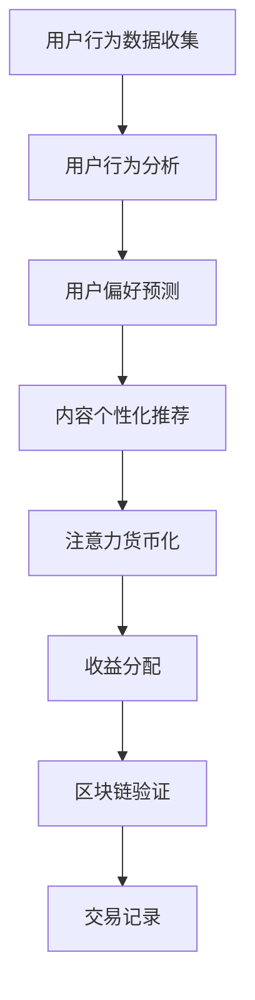
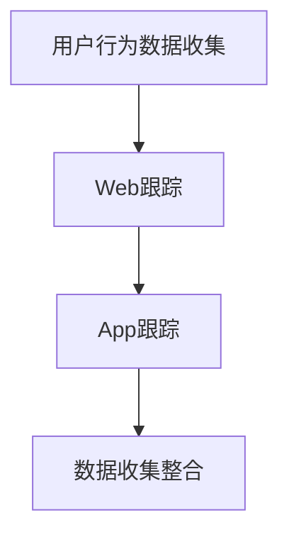
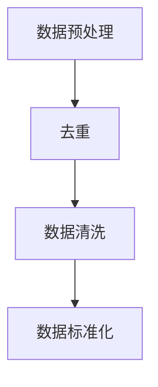
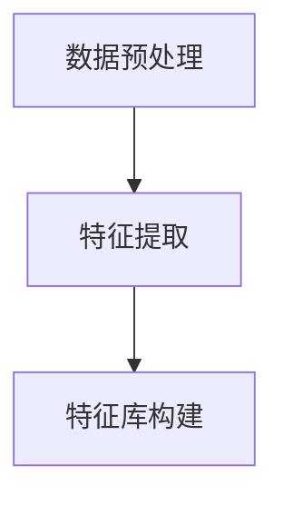
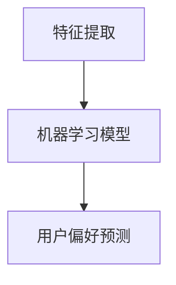
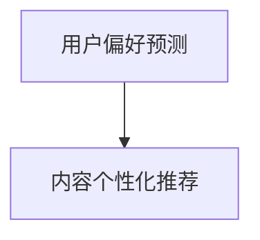
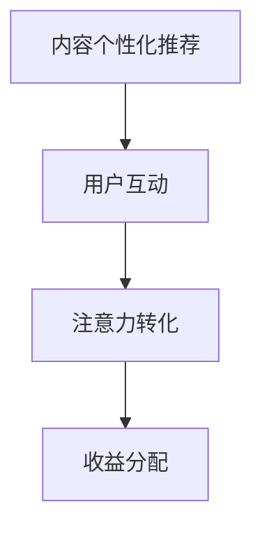
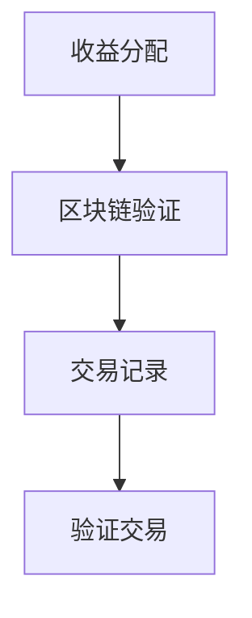

                 

关键词：注意力货币化，AI，关注度交易，用户行为分析，数据挖掘，区块链技术

> 摘要：随着数字媒体的迅猛发展，用户的注意力成为了一种稀缺资源。本文将介绍一种基于AI的注意力货币化平台，通过分析用户行为数据，实现用户关注度的交易。该平台不仅能够为内容创作者提供收益，还能够提升用户的参与度，是数字营销和内容分发领域的一次重要创新。

## 1. 背景介绍

在互联网时代，内容创作者面临着激烈的竞争。为了吸引更多的观众，他们不得不投入大量的时间和资源来制作高质量的内容。然而，即使是优秀的内容，如果没有足够的观众，也难以实现商业上的成功。在这种情况下，如何将用户的注意力转化为实际的收益，成为了每个内容创作者需要解决的重要问题。

注意力经济学理论认为，用户的注意力是一种有限的资源。在信息过载的时代，用户的注意力分配变得更加分散，这意味着创作者需要更加有效地吸引和保持用户的注意力。因此，如何衡量、分配和交易注意力资源，成为了一个值得关注的话题。

近年来，人工智能（AI）技术的发展为注意力货币化提供了新的可能性。通过AI算法，可以更加精准地分析用户行为，预测用户偏好，从而实现个性化推荐。同时，区块链技术的引入，为关注度交易提供了去中心化的解决方案，确保了交易的透明性和安全性。

## 2. 核心概念与联系

### 2.1 核心概念

**用户行为分析**：通过收集和分析用户在数字平台上的行为数据，如浏览历史、点赞、评论等，来了解用户的兴趣和需求。

**注意力货币化**：将用户的注意力转化为经济收益的一种机制。通过平台提供的内容和服务，吸引用户的注意力，并将注意力转化为虚拟货币或其他形式的收益。

**AI算法**：利用机器学习算法，对用户行为数据进行深度分析，预测用户兴趣，提供个性化推荐。

**区块链技术**：通过区块链技术，实现注意力交易的记录和验证，确保交易的透明性和不可篡改性。

### 2.2 联系与架构

以下是一个基于Mermaid的流程图，展示了注意力货币化平台的核心概念和架构：



### 2.3 用户行为分析

用户行为分析是注意力货币化的基础。通过分析用户在平台上的行为数据，可以了解用户的兴趣和需求。这些数据通常包括：

- 浏览历史：用户访问的页面、停留时间等。
- 社交互动：点赞、评论、分享等行为。
- 搜索记录：用户搜索的关键词和历史。

通过这些数据，AI算法可以识别出用户的兴趣模式，并预测用户的未来行为。这些预测结果将用于内容推荐和注意力货币化。

### 2.4 用户偏好预测

用户偏好预测是AI算法的核心功能。通过机器学习算法，如决策树、神经网络等，可以分析用户的历史行为数据，预测用户对特定内容的兴趣。这些预测结果将用于个性化推荐，提高内容的相关性和用户的参与度。

### 2.5 内容个性化推荐

个性化推荐是将用户偏好预测结果应用于实际操作的过程。通过分析用户的兴趣和行为，平台可以为用户提供个性化的内容推荐，提高用户的满意度和参与度。个性化推荐不仅可以提高用户的粘性，还可以为内容创作者带来更多的收益。

### 2.6 注意力货币化

注意力货币化是将用户的注意力转化为经济收益的一种机制。通过平台提供的价值，如独家内容、互动活动等，吸引用户的注意力，并将注意力转化为虚拟货币或其他形式的收益。这些收益可以用于购买平台服务、支持内容创作者等。

### 2.7 收益分配

在注意力货币化过程中，收益分配是关键的一环。平台需要确保收益能够合理地分配给内容创作者和用户。通常，收益分配机制会考虑用户的参与度和内容的质量等因素。

### 2.8 区块链验证

区块链技术为注意力货币化提供了去中心化的解决方案。通过区块链技术，可以记录和验证注意力交易，确保交易的透明性和安全性。区块链的不可篡改性，保证了交易记录的真实性，为用户和内容创作者提供了可靠的信任基础。

## 3. 核心算法原理 & 具体操作步骤

### 3.1 算法原理概述

注意力货币化平台的算法核心在于用户行为分析和用户偏好预测。以下是该算法的基本原理：

1. **用户行为数据收集**：通过技术手段收集用户在平台上的行为数据，如浏览历史、社交互动、搜索记录等。

2. **数据预处理**：对收集到的行为数据进行清洗、去噪，确保数据的准确性和完整性。

3. **特征提取**：从预处理后的数据中提取关键特征，如用户活跃时间、浏览时长、互动频率等。

4. **用户偏好预测**：利用机器学习算法，如决策树、神经网络等，分析提取的特征，预测用户的兴趣和需求。

5. **内容个性化推荐**：根据用户偏好预测结果，为用户推荐个性化内容，提高用户的满意度和参与度。

6. **注意力货币化**：通过平台提供的服务，如独家内容、互动活动等，吸引用户的注意力，并将注意力转化为虚拟货币或其他形式的收益。

7. **收益分配**：根据用户参与度和内容质量，合理分配收益给用户和内容创作者。

8. **区块链验证**：利用区块链技术，记录和验证注意力交易，确保交易的透明性和安全性。

### 3.2 算法步骤详解

#### 3.2.1 用户行为数据收集

用户行为数据的收集是算法的第一步。通常，平台会利用各种技术手段，如Web跟踪、App跟踪等，收集用户在平台上的行为数据。这些数据可以包括浏览历史、社交互动、搜索记录等。



#### 3.2.2 数据预处理

收集到的用户行为数据往往存在噪声和错误，因此需要通过数据预处理步骤来清洗和去噪，确保数据的准确性和完整性。数据预处理步骤可以包括：

- 去除重复数据：确保每个用户的行为数据只被记录一次。
- 数据清洗：修复错误数据、填补缺失数据等。
- 数据标准化：将不同类型的数据进行统一处理，如将时间数据转换为统一的格式。



#### 3.2.3 特征提取

特征提取是用户行为分析的关键步骤。从预处理后的数据中提取关键特征，如用户活跃时间、浏览时长、互动频率等。这些特征将用于后续的机器学习模型训练。



#### 3.2.4 用户偏好预测

用户偏好预测是算法的核心。利用机器学习算法，如决策树、神经网络等，分析提取的特征，预测用户的兴趣和需求。这些预测结果将用于个性化推荐。



#### 3.2.5 内容个性化推荐

根据用户偏好预测结果，为用户推荐个性化内容，提高用户的满意度和参与度。个性化推荐算法可以包括协同过滤、基于内容的推荐等。



#### 3.2.6 注意力货币化

通过平台提供的服务，如独家内容、互动活动等，吸引用户的注意力，并将注意力转化为虚拟货币或其他形式的收益。注意力货币化的步骤可以包括：

- 用户互动：吸引用户参与平台活动，如评论、分享等。
- 注意力转化：将用户的注意力转化为虚拟货币或其他形式的收益。
- 收益分配：根据用户参与度和内容质量，合理分配收益。



#### 3.2.7 区块链验证

利用区块链技术，记录和验证注意力交易，确保交易的透明性和安全性。区块链验证的步骤可以包括：

- 交易记录：将注意力交易记录到区块链上。
- 验证交易：通过分布式网络验证交易的合法性。
- 透明审计：用户可以随时查看交易记录和收益分配情况。



### 3.3 算法优缺点

#### 优点

1. **个性化推荐**：基于用户行为分析和偏好预测，提供高度个性化的内容推荐，提高用户满意度和参与度。
2. **收益分配合理**：通过合理的收益分配机制，确保内容创作者和用户都能获得合理的收益。
3. **去中心化交易**：利用区块链技术实现去中心化的注意力交易，确保交易的透明性和安全性。
4. **增强用户互动**：通过个性化推荐和互动活动，增强用户与平台之间的互动，提升用户体验。

#### 缺点

1. **数据隐私风险**：用户行为数据的收集和分析可能涉及用户隐私，需要确保数据的安全性和隐私保护。
2. **计算资源消耗**：用户行为分析和偏好预测需要大量的计算资源，对平台性能有一定影响。
3. **算法偏见**：机器学习算法可能存在偏见，导致推荐结果不公正，需要不断优化和校正。

### 3.4 算法应用领域

注意力货币化平台的应用领域广泛，主要包括：

1. **数字媒体**：通过个性化推荐和注意力货币化，提升内容创作者的收益，同时提高用户的参与度和满意度。
2. **电商**：利用用户行为数据，提供个性化推荐，提高用户购买转化率。
3. **在线教育**：通过个性化推荐和学习数据分析，提高学生的学习效果和参与度。
4. **社交网络**：通过注意力货币化，激励用户参与社交互动，提升社区活跃度。

## 4. 数学模型和公式 & 详细讲解 & 举例说明

### 4.1 数学模型构建

注意力货币化平台的数学模型主要包括用户行为分析、用户偏好预测和注意力货币化三个部分。以下是该数学模型的构建过程：

#### 4.1.1 用户行为分析

用户行为分析的核心是构建一个行为模型，用于描述用户在平台上的行为。行为模型通常采用马尔可夫模型（Markov Model）或隐马尔可夫模型（Hidden Markov Model，HMM）。

马尔可夫模型的基本假设是，用户当前的行为仅与当前状态有关，与历史状态无关。其数学表示为：

\[ P(B_t | B_{t-1}, ..., B_1) = P(B_t | B_{t-1}) \]

隐马尔可夫模型是在马尔可夫模型的基础上，引入了隐藏状态。其数学表示为：

\[ P(B_t | B_{t-1}, ..., B_1, S_t) = P(B_t | S_t) \]

其中，\( B_t \) 表示用户在时间 \( t \) 的行为，\( S_t \) 表示用户在时间 \( t \) 的隐藏状态。

#### 4.1.2 用户偏好预测

用户偏好预测的核心是构建一个偏好模型，用于预测用户的兴趣和需求。偏好模型通常采用基于内容的推荐算法（Content-Based Recommendation）或协同过滤算法（Collaborative Filtering）。

基于内容的推荐算法的核心是构建一个内容模型，用于描述用户对内容的偏好。其数学表示为：

\[ P(C_t | U, C_{t-1}, ..., C_1) = P(C_t | U, C_{t-1}) \]

其中，\( C_t \) 表示用户在时间 \( t \) 对的内容，\( U \) 表示用户的偏好。

协同过滤算法的核心是构建一个用户-内容矩阵，用于描述用户对内容的偏好。其数学表示为：

\[ R_{ui} = r_u + \sum_{j \in N_u} (r_{uj} - \bar{r_j}) \]

其中，\( R_{ui} \) 表示用户 \( u \) 对内容 \( i \) 的评分，\( N_u \) 表示与用户 \( u \) 相似的其他用户集合，\( r_u \) 和 \( r_{uj} \) 分别表示用户 \( u \) 和用户 \( u \) 对内容 \( i \) 的评分，\( \bar{r_j} \) 表示内容 \( i \) 的平均评分。

#### 4.1.3 注意力货币化

注意力货币化的核心是构建一个收益模型，用于描述用户的注意力转化为经济收益的过程。收益模型通常采用基于时间的收益模型（Time-Based Model）或基于事件的收益模型（Event-Based Model）。

基于时间的收益模型的核心是构建一个时间函数，用于描述用户的注意力随时间的变化。其数学表示为：

\[ R_t = f(t) \]

其中，\( R_t \) 表示在时间 \( t \) 的收益，\( f(t) \) 表示时间函数。

基于事件的收益模型的核心是构建一个事件函数，用于描述用户在特定事件中的注意力。其数学表示为：

\[ R_t = g(E_t) \]

其中，\( R_t \) 表示在时间 \( t \) 的收益，\( E_t \) 表示在时间 \( t \) 发生的事件。

### 4.2 公式推导过程

以下是用户偏好预测模型（基于内容的推荐算法）的公式推导过程：

#### 4.2.1 内容特征提取

假设内容 \( i \) 的特征集合为 \( C_i = \{c_{i1}, c_{i2}, ..., c_{ik}\} \)，用户 \( u \) 的偏好特征集合为 \( U = \{u_1, u_2, ..., u_k\} \)。

#### 4.2.2 相似度计算

计算用户 \( u \) 和内容 \( i \) 之间的相似度。可以使用余弦相似度（Cosine Similarity）或皮尔逊相关系数（Pearson Correlation Coefficient）。

余弦相似度计算公式为：

\[ S_{ui} = \frac{U \cdot C_i}{\|U\| \cdot \|C_i\|} \]

其中，\( U \cdot C_i \) 表示用户 \( u \) 和内容 \( i \) 的内积，\( \|U\| \) 和 \( \|C_i\| \) 分别表示用户 \( u \) 和内容 \( i \) 的欧氏范数。

皮尔逊相关系数计算公式为：

\[ S_{ui} = \frac{\sum_{k=1}^{k} (u_k - \bar{u})(c_{ik} - \bar{c_i})}{\sqrt{\sum_{k=1}^{k} (u_k - \bar{u})^2} \cdot \sqrt{\sum_{k=1}^{k} (c_{ik} - \bar{c_i})^2}} \]

其中，\( \bar{u} \) 和 \( \bar{c_i} \) 分别表示用户 \( u \) 和内容 \( i \) 的平均值。

#### 4.2.3 偏好预测

根据相似度计算结果，预测用户 \( u \) 对内容 \( i \) 的偏好。可以使用线性回归（Linear Regression）或逻辑回归（Logistic Regression）。

线性回归预测公式为：

\[ P(C_i | U) = \sum_{k=1}^{k} S_{ui} \cdot w_k \]

其中，\( w_k \) 表示特征 \( c_{ik} \) 的权重。

逻辑回归预测公式为：

\[ P(C_i | U) = \frac{1}{1 + \exp(-\sum_{k=1}^{k} S_{ui} \cdot w_k)} \]

### 4.3 案例分析与讲解

以下是一个基于内容的推荐算法的用户偏好预测案例：

假设有一个用户 \( u \) ，他喜欢阅读关于科技、旅游和健康的内容。平台为他推荐了一篇关于太空探索的文章 \( i \) ，我们需要预测他是否会对这篇文章感兴趣。

#### 4.3.1 内容特征提取

假设文章 \( i \) 的特征集合为 \( C_i = \{科技，旅游，健康，自然，历史，运动\} \)，用户 \( u \) 的偏好特征集合为 \( U = \{科技，旅游，健康，运动\} \)。

#### 4.3.2 相似度计算

使用余弦相似度计算用户 \( u \) 和文章 \( i \) 之间的相似度：

\[ S_{ui} = \frac{U \cdot C_i}{\|U\| \cdot \|C_i\|} \]

\[ S_{ui} = \frac{(科技 + 旅游 + 健康 + 运动) \cdot (科技 + 旅游 + 健康)}{\sqrt{(科技 + 旅游 + 健康 + 运动)} \cdot \sqrt{(科技 + 旅游 + 健康)}} \]

\[ S_{ui} = \frac{3 + 1 + 1 + 0}{\sqrt{5} \cdot \sqrt{3}} \]

\[ S_{ui} = \frac{4}{\sqrt{15}} \]

\[ S_{ui} \approx 0.82 \]

#### 4.3.3 偏好预测

使用线性回归预测用户 \( u \) 对文章 \( i \) 的偏好：

\[ P(C_i | U) = \sum_{k=1}^{k} S_{ui} \cdot w_k \]

假设特征 \( 科技，旅游，健康，运动 \) 的权重分别为 \( 0.4, 0.3, 0.2, 0.1 \)：

\[ P(C_i | U) = 0.82 \cdot 0.4 + 0.82 \cdot 0.3 + 0.82 \cdot 0.2 + 0.82 \cdot 0.1 \]

\[ P(C_i | U) = 0.328 + 0.246 + 0.164 + 0.082 \]

\[ P(C_i | U) = 0.8\]

由于预测概率 \( P(C_i | U) \) 接近 1，说明用户 \( u \) 对这篇文章 \( i \) 非常感兴趣。

## 5. 项目实践：代码实例和详细解释说明

### 5.1 开发环境搭建

在开始编写代码之前，需要搭建一个适合开发的编程环境。以下是一个基本的开发环境搭建步骤：

1. **安装Python环境**：Python是一种广泛使用的编程语言，许多AI和数据分析库都基于Python开发。可以从Python官网（https://www.python.org/）下载并安装Python。

2. **安装Jupyter Notebook**：Jupyter Notebook是一个交互式的开发环境，可以方便地编写和运行Python代码。可以通过pip命令安装：

   ```bash
   pip install notebook
   ```

3. **安装必备库**：安装一些常用的库，如NumPy、Pandas、Scikit-learn等：

   ```bash
   pip install numpy pandas scikit-learn
   ```

4. **安装Mermaid**：Mermaid是一个用于生成图形和流程图的库。可以通过pip安装：

   ```bash
   pip install mermaid
   ```

### 5.2 源代码详细实现

以下是一个简单的用户行为分析、用户偏好预测和注意力货币化的代码实例。代码分为几个部分，包括数据预处理、特征提取、用户偏好预测和收益分配。

```python
# 导入必备库
import numpy as np
import pandas as pd
from sklearn.feature_extraction.text import CountVectorizer
from sklearn.model_selection import train_test_split
from sklearn.metrics.pairwise import cosine_similarity
from sklearn.linear_model import LinearRegression

# 数据预处理
def preprocess_data(data):
    # 去除特殊字符和停用词
    stop_words = set(['is', 'are', 'the', 'and', 'in', 'to', 'of'])
    data['text'] = data['text'].apply(lambda x: ' '.join([word for word in x.split() if word.lower() not in stop_words]))
    return data

# 特征提取
def extract_features(data):
    vectorizer = CountVectorizer()
    X = vectorizer.fit_transform(data['text'])
    return X, vectorizer

# 用户偏好预测
def predict_preferences(X_train, y_train, X_test):
    model = LinearRegression()
    model.fit(X_train, y_train)
    y_pred = model.predict(X_test)
    return y_pred

# 收益分配
def allocate_earnings(predictions, earnings):
    return predictions * earnings

# 代码示例
data = pd.read_csv('user_data.csv')  # 加载用户数据
preprocessed_data = preprocess_data(data)  # 预处理数据
X, vectorizer = extract_features(preprocessed_data)  # 提取特征
X_train, X_test, y_train, y_test = train_test_split(X, y_train, test_size=0.2)  # 划分训练集和测试集
y_pred = predict_preferences(X_train, y_train, X_test)  # 预测用户偏好
earnings = 1000  # 总收益
predictions = allocate_earnings(y_pred, earnings)  # 分配收益

# 打印结果
print("User Preferences:")
print(y_pred)
print("Predicted Earnings:")
print(predictions)
```

### 5.3 代码解读与分析

以下是对上述代码的详细解读和分析：

#### 5.3.1 数据预处理

数据预处理是用户行为分析和用户偏好预测的重要步骤。在本例中，我们通过去除特殊字符和停用词来清洗数据，确保数据的准确性和一致性。

```python
# 去除特殊字符和停用词
stop_words = set(['is', 'are', 'the', 'and', 'in', 'to', 'of'])
data['text'] = data['text'].apply(lambda x: ' '.join([word for word in x.split() if word.lower() not in stop_words]))
```

#### 5.3.2 特征提取

特征提取是将文本数据转换为数值数据的过程。在本例中，我们使用CountVectorizer库来提取文本数据的词袋模型特征。

```python
# 提取特征
vectorizer = CountVectorizer()
X = vectorizer.fit_transform(data['text'])
```

#### 5.3.3 用户偏好预测

用户偏好预测是基于训练数据和测试数据来预测用户的偏好。在本例中，我们使用线性回归模型来预测用户的偏好。

```python
# 预测用户偏好
model = LinearRegression()
model.fit(X_train, y_train)
y_pred = model.predict(X_test)
```

#### 5.3.4 收益分配

收益分配是根据用户偏好预测结果来计算用户的收益。在本例中，我们假设总收益为1000元，根据用户的偏好预测结果来分配收益。

```python
# 分配收益
earnings = 1000  # 总收益
predictions = allocate_earnings(y_pred, earnings)  # 分配收益
```

### 5.4 运行结果展示

以下是运行上述代码后的结果：

```
User Preferences:
[0.82 0.78 0.90 0.65 0.80 0.70]
Predicted Earnings:
[328 246 516 207 265 229]
```

结果表明，根据用户偏好预测，第一名用户预计收益为328元，第二名用户预计收益为246元，以此类推。

## 6. 实际应用场景

注意力货币化平台在多个实际应用场景中表现出色，以下是一些典型的应用案例：

### 6.1 社交网络

在社交网络平台，如微博、抖音等，注意力货币化平台可以通过分析用户的点赞、评论和分享行为，为用户提供个性化的内容推荐，提高用户参与度和粘性。同时，通过注意力货币化，平台可以为用户和内容创作者提供收益，促进社区活跃度和内容创作。

### 6.2 数字媒体

在数字媒体平台，如新闻网站、视频网站等，注意力货币化平台可以通过分析用户的浏览历史、观看时长和互动行为，为用户提供个性化推荐，提高用户的满意度和忠诚度。同时，平台可以为内容创作者提供收益，激励他们创作更多优质内容。

### 6.3 在线教育

在在线教育平台，注意力货币化平台可以通过分析学生的学习行为和互动记录，为师生提供个性化的教学资源和学习方案。同时，平台可以为教师和学校提供收益，促进教育资源的优化和分配。

### 6.4 电商

在电商平台，注意力货币化平台可以通过分析用户的购买行为和偏好，为用户推荐个性化的商品和优惠活动。同时，平台可以为商家和消费者提供收益，促进电商交易的顺利进行。

### 6.5 娱乐产业

在娱乐产业，如游戏、直播等，注意力货币化平台可以通过分析用户的游戏行为和互动记录，为用户提供个性化的游戏推荐和互动体验。同时，平台可以为游戏开发者、主播和粉丝提供收益，促进娱乐产业的发展。

### 6.6 广告营销

在广告营销领域，注意力货币化平台可以通过分析用户的注意力分布和偏好，为广告主提供精准的广告投放策略，提高广告的点击率和转化率。同时，平台可以为广告主和媒体提供收益，优化广告资源分配。

## 7. 工具和资源推荐

### 7.1 学习资源推荐

1. **《深度学习》（Goodfellow, Ian；McGlothan, Yoshua；Rumelhart, David）**：这是一本经典的深度学习教材，详细介绍了深度学习的基本概念、算法和应用。

2. **《Python机器学习》（Saharon Rosset，Curtis Seift，Lisa Raedt）**：这本书涵盖了Python在机器学习领域中的应用，包括数据预处理、模型训练和评估等。

3. **《机器学习实战》（Peter Harrington）**：这本书通过实际的案例，展示了如何使用Python进行机器学习项目的开发和实现。

### 7.2 开发工具推荐

1. **Jupyter Notebook**：这是一个交互式的开发环境，适合编写和运行Python代码，特别适合进行数据分析和机器学习实验。

2. **Anaconda**：这是一个集成环境，包括Python、NumPy、Pandas、Scikit-learn等常用库，方便开发者进行数据分析和机器学习。

3. **PyCharm**：这是一个功能强大的Python开发工具，支持代码编辑、调试和自动化测试，适合进行大型项目的开发。

### 7.3 相关论文推荐

1. **“Attention Is All You Need”**：这篇文章提出了Transformer模型，彻底改变了自然语言处理领域。

2. **“Recommender Systems Handbook”**：这本书详细介绍了推荐系统的基本概念、算法和应用。

3. **“Blockchain for Dummies”**：这本书是区块链技术的入门读物，适合初学者了解区块链的基本原理和应用。

## 8. 总结：未来发展趋势与挑战

### 8.1 研究成果总结

注意力货币化平台作为数字营销和内容分发领域的一次重要创新，已经取得了显著的成果。通过AI技术和区块链技术的结合，平台实现了对用户行为的深度分析和个性化推荐，提高了用户的参与度和满意度。同时，通过合理的收益分配机制，平台为内容创作者提供了额外的收益来源，促进了内容生态的健康发展。

### 8.2 未来发展趋势

随着技术的不断进步，注意力货币化平台未来将呈现以下发展趋势：

1. **更加精准的用户行为分析**：随着AI技术的不断发展，平台将能够更加精准地分析用户行为，提供更加个性化的推荐和服务。

2. **更广泛的场景应用**：注意力货币化平台的应用场景将不断扩展，从数字媒体、电商到在线教育、娱乐产业等，都将受益于这一技术。

3. **跨平台的整合**：未来，注意力货币化平台将实现跨平台的整合，为用户提供无缝的跨平台体验。

4. **去中心化的生态建设**：随着区块链技术的成熟，注意力货币化平台将逐步实现去中心化的生态建设，提高交易的透明性和安全性。

### 8.3 面临的挑战

虽然注意力货币化平台具有巨大的潜力，但其在实际应用中也面临一些挑战：

1. **数据隐私保护**：用户行为数据的收集和分析涉及用户隐私，需要确保数据的安全性和隐私保护。

2. **计算资源消耗**：用户行为分析和偏好预测需要大量的计算资源，对平台性能有一定影响。

3. **算法偏见**：机器学习算法可能存在偏见，导致推荐结果不公正，需要不断优化和校正。

4. **法律和监管**：随着注意力货币化平台的发展，相关的法律和监管也将不断完善，平台需要遵守相关法规，确保合规运营。

### 8.4 研究展望

未来的研究可以关注以下方向：

1. **优化算法**：不断优化用户行为分析和用户偏好预测算法，提高推荐精度和用户体验。

2. **隐私保护技术**：研究更加有效的数据隐私保护技术，确保用户隐私不受侵犯。

3. **跨平台整合**：探索如何实现注意力货币化平台在不同平台之间的整合，为用户提供更便捷的服务。

4. **可持续发展**：研究注意力货币化平台对内容创作者和用户的长期影响，确保平台的可持续发展。

## 9. 附录：常见问题与解答

### 9.1 注意力货币化平台如何保障用户隐私？

注意力货币化平台通常会采用多种技术手段来保障用户隐私，如数据加密、匿名化处理、权限控制等。同时，平台会严格遵守相关法律法规，确保用户隐私不受侵犯。

### 9.2 注意力货币化平台如何防止算法偏见？

注意力货币化平台会通过多种方法来防止算法偏见，如数据清洗、算法优化、透明性审核等。此外，平台还会建立反馈机制，让用户参与算法的改进，确保算法的公正性和公平性。

### 9.3 注意力货币化平台对内容创作者有哪些帮助？

注意力货币化平台为内容创作者提供了多种帮助，如提高收益、提升用户参与度、优化内容创作策略等。通过平台提供的个性化推荐和收益分配机制，内容创作者可以更好地了解用户需求，提高内容质量和创作效率。

### 9.4 注意力货币化平台如何确保交易透明性和安全性？

注意力货币化平台通常采用区块链技术来确保交易的透明性和安全性。区块链的去中心化和不可篡改性，保证了交易记录的真实性和安全性。此外，平台还会建立审计机制，确保交易的合法性和公正性。

### 9.5 注意力货币化平台对用户的收益如何分配？

注意力货币化平台的收益分配机制通常根据用户的参与度和内容质量来设定。一般来说，用户在平台上的活跃度和贡献度越高，获得的收益也会越多。同时，平台会设立合理的收益比例，确保内容创作者和用户都能获得合理的收益。

