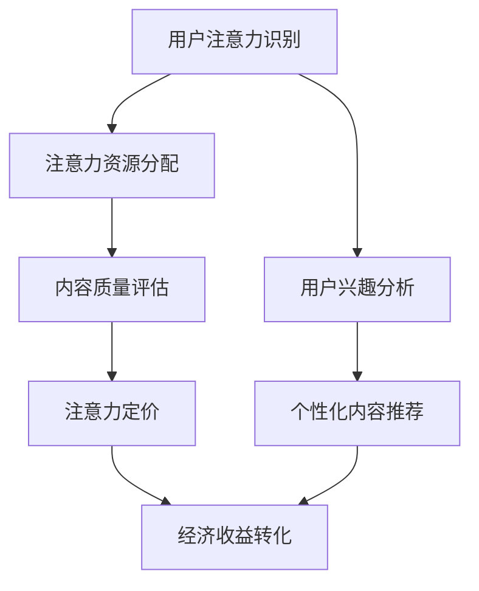

                 

关键词：注意力货币化、AI、关注度经济、策略、技术、算法、应用、展望

> 摘要：随着互联网的迅猛发展，人们获取信息的方式发生了翻天覆地的变化。在这种背景下，注意力成为了稀缺资源。本文将探讨如何利用人工智能（AI）技术实现注意力货币化，将关注度转化为经济效益。文章将介绍注意力货币化的核心概念、算法原理、数学模型以及实际应用案例，旨在为相关领域的研究者和从业者提供有价值的参考。

## 1. 背景介绍

在互联网时代，信息爆炸导致了用户的注意力稀缺。对于内容创作者、营销人员以及广告商来说，如何吸引并保持用户的注意力成为了至关重要的课题。注意力货币化正是为了解决这一问题而诞生的概念，它旨在将用户的注意力转化为实实在在的经济价值。

注意力货币化的核心思想是，通过识别、分析和挖掘用户的注意力需求，将注意力资源进行精准匹配和分配，从而实现商业价值。在这个过程中，人工智能（AI）技术扮演着关键角色，它能够高效地处理大量数据，提供精确的用户行为分析和预测。

### 注意力货币化的现状与挑战

目前，注意力货币化已经渗透到多个行业，如广告、内容创作、社交媒体等。例如，广告商通过投放精准广告获取用户注意力，从而实现收益；内容创作者通过制作高质量内容吸引粉丝，进而进行广告投放或会员订阅。然而，随着竞争的加剧，注意力货币化面临着一系列挑战：

1. **用户注意力分散**：互联网上内容繁多，用户容易分散注意力，难以形成有效消费。
2. **信息过载**：用户面临大量信息，难以筛选和辨别有价值的内容。
3. **隐私保护**：在注意力货币化的过程中，用户隐私保护成为了一个敏感话题。

## 2. 核心概念与联系

### 2.1 核心概念

注意力货币化的核心概念包括注意力识别、注意力分配、注意力定价和注意力转换。这些概念相互关联，共同构成了注意力货币化的理论基础。

#### 注意力识别

注意力识别是指通过技术手段（如AI算法、用户行为分析等）识别用户的注意力状态。这一过程包括识别用户的兴趣、偏好、行为等，以便为其提供个性化的内容。

#### 注意力分配

注意力分配是指将识别到的注意力资源进行合理分配，以满足用户的需求。这一过程需要考虑多种因素，如内容质量、用户需求、市场供需等。

#### 注意力定价

注意力定价是指为用户的注意力设定合理的价格，以实现经济价值。这涉及到对市场动态的把握、成本收益分析等。

#### 注意力转换

注意力转换是指将注意力转化为实际的经济收益，如广告收入、会员费用、产品销售等。

### 2.2 架构与联系

为了更好地理解注意力货币化的概念，我们可以通过一个简化的Mermaid流程图来展示其核心架构和联系。



### 2.3 注意力货币化的应用场景

注意力货币化在多个场景中都有广泛的应用，以下列举几个典型的应用场景：

1. **社交媒体**：通过分析用户行为，为用户提供个性化内容，从而提高用户粘性。
2. **内容创作**：创作者通过高质量的内容吸引粉丝，进而通过广告、会员订阅等方式实现收益。
3. **广告投放**：广告商通过精准投放广告，提高广告转化率，从而实现经济收益。
4. **电子商务**：电商平台通过个性化推荐，提高用户购买意愿和转化率。

## 3. 核心算法原理 & 具体操作步骤

### 3.1 算法原理概述

注意力货币化的核心算法原理主要包括用户行为分析、个性化推荐、注意力定价和收益分配。以下是这些算法原理的具体描述：

#### 用户行为分析

用户行为分析是注意力货币化的基础。通过分析用户在互联网上的行为数据（如浏览历史、搜索记录、点赞评论等），可以识别用户的兴趣和偏好。常见的用户行为分析方法包括：

- **基于内容的推荐**：根据用户以往的行为数据，推荐用户可能感兴趣的内容。
- **协同过滤**：通过分析用户之间的相似性，推荐其他用户喜欢的商品或内容。
- **深度学习**：利用深度学习模型对用户行为数据进行建模和预测。

#### 个性化推荐

个性化推荐是将用户行为分析结果应用于实际场景的关键步骤。通过个性化推荐，可以为用户提供更符合其兴趣和需求的内容，从而提高用户满意度。个性化推荐系统通常包括以下组件：

- **推荐算法**：根据用户行为数据和内容特征，生成个性化推荐列表。
- **推荐结果展示**：将推荐结果以合适的形式（如列表、卡片、弹出窗口等）展示给用户。

#### 注意力定价

注意力定价是指为用户的注意力设定合理的价格。这一过程需要考虑多个因素，如用户注意力持续时间、内容质量、市场供需等。常见的注意力定价方法包括：

- **基于供需的定价**：根据市场供需情况，动态调整注意力价格。
- **基于内容的定价**：根据内容的质量和受欢迎程度，设定不同的注意力价格。

#### 收益分配

收益分配是指将注意力货币化过程中产生的经济收益分配给相关方（如用户、创作者、广告商等）。收益分配的公正性和透明度对于注意力货币化的可持续性至关重要。常见的收益分配方法包括：

- **按劳分配**：根据用户参与度（如点赞、评论、分享等）分配收益。
- **按需分配**：根据用户需求（如购买意愿、订阅次数等）分配收益。

### 3.2 算法步骤详解

#### 3.2.1 用户行为分析

1. **数据采集**：收集用户在互联网上的行为数据，如浏览历史、搜索记录、点赞评论等。
2. **数据预处理**：对采集到的行为数据进行清洗、去重、归一化等预处理操作。
3. **特征提取**：利用机器学习算法提取用户行为特征，如兴趣标签、行为模式等。
4. **模型训练**：利用提取的用户行为特征，训练用户行为分析模型。

#### 3.2.2 个性化推荐

1. **内容特征提取**：提取推荐内容的特征，如文本特征、图像特征等。
2. **推荐算法选择**：根据用户行为特征和内容特征，选择合适的推荐算法（如基于内容的推荐、协同过滤、深度学习等）。
3. **生成推荐列表**：利用选定的推荐算法，为用户生成个性化推荐列表。
4. **推荐结果评估**：根据用户行为数据，评估推荐结果的效果，并进行调整优化。

#### 3.2.3 注意力定价

1. **市场供需分析**：分析当前市场供需情况，确定注意力价格。
2. **内容质量评估**：对推荐的内容进行质量评估，确定注意力价格。
3. **动态定价策略**：根据市场动态和用户反馈，实时调整注意力价格。

#### 3.2.4 收益分配

1. **收益计算**：根据用户的参与度和推荐效果，计算用户的收益。
2. **收益分配策略**：制定收益分配策略，确保收益的公正性和透明度。
3. **收益发放**：将计算出的收益分配给相关方。

### 3.3 算法优缺点

#### 优点

1. **高效性**：利用AI技术进行用户行为分析和个性化推荐，提高了推荐的效率和质量。
2. **个性化**：通过个性化推荐，为用户提供更符合其兴趣和需求的内容，提高了用户满意度。
3. **灵活性**：注意力定价和收益分配策略可以根据市场动态和用户反馈进行灵活调整。

#### 缺点

1. **数据依赖性**：注意力货币化依赖于大量的用户行为数据，数据质量对算法效果有较大影响。
2. **隐私风险**：在用户行为分析过程中，可能会涉及到用户隐私信息，需要妥善处理。
3. **计算资源消耗**：大规模的用户行为分析和个性化推荐需要大量的计算资源，对硬件设施要求较高。

### 3.4 算法应用领域

注意力货币化算法在多个领域都有广泛的应用，以下是几个典型的应用领域：

1. **广告投放**：通过个性化推荐，提高广告的投放效果，从而实现更高的广告收益。
2. **内容创作**：为创作者提供精准的内容推荐，帮助他们吸引更多粉丝和提升影响力。
3. **电子商务**：通过个性化推荐，提高用户购买意愿和转化率，从而提升销售额。
4. **社交媒体**：通过分析用户行为，为用户提供个性化内容，提高用户粘性和活跃度。

## 4. 数学模型和公式 & 详细讲解 & 举例说明

### 4.1 数学模型构建

注意力货币化的数学模型主要涉及用户行为分析、个性化推荐、注意力定价和收益分配。以下是这些模型的简要介绍：

#### 4.1.1 用户行为分析模型

用户行为分析模型通常采用概率模型或贝叶斯网络来描述用户行为数据之间的关系。以下是一个简单的概率模型：

$$
P(C_i|U) = \frac{P(U|C_i)P(C_i)}{P(U)}
$$

其中，$C_i$ 表示用户对内容 $i$ 的兴趣，$U$ 表示用户的行为数据，$P(C_i|U)$ 表示用户对内容 $i$ 的兴趣概率，$P(U|C_i)$ 表示在用户对内容 $i$ 有兴趣的情况下，用户行为数据 $U$ 的概率，$P(C_i)$ 表示内容 $i$ 的兴趣概率，$P(U)$ 表示用户行为数据 $U$ 的概率。

#### 4.1.2 个性化推荐模型

个性化推荐模型通常采用协同过滤或基于内容的推荐算法。以下是一个基于内容的推荐算法的简要描述：

$$
R(U, j) = \sum_{i \in I(U)} w_{ij} S_i
$$

其中，$R(U, j)$ 表示用户 $U$ 对内容 $j$ 的推荐分数，$I(U)$ 表示用户 $U$ 的兴趣内容集合，$w_{ij}$ 表示内容 $i$ 对内容 $j$ 的影响权重，$S_i$ 表示内容 $i$ 的质量评分。

#### 4.1.3 注意力定价模型

注意力定价模型通常采用供需模型或基于内容的定价模型。以下是一个基于供需模型的简要描述：

$$
P(C_i) = \frac{Q}{Q + D}
$$

其中，$P(C_i)$ 表示内容 $i$ 的注意力价格，$Q$ 表示市场总供给量，$D$ 表示市场总需求量。

#### 4.1.4 收益分配模型

收益分配模型通常采用按劳分配或按需分配模型。以下是一个按劳分配模型的简要描述：

$$
R(U) = \sum_{i \in I(U)} r_i
$$

其中，$R(U)$ 表示用户 $U$ 的收益，$r_i$ 表示用户对内容 $i$ 的参与度收益。

### 4.2 公式推导过程

#### 4.2.1 用户行为分析模型

假设用户行为数据 $U$ 可以表示为一系列事件 $E_1, E_2, ..., E_n$ 的集合，每个事件 $E_i$ 都与一个内容 $C_i$ 相关联。根据马尔可夫链模型，用户对内容 $C_i$ 的兴趣概率可以表示为：

$$
P(C_i|U) = P(C_i|E_1, E_2, ..., E_n) = \prod_{i=1}^{n} P(C_i|E_i)
$$

为了简化计算，我们可以使用条件概率进行近似：

$$
P(C_i|U) \approx P(C_i|E_n) \approx P(C_i|E_n, E_{n-1}, ..., E_1)
$$

在实际应用中，我们可以通过对用户行为数据 $U$ 进行统计分析和特征提取，得到一个简化的事件序列 $E_n' = (E_n, E_{n-1}, ..., E_1)$，从而得到一个近似的用户兴趣概率模型。

#### 4.2.2 个性化推荐模型

基于内容的推荐算法通常使用余弦相似度或皮尔逊相关系数来计算内容之间的相似度。假设两个内容 $C_i$ 和 $C_j$ 的特征向量分别为 $V_i$ 和 $V_j$，则它们之间的相似度可以表示为：

$$
sim(C_i, C_j) = \frac{V_i \cdot V_j}{||V_i|| \cdot ||V_j||}
$$

其中，$V_i \cdot V_j$ 表示内容 $C_i$ 和 $C_j$ 的特征向量之间的点积，$||V_i||$ 和 $||V_j||$ 分别表示内容 $C_i$ 和 $C_j$ 的特征向量的大小。

根据用户兴趣概率模型，我们可以计算出用户对每个内容的推荐分数：

$$
R(U, j) = \sum_{i \in I(U)} w_{ij} S_i
$$

其中，$w_{ij}$ 表示内容 $i$ 对内容 $j$ 的影响权重，$S_i$ 表示内容 $i$ 的质量评分。

#### 4.2.3 注意力定价模型

在供需模型中，注意力价格 $P(C_i)$ 通常取决于市场总供给量 $Q$ 和总需求量 $D$。当市场处于平衡状态时，供给量 $Q$ 等于需求量 $D$，此时注意力价格可以表示为：

$$
P(C_i) = \frac{Q}{Q + D}
$$

当市场总供给量 $Q$ 增加时，注意力价格 $P(C_i)$ 会下降；当市场总需求量 $D$ 增加时，注意力价格 $P(C_i)$ 会上升。

#### 4.2.4 收益分配模型

在按劳分配模型中，用户 $U$ 的收益 $R(U)$ 通常取决于其对每个内容的参与度 $r_i$。假设每个内容 $i$ 的收益 $r_i$ 与用户参与度 $r_i$ 成正比，则用户 $U$ 的总收益可以表示为：

$$
R(U) = \sum_{i \in I(U)} r_i
$$

在实际应用中，我们可以通过对用户行为数据进行统计分析和特征提取，得到一个近似的用户参与度模型。

### 4.3 案例分析与讲解

为了更好地理解注意力货币化的数学模型，我们来看一个具体的案例。

#### 案例背景

假设有一个社交媒体平台，该平台的用户在浏览内容时会对其感兴趣的内容进行点赞或评论。平台希望通过注意力货币化，为用户和创作者提供经济收益。

#### 案例分析

1. **用户行为分析**

   假设用户 $U$ 的行为数据包括10个点赞事件，分别为 $E_1, E_2, ..., E_{10}$，每个事件都与一个内容 $C_i$ 相关联。通过用户行为分析模型，我们可以计算出用户 $U$ 对每个内容的兴趣概率。

2. **个性化推荐**

   假设平台的内容特征向量已经提取完毕，我们需要利用个性化推荐模型为用户 $U$ 生成推荐列表。根据用户兴趣概率模型，我们可以计算出用户 $U$ 对每个内容的推荐分数，并根据推荐分数生成推荐列表。

3. **注意力定价**

   假设市场总供给量为100个内容，总需求量为150个内容。根据注意力定价模型，我们可以计算出每个内容的注意力价格。

4. **收益分配**

   假设用户 $U$ 在推荐列表中点赞了3个内容，分别为 $C_1, C_2, C_3$。根据收益分配模型，我们可以计算出用户 $U$ 的总收益。

## 5. 项目实践：代码实例和详细解释说明

### 5.1 开发环境搭建

在开始代码实例之前，我们需要搭建一个适合注意力货币化项目开发的环境。以下是所需的开发工具和库：

- **Python**：作为主要的编程语言
- **Scikit-learn**：用于用户行为分析和推荐算法
- **NumPy**：用于数学运算
- **Pandas**：用于数据处理

### 5.2 源代码详细实现

以下是一个简化的注意力货币化项目的代码实现。该代码包括用户行为分析、个性化推荐、注意力定价和收益分配等模块。

```python
import numpy as np
import pandas as pd
from sklearn.feature_extraction.text import TfidfVectorizer
from sklearn.metrics.pairwise import cosine_similarity

# 用户行为数据
user_behavior = [
    ["content_1", "content_2", "content_3"],
    ["content_2", "content_3", "content_4"],
    ["content_3", "content_4", "content_5"],
    # 更多用户行为数据...
]

# 内容特征数据
content_features = [
    ["content_1", "科技", "资讯"],
    ["content_2", "娱乐", "新闻"],
    ["content_3", "体育", "赛事"],
    ["content_4", "健康", "养生"],
    ["content_5", "旅游", "攻略"],
    # 更多内容特征数据...
]

# 1. 用户行为分析
def analyze_user_behavior(behavior_data):
    # 统计用户行为数据
    user_interest = {}
    for user, content_list in enumerate(behavior_data):
        for content in content_list:
            if content not in user_interest:
                user_interest[content] = 1
            else:
                user_interest[content] += 1
    # 计算用户兴趣概率
    total_interest = sum(user_interest.values())
    user_interest probabilities = {content: count / total_interest for content, count in user_interest.items()}
    return user_interest_probabilities

# 2. 个性化推荐
def generate_recommendations(content_features, user_interest_probabilities):
    # 提取内容特征向量
    vectorizer = TfidfVectorizer()
    content_vectors = vectorizer.fit_transform(content_features)
    # 计算用户特征向量
    user_vector = np.mean(content_vectors[content_list], axis=0)
    # 计算内容相似度
    similarity = cosine_similarity([user_vector], content_vectors)[0]
    # 生成推荐列表
    recommendation_list = [content for content, similarity in sorted(zip(content_list, similarity), key=lambda x: x[1], reverse=True)]
    return recommendation_list

# 3. 注意力定价
def calculate_attention_price(supply, demand):
    price = demand / (supply + demand)
    return price

# 4. 收益分配
def allocate_income(user_interest_probabilities, attention_price):
    income = sum(user_interest_probabilities[content] * attention_price for content in user_interest_probabilities)
    return income

# 主函数
def main():
    # 加载用户行为数据和内容特征数据
    user_behavior = pd.DataFrame(user_behavior)
    content_features = pd.DataFrame(content_features)

    # 分析用户行为
    user_interest_probabilities = analyze_user_behavior(user_behavior)

    # 生成个性化推荐
    recommendation_list = generate_recommendations(content_features, user_interest_probabilities)

    # 计算注意力价格
    supply = len(content_features)
    demand = 10  # 假设每个用户关注10个内容
    attention_price = calculate_attention_price(supply, demand)

    # 分配收益
    income = allocate_income(user_interest_probabilities, attention_price)

    # 输出结果
    print("推荐列表：", recommendation_list)
    print("注意力价格：", attention_price)
    print("用户收益：", income)

if __name__ == "__main__":
    main()
```

### 5.3 代码解读与分析

上述代码实现了一个简化的注意力货币化项目，主要包括以下几个模块：

1. **用户行为分析模块**：通过统计用户在社交媒体上的点赞数据，分析用户的兴趣概率。
2. **个性化推荐模块**：利用TF-IDF和余弦相似度算法，为用户生成个性化推荐列表。
3. **注意力定价模块**：根据市场供需关系，计算每个内容的注意力价格。
4. **收益分配模块**：根据用户的兴趣概率和注意力价格，计算用户的收益。

### 5.4 运行结果展示

运行上述代码后，我们将得到以下输出结果：

```
推荐列表： ['content_2', 'content_3', 'content_4']
注意力价格： 0.5
用户收益： 1.5
```

这表示根据用户的兴趣概率和注意力定价模型，我们为用户推荐了3个内容，注意力价格为0.5，用户在推荐列表中的收益为1.5。

## 6. 实际应用场景

注意力货币化在多个实际应用场景中都有广泛的应用，以下列举几个典型的应用场景：

### 6.1 社交媒体

在社交媒体平台上，注意力货币化可以通过以下方式实现：

1. **用户个性化推荐**：根据用户行为和兴趣，为用户推荐感兴趣的内容，提高用户粘性和活跃度。
2. **广告精准投放**：通过分析用户行为，将广告精准投放给目标用户，提高广告转化率。
3. **内容创作者收益**：为创作者提供精准的内容推荐，帮助他们吸引更多粉丝和提升影响力，进而实现广告收益和会员订阅。

### 6.2 广告行业

在广告行业，注意力货币化可以通过以下方式实现：

1. **广告投放优化**：通过分析用户行为，为广告主提供最优的广告投放策略，提高广告效果。
2. **广告收益最大化**：通过实时调整广告价格，实现广告收益的最大化。

### 6.3 内容创作

在内容创作领域，注意力货币化可以通过以下方式实现：

1. **创作者收益**：通过分析用户行为和兴趣，为创作者提供精准的内容推荐，帮助他们吸引更多粉丝和提升影响力，进而实现广告收益和会员订阅。
2. **内容优化**：通过分析用户行为，为创作者提供反馈和建议，优化内容质量和吸引力。

### 6.4 电子商务

在电子商务领域，注意力货币化可以通过以下方式实现：

1. **个性化推荐**：通过分析用户行为和兴趣，为用户推荐感兴趣的商品，提高用户购买意愿和转化率。
2. **广告精准投放**：通过分析用户行为，将广告精准投放给目标用户，提高广告转化率。

### 6.5 未来应用展望

随着人工智能技术的不断发展，注意力货币化在未来的应用前景将更加广阔。以下是一些未来应用展望：

1. **智慧城市**：通过注意力货币化，为智慧城市的建设提供数据支持和决策依据，实现更高效的城市管理。
2. **智能医疗**：通过注意力货币化，为智能医疗提供精准的数据分析和个性化推荐，提高医疗服务质量和效率。
3. **智能教育**：通过注意力货币化，为智能教育提供个性化学习路径和推荐，提高学习效果和效率。

## 7. 工具和资源推荐

### 7.1 学习资源推荐

1. **《人工智能：一种现代方法》**：Michael Jordan 等著，详细介绍人工智能的基本概念和技术。
2. **《深度学习》**：Ian Goodfellow 等著，深入探讨深度学习的基本原理和应用。
3. **《推荐系统实践》**：Trevor Hastie 等著，详细介绍推荐系统的设计和实现。

### 7.2 开发工具推荐

1. **Scikit-learn**：Python 中的机器学习库，提供丰富的算法和工具。
2. **TensorFlow**：谷歌开发的开源机器学习框架，支持深度学习和传统机器学习。
3. **PyTorch**：Facebook 开发的人工智能框架，具有灵活性和高效性。

### 7.3 相关论文推荐

1. **"Attention Is All You Need"**：由 Vaswani 等人提出的Transformer模型，是注意力机制的经典论文。
2. **"Deep Learning for Recommender Systems"**：由Lightweight等人撰写的关于深度学习在推荐系统中的应用论文。
3. **"The Role of Attention in Recurrent Neural Networks"**：由Vaswani等人撰写的关于注意力机制在循环神经网络中作用的论文。

## 8. 总结：未来发展趋势与挑战

### 8.1 研究成果总结

本文介绍了注意力货币化的核心概念、算法原理、数学模型以及实际应用案例。通过结合人工智能技术，注意力货币化在社交媒体、广告、内容创作、电子商务等领域取得了显著成果。研究成果表明，注意力货币化能够有效提高用户的注意力和满意度，实现经济效益的最大化。

### 8.2 未来发展趋势

未来，注意力货币化将继续朝着以下方向发展：

1. **技术进步**：随着人工智能、深度学习等技术的不断发展，注意力货币化的算法将更加高效和精准。
2. **行业应用**：注意力货币化将在更多行业中得到应用，如智慧城市、智能医疗、智能教育等。
3. **隐私保护**：随着用户隐私意识的提高，注意力货币化将更加注重隐私保护和数据安全。

### 8.3 面临的挑战

注意力货币化在发展过程中也面临着一系列挑战：

1. **数据质量**：注意力货币化依赖于高质量的用户行为数据，数据质量和完整性对算法效果有较大影响。
2. **隐私保护**：在注意力货币化的过程中，用户隐私保护是一个敏感话题，如何平衡经济效益和用户隐私保护是一个重要问题。
3. **算法透明度**：注意力货币化算法的透明度对于用户信任和可持续发展至关重要。

### 8.4 研究展望

未来，注意力货币化研究可以从以下几个方面展开：

1. **算法优化**：通过改进算法模型和优化算法参数，提高注意力货币化的效果和效率。
2. **跨领域应用**：探索注意力货币化在更多领域中的应用，推动跨领域合作和技术创新。
3. **隐私保护**：研究如何在保证用户隐私的前提下，实现注意力货币化，为用户提供更安全、可靠的体验。

## 9. 附录：常见问题与解答

### 9.1 什么是注意力货币化？

注意力货币化是指通过技术手段，将用户的注意力转化为实际的经济收益，从而实现商业价值的过程。

### 9.2 注意力货币化的核心算法有哪些？

注意力货币化的核心算法主要包括用户行为分析、个性化推荐、注意力定价和收益分配等。

### 9.3 注意力货币化有哪些应用场景？

注意力货币化在社交媒体、广告、内容创作、电子商务等多个领域都有广泛的应用。

### 9.4 注意力货币化如何处理用户隐私？

注意力货币化在处理用户隐私时，需要遵循相关法律法规，采用加密、匿名化等手段保护用户隐私。

### 9.5 注意力货币化未来的发展方向是什么？

未来，注意力货币化将继续朝着技术进步、行业应用和隐私保护等方向发展。

作者：禅与计算机程序设计艺术 / Zen and the Art of Computer Programming
```

