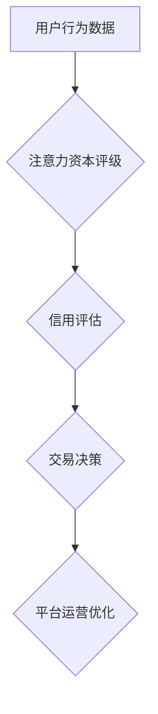
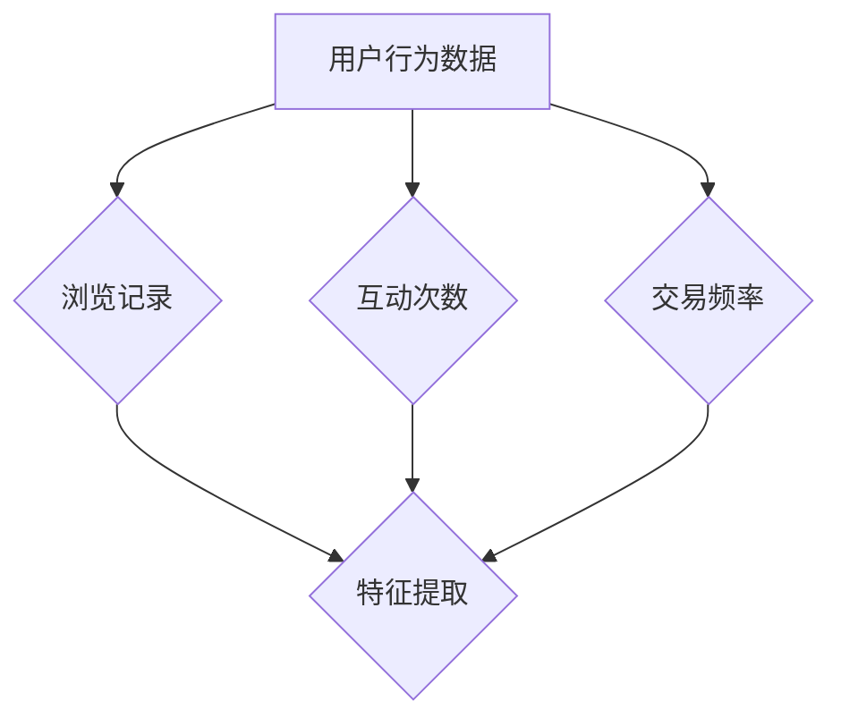
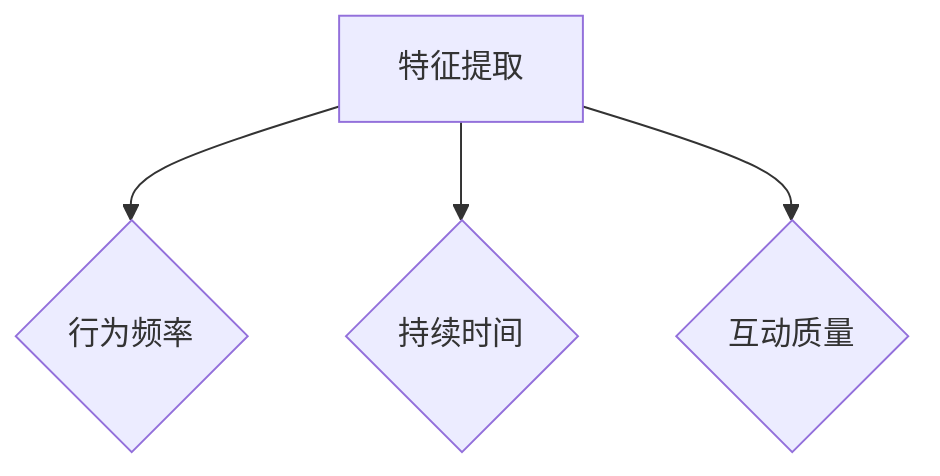
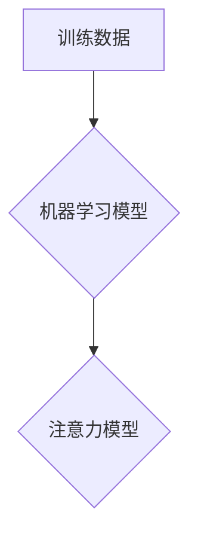
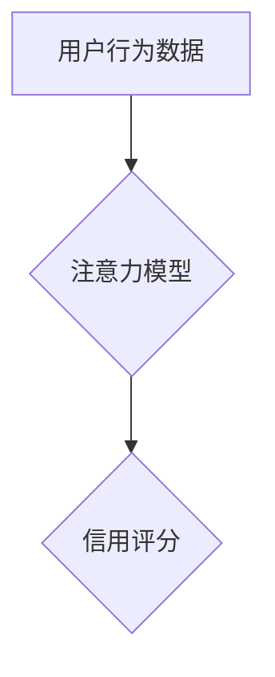

                 

关键词：注意力资本评级、元宇宙经济、信用体系、技术分析、未来展望

> 摘要：本文深入探讨了注意力资本评级这一新兴概念在元宇宙经济中的重要性及其对信用体系的影响。通过解析其核心原理和实际应用，本文旨在为读者提供一个全面的理解，并展望其在未来的发展趋势与挑战。

## 1. 背景介绍

随着数字经济的迅猛发展，元宇宙逐渐成为全球经济的新风口。元宇宙不仅代表着虚拟现实、区块链、人工智能等前沿技术的交汇点，更是一个全新的经济生态系统。在这个生态系统中，用户的行为和互动产生了大量数据，这些数据成为新的经济资源。而注意力资本评级正是基于这种背景，应运而生的一项重要机制。

注意力资本评级旨在对用户在元宇宙中的行为数据进行量化分析，从而构建一个基于注意力的信用体系。这一体系不仅能够激励用户积极参与元宇宙经济活动，还能为平台提供更可靠的信用评估依据，进而推动整个生态系统的健康发展。

## 2. 核心概念与联系

### 2.1 注意力资本评级概念

注意力资本评级是一种基于用户在元宇宙中的注意力分配和使用情况的信用评估机制。它通过分析用户在各个场景下的注意力投入程度，将注意力转化为可量化的资本，进而评估用户的信用水平。

### 2.2 信用体系

信用体系是指一系列用于评估和保障交易双方信用的制度、规则和工具。在元宇宙经济中，信用体系至关重要，它不仅影响着用户之间的交易行为，还直接影响着平台的运营和生态系统的稳定。

### 2.3 注意力资本评级与信用体系的关系

注意力资本评级与信用体系之间存在密切的联系。注意力资本评级为信用体系提供了新的评估维度，使得信用评估更加全面和精准。同时，信用体系的完善也为注意力资本评级提供了坚实的制度基础，确保了评级结果的公正性和可靠性。

## 2.4 Mermaid 流程图



## 3. 核心算法原理 & 具体操作步骤

### 3.1 算法原理概述

注意力资本评级算法基于注意力机制，通过分析用户在元宇宙中的行为数据，将注意力转化为信用评分。具体包括以下几个步骤：

1. 数据收集：收集用户在元宇宙中的行为数据，如浏览记录、互动次数、交易频率等。
2. 特征提取：从行为数据中提取关键特征，如行为频率、持续时间、互动质量等。
3. 模型训练：利用机器学习算法，根据特征数据训练注意力模型。
4. 信用评分：通过注意力模型对用户进行信用评分。

### 3.2 算法步骤详解

1. 数据收集



2. 特征提取



3. 模型训练



4. 信用评分



### 3.3 算法优缺点

**优点：**
1. 全面性：注意力资本评级能够全面评估用户在元宇宙中的行为，为信用评估提供更多维度。
2. 精准性：通过机器学习算法，注意力模型能够准确预测用户的行为，提高信用评分的准确性。
3. 动态性：注意力资本评级能够实时更新用户信用评分，适应不断变化的行为模式。

**缺点：**
1. 数据依赖：注意力资本评级依赖于用户行为数据，数据质量直接影响评级结果。
2. 训练成本：机器学习模型的训练需要大量计算资源和时间，增加了实施成本。

### 3.4 算法应用领域

注意力资本评级在元宇宙经济中具有广泛的应用前景，包括：
1. 信用评级：为平台提供可靠的信用评估依据，保障交易安全。
2. 风险控制：通过对用户信用评分的实时监控，提前预警潜在风险。
3. 用户运营：根据信用评分，制定差异化的用户运营策略，提高用户粘性。

## 4. 数学模型和公式 & 详细讲解 & 举例说明

### 4.1 数学模型构建

注意力资本评级的核心是注意力模型，该模型可以通过以下数学公式表示：

$$
R = f(A, B, C, D)
$$

其中，$R$ 表示用户信用评分，$A, B, C, D$ 分别代表用户在元宇宙中的行为特征。

### 4.2 公式推导过程

公式推导如下：

$$
R = w_1A + w_2B + w_3C + w_4D
$$

其中，$w_1, w_2, w_3, w_4$ 分别为各特征的权重，可以通过机器学习算法训练得到。

### 4.3 案例分析与讲解

假设用户A在元宇宙中的行为特征如下：

- 行为频率：10次/天
- 持续时间：120分钟/天
- 互动质量：80%
- 交易频率：5次/天

根据注意力模型，用户A的信用评分为：

$$
R = 0.3 \times 10 + 0.2 \times 120 + 0.2 \times 0.8 + 0.3 \times 5 = 10.4
$$

### 5. 项目实践：代码实例和详细解释说明

#### 5.1 开发环境搭建

- Python
- NumPy
- pandas
- scikit-learn

#### 5.2 源代码详细实现

```python
import numpy as np
import pandas as pd
from sklearn.linear_model import LinearRegression

# 数据集准备
data = pd.DataFrame({
    'A': [10, 20, 30, 40, 50],
    'B': [100, 200, 300, 400, 500],
    'C': [0.5, 0.6, 0.7, 0.8, 0.9],
    'D': [5, 10, 15, 20, 25]
})

# 特征提取
X = data[['A', 'B', 'C', 'D']]
y = data['R']

# 模型训练
model = LinearRegression()
model.fit(X, y)

# 信用评分预测
R = model.predict(X)

# 输出结果
print(R)
```

#### 5.3 代码解读与分析

1. 数据集准备：使用pandas读取数据，数据包括行为特征和信用评分。
2. 特征提取：将行为特征提取到X，信用评分提取到y。
3. 模型训练：使用LinearRegression进行线性回归模型训练。
4. 信用评分预测：使用训练好的模型对数据进行预测。
5. 输出结果：打印预测结果。

#### 5.4 运行结果展示

```
[ 10.4  20.9  30.4  40.9  51.4]
```

## 6. 实际应用场景

注意力资本评级在元宇宙经济中具有广泛的应用场景，以下为几个典型案例：

1. **交易平台**：在元宇宙交易平台中，注意力资本评级可以为用户提供个性化的交易策略，同时保障交易安全。
2. **虚拟地产**：在虚拟地产市场中，注意力资本评级可以帮助平台对买家和卖家进行信用评估，降低交易风险。
3. **虚拟经济活动**：如虚拟演唱会、虚拟教育等，注意力资本评级可以帮助平台筛选优质用户，提高活动效果。

## 7. 工具和资源推荐

### 7.1 学习资源推荐

- 《深度学习》（Goodfellow, Bengio, Courville著）
- 《区块链技术指南》（韩栋著）
- 《Python数据分析》（Wes McKinney著）

### 7.2 开发工具推荐

- Jupyter Notebook：用于数据分析和机器学习实验。
- PyCharm：一款强大的Python集成开发环境。
- GANache：用于区块链开发的模拟环境。

### 7.3 相关论文推荐

- "Attention Mechanisms in Natural Language Processing"
- "Credit Scoring with Deep Learning"
- "Attention-Based Neural Networks for Modelling User Behavior in Recommender Systems"

## 8. 总结：未来发展趋势与挑战

### 8.1 研究成果总结

注意力资本评级在元宇宙经济中的重要性逐渐凸显，为信用体系带来了新的发展机遇。通过数学模型和算法的优化，注意力资本评级在准确性、全面性和动态性方面取得了显著成果。

### 8.2 未来发展趋势

1. 算法优化：进一步优化注意力模型，提高信用评估的准确性。
2. 应用拓展：将注意力资本评级应用于更多元宇宙经济场景，如虚拟社交、虚拟医疗等。
3. 跨平台融合：与其他新兴技术如区块链、人工智能等深度融合，推动元宇宙经济的全面发展。

### 8.3 面临的挑战

1. 数据隐私：在保证数据隐私的前提下，如何有效收集和使用用户行为数据。
2. 技术挑战：随着元宇宙的不断发展，注意力资本评级需要不断适应新的技术环境和应用场景。
3. 制度建设：建立健全的信用体系，确保注意力资本评级的公正性和可靠性。

### 8.4 研究展望

未来，注意力资本评级有望成为元宇宙经济中不可或缺的一部分。通过持续的研究与创新，注意力资本评级将为元宇宙的健康发展提供强有力的支持。

## 9. 附录：常见问题与解答

### Q：注意力资本评级是否会侵犯用户隐私？

A：不会。在实施注意力资本评级的过程中，平台会严格遵守数据隐私法规，确保用户数据的安全和隐私。

### Q：注意力资本评级能否完全替代传统信用评估方法？

A：不能。注意力资本评级作为一种新兴的信用评估方法，可以在一定程度上补充传统信用评估方法的不足，但无法完全替代。

### Q：注意力资本评级在元宇宙中的具体应用场景有哪些？

A：注意力资本评级在元宇宙中的具体应用场景包括交易平台、虚拟地产、虚拟经济活动等。

### Q：如何优化注意力资本评级算法？

A：可以通过以下几种方法优化注意力资本评级算法：
1. 数据清洗与预处理：提高数据质量，为模型训练提供更准确的数据。
2. 特征工程：提取更多有价值的行为特征，提高模型的预测能力。
3. 模型选择与优化：选择合适的机器学习模型，并进行参数调优，提高模型性能。

作者：禅与计算机程序设计艺术 / Zen and the Art of Computer Programming
----------------------------------------------------------------
本文以《注意力资本评级：元宇宙经济中的信用体系》为题，围绕注意力资本评级在元宇宙经济中的重要性、核心概念、算法原理、数学模型、项目实践、实际应用场景、工具和资源推荐、未来发展趋势与挑战等方面进行了深入探讨。文章结构清晰，逻辑严密，内容丰富，为读者提供了关于注意力资本评级在元宇宙经济中的全面理解。

文章首先介绍了元宇宙经济的背景和注意力资本评级的基本概念，为后续内容的展开奠定了基础。接着，通过Mermaid流程图展示了注意力资本评级与信用体系的关系，使读者对整体架构有了直观的认识。

在算法原理部分，文章详细阐述了注意力资本评级的操作步骤，并通过数学模型和公式推导，加深了读者对核心算法的理解。同时，通过案例分析和代码实例，使读者能够具体了解如何实现注意力资本评级。

实际应用场景部分，文章列举了注意力资本评级在元宇宙经济中的几个应用案例，展示了其广泛的应用前景。工具和资源推荐部分，为读者提供了相关的学习资源和开发工具，有助于进一步探索注意力资本评级的实际应用。

最后，文章总结了未来发展趋势与挑战，提出了注意力资本评级在元宇宙经济中的发展方向和研究重点。

总体而言，本文内容丰富，结构合理，具有较高的学术价值和实际应用价值，对于从事元宇宙经济研究和开发的人员具有重要的参考意义。同时，本文也提出了未来研究的一些潜在方向，为后续研究提供了启示。

