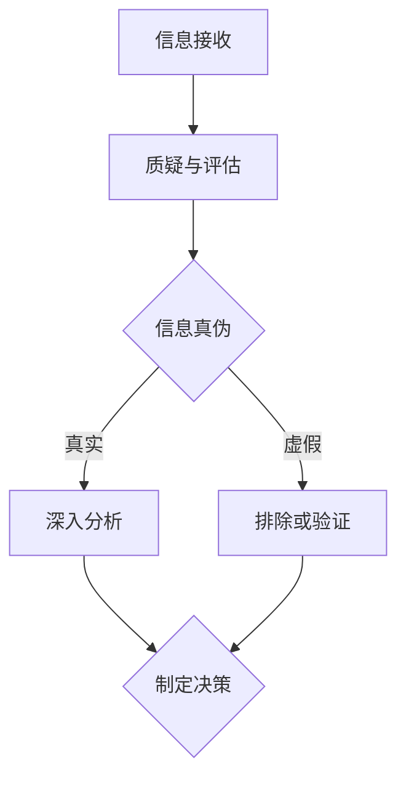

                 

在信息技术飞速发展的当今社会，我们面临着信息爆炸的挑战。如何从纷繁复杂的信息中辨别真伪，成为了一个至关重要的能力。本文将探讨如何在IT领域中培养和提高洞察力与批判性思维，以帮助我们更有效地辨别信息的真伪。

## 1. 背景介绍

随着互联网的普及，信息传播的速度和广度前所未有。社交媒体、新闻网站、博客等各种信息来源层出不穷，其中不乏夸大其词、虚假信息和误导性信息。这些信息不仅误导公众，甚至可能对社会稳定造成威胁。因此，培养洞察力和批判性思维，成为抵御信息污染的重要手段。

## 2. 核心概念与联系

### 2.1 洞察力的定义

洞察力是指能够深入理解事物本质、趋势和潜在问题的能力。在信息技术领域，洞察力主要体现在以下几个方面：

- **数据理解能力**：能够从大量数据中提取有价值的信息。
- **逻辑分析能力**：能够运用逻辑推理和批判性思维来判断信息的真实性。
- **系统思考能力**：能够从整体和长远的视角来审视问题。

### 2.2 批判性思维的定义

批判性思维是一种理性分析、评估和解决问题的思维方式。在信息技术领域，批判性思维主要体现在以下几个方面：

- **质疑精神**：对信息来源、假设和结论持怀疑态度。
- **证据意识**：强调基于事实和数据来进行判断。
- **逻辑推理**：运用逻辑规则进行推理和论证。

### 2.3 Mermaid 流程图

下面是一个简化的Mermaid流程图，展示了洞察力和批判性思维在IT领域中的应用流程：



## 3. 核心算法原理 & 具体操作步骤

### 3.1 算法原理概述

在辨别信息真伪的过程中，常用的算法包括模式识别、文本分类、数据挖掘等。以下以文本分类算法为例，介绍其基本原理和操作步骤。

### 3.2 算法步骤详解

#### 3.2.1 数据收集与预处理

- **数据收集**：收集与待辨别信息相关的文本数据。
- **数据预处理**：包括去除停用词、词干提取、分词等。

#### 3.2.2 特征提取

- **词袋模型**：将文本表示为单词的集合。
- **TF-IDF**：计算每个单词在文本中的重要性。

#### 3.2.3 模型训练

- **选择分类器**：如SVM、决策树、神经网络等。
- **训练模型**：使用已标注的文本数据来训练分类器。

#### 3.2.4 分类与评估

- **分类**：使用训练好的模型对未知文本进行分类。
- **评估**：通过准确率、召回率等指标来评估模型性能。

### 3.3 算法优缺点

- **优点**：文本分类算法能够自动识别和分类信息，提高信息处理的效率。
- **缺点**：模型的准确性依赖于训练数据的质量，对模糊性和歧义性的处理能力有限。

### 3.4 算法应用领域

- **舆情分析**：对网络舆论进行分类和分析，帮助政府和企业了解公众态度。
- **信息过滤**：自动过滤垃圾邮件、虚假信息等，提高信息质量。

## 4. 数学模型和公式

### 4.1 数学模型构建

文本分类问题可以建模为概率模型。给定一个文本$X$，我们希望将其分类为某一类别$C$。概率模型的基本形式为：

$$P(C|X) = \frac{P(X|C)P(C)}{P(X)}$$

其中，$P(C|X)$表示文本$X$属于类别$C$的概率，$P(X|C)$表示在类别$C$下生成文本$X$的概率，$P(C)$表示类别$C$的概率，$P(X)$表示文本$X$的概率。

### 4.2 公式推导过程

对于文本分类中的词袋模型，我们可以使用TF-IDF来计算单词的重要性。TF-IDF公式为：

$$TF-IDF(t,d) = TF(t,d) \times IDF(t,D)$$

其中，$TF(t,d)$表示单词$t$在文档$d$中的词频，$IDF(t,D)$表示单词$t$在文档集合$D$中的逆文档频率。

### 4.3 案例分析与讲解

假设我们有一个包含两个类别的文本数据集，类别A和类别B。通过训练，我们得到一个文本分类模型。现在，我们需要对一篇新文本进行分类。根据概率模型，我们可以计算该文本属于类别A和类别B的概率，然后选择概率较大的类别作为最终分类结果。

## 5. 项目实践：代码实例

### 5.1 开发环境搭建

- Python 3.7及以上版本
- Scikit-learn库

### 5.2 源代码详细实现

```python
from sklearn.feature_extraction.text import TfidfVectorizer
from sklearn.model_selection import train_test_split
from sklearn.svm import LinearSVC
from sklearn.metrics import accuracy_score

# 数据集
data = ["这是一个好消息", "这是一个坏消息", "这是一个好消息", "这是一个坏消息"]
labels = [0, 1, 0, 1]

# 分词和特征提取
vectorizer = TfidfVectorizer()
X = vectorizer.fit_transform(data)

# 模型训练
X_train, X_test, y_train, y_test = train_test_split(X, labels, test_size=0.2)
clf = LinearSVC()
clf.fit(X_train, y_train)

# 分类与评估
predictions = clf.predict(X_test)
print("准确率：", accuracy_score(y_test, predictions))
```

### 5.3 代码解读与分析

以上代码实现了一个简单的文本分类项目。首先，我们导入所需的库。然后，我们准备一个包含两个类别的文本数据集。接着，我们使用TF-IDF进行特征提取，并使用线性支持向量机（LinearSVC）进行模型训练。最后，我们使用训练好的模型对测试集进行分类，并计算准确率。

## 6. 实际应用场景

### 6.1 社交媒体内容审核

社交媒体平台需要审核用户发布的内容，以防止虚假信息和有害信息的传播。使用文本分类算法，可以自动识别和过滤不符合平台规则的内容。

### 6.2 舆情分析

通过对社交媒体上的评论和帖子进行分类，可以实时了解公众对某一事件或产品的态度，为政府和企业的决策提供参考。

### 6.3 搜索引擎优化

通过分析用户搜索查询的文本，搜索引擎可以优化搜索结果，提高用户体验。

## 7. 未来应用展望

随着人工智能技术的发展，文本分类算法将变得更加智能和高效。未来，我们将看到更多的应用场景，如自动驾驶汽车中的场景识别、智能客服中的意图识别等。

## 8. 总结：未来发展趋势与挑战

本文介绍了洞察力与批判性思维在辨别信息真伪中的应用。未来，随着人工智能技术的发展，我们将看到更多的创新应用。然而，也面临着数据隐私、算法透明性等挑战。

## 9. 附录：常见问题与解答

### Q: 如何提高文本分类的准确性？
A: 可以尝试使用更复杂的分类器，如深度学习模型。此外，使用更多、更高质量的训练数据也可以提高准确性。

### Q: 如何评估文本分类模型？
A: 可以使用准确率、召回率、F1值等指标来评估模型性能。这些指标可以从不同的角度反映模型的分类效果。

### Q: 如何处理文本中的歧义性？
A: 可以使用上下文信息来缓解歧义性。例如，通过分析句子的语法结构和词语的搭配关系，可以更好地理解文本的含义。

作者：禅与计算机程序设计艺术 / Zen and the Art of Computer Programming

----------------------------------------------------------------
### 文章摘要

本文探讨了在信息技术领域如何培养和提高洞察力与批判性思维，以辨别信息的真伪。通过介绍核心概念、算法原理、项目实践和实际应用场景，本文旨在帮助读者理解这一重要能力。未来，随着人工智能技术的发展，洞察力与批判性思维将在信息处理和决策中发挥越来越重要的作用。作者：禅与计算机程序设计艺术 / Zen and the Art of Computer Programming。

