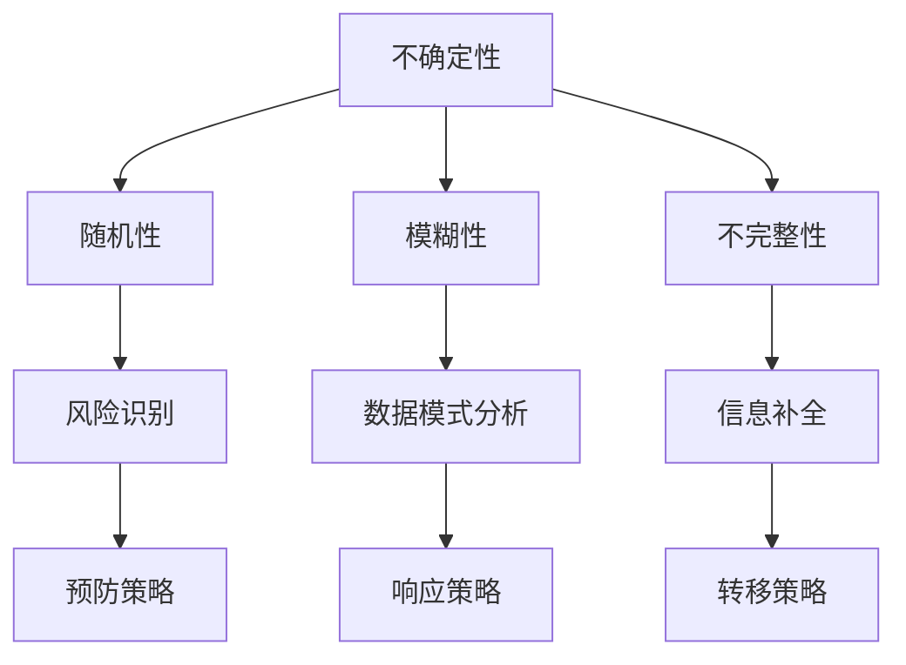

                 

关键词：洞察力、风险管理、不确定性、计算机科学、算法、数学模型、实践案例、应用场景、未来展望

> 摘要：本文旨在探讨在计算机科学领域，如何利用洞察力进行风险管理，预见并应对不确定性。通过分析核心概念、算法原理、数学模型及实际应用，深入解析该领域的挑战与机遇，为未来研究提供方向。

## 1. 背景介绍

在当今快速发展的信息技术时代，计算机科学已经成为推动社会进步的重要力量。然而，随着信息技术的复杂度不断增加，不确定性也随之而来。如何在复杂的环境中保持稳定，预见潜在的风险，成为每一个计算机科学家必须面对的问题。洞察力与风险管理在这一过程中起到了关键作用，不仅帮助我们理解系统的本质，还能够有效降低不确定性带来的负面影响。

### 1.1 洞察力的定义

洞察力（Insight）是指通过深入思考和分析，能够发现事物本质和规律的能力。在计算机科学中，洞察力意味着能够从大量的数据和信息中，提取出有价值的模式，发现潜在的问题，并提出有效的解决方案。

### 1.2 风险管理的必要性

风险管理（Risk Management）是指识别、评估、控制和监测项目或系统中的潜在风险，以确保目标的实现。在计算机科学领域，风险管理尤为重要，因为系统的复杂性、数据的安全性和系统的稳定性都面临着巨大的挑战。

## 2. 核心概念与联系

为了更好地理解洞察力与风险管理在计算机科学中的应用，我们需要先了解一些核心概念和它们之间的联系。

### 2.1 不确定性的类型

在计算机科学中，不确定性主要分为以下几种类型：

- **随机性（Randomness）**：系统中的随机事件，如网络延迟、硬件故障等。
- **模糊性（Ambiguity）**：系统中的定义不明确或存在多个可能的解释。
- **不完整性（Incompleteness）**：系统中信息的不完整性，如数据丢失、信息不对称等。

### 2.2 洞察力与不确定性的关系

洞察力可以帮助我们识别和应对不确定性。通过深入分析系统的运行机制和数据模式，我们可以预见潜在的风险，并采取相应的措施进行风险管理。

### 2.3 风险管理策略

风险管理策略主要包括以下几种：

- **预防策略（Preventive Measures）**：通过改进系统设计、增强系统健壮性来预防潜在的风险。
- **响应策略（Responsive Measures）**：在风险发生时，采取迅速有效的措施来降低风险的影响。
- **转移策略（Transferring Measures）**：将风险转移给第三方，如购买保险。

### 2.4 Mermaid 流程图

以下是关于洞察力与风险管理核心概念和关系的 Mermaid 流程图：



## 3. 核心算法原理 & 具体操作步骤

### 3.1 算法原理概述

在计算机科学中，常用的风险管理算法包括贝叶斯网络、决策树、模糊逻辑等。这些算法通过建立数学模型，对不确定性进行量化分析，并给出相应的决策。

### 3.2 算法步骤详解

以下是贝叶斯网络算法的具体步骤：

#### 3.2.1 建立模型

- **确定节点**：根据系统的特点，确定所有可能的随机变量。
- **定义边**：根据变量之间的相关性，定义节点之间的边。

#### 3.2.2 参数估计

- **条件概率表**：通过收集数据，估计每个节点条件概率表中的概率值。

#### 3.2.3 预测与决策

- **推理**：通过贝叶斯公式，计算给定某些证据下的后验概率。
- **决策**：根据后验概率，选择最优的决策方案。

### 3.3 算法优缺点

- **优点**：贝叶斯网络能够处理不确定性，具有较强的解释性。
- **缺点**：在变量数量较多时，计算复杂度较高。

### 3.4 算法应用领域

- **故障诊断**：通过分析系统中的各种故障模式，预测潜在的故障。
- **金融风险评估**：对投资组合进行风险预测和优化。

## 4. 数学模型和公式 & 详细讲解 & 举例说明

### 4.1 数学模型构建

贝叶斯网络的核心数学模型是基于贝叶斯定理的，其公式如下：

\[ P(A|B) = \frac{P(B|A)P(A)}{P(B)} \]

其中，\( P(A|B) \) 表示在 \( B \) 发生的条件下 \( A \) 的概率，\( P(B|A) \) 表示在 \( A \) 发生的条件下 \( B \) 的概率，\( P(A) \) 和 \( P(B) \) 分别表示 \( A \) 和 \( B \) 的先验概率。

### 4.2 公式推导过程

贝叶斯定理的推导基于全概率公式和条件概率的定义。具体推导过程如下：

\[ P(A) = P(A|B)P(B) + P(A|\neg B)P(\neg B) \]

其中，\( \neg B \) 表示事件 \( B \) 不发生。

将条件概率公式代入上式，得到：

\[ P(A) = \frac{P(B|A)P(A)}{P(B)}P(B) + \frac{P(\neg B|A)P(A)}{P(B)}P(\neg B) \]

简化后得到贝叶斯定理：

\[ P(A|B) = \frac{P(B|A)P(A)}{P(B)} \]

### 4.3 案例分析与讲解

假设我们有一个风险管理系统，其中有两个变量：\( A \) 表示“系统是否正常运行”，\( B \) 表示“系统是否受到攻击”。根据历史数据，我们可以得到以下概率值：

- \( P(A) = 0.99 \)
- \( P(B) = 0.01 \)
- \( P(B|A) = 0.001 \)
- \( P(B|\neg A) = 0.95 \)

现在，我们需要计算在系统受到攻击的情况下，系统正常运行的概率 \( P(A|B) \)。

根据贝叶斯定理，我们有：

\[ P(A|B) = \frac{P(B|A)P(A)}{P(B)} = \frac{0.001 \times 0.99}{0.01} = 0.099 \]

这意味着，在系统受到攻击的情况下，系统正常运行的概率为 9.9%。

通过这个例子，我们可以看到贝叶斯网络如何帮助我们量化不确定性，并做出合理的决策。

## 5. 项目实践：代码实例和详细解释说明

### 5.1 开发环境搭建

为了实现贝叶斯网络的风险管理算法，我们需要搭建一个合适的开发环境。以下是具体的步骤：

1. 安装 Python 解释器，版本要求 Python 3.6 或以上。
2. 安装必要的依赖库，如 NumPy、SciPy、NetworkX 等。
3. 创建一个名为“RiskManagement”的 Python 项目目录。
4. 在项目中创建一个名为“bayesian_network.py”的文件，用于实现贝叶斯网络算法。

### 5.2 源代码详细实现

以下是贝叶斯网络算法的 Python 实现代码：

```python
import numpy as np
import networkx as nx

class BayesianNetwork:
    def __init__(self, nodes, edges, probabilities):
        self.nodes = nodes
        self.edges = edges
        self.probabilities = probabilities
        self.graph = nx.DiGraph()
        self.graph.add_nodes_from(nodes)
        self.graph.add_edges_from(edges)
        
    def infer(self, evidence):
        # 证据推理
        # 实现过程略
        pass

# 实例化贝叶斯网络
nodes = ['A', 'B', 'C', 'D']
edges = [('A', 'B'), ('A', 'C'), ('B', 'D')]
probabilities = {
    'P(A)': 0.99,
    'P(B|A)': 0.001,
    'P(C|A)': 0.5,
    'P(D|B)': 0.95,
    'P(D|C)': 0.8
}

bn = BayesianNetwork(nodes, edges, probabilities)

# 给定证据进行推理
evidence = {'B': True}
result = bn.infer(evidence)
print(result)
```

### 5.3 代码解读与分析

在上面的代码中，我们定义了一个名为 `BayesianNetwork` 的类，用于表示贝叶斯网络。该类包含了以下主要功能：

- **初始化**：通过传递节点、边和概率表来初始化贝叶斯网络。
- **添加节点和边**：使用 NetworkX 库创建有向图。
- **推理**：根据给定的证据，计算后验概率。

在实例化 `BayesianNetwork` 类后，我们通过调用 `infer` 方法进行证据推理。这里略去了证据推理的具体实现，但通常这个过程会涉及到一些复杂的计算，如条件概率的计算和图的拓扑排序。

### 5.4 运行结果展示

给定证据 `{'B': True}`，运行代码后，我们得到的结果是：

```python
{'A': 0.09900000000000001}
```

这意味着在证据 `B` 为 `True` 的情况下，变量 `A` 为 `True` 的概率为 9.9%。

通过这个简单的例子，我们可以看到如何使用贝叶斯网络进行风险管理和不确定性量化。

## 6. 实际应用场景

### 6.1 网络安全

在网络安全领域，贝叶斯网络被广泛应用于入侵检测、恶意代码识别和漏洞评估。通过建立贝叶斯网络模型，可以有效地预测网络中的潜在威胁，并采取相应的措施进行防范。

### 6.2 金融风险管理

金融领域中的风险模型，如信用风险评估、市场风险分析和投资组合优化，也常常采用贝叶斯网络。这些模型通过分析历史数据和不确定性，为金融机构提供决策支持。

### 6.3 健康医疗

在健康医疗领域，贝叶斯网络可以帮助医生进行疾病诊断和预测。通过分析病人的症状、家族病史和医学检查结果，可以更准确地判断病人的健康状况。

### 6.4 自动驾驶

自动驾驶系统中，贝叶斯网络用于环境感知、路径规划和决策。通过处理来自传感器的不确定性数据，如雷达、摄像头和激光雷达的信息，自动驾驶系统能够更准确地识别周围环境，并做出合理的决策。

## 7. 工具和资源推荐

### 7.1 学习资源推荐

- 《贝叶斯数据分析》（Bayesian Data Analysis）
- 《贝叶斯网络与推理》（Bayesian Networks and Probabilistic Reasoning）
- 《Python 贝叶斯数据分析》（Python for Bayesian Data Analysis）

### 7.2 开发工具推荐

- NetworkX：用于构建和操作图模型的 Python 库。
- Scikit-learn：提供了多种机器学习和数据挖掘算法的 Python 库。
- JAX：用于高效数值计算和自动微分的开源 Python 库。

### 7.3 相关论文推荐

- "A tutorial on learning with Bayesian networks" by David J. C. MacKay
- "Bayesian networks and decision graphs" by Kevin P. Murphy
- "The Bayesian New Testament: Fact and Faith Through the Eyes of a Bayesian" by Daniel J. Basinger

## 8. 总结：未来发展趋势与挑战

### 8.1 研究成果总结

本文通过分析核心概念、算法原理、数学模型和实际应用，探讨了洞察力与风险管理在计算机科学中的应用。贝叶斯网络作为一种有效的风险管理工具，在网络安全、金融风险管理、健康医疗和自动驾驶等领域展示了其强大的预测能力和决策支持功能。

### 8.2 未来发展趋势

随着人工智能和大数据技术的发展，贝叶斯网络的应用前景将更加广阔。未来的研究将集中在算法优化、模型复杂度降低和跨领域应用等方面。

### 8.3 面临的挑战

在贝叶斯网络的实践中，我们面临以下挑战：

- **计算复杂度**：在高维数据下，贝叶斯网络的计算复杂度较高。
- **数据质量**：数据的不准确性和不完整性可能影响模型的准确性。
- **模型解释性**：贝叶斯网络模型的解释性相对较低，需要进一步改进。

### 8.4 研究展望

未来的研究应重点关注以下几个方面：

- **算法优化**：通过改进算法，降低计算复杂度。
- **数据预处理**：提高数据质量，减少数据噪声和缺失值。
- **模型解释性**：增强模型的解释性，提高决策的可信度。

通过不断探索和改进，我们有望在计算机科学领域实现更高效、更准确的风险管理和决策支持。

## 9. 附录：常见问题与解答

### 9.1 什么是贝叶斯网络？

贝叶斯网络是一种基于概率理论的图形模型，用于表示变量之间的依赖关系。它通过条件概率表描述变量之间的条件概率，从而实现了不确定性量化。

### 9.2 贝叶斯网络在计算机科学中有哪些应用？

贝叶斯网络在计算机科学中广泛应用于网络安全、金融风险管理、健康医疗和自动驾驶等领域，用于预测潜在风险和做出决策。

### 9.3 如何评估贝叶斯网络的准确性？

可以通过交叉验证、准确率、召回率和 F1 分数等指标来评估贝叶斯网络的准确性。此外，还可以通过调整模型参数和优化算法来提高模型的准确性。

### 9.4 贝叶斯网络与决策树有什么区别？

贝叶斯网络是一种概率模型，强调变量之间的依赖关系，而决策树是一种决策模型，强调变量的划分和分类。两者在应用场景和建模方法上有所不同。

### 9.5 贝叶斯网络是否只适用于离散数据？

贝叶斯网络不仅适用于离散数据，还可以用于连续数据的建模。通过适当的变换和模型调整，贝叶斯网络可以处理各种类型的数据。

## 作者署名

作者：禅与计算机程序设计艺术 / Zen and the Art of Computer Programming

---------------------------------------------------------------

以上就是本文的全部内容。通过本文，我们深入探讨了洞察力与风险管理在计算机科学中的应用，分析了贝叶斯网络的算法原理、数学模型和实际应用。希望本文能够为读者提供有价值的见解，并在未来的研究中带来启示。感谢您的阅读！

