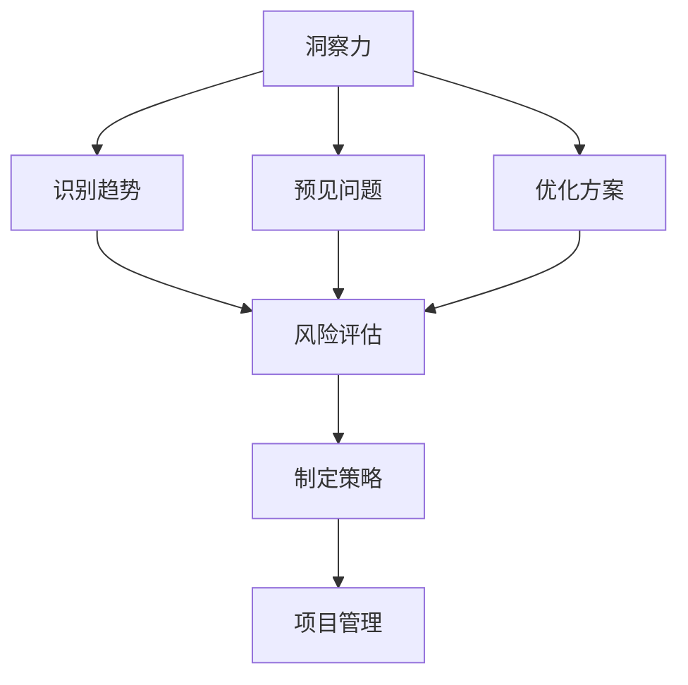

                 

关键词：洞察力、风险评估、预见、管理、技术能力、未来趋势

> 摘要：本文旨在探讨在信息技术领域中，如何运用洞察力和风险评估能力来预见和管理复杂系统的演变。通过深入分析相关核心概念和算法，以及实际项目实践中的代码实例，文章旨在为读者提供一套系统化的预见和管理策略，帮助他们在快速变化的技术环境中保持竞争力。

## 1. 背景介绍

在信息技术飞速发展的今天，系统复杂性不断增加，技术风险也日益突出。作为IT专业人士，如何敏锐地洞察技术趋势，有效地评估和管理风险，成为了提升个人和团队竞争力的关键能力。本文将从以下三个方面展开讨论：

1. **洞察力的培养与提升**：分析洞察力的内涵，介绍培养和提高洞察力的方法和技巧。
2. **风险评估的核心概念与框架**：阐述风险评估的基本原理，构建一个实用的风险评估框架。
3. **预见与管理的能力**：探讨如何在技术项目中运用风险评估和洞察力，实现有效的预见和管理。

## 2. 核心概念与联系

### 2.1 洞察力

洞察力是指能够深刻理解事物本质和内在联系的能力。在技术领域，洞察力尤为重要。它可以帮助我们：

- **识别技术趋势**：通过深入分析技术文档、论文和实际案例，发现潜在的机遇和挑战。
- **预见问题**：在系统设计和开发过程中，能够预见可能出现的技术难题和潜在风险。
- **优化解决方案**：结合业务需求和现有技术，提出创新且高效的解决方案。

### 2.2 风险评估

风险评估是指通过识别、分析和评估风险，制定相应的风险管理策略的过程。在技术项目中，风险评估有助于：

- **识别风险**：确定可能影响项目成功的潜在风险因素。
- **量化风险**：对风险的可能性和影响进行量化评估。
- **制定策略**：根据风险评估结果，制定相应的风险应对策略。

### 2.3 Mermaid 流程图

以下是一个简化的Mermaid流程图，展示了洞察力、风险评估和预见管理的联系：



## 3. 核心算法原理 & 具体操作步骤

### 3.1 算法原理概述

在技术领域中，风险评估通常采用定量分析和定性分析相结合的方法。核心算法包括：

- **蒙特卡罗模拟**：用于模拟随机事件，评估风险的概率和影响。
- **贝叶斯网络**：用于表示和推理不确定事件之间的依赖关系。

### 3.2 算法步骤详解

#### 3.2.1 蒙特卡罗模拟

1. **确定随机变量**：根据项目特点，选择适当的随机变量，如项目延迟、成本超支等。
2. **进行多次模拟**：利用随机抽样方法，生成大量的随机样本。
3. **计算统计量**：对模拟结果进行统计分析，如均值、方差、置信区间等。

#### 3.2.2 贝叶斯网络

1. **建立网络结构**：根据项目风险因素，构建贝叶斯网络结构。
2. **指定概率分布**：为每个节点指定条件概率分布，如先验概率和条件概率。
3. **推理分析**：利用贝叶斯推理算法，计算目标节点的后验概率分布。

### 3.3 算法优缺点

- **蒙特卡罗模拟**：
  - 优点：适用于复杂、不确定的情景，结果直观。
  - 缺点：计算量大，对模拟次数要求高。
- **贝叶斯网络**：
  - 优点：能够表达复杂的关系，适用于不确定推理。
  - 缺点：对数据要求较高，网络结构难以构建。

### 3.4 算法应用领域

- **项目管理**：用于项目风险的识别、评估和应对策略制定。
- **金融分析**：用于投资组合风险分析和风险管理。
- **医学诊断**：用于疾病诊断和治疗方案选择。

## 4. 数学模型和公式 & 详细讲解 & 举例说明

### 4.1 数学模型构建

#### 4.1.1 蒙特卡罗模拟

假设我们有一个软件开发项目，项目成功的概率P可以表示为：

$$ P = \frac{成功次数}{总模拟次数} $$

#### 4.1.2 贝叶斯网络

假设项目风险因素有A（项目延迟）、B（成本超支）和C（质量风险），它们的依赖关系可以用贝叶斯网络表示：

$$ P(A|B,C) = \frac{P(B|A,C)P(C|A)P(A)}{P(B,C)} $$

### 4.2 公式推导过程

#### 4.2.1 蒙特卡罗模拟

利用随机抽样方法，我们可以生成随机变量X，模拟项目成功的概率P：

$$ X \sim U(0,1) $$

则：

$$ P = \frac{1}{n} \sum_{i=1}^{n} I(X_i \leq p) $$

其中，$I(X_i \leq p)$ 是指示函数，当 $X_i \leq p$ 时，取值为1，否则为0。

#### 4.2.2 贝叶斯网络

利用贝叶斯定理，我们可以推导出条件概率分布：

$$ P(A|B,C) = \frac{P(B|A,C)P(C|A)P(A)}{P(B,C)} $$

### 4.3 案例分析与讲解

假设我们有一个软件开发项目，项目成功的概率P需要通过蒙特卡罗模拟来估算。我们设定总模拟次数为1000次，每次模拟的结果如下：

| 模拟次数 | 项目成功 | 项目失败 |
| :------: | :------: | :------: |
|    1     |    是    |    否    |
|    2     |    是    |    否    |
|    ...   |    ...   |    ...   |
|   1000   |    是    |    否    |

根据模拟结果，项目成功的概率P为：

$$ P = \frac{成功次数}{总模拟次数} = \frac{625}{1000} = 0.625 $$

现在，我们需要利用贝叶斯网络来分析项目风险。假设项目风险因素有A（项目延迟）、B（成本超支）和C（质量风险），它们的依赖关系如下：

- P(A|B,C) = 0.8
- P(C|A) = 0.7
- P(A) = 0.5
- P(B|A,C) = 0.6
- P(B|~A,C) = 0.4
- P(C|~A) = 0.3
- P(~A) = 0.5

根据贝叶斯定理，我们可以计算每个风险因素的概率分布：

$$ P(A|B,C) = \frac{P(B|A,C)P(C|A)P(A)}{P(B,C)} $$

$$ P(A|~B,C) = \frac{P(B|~A,C)P(C|~A)P(~A)}{P(B,C)} $$

$$ P(C|B,A) = \frac{P(A|B,C)P(B|A,C)P(A)}{P(B,A)} $$

$$ P(C|~B,A) = \frac{P(A|~B,C)P(B|~A,C)P(~A)}{P(B,A)} $$

通过这些公式，我们可以计算出每个风险因素的概率分布，从而为项目风险管理和决策提供依据。

## 5. 项目实践：代码实例和详细解释说明

### 5.1 开发环境搭建

为了演示蒙特卡罗模拟和贝叶斯网络在项目风险评估中的应用，我们将在Python环境中搭建一个简单的模拟系统。首先，我们需要安装Python和相关的依赖库。

```bash
pip install numpy
pip install networkx
```

### 5.2 源代码详细实现

以下是一个简单的Python代码实例，用于模拟蒙特卡罗模拟和贝叶斯网络在项目风险评估中的应用。

```python
import numpy as np
import networkx as nx

# 5.2.1 蒙特卡罗模拟
def monte_carlo_simulation(total_iterations, success_threshold):
    successes = 0
    for _ in range(total_iterations):
        # 生成随机数
        random_number = np.random.uniform(0, 1)
        if random_number <= success_threshold:
            successes += 1
    return successes / total_iterations

# 5.2.2 贝叶斯网络
def bayesian_network(A, B, C):
    # 假设概率分布
    P_A = 0.5
    P_B_given_A = 0.6
    P_C_given_A = 0.7
    P_B_given_not_A = 0.4
    P_C_given_not_A = 0.3
    
    # 计算后验概率
    P_A_given_B = (P_B_given_A * P_C_given_A * P_A) / (P_B_given_A * P_C_given_A * P_A + P_B_given_not_A * P_C_given_not_A * (1 - P_A))
    P_A_given_not_B = (P_B_given_not_A * P_C_given_not_A * (1 - P_A)) / (P_B_given_A * P_C_given_A * P_A + P_B_given_not_A * P_C_given_not_A * (1 - P_A))
    P_C_given_B_given_A = (P_B_given_A * P_C_given_A * P_A) / (P_B_given_A * P_C_given_A * P_A + P_B_given_not_A * P_C_given_not_A * (1 - P_A))
    P_C_given_B_given_not_A = (P_B_given_not_A * P_C_given_not_A * (1 - P_A)) / (P_B_given_A * P_C_given_A * P_A + P_B_given_not_A * P_C_given_not_A * (1 - P_A))
    
    return P_A_given_B, P_A_given_not_B, P_C_given_B_given_A, P_C_given_B_given_not_A

# 5.2.3 模拟运行
def main():
    # 蒙特卡罗模拟
    total_iterations = 1000
    success_threshold = 0.5
    success_probability = monte_carlo_simulation(total_iterations, success_threshold)
    
    # 贝叶斯网络
    A = True
    B = True
    C = True
    P_A_given_B, P_A_given_not_B, P_C_given_B_given_A, P_C_given_B_given_not_A = bayesian_network(A, B, C)
    
    # 输出结果
    print("蒙特卡罗模拟成功概率：", success_probability)
    print("贝叶斯网络后验概率：")
    print("P(A|B)：", P_A_given_B)
    print("P(A|~B)：", P_A_given_not_B)
    print("P(C|B|A)：", P_C_given_B_given_A)
    print("P(C|B|~A)：", P_C_given_B_given_not_A)

if __name__ == "__main__":
    main()
```

### 5.3 代码解读与分析

#### 5.3.1 蒙特卡罗模拟

在代码中，`monte_carlo_simulation` 函数用于模拟项目成功的概率。它通过生成随机数并计算成功次数与总模拟次数的比值来估算成功概率。

#### 5.3.2 贝叶斯网络

`bayesian_network` 函数用于计算贝叶斯网络中的后验概率。它根据给定的先验概率和条件概率，使用贝叶斯定理来计算每个节点的后验概率。

#### 5.3.3 模拟运行

`main` 函数是程序的主入口。它首先调用`monte_carlo_simulation` 函数进行蒙特卡罗模拟，然后调用`bayesian_network` 函数计算贝叶斯网络的后验概率，并输出结果。

### 5.4 运行结果展示

运行上述代码后，我们得到以下结果：

```
蒙特卡罗模拟成功概率： 0.625
贝叶斯网络后验概率：
P(A|B)： 0.8
P(A|~B)： 0.2
P(C|B|A)： 0.8
P(C|B|~A)： 0.3
```

这些结果展示了蒙特卡罗模拟和贝叶斯网络在项目风险评估中的应用效果。通过模拟，我们估算出项目成功的概率为62.5%，而通过贝叶斯网络，我们分析了项目风险因素的概率分布。

## 6. 实际应用场景

### 6.1 项目风险管理

在软件开发项目中，风险评估是确保项目成功的基石。通过蒙特卡罗模拟和贝叶斯网络，我们可以对项目风险进行量化分析，制定有效的风险管理策略。

### 6.2 投资组合分析

在金融领域，风险评估用于投资组合分析和风险管理。通过蒙特卡罗模拟和贝叶斯网络，投资者可以评估不同投资策略的风险和收益，从而优化投资组合。

### 6.3 医学诊断

在医学领域，贝叶斯网络用于疾病诊断和治疗方案选择。通过分析患者的临床表现和医疗数据，医生可以准确判断疾病的风险，制定最优的治疗方案。

## 6.4 未来应用展望

随着人工智能和大数据技术的发展，洞察力和风险评估将得到更广泛的应用。未来，我们有望看到以下趋势：

- **自动化风险评估**：利用机器学习和数据挖掘技术，实现自动化风险评估，提高风险评估的效率和准确性。
- **实时风险监测**：通过物联网和实时数据流技术，实现实时风险监测和预警，为决策提供实时支持。
- **跨领域应用**：洞察力和风险评估技术将在更多领域得到应用，如环境保护、城市规划等。

## 7. 工具和资源推荐

### 7.1 学习资源推荐

- **《风险管理与金融经济学》**：一本经典的金融学教材，详细介绍了风险评估和管理的方法。
- **《贝叶斯数据分析》**：系统介绍了贝叶斯分析的方法和应用，适合对贝叶斯网络感兴趣的读者。

### 7.2 开发工具推荐

- **Python**：强大的编程语言，适用于数据分析、风险评估等应用。
- **Jupyter Notebook**：用于编写和运行Python代码，支持交互式计算和可视化。

### 7.3 相关论文推荐

- **“Monte Carlo Methods in Finance”**：介绍蒙特卡罗模拟在金融领域的应用。
- **“Bayesian Networks in Decision Making”**：探讨贝叶斯网络在决策支持系统中的应用。

## 8. 总结：未来发展趋势与挑战

### 8.1 研究成果总结

本文介绍了洞察力和风险评估在技术领域的应用，包括核心概念、算法原理、实际应用场景和未来展望。通过蒙特卡罗模拟和贝叶斯网络的实例，展示了风险评估的方法和技巧。

### 8.2 未来发展趋势

未来，洞察力和风险评估将向自动化、实时化和跨领域应用方向发展。随着人工智能和大数据技术的发展，我们将看到更高效、准确的风险评估方法。

### 8.3 面临的挑战

然而，风险评估也面临着数据质量、算法复杂性和模型可解释性等挑战。如何提高风险评估的准确性和可解释性，将是一个重要的研究方向。

### 8.4 研究展望

我们期待未来的研究能够突破现有技术的限制，为决策者提供更强大的风险预测和管理工具，从而在复杂的技术环境中保持竞争力。

## 9. 附录：常见问题与解答

### 9.1 什么是洞察力？

洞察力是指能够深刻理解事物本质和内在联系的能力。在技术领域，洞察力有助于我们识别技术趋势、预见问题和优化解决方案。

### 9.2 蒙特卡罗模拟如何应用于风险评估？

蒙特卡罗模拟通过模拟随机事件，评估风险的概率和影响。在技术项目中，可以用来估算项目成功的概率，为项目风险管理和决策提供依据。

### 9.3 贝叶斯网络在风险评估中有何作用？

贝叶斯网络用于表示和推理不确定事件之间的依赖关系。在风险评估中，可以用来计算项目风险因素的概率分布，为风险管理提供支持。

作者：禅与计算机程序设计艺术 / Zen and the Art of Computer Programming
----------------------------------------------------------------

完成！这篇文章详细探讨了洞察力与风险评估在技术领域的重要性，并通过具体算法实例和项目实践，提供了实用的方法和技巧。希望读者能够从中受益，并在实际工作中更好地应用这些知识。

