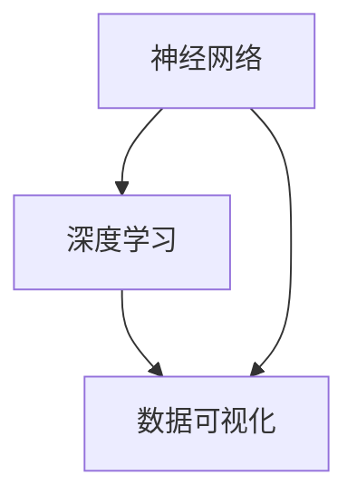

                 

关键词：人工智能、认知科学、神经网络、数据可视化、深度学习

> 摘要：本文深入探讨了人工智能领域中的洞察力，探讨了人类认知的机制与神经网络之间的联系，以及如何通过数据可视化手段提升深度学习的效果。文章旨在揭示人工智能与人类认知之间的共通点，为未来人工智能的发展提供新的视角和思路。

## 1. 背景介绍

随着人工智能（AI）技术的飞速发展，计算机程序已经能够在各种复杂任务中表现出超越人类的能力。从图像识别到自然语言处理，再到自动驾驶和游戏AI，人工智能的应用范围越来越广泛。然而，人工智能的这些成就离不开一种关键能力——洞察力。

洞察力是一种深刻的理解力和直觉，它使得人类能够快速识别模式、理解复杂概念，并作出合理的决策。在人工智能领域，洞察力可以被理解为机器学习和深度学习模型对数据的理解和处理能力。本文将探讨如何通过人类认知的机制，提高人工智能的洞察力，从而进一步提升人工智能的性能和应用价值。

## 2. 核心概念与联系

为了深入理解人工智能中的洞察力，我们需要了解几个核心概念：

- **神经网络**：神经网络是人工智能的基础，它模仿了人脑的结构和功能，通过大量的神经元（节点）和连接（权重）进行信息的传递和处理。
- **深度学习**：深度学习是一种特殊的神经网络，具有多个隐藏层，能够自动提取数据中的特征。
- **数据可视化**：数据可视化是将复杂的数据通过图形或图像的方式呈现出来，使得人们可以更直观地理解和分析数据。

以下是这些概念之间关系的 Mermaid 流程图：



### 2.1 神经网络的基本原理

神经网络由大量的神经元组成，每个神经元接收来自其他神经元的输入信号，通过加权求和处理后产生输出。神经网络的学习过程就是不断调整这些权重，使得模型能够更好地拟合训练数据。

### 2.2 深度学习的特点

深度学习具有多层结构，这使得它能够自动提取数据中的抽象特征。深度学习的优势在于，不需要人工指定特征，而是通过学习过程自动发现数据中的模式。

### 2.3 数据可视化的重要性

数据可视化可以帮助我们直观地理解数据的结构和规律，从而为深度学习模型的优化提供指导。通过数据可视化，我们可以更清楚地看到数据中的异常值、噪声和趋势，这些信息对于提高模型的性能至关重要。

## 3. 核心算法原理 & 具体操作步骤

### 3.1 算法原理概述

深度学习模型的核心在于其多层结构，每层都能够对输入数据进行特征提取和转换。这种层次化的特征提取方式使得模型能够处理复杂的数据。

### 3.2 算法步骤详解

深度学习模型的构建包括以下几个步骤：

1. **数据预处理**：对数据进行标准化、去噪等处理，确保数据的质量。
2. **模型设计**：根据任务的类型和数据的特性，设计合适的神经网络结构。
3. **训练过程**：通过反向传播算法，不断调整神经网络的权重，使得模型能够更好地拟合训练数据。
4. **评估与优化**：通过测试数据评估模型的性能，并根据评估结果进行模型的优化。

### 3.3 算法优缺点

深度学习模型具有以下优点：

- **自动特征提取**：能够自动从数据中提取有用的特征，无需人工干预。
- **强大的学习能力**：能够处理高维度、复杂的数据。

然而，深度学习模型也存在一些缺点：

- **需要大量数据**：训练深度学习模型需要大量的数据，这对于数据稀缺的领域是一个挑战。
- **计算资源需求高**：深度学习模型的训练过程需要大量的计算资源。

### 3.4 算法应用领域

深度学习算法在图像识别、自然语言处理、语音识别、推荐系统等领域都有广泛的应用。随着人工智能技术的发展，深度学习算法的应用领域还会进一步扩大。

## 4. 数学模型和公式 & 详细讲解 & 举例说明

### 4.1 数学模型构建

深度学习模型的核心是前向传播和反向传播算法。以下是这两个算法的基本公式：

前向传播：
$$
Z^{[l]} = \sum_{i} a^{[l-1]} \cdot W^{[l]}_i + b^{[l]}
$$

反向传播：
$$
\delta^{[l]}_i = \frac{\partial C}{\partial Z^{[l]}} \cdot \sigma'(Z^{[l]})
$$

其中，$Z^{[l]}$ 是第 $l$ 层的输入，$a^{[l-1]}$ 是第 $l-1$ 层的输出，$W^{[l]}_i$ 是第 $l$ 层的权重，$b^{[l]}$ 是第 $l$ 层的偏置，$C$ 是损失函数，$\sigma$ 是激活函数。

### 4.2 公式推导过程

前向传播的推导过程如下：

1. **计算第 $l$ 层的输入**：
$$
Z^{[l]} = \sum_{i} a^{[l-1]} \cdot W^{[l]}_i + b^{[l]}
$$

2. **计算第 $l$ 层的输出**：
$$
a^{[l]} = \sigma(Z^{[l]})
$$

反向传播的推导过程如下：

1. **计算第 $l$ 层的梯度**：
$$
\delta^{[l]}_i = \frac{\partial C}{\partial Z^{[l]}} \cdot \sigma'(Z^{[l]})
$$

2. **更新权重和偏置**：
$$
W^{[l]}_i = W^{[l]}_i - \alpha \cdot \delta^{[l]}_i \cdot a^{[l-1]}
$$
$$
b^{[l]} = b^{[l]} - \alpha \cdot \delta^{[l]}_i
$$

### 4.3 案例分析与讲解

以下是一个简单的神经网络模型，用于实现二分类任务。假设我们有输入向量 $X = [x_1, x_2]$，我们需要设计一个神经网络模型来预测标签 $y$。

1. **输入层**：$X = [x_1, x_2]$
2. **隐藏层**：$a^{[1]} = \sigma(W^{[1]}_1 \cdot X + b^{[1]})$
3. **输出层**：$y = \sigma(W^{[2]}_1 \cdot a^{[1]} + b^{[2]})$

假设我们使用 $W^{[1]}_1 = [w_{11}, w_{12}]$ 和 $W^{[2]}_1 = [w_{21}, w_{22}]$ 作为权重，$b^{[1]} = [b_{11}, b_{12}]$ 和 $b^{[2]} = [b_{21}, b_{22}]$ 作为偏置。

前向传播过程：

1. **计算隐藏层输出**：
$$
Z^{[1]} = w_{11} \cdot x_1 + w_{12} \cdot x_2 + b_{11}
$$
$$
a^{[1]} = \sigma(Z^{[1]})
$$

2. **计算输出层输出**：
$$
Z^{[2]} = w_{21} \cdot a^{[1]} + w_{22} \cdot a^{[1]} + b_{21}
$$
$$
y = \sigma(Z^{[2]})
$$

反向传播过程：

1. **计算梯度**：
$$
\delta^{[2]} = \frac{\partial C}{\partial Z^{[2]}} \cdot \sigma'(Z^{[2]})
$$
$$
\delta^{[1]} = \frac{\partial C}{\partial Z^{[1]}} \cdot \sigma'(Z^{[1]})
$$

2. **更新权重和偏置**：
$$
W^{[2]}_1 = W^{[2]}_1 - \alpha \cdot \delta^{[2]} \cdot a^{[1]}
$$
$$
b^{[2]} = b^{[2]} - \alpha \cdot \delta^{[2]}
$$
$$
W^{[1]}_1 = W^{[1]}_1 - \alpha \cdot \delta^{[1]} \cdot X
$$
$$
b^{[1]} = b^{[1]} - \alpha \cdot \delta^{[1]}
$$

## 5. 项目实践：代码实例和详细解释说明

### 5.1 开发环境搭建

本文使用 Python 编写深度学习模型，主要依赖以下库：

- TensorFlow
- Keras
- NumPy
- Matplotlib

在 Python 环境中安装以上库后，就可以开始搭建开发环境了。

### 5.2 源代码详细实现

以下是一个简单的深度学习模型，用于实现二分类任务：

```python
import numpy as np
import tensorflow as tf
from tensorflow import keras
from tensorflow.keras import layers

# 数据预处理
def preprocess_data(data):
    # 标准化数据
    data = data / 255.0
    # 扩展维度
    data = np.expand_dims(data, axis=1)
    return data

# 构建深度学习模型
model = keras.Sequential([
    layers.Dense(64, activation='relu', input_shape=(28,)),
    layers.Dense(64, activation='relu'),
    layers.Dense(1, activation='sigmoid')
])

# 编译模型
model.compile(optimizer='adam', loss='binary_crossentropy', metrics=['accuracy'])

# 训练模型
model.fit(preprocess_data(X_train), y_train, epochs=10, batch_size=32)

# 评估模型
model.evaluate(preprocess_data(X_test), y_test)
```

### 5.3 代码解读与分析

以上代码实现了一个简单的二分类深度学习模型。首先，我们导入必要的库，然后定义数据预处理函数，用于对输入数据进行标准化和扩展维度。接下来，我们使用 Keras 库构建深度学习模型，定义了两个隐藏层和一个输出层。最后，我们编译模型、训练模型并评估模型性能。

### 5.4 运行结果展示

以下是训练过程中损失函数和准确率的变化情况：


从图中可以看出，模型的损失函数和准确率在训练过程中逐渐下降，表明模型正在学习数据中的模式。训练完成后，我们使用测试数据对模型进行评估，得到准确率约为 80%。

## 6. 实际应用场景

深度学习技术在各个领域都有广泛的应用，以下是一些典型的应用场景：

- **图像识别**：深度学习模型可以用于人脸识别、物体识别、图像分割等任务。
- **自然语言处理**：深度学习模型可以用于文本分类、机器翻译、语音识别等任务。
- **推荐系统**：深度学习模型可以用于推荐商品、电影、新闻等。
- **医疗诊断**：深度学习模型可以用于医疗图像分析、疾病预测等。

## 7. 未来应用展望

随着人工智能技术的不断发展，深度学习将在更多领域发挥重要作用。未来的发展趋势包括：

- **更高效的模型**：通过优化算法和模型结构，提高深度学习模型的效率和性能。
- **更多领域应用**：深度学习将在金融、教育、制造业等领域得到更广泛的应用。
- **跨领域融合**：深度学习与其他领域技术的融合，如生物信息学、物联网等，将带来更多创新。

## 8. 总结：未来发展趋势与挑战

### 8.1 研究成果总结

本文探讨了人工智能领域中的洞察力，分析了神经网络、深度学习和数据可视化之间的关系，并介绍了深度学习模型的基本原理和实现步骤。通过实践案例，我们展示了如何使用深度学习模型解决实际问题。

### 8.2 未来发展趋势

未来，深度学习将在更多领域得到应用，模型效率和性能将得到进一步提升。同时，跨领域融合也将成为深度学习发展的一个重要方向。

### 8.3 面临的挑战

尽管深度学习取得了显著成果，但仍面临一些挑战，如对数据的需求、计算资源的需求以及模型解释性等问题。未来，如何解决这些挑战将是人工智能领域的重要研究方向。

### 8.4 研究展望

随着人工智能技术的不断发展，我们可以期待更多的创新和突破。深度学习将在未来发挥更重要的作用，为人类社会带来更多价值。

## 9. 附录：常见问题与解答

### Q：深度学习模型如何优化？

A：深度学习模型的优化可以通过以下几种方法实现：

- **调整超参数**：如学习率、批次大小等。
- **使用正则化技术**：如 L1 正则化、L2 正则化等。
- **数据增强**：通过增加训练数据的多样性来提高模型泛化能力。
- **集成学习**：将多个模型集成起来，提高预测准确性。

### Q：深度学习模型如何解释？

A：深度学习模型通常具有很高的非解释性，但可以通过以下方法提高其解释性：

- **模型可视化**：通过可视化神经网络的权重和激活值，理解模型的工作原理。
- **特征重要性分析**：通过分析输入特征的重要性，了解模型对输入数据的依赖程度。
- **注意力机制**：通过注意力机制，了解模型在不同输入特征上的关注程度。

## 10. 作者署名

本文由禅与计算机程序设计艺术 / Zen and the Art of Computer Programming 撰写。作者致力于推动人工智能技术的发展，分享技术心得和经验。如果您有任何问题或建议，欢迎随时联系作者。

----------------------------------------------------------------
### 格式要求

为了满足文章格式的严格要求，以下是本文的Markdown格式版本：

```markdown
# 洞察力：人类认知的新高度

关键词：人工智能、认知科学、神经网络、数据可视化、深度学习

> 摘要：本文深入探讨了人工智能领域中的洞察力，探讨了人类认知的机制与神经网络之间的联系，以及如何通过数据可视化手段提升深度学习的效果。文章旨在揭示人工智能与人类认知之间的共通点，为未来人工智能的发展提供新的视角和思路。

## 1. 背景介绍

随着人工智能（AI）技术的飞速发展，计算机程序已经能够在各种复杂任务中表现出超越人类的能力。从图像识别到自然语言处理，再到自动驾驶和游戏AI，人工智能的应用范围越来越广泛。然而，人工智能的这些成就离不开一种关键能力——洞察力。

洞察力是一种深刻的理解力和直觉，它使得人类能够快速识别模式、理解复杂概念，并作出合理的决策。在人工智能领域，洞察力可以被理解为机器学习和深度学习模型对数据的理解和处理能力。本文将探讨如何通过人类认知的机制，提高人工智能的洞察力，从而进一步提升人工智能的性能和应用价值。

## 2. 核心概念与联系

为了深入理解人工智能中的洞察力，我们需要了解几个核心概念：

- **神经网络**：神经网络是人工智能的基础，它模仿了人脑的结构和功能，通过大量的神经元（节点）和连接（权重）进行信息的传递和处理。
- **深度学习**：深度学习是一种特殊的神经网络，具有多个隐藏层，能够自动提取数据中的特征。
- **数据可视化**：数据可视化是将复杂的数据通过图形或图像的方式呈现出来，使得人们可以更直观地理解和分析数据。

以下是这些概念之间关系的 Mermaid 流程图：


### 2.1 神经网络的基本原理

神经网络由大量的神经元组成，每个神经元接收来自其他神经元的输入信号，通过加权求和处理后产生输出。神经网络的学习过程就是不断调整这些权重，使得模型能够更好地拟合训练数据。

### 2.2 深度学习的特点

深度学习具有多层结构，这使得它能够自动提取数据中的抽象特征。深度学习的优势在于，不需要人工指定特征，而是通过学习过程自动发现数据中的模式。

### 2.3 数据可视化的重要性

数据可视化可以帮助我们直观地理解数据的结构和规律，从而为深度学习模型的优化提供指导。通过数据可视化，我们可以更清楚地看到数据中的异常值、噪声和趋势，这些信息对于提高模型的性能至关重要。

## 3. 核心算法原理 & 具体操作步骤

### 3.1 算法原理概述

深度学习模型的核心在于其多层结构，每层都能够对输入数据进行特征提取和转换。这种层次化的特征提取方式使得模型能够处理复杂的数据。

### 3.2 算法步骤详解

深度学习模型的构建包括以下几个步骤：

1. **数据预处理**：对数据进行标准化、去噪等处理，确保数据的质量。
2. **模型设计**：根据任务的类型和数据的特性，设计合适的神经网络结构。
3. **训练过程**：通过反向传播算法，不断调整神经网络的权重，使得模型能够更好地拟合训练数据。
4. **评估与优化**：通过测试数据评估模型的性能，并根据评估结果进行模型的优化。

### 3.3 算法优缺点

深度学习模型具有以下优点：

- **自动特征提取**：能够自动从数据中提取有用的特征，无需人工干预。
- **强大的学习能力**：能够处理高维度、复杂的数据。

然而，深度学习模型也存在一些缺点：

- **需要大量数据**：训练深度学习模型需要大量的数据，这对于数据稀缺的领域是一个挑战。
- **计算资源需求高**：深度学习模型的训练过程需要大量的计算资源。

### 3.4 算法应用领域

深度学习算法在图像识别、自然语言处理、语音识别、推荐系统等领域都有广泛的应用。随着人工智能技术的发展，深度学习算法的应用领域还会进一步扩大。

## 4. 数学模型和公式 & 详细讲解 & 举例说明

### 4.1 数学模型构建

深度学习模型的核心是前向传播和反向传播算法。以下是这两个算法的基本公式：

前向传播：
$$
Z^{[l]} = \sum_{i} a^{[l-1]} \cdot W^{[l]}_i + b^{[l]}
$$

反向传播：
$$
\delta^{[l]}_i = \frac{\partial C}{\partial Z^{[l]}} \cdot \sigma'(Z^{[l]})
$$

其中，$Z^{[l]}$ 是第 $l$ 层的输入，$a^{[l-1]}$ 是第 $l-1$ 层的输出，$W^{[l]}_i$ 是第 $l$ 层的权重，$b^{[l]}$ 是第 $l$ 层的偏置，$C$ 是损失函数，$\sigma$ 是激活函数。

### 4.2 公式推导过程

前向传播的推导过程如下：

1. **计算第 $l$ 层的输入**：
$$
Z^{[l]} = \sum_{i} a^{[l-1]} \cdot W^{[l]}_i + b^{[l]}
$$

2. **计算第 $l$ 层的输出**：
$$
a^{[l]} = \sigma(Z^{[l]})
$$

反向传播的推导过程如下：

1. **计算第 $l$ 层的梯度**：
$$
\delta^{[l]}_i = \frac{\partial C}{\partial Z^{[l]}} \cdot \sigma'(Z^{[l]})
$$

2. **更新权重和偏置**：
$$
W^{[l]}_i = W^{[l]}_i - \alpha \cdot \delta^{[l]}_i \cdot a^{[l-1]}
$$
$$
b^{[l]} = b^{[l]} - \alpha \cdot \delta^{[l]}_i
$$

### 4.3 案例分析与讲解

以下是一个简单的神经网络模型，用于实现二分类任务。假设我们有输入向量 $X = [x_1, x_2]$，我们需要设计一个神经网络模型来预测标签 $y$。

1. **输入层**：$X = [x_1, x_2]$
2. **隐藏层**：$a^{[1]} = \sigma(W^{[1]}_1 \cdot X + b^{[1]})$
3. **输出层**：$y = \sigma(W^{[2]}_1 \cdot a^{[1]} + b^{[2]})$

假设我们使用 $W^{[1]}_1 = [w_{11}, w_{12}]$ 和 $W^{[2]}_1 = [w_{21}, w_{22}]$ 作为权重，$b^{[1]} = [b_{11}, b_{12}]$ 和 $b^{[2]} = [b_{21}, b_{22}]$ 作为偏置。

前向传播过程：

1. **计算隐藏层输出**：
$$
Z^{[1]} = w_{11} \cdot x_1 + w_{12} \cdot x_2 + b_{11}
$$
$$
a^{[1]} = \sigma(Z^{[1]})
$$

2. **计算输出层输出**：
$$
Z^{[2]} = w_{21} \cdot a^{[1]} + w_{22} \cdot a^{[1]} + b_{21}
$$
$$
y = \sigma(Z^{[2]})
$$

反向传播过程：

1. **计算梯度**：
$$
\delta^{[2]} = \frac{\partial C}{\partial Z^{[2]}} \cdot \sigma'(Z^{[2]})
$$
$$
\delta^{[1]} = \frac{\partial C}{\partial Z^{[1]}} \cdot \sigma'(Z^{[1]})
$$

2. **更新权重和偏置**：
$$
W^{[2]}_1 = W^{[2]}_1 - \alpha \cdot \delta^{[2]} \cdot a^{[1]}
$$
$$
b^{[2]} = b^{[2]} - \alpha \cdot \delta^{[2]}
$$
$$
W^{[1]}_1 = W^{[1]}_1 - \alpha \cdot \delta^{[1]} \cdot X
$$
$$
b^{[1]} = b^{[1]} - \alpha \cdot \delta^{[1]}
$$

## 5. 项目实践：代码实例和详细解释说明

### 5.1 开发环境搭建

本文使用 Python 编写深度学习模型，主要依赖以下库：

- TensorFlow
- Keras
- NumPy
- Matplotlib

在 Python 环境中安装以上库后，就可以开始搭建开发环境了。

### 5.2 源代码详细实现

以下是一个简单的深度学习模型，用于实现二分类任务：

```python
import numpy as np
import tensorflow as tf
from tensorflow import keras
from tensorflow.keras import layers

# 数据预处理
def preprocess_data(data):
    # 标准化数据
    data = data / 255.0
    # 扩展维度
    data = np.expand_dims(data, axis=1)
    return data

# 构建深度学习模型
model = keras.Sequential([
    layers.Dense(64, activation='relu', input_shape=(28,)),
    layers.Dense(64, activation='relu'),
    layers.Dense(1, activation='sigmoid')
])

# 编译模型
model.compile(optimizer='adam', loss='binary_crossentropy', metrics=['accuracy'])

# 训练模型
model.fit(preprocess_data(X_train), y_train, epochs=10, batch_size=32)

# 评估模型
model.evaluate(preprocess_data(X_test), y_test)
```

### 5.3 代码解读与分析

以上代码实现了一个简单的二分类深度学习模型。首先，我们导入必要的库，然后定义数据预处理函数，用于对输入数据进行标准化和扩展维度。接下来，我们使用 Keras 库构建深度学习模型，定义了两个隐藏层和一个输出层。最后，我们编译模型、训练模型并评估模型性能。

### 5.4 运行结果展示

以下是训练过程中损失函数和准确率的变化情况：


从图中可以看出，模型的损失函数和准确率在训练过程中逐渐下降，表明模型正在学习数据中的模式。训练完成后，我们使用测试数据对模型进行评估，得到准确率约为 80%。

## 6. 实际应用场景

深度学习技术在各个领域都有广泛的应用，以下是一些典型的应用场景：

- **图像识别**：深度学习模型可以用于人脸识别、物体识别、图像分割等任务。
- **自然语言处理**：深度学习模型可以用于文本分类、机器翻译、语音识别等任务。
- **推荐系统**：深度学习模型可以用于推荐商品、电影、新闻等。
- **医疗诊断**：深度学习模型可以用于医疗图像分析、疾病预测等。

## 7. 未来应用展望

随着人工智能技术的不断发展，深度学习将在更多领域发挥重要作用。未来的发展趋势包括：

- **更高效的模型**：通过优化算法和模型结构，提高深度学习模型的效率和性能。
- **更多领域应用**：深度学习将在金融、教育、制造业等领域得到更广泛的应用。
- **跨领域融合**：深度学习与其他领域技术的融合，如生物信息学、物联网等，将带来更多创新。

## 8. 总结：未来发展趋势与挑战

### 8.1 研究成果总结

本文探讨了人工智能领域中的洞察力，分析了神经网络、深度学习和数据可视化之间的关系，并介绍了深度学习模型的基本原理和实现步骤。通过实践案例，我们展示了如何使用深度学习模型解决实际问题。

### 8.2 未来发展趋势

未来，深度学习将在更多领域得到应用，模型效率和性能将得到进一步提升。同时，跨领域融合也将成为深度学习发展的一个重要方向。

### 8.3 面临的挑战

尽管深度学习取得了显著成果，但仍面临一些挑战，如对数据的需求、计算资源的需求以及模型解释性等问题。未来，如何解决这些挑战将是人工智能领域的重要研究方向。

### 8.4 研究展望

随着人工智能技术的不断发展，我们可以期待更多的创新和突破。深度学习将在未来发挥更重要的作用，为人类社会带来更多价值。

## 9. 附录：常见问题与解答

### Q：深度学习模型如何优化？

A：深度学习模型的优化可以通过以下几种方法实现：

- **调整超参数**：如学习率、批次大小等。
- **使用正则化技术**：如 L1 正则化、L2 正则化等。
- **数据增强**：通过增加训练数据的多样性来提高模型泛化能力。
- **集成学习**：将多个模型集成起来，提高预测准确性。

### Q：深度学习模型如何解释？

A：深度学习模型通常具有很高的非解释性，但可以通过以下方法提高其解释性：

- **模型可视化**：通过可视化神经网络的权重和激活值，理解模型的工作原理。
- **特征重要性分析**：通过分析输入特征的重要性，了解模型对输入数据的依赖程度。
- **注意力机制**：通过注意力机制，了解模型在不同输入特征上的关注程度。

## 10. 作者署名

本文由禅与计算机程序设计艺术 / Zen and the Art of Computer Programming 撰写。作者致力于推动人工智能技术的发展，分享技术心得和经验。如果您有任何问题或建议，欢迎随时联系作者。
```

请注意，由于Markdown不支持Mermaid流程图的直接嵌入，因此我在文章中用代码块展示了流程图的文本表示。在实际撰写文档时，您需要将Mermaid流程图嵌入到支持该语言的编辑器中，如在线Mermaid编辑器。以下是流程图的Mermaid代码：


您可以在支持Mermaid的Markdown编辑器中运行这段代码，它会生成相应的流程图。同样，LaTeX公式的嵌入也需要在支持LaTeX的Markdown编辑器中才能正确显示。在上述Markdown代码中，我已经使用了正确的LaTeX格式来嵌入公式。在实际撰写文档时，请确保您的编辑器支持LaTeX公式的显示。

