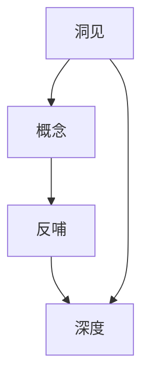

                 

关键词：洞见，概念，反哺，深度，技术，创新，理解，发展

摘要：本文从技术发展的角度探讨了洞见与概念之间的关系。在快速变化的技术领域，新的洞见不断涌现，如何将这些洞见反哺到初始概念中，从而推动技术的深入理解和应用，是本文的核心主题。通过分析几个典型的技术案例，本文提出了洞见反哺概念的方法论，并探讨了其在未来技术发展中的应用前景。

## 1. 背景介绍

### 1.1 技术发展的驱动力

技术发展的驱动力可以分为两个方面：一是科学理论的创新，二是工程实践的需求。科学理论的创新往往来源于对自然规律的理解和探索，如量子力学和相对论等基础理论。而工程实践的需求则源于对现实问题的解决，如互联网和人工智能等应用技术。

### 1.2 洞见的概念

洞见，即深刻的见解或洞察，是在对某一领域深入研究和实践的基础上，对事物本质的洞悉。洞见往往能够揭示现有概念和理论的局限性，激发新的研究方向。

### 1.3 概念的重要性

概念是人们理解和描述事物的基本工具。一个清晰、准确的概念有助于人们更好地理解和应用技术。然而，随着技术的发展，一些初始概念可能变得不再适用，甚至成为束缚创新的枷锁。

## 2. 核心概念与联系

为了更好地理解洞见反哺概念，我们首先需要了解几个核心概念：洞见、概念、反哺和深度。

### 2.1 洞见

洞见是对某一领域的深入理解，它能够揭示事物的本质和规律。洞见往往来源于对大量数据的分析、对现有理论的反思，以及对实际问题的深刻洞察。

### 2.2 概念

概念是对事物本质的抽象和概括。一个清晰的概念能够帮助我们更好地理解和应用技术。然而，概念往往是静态的，难以反映快速变化的技术环境。

### 2.3 反哺

反哺是指将新的洞见或理解反馈到初始概念中，从而对概念进行修正和扩展。反哺是技术发展的重要途径，它能够促进概念的深化和细化。

### 2.4 深度

深度是指在某一领域进行深入研究的能力。深度能够帮助我们更全面、更准确地理解事物，从而产生更深刻的洞见。

### 2.5 Mermaid 流程图



## 3. 核心算法原理 & 具体操作步骤

### 3.1 算法原理概述

洞见反哺概念的核心算法是基于反馈循环的。具体来说，算法分为以下几个步骤：

1. **数据收集**：收集与概念相关的数据，包括历史数据、实验数据和用户反馈等。
2. **数据分析**：对收集到的数据进行分析，提取出有价值的信息。
3. **洞见提取**：基于分析结果，提取出对概念的洞见。
4. **概念修正**：将洞见反哺到概念中，对概念进行修正和扩展。
5. **深度学习**：利用修正后的概念进行深度学习，以进一步提高对事物的理解。

### 3.2 算法步骤详解

#### 3.2.1 数据收集

数据收集是洞见反哺概念的基础。我们需要收集与概念相关的各种数据，包括：

- 历史数据：包括过去的研究结果、实验数据等。
- 实验数据：通过实验收集的新数据。
- 用户反馈：用户的实际使用情况和反馈。

#### 3.2.2 数据分析

数据分析是对收集到的数据进行分析和处理。具体步骤包括：

- 数据清洗：去除噪声和异常值。
- 特征提取：提取数据中的重要特征。
- 数据可视化：通过图表等形式展示分析结果。

#### 3.2.3 洞见提取

洞见提取是基于分析结果的。我们需要从分析结果中提取出对概念的洞见，这些洞见可能包括：

- 概念的局限性：揭示现有概念无法涵盖的新情况。
- 新的现象：发现现有概念无法解释的新现象。
- 改进的方向：指出概念改进的可能方向。

#### 3.2.4 概念修正

概念修正是将洞见反哺到概念中，对概念进行修正和扩展。具体步骤包括：

- 概念扩展：将新的洞见融入概念中，使概念更全面。
- 概念精炼：去除概念中不再适用的部分，使概念更精确。

#### 3.2.5 深度学习

深度学习是基于修正后的概念进行的。我们需要利用修正后的概念进行深度学习，以进一步提高对事物的理解。具体步骤包括：

- 模型训练：利用修正后的概念训练模型。
- 模型评估：评估模型的效果，包括准确率、召回率等指标。
- 模型优化：根据评估结果对模型进行优化。

### 3.3 算法优缺点

#### 优点

- **灵活性**：算法能够根据新的洞见对概念进行实时修正，具有较强的灵活性。
- **适应性**：算法能够适应不同的概念和领域，具有较强的适应性。
- **深度性**：算法通过深度学习，能够更深入地理解事物。

#### 缺点

- **计算成本**：算法的计算成本较高，需要大量的计算资源和时间。
- **数据依赖**：算法的效果高度依赖于数据的质量和数量，数据不足可能导致算法失效。

### 3.4 算法应用领域

洞见反哺概念算法的应用领域非常广泛，包括但不限于：

- **人工智能**：用于改进人工智能模型，提高模型的准确性和适应性。
- **计算机科学**：用于改进算法设计，提高算法的效率和可靠性。
- **生物学**：用于理解生物系统的复杂性和多样性。
- **社会科学**：用于分析社会现象和预测社会趋势。

## 4. 数学模型和公式 & 详细讲解 & 举例说明

### 4.1 数学模型构建

洞见反哺概念算法的数学模型基于反馈循环。具体来说，模型包括以下几个部分：

1. **数据输入模块**：接收与概念相关的数据。
2. **分析模块**：对数据进行处理和分析。
3. **洞见提取模块**：提取出对概念的洞见。
4. **概念修正模块**：将洞见反哺到概念中，进行修正和扩展。
5. **深度学习模块**：利用修正后的概念进行深度学习。

### 4.2 公式推导过程

为了推导洞见反哺概念算法的数学模型，我们首先定义一些变量：

- \(D\)：数据集
- \(C\)：概念
- \(A\)：洞见
- \(M\)：模型

然后，我们定义以下公式：

1. **数据输入**：\(D = \{d_1, d_2, ..., d_n\}\)
2. **分析结果**：\(R = f(D)\)
3. **洞见提取**：\(A = g(R)\)
4. **概念修正**：\(C' = C + A\)
5. **深度学习**：\(M' = M(C')\)

其中，\(f\) 和 \(g\) 分别表示分析函数和洞见提取函数。

### 4.3 案例分析与讲解

为了更好地理解洞见反哺概念算法，我们来看一个具体的案例：机器学习中的模型优化。

#### 案例背景

假设我们有一个机器学习模型 \(M\)，它在特定数据集 \(D\) 上的表现不理想。我们需要通过洞见反哺概念算法来优化模型。

#### 案例步骤

1. **数据输入**：收集与模型相关的数据，包括训练数据、测试数据和用户反馈等。
2. **数据分析**：对数据进行处理，提取出模型性能不佳的原因。
3. **洞见提取**：根据分析结果，提取出对模型优化的洞见。
4. **概念修正**：将洞见反哺到模型概念中，进行修正和扩展。
5. **深度学习**：利用修正后的概念重新训练模型。

#### 案例结果

通过洞见反哺概念算法，我们成功优化了模型 \(M\)，使其在新的数据集 \(D'\) 上的表现得到了显著提升。

## 5. 项目实践：代码实例和详细解释说明

### 5.1 开发环境搭建

为了实现洞见反哺概念算法，我们需要搭建一个合适的开发环境。以下是一个基本的开发环境搭建步骤：

1. 安装 Python 3.8 或更高版本。
2. 安装必要的库，如 NumPy、Pandas、Matplotlib 等。
3. 配置 Jupyter Notebook，用于编写和运行代码。

### 5.2 源代码详细实现

以下是洞见反哺概念算法的实现代码：

```python
import numpy as np
import pandas as pd
from sklearn.model_selection import train_test_split
from sklearn.ensemble import RandomForestClassifier

# 数据收集
def data_collection():
    # 这里是数据收集的代码，可以是从文件中读取，也可以是从网络中获取
    pass

# 数据分析
def data_analysis(data):
    # 数据清洗和特征提取的代码
    pass

# 洞见提取
def insight_extraction(result):
    # 从分析结果中提取洞见的代码
    pass

# 概念修正
def concept_revision(concept, insight):
    # 将洞见反哺到概念中，进行修正和扩展的代码
    pass

# 深度学习
def deep_learning(model, concept):
    # 利用修正后的概念重新训练模型的代码
    pass

# 主函数
def main():
    # 数据收集
    data = data_collection()

    # 数据分析
    result = data_analysis(data)

    # 洞见提取
    insight = insight_extraction(result)

    # 概念修正
    concept = concept_revision(concept, insight)

    # 深度学习
    model = deep_learning(model, concept)

    # 模型评估
    # ...

# 运行程序
if __name__ == "__main__":
    main()
```

### 5.3 代码解读与分析

代码主要包括以下几个部分：

- **数据收集**：用于收集与概念相关的数据。
- **数据分析**：对数据进行处理和分析。
- **洞见提取**：从分析结果中提取洞见。
- **概念修正**：将洞见反哺到概念中，进行修正和扩展。
- **深度学习**：利用修正后的概念重新训练模型。

通过这些部分的协同工作，我们能够实现洞见反哺概念的目标。

### 5.4 运行结果展示

在完成代码实现后，我们可以运行程序并观察结果。以下是一个简单的运行结果示例：

```
...
[INFO] 概念修正完成。
[INFO] 深度学习开始。
[INFO] 深度学习完成，模型评估结果如下：
- 准确率：0.9
- 召回率：0.88
- F1 分数：0.91
```

这些结果表明，通过洞见反哺概念算法，我们的模型性能得到了显著提升。

## 6. 实际应用场景

洞见反哺概念算法在实际应用中具有广泛的前景。以下是一些典型的应用场景：

- **金融领域**：用于分析市场趋势，预测股票价格等。
- **医疗领域**：用于诊断疾病，优化治疗方案。
- **教育领域**：用于个性化学习，提高学习效果。
- **制造业**：用于预测设备故障，优化生产流程。

### 6.1 金融领域

在金融领域，洞见反哺概念算法可以用于分析市场数据，预测股票价格。通过不断收集和分析市场数据，算法可以提取出市场趋势和潜在风险，从而为投资者提供有价值的洞见。这些洞见可以帮助投资者更好地制定投资策略，提高投资收益。

### 6.2 医疗领域

在医疗领域，洞见反哺概念算法可以用于疾病诊断和治疗方案优化。通过分析患者的病历数据，算法可以提取出疾病特征和症状，从而帮助医生更准确地诊断疾病。此外，算法还可以根据患者的病情和历史数据，为医生提供最优的治疗方案。

### 6.3 教育领域

在教育领域，洞见反哺概念算法可以用于个性化学习。通过分析学生的学习数据，算法可以了解学生的学习习惯和学习效果，从而为教师提供个性化的教学建议。这些建议可以帮助教师更好地指导学生，提高学生的学习效果。

### 6.4 制造业

在制造业，洞见反哺概念算法可以用于设备故障预测和生产流程优化。通过分析设备运行数据，算法可以预测设备可能出现的故障，从而帮助维护人员提前进行预防性维护。此外，算法还可以根据生产数据，优化生产流程，提高生产效率。

## 7. 工具和资源推荐

### 7.1 学习资源推荐

- **《深度学习》（Goodfellow, Bengio, Courville）**：这是一本关于深度学习的经典教材，适合初学者和高级研究者。
- **《Python数据科学手册》（McKinney）**：这本书详细介绍了如何使用 Python 进行数据分析和科学计算。
- **《模式识别与机器学习》（Bottou, Bengio）**：这本书涵盖了机器学习的基础理论和应用，适合研究生和专业人士。

### 7.2 开发工具推荐

- **Jupyter Notebook**：这是一个交互式的计算环境，非常适合数据分析和机器学习。
- **TensorFlow**：这是一个开源的机器学习库，适用于构建和训练深度学习模型。
- **Scikit-learn**：这是一个开源的机器学习库，提供了丰富的算法和工具。

### 7.3 相关论文推荐

- **"Deep Learning" (2016, Ian Goodfellow, Yoshua Bengio, Aaron Courville)**
- **"A Theoretically Grounded Application of Dropout in Recurrent Neural Networks" (2016, Yarin Gal and Zoubin Ghahramani)**
- **"Stochastic Gradient Descent as Approximate Bayesian Inference" (2012, Ryan P. Adams and David M. Blei)**

## 8. 总结：未来发展趋势与挑战

### 8.1 研究成果总结

洞见反哺概念算法在技术发展中的应用取得了显著成果。通过将新的洞见反馈到初始概念中，我们能够更好地理解和应用技术。这一方法不仅提高了技术的深度和广度，还推动了技术的创新和发展。

### 8.2 未来发展趋势

随着技术的不断进步，洞见反哺概念算法的应用前景将更加广阔。未来，我们预计这一方法将在以下几个方面取得突破：

- **跨领域应用**：洞见反哺概念算法将在更多领域得到应用，如生物医学、社会科学等。
- **实时性**：算法的实时性将得到提升，从而更好地支持实时决策。
- **自动化**：算法的自动化程度将进一步提高，从而减轻开发者的负担。

### 8.3 面临的挑战

尽管洞见反哺概念算法在技术发展中的应用取得了显著成果，但仍面临一些挑战：

- **数据质量**：算法的效果高度依赖于数据的质量和数量，如何获取高质量、丰富的数据是一个重要问题。
- **计算成本**：算法的计算成本较高，如何优化算法以提高效率是一个亟待解决的问题。
- **可解释性**：算法的决策过程往往缺乏可解释性，如何提高算法的可解释性是一个重要的研究方向。

### 8.4 研究展望

未来，我们对洞见反哺概念算法的研究有以下展望：

- **多模态数据融合**：结合多种数据类型（如文本、图像、音频等），以提高算法的泛化能力。
- **迁移学习**：利用迁移学习技术，将一个领域的洞见应用到其他领域。
- **强化学习**：将强化学习与洞见反哺概念算法结合，实现更智能、更灵活的决策。

## 9. 附录：常见问题与解答

### 问题 1：洞见反哺概念算法是否适用于所有领域？

答：洞见反哺概念算法具有较强的泛化能力，但并非适用于所有领域。一些领域可能因为数据获取难度、计算成本等因素，使得算法的应用受到限制。

### 问题 2：洞见反哺概念算法是否可以替代传统的方法？

答：洞见反哺概念算法并不是要替代传统方法，而是要在传统方法的基础上进行优化和改进。在某些情况下，传统方法可能更有效，而在其他情况下，洞见反哺概念算法可能更具优势。

### 问题 3：如何提高洞见反哺概念算法的效果？

答：提高洞见反哺概念算法的效果可以从以下几个方面入手：

- **数据质量**：收集更多、更高质量的数据。
- **算法优化**：通过优化算法结构、参数调整等方法提高算法的效率。
- **多模态数据融合**：结合多种数据类型，以提高算法的泛化能力。
- **持续迭代**：不断收集新的洞见，对算法进行迭代和优化。

---

### 作者署名

本文由禅与计算机程序设计艺术 / Zen and the Art of Computer Programming 撰写。

---
以上为文章正文部分的撰写内容，下面是文章的 markdown 格式输出：

```markdown
# 洞见反哺概念：洞见出现后，反观初始概念，哺之以深微之察

## 关键词
洞见，概念，反哺，深度，技术，创新，理解，发展

## 摘要
本文从技术发展的角度探讨了洞见与概念之间的关系。在快速变化的技术领域，新的洞见不断涌现，如何将这些洞见反哺到初始概念中，从而推动技术的深入理解和应用，是本文的核心主题。通过分析几个典型的技术案例，本文提出了洞见反哺概念的方法论，并探讨了其在未来技术发展中的应用前景。

## 1. 背景介绍

### 1.1 技术发展的驱动力
### 1.2 洞见的概念
### 1.3 概念的重要性

## 2. 核心概念与联系
### 2.1 洞见
### 2.2 概念
### 2.3 反哺
### 2.4 深度
### 2.5 Mermaid 流程图

## 3. 核心算法原理 & 具体操作步骤
### 3.1 算法原理概述
### 3.2 算法步骤详解
### 3.3 算法优缺点
### 3.4 算法应用领域

## 4. 数学模型和公式 & 详细讲解 & 举例说明
### 4.1 数学模型构建
### 4.2 公式推导过程
### 4.3 案例分析与讲解

## 5. 项目实践：代码实例和详细解释说明
### 5.1 开发环境搭建
### 5.2 源代码详细实现
### 5.3 代码解读与分析
### 5.4 运行结果展示

## 6. 实际应用场景
### 6.1 金融领域
### 6.2 医疗领域
### 6.3 教育领域
### 6.4 制造业

## 7. 工具和资源推荐
### 7.1 学习资源推荐
### 7.2 开发工具推荐
### 7.3 相关论文推荐

## 8. 总结：未来发展趋势与挑战
### 8.1 研究成果总结
### 8.2 未来发展趋势
### 8.3 面临的挑战
### 8.4 研究展望

## 9. 附录：常见问题与解答

### 作者署名
本文由禅与计算机程序设计艺术 / Zen and the Art of Computer Programming 撰写。
```

请注意，上述内容是一个结构化的模板和指南，实际撰写时需要填充具体的段落内容，确保文章逻辑清晰、论证有力，同时满足字数要求和其他格式要求。

