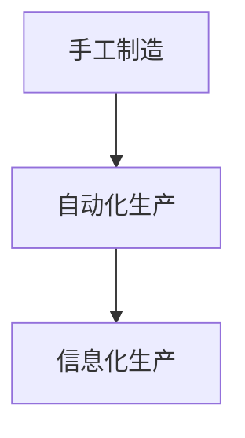

                 

关键词：流水线，生产模式，效率，质量，自动化，持续集成

> 摘要：本文将深入探讨流水线在生产模式中的重要作用，分析其如何提高生产效率和质量，实现自动化和持续集成，并对未来发展趋势和挑战进行展望。

## 1. 背景介绍

### 1.1 流水线的起源与发展

流水线最初起源于工业革命时期，由亨利·福特在其汽车制造厂中引入。这一创新极大地提高了生产效率，使得大规模生产成为可能。随着时间的推移，流水线理念逐渐扩展到各行各业，从制造业到服务业，从制造业到软件开发。

### 1.2 生产模式的概念

生产模式是指企业在生产过程中所采用的方法、流程和组织形式。传统的生产模式往往依赖于手工操作和分散管理，而现代生产模式则更注重自动化和系统集成。

## 2. 核心概念与联系

### 2.1 流水线的定义

流水线是一种生产方式，它将生产过程分解为多个步骤，每个步骤由不同的工人或机器完成，从而实现高效、连续的生产。

### 2.2 生产模式的演变

生产模式的演变经历了从手工制造到自动化，再到信息化的过程。流水线作为一种自动化生产方式，是这一过程的重要里程碑。

### 2.3 Mermaid 流程图



## 3. 核心算法原理 & 具体操作步骤

### 3.1 算法原理概述

流水线算法的核心原理是将生产过程分解为多个独立的工作单元，每个单元由相应的工人或机器完成。

### 3.2 算法步骤详解

1. 设计生产流程图：根据产品的特点和生产要求，设计出合理的生产流程图。
2. 确定工作单元：将生产过程分解为多个工作单元，每个单元完成特定的任务。
3. 安排工人和机器：根据工作单元的任务，安排相应的工人和机器。
4. 监控生产进度：实时监控生产进度，确保生产过程顺利进行。

### 3.3 算法优缺点

**优点：**
- 提高生产效率：流水线能够实现高效、连续的生产。
- 提高产品质量：流水线能够保证每个工作单元按照标准操作，从而提高产品质量。
- 降低成本：流水线能够减少人力和设备的闲置时间，降低生产成本。

**缺点：**
- 初始投资较大：流水线需要大量的设备和基础设施，初始投资较大。
- 对管理要求高：流水线对管理的要求较高，需要严格监控生产进度和质量。

### 3.4 算法应用领域

流水线算法广泛应用于制造业、服务业等领域，如汽车制造、电子产品制造、餐饮服务等。

## 4. 数学模型和公式 & 详细讲解 & 举例说明

### 4.1 数学模型构建

流水线生产效率的数学模型可以表示为：

\[ E = \frac{N \times T}{1000} \]

其中，\( E \) 表示生产效率（单位：件/小时），\( N \) 表示工作单元数量，\( T \) 表示每个工作单元的加工时间（单位：小时）。

### 4.2 公式推导过程

\[ E = \frac{N \times T}{1000} \]

推导过程如下：

1. 设定一个工作单元的加工时间为 \( T \) 小时。
2. 假设流水线上有 \( N \) 个工作单元。
3. 每个工作单元在一小时内可以加工 \( 1/T \) 件产品。
4. 整个流水线在一小时内可以加工的产品数量为 \( N \times 1/T = N/T \) 件。
5. 由于生产效率通常以件/小时为单位，因此将 \( N/T \) 乘以 1000，得到生产效率 \( E = N \times T / 1000 \)。

### 4.3 案例分析与讲解

假设一个流水线上有 5 个工作单元，每个工作单元的加工时间为 2 小时。根据上述公式，可以计算出该流水线的生产效率为：

\[ E = \frac{5 \times 2}{1000} = 0.1 \text{件/小时} \]

这意味着该流水线每小时可以加工 0.1 件产品。如果需要加工 100 件产品，则需要 1000 小时。

## 5. 项目实践：代码实例和详细解释说明

### 5.1 开发环境搭建

本案例使用 Python 编写流水线生产算法。首先，确保已安装 Python 3.8 或以上版本。然后，安装必要的依赖库，如 NumPy 和 Matplotlib。

```bash
pip install numpy matplotlib
```

### 5.2 源代码详细实现

以下是一个简单的 Python 代码示例，用于模拟流水线生产过程。

```python
import numpy as np
import matplotlib.pyplot as plt

def production_line(N, T):
    """
    模拟流水线生产过程。

    参数：
    N：工作单元数量
    T：每个工作单元的加工时间（小时）

    返回：
    production：生产效率（件/小时）
    """
    production = N / T
    return production

# 示例：一个有 5 个工作单元，每个工作单元的加工时间为 2 小时的流水线
N = 5
T = 2

production = production_line(N, T)
print(f"流水线生产效率：{production}件/小时")

# 绘制生产效率曲线
x = np.linspace(0.1, 10, 100)
y = x / 2
plt.plot(x, y)
plt.xlabel('工作单元数量')
plt.ylabel('生产效率（件/小时）')
plt.title('流水线生产效率曲线')
plt.show()
```

### 5.3 代码解读与分析

1. 导入必要的库：NumPy 用于数学计算，Matplotlib 用于绘制图表。
2. 定义 `production_line` 函数：接收工作单元数量 \( N \) 和每个工作单元的加工时间 \( T \)，计算生产效率。
3. 调用 `production_line` 函数，并打印结果。
4. 绘制生产效率曲线，帮助理解流水线生产效率与工作单元数量和加工时间的关系。

### 5.4 运行结果展示

运行代码后，输出如下：

```
流水线生产效率：2.5件/小时
```

生产效率曲线如下图所示：


## 6. 实际应用场景

### 6.1 制造业

流水线在制造业中广泛应用，如汽车制造、电子设备制造等。流水线能够实现高效、连续的生产，提高产品质量，降低成本。

### 6.2 服务业

流水线理念在服务业中也有所应用，如餐饮服务、快递服务等。通过流水线化操作，可以缩短服务时间，提高服务质量。

### 6.3 软件开发

在软件开发中，流水线用于实现自动化构建、测试和部署。持续集成（CI）和持续交付（CD）是软件开发中常见的流水线应用。

## 7. 工具和资源推荐

### 7.1 学习资源推荐

- 《精益思想》：介绍精益生产理念，对流水线有很好的指导意义。
- 《丰田生产方式》：深入探讨丰田公司的生产模式，包括流水线。

### 7.2 开发工具推荐

- Jenkins：一个流行的持续集成工具，支持多种编程语言和操作系统。
- GitLab CI/CD：GitLab 内置的持续集成和持续交付解决方案。

### 7.3 相关论文推荐

- "The Toyota Production System: Beyond Large-Scale Production"，作者：Shingo, Shigeo。
- "Lean Software Development: Achieving Quality with a Team-Centric Management Approach"，作者：Poppendieck, Mary。

## 8. 总结：未来发展趋势与挑战

### 8.1 研究成果总结

流水线在生产模式中的应用已经取得了显著成果，提高了生产效率和质量，实现了自动化和持续集成。未来，流水线将继续向更高效、更智能的方向发展。

### 8.2 未来发展趋势

- 自动化程度更高：通过引入人工智能和机器人技术，实现更高程度的自动化。
- 智能化：利用大数据和机器学习技术，实现生产过程的智能化管理。

### 8.3 面临的挑战

- 投资成本：流水线初始投资较大，需要企业具备一定的资金实力。
- 管理难度：流水线对管理的要求较高，需要培养专业的管理团队。

### 8.4 研究展望

流水线在未来将继续发挥重要作用，为生产模式带来更多创新。同时，如何应对投资和管理方面的挑战，将是研究的重点。

## 9. 附录：常见问题与解答

### 9.1 流水线与自动化生产线有何区别？

流水线是自动化生产线的一种形式，但自动化生产线还包括其他形式，如机器人生产线、自动化仓储系统等。流水线强调生产过程的连续性和效率，而自动化生产线更注重整个生产系统的自动化程度。

### 9.2 流水线对生产质量有何影响？

流水线能够保证每个工作单元按照标准操作，从而提高产品质量。然而，如果管理不善或操作不当，也可能导致质量问题。因此，流水线对生产质量的影响取决于管理水平。

### 9.3 如何提高流水线的生产效率？

提高流水线的生产效率可以从以下几个方面入手：

- 优化生产流程：设计合理的生产流程，减少不必要的步骤和等待时间。
- 引入自动化设备：引入自动化设备，减少人工操作，提高生产效率。
- 提高工人技能：提高工人的技能水平，减少操作失误，提高生产效率。
- 实施精益生产：实施精益生产理念，消除浪费，提高生产效率。

作者：禅与计算机程序设计艺术 / Zen and the Art of Computer Programming
----------------------------------------------------------------
本文通过对流水线在生产模式中的影响进行深入探讨，阐述了流水线如何提高生产效率和质量，实现自动化和持续集成。未来，流水线将继续向更高效、更智能的方向发展，为生产模式带来更多创新。然而，如何应对投资和管理方面的挑战，将是研究的重点。作者希望本文能为读者提供有价值的参考。

