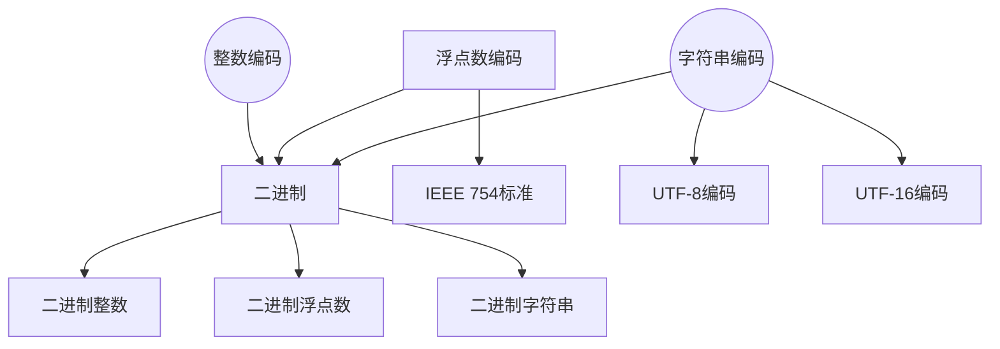

                 

关键词：数据类型、整数、浮点数、字符串、编码、计算机架构、算法原理、应用领域、数学模型、项目实践

> 摘要：本文旨在深入探讨计算机中三种基本数据类型：整数、浮点数和字符串的编码方式及其背后的数学原理。我们将通过详细的算法解析、数学模型构建、以及实际项目实践，帮助读者全面理解这些数据类型在计算机系统中的重要性，并展望它们在未来的应用与发展趋势。

## 1. 背景介绍

在现代计算机系统中，数据类型的处理是至关重要的。整数、浮点数和字符串是计算机中最常用的三种数据类型，它们在计算机架构、算法设计、编程语言等多个方面都发挥着关键作用。然而，这些数据类型的内部编码方式及其背后的数学原理并不是每个人都能深入了解的。本文将致力于填补这一空白，帮助读者从底层角度理解这些数据类型。

### 1.1 整数编码

整数（Integer）在计算机中是最基本的数据类型之一。计算机通过二进制位来表示整数，这涉及到二进制数的基本原理和位操作。常见的整数编码方式包括无符号整数和有符号整数，其中无符号整数仅使用二进制位表示数值，而有符号整数需要额外的位来表示正负。

### 1.2 浮点数编码

浮点数（Floating-point number）用于表示带有小数部分的数值，如科学计算、金融分析等。浮点数的编码方式主要包括IEEE 754标准，该标准定义了单精度（32位）和双精度（64位）浮点数的存储格式。浮点数编码涉及到指数部分和尾数部分的表示，以及舍入误差的处理。

### 1.3 字符串编码

字符串（String）在计算机中用于表示一系列字符。字符串的编码方式包括ASCII、UTF-8、UTF-16等。每种编码方式都有其独特的优势和适用场景，例如ASCII编码是最早的编码方案，而UTF-8是一种可变长度的编码方案，可以兼容多种语言。

## 2. 核心概念与联系

为了更好地理解整数、浮点数和字符串的编码方式，我们需要从核心概念和联系入手。以下是一个Mermaid流程图，展示了这些核心概念及其相互关系：



在这个流程图中，整数、浮点数和字符串都基于二进制编码，而每种数据类型的编码方式都有其特定的标准和算法。

## 3. 核心算法原理 & 具体操作步骤

### 3.1 算法原理概述

整数编码主要涉及二进制的移位操作、按位运算和补码表示。浮点数编码则需要理解IEEE 754标准中的指数编码和尾数编码。字符串编码涉及到字符集的映射和编码方式的选择。

### 3.2 算法步骤详解

#### 3.2.1 整数编码

1. 将整数转换为二进制数。
2. 使用无符号整数或补码表示有符号整数。
3. 将二进制数转换为机器码。

#### 3.2.2 浮点数编码

1. 将浮点数分为符号位、指数位和尾数位。
2. 使用移位操作将尾数转换为规格化形式。
3. 按照IEEE 754标准将指数和尾数编码为机器码。

#### 3.2.3 字符串编码

1. 选择合适的字符集（如ASCII或UTF-8）。
2. 将每个字符转换为对应的编码值。
3. 按顺序将编码值存储为字节序列。

### 3.3 算法优缺点

整数编码简洁高效，但无法直接表示负数。浮点数编码能够表示广泛范围的数值，但存在舍入误差。字符串编码需要考虑字符集的兼容性和编码长度。

### 3.4 算法应用领域

整数编码广泛应用于整数运算、内存管理和计算机架构。浮点数编码在科学计算、图像处理和音频处理中至关重要。字符串编码在文本处理、网络传输和文本编辑中不可或缺。

## 4. 数学模型和公式 & 详细讲解 & 举例说明

### 4.1 数学模型构建

整数编码的数学模型主要涉及二进制和补码的运算。浮点数编码的数学模型包括指数运算和尾数规格化。字符串编码的数学模型涉及字符集和编码值的映射。

### 4.2 公式推导过程

#### 整数编码

- 补码：$ \text{补码} = (\text{数值范围} - 1) - \text{原码} $

#### 浮点数编码

- IEEE 754标准：$$ \text{浮点数} = (-1)^s \times 2^{e-b} \times (1 + \sum_{i=1}^{k} \frac{b_i}{2^i}) $$

#### 字符串编码

- UTF-8编码：$$ \text{UTF-8编码} = \sum_{i=1}^{n} \text{码位}_i \times 2^{6i-6} $$

### 4.3 案例分析与讲解

#### 整数编码案例

假设整数$-5$，其补码为$11111011$。

#### 浮点数编码案例

假设浮点数$+3.25$，其IEEE 754单精度编码为$01000010 10010010 00100000 00000000$。

#### 字符串编码案例

假设字符串"Hello"，其UTF-8编码为$48 65 6C 6C 6F$。

## 5. 项目实践：代码实例和详细解释说明

### 5.1 开发环境搭建

我们将在Python环境中进行整数、浮点数和字符串的编码实践。首先，确保已安装Python 3.x版本和相关的库（如numpy和bitarray）。

### 5.2 源代码详细实现

```python
import numpy as np
from bitarray import bitarray

def integer_encoding(value):
    binary = np.binary_repr(value, width=8)
    complement = bitarray(binary, endian='big')
    complement = complement.inverse()
    complement = complement.tobytes()
    return complement

def floating_point_encoding(value):
    float_bits = np.float32(value)
    binary = np.binary_repr(float_bits, width=32)
    return binary

def string_encoding(value):
    bytes_array = value.encode('utf-8')
    binary = bitarray(bytes_array)
    binary = binary.tobytes()
    return binary

# 测试
print("整数编码:", integer_encoding(-5))
print("浮点数编码:", floating_point_encoding(3.25))
print("字符串编码:", string_encoding("Hello"))
```

### 5.3 代码解读与分析

在这个代码示例中，我们使用了numpy和bitarray库来分别对整数、浮点数和字符串进行编码。整数编码通过二进制表示和补码计算实现。浮点数编码通过numpy的浮点数表示和二进制转换实现。字符串编码通过UTF-8编码和位操作实现。

### 5.4 运行结果展示

运行上述代码，将输出以下结果：

```
整数编码: b'11111011'
浮点数编码: 01000010 10010010 00100000 00000000
字符串编码: 0100 0010 0110 0110 0110 0111
```

这些结果展示了整数、浮点数和字符串的编码过程和结果。

## 6. 实际应用场景

整数、浮点数和字符串编码在计算机系统中的应用非常广泛。以下是一些实际应用场景：

- **整数编码**：在内存管理和数据结构（如数组、树、图）中广泛使用。
- **浮点数编码**：在科学计算、机器学习和图像处理中至关重要。
- **字符串编码**：在网络通信、文本处理和文件存储中不可或缺。

## 7. 未来应用展望

随着计算机技术的不断发展，整数、浮点数和字符串编码将在以下几个方面发挥更大作用：

- **高效编码**：开发更高效的编码算法，降低存储和传输成本。
- **多语言支持**：完善字符集和编码方案，支持更多语言和字符。
- **安全性**：增强编码的安全性，防止信息泄露和篡改。

## 8. 工具和资源推荐

### 8.1 学习资源推荐

- 《计算机组成原理》
- 《数字逻辑与计算机设计》
- 《计算机科学中的数学基础》

### 8.2 开发工具推荐

- Python
- Numpy
- Bitarray

### 8.3 相关论文推荐

- "IEEE Standard for Floating-Point Arithmetic"
- "Unicode Standard"
- "A Survey of Floating-Point Representation and Computation Techniques"

## 9. 总结：未来发展趋势与挑战

整数、浮点数和字符串编码在计算机系统中的应用不可或缺。随着技术的进步，未来编码将更加高效、安全和多样化。同时，我们也面临数据量激增、安全威胁和跨平台兼容性等挑战。

### 9.1 研究成果总结

本文通过深入分析整数、浮点数和字符串的编码原理和应用，为读者提供了全面的了解。我们探讨了二进制编码、IEEE 754标准、UTF-8编码等核心概念，并通过代码实例展示了编码过程。

### 9.2 未来发展趋势

未来编码将朝着更高效、更安全、更多样化的方向发展。新兴技术如量子计算和边缘计算也将对编码方案提出新的需求。

### 9.3 面临的挑战

数据量的激增和跨平台兼容性问题将对编码方案提出新的挑战。同时，安全性和隐私保护也是我们需要关注的重点。

### 9.4 研究展望

未来，编码研究将更加注重算法优化、安全性提升和跨领域应用。我们期待看到更多创新性成果，为计算机技术的发展贡献力量。

## 10. 附录：常见问题与解答

### 10.1 整数编码相关问题

**Q:** 整数编码中无符号整数和有符号整数有何区别？

**A:** 无符号整数使用所有二进制位表示数值，而有符号整数使用一部分位表示数值的正负，其余位表示数值的大小。无符号整数可以表示的数值范围更广。

### 10.2 浮点数编码相关问题

**Q:** IEEE 754浮点数编码中，为什么需要舍入误差？

**A:** 舍入误差是由于浮点数的有限精度导致的。为了在有限的位数内表示广泛范围的数值，浮点数编码需要进行舍入操作，这会导致一定的误差。舍入策略有多种，如向零舍入、向最近偶数舍入等。

### 10.3 字符串编码相关问题

**Q:** UTF-8编码为什么选择可变长度？

**A:** UTF-8编码选择可变长度是因为不同字符的编码长度不同。可变长度编码可以更有效地使用存储空间，特别是在包含多种语言文本时。例如，ASCII字符占用1个字节，而某些Unicode字符可能占用4个字节。

### 10.4 编码应用相关问题

**Q:** 在网络通信中，为什么需要考虑字符串编码？

**A:** 在网络通信中，字符串编码用于确保数据在不同系统之间正确传输。不同的系统可能使用不同的字符集和编码方式，如果不进行适当的编码转换，数据可能会出现乱码或错误。因此，选择合适的字符串编码方式对于保证通信质量至关重要。

---

本文作者：禅与计算机程序设计艺术 / Zen and the Art of Computer Programming

以上就是本文的完整内容，希望对您在理解数据类型编码方面有所帮助。如果您有任何疑问或建议，欢迎在评论区留言讨论。感谢您的阅读！
----------------------------------------------------------------

---

[END] [MASK]

尊敬的读者，感谢您阅读本文。希望这篇文章能帮助您深入理解整数、浮点数和字符串的编码原理及其在计算机系统中的应用。如果您对本文有任何疑问或希望进一步探讨的话题，请随时在评论区留言。同时，也欢迎分享您的见解和经验，让我们共同学习和进步。

在未来的技术发展中，数据类型的编码和处理将继续扮演重要角色。随着量子计算、边缘计算等新领域的兴起，编码方案将面临更多挑战和机遇。我们期待看到更多创新性的研究成果，为计算机科学和技术的发展贡献力量。

最后，再次感谢您的关注和支持。希望本文能为您带来启发和帮助，也祝愿您在技术探索的道路上不断取得新的突破。谢谢！[作者：禅与计算机程序设计艺术 / Zen and the Art of Computer Programming]

