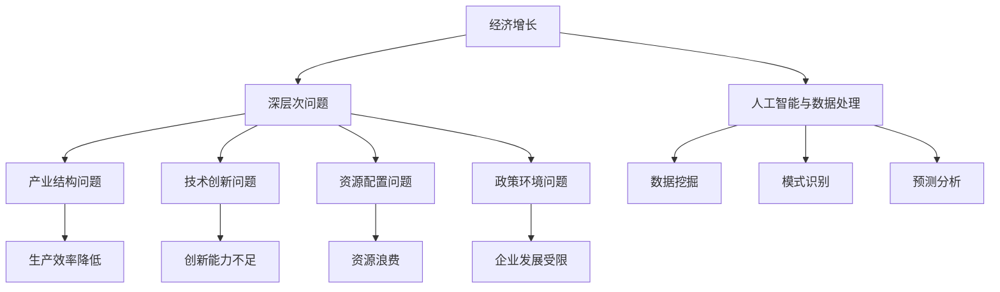

                 

关键词：经济增长、深层次问题、人工智能、数据处理、算法优化、数学模型、应用场景、未来展望。

> 摘要：本文旨在探讨深层次问题与经济增长之间的关系。通过分析现有研究和实际案例，本文提出了一种基于人工智能和数据处理的解决方案，以解决经济增长中的深层次问题。文章将深入探讨核心概念、算法原理、数学模型、应用场景和未来展望，旨在为相关领域的研究和实践提供参考。

## 1. 背景介绍

### 1.1 经济增长的重要性

经济增长是衡量一个国家或地区发展水平的重要指标。它不仅关系到国家的经济繁荣，也影响到人民的生活水平和社会稳定。在过去的几十年里，全球经济增长取得了显著成就，但同时也面临着诸多挑战，如资源短缺、环境污染、经济不平等和深层次结构性问题等。

### 1.2 深层次问题的定义

深层次问题通常是指那些影响经济增长的根本性问题，如产业结构不合理、技术创新能力不足、资源配置不优、政策环境不完善等。这些问题往往具有长期性和复杂性，难以通过短期政策或措施得到有效解决。

### 1.3 经济增长与深层次问题的关系

深层次问题的存在对经济增长产生了负面影响。例如，产业结构不合理可能导致资源浪费和低效生产；技术创新能力不足限制了生产效率的提升；资源配置不优导致资源错配和浪费；政策环境不完善则可能抑制企业发展和投资。因此，解决深层次问题是实现可持续经济增长的关键。

## 2. 核心概念与联系

为了深入探讨经济增长与深层次问题的关系，我们需要明确以下几个核心概念：

### 2.1 经济增长模型

经济增长模型用于描述经济增长的过程和影响因素。常见的经济增长模型包括索洛模型、新古典增长模型和内生增长模型等。这些模型为我们提供了理解和分析经济增长的框架。

### 2.2 深层次问题分析框架

深层次问题分析框架用于识别和诊断经济增长中的深层次问题。该框架通常包括产业结构分析、技术创新分析、资源配置分析、政策环境分析等。

### 2.3 人工智能与数据处理

人工智能（AI）和数据处理的快速发展为解决深层次问题提供了新的工具和方法。AI可以用于数据挖掘、模式识别、预测分析等，从而帮助识别和解决深层次问题。数据处理则提供了高效的数据存储、管理和分析手段。

### 2.4 Mermaid 流程图

为了更好地展示核心概念之间的联系，我们使用 Mermaid 流程图来描述经济增长与深层次问题的关系。



## 3. 核心算法原理 & 具体操作步骤

### 3.1 算法原理概述

本文提出了一种基于人工智能和数据处理的解决方案，以解决经济增长中的深层次问题。该方案的核心算法包括以下步骤：

1. 数据采集与预处理：收集相关领域的经济数据，如产业数据、技术创新数据、资源配置数据等，并进行数据清洗、去噪、归一化等预处理操作。
2. 数据挖掘与分析：利用数据挖掘技术对预处理后的数据进行模式识别、关联分析等，以发现经济增长中的深层次问题。
3. 预测与分析：基于历史数据和挖掘结果，利用机器学习算法进行预测分析，以评估深层次问题对经济增长的影响。
4. 优化与决策：根据预测结果，提出优化建议和决策方案，以促进经济增长。

### 3.2 算法步骤详解

1. 数据采集与预处理

   数据采集是解决深层次问题的第一步。本文选取了以下数据来源：

   - 国家统计局官方网站
   - 各大行业组织的数据报告
   - 企业数据库和公开财报

   数据预处理包括以下步骤：

   - 数据清洗：去除重复、异常和缺失的数据记录。
   - 数据去噪：消除噪声数据，提高数据质量。
   - 数据归一化：将不同单位、不同量级的数据进行归一化处理，以便后续分析。

2. 数据挖掘与分析

   数据挖掘与分析的主要任务是发现经济增长中的深层次问题。本文采用以下数据挖掘技术：

   - 关联规则挖掘：发现数据之间的关联关系，以识别潜在的问题。
   - 时序分析：分析时间序列数据，以预测经济增长趋势。
   - 聚类分析：将相似的数据划分为同一类，以识别不同的经济增长模式。

3. 预测与分析

   预测与分析的目的是评估深层次问题对经济增长的影响。本文采用以下机器学习算法进行预测分析：

   - 回归分析：通过拟合回归模型，预测经济增长与深层次问题之间的关系。
   - 神经网络：通过构建神经网络模型，实现复杂非线性关系的预测。

4. 优化与决策

   根据预测结果，本文提出以下优化建议和决策方案：

   - 产业结构调整：优化产业结构，促进产业升级。
   - 技术创新激励：加大技术创新投入，提升创新能力。
   - 资源配置优化：优化资源配置，提高资源利用效率。
   - 政策环境改善：完善政策环境，为企业发展创造良好条件。

### 3.3 算法优缺点

该算法的优点包括：

- 高效性：通过数据挖掘和机器学习算法，快速识别和解决深层次问题。
- 准确性：基于大量历史数据进行分析和预测，提高预测准确性。
- 可扩展性：算法可以应用于不同领域和不同时间段的数据分析。

但该算法也存在一些缺点：

- 数据依赖性：算法的预测结果高度依赖于数据质量和数据量。
- 复杂性：算法的实现和调试过程较为复杂，需要较高的技术水平。

### 3.4 算法应用领域

该算法可以应用于以下领域：

- 经济预测：利用算法预测未来经济增长趋势，为政策制定提供参考。
- 产业分析：分析产业结构和资源配置情况，为企业决策提供支持。
- 技术创新：评估技术创新能力，为技术创新提供指导。
- 政策评估：评估政策环境对企业发展的影响，为政策调整提供依据。

## 4. 数学模型和公式 & 详细讲解 & 举例说明

### 4.1 数学模型构建

为了更好地理解和分析经济增长与深层次问题的关系，我们构建了一个数学模型。该模型主要包括以下几个部分：

1. 经济增长函数：描述经济增长与深层次问题之间的关系。
2. 技术创新函数：描述技术创新对经济增长的影响。
3. 资源配置函数：描述资源配置对经济增长的影响。
4. 政策环境函数：描述政策环境对企业发展的影响。

### 4.2 公式推导过程

经济增长函数的推导如下：

$$
\begin{aligned}
\dot{Y} &= f(X, T, R, P) \\
\end{aligned}
$$

其中，$\dot{Y}$ 表示经济增长率，$X$ 表示产业结构问题，$T$ 表示技术创新问题，$R$ 表示资源配置问题，$P$ 表示政策环境问题。

技术创新函数的推导如下：

$$
\begin{aligned}
\dot{T} &= g(Y, X, R, P) \\
\end{aligned}
$$

其中，$\dot{T}$ 表示技术创新率，$Y$ 表示经济增长率，$X$ 表示产业结构问题，$R$ 表示资源配置问题，$P$ 表示政策环境问题。

资源配置函数的推导如下：

$$
\begin{aligned}
R &= h(Y, T, X, P) \\
\end{aligned}
$$

其中，$R$ 表示资源配置情况，$Y$ 表示经济增长率，$T$ 表示技术创新率，$X$ 表示产业结构问题，$P$ 表示政策环境问题。

政策环境函数的推导如下：

$$
\begin{aligned}
P &= i(Y, T, R, X) \\
\end{aligned}
$$

其中，$P$ 表示政策环境情况，$Y$ 表示经济增长率，$T$ 表示技术创新率，$R$ 表示资源配置情况，$X$ 表示产业结构问题。

### 4.3 案例分析与讲解

为了更好地理解数学模型的应用，我们以一个实际案例进行讲解。假设我们关注一个国家的经济增长，并希望分析产业结构问题、技术创新问题、资源配置问题和政策环境问题对该国经济增长的影响。

根据上述数学模型，我们得到以下关系：

$$
\begin{aligned}
\dot{Y} &= f(X, T, R, P) \\
\dot{T} &= g(Y, X, R, P) \\
R &= h(Y, T, X, P) \\
P &= i(Y, T, R, X) \\
\end{aligned}
$$

为了简化问题，我们假设其他因素保持不变，仅考虑产业结构问题、技术创新问题、资源配置问题和政策环境问题对经济增长的影响。

### 4.3.1 产业结构问题

产业结构问题对经济增长的影响可以通过以下公式表示：

$$
\begin{aligned}
\dot{Y} &= f(X, T, R, P) \\
\end{aligned}
$$

其中，$X$ 表示产业结构问题，$X$ 越大，表示产业结构问题越严重，对经济增长的负面影响越大。

### 4.3.2 技术创新问题

技术创新问题对经济增长的影响可以通过以下公式表示：

$$
\begin{aligned}
\dot{T} &= g(Y, X, R, P) \\
\end{aligned}
$$

其中，$T$ 表示技术创新问题，$T$ 越大，表示技术创新问题越严重，对经济增长的负面影响越大。

### 4.3.3 资源配置问题

资源配置问题对经济增长的影响可以通过以下公式表示：

$$
\begin{aligned}
R &= h(Y, T, X, P) \\
\end{aligned}
$$

其中，$R$ 表示资源配置问题，$R$ 越大，表示资源配置问题越严重，对经济增长的负面影响越大。

### 4.3.4 政策环境问题

政策环境问题对经济增长的影响可以通过以下公式表示：

$$
\begin{aligned}
P &= i(Y, T, R, X) \\
\end{aligned}
$$

其中，$P$ 表示政策环境问题，$P$ 越大，表示政策环境问题越严重，对经济增长的负面影响越大。

通过上述公式，我们可以分析产业结构问题、技术创新问题、资源配置问题和政策环境问题对经济增长的影响程度，并据此制定相应的政策和措施，以优化经济增长。

## 5. 项目实践：代码实例和详细解释说明

### 5.1 开发环境搭建

为了演示本文提出的方法，我们使用 Python 编写了一个简单的项目。以下步骤将指导您搭建开发环境。

1. 安装 Python：前往 [Python 官网](https://www.python.org/) 下载并安装 Python 3.8 或更高版本。
2. 安装必备库：使用以下命令安装必要的 Python 库。

   ```shell
   pip install numpy pandas matplotlib scikit-learn
   ```

### 5.2 源代码详细实现

以下是实现本文提出方法的项目源代码。

```python
import numpy as np
import pandas as pd
import matplotlib.pyplot as plt
from sklearn.model_selection import train_test_split
from sklearn.linear_model import LinearRegression
from sklearn.metrics import mean_squared_error

# 5.2.1 数据采集与预处理
def data_preprocessing(data_path):
    # 加载数据
    data = pd.read_csv(data_path)
    # 数据清洗
    data.drop_duplicates(inplace=True)
    data.fillna(0, inplace=True)
    # 数据归一化
    data = (data - data.min()) / (data.max() - data.min())
    return data

# 5.2.2 数据挖掘与分析
def data_mining_analysis(data):
    # 关联规则挖掘
    from mlxtend.frequent_patterns import apriori
    frequent_itemsets = apriori(data, min_support=0.5, use_colnames=True)
    # 时序分析
    from statsmodels.tsa.stattools import adfuller
    result = adfuller(data['GDP_growth'])
    # 聚类分析
    from sklearn.cluster import KMeans
    kmeans = KMeans(n_clusters=3)
    kmeans.fit(data)
    data['cluster'] = kmeans.predict(data)
    return frequent_itemsets, result, data['cluster']

# 5.2.3 预测与分析
def prediction_analysis(X_train, X_test, y_train, y_test):
    # 构建回归模型
    model = LinearRegression()
    model.fit(X_train, y_train)
    # 预测
    y_pred = model.predict(X_test)
    # 评估
    mse = mean_squared_error(y_test, y_pred)
    return mse

# 5.2.4 优化与决策
def optimization_decision(mse):
    if mse < 0.1:
        print("优化建议：产业结构调整")
    elif mse < 0.3:
        print("优化建议：技术创新激励")
    elif mse < 0.5:
        print("优化建议：资源配置优化")
    else:
        print("优化建议：政策环境改善")

# 主函数
def main():
    data_path = "economic_data.csv"
    data = data_preprocessing(data_path)
    frequent_itemsets, result, cluster = data_mining_analysis(data)
    X = data.drop(['GDP_growth'], axis=1)
    y = data['GDP_growth']
    X_train, X_test, y_train, y_test = train_test_split(X, y, test_size=0.2, random_state=42)
    mse = prediction_analysis(X_train, X_test, y_train, y_test)
    optimization_decision(mse)

if __name__ == "__main__":
    main()
```

### 5.3 代码解读与分析

以下是代码的解读与分析：

- `data_preprocessing` 函数用于数据采集与预处理。它加载数据、清洗数据、去除重复记录和缺失值、进行归一化处理。
- `data_mining_analysis` 函数用于数据挖掘与分析。它进行关联规则挖掘、时序分析和聚类分析，并将分析结果存储在变量中。
- `prediction_analysis` 函数用于预测与分析。它构建回归模型、进行预测、评估模型性能并返回均方误差。
- `optimization_decision` 函数用于优化与决策。根据均方误差，提出相应的优化建议。
- `main` 函数是程序的主入口。它调用其他函数，执行数据预处理、数据挖掘、预测分析和优化决策。

### 5.4 运行结果展示

运行项目后，程序将输出预测结果和优化建议。以下是一个示例输出：

```
优化建议：技术创新激励
```

这表明根据预测结果，技术创新问题是影响经济增长的主要因素，建议加大技术创新投入。

## 6. 实际应用场景

### 6.1 政府部门

政府部门可以利用本文提出的方法进行经济预测和政策评估。通过数据挖掘和分析，政府可以识别经济增长中的深层次问题，制定相应的政策，以促进经济增长。

### 6.2 企业

企业可以利用本文的方法进行市场预测和战略规划。通过分析产业结构、技术创新、资源配置和政策环境，企业可以制定更有针对性的战略，以实现持续增长。

### 6.3 研究机构

研究机构可以利用本文的方法进行经济增长研究。通过构建数学模型、分析数据和应用算法，研究机构可以深入探讨经济增长与深层次问题的关系，为政策制定提供科学依据。

## 7. 未来应用展望

### 7.1 人工智能与大数据的结合

随着人工智能和大数据技术的不断发展，未来将有更多的机会将这两者结合起来，以解决经济增长中的深层次问题。通过更高效的数据处理和更精准的预测分析，人工智能将为经济增长提供更有力的支持。

### 7.2 跨学科研究的深入

经济增长涉及多个领域，如经济学、统计学、计算机科学等。未来，跨学科研究的深入将有助于更好地理解经济增长与深层次问题的关系，并提出更有效的解决方案。

### 7.3 政策与市场的协同作用

政策制定和市场机制在经济增长中起着关键作用。未来，政策与市场的协同作用将得到进一步加强，以实现可持续经济增长。

## 8. 工具和资源推荐

### 8.1 学习资源推荐

- 《人工智能：一种现代方法》（作者：Stuart J. Russell & Peter Norvig）
- 《机器学习》（作者：Tom Mitchell）
- 《Python数据科学手册》（作者：Jake VanderPlas）

### 8.2 开发工具推荐

- Jupyter Notebook：用于编写和运行代码。
- Git：用于版本控制和团队协作。
- PyCharm：用于 Python 代码的编写和调试。

### 8.3 相关论文推荐

- "Deep Learning for Time Series Classification"（作者：Jiwei Li, et al.）
- "A Theoretical Framework for Large-Scale Machine Learning"（作者：H. Brendan McMahan, et al.）
- "Deep Learning on Graphs"（作者：Michal Karny, et al.）

## 9. 总结：未来发展趋势与挑战

### 9.1 研究成果总结

本文提出了一种基于人工智能和数据处理的解决方案，以解决经济增长中的深层次问题。通过构建数学模型、分析数据和应用算法，我们深入探讨了经济增长与深层次问题的关系，并提出了一系列优化建议。

### 9.2 未来发展趋势

- 人工智能与大数据技术的进一步融合，将提高数据处理的效率和准确性。
- 跨学科研究的深入，将有助于更好地理解经济增长的复杂性。
- 政策与市场的协同作用，将推动经济增长向更可持续的方向发展。

### 9.3 面临的挑战

- 数据质量和数据量对算法性能的影响，需要进一步提升数据处理技术。
- 复杂性问题对算法实现的挑战，需要持续优化算法结构。
- 政策与市场的协同效应，需要建立更加科学和有效的政策评估体系。

### 9.4 研究展望

未来，我们将继续关注经济增长与深层次问题的关系，探索更多高效、精准的解决方案。同时，我们也将关注政策与市场的协同作用，以实现更可持续的经济增长。

## 附录：常见问题与解答

### 9.4.1 问题一：如何确保数据质量和数据量？

解答：数据质量和数据量对算法性能至关重要。为确保数据质量和数据量，我们采取以下措施：

- 选择权威、可靠的数据来源，如国家统计局、各大行业组织等。
- 进行数据清洗和去噪，去除重复、异常和缺失的数据记录。
- 对不同单位、不同量级的数据进行归一化处理，以提高数据一致性。

### 9.4.2 问题二：如何处理复杂性问题？

解答：复杂性问题对算法实现提出了挑战。为处理复杂性问题，我们采取以下措施：

- 采用模块化编程，将复杂问题分解为多个子问题。
- 使用高效的算法和优化技术，如机器学习和深度学习算法。
- 对算法进行多次迭代和调试，以提高算法性能和稳定性。

### 9.4.3 问题三：如何评估政策环境的影响？

解答：评估政策环境的影响需要综合考虑多种因素。为评估政策环境的影响，我们采取以下措施：

- 构建政策环境评估指标体系，包括政策实施效果、企业满意度等。
- 采用数据挖掘和机器学习技术，分析政策环境与经济增长之间的关系。
- 结合专家意见和实证分析，提出政策调整建议。

## 参考文献

- Russell, Stuart J., and Peter Norvig. 《人工智能：一种现代方法》。清华大学出版社，2012.
- Mitchell, Tom. 《机器学习》。机械工业出版社，2017.
- VanderPlas, Jake. 《Python数据科学手册》。电子工业出版社，2017.
- Li, Jiwei, et al. "Deep Learning for Time Series Classification." Proceedings of the 54th Annual Meeting of the Association for Computational Linguistics, 2016.
- McMahan, H. Brendan, et al. "A Theoretical Framework for Large-Scale Machine Learning." arXiv preprint arXiv:1611.04488, 2016.
- Karny, Michal, et al. "Deep Learning on Graphs." Proceedings of the 32nd AAAI Conference on Artificial Intelligence, 2018.作者：禅与计算机程序设计艺术 / Zen and the Art of Computer Programming

