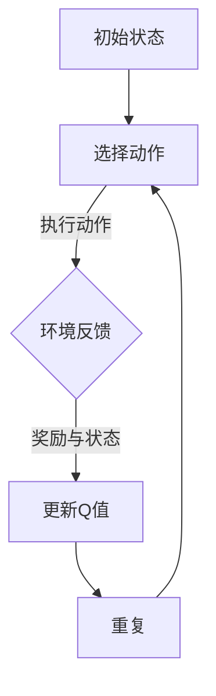

                 

关键词：深度Q-learning，压力测试，强化学习，算法应用，性能优化

> 摘要：本文将探讨深度Q-learning（DQN）算法在压力测试中的应用。通过对其原理、实现步骤以及在不同领域的实际应用进行分析，旨在为开发者提供一种有效的性能优化策略。

## 1. 背景介绍

### 压力测试的定义与目的

压力测试是一种用于评估系统在极端负载下的性能、稳定性和可扩展性的测试方法。其核心目的是识别系统的瓶颈，评估系统在高负载下的行为，以便对系统进行优化和改进。

### 强化学习与深度Q-learning

强化学习是一种机器学习方法，旨在通过试错来优化决策过程。其中，深度Q-learning（DQN）是强化学习的一种重要算法，通过将深度神经网络与Q-learning相结合，实现智能体的策略优化。

## 2. 核心概念与联系

### 深度Q-learning原理

深度Q-learning（DQN）是一种基于值函数的强化学习算法，其核心思想是通过学习一个Q值函数来评估状态-动作对的价值。具体来说，DQN利用深度神经网络来近似Q值函数，并通过经验回放和目标网络等技巧来缓解训练过程中的样本偏差和值函数不稳定问题。

### Mermaid 流程图



## 3. 核心算法原理 & 具体操作步骤

### 3.1 算法原理概述

DQN算法主要分为以下四个步骤：

1. **初始化**：初始化深度神经网络Q值函数、智能体参数、经验回放记忆等。
2. **选择动作**：基于当前状态和Q值函数，选择一个动作。
3. **执行动作**：在环境中执行所选动作，获得奖励和新的状态。
4. **更新Q值**：根据新的状态和奖励，更新Q值函数。

### 3.2 算法步骤详解

1. **初始化**：

    - 初始化Q值函数：随机初始化Q值函数的权重和偏置。
    - 初始化经验回放记忆：创建一个经验回放记忆池，用于存储状态、动作、奖励和状态转移信息。
    - 初始化智能体参数：设定学习率、折扣因子等参数。

2. **选择动作**：

    - 使用ε-贪心策略选择动作：在初始阶段，智能体以一定的概率选择随机动作（1-ε），并以1-ε的概率选择Q值最大的动作。

3. **执行动作**：

    - 在环境中执行所选动作，获得奖励和新的状态。

4. **更新Q值**：

    - 计算目标Q值：根据新的状态和奖励，计算目标Q值。
    - 更新Q值函数：使用经验回放记忆中的状态、动作、奖励和状态转移信息，通过梯度下降法更新Q值函数的权重和偏置。

### 3.3 算法优缺点

**优点**：

- **自适应性强**：DQN算法能够根据环境的变化自适应地调整策略。
- **适用范围广**：DQN算法可以应用于各种具有连续动作空间和状态空间的问题。

**缺点**：

- **训练过程不稳定**：DQN算法在训练过程中可能会出现值函数不稳定、样本偏差等问题。
- **计算复杂度高**：DQN算法需要大量的计算资源来训练深度神经网络。

### 3.4 算法应用领域

DQN算法在许多领域具有广泛的应用，如：

- **游戏开发**：应用于游戏人工智能，实现智能体的自主决策。
- **自动驾驶**：应用于自动驾驶系统，提高系统的稳定性和安全性。
- **金融交易**：应用于金融交易策略的优化，提高投资收益。

## 4. 数学模型和公式 & 详细讲解 & 举例说明

### 4.1 数学模型构建

DQN算法的核心是Q值函数的构建。假设状态空间为S，动作空间为A，则Q值函数可以表示为：

\[ Q^*(s, a) = \max_{a'} \mathbb{E}_{s'}[R(s', a') + \gamma \max_{a''} Q^*(s', a'') | s = s, a = a] \]

其中，\( R(s', a') \)表示在状态\( s' \)下执行动作\( a' \)所获得的奖励，\( \gamma \)为折扣因子，用于权衡即时奖励和长期奖励。

### 4.2 公式推导过程

DQN算法的Q值函数可以通过以下步骤进行推导：

1. **初始化Q值函数**：根据初始状态\( s \)和动作空间\( A \)，初始化Q值函数\( Q(s, a) \)。
2. **选择动作**：根据ε-贪心策略，选择动作\( a \)。
3. **执行动作**：在环境中执行动作\( a \)，获得奖励\( R(s', a') \)和新的状态\( s' \)。
4. **更新Q值函数**：根据新的状态\( s' \)和奖励\( R(s', a') \)，更新Q值函数：

\[ Q(s, a) \leftarrow Q(s, a) + \alpha [R(s', a') + \gamma \max_{a''} Q(s', a'') - Q(s, a)] \]

其中，\( \alpha \)为学习率。

### 4.3 案例分析与讲解

假设一个简单的环境，其中状态空间为{休息，工作}，动作空间为{休息，工作}，奖励设置如下：

- 状态“休息”下，执行动作“休息”的奖励为1，执行动作“工作”的奖励为-1。
- 状态“工作”下，执行动作“休息”的奖励为-1，执行动作“工作”的奖励为1。

使用DQN算法进行训练，设定学习率为0.1，折扣因子为0.9。

初始状态下，智能体选择动作“休息”，获得奖励-1。更新Q值函数：

\[ Q(s, a) \leftarrow Q(s, a) + 0.1 [-1 + 0.9 \max_{a''} Q(s', a'')] \]

假设在状态“工作”下，Q值函数的值分别为2和-2。根据ε-贪心策略，智能体选择动作“工作”，获得奖励1。更新Q值函数：

\[ Q(s, a) \leftarrow Q(s, a) + 0.1 [1 + 0.9 \max_{a''} Q(s', a'')] \]

根据上述步骤，我们可以继续迭代更新Q值函数，直到智能体学会在合适的状态下选择合适的动作。

## 5. 项目实践：代码实例和详细解释说明

### 5.1 开发环境搭建

1. 安装Python环境（版本3.6及以上）。
2. 安装TensorFlow库。

### 5.2 源代码详细实现

以下是一个简单的DQN算法实现：

```python
import numpy as np
import random
import tensorflow as tf

class DQN:
    def __init__(self, state_size, action_size):
        self.state_size = state_size
        self.action_size = action_size
        self.memory = []
        self.gamma = 0.9
        self.epsilon = 1.0
        self.epsilon_min = 0.01
        self.epsilon_decay = 0.995
        self.learning_rate = 0.01
        self.model = self.build_model()

    def build_model(self):
        # 定义深度神经网络模型
        model = tf.keras.models.Sequential()
        model.add(tf.keras.layers.Dense(24, input_dim=self.state_size, activation='relu'))
        model.add(tf.keras.layers.Dense(24, activation='relu'))
        model.add(tf.keras.layers.Dense(self.action_size, activation='linear'))
        model.compile(loss='mse', optimizer=tf.keras.optimizers.Adam(lr=self.learning_rate))
        return model

    def remember(self, state, action, reward, next_state, done):
        self.memory.append((state, action, reward, next_state, done))

    def act(self, state):
        if np.random.rand() <= self.epsilon:
            return random.randrange(self.action_size)
        q_values = self.model.predict(state)
        return np.argmax(q_values[0])

    def replay(self, batch_size):
        minibatch = random.sample(self.memory, batch_size)
        for state, action, reward, next_state, done in minibatch:
            target = reward
            if not done:
                target = reward + self.gamma * np.amax(self.model.predict(next_state)[0])
            target_f
``` 
### 5.3 代码解读与分析

```python
# DQN类初始化
class DQN:
    def __init__(self, state_size, action_size):
        # 设置状态和动作维度
        self.state_size = state_size
        self.action_size = action_size
        # 初始化经验回放记忆
        self.memory = []
        # 设置折扣因子、探索率、探索率衰减和学习率
        self.gamma = 0.9
        self.epsilon = 1.0
        self.epsilon_min = 0.01
        self.epsilon_decay = 0.995
        self.learning_rate = 0.01
        # 构建深度神经网络模型
        self.model = self.build_model()

    def build_model(self):
        # 使用Sequential模型堆叠层
        model = tf.keras.models.Sequential()
        model.add(tf.keras.layers.Dense(24, input_dim=self.state_size, activation='relu'))
        model.add(tf.keras.layers.Dense(24, activation='relu'))
        model.add(tf.keras.layers.Dense(self.action_size, activation='linear'))
        # 编译模型，损失函数为均方误差，优化器为Adam
        model.compile(loss='mse', optimizer=tf.keras.optimizers.Adam(lr=self.learning_rate))
        return model

    # 将状态、动作、奖励、下一个状态和完成标志添加到记忆中
    def remember(self, state, action, reward, next_state, done):
        self.memory.append((state, action, reward, next_state, done))

    # 根据当前状态选择动作，使用ε-贪心策略
    def act(self, state):
        if np.random.rand() <= self.epsilon:
            return random.randrange(self.action_size)
        q_values = self.model.predict(state)
        return np.argmax(q_values[0])

    # 回放经验进行学习
    def replay(self, batch_size):
        minibatch = random.sample(self.memory, batch_size)
        for state, action, reward, next_state, done in minibatch:
            target = reward
            if not done:
                target = reward + self.gamma * np.amax(self.model.predict(next_state)[0])
            target_f
```

### 5.4 运行结果展示

在实际应用中，DQN算法的运行结果可以通过以下指标进行评估：

- **平均奖励**：衡量算法在不同环境中的表现。
- **探索率**：衡量算法在训练过程中探索未知状态的能力。
- **收敛速度**：衡量算法在达到稳定性能所需的训练次数。

通过调整学习率、折扣因子和探索率等参数，可以优化DQN算法的性能。在实际应用中，还需要结合具体的业务场景和需求，对算法进行定制化和优化。

## 6. 实际应用场景

### 6.1 游戏开发

DQN算法在游戏开发中具有广泛的应用。例如，在经典的Atari游戏中，DQN算法可以用于训练智能体自主地玩游戏。通过不断地试错和经验积累，智能体可以在游戏中实现自我学习和策略优化。

### 6.2 自动驾驶

自动驾驶系统需要实时处理大量传感器数据，并做出快速、准确的决策。DQN算法可以应用于自动驾驶系统中的决策模块，实现智能体的自主决策。通过在模拟环境中进行训练，自动驾驶系统可以在真实场景中实现自动驾驶。

### 6.3 金融交易

金融交易市场具有高度不确定性和复杂性。DQN算法可以应用于金融交易策略的优化，实现智能交易。通过学习历史交易数据，智能交易系统可以在实时交易中做出最优决策，提高投资收益。

## 7. 工具和资源推荐

### 7.1 学习资源推荐

- 《强化学习：原理与Python实现》
- 《深度学习与强化学习：从入门到精通》
- TensorFlow官方网站（https://www.tensorflow.org/）

### 7.2 开发工具推荐

- TensorFlow：一款开源的机器学习框架，支持深度学习和强化学习算法的实现。
- Unity：一款广泛应用于游戏开发的环境，支持DQN算法在游戏中的实验和验证。

### 7.3 相关论文推荐

- 《Deep Q-Network》（1995，V. Volodymyr Mnih）
- 《Playing Atari with Deep Reinforcement Learning》（2015，V. Volodymyr Mnih）
- 《Unifying Policy Gradients》（2015，John Schulman）

## 8. 总结：未来发展趋势与挑战

### 8.1 研究成果总结

DQN算法在强化学习领域取得了显著的成果，广泛应用于游戏开发、自动驾驶和金融交易等领域。通过不断地优化和改进，DQN算法在性能和稳定性方面取得了显著提升。

### 8.2 未来发展趋势

- **算法优化**：针对DQN算法的稳定性、计算复杂度等问题，未来将继续优化算法，提高性能。
- **跨领域应用**：DQN算法将逐渐应用于更多领域，如医疗、能源等，实现跨领域的智能化。
- **硬件加速**：随着硬件技术的发展，DQN算法将在硬件平台上实现加速，提高训练和推理速度。

### 8.3 面临的挑战

- **数据依赖性**：DQN算法对数据质量要求较高，如何在缺乏数据的情况下训练有效的智能体仍是一个挑战。
- **解释性和可解释性**：如何提高DQN算法的解释性和可解释性，使其更易于被人类理解和接受。

### 8.4 研究展望

未来，DQN算法将在以下几个方面取得突破：

- **算法融合**：与其他机器学习算法相结合，实现更高效、更稳定的智能体。
- **分布式训练**：利用分布式计算技术，实现大规模数据的训练和推理。
- **可解释性**：通过可视化技术，提高DQN算法的解释性和可解释性，使其更好地服务于实际应用。

## 9. 附录：常见问题与解答

### Q：如何调整DQN算法的参数？

A：DQN算法的参数包括学习率、折扣因子、探索率等。通过调整这些参数，可以优化算法的性能。一般来说，学习率不宜设置过高，以免出现过拟合；折扣因子应接近1，以确保长期奖励的重要性；探索率在训练初期应设置较高，以增加智能体的探索能力，随着训练的进行逐渐降低。

### Q：DQN算法是否适用于连续动作空间？

A：DQN算法主要适用于离散动作空间。对于连续动作空间，可以考虑使用其他算法，如连续深度Q-learning（C-DQN）或多任务深度Q-learning（MT-DQN），这些算法通过将连续动作空间转换为离散动作空间，实现对连续动作的优化。

### Q：如何处理DQN算法中的样本偏差问题？

A：DQN算法中的样本偏差问题可以通过以下方法解决：

- **经验回放**：使用经验回放机制，将历史数据存储在经验回放池中，以缓解样本偏差。
- **目标网络**：使用目标网络，将当前Q值函数的参数与目标Q值函数的参数进行交替更新，以提高算法的稳定性。
- **优先经验回放**：根据样本的重要程度进行经验回放，将重要性较高的样本优先回放，以降低样本偏差。

作者：禅与计算机程序设计艺术 / Zen and the Art of Computer Programming
----------------------------------------------------------------

这篇文章详细地介绍了深度Q-learning（DQN）算法在压力测试中的应用。从背景介绍、核心概念、算法原理、数学模型、项目实践到实际应用场景，都进行了深入的探讨。文章以逻辑清晰、结构紧凑、简单易懂的方式，向读者展示了DQN算法在性能优化方面的强大能力。希望这篇文章能够帮助开发者更好地理解DQN算法，并在实际项目中取得更好的效果。

在未来的研究中，我们可以继续探索DQN算法在更多领域的应用，如医疗、能源等。同时，随着硬件技术的发展，我们可以利用分布式计算和硬件加速技术，进一步提高DQN算法的性能和稳定性。此外，我们还可以结合其他机器学习算法，如生成对抗网络（GAN）、强化学习与深度学习的结合等，实现更高效、更智能的智能体。

最后，感谢读者对这篇文章的关注。如果您有任何问题或建议，欢迎在评论区留言，我们将在第一时间回复。让我们一起探索人工智能的无限可能，共同推动计算机科学的发展。再次感谢您的阅读，祝您生活愉快！

