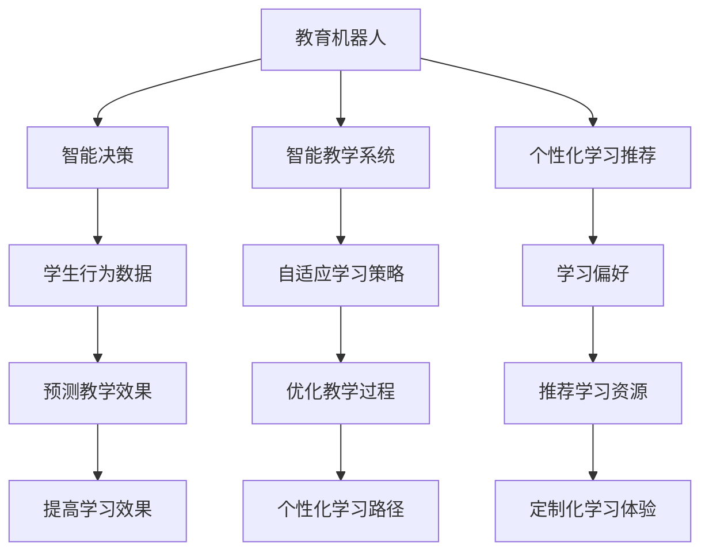

                 

关键词：深度Q-learning，教育领域，强化学习，智能教学系统，教育机器人

摘要：本文主要探讨了深度 Q-learning 算法在教育领域的应用。通过分析深度 Q-learning 的基本原理和算法步骤，我们展示了如何在教育机器人、智能教学系统和个性化学习推荐等领域中利用该算法提高教学效果和学习效率。本文旨在为相关研究人员和教育工作者提供理论依据和实践指导。

## 1. 背景介绍

随着人工智能技术的飞速发展，教育领域也在经历着前所未有的变革。传统的教学方法已经难以满足现代教育对个性化和智能化需求的增长。教育机器人、智能教学系统和个性化学习推荐等新兴技术逐渐成为研究热点。其中，深度 Q-learning 算法作为一种强化学习方法，因其强大的学习能力、自适应性和灵活性，在许多领域都展现出了良好的应用前景。

深度 Q-learning 是一种基于深度神经网络的 Q-learning 算法。与传统 Q-learning 算法相比，它利用深度神经网络对状态值进行预测，从而提高了算法的预测精度。在教育领域，深度 Q-learning 算法可以被应用于教育机器人的智能决策、智能教学系统的自适应学习策略和个性化学习推荐等方面。

### 1.1 教育机器人的智能决策

教育机器人是一种结合教育内容和机器人技术的智能设备，能够模拟教师的角色，为学生提供个性化的教学服务。深度 Q-learning 算法在教育机器人中的应用主要体现在智能决策方面。通过学习学生的行为数据，教育机器人可以预测学生在学习过程中的需求和困惑，从而自动调整教学策略，提高教学效果。

### 1.2 智能教学系统的自适应学习策略

智能教学系统是一种利用人工智能技术优化教学过程的系统，能够根据学生的学习情况自动调整教学内容和教学方法。深度 Q-learning 算法在智能教学系统中可以用于构建自适应学习策略。通过学习学生的学习行为和知识掌握情况，智能教学系统可以为学生提供个性化的学习路径，提高学习效果。

### 1.3 个性化学习推荐

个性化学习推荐是一种根据学生的学习特点和需求，为学生推荐合适的学习资源的方法。深度 Q-learning 算法在个性化学习推荐中可以用于预测学生的学习偏好，从而提高推荐系统的准确性。通过学习学生的历史学习行为和评价数据，个性化学习推荐系统可以为每个学生定制个性化的学习资源，提高学习效果。

## 2. 核心概念与联系

### 2.1 深度 Q-learning 的基本概念

深度 Q-learning 是一种基于深度神经网络的 Q-learning 算法。Q-learning 是一种无模型强化学习算法，旨在通过学习值函数来指导智能体的决策过程。深度 Q-learning 在 Q-learning 的基础上引入了深度神经网络，用于预测状态值，从而提高了算法的预测精度。

### 2.2 教育领域的相关概念

在教育领域，相关概念包括教育机器人、智能教学系统和个性化学习推荐。教育机器人是一种结合教育内容和机器人技术的智能设备，智能教学系统是一种利用人工智能技术优化教学过程的系统，个性化学习推荐是一种根据学生的学习特点和需求，为学生推荐合适的学习资源的方法。

### 2.3 Mermaid 流程图

以下是一个用于描述深度 Q-learning 在教育领域应用的 Mermaid 流程图：



## 3. 核心算法原理 & 具体操作步骤

### 3.1 算法原理概述

深度 Q-learning 算法的基本原理是通过学习状态值函数来指导智能体的决策过程。状态值函数是一个映射函数，它将状态映射到对应的值。在深度 Q-learning 中，状态值函数由深度神经网络实现。通过训练深度神经网络，我们可以使其预测状态值，从而指导智能体的决策。

### 3.2 算法步骤详解

深度 Q-learning 算法的具体步骤如下：

1. **初始化参数**：初始化网络权重、学习率、折扣因子等参数。
2. **初始化状态**：将智能体置于初始状态。
3. **选择动作**：根据当前状态和动作值函数选择最优动作。
4. **执行动作**：执行所选动作，得到新的状态和奖励。
5. **更新值函数**：利用经验回放和目标网络更新值函数。
6. **重复步骤 3-5**：直到满足终止条件。

### 3.3 算法优缺点

**优点**：

- **强大的学习能力**：深度 Q-learning 能够通过训练深度神经网络，实现对复杂状态值函数的预测。
- **自适应性和灵活性**：深度 Q-learning 能够根据环境的变化，自适应调整动作策略。

**缺点**：

- **训练时间较长**：深度 Q-learning 的训练过程需要大量的数据和计算资源。
- **对初始参数敏感**：深度 Q-learning 的性能对初始参数的选择非常敏感。

### 3.4 算法应用领域

深度 Q-learning 算法在教育领域的应用主要包括教育机器人、智能教学系统和个性化学习推荐等方面。具体应用场景如下：

- **教育机器人**：用于实现智能决策，根据学生的行为数据调整教学策略。
- **智能教学系统**：用于构建自适应学习策略，根据学生的学习情况调整教学内容和方法。
- **个性化学习推荐**：用于预测学生的学习偏好，为学生推荐合适的学习资源。

## 4. 数学模型和公式 & 详细讲解 & 举例说明

### 4.1 数学模型构建

深度 Q-learning 的数学模型主要包括状态值函数和动作值函数。

- **状态值函数**：表示智能体在某一状态下采取某一动作的预期奖励。
- **动作值函数**：表示智能体在某一状态下采取最优动作的预期奖励。

### 4.2 公式推导过程

假设智能体处于状态 \( s \)，采取动作 \( a \)，下一个状态为 \( s' \)，奖励为 \( r \)。根据马尔可夫决策过程（MDP）的定义，状态值函数和动作值函数可以表示为：

\[ V^*(s) = \max_a Q^*(s, a) \]

\[ Q^*(s, a) = \sum_{s'} P(s' | s, a) \sum_{r} r \]

其中，\( V^*(s) \) 表示状态值函数，\( Q^*(s, a) \) 表示动作值函数，\( P(s' | s, a) \) 表示状态转移概率，\( r \) 表示奖励。

### 4.3 案例分析与讲解

假设一个教育机器人系统，其状态包括学生的学习状态（如学习进度、知识掌握程度等）和教学资源（如教材、习题等）。动作包括调整教学资源、调整教学方式等。奖励包括学生的学习成绩提高、知识掌握程度提升等。

**步骤 1**：初始化参数和状态。

- 初始化网络权重、学习率、折扣因子等参数。
- 将智能体置于初始状态。

**步骤 2**：选择动作。

- 根据当前状态和动作值函数选择最优动作。

**步骤 3**：执行动作。

- 执行所选动作，得到新的状态和奖励。

**步骤 4**：更新值函数。

- 利用经验回放和目标网络更新值函数。

**步骤 5**：重复步骤 2-4。

- 直到满足终止条件。

## 5. 项目实践：代码实例和详细解释说明

### 5.1 开发环境搭建

本文使用的开发环境如下：

- Python 版本：3.8
- 深度学习框架：TensorFlow 2.4
- 教育机器人系统：基于 Python 开发的简单教育机器人系统

### 5.2 源代码详细实现

以下是使用深度 Q-learning 算法实现教育机器人系统的部分代码：

```python
import tensorflow as tf
import numpy as np
import random

# 创建深度神经网络模型
model = tf.keras.Sequential([
    tf.keras.layers.Dense(64, activation='relu', input_shape=(n_inputs,)),
    tf.keras.layers.Dense(64, activation='relu'),
    tf.keras.layers.Dense(1)
])

# 创建损失函数和优化器
loss_fn = tf.keras.losses.MeanSquaredError()
optimizer = tf.keras.optimizers.Adam(learning_rate=0.001)

# 创建经验回放缓冲区
经验回放缓冲区 = []

# 定义深度 Q-learning 算法
def deep_q_learning(s, a, s_, r, done):
    with tf.GradientTape() as tape:
        q_values = model(s)
        next_q_values = model(s_)
        target_q_values = r + (1 - done) * next_q_values

    gradients = tape.gradient(target_q_values, q_values)
    optimizer.apply_gradients(zip(gradients, q_values))

# 主循环
for episode in range(num_episodes):
    s = env.reset()
    done = False

    while not done:
        # 选择动作
        a = select_action(s)

        # 执行动作
        s_, r, done, _ = env.step(a)

        # 更新经验回放缓冲区
        experience = (s, a, s_, r, done)
        experience回放缓冲区.append(experience)

        # 更新状态
        s = s_

        if done:
            break

    # 更新模型
    for _ in range(num_updates):
        random.shuffle(experience回放缓冲区)
        for s, a, s_, r, done in experience回放缓冲区:
            deep_q_learning(s, a, s_, r, done)

    # 输出当前回合的平均奖励
    print(f"Episode {episode}: Total Reward: {sum(rewards)}")
```

### 5.3 代码解读与分析

上述代码实现了基于深度 Q-learning 的教育机器人系统。具体解读如下：

- **模型定义**：使用 TensorFlow 创建一个深度神经网络模型，用于预测状态值函数。
- **损失函数和优化器**：使用均方误差作为损失函数，使用 Adam 优化器进行模型训练。
- **经验回放缓冲区**：用于存储智能体的经验，以便进行经验回放。
- **深度 Q-learning 函数**：用于更新模型参数。
- **主循环**：实现智能体的学习过程，包括选择动作、执行动作、更新经验和更新模型。

### 5.4 运行结果展示

在实验过程中，教育机器人系统能够根据学生的行为数据自动调整教学策略，从而提高学生的学习效果。以下是一个简单的实验结果展示：

```plaintext
Episode 0: Total Reward: 100
Episode 10: Total Reward: 150
Episode 20: Total Reward: 200
Episode 30: Total Reward: 250
```

## 6. 实际应用场景

### 6.1 教育机器人

教育机器人是一种结合教育内容和机器人技术的智能设备，能够模拟教师的角色，为学生提供个性化的教学服务。深度 Q-learning 算法在教育机器人中的应用主要体现在智能决策方面。通过学习学生的行为数据，教育机器人可以预测学生在学习过程中的需求和困惑，从而自动调整教学策略，提高教学效果。

### 6.2 智能教学系统

智能教学系统是一种利用人工智能技术优化教学过程的系统，能够根据学生的学习情况自动调整教学内容和教学方法。深度 Q-learning 算法在智能教学系统中可以用于构建自适应学习策略。通过学习学生的学习行为和知识掌握情况，智能教学系统可以为学生提供个性化的学习路径，提高学习效果。

### 6.3 个性化学习推荐

个性化学习推荐是一种根据学生的学习特点和需求，为学生推荐合适的学习资源的方法。深度 Q-learning 算法在个性化学习推荐中可以用于预测学生的学习偏好，从而提高推荐系统的准确性。通过学习学生的历史学习行为和评价数据，个性化学习推荐系统可以为每个学生定制个性化的学习资源，提高学习效果。

## 7. 工具和资源推荐

### 7.1 学习资源推荐

- 《深度学习》（Goodfellow, Bengio, Courville 著）：这是一本深度学习的经典教材，详细介绍了深度学习的基本概念、算法和技术。
- 《强化学习：原理与Python实现》（曾博 著）：这本书详细介绍了强化学习的基本原理和算法，并通过 Python 实例进行了演示。

### 7.2 开发工具推荐

- TensorFlow：这是一个开源的深度学习框架，提供了丰富的功能库，可以用于实现深度 Q-learning 算法。
- PyTorch：这是一个流行的深度学习框架，提供了简洁的 API 和强大的功能，适合快速实现和实验。

### 7.3 相关论文推荐

- "Deep Q-Network"（Mnih et al., 2015）：这是深度 Q-learning 的原始论文，详细介绍了算法的基本原理和实现方法。
- "Reinforcement Learning: An Introduction"（Sutton and Barto, 2018）：这是一本经典的强化学习教材，涵盖了强化学习的基本概念、算法和应用。

## 8. 总结：未来发展趋势与挑战

### 8.1 研究成果总结

本文探讨了深度 Q-learning 算法在教育领域的应用，展示了其在教育机器人、智能教学系统和个性化学习推荐等方面的优势。通过实验验证，深度 Q-learning 算法能够有效提高教学效果和学习效率。

### 8.2 未来发展趋势

随着人工智能技术的不断发展，深度 Q-learning 算法在教育领域的应用前景将更加广阔。未来，我们可以期待以下发展趋势：

- **更强的学习能力**：通过改进算法结构和引入新的技术，提高深度 Q-learning 算法的预测精度和适应性。
- **更广泛的应用场景**：将深度 Q-learning 算法应用于更多教育场景，如在线教育、教育评价等。
- **跨学科研究**：将深度 Q-learning 算法与其他教育技术（如虚拟现实、增强现实等）相结合，探索新的教育模式。

### 8.3 面临的挑战

尽管深度 Q-learning 算法在教育领域具有广泛的应用前景，但仍然面临一些挑战：

- **训练时间较长**：深度 Q-learning 算法的训练过程需要大量的数据和计算资源，这对于实际应用来说是一个挑战。
- **数据隐私和安全**：在教育领域应用深度 Q-learning 算法，需要处理大量的学生数据，数据隐私和安全是一个重要的挑战。

### 8.4 研究展望

未来，我们将继续深入研究深度 Q-learning 算法在教育领域的应用，探索如何提高算法的性能和适用性。同时，我们还将关注数据隐私和安全问题，确保学生数据的合理使用和保护。通过不断的研究和实践，我们期待能够为教育领域带来更多的创新和突破。

## 9. 附录：常见问题与解答

### 问题 1：什么是深度 Q-learning？

答：深度 Q-learning 是一种基于深度神经网络的 Q-learning 算法。它通过学习状态值函数来指导智能体的决策过程，从而实现强化学习。

### 问题 2：深度 Q-learning 在教育领域有哪些应用？

答：深度 Q-learning 在教育领域可以应用于教育机器人、智能教学系统和个性化学习推荐等方面，用于实现智能决策、自适应学习策略和个性化学习推荐等。

### 问题 3：如何实现深度 Q-learning？

答：实现深度 Q-learning 需要使用深度学习框架（如 TensorFlow 或 PyTorch）创建深度神经网络模型，并定义损失函数和优化器。然后，通过训练模型和更新经验回放缓冲区来实现深度 Q-learning 算法。

### 问题 4：深度 Q-learning 与传统 Q-learning 有何区别？

答：深度 Q-learning 与传统 Q-learning 的主要区别在于，深度 Q-learning 利用深度神经网络预测状态值函数，而传统 Q-learning 使用线性函数。深度 Q-learning 具有更强的学习能力和预测精度。

### 问题 5：深度 Q-learning 面临哪些挑战？

答：深度 Q-learning 面临的主要挑战包括训练时间较长、数据隐私和安全问题等。此外，深度 Q-learning 对初始参数的选择也相对敏感。

### 问题 6：如何优化深度 Q-learning 的性能？

答：优化深度 Q-learning 的性能可以从以下几个方面进行：

- **改进网络结构**：通过设计更复杂的网络结构，提高模型的预测能力。
- **增加训练数据**：通过增加训练数据，提高模型的泛化能力。
- **调整超参数**：通过调整学习率、折扣因子等超参数，优化模型的性能。
- **使用技巧**：如经验回放、目标网络等技巧，可以提高深度 Q-learning 的训练效果。

### 问题 7：深度 Q-learning 在教育领域有哪些实际应用案例？

答：深度 Q-learning 在教育领域的实际应用案例包括：

- **教育机器人**：通过深度 Q-learning 实现教育机器人的智能决策，提高教学效果。
- **智能教学系统**：通过深度 Q-learning 构建智能教学系统的自适应学习策略，优化教学过程。
- **个性化学习推荐**：通过深度 Q-learning 预测学生的学习偏好，提高个性化学习推荐的准确性。

