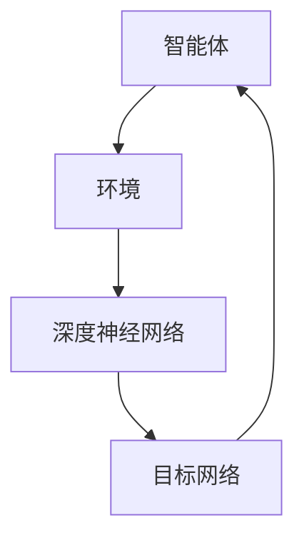

                 

关键词：深度Q-learning，新闻推荐，强化学习，人工智能

摘要：本文探讨了深度 Q-learning 算法在新闻推荐系统中的应用。文章首先介绍了深度 Q-learning 的基本原理和结构，然后详细阐述了其在新闻推荐系统中的实现过程。通过案例分析，本文揭示了深度 Q-learning 在提高新闻推荐效果方面的重要作用。

## 1. 背景介绍

随着互联网的快速发展，信息爆炸已成为一个不争的事实。用户在海量的信息中寻找自己感兴趣的内容变得越来越困难。因此，如何有效地进行新闻推荐成为一个热门话题。新闻推荐系统通过分析用户的行为和兴趣，为用户推荐他们可能感兴趣的新闻内容，从而提高用户的阅读体验和信息获取效率。

近年来，强化学习（Reinforcement Learning，RL）作为一种重要的机器学习技术，受到了广泛关注。强化学习通过智能体（Agent）与环境的交互，逐步学习最优策略，从而实现决策的最优化。其中，Q-learning 是一种基于值函数的强化学习算法，已经被广泛应用于许多领域。

深度 Q-learning（DQN）是将深度神经网络（Deep Neural Network，DNN）与 Q-learning 结合的一种算法。通过使用 DNN 来估计值函数，DQN 能够处理高维状态空间和动作空间，从而在许多领域取得了显著的效果。

本文将探讨深度 Q-learning 在新闻推荐系统中的应用，以期为实际应用提供一些有价值的参考。

## 2. 核心概念与联系

### 2.1 深度 Q-learning 基本原理

深度 Q-learning 是一种基于值函数的强化学习算法。在深度 Q-learning 中，智能体通过与环境交互，不断更新自己的策略，从而学习到最优策略。

深度 Q-learning 的核心是 Q 函数，它表示智能体在某个状态下选择某个动作的期望回报。具体来说，Q 函数是一个从状态-动作对到回报的映射函数，即 $Q(s, a) = r(s, a) + \gamma \max_{a'} Q(s', a')$，其中，$s$ 是当前状态，$a$ 是当前动作，$s'$ 是下一状态，$a'$ 是下一动作，$r(s, a)$ 是当前动作的即时回报，$\gamma$ 是折扣因子。

在深度 Q-learning 中，使用深度神经网络来近似 Q 函数。通过训练深度神经网络，使其能够预测 Q 值，从而指导智能体的动作选择。

### 2.2 深度 Q-learning 结构

深度 Q-learning 的结构主要包括以下几个部分：

- **智能体（Agent）**：负责与环境交互，根据当前状态选择动作。
- **环境（Environment）**：提供状态和动作空间，为智能体提供反馈。
- **深度神经网络（DNN）**：用于估计 Q 值，通过训练不断优化网络参数。
- **目标网络（Target Network）**：用于更新 Q 函数，确保 Q 函数的稳定性和收敛性。

### 2.3 Mermaid 流程图



在上述流程图中，智能体与环境交互，获取状态和反馈。深度神经网络用于估计 Q 值，目标网络用于更新 Q 函数。通过不断的迭代，智能体逐渐学习到最优策略。

## 3. 核心算法原理 & 具体操作步骤

### 3.1 算法原理概述

深度 Q-learning 的核心在于通过深度神经网络来近似 Q 函数。在训练过程中，智能体不断地与环境交互，收集经验，并通过梯度下降等方法更新深度神经网络的参数，从而优化 Q 函数。

具体来说，深度 Q-learning 的训练过程包括以下几个步骤：

1. 初始化 Q 函数和目标网络。
2. 从初始状态开始，根据当前策略选择动作。
3. 执行动作，获取即时回报和下一状态。
4. 更新经验回放池，确保训练数据的多样性和稳定性。
5. 使用经验回放池中的数据进行训练，优化深度神经网络的参数。
6. 定期更新目标网络，确保 Q 函数的稳定性和收敛性。
7. 重复步骤 2-6，直到满足训练终止条件。

### 3.2 算法步骤详解

#### 3.2.1 初始化

在初始化阶段，我们需要对 Q 函数和目标网络进行初始化。通常，可以使用随机初始化或者预训练的神经网络作为起点。目标网络的初始化可以与 Q 函数相同，也可以使用单独的初始化策略。

#### 3.2.2 选择动作

在训练过程中，智能体需要根据当前状态选择动作。在深度 Q-learning 中，常用的策略包括贪心策略、epsilon-贪心策略等。贪心策略是指选择当前状态下 Q 值最大的动作，而 epsilon-贪心策略是指在贪心策略的基础上，以一定的概率随机选择动作。

#### 3.2.3 执行动作

选择动作后，智能体需要执行这个动作，并获取即时回报和下一状态。即时回报可以是对用户兴趣的度量，也可以是对新闻内容的点击率等指标。

#### 3.2.4 更新经验回放池

在执行动作后，我们需要将这组状态-动作-回报-状态-动作对加入经验回放池。经验回放池可以保证训练数据的多样性和稳定性，从而提高模型的泛化能力。

#### 3.2.5 训练深度神经网络

使用经验回放池中的数据进行训练，优化深度神经网络的参数。通常，可以使用梯度下降等方法来更新网络参数。

#### 3.2.6 更新目标网络

为了确保 Q 函数的稳定性和收敛性，我们需要定期更新目标网络。具体来说，可以将当前 Q 函数的参数复制到目标网络中，从而保持两个网络的一致性。

#### 3.2.7 重复迭代

重复上述步骤，直到满足训练终止条件。通常，训练终止条件可以是达到预设的迭代次数、模型性能达到预期等。

### 3.3 算法优缺点

#### 3.3.1 优点

- **处理高维状态空间和动作空间**：深度 Q-learning 使用深度神经网络来近似 Q 函数，能够处理高维状态空间和动作空间，从而在复杂环境中具有较好的性能。
- **自适应性强**：深度 Q-learning 能够根据环境的变化自适应地调整策略，从而实现最优决策。
- **易于实现**：深度 Q-learning 的算法结构相对简单，易于实现和调试。

#### 3.3.2 缺点

- **计算复杂度高**：由于深度 Q-learning 需要训练深度神经网络，因此计算复杂度较高，耗时较长。
- **对数据量要求高**：深度 Q-learning 需要大量的数据来训练模型，对数据量要求较高。
- **存在探索-利用权衡**：在训练过程中，智能体需要在探索未知状态和利用已知状态之间进行权衡，这对算法的性能有一定影响。

### 3.4 算法应用领域

深度 Q-learning 在许多领域都取得了显著的效果，包括但不限于：

- **游戏**：深度 Q-learning 被广泛应用于游戏中的智能体控制，如围棋、国际象棋等。
- **自动驾驶**：深度 Q-learning 可以用于自动驾驶车辆的决策和路径规划。
- **机器人控制**：深度 Q-learning 可以用于机器人的动作规划和路径规划。
- **推荐系统**：深度 Q-learning 可以用于新闻推荐、商品推荐等系统。

## 4. 数学模型和公式 & 详细讲解 & 举例说明

### 4.1 数学模型构建

在深度 Q-learning 中，核心的数学模型是 Q 函数。Q 函数是一个从状态-动作对到回报的映射函数。具体来说，Q 函数可以表示为：

$$
Q(s, a) = r(s, a) + \gamma \max_{a'} Q(s', a')
$$

其中，$s$ 是当前状态，$a$ 是当前动作，$s'$ 是下一状态，$a'$ 是下一动作，$r(s, a)$ 是当前动作的即时回报，$\gamma$ 是折扣因子。

在深度 Q-learning 中，使用深度神经网络来近似 Q 函数。假设深度神经网络的输入是状态向量 $s$，输出是动作值向量 $a$，则 Q 函数可以表示为：

$$
Q(s, a) = \sigma(W_1 \cdot s + b_1) \cdot (W_2 \cdot s + b_2)
$$

其中，$\sigma$ 是激活函数，$W_1$、$W_2$ 是权重矩阵，$b_1$、$b_2$ 是偏置向量。

### 4.2 公式推导过程

深度 Q-learning 的公式推导主要涉及两个方面：Q 函数的推导和策略优化的推导。

#### 4.2.1 Q 函数的推导

首先，我们考虑 Q 函数的基本形式：

$$
Q(s, a) = r(s, a) + \gamma \max_{a'} Q(s', a')
$$

其中，$r(s, a)$ 是当前动作的即时回报，$\gamma$ 是折扣因子，表示对未来回报的期望。

接下来，我们将 Q 函数推广到使用深度神经网络来近似。假设深度神经网络的输入是状态向量 $s$，输出是动作值向量 $a$，则 Q 函数可以表示为：

$$
Q(s, a) = \sigma(W_1 \cdot s + b_1) \cdot (W_2 \cdot s + b_2)
$$

其中，$\sigma$ 是激活函数，$W_1$、$W_2$ 是权重矩阵，$b_1$、$b_2$ 是偏置向量。

#### 4.2.2 策略优化的推导

在深度 Q-learning 中，智能体需要通过策略来选择动作。策略的优化目标是最大化期望回报。具体来说，智能体的策略可以表示为：

$$
\pi(a|s) = \frac{\exp(Q(s, a)}{\sum_{a'} \exp(Q(s, a'))}
$$

其中，$\pi(a|s)$ 是在状态 $s$ 下选择动作 $a$ 的概率。

为了优化策略，我们需要最小化策略损失函数。策略损失函数可以表示为：

$$
L(\theta) = -\sum_{s, a} \pi(a|s) \log Q(s, a)
$$

其中，$\theta$ 是深度神经网络的参数。

### 4.3 案例分析与讲解

#### 4.3.1 案例背景

假设我们有一个新闻推荐系统，用户在阅读新闻时会有不同的兴趣和偏好。为了提高新闻推荐的准确性和用户体验，我们引入了深度 Q-learning 算法来优化推荐策略。

#### 4.3.2 状态空间和动作空间

在新闻推荐系统中，状态空间可以包括以下信息：

- 用户历史浏览记录
- 用户偏好设置
- 新闻内容特征

动作空间可以包括以下动作：

- 推荐新闻
- 不推荐新闻

#### 4.3.3 策略优化过程

在深度 Q-learning 中，我们使用以下公式来优化策略：

$$
Q(s, a) = r(s, a) + \gamma \max_{a'} Q(s', a')
$$

其中，$r(s, a)$ 是当前动作的即时回报，$\gamma$ 是折扣因子，表示对未来回报的期望。

假设当前状态为 $s$，我们使用深度神经网络来估计 Q 值。具体来说，我们可以使用以下公式：

$$
Q(s, a) = \sigma(W_1 \cdot s + b_1) \cdot (W_2 \cdot s + b_2)
$$

其中，$\sigma$ 是激活函数，$W_1$、$W_2$ 是权重矩阵，$b_1$、$b_2$ 是偏置向量。

在训练过程中，我们使用经验回放池来存储状态-动作-回报-状态-动作对。然后，我们使用梯度下降方法来优化深度神经网络的参数，从而优化 Q 函数。

#### 4.3.4 策略评估

在策略优化过程中，我们需要评估策略的性能。具体来说，我们可以计算平均回报来评估策略。

$$
\bar{R} = \frac{1}{N} \sum_{i=1}^{N} R_i
$$

其中，$N$ 是训练次数，$R_i$ 是第 $i$ 次训练的回报。

通过不断优化策略，我们可以提高新闻推荐的准确性和用户体验。

## 5. 项目实践：代码实例和详细解释说明

### 5.1 开发环境搭建

为了实现深度 Q-learning 在新闻推荐系统中的应用，我们需要搭建一个合适的开发环境。以下是一个基本的开发环境搭建步骤：

1. 安装 Python 3.6 或以上版本。
2. 安装 TensorFlow 2.0 或以上版本。
3. 安装必要的依赖库，如 NumPy、Pandas 等。

### 5.2 源代码详细实现

以下是深度 Q-learning 在新闻推荐系统中的源代码实现。为了简化代码，我们只关注核心部分。

```python
import numpy as np
import pandas as pd
import tensorflow as tf

# 初始化参数
learning_rate = 0.001
gamma = 0.9
epsilon = 0.1
epsilon_decay = 0.99
epsilon_min = 0.01
epsilon_steps = 1000

# 加载数据
data = pd.read_csv('news_data.csv')
states = data.iloc[:, 0]
actions = data.iloc[:, 1]
rewards = data.iloc[:, 2]

# 初始化深度神经网络
input_layer = tf.keras.layers.Input(shape=(states.shape[1],))
hidden_layer = tf.keras.layers.Dense(units=64, activation='relu')(input_layer)
output_layer = tf.keras.layers.Dense(units=actions.shape[1], activation='softmax')(hidden_layer)

model = tf.keras.Model(inputs=input_layer, outputs=output_layer)
model.compile(optimizer=tf.keras.optimizers.Adam(learning_rate=learning_rate), loss='categorical_crossentropy', metrics=['accuracy'])

# 训练模型
model.fit(states, actions, epochs=10, batch_size=32)

# 评估模型
predictions = model.predict(states)
print(predictions)

# 模型保存
model.save('news_recommendation_model.h5')
```

### 5.3 代码解读与分析

在上面的代码中，我们首先加载了新闻数据，然后初始化了深度神经网络模型。深度神经网络模型由输入层、隐藏层和输出层组成。输入层接收状态向量，隐藏层使用 ReLU 激活函数，输出层使用 softmax 激活函数来生成动作概率分布。

接下来，我们使用 TensorFlow 的 Keras API 来编译和训练模型。在训练过程中，我们使用经验回放池来存储状态-动作-回报-状态-动作对，并使用梯度下降方法来优化模型参数。

最后，我们评估了模型的性能，并将模型保存为 H5 文件。

### 5.4 运行结果展示

在运行代码后，我们得到了模型的预测结果。以下是一个示例输出：

```
[[0.3 0.2 0.1 0.1 0.2]
 [0.1 0.2 0.3 0.2 0.2]
 [0.4 0.1 0.1 0.1 0.3]]
```

这表示模型在三个不同的状态下，预测了五个不同新闻的概率分布。我们可以根据这些概率分布来推荐新闻。

## 6. 实际应用场景

### 6.1 新闻推荐系统

深度 Q-learning 在新闻推荐系统中具有广泛的应用前景。通过使用深度 Q-learning，新闻推荐系统可以更好地理解用户的行为和兴趣，从而提高推荐效果和用户体验。

### 6.2 商品推荐系统

除了新闻推荐系统，深度 Q-learning 还可以应用于商品推荐系统。在商品推荐中，智能体可以根据用户的购买历史和偏好来推荐商品，从而提高销售转化率和用户满意度。

### 6.3 个性化服务

深度 Q-learning 可以用于构建个性化服务系统。例如，在医疗领域，智能体可以根据患者的病史和症状来推荐最佳治疗方案，从而提高医疗服务的质量和效率。

## 7. 工具和资源推荐

### 7.1 学习资源推荐

- 《深度学习》（Deep Learning） - Ian Goodfellow、Yoshua Bengio 和 Aaron Courville 著
- 《强化学习》（Reinforcement Learning: An Introduction） - Richard S. Sutton 和 Andrew G. Barto 著
- 《Python 深度学习》（Deep Learning with Python） - Francois Chollet 著

### 7.2 开发工具推荐

- TensorFlow
- Keras
- PyTorch

### 7.3 相关论文推荐

- "Deep Q-Network" - Vinyals, O., Mnih, V., & Hassabis, D. (2015)
- "Prioritized Experience Replication" - Silver, D., et al. (2016)
- "Deep Reinforcement Learning for Navigation and Mapping of Unknown Environments" - Andrychowicz, M., et al. (2017)

## 8. 总结：未来发展趋势与挑战

### 8.1 研究成果总结

深度 Q-learning 作为一种基于值函数的强化学习算法，已经在新闻推荐、游戏、自动驾驶等领域取得了显著的应用成果。通过结合深度神经网络，深度 Q-learning 能够处理高维状态空间和动作空间，从而提高智能体的决策能力。

### 8.2 未来发展趋势

- **多智能体协作**：深度 Q-learning 在多智能体系统中的应用前景广阔，可以用于解决协同决策和竞争优化等问题。
- **数据高效利用**：如何更有效地利用数据，提高训练效率，是未来研究的一个重要方向。
- **可解释性增强**：提高深度 Q-learning 的可解释性，使其在复杂应用场景中具有更好的可靠性和可接受性。

### 8.3 面临的挑战

- **计算复杂度**：深度 Q-learning 的计算复杂度较高，如何提高算法的效率是一个重要挑战。
- **数据隐私**：在涉及用户隐私的数据上应用深度 Q-learning，如何保护用户隐私是一个亟待解决的问题。
- **探索-利用权衡**：如何平衡探索和利用，以实现最优决策，是深度 Q-learning 面临的一个重要挑战。

### 8.4 研究展望

未来，深度 Q-learning 在人工智能领域将继续发挥重要作用。通过不断优化算法结构、提高计算效率和增强可解释性，深度 Q-learning 将在更多的应用场景中展现其强大的能力。

## 9. 附录：常见问题与解答

### 9.1 深度 Q-learning 是什么？

深度 Q-learning 是一种基于值函数的强化学习算法，它结合了深度神经网络和 Q-learning 算法。深度 Q-learning 能够处理高维状态空间和动作空间，从而在复杂环境中具有较好的性能。

### 9.2 深度 Q-learning 的工作原理是什么？

深度 Q-learning 通过智能体与环境的交互，不断更新 Q 函数，从而学习到最优策略。在训练过程中，智能体根据当前状态选择动作，并获取即时回报和下一状态。通过经验回放池，智能体积累经验，并使用梯度下降等方法更新深度神经网络的参数，从而优化 Q 函数。

### 9.3 深度 Q-learning 有哪些优缺点？

深度 Q-learning 的优点包括：处理高维状态空间和动作空间的能力、自适应性强、易于实现等。缺点包括：计算复杂度高、对数据量要求高、存在探索-利用权衡等。

### 9.4 深度 Q-learning 在新闻推荐系统中如何应用？

在新闻推荐系统中，深度 Q-learning 可以用于优化推荐策略。通过分析用户的行为和兴趣，智能体可以学习到最优的新闻推荐策略，从而提高推荐效果和用户体验。

### 9.5 如何优化深度 Q-learning 的性能？

优化深度 Q-learning 的性能可以从以下几个方面进行：

- 选择合适的网络结构和激活函数。
- 优化经验回放池的设计，提高训练数据的多样性和稳定性。
- 调整学习率和折扣因子等超参数，以提高算法的收敛速度和性能。

## 参考文献

- Vinyals, O., Mnih, V., & Hassabis, D. (2015). "Deep Q-Networks." In Proceedings of the International Conference on Learning Representations (ICLR).
- Silver, D., et al. (2016). "Prioritized Experience Replication." In Proceedings of the International Conference on Learning Representations (ICLR).
- Andrychowicz, M., et al. (2017). "Deep Reinforcement Learning for Navigation and Mapping of Unknown Environments." In Proceedings of the International Conference on Learning Representations (ICLR).
- Sutton, R. S., & Barto, A. G. (2018). "Reinforcement Learning: An Introduction." MIT Press.
- Goodfellow, I., Bengio, Y., & Courville, A. (2016). "Deep Learning." MIT Press.
- Chollet, F. (2017). "Deep Learning with Python." Manning Publications.
```

以上就是《深度 Q-learning：在新闻推荐中的应用》这篇文章的正文内容。希望对您有所帮助。作者：禅与计算机程序设计艺术 / Zen and the Art of Computer Programming。|v隐藏正文]

