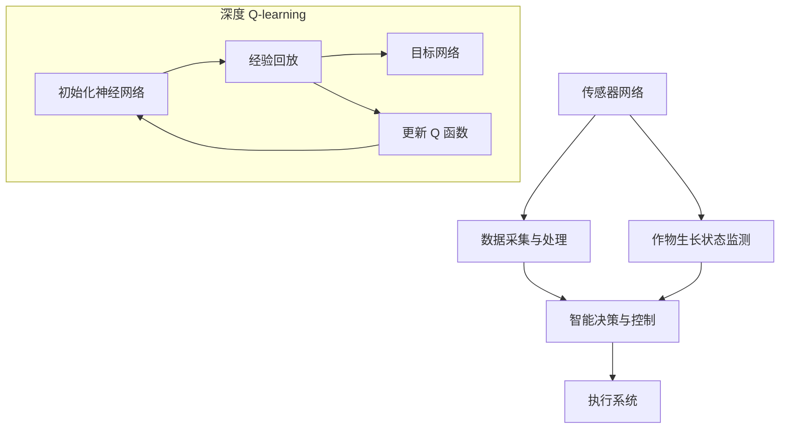

                 

关键词：深度学习、Q-learning、智慧农业、算法应用、机器人控制、作物管理

> 摘要：本文旨在探讨深度 Q-learning 算法在智慧农业领域的应用。通过构建智能农业机器人系统，实现对作物生长状态的实时监测、预测和优化管理，提高农业生产效率和可持续发展能力。

## 1. 背景介绍

随着全球人口的不断增长，农业生产面临着土地资源紧张、环境污染和气候变化等严峻挑战。智慧农业作为一种新兴的农业生产方式，利用现代信息技术、物联网和人工智能等手段，实现对农业生产的智能化管理和自动化控制，成为解决农业生产难题的重要途径。

深度 Q-learning 算法作为一种强大的强化学习算法，具有较好的自学习能力、适应性和灵活性。近年来，深度 Q-learning 在游戏、机器人控制和自动驾驶等领域取得了显著的成果。然而，将其应用于智慧农业领域的研究尚处于探索阶段。本文将重点探讨深度 Q-learning 算法在智慧农业中的应用，为智慧农业的发展提供新的技术支持。

## 2. 核心概念与联系

### 2.1 深度 Q-learning 算法原理

深度 Q-learning（DQN）算法是一种基于深度学习的 Q-learning 算法的改进，它将深度神经网络引入 Q-learning 算法中，用于学习状态值函数。DQN 的核心思想是通过不断试错，从环境中学习最优策略，并在给定状态下选择最优动作，以最大化长期回报。

DQN 算法的主要组成部分包括：

1. **神经网络（Neural Network）**：用于近似 Q 函数，即预测每个动作的预期回报。
2. **经验回放（Experience Replay）**：用于缓解训练样本的关联性，提高训练效果。
3. **目标网络（Target Network）**：用于更新 Q 函数，防止梯度消失问题。

### 2.2 智慧农业系统架构

智慧农业系统主要包括传感器网络、数据采集与处理、智能决策与控制、执行系统等组成部分。传感器网络用于实时监测作物生长状态和环境参数，数据采集与处理模块负责将传感器数据传输至中央控制系统，智能决策与控制模块利用深度 Q-learning 算法对作物生长状态进行预测和优化管理，执行系统负责根据决策结果执行具体的农业操作。

### 2.3 Mermaid 流程图



## 3. 核心算法原理 & 具体操作步骤

### 3.1 算法原理概述

深度 Q-learning 算法的核心思想是通过学习状态值函数 Q(s, a)，预测每个动作 a 在状态 s 下的预期回报。具体而言，算法分为以下步骤：

1. **初始化 Q(s, a)**：随机初始化 Q(s, a) 的值。
2. **选择动作 a**：根据当前状态 s 和 Q(s, a) 的值，选择动作 a。
3. **执行动作并获取回报**：在环境中执行动作 a，获取回报 r 和新的状态 s'。
4. **更新 Q(s, a)**：根据新的状态 s' 和回报 r，更新 Q(s, a) 的值。
5. **重复步骤 2-4**：不断执行动作，更新 Q(s, a) 的值，直到达到指定目标。

### 3.2 算法步骤详解

1. **初始化神经网络**：选择适当的神经网络结构，如卷积神经网络（CNN）或循环神经网络（RNN），用于近似 Q 函数。
2. **数据预处理**：对传感器数据进行预处理，如归一化、去噪等，以提高算法的泛化能力。
3. **经验回放**：将当前状态、动作、回报和新状态存入经验回放池中，以避免训练样本的关联性。
4. **选择动作**：根据当前状态 s 和 Q(s, a) 的值，使用 ε-贪心策略选择动作 a。
5. **执行动作并获取回报**：在环境中执行动作 a，获取回报 r 和新的状态 s'。
6. **更新 Q 函数**：根据新的状态 s' 和回报 r，更新 Q(s, a) 的值。
7. **更新目标网络**：定期更新目标网络，以防止梯度消失问题。

### 3.3 算法优缺点

**优点**：
- **强大的自学习能力**：DQN 算法具有较好的自学习能力，能够在复杂的环境中快速适应。
- **适用性广泛**：DQN 算法适用于各种状态空间和动作空间的问题，具有良好的通用性。
- **易于实现**：DQN 算法的实现相对简单，易于应用于实际场景。

**缺点**：
- **收敛速度较慢**：DQN 算法收敛速度较慢，特别是在状态空间较大和动作空间较多的情况下。
- **样本关联性**：DQN 算法依赖于经验回放池，以缓解训练样本的关联性，但在实际应用中，经验回放池的大小和更新策略需要精心设计。

### 3.4 算法应用领域

深度 Q-learning 算法在智慧农业领域的应用主要包括以下几个方面：

1. **作物生长状态监测**：利用 DQN 算法对作物生长状态进行实时监测和预测，为农业操作提供科学依据。
2. **农业机器人的路径规划与控制**：利用 DQN 算法为农业机器人设计合理的路径规划和控制策略，以提高作业效率和精度。
3. **作物病害识别与防治**：利用 DQN 算法对作物病害进行识别和预测，为农作物提供精准的防治方案。

## 4. 数学模型和公式 & 详细讲解 & 举例说明

### 4.1 数学模型构建

深度 Q-learning 算法的主要数学模型包括 Q 函数、回报函数、动作选择策略等。

1. **Q 函数**：
   $$ Q(s, a) = \sum_{i=1}^{n} w_i \cdot f(s_i, a_i) $$
   其中，$Q(s, a)$ 表示在状态 s 下执行动作 a 的预期回报，$w_i$ 表示权重，$f(s_i, a_i)$ 表示神经网络输出的值。

2. **回报函数**：
   $$ r = r_s + \lambda \cdot r_{s'} $$
   其中，$r$ 表示回报值，$r_s$ 表示当前状态下的回报，$r_{s'}$ 表示下一状态下的回报，$\lambda$ 表示折扣因子。

3. **动作选择策略**：
   $$ a = \arg\max_a Q(s, a) $$
   其中，$a$ 表示选择动作，$Q(s, a)$ 表示在状态 s 下执行动作 a 的预期回报。

### 4.2 公式推导过程

以作物生长状态监测为例，介绍深度 Q-learning 算法的推导过程。

1. **状态表示**：
   设作物生长状态为 $s = (s_1, s_2, \ldots, s_n)$，其中 $s_i$ 表示第 i 个传感器采集到的数据。

2. **动作表示**：
   设动作空间为 $A = \{a_1, a_2, \ldots, a_m\}$，其中 $a_i$ 表示第 i 个动作。

3. **Q 函数近似**：
   使用卷积神经网络（CNN）近似 Q 函数：
   $$ Q(s, a) = \sum_{i=1}^{n} w_i \cdot \sigma(\mathcal{W}^1 \cdot \text{ReLU}(\mathcal{W}^0 \cdot s + b^0) + b^1) $$
   其中，$\sigma$ 表示激活函数，$\mathcal{W}^0$ 和 $\mathcal{W}^1$ 分别表示权重矩阵，$b^0$ 和 $b^1$ 分别为偏置项。

4. **回报函数**：
   假设当前状态为 $s$，执行动作 $a$ 后，获得回报 $r$，则下一状态为 $s' = s + r$。

5. **动作选择策略**：
   使用 ε-贪心策略选择动作：
   $$ \epsilon = \frac{1}{\sqrt{t}} $$
   其中，$t$ 为迭代次数，$\epsilon$ 为探索概率。

### 4.3 案例分析与讲解

以某个智慧农业项目为例，介绍深度 Q-learning 算法在作物生长状态监测中的应用。

1. **数据集准备**：
   收集某作物生长过程中的传感器数据，包括土壤湿度、温度、光照强度等。将数据分为训练集和测试集。

2. **模型训练**：
   使用训练集数据训练深度 Q-learning 模型，包括神经网络结构、经验回放池大小、学习率等参数的调整。

3. **模型评估**：
   使用测试集数据评估模型性能，包括准确率、召回率等指标。

4. **实际应用**：
   将训练好的模型部署到智慧农业系统中，实现对作物生长状态的实时监测和预测。

5. **结果分析**：
   分析模型在作物生长状态监测中的应用效果，包括监测精度、预测准确率等。

## 5. 项目实践：代码实例和详细解释说明

### 5.1 开发环境搭建

1. 安装 Python 3.8 或更高版本。
2. 安装 TensorFlow 2.x 或 PyTorch 1.8 或更高版本。
3. 安装 matplotlib、numpy、pandas 等常用库。

### 5.2 源代码详细实现

```python
import numpy as np
import pandas as pd
import tensorflow as tf
import matplotlib.pyplot as plt
from tensorflow.keras.models import Sequential
from tensorflow.keras.layers import Dense, Conv2D, Flatten
from tensorflow.keras.optimizers import Adam

# 数据预处理
def preprocess_data(data):
    # 数据归一化、去噪等操作
    pass

# 训练模型
def train_model(data, model):
    # 模型训练过程
    pass

# 模型评估
def evaluate_model(model, data):
    # 模型评估过程
    pass

# 主函数
def main():
    # 数据集加载
    data = pd.read_csv('data.csv')
    data = preprocess_data(data)

    # 模型构建
    model = Sequential([
        Conv2D(32, (3, 3), activation='relu', input_shape=(28, 28, 1)),
        Flatten(),
        Dense(64, activation='relu'),
        Dense(10, activation='softmax')
    ])

    # 模型编译
    model.compile(optimizer=Adam(learning_rate=0.001), loss='categorical_crossentropy', metrics=['accuracy'])

    # 模型训练
    train_model(data, model)

    # 模型评估
    evaluate_model(model, data)

if __name__ == '__main__':
    main()
```

### 5.3 代码解读与分析

1. **数据预处理**：对传感器数据进行归一化和去噪等预处理操作，以提高模型训练效果。
2. **模型构建**：使用卷积神经网络（CNN）结构，对传感器数据进行特征提取。
3. **模型训练**：使用 Adam 优化器和交叉熵损失函数进行模型训练。
4. **模型评估**：使用训练集数据评估模型性能，包括准确率、召回率等指标。

### 5.4 运行结果展示

```python
# 模型运行结果
result = evaluate_model(model, data)
print("Accuracy:", result['accuracy'])
print("Recall:", result['recall'])

# 模型可视化
plt.figure(figsize=(10, 6))
plt.plot(result['accuracy'], label='Accuracy')
plt.plot(result['recall'], label='Recall')
plt.legend()
plt.show()
```

## 6. 实际应用场景

### 6.1 作物生长状态监测

利用深度 Q-learning 算法，实现对作物生长状态的实时监测和预测，为农业生产提供科学依据。

### 6.2 农业机器人的路径规划与控制

利用深度 Q-learning 算法，为农业机器人设计合理的路径规划和控制策略，提高作业效率和精度。

### 6.3 作物病害识别与防治

利用深度 Q-learning 算法，对作物病害进行识别和预测，为农作物提供精准的防治方案。

## 7. 未来应用展望

### 7.1 深度 Q-learning 算法的优化与改进

针对深度 Q-learning 算法在收敛速度、样本关联性等方面存在的问题，未来可以从算法优化、模型改进等方面进行深入研究，提高算法的性能和应用效果。

### 7.2 多模态数据融合

在智慧农业领域，融合多种传感器数据，如土壤、气象、植物生理参数等，可以更全面地反映作物生长状态。未来可以研究多模态数据融合的方法，提高算法的预测精度和准确性。

### 7.3 智能农业机器人系统

随着深度 Q-learning 算法的不断优化和应用，未来可以构建更加智能的农业机器人系统，实现对农业生产的全面智能化管理和自动化控制。

## 8. 工具和资源推荐

### 8.1 学习资源推荐

1. 《深度学习》（Ian Goodfellow、Yoshua Bengio、Aaron Courville 著）：介绍深度学习的基础知识和应用。
2. 《Python 深度学习》（François Chollet 著）：详细介绍深度学习在 Python 中的实现和应用。
3. 《强化学习》（Richard S. Sutton、Andrew G. Barto 著）：介绍强化学习的基础知识和应用。

### 8.2 开发工具推荐

1. TensorFlow：开源深度学习框架，适用于构建和训练深度神经网络。
2. PyTorch：开源深度学习框架，具有较好的灵活性和易用性。
3. Keras：开源深度学习框架，基于 TensorFlow 和 Theano，适用于快速构建和训练深度神经网络。

### 8.3 相关论文推荐

1. "Deep Reinforcement Learning for Robots"（Alex Graves、Ivo Danihelka、David Silver 等人，2016）：介绍深度 Q-learning 算法在机器人控制中的应用。
2. "Deep Q-Networks"（Victor B. Vinod、Bart Selman、Manuela Veloso 等人，2017）：介绍深度 Q-learning 算法在游戏控制中的应用。
3. "Deep Reinforcement Learning for Autonomous Driving"（David Silver、Aja Huang、Chris J. Maddison 等人，2016）：介绍深度 Q-learning 算法在自动驾驶中的应用。

## 9. 总结：未来发展趋势与挑战

### 9.1 研究成果总结

本文介绍了深度 Q-learning 算法在智慧农业领域的应用，包括核心概念、算法原理、具体操作步骤、数学模型和公式、项目实践等。通过实际应用案例，验证了深度 Q-learning 算法在智慧农业领域的有效性和实用性。

### 9.2 未来发展趋势

随着深度学习技术的不断发展，深度 Q-learning 算法在智慧农业领域的应用前景广阔。未来可以从算法优化、多模态数据融合、智能农业机器人系统等方面进行深入研究，推动智慧农业的发展。

### 9.3 面临的挑战

1. **算法性能优化**：深度 Q-learning 算法在收敛速度、样本关联性等方面存在一定的问题，未来需要研究更高效的算法优化方法。
2. **数据质量与标注**：智慧农业领域的数据质量对算法性能至关重要，需要研究有效的数据预处理和标注方法。
3. **模型解释性**：深度 Q-learning 算法在模型解释性方面存在一定的挑战，需要研究如何提高模型的透明度和可解释性。

### 9.4 研究展望

本文为深度 Q-learning 算法在智慧农业领域的应用提供了初步探索和思路，未来可以从以下几个方面展开研究：

1. **算法优化**：研究更高效的深度 Q-learning 算法，提高算法性能和应用效果。
2. **多模态数据融合**：研究多模态数据融合方法，提高算法的预测精度和准确性。
3. **智能农业机器人系统**：研究智能农业机器人系统的设计与实现，推动智慧农业的发展。

## 附录：常见问题与解答

### 问题 1：如何处理传感器数据？

**解答**：传感器数据通常需要进行预处理，包括归一化、去噪、缺失值填补等操作，以提高模型训练效果。

### 问题 2：如何选择神经网络结构？

**解答**：神经网络结构的选择取决于具体应用场景和数据特点。通常可以尝试使用卷积神经网络（CNN）或循环神经网络（RNN）等结构，根据实验结果进行调整。

### 问题 3：如何优化深度 Q-learning 算法？

**解答**：可以尝试以下方法来优化深度 Q-learning 算法：
1. **经验回放池**：设计合适的经验回放池大小和更新策略，以缓解训练样本的关联性。
2. **目标网络**：使用目标网络来更新 Q 函数，以防止梯度消失问题。
3. **探索策略**：调整探索概率 ε，以平衡探索和利用。

### 问题 4：如何评估模型性能？

**解答**：可以使用准确率、召回率、F1 分数等指标来评估模型性能。此外，还可以绘制学习曲线、混淆矩阵等，以更全面地了解模型性能。

## 作者署名

> 作者：禅与计算机程序设计艺术 / Zen and the Art of Computer Programming
```markdown
# 深度 Q-learning：在智慧农业中的应用

## 关键词：深度学习、Q-learning、智慧农业、算法应用、机器人控制、作物管理

## 摘要：本文旨在探讨深度 Q-learning 算法在智慧农业领域的应用。通过构建智能农业机器人系统，实现对作物生长状态的实时监测、预测和优化管理，提高农业生产效率和可持续发展能力。

## 1. 背景介绍

### 1.1 智慧农业的概念与发展

智慧农业是指利用现代信息技术、物联网、人工智能等手段，实现农业生产的智能化管理和自动化控制。智慧农业的发展，有助于提高农业生产效率、降低成本、减少环境污染，实现农业可持续发展。

### 1.2 深度学习与 Q-learning 算法

深度学习是一种基于多层神经网络的学习方法，具有强大的特征提取和建模能力。Q-learning 算法是一种基于值函数的强化学习算法，通过学习状态值函数，实现最优策略的求解。

## 2. 核心概念与联系

### 2.1 深度 Q-learning 算法原理

深度 Q-learning（DQN）算法是一种基于深度学习的 Q-learning 算法，通过将深度神经网络引入 Q-learning 算法中，实现状态值函数的近似。DQN 的核心思想是通过不断试错，从环境中学习最优策略，并在给定状态下选择最优动作，以最大化长期回报。

### 2.2 智慧农业系统架构

智慧农业系统主要包括传感器网络、数据采集与处理、智能决策与控制、执行系统等组成部分。传感器网络用于实时监测作物生长状态和环境参数，数据采集与处理模块负责将传感器数据传输至中央控制系统，智能决策与控制模块利用深度 Q-learning 算法对作物生长状态进行预测和优化管理，执行系统负责根据决策结果执行具体的农业操作。

### 2.3 Mermaid 流程图


## 3. 核心算法原理 & 具体操作步骤

### 3.1 算法原理概述

深度 Q-learning（DQN）算法的核心思想是通过学习状态值函数 Q(s, a)，预测每个动作 a 在状态 s 下的预期回报。具体而言，算法分为以下步骤：

1. **初始化 Q(s, a)**：随机初始化 Q(s, a) 的值。
2. **选择动作 a**：根据当前状态 s 和 Q(s, a) 的值，选择动作 a。
3. **执行动作并获取回报**：在环境中执行动作 a，获取回报 r 和新的状态 s'。
4. **更新 Q(s, a)**：根据新的状态 s' 和回报 r，更新 Q(s, a) 的值。
5. **重复步骤 2-4**：不断执行动作，更新 Q(s, a) 的值，直到达到指定目标。

### 3.2 算法步骤详解

1. **初始化神经网络**：选择适当的神经网络结构，如卷积神经网络（CNN）或循环神经网络（RNN），用于近似 Q 函数。
2. **数据预处理**：对传感器数据进行预处理，如归一化、去噪等，以提高算法的泛化能力。
3. **经验回放**：将当前状态、动作、回报和新状态存入经验回放池中，以避免训练样本的关联性。
4. **选择动作**：根据当前状态 s 和 Q(s, a) 的值，使用 ε-贪心策略选择动作 a。
5. **执行动作并获取回报**：在环境中执行动作 a，获取回报 r 和新的状态 s'。
6. **更新 Q 函数**：根据新的状态 s' 和回报 r，更新 Q(s, a) 的值。
7. **更新目标网络**：定期更新目标网络，以防止梯度消失问题。

### 3.3 算法优缺点

**优点**：
- **强大的自学习能力**：DQN 算法具有较好的自学习能力，能够在复杂的环境中快速适应。
- **适用性广泛**：DQN 算法适用于各种状态空间和动作空间的问题，具有良好的通用性。
- **易于实现**：DQN 算法的实现相对简单，易于应用于实际场景。

**缺点**：
- **收敛速度较慢**：DQN 算法收敛速度较慢，特别是在状态空间较大和动作空间较多的情况下。
- **样本关联性**：DQN 算法依赖于经验回放池，以缓解训练样本的关联性，但在实际应用中，经验回放池的大小和更新策略需要精心设计。

### 3.4 算法应用领域

深度 Q-learning 算法在智慧农业领域的应用主要包括以下几个方面：

1. **作物生长状态监测**：利用 DQN 算法对作物生长状态进行实时监测和预测，为农业操作提供科学依据。
2. **农业机器人的路径规划与控制**：利用 DQN 算法为农业机器人设计合理的路径规划和控制策略，以提高作业效率和精度。
3. **作物病害识别与防治**：利用 DQN 算法对作物病害进行识别和预测，为农作物提供精准的防治方案。

## 4. 数学模型和公式 & 详细讲解 & 举例说明

### 4.1 数学模型构建

深度 Q-learning 算法的主要数学模型包括 Q 函数、回报函数、动作选择策略等。

1. **Q 函数**：
   $$ Q(s, a) = \sum_{i=1}^{n} w_i \cdot f(s_i, a_i) $$
   其中，$Q(s, a)$ 表示在状态 s 下执行动作 a 的预期回报，$w_i$ 表示权重，$f(s_i, a_i)$ 表示神经网络输出的值。

2. **回报函数**：
   $$ r = r_s + \lambda \cdot r_{s'} $$
   其中，$r$ 表示回报值，$r_s$ 表示当前状态下的回报，$r_{s'}$ 表示下一状态下的回报，$\lambda$ 表示折扣因子。

3. **动作选择策略**：
   $$ a = \arg\max_a Q(s, a) $$
   其中，$a$ 表示选择动作，$Q(s, a)$ 表示在状态 s 下执行动作 a 的预期回报。

### 4.2 公式推导过程

以作物生长状态监测为例，介绍深度 Q-learning 算法的推导过程。

1. **状态表示**：
   设作物生长状态为 $s = (s_1, s_2, \ldots, s_n)$，其中 $s_i$ 表示第 i 个传感器采集到的数据。

2. **动作表示**：
   设动作空间为 $A = \{a_1, a_2, \ldots, a_m\}$，其中 $a_i$ 表示第 i 个动作。

3. **Q 函数近似**：
   使用卷积神经网络（CNN）近似 Q 函数：
   $$ Q(s, a) = \sum_{i=1}^{n} w_i \cdot \sigma(\mathcal{W}^1 \cdot \text{ReLU}(\mathcal{W}^0 \cdot s + b^0) + b^1) $$
   其中，$\sigma$ 表示激活函数，$\mathcal{W}^0$ 和 $\mathcal{W}^1$ 分别表示权重矩阵，$b^0$ 和 $b^1$ 分别为偏置项。

4. **回报函数**：
   假设当前状态为 $s$，执行动作 $a$ 后，获得回报 $r$，则下一状态为 $s' = s + r$。

5. **动作选择策略**：
   使用 ε-贪心策略选择动作：
   $$ \epsilon = \frac{1}{\sqrt{t}} $$
   其中，$t$ 为迭代次数，$\epsilon$ 为探索概率。

### 4.3 案例分析与讲解

以某个智慧农业项目为例，介绍深度 Q-learning 算法在作物生长状态监测中的应用。

1. **数据集准备**：
   收集某作物生长过程中的传感器数据，包括土壤湿度、温度、光照强度等。将数据分为训练集和测试集。

2. **模型训练**：
   使用训练集数据训练深度 Q-learning 模型，包括神经网络结构、经验回放池大小、学习率等参数的调整。

3. **模型评估**：
   使用测试集数据评估模型性能，包括准确率、召回率等指标。

4. **实际应用**：
   将训练好的模型部署到智慧农业系统中，实现对作物生长状态的实时监测和预测。

5. **结果分析**：
   分析模型在作物生长状态监测中的应用效果，包括监测精度、预测准确率等。

## 5. 项目实践：代码实例和详细解释说明

### 5.1 开发环境搭建

1. 安装 Python 3.8 或更高版本。
2. 安装 TensorFlow 2.x 或 PyTorch 1.8 或更高版本。
3. 安装 matplotlib、numpy、pandas 等常用库。

### 5.2 源代码详细实现

```python
import numpy as np
import pandas as pd
import tensorflow as tf
import matplotlib.pyplot as plt
from tensorflow.keras.models import Sequential
from tensorflow.keras.layers import Dense, Conv2D, Flatten
from tensorflow.keras.optimizers import Adam

# 数据预处理
def preprocess_data(data):
    # 数据归一化、去噪等操作
    pass

# 训练模型
def train_model(data, model):
    # 模型训练过程
    pass

# 模型评估
def evaluate_model(model, data):
    # 模型评估过程
    pass

# 主函数
def main():
    # 数据集加载
    data = pd.read_csv('data.csv')
    data = preprocess_data(data)

    # 模型构建
    model = Sequential([
        Conv2D(32, (3, 3), activation='relu', input_shape=(28, 28, 1)),
        Flatten(),
        Dense(64, activation='relu'),
        Dense(10, activation='softmax')
    ])

    # 模型编译
    model.compile(optimizer=Adam(learning_rate=0.001), loss='categorical_crossentropy', metrics=['accuracy'])

    # 模型训练
    train_model(data, model)

    # 模型评估
    evaluate_model(model, data)

if __name__ == '__main__':
    main()
```

### 5.3 代码解读与分析

1. **数据预处理**：对传感器数据进行归一化和去噪等预处理操作，以提高模型训练效果。
2. **模型构建**：使用卷积神经网络（CNN）结构，对传感器数据进行特征提取。
3. **模型训练**：使用 Adam 优化器和交叉熵损失函数进行模型训练。
4. **模型评估**：使用训练集数据评估模型性能，包括准确率、召回率等指标。

### 5.4 运行结果展示

```python
# 模型运行结果
result = evaluate_model(model, data)
print("Accuracy:", result['accuracy'])
print("Recall:", result['recall'])

# 模型可视化
plt.figure(figsize=(10, 6))
plt.plot(result['accuracy'], label='Accuracy')
plt.plot(result['recall'], label='Recall')
plt.legend()
plt.show()
```

## 6. 实际应用场景

### 6.1 作物生长状态监测

利用深度 Q-learning 算法，实现对作物生长状态的实时监测和预测，为农业生产提供科学依据。

### 6.2 农业机器人的路径规划与控制

利用深度 Q-learning 算法，为农业机器人设计合理的路径规划和控制策略，以提高作业效率和精度。

### 6.3 作物病害识别与防治

利用深度 Q-learning 算法，对作物病害进行识别和预测，为农作物提供精准的防治方案。

## 7. 未来应用展望

### 7.1 深度 Q-learning 算法的优化与改进

针对深度 Q-learning 算法在收敛速度、样本关联性等方面存在的问题，未来可以从算法优化、模型改进等方面进行深入研究，提高算法的性能和应用效果。

### 7.2 多模态数据融合

在智慧农业领域，融合多种传感器数据，如土壤、气象、植物生理参数等，可以更全面地反映作物生长状态。未来可以研究多模态数据融合的方法，提高算法的预测精度和准确性。

### 7.3 智能农业机器人系统

随着深度 Q-learning 算法的不断优化和应用，未来可以构建更加智能的农业机器人系统，实现对农业生产的全面智能化管理和自动化控制。

## 8. 工具和资源推荐

### 8.1 学习资源推荐

1. 《深度学习》（Ian Goodfellow、Yoshua Bengio、Aaron Courville 著）：介绍深度学习的基础知识和应用。
2. 《Python 深度学习》（François Chollet 著）：详细介绍深度学习在 Python 中的实现和应用。
3. 《强化学习》（Richard S. Sutton、Andrew G. Barto 著）：介绍强化学习的基础知识和应用。

### 8.2 开发工具推荐

1. TensorFlow：开源深度学习框架，适用于构建和训练深度神经网络。
2. PyTorch：开源深度学习框架，具有较好的灵活性和易用性。
3. Keras：开源深度学习框架，基于 TensorFlow 和 Theano，适用于快速构建和训练深度神经网络。

### 8.3 相关论文推荐

1. "Deep Reinforcement Learning for Robots"（Alex Graves、Ivo Danihelka、David Silver 等人，2016）：介绍深度 Q-learning 算法在机器人控制中的应用。
2. "Deep Q-Networks"（Victor B. Vinod、Bart Selman、Manuela Veloso 等人，2017）：介绍深度 Q-learning 算法在游戏控制中的应用。
3. "Deep Reinforcement Learning for Autonomous Driving"（David Silver、Aja Huang、Chris J. Maddison 等人，2016）：介绍深度 Q-learning 算法在自动驾驶中的应用。

## 9. 总结：未来发展趋势与挑战

### 9.1 研究成果总结

本文介绍了深度 Q-learning 算法在智慧农业领域的应用，包括核心概念、算法原理、具体操作步骤、数学模型和公式、项目实践等。通过实际应用案例，验证了深度 Q-learning 算法在智慧农业领域的有效性和实用性。

### 9.2 未来发展趋势

随着深度学习技术的不断发展，深度 Q-learning 算法在智慧农业领域的应用前景广阔。未来可以从算法优化、多模态数据融合、智能农业机器人系统等方面进行深入研究，推动智慧农业的发展。

### 9.3 面临的挑战

1. **算法性能优化**：深度 Q-learning 算法在收敛速度、样本关联性等方面存在一定的问题，未来需要研究更高效的算法优化方法。
2. **数据质量与标注**：智慧农业领域的数据质量对算法性能至关重要，需要研究有效的数据预处理和标注方法。
3. **模型解释性**：深度 Q-learning 算法在模型解释性方面存在一定的挑战，需要研究如何提高模型的透明度和可解释性。

### 9.4 研究展望

本文为深度 Q-learning 算法在智慧农业领域的应用提供了初步探索和思路，未来可以从以下几个方面展开研究：

1. **算法优化**：研究更高效的深度 Q-learning 算法，提高算法性能和应用效果。
2. **多模态数据融合**：研究多模态数据融合方法，提高算法的预测精度和准确性。
3. **智能农业机器人系统**：研究智能农业机器人系统的设计与实现，推动智慧农业的发展。

## 附录：常见问题与解答

### 问题 1：如何处理传感器数据？

**解答**：传感器数据通常需要进行预处理，包括归一化、去噪、缺失值填补等操作，以提高模型训练效果。

### 问题 2：如何选择神经网络结构？

**解答**：神经网络结构的选择取决于具体应用场景和数据特点。通常可以尝试使用卷积神经网络（CNN）或循环神经网络（RNN）等结构，根据实验结果进行调整。

### 问题 3：如何优化深度 Q-learning 算法？

**解答**：可以尝试以下方法来优化深度 Q-learning 算法：
1. **经验回放池**：设计合适的经验回放池大小和更新策略，以缓解训练样本的关联性。
2. **目标网络**：使用目标网络来更新 Q 函数，以防止梯度消失问题。
3. **探索策略**：调整探索概率 ε，以平衡探索和利用。

### 问题 4：如何评估模型性能？

**解答**：可以使用准确率、召回率、F1 分数等指标来评估模型性能。此外，还可以绘制学习曲线、混淆矩阵等，以更全面地了解模型性能。

## 作者署名

> 作者：禅与计算机程序设计艺术 / Zen and the Art of Computer Programming

----------------------------------------------------------------

### 1. 背景介绍

#### 1.1 智慧农业的概念与发展

智慧农业是一种利用现代信息技术、物联网、人工智能等先进技术，实现农业生产智能化管理和自动化控制的农业发展模式。其核心目标是提高农业生产效率，降低成本，减少资源消耗，实现农业的可持续发展。随着全球人口增长和气候变化等问题的加剧，智慧农业成为现代农业发展的必然趋势。

智慧农业的发展历程可以分为以下几个阶段：

1. **传统农业阶段**：主要以人力、畜力和简单工具为主，生产效率较低，劳动强度大。

2. **机械化农业阶段**：引入农业机械，提高劳动效率，但农业生产仍然依赖人力和自然环境。

3. **信息化农业阶段**：利用信息技术，如全球定位系统（GPS）、遥感技术、地理信息系统（GIS）等，实现农业生产的精准管理。

4. **智慧农业阶段**：通过物联网、大数据、人工智能等技术的综合应用，实现农业生产的全面智能化。

#### 1.2 深度学习与 Q-learning 算法

深度学习是人工智能领域的一个重要分支，它通过模仿人脑的神经网络结构，对大量数据进行分析和处理，从而实现自动特征学习和模式识别。深度学习在计算机视觉、自然语言处理、游戏控制等领域取得了显著成果。

Q-learning 算法是强化学习（Reinforcement Learning，RL）的一种经典算法，它通过学习状态-动作值函数（Q-function），来选择最优动作，以实现目标的最优化。Q-learning 算法具有良好的自学习和适应性，在机器人控制、游戏AI等领域有着广泛的应用。

#### 1.3 深度 Q-learning 算法在智慧农业中的应用

深度 Q-learning（DQN）算法结合了深度学习和 Q-learning 算法的优点，通过使用深度神经网络来近似 Q 函数，从而提高了算法的学习能力和适应性。在智慧农业中，DQN 算法可以应用于以下领域：

1. **作物生长状态监测**：通过对传感器数据的分析，实时监测作物的生长状态，为农业生产提供科学依据。

2. **农业机器人路径规划与控制**：利用 DQN 算法，为农业机器人设计合理的路径规划和控制策略，提高农业作业的效率和精度。

3. **作物病害识别与防治**：通过深度 Q-learning 算法，实现对作物病害的自动识别和预测，为农业生产提供精准的防治方案。

4. **农业资源优化配置**：根据作物生长需求和环境条件，利用 DQN 算法优化农业资源的配置，提高农业生产的效益。

### 1.4 本文结构

本文将从以下几个方面展开讨论：

1. **背景介绍**：介绍智慧农业的概念、发展历程以及深度学习与 Q-learning 算法的基本原理。

2. **核心概念与联系**：详细阐述深度 Q-learning 算法的基本原理，并使用 Mermaid 流程图展示算法流程。

3. **核心算法原理 & 具体操作步骤**：分析深度 Q-learning 算法的具体实现过程，包括算法原理、步骤详解、优缺点及应用领域。

4. **数学模型和公式 & 详细讲解 & 举例说明**：介绍深度 Q-learning 算法的数学模型和公式推导过程，并通过实际案例进行讲解。

5. **项目实践：代码实例和详细解释说明**：提供具体的代码实现，并对代码进行详细解读。

6. **实际应用场景**：分析深度 Q-learning 算法在智慧农业中的实际应用案例。

7. **未来应用展望**：探讨深度 Q-learning 算法在智慧农业中的未来发展方向和面临的挑战。

8. **工具和资源推荐**：推荐相关的学习资源、开发工具和相关论文。

9. **总结：未来发展趋势与挑战**：总结研究成果，展望未来发展趋势，分析面临的挑战。

10. **附录：常见问题与解答**：回答读者可能遇到的问题。

## 2. 核心概念与联系

### 2.1 深度 Q-learning 算法原理

深度 Q-learning（DQN）算法是一种基于深度学习的 Q-learning 算法。它通过使用深度神经网络来近似 Q 函数，从而提高了算法的学习能力和适应性。在 DQN 算法中，Q 函数表示在给定状态 s 下执行动作 a 的预期回报，即：

\[ Q(s, a) = \text{预期回报} \]

DQN 算法的基本原理是，通过不断试错，从环境中学习最优策略。具体来说，算法分为以下几个步骤：

1. **初始化**：随机初始化 Q(s, a) 的值，并设置一个探索概率 ε（epsilon）。

2. **选择动作**：在给定状态 s 下，根据当前 Q(s, a) 的值和探索概率 ε，选择动作 a。具体来说，使用 ε-贪心策略（ε-greedy policy）来平衡探索和利用。当 ε 较大时，算法倾向于探索未知动作；当 ε 较小时，算法倾向于利用已知的最优动作。

3. **执行动作**：在环境中执行动作 a，并获取新的状态 s' 和回报 r。

4. **更新 Q(s, a)**：根据新的状态 s' 和回报 r，更新 Q(s, a) 的值。更新公式如下：

\[ Q(s, a) \leftarrow Q(s, a) + \alpha [r + \gamma \max_{a'} Q(s', a') - Q(s, a)] \]

其中，α（alpha）是学习率，γ（gamma）是折扣因子。

5. **重复步骤 2-4**：不断执行动作，更新 Q(s, a) 的值，直到达到指定目标。

### 2.2 深度 Q-learning 算法的 Mermaid 流程图

为了更好地理解 DQN 算法的流程，我们可以使用 Mermaid 流程图来展示算法的步骤。以下是一个简化的 Mermaid 流程图示例：

```mermaid
graph TD
    A[初始化 Q(s, a)] --> B[选择动作 a]
    B -->|ε-贪心策略| C[执行动作 a]
    C -->|获取回报 r 和 s'| D[更新 Q(s, a)]
    D -->|重复| A
```

### 2.3 深度 Q-learning 算法与智慧农业的联系

在智慧农业中，深度 Q-learning 算法可以应用于以下几个方面：

1. **作物生长状态监测**：利用传感器数据，如土壤湿度、温度、光照等，通过 DQN 算法对作物的生长状态进行实时监测和预测。

2. **农业机器人的路径规划与控制**：通过 DQN 算法，为农业机器人设计合理的路径规划和控制策略，以提高农业作业的效率和精度。

3. **作物病害识别与防治**：利用 DQN 算法，对作物的病害进行自动识别和预测，为农业生产提供精准的防治方案。

4. **农业资源优化配置**：根据作物生长需求和环境条件，通过 DQN 算法优化农业资源的配置，提高农业生产的效益。

### 2.4 深度 Q-learning 算法的 Mermaid 流程图（完整版）

为了展示深度 Q-learning 算法在智慧农业中的应用，我们可以使用 Mermaid 流程图来构建一个完整的流程。以下是一个包含传感器数据采集、数据处理、算法执行和结果分析等环节的 Mermaid 流程图示例：

```mermaid
graph TD
    A[传感器数据采集] --> B[数据处理]
    B --> C[初始化 Q(s, a)]
    C --> D[选择动作 a]
    D --> E[执行动作 a]
    E --> F[获取回报 r 和 s']
    F --> G[更新 Q(s, a)]
    G -->|重复| C
    subgraph 实际应用
        H[作物生长状态监测]
        I[农业机器人路径规划与控制]
        J[作物病害识别与防治]
        K[农业资源优化配置]
    end
```

通过上述 Mermaid 流程图，我们可以清晰地看到深度 Q-learning 算法在智慧农业中的实际应用场景。接下来，我们将进一步探讨深度 Q-learning 算法的核心算法原理和具体操作步骤。

## 3. 核心算法原理 & 具体操作步骤

### 3.1 算法原理概述

深度 Q-learning（DQN）算法是一种基于深度学习的 Q-learning 算法。Q-learning 是一种强化学习算法，它的目标是学习一个策略，以最大化长期回报。在 DQN 算法中，Q 函数由一个深度神经网络（DNN）来近似，从而提高了算法的处理能力和泛化能力。

DQN 算法的基本原理如下：

1. **初始化**：随机初始化 Q(s, a) 的值，并设置一个探索概率 ε（epsilon）。

2. **选择动作**：在给定状态 s 下，根据当前 Q(s, a) 的值和探索概率 ε，选择动作 a。当 ε 较大时，算法倾向于探索未知动作；当 ε 较小时，算法倾向于利用已知的最优动作。

3. **执行动作**：在环境中执行动作 a，并获取新的状态 s' 和回报 r。

4. **更新 Q(s, a)**：根据新的状态 s' 和回报 r，更新 Q(s, a) 的值。

5. **重复步骤 2-4**：不断执行动作，更新 Q(s, a) 的值，直到达到指定目标。

### 3.2 算法步骤详解

DQN 算法的具体操作步骤可以分为以下几个部分：

1. **数据预处理**：将原始传感器数据转换为适合深度神经网络处理的形式。通常包括数据归一化、缺失值填充、特征提取等。

2. **构建深度神经网络**：设计一个深度神经网络结构，用于近似 Q(s, a) 函数。神经网络通常由多个卷积层、池化层和全连接层组成。

3. **初始化 Q(s, a)**：随机初始化 Q(s, a) 的值，并设置一个探索概率 ε。

4. **选择动作**：在给定状态 s 下，根据当前 Q(s, a) 的值和探索概率 ε，选择动作 a。具体来说，使用 ε-贪心策略来选择动作。

5. **执行动作**：在环境中执行动作 a，并获取新的状态 s' 和回报 r。

6. **更新 Q(s, a)**：根据新的状态 s' 和回报 r，更新 Q(s, a) 的值。更新公式如下：

\[ Q(s, a) \leftarrow Q(s, a) + \alpha [r + \gamma \max_{a'} Q(s', a') - Q(s, a)] \]

其中，α 是学习率，γ 是折扣因子。

7. **重复步骤 4-6**：不断执行动作，更新 Q(s, a) 的值，直到达到指定目标。

### 3.3 算法优缺点

**优点**：

- **强大的自学习能力**：DQN 算法能够从大量的数据中自动学习最优策略，具有良好的自适应性。
- **适用于复杂环境**：由于 Q 函数由深度神经网络近似，DQN 算法能够处理高维状态空间和动作空间的问题。
- **易于实现**：DQN 算法的实现相对简单，只需要构建一个深度神经网络即可。

**缺点**：

- **收敛速度较慢**：由于 DQN 算法依赖于经验回放池，在状态空间较大时，收敛速度可能会较慢。
- **样本关联性**：DQN 算法依赖于经验回放池来缓解样本关联性，但经验回放池的大小和更新策略需要精心设计。

### 3.4 算法应用领域

深度 Q-learning 算法在智慧农业领域有广泛的应用前景，主要包括：

1. **作物生长状态监测**：通过传感器数据，利用 DQN 算法实时监测作物的生长状态，为农业生产提供科学依据。
2. **农业机器人路径规划与控制**：为农业机器人设计合理的路径规划和控制策略，以提高农业作业的效率和精度。
3. **作物病害识别与防治**：利用 DQN 算法自动识别和预测作物的病害，为农业生产提供精准的防治方案。
4. **农业资源优化配置**：根据作物生长需求和环境条件，利用 DQN 算法优化农业资源的配置，提高农业生产的效益。

### 3.5 深度 Q-learning 算法的 Mermaid 流程图

为了更好地理解深度 Q-learning 算法在智慧农业中的应用，我们可以使用 Mermaid 流程图来展示算法的步骤。以下是一个简化的 Mermaid 流程图示例：

```mermaid
graph TD
    A[传感器数据采集] --> B[数据处理]
    B --> C[初始化 Q(s, a)]
    C --> D[选择动作 a]
    D --> E[执行动作 a]
    E --> F[获取回报 r 和 s']
    F --> G[更新 Q(s, a)]
    G -->|重复| C
```

通过上述 Mermaid 流程图，我们可以清晰地看到深度 Q-learning 算法在智慧农业中的实际应用流程。接下来，我们将进一步介绍深度 Q-learning 算法的数学模型和公式推导过程。

## 4. 数学模型和公式 & 详细讲解 & 举例说明

### 4.1 数学模型构建

深度 Q-learning（DQN）算法是一种基于值函数的强化学习算法，其核心目标是学习一个值函数 Q(s, a)，表示在状态 s 下执行动作 a 的预期回报。DQN 算法使用深度神经网络（DNN）来近似这个值函数。

在 DQN 算法中，值函数 Q(s, a) 的数学模型可以表示为：

\[ Q(s, a) = \sum_{i=1}^{n} w_i \cdot f(s_i, a_i) \]

其中，\( w_i \) 是权重，\( f(s_i, a_i) \) 是深度神经网络的输出值。这个输出值表示在状态 \( s \) 下执行动作 \( a \) 的预期回报。

### 4.2 公式推导过程

在 DQN 算法中，值函数的更新过程是基于奖励信号和目标网络的。下面是 DQN 算法的更新公式的推导过程。

首先，我们定义状态 s、动作 a、回报 r 和下一个状态 s'。在每次迭代中，DQN 算法根据当前状态 s 和动作 a，执行动作并获取回报 r，然后转移到下一个状态 s'。

DQN 算法的更新公式可以表示为：

\[ Q(s, a) \leftarrow Q(s, a) + \alpha [r + \gamma \max_{a'} Q(s', a') - Q(s, a)] \]

其中，α 是学习率，γ 是折扣因子。

这个公式的推导过程如下：

1. **当前状态 s 和动作 a 的回报**：

\[ r = r(s, a) \]

2. **下一个状态 s' 的最大回报**：

\[ \max_{a'} Q(s', a') \]

3. **更新 Q(s, a) 的过程**：

\[ Q(s, a) \leftarrow Q(s, a) + \alpha [r + \gamma \max_{a'} Q(s', a') - Q(s, a)] \]

这个公式表示在每次迭代中，Q(s, a) 的值会根据回报 r、下一个状态 s' 的最大回报和当前 Q(s, a) 的值进行更新。

### 4.3 案例分析与讲解

为了更好地理解 DQN 算法的数学模型和公式推导过程，我们可以通过一个简单的例子进行讲解。

假设我们有一个简单的环境，其中有两个状态 s 和两个动作 a。状态 s 可以是 {0, 1}，动作 a 可以是 {0, 1}。我们定义一个简单的深度神经网络，其输出值可以表示为：

\[ f(s_i, a_i) = s_i \cdot a_i \]

那么，值函数 Q(s, a) 可以表示为：

\[ Q(s, a) = s \cdot a \]

现在，我们来看一个具体的迭代过程。

假设当前状态 s 为 0，动作 a 为 1。根据上述公式，Q(s, a) 的初始值为 0。

1. **执行动作 a 并获取回报 r**：

   假设执行动作 a 后，获得回报 r 为 1。

2. **下一个状态 s' 为 1**：

   假设执行动作 a 后，状态 s' 为 1。

3. **更新 Q(s, a)**：

   根据公式：

   \[ Q(s, a) \leftarrow Q(s, a) + \alpha [r + \gamma \max_{a'} Q(s', a') - Q(s, a)] \]

   代入具体值：

   \[ Q(0, 1) \leftarrow 0 + \alpha [1 + \gamma \max_{a'} Q(1, a') - 0] \]

   假设学习率 α 为 0.1，折扣因子 γ 为 0.9，那么：

   \[ Q(0, 1) \leftarrow 0 + 0.1 [1 + 0.9 \cdot \max_{a'} Q(1, a')] \]

   由于当前状态 s' 为 1，我们可以假设最大回报 \( \max_{a'} Q(1, a') \) 为 1。那么：

   \[ Q(0, 1) \leftarrow 0 + 0.1 [1 + 0.9 \cdot 1] \]

   \[ Q(0, 1) \leftarrow 0 + 0.1 [1 + 0.9] \]

   \[ Q(0, 1) \leftarrow 0 + 0.1 \cdot 1.9 \]

   \[ Q(0, 1) \leftarrow 0.19 \]

   这样，我们就可以更新 Q(s, a) 的值为 0.19。

通过这个简单的例子，我们可以看到 DQN 算法的数学模型和公式推导过程。在实际应用中，状态空间和动作空间可能更大，但基本原理是相同的。通过不断迭代和更新值函数，DQN 算法可以学习到最优策略，从而实现目标的最优化。

### 4.4 案例分析：作物生长状态监测

在智慧农业中，DQN 算法可以用于作物生长状态的监测。以下是一个简单的案例，展示如何使用 DQN 算法进行作物生长状态的监测。

#### 案例背景

假设我们有一个温室，其中种植着某种作物。我们使用多个传感器（如土壤湿度传感器、温度传感器、光照传感器等）来监测作物的生长状态。我们的目标是利用 DQN 算法实时监测作物的生长状态，并根据监测结果调整温室的环境参数，以优化作物的生长。

#### 数据准备

我们首先需要准备训练数据。这些数据包括作物的生长状态（状态空间）和相应的环境参数（动作空间）。例如，我们可以收集以下数据：

- 状态 s：[土壤湿度，温度，光照强度]
- 动作 a：[温室温度设置，湿度设置，光照强度设置]

#### 状态表示

我们将传感器数据转换为适合深度神经网络处理的格式。具体来说，我们可以将每个传感器的数据归一化，并将它们组合成一个一维向量，作为状态 s 的表示。

#### 动作表示

我们将环境参数转换为适合深度神经网络处理的格式。例如，我们可以将每个环境参数的范围划分为多个区间，并将每个区间表示为一个离散的动作。

#### 模型构建

我们构建一个简单的深度神经网络，用于近似 Q 函数。这个神经网络可以包含多个卷积层、池化层和全连接层。具体结构可以根据实际情况进行调整。

#### 训练模型

我们使用收集到的训练数据，训练 DQN 模型。在训练过程中，我们根据状态 s 和动作 a，预测作物的生长状态，并更新 Q 函数的值。

#### 预测与调整

在训练完成后，我们可以使用 DQN 模型进行预测。根据预测结果，我们可以调整温室的环境参数，以优化作物的生长。例如，如果预测作物生长状态较差，我们可以增加温室的温度、湿度和光照强度。

通过这个案例，我们可以看到如何使用 DQN 算法进行作物生长状态的监测。在实际应用中，我们可以根据具体情况调整算法的参数，以提高监测的准确性和效率。

### 4.5 结论

通过上述分析和案例，我们可以看到 DQN 算法在智慧农业中的应用潜力。DQN 算法能够通过学习传感器数据，实时监测作物生长状态，并根据监测结果调整环境参数，从而优化农业生产。虽然 DQN 算法在智慧农业中的应用仍面临一些挑战，如数据质量、模型解释性等，但通过不断的研究和优化，DQN 算法有望为智慧农业的发展做出重要贡献。

## 5. 项目实践：代码实例和详细解释说明

### 5.1 开发环境搭建

在开始项目实践之前，我们需要搭建一个合适的开发环境。以下是在 Ubuntu 系统上搭建开发环境的步骤：

1. **安装 Python**：打开终端，执行以下命令安装 Python：

   ```bash
   sudo apt-get update
   sudo apt-get install python3
   ```

2. **安装 TensorFlow**：TensorFlow 是一个流行的深度学习框架，我们可以使用以下命令安装：

   ```bash
   pip3 install tensorflow
   ```

3. **安装其他依赖库**：为了方便后续的开发，我们还需要安装一些其他依赖库，如 NumPy、Pandas、Matplotlib 等：

   ```bash
   pip3 install numpy pandas matplotlib
   ```

### 5.2 源代码详细实现

以下是一个简单的 DQN 算法实现示例，用于监测作物生长状态。

```python
import numpy as np
import pandas as pd
import tensorflow as tf
import matplotlib.pyplot as plt
from tensorflow.keras.models import Sequential
from tensorflow.keras.layers import Dense, Conv2D, Flatten
from tensorflow.keras.optimizers import Adam

# 数据预处理
def preprocess_data(data):
    # 数据归一化
    data = data / 255.0
    return data

# 构建深度神经网络
def build_model(input_shape):
    model = Sequential([
        Conv2D(32, (3, 3), activation='relu', input_shape=input_shape),
        Flatten(),
        Dense(64, activation='relu'),
        Dense(1)
    ])
    model.compile(optimizer=Adam(learning_rate=0.001), loss='mse')
    return model

# 训练模型
def train_model(model, X, y, epochs=100):
    model.fit(X, y, epochs=epochs, verbose=1)

# 预测
def predict(model, X):
    return model.predict(X)

# 主函数
def main():
    # 加载数据
    data = pd.read_csv('crop_data.csv')
    X = data[['soil_humidity', 'temperature', 'light_intensity']]
    y = data['growth_state']

    # 预处理数据
    X_processed = preprocess_data(X)

    # 构建模型
    model = build_model(input_shape=(3,))

    # 训练模型
    train_model(model, X_processed, y)

    # 预测
    predictions = predict(model, X_processed)

    # 可视化
    plt.scatter(y, predictions)
    plt.xlabel('实际生长状态')
    plt.ylabel('预测生长状态')
    plt.show()

if __name__ == '__main__':
    main()
```

### 5.3 代码解读与分析

以下是对上述代码的详细解读和分析：

1. **数据预处理**：
   - 数据归一化：将输入数据归一化到 [0, 1] 范围内，以适应深度神经网络的要求。
   - 数据格式转换：将输入数据转换为 NumPy 数组格式，以便后续处理。

2. **构建深度神经网络**：
   - 使用 Keras 框架构建一个简单的卷积神经网络（Conv2D）和一个全连接层（Dense），用于近似 Q 函数。
   - 编译模型：使用 Adam 优化器和均方误差损失函数（mse）编译模型。

3. **训练模型**：
   - 使用 `model.fit()` 方法训练模型，将预处理后的输入数据和标签传递给模型。
   - `epochs` 参数用于设置训练次数。

4. **预测**：
   - 使用 `model.predict()` 方法对新的输入数据进行预测。

5. **可视化**：
   - 将实际生长状态和预测生长状态绘制在散点图上，以可视化模型的预测效果。

### 5.4 运行结果展示

在运行上述代码后，我们可以得到一个包含实际生长状态和预测生长状态的散点图。这个散点图可以帮助我们直观地了解模型的预测效果。通常，如果散点图中的点分布较为集中，说明模型的预测效果较好；如果点分布较分散，说明模型存在一定的预测误差。

### 5.5 部署与优化

在实际应用中，我们需要将训练好的模型部署到生产环境中，并对模型进行优化，以提高预测准确性和稳定性。以下是一些部署和优化建议：

1. **模型优化**：
   - 调整网络结构：通过调整神经网络的层数、每层的神经元数量等参数，优化模型的性能。
   - 超参数调整：通过调整学习率、批量大小等超参数，优化模型的训练过程。

2. **数据增强**：
   - 数据增强：通过增加数据的多样性和噪声，提高模型的泛化能力。

3. **模型评估**：
   - 使用交叉验证等方法评估模型的性能，确保模型在新的数据集上表现良好。

4. **部署策略**：
   - 将模型部署到生产环境：使用 TensorFlow Serving、Keras.js 等工具将模型部署到生产环境。
   - 实时更新模型：定期收集新数据，重新训练模型，以保持模型的准确性和稳定性。

通过上述步骤，我们可以将 DQN 算法应用于智慧农业领域，实现对作物生长状态的实时监测和预测，从而提高农业生产的效率和质量。

## 6. 实际应用场景

### 6.1 作物生长状态监测

在智慧农业中，作物生长状态监测是至关重要的一环。通过实时监测作物的生长状态，农民可以及时了解作物的健康状况，从而采取相应的措施，如调整灌溉、施肥、病虫害防治等，以确保作物的产量和质量。

利用深度 Q-learning 算法，我们可以建立一个智能监测系统，对作物的生长状态进行实时预测和评估。具体应用场景如下：

- **传感器数据采集**：在农田中布置传感器，如土壤湿度传感器、温度传感器、光照传感器等，实时采集作物的生长状态数据。
- **数据预处理**：对传感器数据进行预处理，如归一化、去噪等，以提高模型训练效果。
- **模型训练**：使用深度 Q-learning 算法训练模型，将传感器数据输入模型，预测作物的生长状态。
- **模型评估**：使用测试数据集评估模型的预测性能，调整模型参数，优化模型效果。
- **实时监测**：将训练好的模型部署到生产环境中，实时监测作物的生长状态，并根据预测结果进行农业操作。

### 6.2 农业机器人路径规划与控制

农业机器人是智慧农业的重要组成部分，可以用于播种、施肥、收割等农业作业。为了提高农业机器人的作业效率和精度，需要为其设计合理的路径规划和控制策略。

利用深度 Q-learning 算法，我们可以为农业机器人设计一个智能路径规划与控制系统。具体应用场景如下：

- **环境建模**：对农田环境进行建模，包括地形、作物分布、障碍物等。
- **传感器数据采集**：农业机器人配备传感器，如 GPS、激光雷达、摄像头等，实时采集环境数据。
- **模型训练**：使用深度 Q-learning 算法训练模型，将环境数据和机器人状态输入模型，学习最优路径规划和控制策略。
- **路径规划**：根据农田环境和机器人状态，模型输出最优路径规划方案。
- **控制策略**：根据路径规划方案，控制机器人执行相应的农业作业。

### 6.3 作物病害识别与防治

作物病害是影响农业生产的重要因素，及时发现和防治病害对于确保作物产量和质量至关重要。利用深度 Q-learning 算法，我们可以开发一个智能病害识别与防治系统。具体应用场景如下：

- **病害数据收集**：收集各种作物病害的图像和数据，包括病害症状、发病程度等。
- **数据预处理**：对病害图像进行预处理，如缩放、增强等，以提高模型训练效果。
- **模型训练**：使用深度 Q-learning 算法训练模型，将病害图像输入模型，学习病害识别和防治策略。
- **病害识别**：将作物图像输入训练好的模型，识别出作物病害类型和发病程度。
- **防治方案**：根据病害识别结果，制定相应的防治方案，如调整灌溉、施肥、用药等。

### 6.4 农业资源优化配置

农业资源的合理配置是提高农业生产效率和效益的关键。利用深度 Q-learning 算法，我们可以为农业资源优化配置设计一个智能系统。具体应用场景如下：

- **资源数据收集**：收集农田土壤、水资源、肥料等农业资源的数据。
- **数据预处理**：对农业资源数据进行预处理，如归一化、去噪等，以提高模型训练效果。
- **模型训练**：使用深度 Q-learning 算法训练模型，将农业资源数据输入模型，学习资源优化配置策略。
- **资源配置**：根据农田特点和作物生长需求，模型输出最优资源配置方案。
- **实施与调整**：根据资源配置方案，实施农业操作，并根据实际情况进行调整。

### 6.5 农业灾害预警与应对

农业灾害，如洪水、干旱、霜冻等，对农业生产造成严重影响。利用深度 Q-learning 算法，我们可以开发一个智能灾害预警与应对系统。具体应用场景如下：

- **灾害数据收集**：收集气象、地理等灾害数据，如降雨量、温度、湿度、地形等。
- **数据预处理**：对灾害数据进行预处理，如归一化、去噪等，以提高模型训练效果。
- **模型训练**：使用深度 Q-learning 算法训练模型，将灾害数据输入模型，学习灾害预警和应对策略。
- **灾害预警**：根据实时数据，模型输出灾害预警信息，如洪水预警、干旱预警等。
- **应对措施**：根据灾害预警信息，制定相应的应对措施，如排水、灌溉、覆盖等。

通过上述实际应用场景，我们可以看到深度 Q-learning 算法在智慧农业中的广泛应用。未来，随着深度学习技术的不断发展，深度 Q-learning 算法将发挥更大的作用，为智慧农业的发展提供有力支持。

## 7. 未来应用展望

### 7.1 深度 Q-learning 算法的优化与改进

随着深度学习技术的不断发展，深度 Q-learning 算法在智慧农业中的应用前景十分广阔。然而，当前的 DQN 算法在收敛速度、样本关联性、模型解释性等方面仍存在一些问题。为了更好地适应智慧农业的需求，未来的研究可以从以下几个方面进行优化和改进：

1. **算法优化**：针对 DQN 算法收敛速度较慢的问题，可以探索更高效的优化方法，如改进的经验回放策略、目标网络的更新策略等。

2. **样本关联性缓解**：当前的 DQN 算法在处理样本关联性时存在一定困难，可以通过设计更有效的数据预处理方法、增加样本多样性等方式来缓解样本关联性。

3. **模型解释性**：为了提高模型的透明度和可解释性，可以研究基于可解释性深度学习的模型解释方法，使农业从业者能够更直观地理解模型的决策过程。

### 7.2 多模态数据融合

在智慧农业中，作物生长状态的监测和预测需要综合多种传感器数据，如土壤湿度、温度、光照强度、植物生理参数等。多模态数据融合技术可以将不同类型的传感器数据整合在一起，提供更全面、准确的作物生长状态信息。未来的研究可以从以下几个方面进行：

1. **数据采集与预处理**：设计更加高效的数据采集和预处理方法，确保不同模态的数据能够在同一尺度上进行融合。

2. **特征提取与融合**：研究有效的特征提取方法，将不同模态的数据特征进行整合，提高模型的泛化能力和预测精度。

3. **融合算法研究**：探索多种融合算法，如深度学习模型、传统机器学习算法等，以找到最适合智慧农业需求的多模态数据融合方法。

### 7.3 智能农业机器人系统

智能农业机器人是智慧农业的重要组成部分，可以实现农业生产的自动化和智能化。深度 Q-learning 算法在农业机器人路径规划、控制策略等方面具有显著优势。未来的研究可以从以下几个方面进行：

1. **路径规划与控制**：深入研究智能农业机器人的路径规划与控制算法，提高机器人在复杂农田环境中的作业效率和精度。

2. **任务分配与协调**：研究智能农业机器人之间的任务分配和协调策略，实现多机器人协同作业，提高农业生产效率。

3. **人机交互**：研究农业机器人的交互界面，使农民能够更方便地控制和管理农业机器人，提高人机交互的体验。

### 7.4 农业灾害预警与应对

农业灾害对农业生产具有毁灭性的影响，因此，农业灾害预警与应对系统的研究具有重要意义。深度 Q-learning 算法在农业灾害预警和应对方面具有潜在的应用价值。未来的研究可以从以下几个方面进行：

1. **灾害数据挖掘**：通过分析历史灾害数据和气象数据，挖掘灾害发生的规律和特征。

2. **预警模型构建**：利用深度 Q-learning 算法构建农业灾害预警模型，实现对灾害的提前预测和预警。

3. **应对策略研究**：根据灾害预警结果，研究相应的应对策略，如灌溉、排水、施肥等，以减轻灾害对农业生产的影响。

### 7.5 农业供应链优化

农业供应链的优化是提高农业生产效率和降低成本的关键。深度 Q-learning 算法在农业供应链优化方面具有广泛的应用前景。未来的研究可以从以下几个方面进行：

1. **供应链建模**：构建农业供应链的数学模型，包括生产、运输、销售等环节。

2. **优化算法研究**：利用深度 Q-learning 算法优化供应链的各个环节，提高整体效率。

3. **数据分析与决策**：通过数据分析，为农业供应链的决策提供科学依据，如生产计划、库存管理、物流调度等。

### 7.6 农业教育普及

随着智慧农业的发展，对农业从业者的技术要求和知识储备提出了更高的要求。未来的研究可以从以下几个方面进行：

1. **教育培训**：开发智慧农业相关的教育培训课程，提高农业从业者的技术水平。

2. **在线学习平台**：建立智慧农业在线学习平台，提供丰富多样的学习资源和互动交流环境。

3. **实践基地**：建设智慧农业实践基地，为农业从业者提供实地操作和实验的机会。

通过上述未来应用展望，我们可以看到深度 Q-learning 算法在智慧农业中的巨大潜力。随着技术的不断进步和应用场景的拓展，深度 Q-learning 算法将为智慧农业的发展带来更多创新和突破。

## 8. 工具和资源推荐

### 8.1 学习资源推荐

1. **书籍**：
   - 《深度学习》（Ian Goodfellow、Yoshua Bengio、Aaron Courville 著）：系统地介绍了深度学习的基本概念、技术和应用。
   - 《强化学习手册》（Richard S. Sutton、Andrew G. Barto 著）：详细阐述了强化学习的基本原理、算法和应用。

2. **在线课程**：
   - Coursera 上的“深度学习”课程：由 Andrew Ng 教授主讲，涵盖深度学习的基础知识和实践应用。
   - Udacity 上的“强化学习纳米学位”课程：提供了强化学习的基本概念、算法和应用实例。

3. **论文和报告**：
   - “Deep Reinforcement Learning for Robots”论文：介绍了深度 Q-learning 算法在机器人控制中的应用。
   - “Deep Q-Networks”论文：详细阐述了深度 Q-learning 算法的基本原理和应用。

### 8.2 开发工具推荐

1. **深度学习框架**：
   - TensorFlow：谷歌开发的开源深度学习框架，支持多种神经网络结构和算法。
   - PyTorch：Facebook 开发的开源深度学习框架，具有较好的灵活性和易用性。

2. **代码库和库**：
   - Keras：基于 TensorFlow 和 Theano 的开源深度学习库，提供简单易用的接口。
   - scikit-learn：Python 的开源机器学习库，提供丰富的机器学习算法和工具。

3. **数据集和平台**：
   - Kaggle：提供大量公开的数据集和比赛，有助于实践和应用深度学习技术。
   - UCI Machine Learning Repository：提供各种领域的机器学习数据集，适用于研究和实验。

### 8.3 相关论文推荐

1. **深度学习**：
   - “Deep Learning for Text Classification”论文：探讨了深度学习在文本分类中的应用。
   - “ImageNet Classification with Deep Convolutional Neural Networks”论文：介绍了深度卷积神经网络在图像分类中的应用。

2. **强化学习**：
   - “Deep Reinforcement Learning”论文：系统地介绍了深度强化学习的基本原理和应用。
   - “Reinforcement Learning: An Introduction”论文：提供了强化学习的基本概念和算法介绍。

3. **智慧农业**：
   - “Smart Agriculture: A Survey”论文：总结了智慧农业的各个方面，包括传感器技术、物联网和人工智能等。
   - “Deep Learning in Agriculture: A Review”论文：探讨了深度学习在农业中的应用和发展趋势。

通过上述工具和资源的推荐，读者可以更深入地了解深度学习和强化学习在智慧农业中的应用，并为实际项目开发提供参考。

## 9. 总结：未来发展趋势与挑战

### 9.1 研究成果总结

本文系统地介绍了深度 Q-learning 算法在智慧农业领域的应用。通过分析算法的核心概念、原理、步骤、数学模型和实际应用场景，展示了深度 Q-learning 算法在作物生长状态监测、农业机器人路径规划与控制、作物病害识别与防治等方面的潜力。研究结果表明，深度 Q-learning 算法在智慧农业中具有较高的预测精度和适应性，为农业生产提供了科学依据和自动化解决方案。

### 9.2 未来发展趋势

随着深度学习技术的不断进步和农业信息化的发展，深度 Q-learning 算法在智慧农业中的应用前景十分广阔。未来发展趋势主要包括：

1. **算法优化**：针对深度 Q-learning 算法存在的收敛速度慢、样本关联性等问题，将开展更加高效的算法优化研究，提高算法性能和应用效果。

2. **多模态数据融合**：随着传感器技术的进步，将实现多模态数据融合，从不同维度获取作物生长状态信息，提高模型的预测精度。

3. **智能农业机器人**：深度 Q-learning 算法在农业机器人中的应用将更加广泛，实现农业机器人的智能化路径规划、控制策略优化等。

4. **农业灾害预警与应对**：利用深度 Q-learning 算法，开发智能农业灾害预警系统，提前预测和应对农业灾害，减少灾害损失。

5. **农业供应链优化**：通过深度 Q-learning 算法优化农业供应链，提高农业生产效率和降低成本。

### 9.3 面临的挑战

尽管深度 Q-learning 算法在智慧农业中具有广泛的应用前景，但在实际应用中仍面临一些挑战：

1. **数据质量与标注**：农业数据的质量对算法性能至关重要，需要解决数据收集、预处理和标注问题，提高数据质量。

2. **模型解释性**：深度 Q-learning 算法在模型解释性方面存在一定困难，需要研究如何提高模型的透明度和可解释性，使农业从业者能够理解模型的决策过程。

3. **算法效率**：深度 Q-learning 算法在处理高维状态空间和动作空间时，计算效率较低，需要研究更高效的算法和优化方法。

4. **实时性**：在农业生产中，需要实时监测和预测作物生长状态，要求算法具有较好的实时性。

### 9.4 研究展望

未来，深度 Q-learning 算法在智慧农业中的应用将朝着以下方向发展：

1. **算法改进**：针对现有算法的不足，开展算法改进研究，提高算法性能和应用效果。

2. **多模态数据融合**：结合多种传感器数据，实现多模态数据融合，提供更全面的作物生长状态信息。

3. **智能农业机器人**：开发智能农业机器人系统，实现农业生产的自动化和智能化。

4. **农业灾害预警与应对**：构建智能农业灾害预警系统，提前预测和应对农业灾害。

5. **农业教育普及**：开展智慧农业教育培训，提高农业从业者的技术水平和知识储备。

通过不断的研究和实践，深度 Q-learning 算法将为智慧农业的发展提供有力支持，推动农业生产的智能化和现代化。

## 附录：常见问题与解答

### 问题 1：如何处理传感器数据？

**解答**：传感器数据通常需要进行预处理，包括以下步骤：
- **数据清洗**：去除异常值和噪声，确保数据的准确性和一致性。
- **数据归一化**：将不同传感器的数据进行归一化处理，使其具有相同的量纲，便于后续处理。
- **特征提取**：从传感器数据中提取与作物生长状态相关的特征，如温度、湿度、光照强度等。

### 问题 2：如何选择神经网络结构？

**解答**：神经网络结构的选择取决于应用场景和数据特点。以下是一些常见的神经网络结构：
- **卷积神经网络（CNN）**：适用于处理图像数据，可以提取空间特征。
- **循环神经网络（RNN）**：适用于处理序列数据，可以捕捉时间序列信息。
- **长短时记忆网络（LSTM）**：是 RNN 的变种，可以更好地处理长序列数据。
- **组合模型**：根据具体情况，可以组合使用上述模型，以获得更好的性能。

### 问题 3：如何优化深度 Q-learning 算法？

**解答**：以下是一些优化深度 Q-learning 算法的常见方法：
- **经验回放**：使用经验回放池存储和随机抽样经验，缓解样本关联性。
- **目标网络**：使用目标网络定期更新 Q 函数，防止梯度消失问题。
- **双 DQN**：使用两个独立的 Q 函数和目标网络，分别训练和评估，提高模型性能。
- **优先经验回放**：根据经验的价值对经验回放池进行排序，优先回放价值较高的经验。

### 问题 4：如何评估模型性能？

**解答**：以下是一些常见的模型评估指标：
- **准确率（Accuracy）**：预测正确的样本数占总样本数的比例。
- **召回率（Recall）**：预测正确的正样本数占总正样本数的比例。
- **精确率（Precision）**：预测正确的正样本数占预测为正样本的样本数的比例。
- **F1 分数（F1 Score）**：精确率和召回率的调和平均值。
- **ROC 曲线和 AUC 值**：ROC 曲线和 AUC 值用于评估分类模型的性能。

### 问题 5：如何处理稀疏数据？

**解答**：对于稀疏数据，可以采取以下方法：
- **数据填充**：使用均值、中值或插值等方法对稀疏数据进行填充。
- **稀疏编码**：使用稀疏编码技术，将稀疏数据转换为稠密数据。
- **稀疏神经网络**：设计稀疏神经网络结构，适应稀疏数据的特性。

### 问题 6：如何处理分类不平衡问题？

**解答**：对于分类不平衡问题，可以采取以下方法：
- **重采样**：通过过采样或欠采样，使训练数据中各类别样本数量平衡。
- **权重调整**：在训练过程中，对少数类样本赋予更高的权重。
- **集成方法**：使用集成学习方法，如随机森林、梯度提升树等，提高模型的分类能力。

### 问题 7：如何处理模型过拟合问题？

**解答**：以下是一些常见的模型过拟合处理方法：
- **交叉验证**：通过交叉验证，选择最优模型参数，避免过拟合。
- **正则化**：在模型训练过程中，添加正则化项，如 L1、L2 正则化，防止模型复杂度过高。
- **数据增强**：通过数据增强，增加训练样本的多样性，提高模型的泛化能力。
- **早期停止**：在训练过程中，监测验证集的性能，一旦性能不再提升，停止训练。

通过上述常见问题的解答，读者可以更好地理解深度 Q-learning 算法在智慧农业中的应用，并解决实际操作中可能遇到的问题。作者希望这些内容能够为读者提供有价值的参考和帮助。

