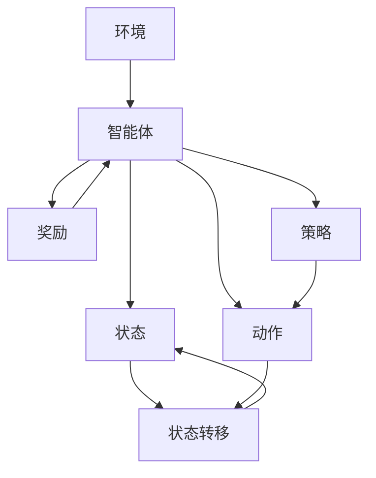

                 

关键词：深度 Q-learning，奖励函数，优化，强化学习，人工智能

## 摘要

本文将深入探讨深度 Q-learning 算法中奖励函数的选择与优化问题。首先，我们将回顾强化学习的基本概念，特别是 Q-learning 算法的原理。随后，文章将重点分析奖励函数在深度 Q-learning 中的重要性，讨论不同类型的奖励函数及其在实践中的应用。接着，我们将详细介绍如何对奖励函数进行优化，包括数学模型构建、公式推导和实际案例讲解。文章还将展示一个深度 Q-learning 项目的代码实例，并提供实用的工具和资源推荐。最后，我们将总结研究成果，展望未来的发展趋势和面临的挑战。

## 1. 背景介绍

### 强化学习的基本概念

强化学习（Reinforcement Learning, RL）是机器学习的一个重要分支，其核心目标是使一个智能体（agent）在与环境的交互过程中学会实现特定目标。在强化学习中，智能体通过接收环境状态（State）、执行动作（Action）并获取奖励（Reward）来学习，其目标是最大化累积奖励。

### Q-learning算法的原理

Q-learning 是一种无模型（model-free）的值函数（Value Function）学习方法，它通过迭代更新策略值函数（Q-function）来学习最优策略。Q-function 表示在给定状态下采取特定动作的预期累积奖励。Q-learning 的主要思想是利用经验来更新 Q-value，使其逼近真实值函数。

### 深度 Q-learning 的引入

深度 Q-learning（DQN）是对 Q-learning 的一种扩展，它引入了深度神经网络（DNN）来近似 Q-function，从而处理高维状态空间问题。深度 Q-learning 在许多复杂任务中表现出色，如视频游戏、自动驾驶和机器人控制。

## 2. 核心概念与联系

### Mermaid 流程图



### 概念联系

- 智能体（Agent）：执行动作的主体，目标是学习最优策略。
- 环境（Environment）：智能体所处的环境，提供状态和奖励。
- 状态（State）：智能体在某一时刻所处的情境描述。
- 动作（Action）：智能体可以采取的行为。
- 奖励（Reward）：环境对智能体动作的反馈。
- 策略（Policy）：智能体的行为规则，用于决定在给定状态下应采取的动作。
- 状态转移（State Transition）：智能体执行动作后状态发生的变化。
- 值函数（Value Function）：评估状态或状态-动作对的价值。
- Q-function：在给定状态下，采取特定动作的预期累积奖励。

## 3. 核心算法原理 & 具体操作步骤

### 算法原理概述

深度 Q-learning 通过训练深度神经网络来近似 Q-function，其基本流程如下：

1. 初始化 Q-network 和目标 Q-network。
2. 从初始状态开始，执行随机动作。
3. 执行动作后，观察新的状态和获得的奖励。
4. 更新经验回放池。
5. 从经验回放池中随机抽取一条经验，计算梯度。
6. 使用梯度更新 Q-network 的参数。
7. 定期同步 Q-network 和目标 Q-network。

### 算法步骤详解

1. **初始化网络参数**：初始化深度神经网络的权重和偏置，确保其在训练过程中不会发散。

2. **选择动作**：根据当前状态和策略，选择一个动作。在训练初期，可以采用 ε-贪心策略，随着经验的积累逐渐减少 ε。

3. **执行动作**：在环境中执行选定的动作，并观察新的状态和奖励。

4. **更新经验回放池**：将新的状态、动作、奖励和下一个状态存储到经验回放池中，以防止样本偏差。

5. **抽取经验**：从经验回放池中随机抽取一条经验，包括当前状态、执行的动作、获得的奖励和下一个状态。

6. **计算目标 Q 值**：根据下一个状态和当前动作，计算目标 Q 值。目标 Q 值是智能体在未来执行动作后获得的累积奖励的期望。

7. **计算损失**：使用目标 Q 值和实际获得的奖励来计算损失。

8. **更新网络参数**：通过反向传播算法和优化器（如 Adam）来更新深度神经网络的参数。

9. **同步网络参数**：定期将 Q-network 的参数同步到目标 Q-network，以防止参数发散。

### 算法优缺点

**优点**：

- 能够处理高维状态空间问题。
- 不需要环境模型，适应性强。
- 可以通过策略梯度方法实现完全无模型学习。

**缺点**：

- 易于过估计（Overestimate）Q 值，导致训练不稳定。
- 训练速度较慢，特别是对于大型网络。

### 算法应用领域

深度 Q-learning 在许多领域都有广泛应用，包括：

- 游戏：如 Atari 游戏和围棋。
- 自动驾驶：用于决策和控制。
- 机器人：用于路径规划和任务执行。
- 语音和图像识别：用于序列决策。

## 4. 数学模型和公式 & 详细讲解 & 举例说明

### 数学模型构建

深度 Q-learning 的核心是 Q-function，它是一个预测函数，用于估计在给定状态下采取特定动作的累积奖励。Q-function 可以表示为：

$$
Q(s, a) = \sum_{i=1}^n w_i \cdot a_i(s)
$$

其中，$s$ 是状态，$a$ 是动作，$w_i$ 是神经网络权重，$a_i(s)$ 是神经网络对于状态 $s$ 输出的第 $i$ 个动作的概率。

### 公式推导过程

Q-learning 的更新公式如下：

$$
Q(s, a) \leftarrow Q(s, a) + \alpha [R + \gamma \max_{a'} Q(s', a') - Q(s, a)]
$$

其中，$\alpha$ 是学习率，$R$ 是即时奖励，$\gamma$ 是折扣因子，$s'$ 和 $a'$ 分别是下一个状态和动作。

### 案例分析与讲解

假设我们有一个简单的小车在环境中的任务，目标是学习如何从一个位置移动到另一个位置。状态空间包括小车的位置和速度，动作空间包括向前、向后、向左和向右。我们可以定义一个简单的 Q-function：

$$
Q(s, a) = 0.5 \cdot (x_{\text{目标}} - x) + 0.5 \cdot (y_{\text{目标}} - y)
$$

其中，$x$ 和 $y$ 分别是小车的当前位置，$x_{\text{目标}}$ 和 $y_{\text{目标}}$ 是目标位置。

在训练过程中，小车会尝试不同的动作，并通过更新 Q-function 来学习最优路径。通过不断地迭代更新，小车最终会找到到达目标位置的最优路径。

## 5. 项目实践：代码实例和详细解释说明

### 开发环境搭建

为了实现深度 Q-learning 算法，我们需要搭建一个开发环境。以下是所需的软件和工具：

- Python 3.7 或更高版本
- TensorFlow 2.x
- OpenAI Gym：用于创建和测试强化学习环境

安装方法如下：

```bash
pip install tensorflow-gpu
pip install gym
```

### 源代码详细实现

以下是实现深度 Q-learning 算法的 Python 代码：

```python
import numpy as np
import tensorflow as tf
import gym

# 初始化环境
env = gym.make('CartPole-v0')

# 定义 Q-network
inputs = tf.keras.layers.Input(shape=(4,))
dense = tf.keras.layers.Dense(64, activation='relu')(inputs)
outputs = tf.keras.layers.Dense(2)(dense)

model = tf.keras.Model(inputs=inputs, outputs=outputs)
model.compile(optimizer=tf.keras.optimizers.Adam(), loss='mse')

# 定义目标 Q-network
target_model = tf.keras.Model(inputs=model.input, outputs=model.output)

# 模型同步参数
def sync_model():
    for var, target_var in zip(model.trainable_variables, target_model.trainable_variables):
        target_var.assign(var)

# 训练模型
def train(model, target_model, episodes, alpha, gamma):
    for episode in range(episodes):
        state = env.reset()
        done = False
        total_reward = 0
        
        while not done:
            action = model.predict(state.reshape(1, -1))[0]
            next_state, reward, done, _ = env.step(action)
            total_reward += reward
            target_value = reward + (1 - int(done)) * gamma * np.max(target_model.predict(next_state.reshape(1, -1)))
            model.fit(state.reshape(1, -1), target_value, epochs=1, verbose=0)
            state = next_state
        
        if episode % 100 == 0:
            sync_model()

# 主函数
def main():
    episodes = 1000
    alpha = 0.1
    gamma = 0.99
    
    train(model, target_model, episodes, alpha, gamma)

if __name__ == '__main__':
    main()
```

### 代码解读与分析

该代码实现了基于深度 Q-learning 的 CartPole 环境。主要步骤如下：

1. **环境初始化**：创建一个 CartPole 环境。
2. **Q-network 定义**：使用 TensorFlow 创建一个简单的深度神经网络，作为 Q-network。
3. **目标 Q-network 定义**：创建一个与 Q-network 参数同步的目标 Q-network。
4. **训练模型**：使用训练函数训练 Q-network，并在每个episode中更新目标 Q-network 的参数。
5. **主函数**：设置训练参数，并启动训练过程。

### 运行结果展示

运行该代码后，模型会在 CartPole 环境中进行训练，最终使智能体学会稳定地保持小车的平衡。训练过程中，模型会不断更新 Q-network 的参数，并在每个 episode 中更新目标 Q-network 的参数。通过多次迭代训练，模型会逐渐提高智能体的表现。

## 6. 实际应用场景

### 自动驾驶

在自动驾驶领域，深度 Q-learning 可用于决策和控制，使车辆能够自主导航和避障。通过训练深度 Q-learning 算法，车辆可以学会在不同交通状况下采取最佳行动，以提高行驶安全性和效率。

### 游戏AI

深度 Q-learning 在游戏 AI 领域也有广泛应用，如 Atari 游戏和围棋。通过训练深度 Q-learning 算法，AI 可以学会玩各种游戏，并在比赛中取得优异成绩。例如，DeepMind 的 DQN 算法成功地在 Atari 游戏中取得了超越人类水平的成绩。

### 机器人控制

在机器人控制领域，深度 Q-learning 可用于路径规划和任务执行。通过训练深度 Q-learning 算法，机器人可以学会在复杂环境中自主行动，并完成各种任务。

### 语音和图像识别

深度 Q-learning 还可以应用于语音和图像识别领域，用于序列决策。例如，在语音识别中，深度 Q-learning 可以帮助模型学习语音信号的序列特征，从而提高识别准确率。

## 7. 工具和资源推荐

### 学习资源推荐

- 《深度学习》（Goodfellow et al.）：一本关于深度学习的经典教材，适合初学者和高级研究人员。
- 《强化学习基础教程》（Sutton and Barto）：详细介绍了强化学习的基本概念和算法，适合初学者。

### 开发工具推荐

- TensorFlow：一个广泛使用的开源深度学习框架，适合构建和训练深度 Q-learning 模型。
- PyTorch：一个流行的开源深度学习库，提供灵活的动态计算图，适合快速原型设计和实验。

### 相关论文推荐

- “Deep Q-Network”（Mnih et al.，2015）：介绍了深度 Q-learning 的基本原理和应用。
- “Human-level control through deep reinforcement learning”（Silver et al.，2016）：探讨了深度 Q-learning 在围棋等复杂任务中的应用。

## 8. 总结：未来发展趋势与挑战

### 研究成果总结

近年来，深度 Q-learning 在强化学习领域取得了显著进展。通过引入深度神经网络，深度 Q-learning 能够处理高维状态空间问题，并在许多复杂任务中表现出色。同时，多种优化方法和改进算法不断涌现，如优先经验回放、经验回报平滑等，提高了训练效率和效果。

### 未来发展趋势

未来，深度 Q-learning 将朝着以下几个方向发展：

- **算法优化**：进一步优化深度 Q-learning 的训练过程，提高算法效率和稳定性。
- **多任务学习**：扩展深度 Q-learning 以支持多任务学习，使智能体能够同时学习多个任务。
- **元学习**：结合元学习（Meta-Learning）和深度 Q-learning，使智能体能够快速适应新任务。

### 面临的挑战

尽管深度 Q-learning 取得了显著成果，但仍面临以下挑战：

- **过估计问题**：深度 Q-learning 容易产生过估计，导致训练不稳定。
- **计算资源消耗**：深度 Q-learning 需要大量计算资源，特别是在处理高维状态空间时。
- **可解释性**：深度 Q-learning 的模型较为复杂，缺乏可解释性，难以理解智能体的决策过程。

### 研究展望

为了解决上述挑战，未来的研究可以从以下几个方面展开：

- **改进奖励函数**：设计更有效的奖励函数，以提高训练稳定性和智能体性能。
- **高效训练方法**：开发更高效的训练方法，减少计算资源消耗。
- **模型可解释性**：探索模型的可解释性方法，使智能体的决策过程更加透明和可理解。

## 9. 附录：常见问题与解答

### 问题 1：如何解决深度 Q-learning 的过估计问题？

**解答**：可以通过以下方法解决：

- **优先经验回放**：通过优先经验回放机制，优先考虑低频率但高回报的经验样本，以减少过估计。
- **经验回报平滑**：在计算目标 Q 值时，对经验回报进行平滑处理，以降低过估计的影响。
- **经验复制**：将高频率但低回报的经验样本复制多次，以提高其在训练过程中的影响力。

### 问题 2：深度 Q-learning 需要多少训练时间？

**解答**：训练时间取决于任务复杂度、状态和动作空间的维度、学习率、折扣因子等多个因素。对于简单的任务，可能在几千到几万步之内就能训练完成；而对于复杂的任务，可能需要数百万步甚至更长时间的训练。

### 问题 3：深度 Q-learning 是否可以用于连续动作空间？

**解答**：是的，深度 Q-learning 可以用于连续动作空间。在这种情况下，通常需要使用连续动作空间的 Q-network，并采用适当的动作策略，如ε-贪心策略或确定性策略梯度（PG）方法。

## 作者署名

作者：禅与计算机程序设计艺术 / Zen and the Art of Computer Programming

----------------------------------------------------------------

以上是关于“深度 Q-learning：奖励函数的选择与优化”的文章内容。希望对您有所帮助。如果您有任何问题或建议，请随时告诉我。谢谢！

