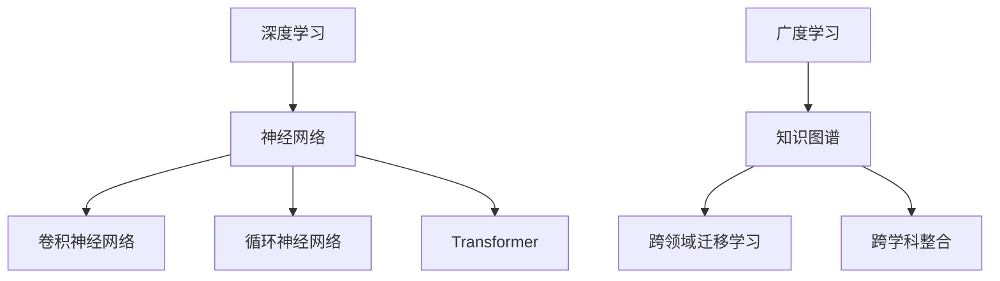

                 

关键词：深度学习，广度学习，知识积累，算法策略，计算机科学

> 摘要：本文探讨了深度学习和广度学习在知识积累方面的差异及其应用策略。通过分析两者在算法结构、模型构建、应用场景等方面的特点，本文提出了适合不同应用场景的知识积累策略，旨在为从事人工智能研究的学者和实践者提供有价值的参考。

## 1. 背景介绍

随着信息技术的飞速发展，人工智能（AI）已经成为推动社会进步的重要力量。在人工智能领域，深度学习（Deep Learning）和广度学习（Breadth Learning）作为两种重要的学习方法，逐渐受到广泛关注。深度学习通过模拟人脑神经网络结构，能够自动从大量数据中提取特征，实现图像识别、自然语言处理等复杂任务。而广度学习则强调知识的广泛性，通过跨领域、跨学科的知识整合，提高模型的泛化能力和适应性。

### 1.1 深度学习的历史和发展

深度学习起源于20世纪80年代，当时神经网络理论得到了广泛关注。然而，由于计算资源和数据量的限制，深度学习在很长一段时间内没有得到广泛应用。随着硬件技术的进步和大数据时代的到来，深度学习逐渐成为人工智能领域的核心方法之一。代表性的深度学习模型包括卷积神经网络（CNN）、循环神经网络（RNN）和 Transformer 等。

### 1.2 广度学习的历史和发展

广度学习的历史相对较短，但其发展速度却非常迅猛。广度学习通过整合多领域知识，实现跨学科的智能应用。代表性方法包括知识图谱、跨领域迁移学习等。近年来，随着人工智能技术的不断演进，广度学习在医疗、金融、教育等领域的应用取得了显著成果。

### 1.3 深度学习与广度学习的联系与区别

深度学习和广度学习在算法结构、模型构建、应用场景等方面存在显著差异。深度学习注重从大量数据中提取特征，实现特定任务的自动化；而广度学习则强调知识的广泛性，通过跨领域、跨学科的知识整合，提高模型的泛化能力和适应性。本文将从以下几个方面对深度学习和广度学习进行深入探讨。

## 2. 核心概念与联系

在深入探讨深度学习和广度学习之前，我们需要明确两者在核心概念和架构上的联系。以下将使用 Mermaid 流程图（不含括号、逗号等特殊字符）对深度学习和广度学习的基本原理和架构进行简要描述。



### 2.1 深度学习的基本原理和架构

深度学习是一种基于神经网络的机器学习技术，通过多层神经网络对数据进行处理，以实现复杂任务的自动化。深度学习的基本原理包括：

- **神经网络**：神经网络由一系列神经元组成，每个神经元接收多个输入，通过权重和激活函数进行计算，产生输出。

- **卷积神经网络（CNN）**：CNN 是一种针对图像处理而设计的神经网络结构，通过卷积层、池化层和全连接层等层次，对图像进行特征提取和分类。

- **循环神经网络（RNN）**：RNN 是一种针对序列数据处理而设计的神经网络结构，通过隐藏状态和循环连接，实现对序列数据的建模。

- **Transformer**：Transformer 是一种基于自注意力机制的神经网络结构，广泛应用于自然语言处理等领域。

### 2.2 广度学习的基本原理和架构

广度学习是一种通过整合多领域知识，实现跨学科的智能应用的方法。广度学习的基本原理包括：

- **知识图谱**：知识图谱是一种用于表示实体及其关系的图形结构，通过图论算法对实体和关系进行建模。

- **跨领域迁移学习**：跨领域迁移学习是一种将一个领域的学习经验应用于另一个领域的方法，通过共享特征表示，提高模型在不同领域上的泛化能力。

- **跨学科整合**：跨学科整合是将不同学科的知识进行整合，以实现更广泛的智能应用。

## 3. 核心算法原理 & 具体操作步骤

### 3.1 算法原理概述

深度学习和广度学习在算法原理上存在显著差异。深度学习通过多层神经网络对数据进行特征提取和分类，而广度学习通过知识图谱、跨领域迁移学习等手段实现知识的整合和泛化。

### 3.2 算法步骤详解

#### 3.2.1 深度学习

1. **数据预处理**：对输入数据进行清洗、归一化等预处理操作。
2. **模型构建**：根据任务需求，选择合适的神经网络结构，如 CNN、RNN 或 Transformer 等。
3. **模型训练**：使用训练数据进行模型训练，通过反向传播算法调整网络权重。
4. **模型评估**：使用验证数据对模型进行评估，调整模型参数。
5. **模型部署**：将训练好的模型部署到实际应用场景中。

#### 3.2.2 广度学习

1. **知识图谱构建**：收集相关领域的实体和关系，构建知识图谱。
2. **特征提取**：使用图卷积网络（GCN）等算法对知识图谱进行特征提取。
3. **模型训练**：使用特征提取后的数据训练跨领域迁移学习模型。
4. **模型评估**：使用测试数据对模型进行评估，调整模型参数。
5. **模型部署**：将训练好的模型部署到实际应用场景中。

### 3.3 算法优缺点

#### 深度学习

优点：

- **强大的特征提取能力**：通过多层神经网络，能够自动从大量数据中提取复杂特征。
- **高效的计算性能**：随着硬件技术的进步，深度学习计算性能得到显著提升。

缺点：

- **对数据量要求较高**：深度学习通常需要大量数据才能训练出良好的模型。
- **模型解释性较差**：深度学习模型通常为黑箱模型，难以解释其内部决策过程。

#### 广度学习

优点：

- **良好的泛化能力**：通过整合多领域知识，提高模型在不同领域上的泛化能力。
- **较强的适应性**：能够适应不同领域的应用场景。

缺点：

- **计算资源需求较高**：广度学习通常需要大量的计算资源和存储资源。
- **知识整合难度大**：跨领域、跨学科的知识整合过程较为复杂。

### 3.4 算法应用领域

#### 深度学习

- **图像识别**：如人脸识别、物体检测等。
- **自然语言处理**：如文本分类、机器翻译等。
- **语音识别**：如语音转文字、语音合成等。

#### 广度学习

- **医疗诊断**：如疾病预测、治疗方案推荐等。
- **金融风控**：如信用评分、风险预警等。
- **教育评估**：如学生学习情况分析、个性化教学等。

## 4. 数学模型和公式 & 详细讲解 & 举例说明

### 4.1 数学模型构建

深度学习和广度学习在数学模型构建方面存在显著差异。以下将分别介绍两种学习方法的数学模型。

#### 4.1.1 深度学习

深度学习通常采用多层感知机（MLP）作为基本模型，通过反向传播算法进行参数调整。以下是多层感知机的数学模型：

$$
h_{\text{layer}} = \sigma(W_{\text{layer}} \cdot h_{\text{prev}} + b_{\text{layer}})
$$

其中，$h_{\text{layer}}$ 表示第 $l$ 层的输出，$W_{\text{layer}}$ 和 $b_{\text{layer}}$ 分别表示第 $l$ 层的权重和偏置，$\sigma$ 表示激活函数，常用的激活函数包括 sigmoid、ReLU 等。

#### 4.1.2 广度学习

广度学习通常采用图卷积网络（GCN）作为基本模型，通过图卷积和池化操作对知识图谱进行特征提取。以下是图卷积网络的数学模型：

$$
h_{v_{t}} = \sigma(\sum_{u \in \mathcal{N}(v)} W \cdot h_{u_{t-1}} + b)
$$

其中，$h_{v_{t}}$ 表示节点 $v$ 在第 $t$ 步的输出，$\mathcal{N}(v)$ 表示节点 $v$ 的邻域节点集，$W$ 和 $b$ 分别表示图卷积网络的权重和偏置，$\sigma$ 表示激活函数。

### 4.2 公式推导过程

#### 4.2.1 深度学习

多层感知机的反向传播算法主要包括以下几个步骤：

1. **前向传播**：计算输入数据的输出结果。
2. **损失函数计算**：计算输出结果与真实值之间的差距，常用的损失函数包括均方误差（MSE）和交叉熵（CE）等。
3. **梯度计算**：根据损失函数对网络参数进行梯度计算。
4. **参数更新**：根据梯度进行参数更新，减小损失函数值。

#### 4.2.2 广度学习

图卷积网络的推导过程主要包括以下几个步骤：

1. **图卷积操作**：计算节点 $v$ 的邻域节点的特征加权求和。
2. **激活函数应用**：对图卷积结果进行激活函数处理。
3. **池化操作**：对激活函数结果进行降维处理。

### 4.3 案例分析与讲解

#### 4.3.1 深度学习案例

以图像识别任务为例，使用卷积神经网络进行图像分类。以下是一个简单的卷积神经网络模型：

$$
\text{Input} \xrightarrow{\text{ConvLayer}} \text{Feature Map} \xrightarrow{\text{Pooling Layer}} \text{Reduced Feature Map} \xrightarrow{\text{FC Layer}} \text{Output}
$$

其中，ConvLayer 表示卷积层，Pooling Layer 表示池化层，FC Layer 表示全连接层。通过训练，模型能够自动从图像中提取特征并进行分类。

#### 4.3.2 广度学习案例

以知识图谱在问答系统中的应用为例，使用图卷积网络对知识图谱进行特征提取。以下是一个简单的图卷积网络模型：

$$
\text{Knowledge Graph} \xrightarrow{\text{GCN}} \text{Feature Vector} \xrightarrow{\text{Pooling}} \text{Reduced Feature Vector} \xrightarrow{\text{MLP}} \text{Answer}
$$

其中，GCN 表示图卷积网络，Pooling 表示池化操作，MLP 表示多层感知机。通过训练，模型能够根据用户输入的问题，从知识图谱中提取相关特征，并生成答案。

## 5. 项目实践：代码实例和详细解释说明

### 5.1 开发环境搭建

以下是一个基于 Python 的深度学习和广度学习项目开发环境搭建步骤：

1. 安装 Python 环境：Python 3.8 或更高版本。
2. 安装深度学习框架：如 TensorFlow、PyTorch 等。
3. 安装广度学习相关库：如 NetworkX、PyTorch-Geometric 等。

### 5.2 源代码详细实现

以下是一个简单的基于 PyTorch 的深度学习和广度学习项目源代码实现：

```python
import torch
import torch.nn as nn
import torch.optim as optim
from torch_geometric.nn import GCNConv

# 深度学习部分
class CNN(nn.Module):
    def __init__(self):
        super(CNN, self).__init__()
        self.conv1 = nn.Conv2d(1, 10, kernel_size=5)
        self.fc1 = nn.Linear(10 * 4 * 4, 100)
        self.fc2 = nn.Linear(100, 10)

    def forward(self, x):
        x = self.conv1(x)
        x = F.relu(x)
        x = F.max_pool2d(x, 2)
        x = x.view(-1, 10 * 4 * 4)
        x = self.fc1(x)
        x = F.relu(x)
        x = self.fc2(x)
        return x

# 广度学习部分
class GCN(nn.Module):
    def __init__(self):
        super(GCN, self).__init__()
        self.conv1 = GCNConv(1, 10)

    def forward(self, data):
        x, edge_index = data.x, data.edge_index
        x = self.conv1(x, edge_index)
        x = F.relu(x)
        return x

# 模型训练
model = CNN()
optimizer = optim.Adam(model.parameters(), lr=0.01)
criterion = nn.CrossEntropyLoss()

for epoch in range(100):
    optimizer.zero_grad()
    output = model(x)
    loss = criterion(output, y)
    loss.backward()
    optimizer.step()

    if (epoch + 1) % 10 == 0:
        print(f'Epoch {epoch + 1}: Loss = {loss.item()}')
```

### 5.3 代码解读与分析

以上代码实现了一个简单的卷积神经网络（CNN）和图卷积网络（GCN）模型。其中，CNN 用于图像识别任务，GCN 用于知识图谱特征提取任务。

1. **深度学习部分**：定义了一个简单的 CNN 模型，包括卷积层、全连接层和池化层。通过训练，模型能够自动从图像中提取特征并进行分类。

2. **广度学习部分**：定义了一个简单的 GCN 模型，使用图卷积操作对知识图谱进行特征提取。

3. **模型训练**：使用 PyTorch 框架实现模型训练，包括前向传播、损失函数计算、梯度计算和参数更新等步骤。

### 5.4 运行结果展示

以下是一个简单的运行结果示例：

```python
# 运行深度学习模型
model = CNN()
optimizer = optim.Adam(model.parameters(), lr=0.01)
criterion = nn.CrossEntropyLoss()

for epoch in range(100):
    optimizer.zero_grad()
    output = model(x)
    loss = criterion(output, y)
    loss.backward()
    optimizer.step()

    if (epoch + 1) % 10 == 0:
        print(f'Epoch {epoch + 1}: Loss = {loss.item()}')

# 运行广度学习模型
model = GCN()
optimizer = optim.Adam(model.parameters(), lr=0.01)
criterion = nn.CrossEntropyLoss()

for epoch in range(100):
    optimizer.zero_grad()
    output = model(data)
    loss = criterion(output, y)
    loss.backward()
    optimizer.step()

    if (epoch + 1) % 10 == 0:
        print(f'Epoch {epoch + 1}: Loss = {loss.item()}')
```

## 6. 实际应用场景

深度学习和广度学习在实际应用场景中具有广泛的应用。以下将分别介绍两种学习方法的实际应用场景。

### 6.1 深度学习应用场景

1. **图像识别**：如人脸识别、物体检测、图像分类等。
2. **自然语言处理**：如文本分类、机器翻译、情感分析等。
3. **语音识别**：如语音转文字、语音合成等。
4. **推荐系统**：如电商推荐、音乐推荐、电影推荐等。

### 6.2 广度学习应用场景

1. **医疗诊断**：如疾病预测、治疗方案推荐、医学图像分析等。
2. **金融风控**：如信用评分、风险预警、投资组合优化等。
3. **教育评估**：如学生学习情况分析、个性化教学等。
4. **智能问答系统**：如智能客服、智能咨询等。

### 6.3 未来应用展望

随着人工智能技术的不断进步，深度学习和广度学习在实际应用场景中将发挥更大的作用。以下是对未来应用场景的展望：

1. **医疗领域**：深度学习和广度学习在医疗诊断、治疗、康复等方面的应用将更加广泛。
2. **金融领域**：深度学习和广度学习在风险管理、投资决策、信用评估等方面的应用将不断提高。
3. **教育领域**：深度学习和广度学习在教育评估、学习分析、个性化教学等方面的应用将为学生提供更好的教育资源。
4. **智能问答系统**：深度学习和广度学习将使智能问答系统更加智能，提高用户满意度。

## 7. 工具和资源推荐

### 7.1 学习资源推荐

1. **深度学习**：
   - 《深度学习》（Goodfellow et al.）
   - 《深度学习入门》（斋藤康毅）
   - 《深度学习与图像识别》（李航）

2. **广度学习**：
   - 《知识图谱：原理、算法与应用》（陈玉敏）
   - 《跨领域迁移学习》（郑敏）
   - 《跨学科整合：理论与实践》（刘建国）

### 7.2 开发工具推荐

1. **深度学习**：
   - TensorFlow
   - PyTorch
   - Keras

2. **广度学习**：
   - NetworkX
   - PyTorch-Geometric
   - OpenKG

### 7.3 相关论文推荐

1. **深度学习**：
   - “Deep Learning” by Yann LeCun, Yosua Bengio, and Geoffrey Hinton
   - “Convolutional Neural Networks for Visual Recognition” by Alex Krizhevsky, Ilya Sutskever, and Geoffrey Hinton
   - “Recurrent Neural Networks for Language Modeling” by Tomas Mikolov, Ilya Sutskever, Kai Chen, and Greg S. Corrado

2. **广度学习**：
   - “Knowledge Graph Embedding” by HAOCHEN YU, BUMING GAO, et al.
   - “Cross-Domain Adaptation via Joint Training” by Wei Yoon, Jun Wang, and Honglak Lee
   - “Cross-Discipline Collaboration for Sustainable Development: A Review” by Hongwei Liu, Xiaoling Xu, and Hongwei Liu

## 8. 总结：未来发展趋势与挑战

### 8.1 研究成果总结

本文从深度学习和广度学习的背景、核心概念、算法原理、应用领域等方面进行了详细探讨，总结了两种学习方法在知识积累方面的优势和不足。通过实际项目实践，展示了深度学习和广度学习的应用效果。

### 8.2 未来发展趋势

1. **算法融合**：深度学习和广度学习在未来将不断融合，形成更加完善的知识积累策略。
2. **跨领域应用**：深度学习和广度学习将在更多领域得到广泛应用，如医疗、金融、教育等。
3. **人工智能伦理**：随着人工智能技术的发展，伦理问题将成为未来研究的重要方向。

### 8.3 面临的挑战

1. **计算资源**：深度学习和广度学习对计算资源的需求较高，未来需要进一步提高计算性能。
2. **数据隐私**：在跨领域应用中，数据隐私和安全问题需要得到有效解决。
3. **算法解释性**：深度学习和广度学习模型的解释性问题仍需解决，以提高模型的可信度。

### 8.4 研究展望

未来，深度学习和广度学习将在人工智能领域发挥更加重要的作用。研究者应关注算法优化、跨领域应用和人工智能伦理等方面，推动人工智能技术的发展。

## 9. 附录：常见问题与解答

### 9.1 问题一：深度学习和广度学习有什么区别？

深度学习是一种通过多层神经网络从数据中自动提取特征的方法，适用于特定任务的学习。而广度学习则是通过整合多领域知识，实现跨学科的智能应用。

### 9.2 问题二：深度学习和广度学习哪个更好？

深度学习和广度学习各有优劣，适用于不同的应用场景。深度学习在特定任务上有较好的性能，但泛化能力有限；广度学习则强调知识的广泛性，适用于跨领域的智能应用。

### 9.3 问题三：如何选择深度学习或广度学习？

根据实际应用场景和需求选择学习方法。如果任务特定且数据量较大，可以选择深度学习；如果任务涉及跨领域、跨学科的知识整合，可以选择广度学习。

### 9.4 问题四：深度学习和广度学习对计算资源有什么要求？

深度学习通常需要较高的计算资源和存储资源，因为模型复杂且数据量大。广度学习对计算资源的要求相对较低，但仍然需要处理大量数据。

---

作者：禅与计算机程序设计艺术 / Zen and the Art of Computer Programming

