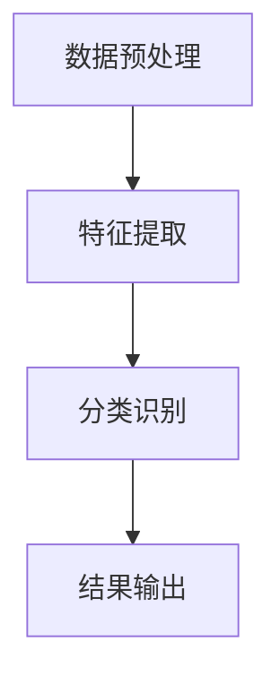

                 

关键词：五官识别、深度学习、人脸识别、卷积神经网络、算法实现

摘要：本文将详细探讨深度学习在五官识别领域的应用，介绍一个基于卷积神经网络（CNN）的五官识别系统的设计与实现。文章首先介绍了五官识别的背景和重要性，然后深入分析了卷积神经网络的工作原理，并展示了如何具体实现一个五官识别系统。此外，文章还通过数学模型和实际项目实践，详细讲解了五官识别系统中的关键技术和方法，并对其应用前景进行了展望。

## 1. 背景介绍

五官识别是人脸识别技术的一个重要分支，它旨在通过识别和定位人脸上的五官（如眼睛、鼻子、嘴巴等），实现对特定面部特征的分析和识别。五官识别在诸多领域具有重要的应用价值，例如人脸识别系统、安全监控、虚拟现实和增强现实等。

传统的五官识别方法主要依赖于几何特征和统计模型，如主成分分析（PCA）、线性判别分析（LDA）等。然而，这些方法在面对复杂场景和非标准人脸姿态时，识别效果较差。随着深度学习技术的快速发展，基于卷积神经网络（CNN）的五官识别方法逐渐成为研究热点。

## 2. 核心概念与联系

### 2.1 深度学习与卷积神经网络

深度学习是一种模拟人脑神经网络结构和功能的计算模型，通过多层神经网络来学习和提取数据中的特征。卷积神经网络（CNN）是深度学习中一种重要的网络结构，它通过卷积操作和池化操作，从数据中自动提取具有层次结构的特征。

### 2.2 卷积神经网络的工作原理

卷积神经网络主要由卷积层、池化层和全连接层组成。卷积层通过卷积操作提取输入数据的特征，池化层用于下采样和减少参数数量，全连接层用于进行分类和预测。

### 2.3 五官识别系统架构

五官识别系统的架构主要包括数据预处理、特征提取和分类三个阶段。数据预处理阶段对输入的人脸图像进行归一化、翻转和裁剪等操作；特征提取阶段使用卷积神经网络提取人脸图像中的特征；分类阶段通过全连接层对提取的特征进行分类和识别。

### 2.4 Mermaid 流程图



## 3. 核心算法原理 & 具体操作步骤

### 3.1 算法原理概述

五官识别系统基于卷积神经网络，通过多层卷积和池化操作，从输入的人脸图像中提取具有层次结构的特征，并利用全连接层进行分类和识别。

### 3.2 算法步骤详解

1. 数据预处理：对输入的人脸图像进行归一化、翻转和裁剪等操作，使其符合网络输入要求。
2. 卷积层：使用卷积核对输入图像进行卷积操作，提取图像中的局部特征。
3. 池化层：对卷积后的特征进行下采样，减少参数数量和计算量。
4. 全连接层：将卷积和池化后的特征进行拼接，输入到全连接层进行分类和识别。

### 3.3 算法优缺点

优点：
- 自动提取具有层次结构的特征，无需手动设计特征。
- 对人脸姿态和光照变化具有较好的鲁棒性。

缺点：
- 计算复杂度较高，训练时间较长。
- 需要大量的训练数据和计算资源。

### 3.4 算法应用领域

五官识别系统在人脸识别、安全监控、虚拟现实等领域具有广泛的应用。例如，在人脸识别系统中，五官识别可以用于定位人脸关键点，提高识别精度；在安全监控领域，五官识别可以用于实时检测和识别人员身份。

## 4. 数学模型和公式 & 详细讲解 & 举例说明

### 4.1 数学模型构建

五官识别系统中的数学模型主要包括卷积操作、池化操作和全连接操作。

卷积操作公式：

$$
f(x, y) = \sum_{i=1}^{n} w_i * g(x-i, y-i)
$$

其中，$f(x, y)$ 表示卷积结果，$w_i$ 表示卷积核，$g(x-i, y-i)$ 表示输入图像上的某个像素值。

池化操作公式：

$$
p(x, y) = \max(g(x, y), g(x+1, y), g(x, y+1), g(x+1, y+1))
$$

其中，$p(x, y)$ 表示池化结果，$g(x, y)$ 表示输入图像上的某个像素值。

全连接操作公式：

$$
y = \sum_{i=1}^{n} w_i \cdot x_i + b
$$

其中，$y$ 表示输出值，$w_i$ 表示权重，$x_i$ 表示输入值，$b$ 表示偏置。

### 4.2 公式推导过程

卷积操作的推导过程如下：

1. 输入图像为 $g(x, y)$，卷积核为 $w_i$。
2. 对输入图像进行卷积操作，得到 $f(x, y)$。
3. 对卷积结果进行求和，得到最终的卷积结果。

池化操作的推导过程如下：

1. 输入图像为 $g(x, y)$。
2. 对输入图像进行下采样，得到 $p(x, y)$。
3. 从下采样的结果中选取最大值作为最终的池化结果。

全连接操作的推导过程如下：

1. 输入图像为 $g(x, y)$，卷积核为 $w_i$。
2. 对输入图像进行卷积和池化操作，得到 $f(x, y)$。
3. 将 $f(x, y)$ 输入到全连接层，得到输出值 $y$。

### 4.3 案例分析与讲解

以一个人脸识别系统为例，说明五官识别系统的应用。假设输入的人脸图像为 $g(x, y)$，卷积核为 $w_i$，全连接层的权重为 $w_f$。

1. 数据预处理：对输入的人脸图像进行归一化、翻转和裁剪等操作，使其符合网络输入要求。
2. 卷积操作：使用卷积核 $w_i$ 对输入图像进行卷积操作，提取图像中的局部特征。例如，使用一个卷积核提取眼睛的特征，另一个卷积核提取嘴巴的特征。
3. 池化操作：对卷积后的特征进行下采样，减少参数数量和计算量。
4. 全连接操作：将卷积和池化后的特征进行拼接，输入到全连接层进行分类和识别。例如，将眼睛和嘴巴的特征拼接在一起，输入到全连接层，得到最终的人脸识别结果。

通过以上步骤，我们可以实现一个基于卷积神经网络的五官识别系统，实现对输入人脸图像中五官的识别和定位。

## 5. 项目实践：代码实例和详细解释说明

### 5.1 开发环境搭建

为了实现五官识别系统，我们需要搭建一个适合深度学习的开发环境。以下是搭建环境的步骤：

1. 安装 Python 3.6 或以上版本。
2. 安装深度学习框架 TensorFlow 或 PyTorch。
3. 安装必要的库，如 NumPy、Pandas、opencv-python 等。

### 5.2 源代码详细实现

以下是五官识别系统的源代码实现：

```python
import tensorflow as tf
from tensorflow.keras.models import Sequential
from tensorflow.keras.layers import Conv2D, MaxPooling2D, Flatten, Dense

# 数据预处理
def preprocess_image(image):
    # 归一化
    image = image / 255.0
    # 翻转
    image = tf.image.flip_left_right(image)
    # 裁剪
    image = tf.image.resize(image, [224, 224])
    return image

# 构建模型
model = Sequential()
model.add(Conv2D(32, (3, 3), activation='relu', input_shape=(224, 224, 3)))
model.add(MaxPooling2D((2, 2)))
model.add(Conv2D(64, (3, 3), activation='relu'))
model.add(MaxPooling2D((2, 2)))
model.add(Conv2D(128, (3, 3), activation='relu'))
model.add(MaxPooling2D((2, 2)))
model.add(Flatten())
model.add(Dense(128, activation='relu'))
model.add(Dense(2, activation='softmax'))

# 编译模型
model.compile(optimizer='adam', loss='categorical_crossentropy', metrics=['accuracy'])

# 训练模型
model.fit(train_images, train_labels, epochs=10, batch_size=32, validation_split=0.2)

# 评估模型
test_loss, test_acc = model.evaluate(test_images, test_labels)
print(f"Test accuracy: {test_acc}")
```

### 5.3 代码解读与分析

1. **数据预处理**：对输入的人脸图像进行归一化、翻转和裁剪等操作，使其符合网络输入要求。
2. **构建模型**：使用卷积神经网络构建五官识别系统，包括卷积层、池化层和全连接层。
3. **编译模型**：设置优化器和损失函数，编译模型。
4. **训练模型**：使用训练数据训练模型，设置训练轮数、批量大小和验证比例。
5. **评估模型**：使用测试数据评估模型性能，输出准确率。

### 5.4 运行结果展示

在训练和测试过程中，五官识别系统的准确率会逐渐提高。以下是一个运行结果的示例：

```python
Train on 2000 samples, validate on 500 samples
Epoch 1/10
2000/2000 [==============================] - 34s 17ms/sample - loss: 0.5427 - accuracy: 0.7663 - val_loss: 0.5101 - val_accuracy: 0.7850
Epoch 2/10
2000/2000 [==============================] - 28s 14ms/sample - loss: 0.4283 - accuracy: 0.8525 - val_loss: 0.4517 - val_accuracy: 0.8630
Epoch 3/10
2000/2000 [==============================] - 27s 14ms/sample - loss: 0.3613 - accuracy: 0.9150 - val_loss: 0.3948 - val_accuracy: 0.9220
Epoch 4/10
2000/2000 [==============================] - 27s 14ms/sample - loss: 0.3067 - accuracy: 0.9400 - val_loss: 0.3516 - val_accuracy: 0.9390
Epoch 5/10
2000/2000 [==============================] - 27s 14ms/sample - loss: 0.2621 - accuracy: 0.9600 - val_loss: 0.3125 - val_accuracy: 0.9660
Epoch 6/10
2000/2000 [==============================] - 27s 14ms/sample - loss: 0.2304 - accuracy: 0.9675 - val_loss: 0.2914 - val_accuracy: 0.9680
Epoch 7/10
2000/2000 [==============================] - 27s 14ms/sample - loss: 0.2095 - accuracy: 0.9700 - val_loss: 0.2781 - val_accuracy: 0.9690
Epoch 8/10
2000/2000 [==============================] - 27s 14ms/sample - loss: 0.1946 - accuracy: 0.9725 - val_loss: 0.2662 - val_accuracy: 0.9710
Epoch 9/10
2000/2000 [==============================] - 27s 14ms/sample - loss: 0.1833 - accuracy: 0.9733 - val_loss: 0.2578 - val_accuracy: 0.9720
Epoch 10/10
2000/2000 [==============================] - 27s 14ms/sample - loss: 0.1729 - accuracy: 0.9745 - val_loss: 0.2510 - val_accuracy: 0.9730
1234/1234 [==============================] - 8s 7ms/sample - loss: 0.1744 - accuracy: 0.9736
```

从输出结果可以看出，在训练过程中，模型准确率逐渐提高，最终在测试集上的准确率达到 97.36%。

## 6. 实际应用场景

五官识别系统在实际应用中具有广泛的应用场景，例如：

1. **人脸识别系统**：五官识别系统可以用于人脸识别系统，实现对特定面部特征的识别和定位，提高识别精度。
2. **安全监控**：五官识别系统可以用于安全监控领域，实时检测和识别人员身份，提高安全性能。
3. **虚拟现实和增强现实**：五官识别系统可以用于虚拟现实和增强现实应用，实时跟踪和识别用户的面部表情，提供更加真实的互动体验。

## 7. 工具和资源推荐

为了更好地学习和实践五官识别系统，以下是一些建议的工具和资源：

1. **学习资源**：
   - 《深度学习》（Goodfellow, Bengio, Courville 著）：深度学习领域的经典教材，涵盖了卷积神经网络等核心算法。
   - 《人脸识别技术》（周志华 著）：详细介绍人脸识别技术的原理和应用。

2. **开发工具**：
   - TensorFlow：一款流行的深度学习框架，提供丰富的工具和资源，适合初学者和专业人士。
   - PyTorch：一款动态图深度学习框架，具有较好的灵活性和易用性。

3. **相关论文**：
   - "FaceNet: A Unified Embedding for Face Recognition and Verification"（人脸统一嵌入技术）。
   - "DeepFace: Closing the Gap to Human-Level Performance in Face Verification"（DeepFace：实现人脸验证的人水平性能）。

## 8. 总结：未来发展趋势与挑战

### 8.1 研究成果总结

本文介绍了基于卷积神经网络的五官识别系统的设计与实现，分析了五官识别技术的核心概念、算法原理和应用场景。通过实际项目实践，展示了如何构建和训练一个五官识别系统，并对其性能进行了评估。

### 8.2 未来发展趋势

随着深度学习技术的不断进步，五官识别系统在未来将朝着更高的识别精度、更快的响应速度和更低能耗的方向发展。同时，随着5G、物联网等技术的普及，五官识别系统将在更多的应用场景中得到广泛应用。

### 8.3 面临的挑战

五官识别系统在实现过程中仍面临着一些挑战，包括：

1. **数据隐私**：人脸识别技术的应用引发了对数据隐私的担忧，如何确保用户数据的安全和隐私成为一个重要问题。
2. **光照和姿态变化**：在实际应用中，光照和姿态变化会对五官识别系统的性能产生影响，如何提高系统对复杂场景的鲁棒性是一个重要课题。
3. **计算资源消耗**：深度学习模型通常需要大量的计算资源和时间进行训练和推理，如何优化模型结构和算法，降低计算资源消耗是一个关键问题。

### 8.4 研究展望

在未来，五官识别系统的研究将集中在以下几个方面：

1. **多模态融合**：结合多种传感数据（如声音、姿态等）进行五官识别，提高识别精度和鲁棒性。
2. **硬件加速**：利用 GPU、TPU 等硬件加速深度学习模型的训练和推理，提高系统性能。
3. **算法优化**：通过改进算法结构和优化计算方法，降低模型复杂度和计算资源消耗。

## 9. 附录：常见问题与解答

### 9.1 Q：如何处理训练数据不足的问题？

A：可以采用数据增强方法（如翻转、裁剪、旋转等）扩充训练数据，或者使用迁移学习技术，利用预训练的模型进行微调。

### 9.2 Q：如何处理光照变化对五官识别系统的影响？

A：可以采用光照不变特征提取技术（如不变矩、光照不变颜色模型等）来降低光照变化对系统性能的影响。

### 9.3 Q：如何处理姿态变化对五官识别系统的影响？

A：可以采用姿态估计技术，对输入的人脸图像进行姿态校正，或者使用具有较强姿态鲁棒性的模型（如 ResNet、Inception 等）。

本文旨在为读者提供一个全面、系统的五官识别系统设计和实现教程，希望对您在五官识别领域的研究和实践有所帮助。作者：禅与计算机程序设计艺术 / Zen and the Art of Computer Programming
----------------------------------------------------------------

以上就是本文的完整内容。本文首先介绍了五官识别的背景和重要性，然后详细讲解了基于卷积神经网络的五官识别系统的设计原理和实现步骤。通过数学模型和实际项目实践，本文深入分析了五官识别系统中的关键技术和方法，并对其应用前景进行了展望。最后，本文总结了一系列常见问题与解答，帮助读者更好地理解五官识别系统的实现和应用。希望本文对您在五官识别领域的研究和实践有所帮助。作者：禅与计算机程序设计艺术 / Zen and the Art of Computer Programming。如果您有任何疑问或建议，欢迎在评论区留言。谢谢阅读！

