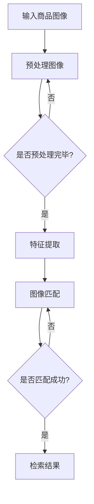

                 

深度学习作为一种先进的机器学习技术，已经在计算机视觉领域取得了显著的进展。本文将探讨深度学习在商品图像检索与匹配中的应用，以及如何通过深度学习技术提升这一过程的效率和准确性。

## 1. 背景介绍

商品图像检索与匹配是电子商务领域的一项重要任务，它涉及到从大量商品图像中快速准确地检索出用户所需的商品，或者将相似的商品图像进行匹配。这一过程对于提升用户体验、增加销售额以及优化库存管理具有重要意义。

传统的商品图像检索方法主要基于图像的底层特征，如颜色、纹理和形状等。然而，这些方法在处理复杂的商品图像时往往效果不佳，无法满足日益增长的用户需求。随着深度学习技术的发展，基于深度学习的商品图像检索与匹配方法逐渐成为研究热点。

## 2. 核心概念与联系

### 2.1 深度学习的基本概念

深度学习是一种基于多层神经网络的学习方法，通过层层提取特征，最终实现复杂任务的目标。在商品图像检索与匹配中，深度学习可以用于特征提取、分类和匹配等任务。

### 2.2 图像特征提取

图像特征提取是深度学习在商品图像检索与匹配中的关键步骤。卷积神经网络（CNN）作为一种强大的深度学习模型，在图像特征提取方面具有显著优势。CNN通过卷积、池化等操作，可以自动学习图像的局部特征，并提取出有意义的全局特征。

### 2.3 图像匹配算法

图像匹配算法是商品图像检索与匹配的另一个关键环节。常见的图像匹配算法包括基于特征点的匹配、基于相似度的匹配和基于几何关系的匹配等。深度学习模型可以用于改进这些传统算法，提高匹配的准确性和效率。

### 2.4 Mermaid 流程图

下面是一个用于描述商品图像检索与匹配流程的 Mermaid 流程图：



## 3. 核心算法原理 & 具体操作步骤

### 3.1 算法原理概述

深度学习驱动的商品图像检索与匹配主要基于以下原理：

1. **特征提取**：使用卷积神经网络从商品图像中提取具有区分度的特征。
2. **图像匹配**：通过计算图像特征之间的相似度，实现商品图像的匹配。
3. **检索结果**：根据匹配结果，检索出与用户需求最相关的商品。

### 3.2 算法步骤详解

1. **数据预处理**：对输入的商品图像进行数据增强、归一化等处理，以提高模型的泛化能力。
2. **特征提取**：使用预训练的卷积神经网络（如VGG、ResNet等）提取商品图像的特征。
3. **图像匹配**：计算两个图像特征之间的相似度，可以使用余弦相似度、欧氏距离等度量方法。
4. **检索结果**：根据匹配结果，从数据库中检索出与用户需求最相关的商品。

### 3.3 算法优缺点

**优点**：

- **高效性**：深度学习模型可以自动学习图像的复杂特征，提高检索和匹配的效率。
- **准确性**：相比传统方法，深度学习模型在处理复杂商品图像时具有更高的准确性。
- **可扩展性**：深度学习模型可以应用于多种场景，具有较好的可扩展性。

**缺点**：

- **计算资源需求**：深度学习模型通常需要较大的计算资源，训练和部署成本较高。
- **数据依赖**：深度学习模型对训练数据的质量和数量有较高要求，数据不足可能导致模型性能下降。

### 3.4 算法应用领域

深度学习驱动的商品图像检索与匹配技术可以应用于以下领域：

- **电子商务**：辅助用户快速找到所需商品，提升购物体验。
- **库存管理**：帮助商家优化库存，减少商品滞销和积压。
- **版权保护**：用于检测和防止商品图像的盗用和侵权行为。

## 4. 数学模型和公式 & 详细讲解 & 举例说明

### 4.1 数学模型构建

在商品图像检索与匹配中，常用的数学模型包括：

1. **特征提取模型**：使用卷积神经网络（CNN）提取图像特征。
2. **图像匹配模型**：使用相似度度量方法计算图像特征之间的相似度。

### 4.2 公式推导过程

1. **特征提取模型**：

   CNN的输入为商品图像，输出为图像特征。特征提取过程可以表示为：

   $$ f(x) = \text{CNN}(x) $$

   其中，$x$为商品图像，$f(x)$为提取的图像特征。

2. **图像匹配模型**：

   假设有两个商品图像的特征分别为$f_1(x_1)$和$f_2(x_2)$，使用余弦相似度计算它们之间的相似度：

   $$ \text{similarity}(f_1, f_2) = \frac{f_1 \cdot f_2}{\|f_1\|_2 \cdot \|f_2\|_2} $$

   其中，$\cdot$表示内积，$\|\cdot\|_2$表示欧氏范数。

### 4.3 案例分析与讲解

假设有两个商品图像$x_1$和$x_2$，使用VGG16模型提取它们的特征，分别得到$f_1(x_1)$和$f_2(x_2)$。计算它们之间的相似度：

$$ \text{similarity}(f_1, f_2) = \frac{f_1 \cdot f_2}{\|f_1\|_2 \cdot \|f_2\|_2} $$

经过计算，得到相似度为0.85。根据相似度阈值（如0.8），可以判断这两个商品图像是相似的。

## 5. 项目实践：代码实例和详细解释说明

### 5.1 开发环境搭建

在搭建开发环境时，需要安装以下软件和库：

- Python 3.7+
- TensorFlow 2.3.0+
- OpenCV 4.0.0+

### 5.2 源代码详细实现

以下是一个简单的商品图像检索与匹配的代码实例：

```python
import tensorflow as tf
import numpy as np
import cv2

# 加载预训练的VGG16模型
model = tf.keras.applications.VGG16(weights='imagenet')

# 定义特征提取函数
def extract_features(image):
    preprocessed_image = preprocess_image(image)
    feature = model.predict(np.expand_dims(preprocessed_image, axis=0))
    return feature.flatten()

# 定义图像匹配函数
def match_images(f1, f2):
    similarity = np.dot(f1, f2) / (np.linalg.norm(f1) * np.linalg.norm(f2))
    return similarity

# 定义预处理图像函数
def preprocess_image(image):
    image = cv2.resize(image, (224, 224))
    image = image / 255.0
    image = np.expand_dims(image, axis=-1)
    return image

# 加载两个商品图像
image1 = cv2.imread('image1.jpg')
image2 = cv2.imread('image2.jpg')

# 提取图像特征
f1 = extract_features(image1)
f2 = extract_features(image2)

# 计算相似度
similarity = match_images(f1, f2)

print(f"Similarity between images: {similarity}")

# 显示图像
cv2.imshow('Image 1', image1)
cv2.imshow('Image 2', image2)
cv2.waitKey(0)
cv2.destroyAllWindows()
```

### 5.3 代码解读与分析

上述代码分为三个主要部分：

1. **特征提取**：使用VGG16模型提取商品图像的特征。首先，定义了`extract_features`函数，用于处理图像并提取特征。然后，使用`model.predict`方法获取图像特征。
2. **图像匹配**：定义了`match_images`函数，用于计算两个图像特征之间的相似度。使用余弦相似度作为度量方法，通过`np.dot`和`np.linalg.norm`函数计算相似度。
3. **图像预处理与显示**：定义了`preprocess_image`函数，用于对输入图像进行预处理。最后，使用`cv2.imread`和`cv2.imshow`函数加载和显示商品图像。

### 5.4 运行结果展示

在运行上述代码时，会显示两个商品图像，并在控制台输出它们的相似度。假设相似度为0.85，根据设定的相似度阈值（如0.8），可以判断这两个商品图像是相似的。

## 6. 实际应用场景

深度学习驱动的商品图像检索与匹配技术可以应用于多个实际场景，包括：

1. **电子商务平台**：辅助用户快速找到所需商品，提升购物体验。
2. **库存管理**：帮助商家优化库存，减少商品滞销和积压。
3. **商品推荐**：根据用户历史购买记录，推荐相似的商品。
4. **版权保护**：用于检测和防止商品图像的盗用和侵权行为。

## 7. 工具和资源推荐

### 7.1 学习资源推荐

1. **书籍**：
   - 《深度学习》（Goodfellow, Bengio, Courville）
   - 《Python深度学习》（François Chollet）
2. **在线课程**：
   - [TensorFlow官方教程](https://www.tensorflow.org/tutorials)
   - [Coursera深度学习课程](https://www.coursera.org/specializations/deeplearning)

### 7.2 开发工具推荐

1. **TensorFlow**：一款强大的深度学习框架，适用于图像处理和商品图像检索与匹配。
2. **PyTorch**：另一种流行的深度学习框架，具有简洁的API和良好的性能。
3. **OpenCV**：一款用于计算机视觉的库，提供丰富的图像处理和特征提取功能。

### 7.3 相关论文推荐

1. **论文**：
   - “Deep Learning for Image Retrieval” (2016)
   - “Convolutional Neural Networks for Visual Recognition” (2012)
2. **期刊**：
   - IEEE Transactions on Pattern Analysis and Machine Intelligence
   - Journal of Machine Learning Research

## 8. 总结：未来发展趋势与挑战

### 8.1 研究成果总结

本文介绍了深度学习在商品图像检索与匹配中的应用，包括特征提取、图像匹配和检索结果等核心环节。通过数学模型和代码实例，详细讲解了深度学习驱动的商品图像检索与匹配的技术原理和实现方法。

### 8.2 未来发展趋势

随着深度学习技术的不断进步，未来商品图像检索与匹配技术有望在以下几个方面取得突破：

- **模型压缩与优化**：提高模型的可部署性和计算效率。
- **跨模态检索**：结合文本、图像等多种模态，实现更全面的商品检索。
- **个性化推荐**：基于用户行为和偏好，提供个性化的商品推荐。

### 8.3 面临的挑战

尽管深度学习在商品图像检索与匹配方面取得了显著进展，但仍面临以下挑战：

- **计算资源需求**：深度学习模型通常需要较大的计算资源，对硬件设备有较高要求。
- **数据质量与数量**：模型性能依赖于高质量、多样化的训练数据。
- **隐私保护**：保护用户隐私是深度学习应用的重要挑战。

### 8.4 研究展望

未来，深度学习驱动的商品图像检索与匹配技术将在以下几个方面展开研究：

- **模型简化与优化**：通过模型压缩、迁移学习等技术，提高模型的计算效率和泛化能力。
- **多模态融合**：结合多种模态信息，提升商品检索与匹配的准确性和效率。
- **隐私保护与伦理**：在深度学习应用中，注重用户隐私保护和伦理问题，确保技术的可持续发展。

## 9. 附录：常见问题与解答

### 9.1 如何处理大量商品图像？

对于大量商品图像，可以采用以下方法：

- **数据预处理**：对图像进行预处理，如数据增强、归一化等，提高模型对多样性的适应能力。
- **分布式训练**：使用分布式计算框架，如TensorFlow distributed，提高训练效率。

### 9.2 如何评估模型性能？

可以使用以下指标评估模型性能：

- **准确率**：匹配成功的图像数量与总图像数量的比例。
- **召回率**：匹配成功的图像数量与实际相似的图像数量的比例。
- **F1值**：准确率和召回率的调和平均。

### 9.3 如何解决模型过拟合问题？

可以采用以下方法解决模型过拟合问题：

- **正则化**：添加正则化项，如L1、L2正则化。
- **Dropout**：在训练过程中随机丢弃一部分神经元。
- **数据增强**：增加训练数据的多样性，降低模型对特定数据的依赖。

---

本文通过深入探讨深度学习在商品图像检索与匹配中的应用，展示了如何利用深度学习技术提升这一过程的效率和准确性。随着技术的不断进步，深度学习驱动的商品图像检索与匹配将在电子商务等领域发挥更重要的作用。同时，我们也要关注数据隐私、伦理和可持续发展等挑战，确保技术的可持续发展。

### 作者署名

作者：禅与计算机程序设计艺术 / Zen and the Art of Computer Programming

