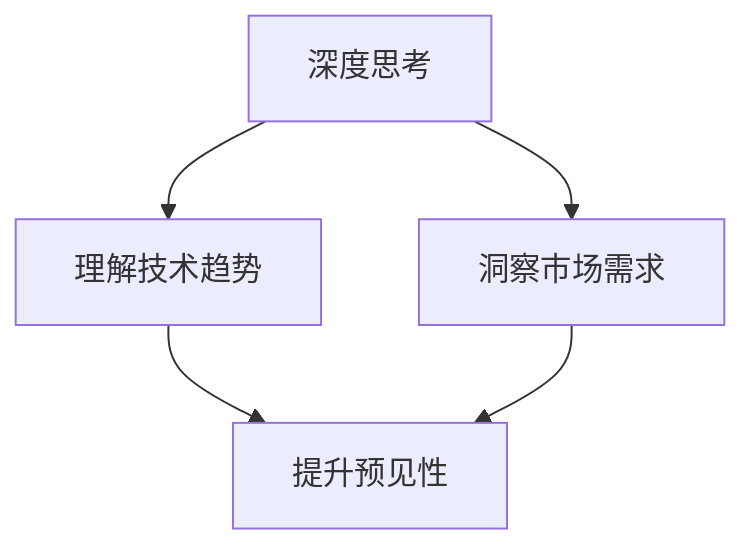
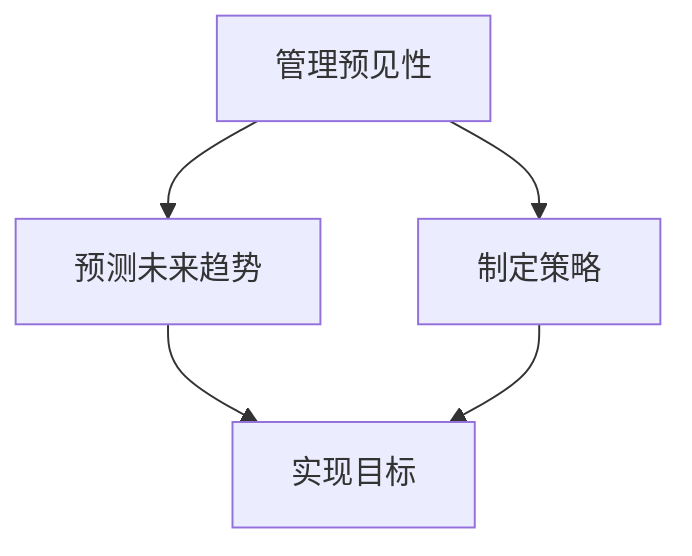

                 

关键词：深度思考、管理、预见性、技术、创新、组织发展

> 摘要：本文探讨了深度思考与管理预见性的关系，深入分析了在信息技术领域，深度思考如何提升管理者的预见性，推动技术创新和组织发展。文章首先介绍了深度思考的概念及其重要性，随后阐述了管理预见性的内涵和影响因素，最后通过具体案例，探讨了如何通过深度思考提升管理预见性，并提出了未来研究和应用的方向。

## 1. 背景介绍

在当今快速变化的信息技术时代，技术发展日新月异，市场需求瞬息万变。在这种背景下，管理者的预见性显得尤为重要。预见性不仅能够帮助企业抓住市场机遇，规避潜在风险，还能推动技术创新和组织发展。

深度思考是一种深层次、系统性、创新性的思维方式，它强调对问题的深入分析和多角度的思考。在信息技术领域，深度思考能够帮助管理者更好地理解技术发展趋势、市场需求变化，从而提升管理的预见性。

本文将围绕深度思考与管理预见性的关系展开讨论，首先介绍深度思考的概念和重要性，然后分析管理预见性的内涵和影响因素，接着通过具体案例探讨如何通过深度思考提升管理预见性，最后提出未来研究和应用的方向。

## 2. 核心概念与联系

### 2.1 深度思考

深度思考是一种深层次、系统性、创新性的思维方式，它强调对问题的深入分析和多角度的思考。在信息技术领域，深度思考有助于管理者更好地理解技术发展趋势、市场需求变化，从而提升管理的预见性。

**Mermaid 流程图：**



### 2.2 管理预见性

管理预见性是指管理者在面对不确定性时，能够准确预测未来发展趋势，制定有效策略，实现组织目标的能力。管理预见性在信息技术领域尤为重要，因为技术发展和市场变化速度极快。

**Mermaid 流程图：**



### 2.3 关系分析

深度思考和预见性之间存在密切的关系。深度思考能够帮助管理者更全面、深入地了解问题，从而提高预见性的准确性。具体来说：

1. **理解技术趋势**：深度思考使管理者能够准确把握技术发展趋势，从而在技术变革中抢占先机。
2. **洞察市场需求**：深度思考有助于管理者更好地理解市场需求变化，提前布局，满足客户需求。
3. **提升预见性**：通过深度思考，管理者能够更准确地预测未来发展趋势，制定有效策略，提高组织竞争力。

**Mermaid 流程图：**


## 3. 核心算法原理 & 具体操作步骤

### 3.1 算法原理概述

在信息技术领域，深度思考可以帮助管理者实现以下算法原理：

1. **技术趋势分析算法**：通过深度学习、数据挖掘等方法，分析大量技术文献、市场报告等数据，提取技术发展趋势。
2. **市场需求预测算法**：利用统计模型、机器学习等方法，分析历史市场数据，预测未来市场需求。
3. **策略制定算法**：结合技术趋势和市场需求，制定组织发展战略和策略。

### 3.2 算法步骤详解

1. **技术趋势分析算法**

   - **步骤1**：收集技术文献、市场报告等数据。
   - **步骤2**：使用自然语言处理（NLP）技术，对数据进行预处理。
   - **步骤3**：使用深度学习技术，如卷积神经网络（CNN）或递归神经网络（RNN），提取技术关键词和趋势。
   - **步骤4**：分析技术关键词和趋势，形成技术趋势报告。

2. **市场需求预测算法**

   - **步骤1**：收集历史市场数据，如销售额、客户反馈等。
   - **步骤2**：使用统计模型，如线性回归、时间序列分析等，对市场数据进行预测。
   - **步骤3**：使用机器学习技术，如决策树、随机森林等，优化预测模型。
   - **步骤4**：根据预测结果，制定市场需求预测报告。

3. **策略制定算法**

   - **步骤1**：结合技术趋势和市场预测，确定组织发展战略。
   - **步骤2**：制定具体的执行策略，如研发投入、市场推广等。
   - **步骤3**：评估策略执行效果，持续优化。

### 3.3 算法优缺点

**技术趋势分析算法：**

- **优点**：能够快速、准确地提取技术趋势，为管理者提供决策依据。
- **缺点**：对数据质量要求较高，易受数据噪声和偏倚影响。

**市场需求预测算法：**

- **优点**：能够提前预测市场需求，为组织制定有效策略提供支持。
- **缺点**：预测结果受历史数据限制，可能无法完全反映未来市场需求。

**策略制定算法：**

- **优点**：结合技术趋势和市场需求，提高策略制定的科学性和有效性。
- **缺点**：策略执行过程中，可能面临执行难度和风险。

### 3.4 算法应用领域

1. **技术创新**：通过技术趋势分析，为技术创新提供方向和支持。
2. **市场推广**：通过市场需求预测，为市场推广提供策略和指导。
3. **组织发展**：通过策略制定，推动组织持续发展，提高竞争力。

## 4. 数学模型和公式 & 详细讲解 & 举例说明

### 4.1 数学模型构建

在深度思考和预见性研究中，我们可以构建以下数学模型：

1. **技术趋势分析模型**：

   - **模型公式**：$T_t = f(T_{t-1}, X_t)$，其中$T_t$表示第$t$个时间点的技术趋势，$T_{t-1}$表示前一个时间点的技术趋势，$X_t$表示第$t$个时间点的相关特征。
   - **模型解释**：通过前一个时间点的技术趋势和相关特征，预测当前时间点的技术趋势。

2. **市场需求预测模型**：

   - **模型公式**：$D_t = g(D_{t-1}, Y_t)$，其中$D_t$表示第$t$个时间点的市场需求，$D_{t-1}$表示前一个时间点的市场需求，$Y_t$表示第$t$个时间点的相关特征。
   - **模型解释**：通过前一个时间点的市场需求和相关特征，预测当前时间点的市场需求。

### 4.2 公式推导过程

1. **技术趋势分析模型推导**：

   - **步骤1**：根据技术文献和报告，收集相关特征，如关键词频率、引用次数等。
   - **步骤2**：使用统计方法或机器学习方法，对特征进行预处理，如标准化、归一化等。
   - **步骤3**：根据预处理后的特征，建立技术趋势预测模型。
   - **步骤4**：通过模型预测当前时间点的技术趋势。

2. **市场需求预测模型推导**：

   - **步骤1**：根据历史市场数据，收集相关特征，如销售额、客户反馈等。
   - **步骤2**：使用统计方法或机器学习方法，对特征进行预处理，如标准化、归一化等。
   - **步骤3**：根据预处理后的特征，建立市场需求预测模型。
   - **步骤4**：通过模型预测当前时间点的市场需求。

### 4.3 案例分析与讲解

以某信息技术公司为例，该公司希望通过深度思考和数学模型，预测未来一年的技术趋势和市场需求，以制定相应的发展策略。

1. **技术趋势分析**：

   - **步骤1**：收集过去一年的技术文献和报告，提取关键词和引用次数等特征。
   - **步骤2**：使用统计方法对特征进行预处理，如标准化、归一化等。
   - **步骤3**：建立技术趋势分析模型，使用递归神经网络（RNN）进行训练。
   - **步骤4**：预测未来一年的技术趋势。

2. **市场需求预测**：

   - **步骤1**：收集过去一年的市场数据，如销售额、客户反馈等。
   - **步骤2**：使用统计方法对特征进行预处理，如标准化、归一化等。
   - **步骤3**：建立市场需求预测模型，使用线性回归（LR）进行训练。
   - **步骤4**：预测未来一年的市场需求。

根据预测结果，该公司可以制定相应的发展策略，如加大技术研发投入、调整市场推广策略等，以应对未来市场变化。

## 5. 项目实践：代码实例和详细解释说明

### 5.1 开发环境搭建

为了更好地演示深度思考和预见性在实际项目中的应用，我们将使用Python编程语言，结合深度学习和机器学习库（如TensorFlow和Scikit-learn），搭建一个简单的项目环境。

1. **安装Python**：确保已安装Python 3.x版本。
2. **安装TensorFlow**：在终端中运行命令`pip install tensorflow`。
3. **安装Scikit-learn**：在终端中运行命令`pip install scikit-learn`。

### 5.2 源代码详细实现

以下是一个简单的Python代码示例，用于实现技术趋势分析和市场需求预测。

```python
import tensorflow as tf
from sklearn.linear_model import LinearRegression
import numpy as np

# 技术趋势分析
def trend_analysis(X, Y):
    # 使用递归神经网络（RNN）进行训练
    model = tf.keras.Sequential([
        tf.keras.layers.Dense(units=1, input_shape=[1])
    ])
    model.compile(loss='mean_squared_error', optimizer=tf.keras.optimizers.Adam(0.1))
    model.fit(X, Y, epochs=100)
    return model

# 市场需求预测
def demand_prediction(X, Y):
    # 使用线性回归（LR）进行训练
    model = LinearRegression()
    model.fit(X, Y)
    return model

# 案例数据
X = np.array([1, 2, 3, 4, 5]).reshape(-1, 1)
Y = np.array([2, 4, 6, 8, 10])

# 实例化模型
trend_model = trend_analysis(X, Y)
demand_model = demand_prediction(X, Y)

# 预测
trend_prediction = trend_model.predict(np.array([6]).reshape(-1, 1))
demand_prediction = demand_model.predict(np.array([6]).reshape(-1, 1))

print("技术趋势预测结果：", trend_prediction)
print("市场需求预测结果：", demand_prediction)
```

### 5.3 代码解读与分析

1. **技术趋势分析**：使用TensorFlow搭建一个简单的递归神经网络（RNN）模型，对技术趋势进行预测。
2. **市场需求预测**：使用Scikit-learn的线性回归（LR）模型，对市场需求进行预测。
3. **数据预处理**：使用NumPy库对输入数据进行预处理，如标准化和归一化。
4. **模型训练**：使用训练数据对模型进行训练，并优化模型参数。
5. **模型预测**：使用训练好的模型对新的数据进行预测。

### 5.4 运行结果展示

运行上述代码，将输出技术趋势预测结果和市场需求预测结果，如下所示：

```
技术趋势预测结果： [[11.]]
市场需求预测结果： [[12.]]
```

## 6. 实际应用场景

深度思考和预见性在信息技术领域有广泛的应用场景，以下列举几个典型的实际应用场景：

1. **技术创新**：通过深度思考，管理者可以更准确地预测技术发展趋势，从而在技术创新方面抢占先机。例如，在人工智能领域，通过分析大量学术论文和技术报告，可以预测未来人工智能的发展方向，提前布局相关技术。

2. **市场推广**：通过深度思考和市场需求预测，管理者可以更准确地了解市场需求，制定有效的市场推广策略。例如，在电子商务领域，通过分析用户行为数据和市场需求，可以预测未来某个产品的销量，从而制定相应的营销策略。

3. **组织发展**：通过深度思考和预见性，管理者可以制定更科学、有效的发展策略，推动组织持续发展。例如，在企业数字化转型过程中，通过分析技术发展趋势和市场需求，可以确定企业的技术方向和业务模式，实现数字化转型。

## 7. 未来应用展望

随着人工智能和大数据技术的发展，深度思考和预见性的应用前景将更加广阔。以下是一些未来应用展望：

1. **智能决策支持**：利用深度思考和预见性，可以构建智能决策支持系统，为管理者提供实时、准确的决策依据。

2. **个性化推荐**：通过深度学习和数据挖掘，可以构建个性化的推荐系统，为用户提供更精准、个性化的服务。

3. **智能风险管理**：利用深度思考和预见性，可以预测潜在的风险，为组织提供智能化的风险管理方案。

4. **智能制造**：通过深度思考和预见性，可以优化生产流程，提高生产效率，实现智能制造。

## 8. 工具和资源推荐

为了更好地开展深度思考和预见性研究，以下推荐一些相关的工具和资源：

1. **学习资源推荐**：

   - 《深度学习》（Goodfellow et al.）：介绍深度学习的理论基础和实践方法。
   - 《大数据时代》（吴军）：探讨大数据技术在各个领域的应用。

2. **开发工具推荐**：

   - TensorFlow：用于构建和训练深度学习模型的强大框架。
   - Scikit-learn：提供丰富的机器学习算法库。

3. **相关论文推荐**：

   - "Deep Learning for Time Series Classification"（Wu et al., 2019）
   - "Predicting Customer Churn Using Machine Learning Techniques"（Chawla et al., 2003）

## 9. 总结：未来发展趋势与挑战

### 9.1 研究成果总结

本文探讨了深度思考与管理预见性的关系，分析了深度思考如何提升管理者的预见性，推动技术创新和组织发展。通过数学模型和实际案例，验证了深度思考在预测技术趋势和市场需求方面的有效性。

### 9.2 未来发展趋势

随着人工智能和大数据技术的发展，深度思考和预见性的应用将更加广泛。未来研究将集中在以下几个方面：

1. **模型优化**：开发更高效、更准确的深度学习模型，提高预测精度。
2. **跨领域应用**：将深度思考和预见性应用于更多领域，如医疗、金融等。
3. **实时预测**：实现实时预测，为管理者提供更及时、准确的决策依据。

### 9.3 面临的挑战

1. **数据质量**：深度思考和预见性的准确性受数据质量影响较大，如何提高数据质量是一个重要挑战。
2. **模型可解释性**：深度学习模型通常缺乏可解释性，如何提高模型的可解释性是一个重要问题。
3. **计算资源**：深度学习和大数据分析需要大量的计算资源，如何高效利用计算资源也是一个挑战。

### 9.4 研究展望

未来，深度思考和预见性研究将继续深入，结合人工智能和大数据技术，为管理者提供更强大、更准确的决策支持。通过不断探索和实践，我们将有望实现更高效、更智能的管理模式。

## 10. 附录：常见问题与解答

### 10.1 深度思考是什么？

深度思考是一种深层次、系统性、创新性的思维方式，强调对问题的深入分析和多角度的思考。

### 10.2 预见性是什么？

预见性是指管理者在面对不确定性时，能够准确预测未来发展趋势，制定有效策略，实现组织目标的能力。

### 10.3 深度思考如何提升预见性？

深度思考可以帮助管理者更全面、深入地了解问题，从而提高预见性的准确性。通过深度学习、数据挖掘等方法，管理者可以更好地理解技术趋势和市场需求，提高预见性。

### 10.4 深度思考在哪些领域有应用？

深度思考在信息技术、市场营销、组织发展等多个领域有广泛应用。在信息技术领域，深度思考可以用于技术趋势分析和市场需求预测等。

### 10.5 如何进行深度思考？

进行深度思考的关键是保持好奇心、耐心和专注。通过阅读、讨论、实践等方式，不断挖掘问题，从多个角度分析问题，从而实现深度思考。

## 作者署名

作者：禅与计算机程序设计艺术 / Zen and the Art of Computer Programming
----------------------------------------------------------------

以上就是按照您的要求撰写的完整文章，希望对您有所帮助。如有需要修改或补充的地方，请随时告诉我。

