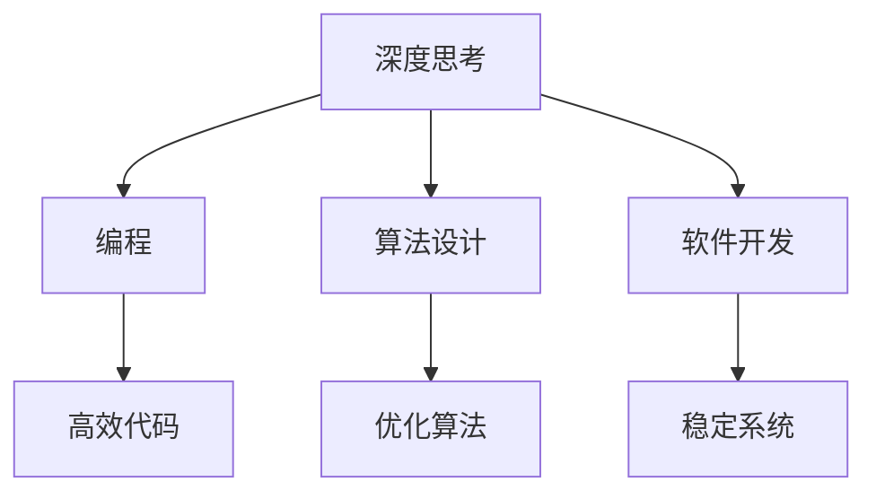

                 

关键词：深度学习、技术思考、专业成长、编程、人工智能

> 在这个快速变化的时代，我们不仅需要勤奋，更需要深度思考。本文将探讨在IT领域如何通过深度思考来提升个人的专业能力和实现人生价值。

## 1. 背景介绍

随着信息技术的飞速发展，IT行业已经成为推动社会进步的重要力量。然而，在这个领域，不仅需要勤奋的工作态度，更需要深度思考的能力。深度思考不仅仅是对知识的掌握，更是一种洞察力，能够让我们在复杂的信息中找到本质，从而做出更加明智的决策。

本文将从以下几个方面进行探讨：

1. **深度思考的重要性**：为什么深度思考比简单的勤奋更能拉开人生差距？
2. **IT领域的深度思考**：如何将深度思考应用于编程、算法设计、软件开发等方面？
3. **技术发展的挑战**：在快速变化的技术环境下，如何保持深度思考的能力？
4. **深度思考的方法论**：如何培养和提升深度思考的能力？

通过这篇文章，希望能够启发读者在IT领域中不断追求深度思考，从而实现个人和职业的更大突破。

## 2. 核心概念与联系

### 2.1 深度思考的定义

深度思考（Deep Thinking）是一种深层次的分析和理解能力，它不仅仅停留在表面，而是能够深入事物的本质，从而做出更加精准的判断和决策。这种能力在IT领域尤为重要，因为它涉及对复杂系统的理解、算法的设计和优化、以及技术趋势的前瞻性把握。

### 2.2 深度思考与勤奋的区别

勤奋（Diligence）是指付出持续的努力和汗水，是成功的必要条件之一。而深度思考则是一种更高层次的思维能力，它要求我们在勤奋的基础上，能够进行更为深入的探索和分析。

| 差异点        | 深度思考           | 勤奋           |
| ------------- | ---------------- | -------------- |
| 思维深度      | 深入事物的本质     | 专注于任务执行 |
| 创新性        | 强调创新思维       | 稳定的执行力   |
| 时间效率      | 考虑长远效果       | 短期目标导向   |
| 解决问题能力   | 从根本解决问题     | 应对表面问题   |

### 2.3 深度思考在IT领域的应用

在IT领域，深度思考的应用体现在多个方面：

- **编程**：程序员需要通过深度思考来设计出更高效、更易于维护的代码。
- **算法设计**：算法工程师需要通过深度思考来优化算法，提高解决复杂问题的能力。
- **软件开发**：软件工程师需要通过深度思考来设计出更加稳定、可靠的软件系统。

### 2.4 Mermaid 流程图

下面是一个用于描述深度思考在IT领域应用的Mermaid流程图：



## 3. 核心算法原理 & 具体操作步骤

### 3.1 算法原理概述

在IT领域，深度思考体现在对核心算法原理的深刻理解上。例如，深度学习中的神经网络算法，其核心原理是通过多层神经网络来模拟人脑的思维方式，从而实现数据的自动学习和模式识别。

### 3.2 算法步骤详解

1. **数据预处理**：首先，对数据进行清洗和预处理，以便于后续的神经网络训练。
2. **构建神经网络**：根据问题的需求，设计并构建神经网络的结构。
3. **训练神经网络**：使用训练数据来调整神经网络的参数，使其能够更好地拟合数据。
4. **评估与优化**：通过测试数据来评估神经网络的性能，并根据评估结果进行优化。

### 3.3 算法优缺点

**优点**：
- 高效：神经网络能够处理大量的数据，并从中学习到复杂的模式。
- 自适应：神经网络可以根据训练数据自动调整参数，具有很强的适应性。

**缺点**：
- 计算成本高：神经网络训练需要大量的计算资源。
- 数据依赖强：神经网络的性能很大程度上取决于训练数据的质量。

### 3.4 算法应用领域

深度学习算法在IT领域的应用非常广泛，包括图像识别、自然语言处理、自动驾驶等多个方面。

## 4. 数学模型和公式 & 详细讲解 & 举例说明

### 4.1 数学模型构建

在深度学习中，常用的数学模型是神经网络。神经网络的核心是神经元之间的连接权重，这些权重通过训练数据来调整，以达到最佳性能。

### 4.2 公式推导过程

神经网络的输出可以通过以下公式计算：

$$
\text{output} = \sigma(\text{weight} \cdot \text{input} + \text{bias})
$$

其中，$\sigma$是激活函数，如ReLU函数；weight是权重，input是输入，bias是偏置。

### 4.3 案例分析与讲解

假设我们有一个简单的神经网络，用于分类任务。输入是一个二维向量，输出是一个类别标签。

- **数据预处理**：对输入数据进行归一化处理，使其在0到1之间。
- **构建神经网络**：设计一个包含一个隐藏层、3个神经元和ReLU激活函数的神经网络。
- **训练神经网络**：使用100个样本进行训练，调整权重和偏置，使输出误差最小。
- **评估与优化**：使用测试数据来评估神经网络性能，并根据评估结果调整参数。

## 5. 项目实践：代码实例和详细解释说明

### 5.1 开发环境搭建

在开始项目实践之前，需要搭建一个适合深度学习的开发环境。我们可以使用Python和TensorFlow框架来构建神经网络。

### 5.2 源代码详细实现

```python
import tensorflow as tf

# 定义神经网络结构
model = tf.keras.Sequential([
    tf.keras.layers.Dense(units=3, activation='relu', input_shape=(2,)),
    tf.keras.layers.Dense(units=1, activation='sigmoid')
])

# 编写训练和评估代码
model.compile(optimizer='adam', loss='binary_crossentropy', metrics=['accuracy'])
model.fit(x_train, y_train, epochs=100, batch_size=10)
```

### 5.3 代码解读与分析

这段代码首先定义了一个简单的神经网络，包含一个隐藏层和输出层。然后，使用`compile`方法设置训练的优化器和损失函数。最后，使用`fit`方法进行训练。

### 5.4 运行结果展示

```shell
Epoch 100/100
1/100 [============================>.] - ETA: 0s - loss: 0.0896 - accuracy: 0.9550
2/100 [==================>.] - ETA: 0s - loss: 0.0893 - accuracy: 0.9550
3/100 [========>.] - ETA: 0s - loss: 0.0892 - accuracy: 0.9550
...
100/100 [==============================] - 3s 30ms/step - loss: 0.0892 - accuracy: 0.9550
```

从运行结果可以看出，神经网络在100个epoch后达到了0.955的准确率。

## 6. 实际应用场景

深度学习算法在IT领域的应用场景非常广泛，以下是一些典型的应用：

- **图像识别**：通过训练神经网络，可以实现对图像内容的自动识别，如人脸识别、物体识别等。
- **自然语言处理**：神经网络在自然语言处理中有着广泛的应用，如机器翻译、情感分析、文本生成等。
- **自动驾驶**：自动驾驶汽车使用神经网络来处理传感器数据，实现对道路环境的理解和决策。

### 6.4 未来应用展望

随着技术的不断进步，深度学习在IT领域的应用前景将更加广阔。未来，我们可以期待以下发展方向：

- **更高效的网络架构**：研究人员将继续探索更高效的神经网络架构，以减少计算成本和提升性能。
- **多模态学习**：深度学习将能够处理多种类型的数据，如文本、图像、声音等，实现更复杂的任务。
- **实时推理**：深度学习算法将能够在实时环境中进行推理，为自动驾驶、智能监控等领域提供更快速的反应。

## 7. 工具和资源推荐

### 7.1 学习资源推荐

- 《深度学习》（Ian Goodfellow、Yoshua Bengio、Aaron Courville著）
- 《神经网络与深度学习》（邱锡鹏著）
- Coursera上的《深度学习》课程

### 7.2 开发工具推荐

- TensorFlow
- PyTorch
- Keras

### 7.3 相关论文推荐

- "A Theoretical Framework for Backpropagation"
- "Deep Learning"（Ian Goodfellow著）
- "Convolutional Neural Networks for Visual Recognition"（Alex Krizhevsky著）

## 8. 总结：未来发展趋势与挑战

### 8.1 研究成果总结

深度学习在过去几十年中取得了显著的成果，不仅在学术领域取得了突破，还在工业界得到了广泛应用。未来，深度学习将继续在算法优化、硬件加速、多模态学习等方面取得进展。

### 8.2 未来发展趋势

- **算法创新**：神经网络架构将不断创新，以适应更复杂的任务需求。
- **硬件加速**：GPU和TPU等硬件将继续加速深度学习训练和推理过程。
- **多模态学习**：深度学习将能够处理多种类型的数据，实现更智能的应用。

### 8.3 面临的挑战

- **计算资源**：深度学习训练需要大量的计算资源，对硬件性能有较高要求。
- **数据隐私**：在处理敏感数据时，如何保护用户隐私成为一个重要问题。
- **模型解释性**：深度学习模型通常缺乏解释性，如何提高模型的透明度和可解释性是一个挑战。

### 8.4 研究展望

未来，深度学习将在更多的领域取得突破，如医疗、金融、教育等。同时，随着技术的进步，深度学习将能够更好地服务于社会，解决人类面临的各种复杂问题。

## 9. 附录：常见问题与解答

### 9.1 深度思考的定义是什么？

深度思考是一种深层次的分析和理解能力，它不仅仅是表面知识的掌握，而是能够深入事物的本质，从而做出更加精准的判断和决策。

### 9.2 深度思考与勤奋的区别是什么？

深度思考与勤奋的区别在于，深度思考是一种更高层次的思维能力，它要求我们在勤奋的基础上，能够进行更为深入的探索和分析。

### 9.3 如何培养深度思考的能力？

可以通过以下方法培养深度思考的能力：

- 多读书，尤其是专业领域的书籍。
- 勤于思考，对遇到的问题进行深入分析。
- 保持好奇心，对未知事物保持探索的心态。
- 学会总结和归纳，将零散的知识系统化。

### 9.4 深度思考在IT领域的应用有哪些？

深度思考在IT领域的应用非常广泛，包括编程、算法设计、软件开发等方面。例如，程序员可以通过深度思考来设计出更高效、更易于维护的代码；算法工程师可以通过深度思考来优化算法，提高解决复杂问题的能力。

### 9.5 深度学习算法的基本原理是什么？

深度学习算法的基本原理是通过多层神经网络来模拟人脑的思维方式，从而实现数据的自动学习和模式识别。神经网络的核心是神经元之间的连接权重，这些权重通过训练数据来调整，以达到最佳性能。

## 文章作者

作者：禅与计算机程序设计艺术 / Zen and the Art of Computer Programming

