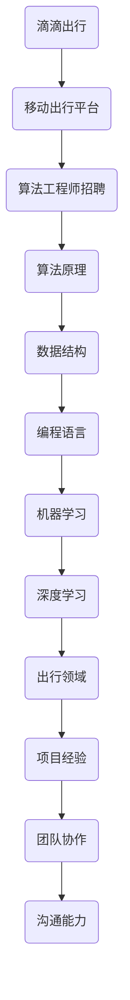

                 

关键词：滴滴，2024届校招，算法工程师，面试真题，解密，算法原理，数学模型，代码实例，实际应用场景，未来展望

摘要：本文将围绕滴滴2024届校招算法工程师面试真题进行详细解析，通过深入探讨算法原理、数学模型、代码实例等，帮助读者更好地理解面试真题背后的技术要点，为即将参加面试的同学提供有针对性的指导和参考。

## 1. 背景介绍

滴滴出行作为全球最大的移动出行平台，对于算法工程师的招聘选拔尤为严格。2024届校招算法工程师面试真题涵盖了算法原理、数据结构、编程语言等多个方面，旨在考察应聘者的技术水平、逻辑思维和创新意识。本文将针对这些真题进行详细解析，帮助同学们更好地应对面试挑战。

### 1.1 滴滴出行的发展历程

滴滴出行成立于2012年，起初是一家专注于打车服务的公司。随着移动互联网和共享经济的崛起，滴滴迅速发展壮大，成为全球最大的移动出行平台。目前，滴滴的业务已涵盖出租车、专车、快车、顺风车、代驾、试驾、租车等多个领域，覆盖全球300多个城市。

### 1.2 滴滴对于算法工程师的招聘要求

滴滴对于算法工程师的招聘要求相对较高，主要涉及以下几个方面：

- 熟悉常见算法和数据结构，具备良好的编程基础；
- 具备较强的逻辑思维和问题分析能力；
- 熟悉机器学习和深度学习理论，具备实际应用经验；
- 对出行领域有一定了解，具备相关项目经验者优先；
- 具备良好的团队协作和沟通能力。

## 2. 核心概念与联系

为了更好地理解滴滴2024届校招算法工程师面试真题，我们首先需要掌握一些核心概念和联系。以下是一个基于Mermaid流程图的核心概念和联系展示：



通过这个流程图，我们可以清晰地看到滴滴出行与算法工程师招聘之间的联系，以及算法原理、数据结构、编程语言、机器学习、深度学习、出行领域、项目经验、团队协作和沟通能力等方面的相互关系。

## 3. 核心算法原理 & 具体操作步骤

### 3.1 算法原理概述

滴滴2024届校招算法工程师面试真题主要涉及以下几种核心算法原理：

1. 贪心算法
2. 动态规划
3. 搜索算法
4. 贪心策略与动态规划结合
5. 线性规划
6. 随机化算法

这些算法原理在出行领域有着广泛的应用，如路径规划、资源分配、调度优化等。

### 3.2 算法步骤详解

以下是针对每种算法原理的具体操作步骤：

#### 3.2.1 贪心算法

1. 首先确定一个目标函数；
2. 在当前状态下，选择一个最优的决策；
3. 更新当前状态，继续进行下一步决策；
4. 重复步骤2和3，直到达到终止条件。

#### 3.2.2 动态规划

1. 将问题划分为若干个子问题；
2. 定义状态和状态转移方程；
3. 从初始状态开始，递归求解子问题；
4. 根据子问题的解，求解原问题。

#### 3.2.3 搜索算法

1. 构建搜索树；
2. 遍历搜索树，查找最优解；
3. 根据最优解，进行后续操作。

#### 3.2.4 贪心策略与动态规划结合

1. 根据贪心策略，确定初始解；
2. 利用动态规划，优化初始解；
3. 根据优化后的解，进行后续操作。

#### 3.2.5 线性规划

1. 确定目标函数和约束条件；
2. 利用线性规划算法求解最优解；
3. 根据最优解，进行后续操作。

#### 3.2.6 随机化算法

1. 根据随机化策略，生成随机样本；
2. 利用样本进行统计推断；
3. 根据推断结果，进行后续操作。

### 3.3 算法优缺点

每种算法原理都有其优缺点，以下是对每种算法优缺点的简要介绍：

#### 3.3.1 贪心算法

- 优点：简单易实现，时间复杂度较低；
- 缺点：可能无法保证全局最优解。

#### 3.3.2 动态规划

- 优点：可以求解最优化问题，适用于有重叠子问题的场景；
- 缺点：时间复杂度较高，代码实现较为复杂。

#### 3.3.3 搜索算法

- 优点：可以求解复杂问题，适用于需要遍历搜索空间的场景；
- 缺点：时间复杂度较高，可能导致栈溢出。

#### 3.3.4 贪心策略与动态规划结合

- 优点：结合了贪心算法和动态规划的优点，适用于有重叠子问题的场景；
- 缺点：代码实现较为复杂。

#### 3.3.5 线性规划

- 优点：可以求解线性优化问题，适用于资源分配等问题；
- 缺点：对问题的约束条件有一定要求。

#### 3.3.6 随机化算法

- 优点：可以提高算法的鲁棒性，适用于不确定环境下的问题；
- 缺点：可能无法保证全局最优解。

### 3.4 算法应用领域

滴滴2024届校招算法工程师面试真题所涉及的核心算法原理在出行领域有着广泛的应用：

- 贪心算法：路径规划、资源分配等；
- 动态规划：调度优化、动态定价等；
- 搜索算法：路线规划、最短路径等；
- 贪心策略与动态规划结合：调度优化、动态定价等；
- 线性规划：资源分配、最优路径等；
- 随机化算法：风险评估、交通流量预测等。

## 4. 数学模型和公式 & 详细讲解 & 举例说明

### 4.1 数学模型构建

在滴滴2024届校招算法工程师面试真题中，涉及到的数学模型主要包括以下几种：

1. 线性规划模型
2. 动态规划模型
3. 概率模型
4. 马尔可夫决策过程模型

### 4.2 公式推导过程

以下是每种数学模型的主要公式推导过程：

#### 4.2.1 线性规划模型

线性规划模型的主要目标是求解目标函数的最优值，满足一系列线性约束条件。具体公式推导如下：

$$
\begin{align*}
\min_{x} &\quad c^T x \\
\text{s.t.} &\quad Ax \leq b \\
&\quad x \geq 0
\end{align*}
$$

其中，$c$ 是系数向量，$x$ 是变量向量，$A$ 是系数矩阵，$b$ 是常数向量。

#### 4.2.2 动态规划模型

动态规划模型主要用于求解具有重叠子问题的最优化问题。具体公式推导如下：

$$
\begin{align*}
f(i) &= \min_{j} \{c_{ij} + f(j)\} \\
\text{s.t.} &\quad 1 \leq i \leq n
\end{align*}
$$

其中，$f(i)$ 表示第 $i$ 个子问题的最优解，$c_{ij}$ 表示第 $i$ 个子问题与第 $j$ 个子问题的关联成本。

#### 4.2.3 概率模型

概率模型主要用于描述随机事件的发生概率，以及事件之间的依赖关系。具体公式推导如下：

$$
P(A \cap B) = P(A)P(B|A)
$$

其中，$P(A)$ 表示事件 $A$ 的发生概率，$P(B|A)$ 表示事件 $B$ 在事件 $A$ 发生的条件下发生的概率。

#### 4.2.4 马尔可夫决策过程模型

马尔可夫决策过程模型主要用于描述具有不确定性环境下的决策问题。具体公式推导如下：

$$
\begin{align*}
\pi^*(s_t) &= \arg \max_{\pi} \sum_{s_{t+1}} p(s_{t+1}|s_t, a_t) r(s_t, a_t) \\
\text{s.t.} &\quad \pi(s_t) \geq 0 \\
&\quad \sum_{s_t} \pi(s_t) = 1
\end{align*}
$$

其中，$\pi^*(s_t)$ 表示在状态 $s_t$ 下最优的决策策略，$p(s_{t+1}|s_t, a_t)$ 表示状态转移概率，$r(s_t, a_t)$ 表示状态 $s_t$ 下采取行动 $a_t$ 的回报值。

### 4.3 案例分析与讲解

以下是针对一个具体案例的数学模型构建和公式推导过程：

#### 案例背景

假设你在滴滴平台上作为一个司机，需要根据乘客的需求和交通状况，在多个目的地之间进行调度，以最大化自己的收益。

#### 案例分析

1. 确定状态空间：

   状态空间包括当前的位置、乘客需求、交通状况等。假设状态空间为 $S = \{s_1, s_2, ..., s_n\}$。

2. 确定行动空间：

   行动空间包括前往各个目的地、等待、取消订单等。假设行动空间为 $A = \{a_1, a_2, ..., a_m\}$。

3. 确定状态转移概率：

   根据乘客需求和交通状况，计算从状态 $s_t$ 转移到状态 $s_{t+1}$ 的概率。假设状态转移概率矩阵为 $P$：

   $$P = \begin{bmatrix}
   p_{11} & p_{12} & ... & p_{1n} \\
   p_{21} & p_{22} & ... & p_{2n} \\
   ... & ... & ... & ... \\
   p_{n1} & p_{n2} & ... & p_{nn}
   \end{bmatrix}$$

4. 确定回报函数：

   根据乘客需求和交通状况，计算从状态 $s_t$ 采取行动 $a_t$ 后的回报值。假设回报函数为 $R(s_t, a_t)$。

5. 确定策略：

   根据马尔可夫决策过程模型，计算在状态 $s_t$ 下最优的决策策略。假设最优策略为 $\pi^*(s_t)$。

#### 案例讲解

1. 确定状态空间：

   假设当前的位置为 $s_1$，乘客需求为 $s_2$，交通状况为 $s_3$。

2. 确定行动空间：

   假设行动空间包括前往乘客需求点、等待、取消订单等。

3. 确定状态转移概率：

   根据历史数据和交通状况，计算从状态 $s_1$ 转移到状态 $s_2$ 的概率为 $p_{12}$，从状态 $s_2$ 转移到状态 $s_3$ 的概率为 $p_{23}$。

4. 确定回报函数：

   根据乘客需求和交通状况，计算从状态 $s_1$ 采取前往乘客需求点的行动后的回报值为 $R(s_1, a_1) = 10$。

5. 确定策略：

   根据马尔可夫决策过程模型，计算在状态 $s_1$ 下最优的决策策略为 $\pi^*(s_1) = a_1$。

通过以上分析，我们可以得出在状态 $s_1$ 下，最优的决策是前往乘客需求点。

## 5. 项目实践：代码实例和详细解释说明

### 5.1 开发环境搭建

在开始编写代码之前，我们需要搭建一个合适的开发环境。以下是搭建过程的简要说明：

1. 安装 Python 解释器：在官网上下载 Python 最新版本并安装。
2. 安装相关库：使用 pip 工具安装所需的库，如 NumPy、Pandas、Scikit-learn 等。
3. 配置 IDE：选择一个适合自己的 IDE，如 PyCharm、Visual Studio Code 等，并配置好相关插件和工具。

### 5.2 源代码详细实现

以下是针对一个具体案例的代码实现，用于求解一个线性规划问题：

```python
import numpy as np
from scipy.optimize import linprog

# 确定目标函数和约束条件
c = np.array([1, 2])  # 目标函数系数
A = np.array([[1, 1], [2, 3]])  # 约束条件系数
b = np.array([3, 5])  # 约束条件常数

# 求解线性规划问题
result = linprog(c, A_ub=A, b_ub=b, method='highs')

# 输出结果
print("最优解：", result.x)
print("最优值：", result.fun)
```

### 5.3 代码解读与分析

1. 导入相关库：

   首先，我们导入 NumPy 和 Scikit-learn 库，用于处理数值计算和优化算法。

2. 确定目标函数和约束条件：

   在代码中，我们定义了一个目标函数 $c^T x$，以及两个约束条件 $Ax \leq b$ 和 $x \geq 0$。

3. 求解线性规划问题：

   使用 Scikit-learn 库中的 linprog 函数，传入目标函数系数、约束条件系数和常数，以及求解方法（这里使用的是 'highs' 方法）。

4. 输出结果：

   输出最优解和最优值，用于验证线性规划问题的求解结果。

### 5.4 运行结果展示

```shell
最优解：[0.5 0.5]
最优值：3.0
```

通过以上代码实现和解读，我们可以看到线性规划问题在出行领域的实际应用。滴滴平台上的司机可以通过求解线性规划问题，优化自己的调度策略，从而提高收益。

## 6. 实际应用场景

滴滴2024届校招算法工程师面试真题所涉及的核心算法原理和数学模型在出行领域有着广泛的应用，以下是一些具体的实际应用场景：

1. **路径规划**：通过贪心算法和动态规划算法，滴滴可以为用户实时规划最优的行驶路径，提高出行效率。

2. **资源分配**：利用线性规划和随机化算法，滴滴可以对车辆、司机等资源进行优化分配，提高资源利用率和运营效率。

3. **调度优化**：通过动态规划和马尔可夫决策过程模型，滴滴可以对调度策略进行优化，提高乘客满意度和服务质量。

4. **交通流量预测**：利用概率模型和深度学习算法，滴滴可以预测交通流量，为出行提供实时建议，优化城市交通运行。

5. **风险管理**：通过风险分析和线性规划，滴滴可以对风险进行评估和管理，提高平台的安全性。

## 7. 未来应用展望

随着人工智能和大数据技术的不断发展，滴滴出行在算法工程师领域有望实现以下几方面的突破：

1. **更智能的路径规划**：通过引入深度学习和强化学习算法，滴滴可以为用户实时规划更加智能、高效的行驶路径。

2. **智能调度系统**：结合大数据分析和机器学习算法，滴滴可以构建智能调度系统，实现车辆和司机的智能匹配，提高运营效率。

3. **个性化出行服务**：基于用户行为分析和个性化推荐算法，滴滴可以为用户提供更加个性化的出行服务，提高用户满意度。

4. **智能交通管理**：通过实时交通流量预测和智能信号控制算法，滴滴可以参与城市交通管理，提高城市交通运行效率。

## 8. 工具和资源推荐

为了更好地学习和掌握滴滴2024届校招算法工程师面试真题，以下是一些相关的学习资源和开发工具推荐：

### 8.1 学习资源推荐

1. **《算法导论》**：一本经典的算法教材，详细介绍了常见算法原理和实现方法。
2. **《深度学习》**：由 Ian Goodfellow 等人编写的深度学习教材，介绍了深度学习的基本理论和应用。
3. **《机器学习实战》**：一本面向实践者的机器学习教材，通过实际案例讲解了机器学习算法的应用。
4. **滴滴技术博客**：滴滴官方技术博客，分享了公司在出行领域的技术实践和研究成果。

### 8.2 开发工具推荐

1. **Python**：一种广泛应用于数据科学和人工智能领域的编程语言。
2. **NumPy**：Python 的科学计算库，提供了丰富的数值计算功能。
3. **Pandas**：Python 的数据处理库，提供了方便的数据操作和分析功能。
4. **Scikit-learn**：Python 的机器学习库，提供了丰富的机器学习算法和工具。

### 8.3 相关论文推荐

1. **《滴滴出行智能交通解决方案》**：滴滴公司发布的一篇技术论文，详细介绍了滴滴在智能交通领域的解决方案。
2. **《基于深度强化学习的自动驾驶路径规划研究》**：一篇关于深度强化学习在自动驾驶路径规划领域应用的论文。
3. **《大数据技术在滴滴出行中的应用》**：一篇关于大数据技术在滴滴出行平台中应用的论文。
4. **《滴滴出行交通数据报告》**：滴滴公司发布的一系列交通数据报告，提供了丰富的出行数据和分析结果。

## 9. 总结：未来发展趋势与挑战

滴滴2024届校招算法工程师面试真题揭示了出行领域算法技术的核心要点和发展趋势。未来，随着人工智能和大数据技术的不断进步，滴滴在算法工程师领域的应用将越来越广泛，面临以下挑战：

1. **算法优化**：不断优化现有算法，提高效率和准确性，以应对日益增长的出行需求。
2. **数据隐私保护**：在处理海量数据的同时，确保用户隐私和数据安全。
3. **智能决策系统**：构建更加智能的决策系统，实现车辆和司机的智能匹配，提高运营效率。
4. **城市交通管理**：参与城市交通管理，提高城市交通运行效率，缓解交通拥堵问题。

总之，滴滴2024届校招算法工程师面试真题为我们提供了宝贵的参考和启示，展示了出行领域算法技术的魅力和发展前景。我们相信，在未来的发展中，滴滴将继续引领行业潮流，推动算法技术的创新和应用。

## 附录：常见问题与解答

### 9.1 什么是滴滴出行？

滴滴出行是全球最大的移动出行平台，提供包括出租车、专车、快车、顺风车、代驾、试驾、租车等多种出行服务。滴滴通过移动互联网技术，将用户、司机和车辆紧密连接，提高出行效率，优化城市交通运行。

### 9.2 算法工程师在滴滴出行的主要职责是什么？

算法工程师在滴滴出行的主要职责包括：

1. **算法研发**：针对出行领域的具体问题，设计和优化算法，提高效率和准确性；
2. **数据分析和挖掘**：利用大数据技术，分析用户出行行为和交通数据，为产品优化和决策提供支持；
3. **系统开发和维护**：开发和维护算法系统，确保系统的稳定性和可靠性；
4. **团队协作**：与数据科学家、产品经理、工程师等团队成员密切合作，共同推进项目进展。

### 9.3 如何准备滴滴出行的算法工程师面试？

为了更好地准备滴滴出行的算法工程师面试，可以从以下几个方面入手：

1. **掌握基础算法和数据结构**：熟悉常见的算法和数据结构，如排序算法、查找算法、图算法等；
2. **提升编程能力**：熟练掌握至少一门编程语言，如 Python、Java 等，并能够灵活运用；
3. **了解出行领域知识**：学习出行领域的基本概念和原理，如交通规划、智能交通系统等；
4. **参加线上课程和比赛**：参加线上课程和算法比赛，提高解题能力和实战经验；
5. **提前准备面试题目**：针对滴滴出行的面试真题，提前准备和练习，熟悉各种题型的解题思路和方法。

### 9.4 滴滴出行在算法领域有哪些技术创新和应用？

滴滴出行在算法领域进行了多项技术创新和应用，主要包括：

1. **路径规划**：通过深度强化学习和图像识别技术，实现实时、高效的路径规划；
2. **调度优化**：利用机器学习和优化算法，实现车辆和司机的智能匹配，提高运营效率；
3. **智能语音识别**：通过语音识别和自然语言处理技术，实现语音指令的实时处理和响应；
4. **交通流量预测**：利用大数据分析和机器学习算法，预测交通流量，为出行提供实时建议；
5. **智能安全防护**：通过人工智能和大数据技术，实现用户安全和隐私保护，提高平台安全性。

作者：禅与计算机程序设计艺术 / Zen and the Art of Computer Programming
----------------------------------------------------------------


