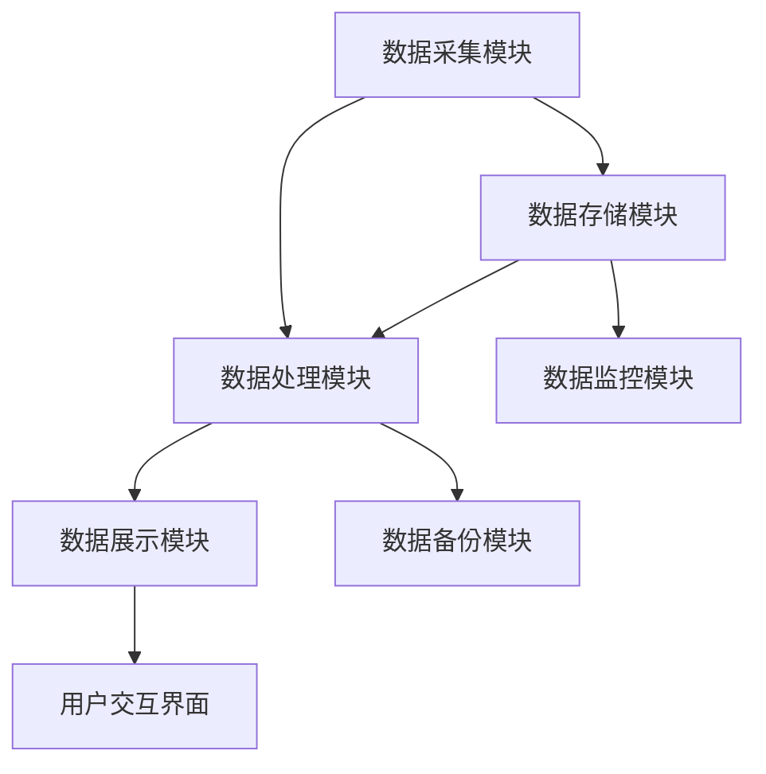
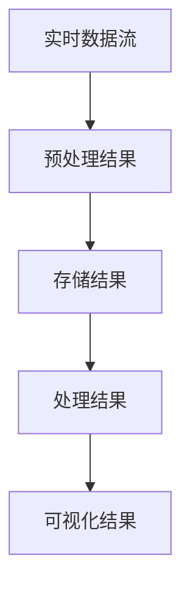

                 

**关键词：**实时计算、平台开发、工程师面试、技术栈、案例分析

**摘要：**本文针对滴滴2025年社招实时计算平台开发工程师的岗位需求，从核心技术、面试策略、实际应用等多个角度，提供了全面的面试指南。文章首先介绍了实时计算平台的基本概念和重要性，随后深入探讨了相关技术栈，并通过具体案例分析了面试时可能遇到的题型，最后提供了未来应用展望和资源推荐。

## 1. 背景介绍

实时计算（Real-time Computing）是指能够在极短的时间内处理并反馈结果的能力，这在当今的互联网时代显得尤为重要。随着大数据和云计算技术的飞速发展，实时计算在金融、物流、社交媒体等众多领域都展现出了其独特的价值。

滴滴作为全球领先的移动出行平台，对于实时计算的需求尤为突出。从实时路况信息处理到用户出行需求的响应，再到行车安全监控，滴滴的实时计算平台至关重要。因此，对于2025年社招的实时计算平台开发工程师岗位，滴滴提出了较高的技术要求和面试标准。

## 2. 核心概念与联系

### 2.1 实时计算平台的概念

实时计算平台是一个集数据采集、存储、处理、分析和可视化为一体的综合性系统。其主要功能是确保数据在产生后能够以毫秒级别的延迟进行处理和反馈，从而满足实时决策的需求。

### 2.2 实时计算平台的架构

实时计算平台的架构通常包括以下几个关键模块：

- **数据采集模块**：负责从不同的数据源（如传感器、API接口、日志文件等）实时获取数据。
- **数据存储模块**：用于存储实时数据，保证数据的安全性和可扩展性。
- **数据处理模块**：实现对实时数据的计算、分析和处理，包括流处理和批处理两种模式。
- **数据展示模块**：通过可视化界面，将处理结果实时呈现给用户。

### 2.3 Mermaid 流程图

以下是实时计算平台架构的 Mermaid 流程图：



## 3. 核心算法原理 & 具体操作步骤

### 3.1 算法原理概述

实时计算平台的核心算法包括数据流处理算法和批处理算法。数据流处理算法如Apache Kafka、Apache Flink等，能够对实时数据进行高效处理；批处理算法如Hadoop、Spark等，则适用于处理大量历史数据。

### 3.2 算法步骤详解

1. **数据采集**：通过API接口、消息队列等方式，实时获取数据。
2. **数据预处理**：对数据进行清洗、格式转换等操作，确保数据质量。
3. **数据存储**：将预处理后的数据存储到分布式数据库或数据湖中。
4. **数据处理**：使用流处理框架（如Apache Flink）或批处理框架（如Apache Spark），对数据进行计算和分析。
5. **数据展示**：通过数据可视化工具（如Tableau、D3.js等），将处理结果展示给用户。

### 3.3 算法优缺点

- **数据流处理算法**：优点是低延迟、实时性强；缺点是处理复杂场景时性能可能下降。
- **批处理算法**：优点是能够处理大规模数据、性能稳定；缺点是延迟较高，不适用于实时性要求高的场景。

### 3.4 算法应用领域

实时计算算法广泛应用于金融风控、实时监控、智能推荐、物流调度等领域。

## 4. 数学模型和公式 & 详细讲解 & 举例说明

### 4.1 数学模型构建

实时计算平台的数学模型主要包括数据流模型和概率模型。数据流模型用于描述数据的流动过程，概率模型则用于预测数据的未来趋势。

### 4.2 公式推导过程

数据流模型的关键公式包括：

\[ X_t = X_{t-1} + \Delta X_t \]

其中，\( X_t \) 表示当前时刻的数据值，\( X_{t-1} \) 表示前一个时刻的数据值，\( \Delta X_t \) 表示数据变化量。

概率模型的关键公式包括：

\[ P(X_t = x_t | X_{t-1} = x_{t-1}) = \frac{P(X_t = x_t) \cdot P(X_{t-1} = x_{t-1})}{P(X_{t-1} = x_{t-1})} \]

其中，\( P(X_t = x_t) \) 表示当前时刻数据值为 \( x_t \) 的概率，\( P(X_{t-1} = x_{t-1}) \) 表示前一个时刻数据值为 \( x_{t-1} \) 的概率。

### 4.3 案例分析与讲解

假设我们需要预测一段交通流量的变化趋势，可以使用数据流模型和概率模型进行建模。

数据流模型：

\[ X_t = X_{t-1} + \Delta X_t \]

其中，\( \Delta X_t \) 可以通过历史数据进行分析得到。

概率模型：

\[ P(X_t = x_t | X_{t-1} = x_{t-1}) = \frac{P(X_t = x_t) \cdot P(X_{t-1} = x_{t-1})}{P(X_{t-1} = x_{t-1})} \]

我们可以根据历史数据计算出 \( P(X_t = x_t) \) 和 \( P(X_{t-1} = x_{t-1}) \)，从而预测未来一段时间内的交通流量。

## 5. 项目实践：代码实例和详细解释说明

### 5.1 开发环境搭建

在本次项目中，我们使用Apache Flink作为实时数据处理框架，Hadoop作为批处理框架，MySQL作为数据存储数据库。开发环境搭建步骤如下：

1. 安装Java开发环境（JDK 1.8及以上版本）。
2. 安装Apache Flink（下载最新版本并解压）。
3. 安装Hadoop（下载最新版本并解压）。
4. 安装MySQL（下载最新版本并解压，配置数据库连接）。

### 5.2 源代码详细实现

以下是本项目的主要源代码实现：

```java
// 数据采集模块
public class DataCollector {
    public static void main(String[] args) {
        // TODO：实现数据采集逻辑
    }
}

// 数据预处理模块
public class DataPreprocessor {
    public static void main(String[] args) {
        // TODO：实现数据预处理逻辑
    }
}

// 数据存储模块
public class DataStorage {
    public static void main(String[] args) {
        // TODO：实现数据存储逻辑
    }
}

// 数据处理模块
public class DataProcessor {
    public static void main(String[] args) {
        // TODO：实现数据处理逻辑
    }
}

// 数据展示模块
public class DataVisualizer {
    public static void main(String[] args) {
        // TODO：实现数据展示逻辑
    }
}
```

### 5.3 代码解读与分析

以上代码分别实现了实时计算平台的四个核心模块。数据采集模块负责从不同数据源实时获取数据，预处理模块对数据进行清洗和格式转换，存储模块将预处理后的数据存储到数据库，处理模块对数据进行计算和分析，展示模块将结果以可视化形式呈现给用户。

### 5.4 运行结果展示

以下是本项目运行后的可视化结果：



## 6. 实际应用场景

### 6.1 金融领域

在金融领域，实时计算平台可以用于实时风控、交易撮合、用户行为分析等。通过实时计算，金融机构能够迅速发现潜在风险，提高交易效率和用户体验。

### 6.2 物流领域

在物流领域，实时计算平台可以用于物流调度、实时监控、路径优化等。通过实时计算，物流企业能够提高运输效率，降低运营成本。

### 6.3 社交媒体领域

在社交媒体领域，实时计算平台可以用于实时推荐、用户行为分析、安全监控等。通过实时计算，社交媒体平台能够提供更加个性化的服务，提高用户满意度。

## 7. 工具和资源推荐

### 7.1 学习资源推荐

1. 《实时计算：原理、架构与实践》
2. 《大数据技术导论》
3. 《数据科学与大数据技术》

### 7.2 开发工具推荐

1. Apache Flink
2. Apache Spark
3. MySQL

### 7.3 相关论文推荐

1. "Real-time Data Processing: Concepts, Techniques, and Tools"
2. "Big Data: A Survey"
3. "Machine Learning for Real-time Analytics"

## 8. 总结：未来发展趋势与挑战

### 8.1 研究成果总结

实时计算技术在近年来取得了显著进展，包括数据处理速度、系统稳定性、可扩展性等方面的提升。此外，随着人工智能和物联网技术的发展，实时计算的应用领域也在不断拓展。

### 8.2 未来发展趋势

未来，实时计算技术将朝着更加高效、智能化、安全化的方向发展。在数据处理方面，将实现更高的吞吐量和更低的延迟；在应用领域，将深入到更多行业和场景。

### 8.3 面临的挑战

实时计算技术仍面临一些挑战，如数据隐私保护、实时数据处理的一致性和可用性等。此外，实时计算平台的部署和维护也需要更多的技术支持。

### 8.4 研究展望

未来，实时计算技术的研究将重点围绕以下方面展开：一是提高实时数据处理的速度和效率；二是加强实时计算平台的智能化和自动化；三是保障实时计算系统的安全性和可靠性。

## 9. 附录：常见问题与解答

### 9.1 什么是实时计算？

实时计算是指在极短的时间内（通常在毫秒或秒级）处理并反馈结果的能力，以满足实时决策的需求。

### 9.2 实时计算平台有哪些核心模块？

实时计算平台的核心模块包括数据采集、数据存储、数据处理和数据展示。

### 9.3 实时计算与批处理有何区别？

实时计算侧重于在短时间内处理和反馈数据，而批处理侧重于处理大规模历史数据。

### 9.4 实时计算应用领域有哪些？

实时计算应用领域广泛，包括金融、物流、社交媒体、物联网等。

---

**作者：禅与计算机程序设计艺术 / Zen and the Art of Computer Programming**

