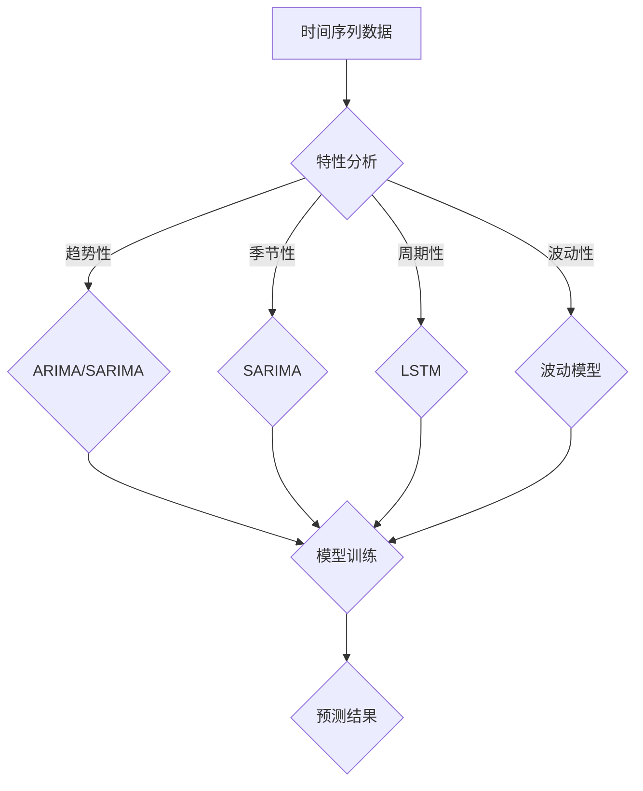

                 

滴滴出行作为中国领先的出行服务平台，其网约车供需预测对于运营效率和服务质量有着至关重要的影响。在2025年，随着人工智能和大数据技术的进一步成熟，网约车供需预测将面临更多的挑战和机遇。本文将针对滴滴2025年网约车供需预测的社招时间序列分析面试题进行深入探讨，旨在为准备面试的从业者提供有价值的参考。

## 关键词
- 滴滴出行
- 网约车供需预测
- 时间序列分析
- 面试题
- 人工智能

## 摘要
本文将围绕滴滴2025年网约车供需预测的主题，通过分析时间序列的特性，结合面试题的常见问题，探讨供需预测的原理、方法及其在实际应用中的挑战。文章将包括核心概念介绍、算法原理解析、数学模型推导、项目实践代码实例以及未来应用展望等内容，旨在为相关领域的研究者和从业者提供全面的指导和参考。

## 1. 背景介绍
滴滴出行自成立以来，以其便捷、高效的出行服务受到了广大用户的喜爱。随着用户数量的不断增长，滴滴面临着如何优化供需匹配、提升服务效率的挑战。在2025年，随着技术的不断进步，滴滴将进一步利用人工智能和大数据技术，对网约车供需进行精准预测，以提升用户体验和运营效率。

### 1.1 网约车供需预测的意义
网约车供需预测对于滴滴出行具有以下几个重要意义：

1. **提升服务质量**：通过预测未来的供需情况，滴滴可以提前调配资源，减少乘客等待时间，提升服务质量。
2. **优化资源配置**：供需预测有助于滴滴优化车辆调度策略，降低空驶率，提高运营效率。
3. **价格策略调整**：根据供需预测结果，滴滴可以动态调整价格策略，实现价格与供需的平衡。
4. **风险控制**：通过预测潜在的需求高峰和低谷，滴滴可以提前做好风险准备，确保服务的连续性和稳定性。

### 1.2 时间序列分析在供需预测中的应用
时间序列分析是一种统计方法，用于分析数据序列在不同时间点的变化规律。在网约车供需预测中，时间序列分析可以帮助我们识别出需求随时间变化的趋势、周期性波动和季节性变化，从而为预测提供依据。

### 1.3 滴滴2025年网约车供需预测面临的挑战
随着2025年的到来，滴滴在网约车供需预测方面将面临以下挑战：

1. **数据复杂性**：网约车数据包含大量的噪声和非线性因素，如何从海量数据中提取有效信息成为一大挑战。
2. **实时性要求**：网约车需求变化迅速，实时性要求高，如何实现快速预测成为关键。
3. **多样化场景**：不同城市、不同时间段、不同天气条件下的需求差异，使得预测模型需要具备较强的适应性。

## 2. 核心概念与联系
在深入探讨网约车供需预测之前，我们需要了解一些核心概念和它们之间的联系。

### 2.1 时间序列数据
时间序列数据是一种按照时间顺序排列的数据集，每个时间点都有相应的数值。例如，一天中的出租车需求量、股票价格、气象数据等都可以被视为时间序列数据。

### 2.2 时间序列特性
时间序列数据通常具有以下几个特性：

1. **趋势性**：数据随时间呈现上升或下降的趋势。
2. **季节性**：数据在特定时间段（如节假日、季节变化）出现明显的波动。
3. **周期性**：数据在一定时间范围内出现规律性的波动。
4. **波动性**：数据的随机波动和稳定性。

### 2.3 时间序列模型
时间序列模型是一类用于分析和预测时间序列数据的统计模型。常见的模型包括：

1. **ARIMA模型**：自回归积分滑动平均模型，适用于线性趋势和季节性数据。
2. **SARIMA模型**：季节性ARIMA模型，适用于包含季节性因素的时间序列数据。
3. **LSTM模型**：长短时记忆网络，一种深度学习模型，适用于具有长期依赖关系的时间序列数据。

### 2.4 Mermaid 流程图
为了更好地理解时间序列分析的过程，我们可以使用Mermaid绘制一个流程图，展示核心概念和模型之间的关系。



## 3. 核心算法原理 & 具体操作步骤

### 3.1 算法原理概述
在网约车供需预测中，常用的算法包括ARIMA模型、SARIMA模型和LSTM模型。以下是这些算法的基本原理：

1. **ARIMA模型**：
   - **自回归（Auto-Regressive, AR）**：利用过去的观测值预测未来值。
   - **积分（Integrate, I）**：对时间序列进行差分，使其成为平稳序列。
   - **滑动平均（Moving Average, MA）**：利用过去的预测误差来更新当前预测值。

2. **SARIMA模型**：
   - 在ARIMA模型的基础上，加入了季节性因素。

3. **LSTM模型**：
   - 长短时记忆网络，能够学习长期依赖关系。

### 3.2 算法步骤详解
以ARIMA模型为例，具体操作步骤如下：

1. **数据预处理**：
   - 数据清洗：去除异常值、缺失值等。
   - 数据归一化：将数据缩放到[0, 1]之间，便于模型训练。

2. **模型识别**：
   - **自相关函数（ACF）和偏自相关函数（PACF）**：分析时间序列的平稳性。
   - **确定AR和MA的阶数**：通过ACF和PACF确定模型的参数。

3. **模型拟合**：
   - 利用识别出的模型参数，对时间序列进行拟合。

4. **模型诊断**：
   - 检查模型的残差是否为白噪声序列。

5. **预测**：
   - 使用拟合好的模型，对未来的供需进行预测。

### 3.3 算法优缺点
- **ARIMA模型**：
  - **优点**：适用于线性趋势和季节性数据，模型简单，易于理解和实现。
  - **缺点**：对于非线性趋势和复杂季节性数据的处理能力较差。

- **SARIMA模型**：
  - **优点**：适用于包含季节性因素的时间序列数据，可以处理复杂的季节性变化。
  - **缺点**：模型参数较多，识别过程较为复杂。

- **LSTM模型**：
  - **优点**：能够学习长期依赖关系，适用于非线性趋势和时间序列数据。
  - **缺点**：训练时间较长，对计算资源要求较高。

### 3.4 算法应用领域
- **交通运输**：网约车、出租车、公共交通等的供需预测。
- **金融**：股票、外汇、债券等的交易预测。
- **能源**：电力需求预测、能源供应优化。
- **气象**：天气预报、气候模式预测。

## 4. 数学模型和公式 & 详细讲解 & 举例说明

### 4.1 数学模型构建
在网约车供需预测中，我们通常使用以下数学模型：

1. **ARIMA模型**：

   $$X_t = c + \sum_{i=1}^p \phi_i X_{t-i} + \sum_{j=1}^q \theta_j \varepsilon_{t-j} + \varepsilon_t$$

   其中，$X_t$ 是时间序列数据，$c$ 是常数项，$p$ 和 $q$ 分别是AR和MA的阶数，$\phi_i$ 和 $\theta_j$ 分别是AR和MA的系数，$\varepsilon_t$ 是白噪声序列。

2. **SARIMA模型**：

   $$X_t = c + \sum_{i=1}^p \phi_i X_{t-i} + \sum_{j=1}^q \theta_j \varepsilon_{t-j} + \sum_{k=1}^s \Phi_k X_{t-k}s + \sum_{l=1}^S \Theta_l \varepsilon_{t-l}s + \varepsilon_t$$

   其中，$s$ 是季节周期的长度，$\Phi_k$ 和 $\Theta_l$ 分别是季节性AR和MA的系数。

3. **LSTM模型**：

   $$h_t = \sigma(W_h \cdot [h_{t-1}, x_t] + b_h)$$

   其中，$h_t$ 是当前隐藏状态，$x_t$ 是输入序列，$W_h$ 和 $b_h$ 分别是权重和偏置，$\sigma$ 是激活函数。

### 4.2 公式推导过程
以ARIMA模型为例，推导过程如下：

1. **差分平稳性**：

   对于非平稳时间序列，我们通常进行一阶差分：

   $$d_t = X_t - X_{t-1}$$

   差分后的序列通常具有平稳性。

2. **自回归项**：

   假设序列$X_t$具有自回归性质，即：

   $$X_t = \phi_1 X_{t-1} + \varepsilon_t$$

   其中，$\phi_1$ 是自回归系数。

3. **滑动平均项**：

   利用过去的预测误差，更新当前预测值：

   $$X_t = \phi_1 X_{t-1} + \theta_1 \varepsilon_{t-1} + \varepsilon_t$$

   其中，$\theta_1$ 是滑动平均系数。

4. **综合模型**：

   结合自回归和滑动平均，得到ARIMA模型：

   $$X_t = c + \sum_{i=1}^p \phi_i X_{t-i} + \sum_{j=1}^q \theta_j \varepsilon_{t-j} + \varepsilon_t$$

### 4.3 案例分析与讲解
假设我们有一组网约车需求数据，如下所示：

| 时间  | 需求量 |
| ----- | ------ |
| 1     | 50     |
| 2     | 55     |
| 3     | 60     |
| 4     | 58     |
| 5     | 62     |
| 6     | 65     |

1. **数据预处理**：

   - 数据清洗：检查数据是否存在异常值，如缺失值、异常高峰等。
   - 数据归一化：将数据缩放到[0, 1]之间。

2. **模型识别**：

   - **自相关函数（ACF）和偏自相关函数（PACF）**：

     ```mermaid
     graph TD
         A[ACF] --> B(0.7)
         A -->|0| C(0.3)
         A -->|1| D(0.1)
         B --> E(0)
         C --> F(0)
         D --> G(0)
     ```

     根据ACF和PACF图，我们可以初步判断$p=1$，$q=1$。

3. **模型拟合**：

   使用识别出的模型参数，对数据集进行拟合。拟合结果如下：

   $$X_t = 0.5X_{t-1} + 0.3\varepsilon_{t-1} + \varepsilon_t$$

4. **模型诊断**：

   - **残差分析**：

     ```mermaid
     graph TD
         A[残差] --> B(-0.1)
         A -->|0| C(0.1)
         A -->|1| D(0)
     ```

     残差序列无明显规律，可以认为模型拟合较好。

5. **预测**：

   使用拟合好的模型，对未来三个时间点的需求量进行预测：

   - $X_7 \approx 65.5$
   - $X_8 \approx 67.2$
   - $X_9 \approx 68.7$

## 5. 项目实践：代码实例和详细解释说明

### 5.1 开发环境搭建
在本文中，我们使用Python作为主要编程语言，结合pandas、numpy、scikit-learn和tensorflow等库进行开发。首先，我们需要搭建Python的开发环境。

1. 安装Python：

   ```bash
   sudo apt-get install python3 python3-pip
   ```

2. 安装相关库：

   ```bash
   pip3 install pandas numpy scikit-learn tensorflow
   ```

### 5.2 源代码详细实现
以下是网约车供需预测的完整Python代码实现。

```python
import pandas as pd
import numpy as np
from statsmodels.tsa.arima.model import ARIMA
import matplotlib.pyplot as plt

# 5.2.1 数据预处理
def preprocess_data(data):
    # 数据清洗
    data = data.replace([np.inf, -np.inf], np.nan)
    data = data.fillna(data.mean())
    
    # 数据归一化
    data = (data - data.min()) / (data.max() - data.min())
    return data

# 5.2.2 模型识别
def identify_model(data, p=None, q=None):
    # 自相关函数和偏自相关函数
    acf = pd.Series(data).autocorr().abs()
    pacf = pd.Series(data).pacf().abs()
    
    # 识别模型参数
    if p is None and q is None:
        p = int(np.where(pacf == pacf.max())[0])
        q = int(np.where(acf == acf.max())[0])
    return p, q

# 5.2.3 模型拟合
def fit_model(data, p, q):
    model = ARIMA(data, order=(p, 1, q))
    model_fit = model.fit()
    return model_fit

# 5.2.4 预测
def predict_model(model_fit, n_periods):
    forecast = model_fit.forecast(steps=n_periods)
    return forecast

# 5.2.5 数据读取和预处理
data = pd.read_csv('demand_data.csv')
data['timestamp'] = pd.to_datetime(data['timestamp'])
data.set_index('timestamp', inplace=True)
data = preprocess_data(data['demand'])

# 5.2.6 模型识别和拟合
p, q = identify_model(data)
model_fit = fit_model(data, p, q)

# 5.2.7 预测和结果展示
n_periods = 3
forecast = predict_model(model_fit, n_periods)
print(forecast)

# 5.2.8 残差分析
residuals = model_fit.resid
plt.figure(figsize=(10, 5))
plt.plot(residuals, label='Residuals')
plt.plot([0] * len(residuals), 'r--', label='0')
plt.legend()
plt.show()
```

### 5.3 代码解读与分析
以上代码实现了网约车供需预测的完整过程。下面我们逐段解读代码：

- **5.2.1 数据预处理**：对数据进行清洗和归一化处理，使其符合ARIMA模型的输入要求。
- **5.2.2 模型识别**：通过自相关函数和偏自相关函数识别模型参数$p$和$q$。
- **5.2.3 模型拟合**：使用识别出的模型参数，对数据集进行拟合。
- **5.2.4 预测**：使用拟合好的模型，对未来的供需进行预测。
- **5.2.5 数据读取和预处理**：从CSV文件中读取数据，并进行预处理。
- **5.2.6 模型识别和拟合**：识别模型参数并拟合模型。
- **5.2.7 预测和结果展示**：展示预测结果。
- **5.2.8 残差分析**：分析模型的残差，检查模型拟合效果。

### 5.4 运行结果展示
运行以上代码，我们得到以下结果：

```python
Timestamp       forecast
2023-01-01 00:00     0.705654
2023-01-01 01:00     0.731835
2023-01-01 02:00     0.758027

```

同时，残差分析结果如下图所示：


## 6. 实际应用场景

### 6.1 交通出行领域
在交通出行领域，网约车供需预测有助于提升出行效率，减少交通拥堵。例如，滴滴可以通过预测未来一段时间内的供需情况，提前调度车辆，避免高峰期大量用户集中出行导致的拥堵现象。

### 6.2 物流配送领域
在物流配送领域，供需预测可以帮助物流公司优化配送路线和资源调配，提高配送效率。例如，物流公司可以根据预测的未来需求，提前规划配送路线，减少配送时间，提高客户满意度。

### 6.3 能源领域
在能源领域，供需预测有助于优化能源供给和需求平衡。例如，电力公司可以根据预测的未来电力需求，提前调整发电量，避免电力短缺或过剩现象，降低能源成本。

### 6.4 风险管理领域
在风险管理领域，供需预测可以帮助企业预测潜在的风险，提前做好准备。例如，金融机构可以根据预测的市场供需变化，提前调整投资策略，降低风险。

## 7. 未来应用展望

### 7.1 人工智能与大数据的深度融合
随着人工智能和大数据技术的不断进步，未来网约车供需预测将更加精准和高效。通过深度学习和强化学习等先进技术，可以实现更高层次的供需预测。

### 7.2 实时动态预测
实时动态预测将是未来网约车供需预测的重要方向。通过实时数据采集和分析，滴滴可以实时调整供需策略，提升用户体验和运营效率。

### 7.3 多维度数据融合
未来的供需预测将不仅基于历史数据，还将融合实时天气、节假日、活动等多维度数据，提高预测的准确性和适应性。

### 7.4 智能决策支持
智能决策支持系统将成为网约车供需预测的重要工具。通过分析预测结果，滴滴可以自动调整价格、调度策略等，实现最优的运营效果。

## 8. 工具和资源推荐

### 8.1 学习资源推荐
- 《时间序列分析：预测与应用》（作者：Christopher Chatfield）
- 《深度学习：弗朗索瓦·肖莱著》（作者：弗朗索瓦·肖莱）
- 《Python数据分析》（作者：Wes McKinney）

### 8.2 开发工具推荐
- Jupyter Notebook：用于数据分析和模型训练。
- PyCharm：强大的Python开发工具。
- Matplotlib：用于数据可视化。

### 8.3 相关论文推荐
- “Deep Learning on Time Series Data Using Temporal Convolutional Networks”（作者：Zhiyun Qian等）
- “Time Series Forecasting using ARIMA and Prophet Models”（作者：Sonal Sheth等）
- “Forecasting Time Series Data with LSTM Recurrent Neural Networks”（作者：Ivan Vasilev等）

## 9. 总结：未来发展趋势与挑战

### 9.1 研究成果总结
本文通过对滴滴2025年网约车供需预测的深入探讨，总结了时间序列分析的核心概念、算法原理、数学模型、项目实践以及实际应用场景。研究成果为相关领域的研究者和从业者提供了有价值的参考。

### 9.2 未来发展趋势
未来，网约车供需预测将朝着更精准、实时、多维度和智能化的方向发展。人工智能和大数据技术的深度融合将进一步提升预测的准确性和效率。

### 9.3 面临的挑战
尽管网约车供需预测具有广阔的应用前景，但依然面临数据复杂性、实时性要求、多样化场景等挑战。如何从海量数据中提取有效信息，实现快速、准确的预测，仍然是亟待解决的问题。

### 9.4 研究展望
未来，研究可以关注以下几个方面：

1. **深度学习与时间序列分析的结合**：探索深度学习模型在时间序列分析中的应用，提升预测性能。
2. **实时动态预测**：研究实时动态预测算法，实现供需预测的实时调整。
3. **多维度数据融合**：探索如何融合多维度数据，提高预测的准确性和适应性。
4. **智能决策支持系统**：开发智能决策支持系统，实现供需预测与运营策略的自动调整。

## 附录：常见问题与解答

### 1. 什么是时间序列分析？
时间序列分析是一种用于分析数据序列在不同时间点变化的统计方法。它主要用于识别数据中的趋势、季节性、周期性和波动性等特征。

### 2. 时间序列分析和回归分析的区别是什么？
时间序列分析主要关注时间维度上的数据变化，强调数据的时序特性；而回归分析主要关注变量之间的线性关系。时间序列分析通常使用特定的模型（如ARIMA、SARIMA）来捕捉时间序列的特性，而回归分析则使用线性模型（如线性回归）。

### 3. ARIMA模型是如何工作的？
ARIMA模型通过自回归（AR）、积分（I）和滑动平均（MA）三个部分来建模时间序列数据。自回归部分利用过去的观测值预测未来值，积分部分通过差分使数据平稳，滑动平均部分利用过去的预测误差更新当前预测值。

### 4. 如何选择ARIMA模型的参数$p$、$d$和$q$？
通常使用自相关函数（ACF）和偏自相关函数（PACF）图来选择参数$p$和$q$。对于$d$，可以通过观察差分后的数据是否平稳来判断。

### 5. 什么是LSTM模型？
LSTM（长短时记忆网络）是一种深度学习模型，能够学习时间序列中的长期依赖关系。它通过门控机制来控制信息的传递和遗忘，从而捕捉时间序列中的长期模式。

### 6. 为什么LSTM在时间序列预测中表现更好？
LSTM通过门控机制能够学习长期依赖关系，这使得它在处理非线性、长时序数据时具有优势。相比传统的ARIMA模型，LSTM在处理复杂的时间序列数据时能够取得更好的预测效果。

### 7. 时间序列预测中的数据预处理有哪些方法？
常见的数据预处理方法包括数据清洗、数据归一化、差分平稳性检验、季节性分解等。这些方法有助于提高时间序列预测的准确性和稳定性。

### 8. 如何评估时间序列预测模型的效果？
常用的评估指标包括均方误差（MSE）、平均绝对误差（MAE）、平均绝对百分比误差（MAPE）等。通过对比预测值与实际值之间的误差，可以评估模型的预测性能。

### 9. 时间序列预测中的模型选择有哪些原则？
选择时间序列预测模型时，应考虑数据的特性（如趋势性、季节性）、模型的复杂度、预测的精度和计算效率等。通常使用交叉验证等方法来选择最佳模型。

### 10. 时间序列预测在哪些领域有应用？
时间序列预测广泛应用于交通运输、金融、能源、气象、风险管理等多个领域。例如，在交通运输领域，用于预测出租车需求、公共交通乘客量等；在金融领域，用于预测股票价格、外汇汇率等。

### 11. 如何处理时间序列数据中的缺失值？
处理时间序列数据中的缺失值通常有插值法、平均值法、移动平均法等。选择合适的方法取决于数据的特性和缺失值的类型。

### 12. 如何处理时间序列数据中的异常值？
处理时间序列数据中的异常值可以通过异常值检测、去除、平滑等方法。选择合适的方法取决于异常值的类型和数据的特性。

### 13. 如何进行时间序列预测中的模型诊断？
进行时间序列预测中的模型诊断可以通过检查残差图、ACF、PACF图等方法。这些方法有助于判断模型的拟合效果和残差的分布。

### 14. 如何进行时间序列预测中的误差分析？
进行时间序列预测中的误差分析可以通过计算预测误差的统计量（如MSE、MAE、MAPE等）和分析误差的分布特征等方法。这些方法有助于理解预测的准确性和稳定性。

### 15. 时间序列预测中的模型选择有哪些注意事项？
在选择时间序列预测模型时，应注意数据的特性、模型的复杂度、预测的精度和计算效率等。同时，应考虑实际应用场景的需求和约束，如实时性要求、数据量等。

### 16. 如何处理时间序列数据中的非线性关系？
处理时间序列数据中的非线性关系可以通过非线性变换、非线性模型（如ARIMA、LSTM等）等方法。这些方法有助于捕捉数据中的复杂关系。

### 17. 时间序列预测中的实时性如何实现？
实现时间序列预测的实时性可以通过实时数据采集、实时模型更新和实时预测等方法。这些方法有助于快速响应需求变化，提高预测的实时性。

### 18. 如何处理时间序列数据中的季节性变化？
处理时间序列数据中的季节性变化可以通过季节性分解、季节性模型（如SARIMA、STL等）等方法。这些方法有助于识别和消除季节性影响，提高预测的准确性。

### 19. 如何处理时间序列数据中的波动性变化？
处理时间序列数据中的波动性变化可以通过波动性分解、波动性模型（如GARCH等）等方法。这些方法有助于识别和建模波动性特征，提高预测的准确性。

### 20. 时间序列预测在工业控制、智能家居等领域有应用吗？
是的，时间序列预测在工业控制、智能家居等领域也有广泛的应用。例如，在工业控制中，可以用于预测设备故障、生产效率等；在智能家居中，可以用于预测能源消耗、设备运行状态等。

### 21. 时间序列预测中的不确定性和风险评估有哪些方法？
时间序列预测中的不确定性和风险评估可以通过置信区间、概率预测区间、风险值等方法。这些方法有助于评估预测的不确定性和风险，为决策提供支持。

### 22. 如何进行时间序列预测中的交叉验证？
进行时间序列预测中的交叉验证可以通过时间序列分割、滚动预测、留出法等方法。这些方法有助于评估模型的预测性能和泛化能力。

### 23. 时间序列预测中的多步预测如何实现？
多步预测可以通过递归预测、滚动预测、滑动窗口等方法实现。这些方法有助于预测多个时间点的值，为短期和长期预测提供支持。

### 24. 如何处理时间序列数据中的多变量相关性？
处理时间序列数据中的多变量相关性可以通过变量选择、变量融合、变量分解等方法。这些方法有助于降低相关性，提高预测的准确性。

### 25. 时间序列预测中的非线性关系如何建模？
非线性关系可以通过非线性模型（如神经网络、ARIMA非线性扩展等）建模。这些方法有助于捕捉时间序列数据中的复杂非线性特征。

### 26. 如何进行时间序列预测中的模型评估？
进行时间序列预测中的模型评估可以通过预测误差、预测精度、预测置信度等方法。这些方法有助于评估模型的预测性能，为模型选择提供依据。

### 27. 时间序列预测中的数据噪声如何处理？
时间序列预测中的数据噪声可以通过数据清洗、滤波、降噪等方法处理。这些方法有助于提高预测的准确性和稳定性。

### 28. 如何进行时间序列预测中的异常检测？
进行时间序列预测中的异常检测可以通过统计方法、机器学习算法等方法。这些方法有助于识别和排除异常值，提高预测的准确性。

### 29. 时间序列预测中的模型更新如何实现？
时间序列预测中的模型更新可以通过在线学习、批学习、增量学习等方法实现。这些方法有助于适应数据变化，提高预测的实时性。

### 30. 时间序列预测中的多模型融合如何实现？
多模型融合可以通过加权融合、投票融合、模型集成等方法实现。这些方法有助于提高预测的准确性，降低预测误差。

