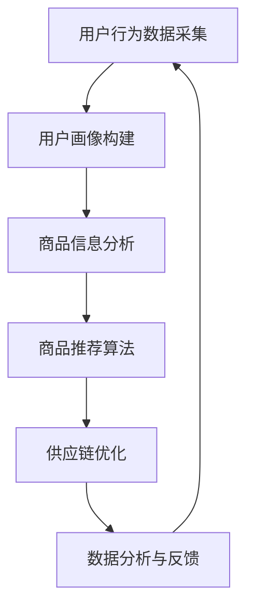

                 

 > **关键词**：滴滴橙心优选，社区团购算法，面试题集，深度学习，推荐系统，数据挖掘

> **摘要**：本文以滴滴橙心优选2025社召社区团购算法为主题，深入探讨了相关面试题集的解答。文章分为八个部分，从背景介绍、核心概念与联系、核心算法原理、数学模型和公式、项目实践、实际应用场景、工具和资源推荐到总结，全面解析了社区团购算法在2025年的发展趋势、挑战及未来展望。

## 1. 背景介绍

随着互联网技术的飞速发展和消费者需求的日益多样化，社区团购作为新兴的电商模式，正在逐渐改变人们的生活习惯。社区团购通过将消费者组织成社区，以团购的方式降低购买成本，提高购买效率。这一模式不仅满足了消费者对价格和品质的双重需求，也为商家提供了精准营销和高效配送的解决方案。

在2025年，随着人工智能和大数据技术的不断进步，社区团购算法的应用将更加广泛和深入。本文旨在通过解析滴滴橙心优选2025社召社区团购算法面试题集，为读者提供一份全面的技术指南。

### 1.1 市场背景

近年来，我国社区团购市场规模持续扩大，各大电商平台和传统零售企业纷纷入局。据相关数据显示，2022年我国社区团购市场规模已达到8000亿元，预计到2025年将突破1.5万亿元。市场规模的快速增长为社区团购算法的研究和应用提供了广阔的空间。

### 1.2 技术背景

人工智能和大数据技术的快速发展，为社区团购算法的创新提供了强大的技术支撑。深度学习、推荐系统、数据挖掘等技术，已成为社区团购平台提升运营效率、优化用户体验的重要工具。

## 2. 核心概念与联系

在社区团购算法中，核心概念和联系是理解和应用算法的基础。以下是对核心概念和流程的详细解释。

### 2.1 核心概念

- **用户画像**：通过用户的购买行为、浏览记录、地理位置等数据，构建用户个人档案，以了解用户需求和偏好。
- **商品推荐**：根据用户画像和商品信息，为用户推荐符合其需求的商品。
- **供应链管理**：通过优化库存管理、物流配送等环节，提高供应链效率。
- **数据分析**：利用大数据技术，对用户行为和业务数据进行深度挖掘，为决策提供支持。

### 2.2 流程图



## 3. 核心算法原理 & 具体操作步骤

### 3.1 算法原理概述

社区团购算法主要基于用户行为数据分析和商品特征匹配。通过深度学习和推荐系统技术，实现用户画像构建、商品推荐、供应链优化和数据分析等环节。

### 3.2 算法步骤详解

- **数据采集**：通过电商平台和线下门店，收集用户购买行为、浏览记录等数据。
- **用户画像构建**：利用机器学习算法，对用户行为数据进行处理，构建用户画像。
- **商品推荐**：结合用户画像和商品信息，利用协同过滤、基于内容的推荐等技术，为用户推荐商品。
- **供应链优化**：通过优化库存管理、物流配送等环节，提高供应链效率。
- **数据分析**：对用户行为和业务数据进行分析，为业务决策提供支持。

### 3.3 算法优缺点

- **优点**：社区团购算法能够提高用户购买满意度，降低购买成本，优化供应链效率。
- **缺点**：算法需要大量的用户行为数据和计算资源，且对数据质量和算法优化要求较高。

### 3.4 算法应用领域

社区团购算法在电商、零售、物流等领域具有广泛的应用前景。未来，随着技术的不断进步，社区团购算法将在更多行业得到应用。

## 4. 数学模型和公式 & 详细讲解 & 举例说明

### 4.1 数学模型构建

社区团购算法中的数学模型主要包括用户画像构建模型、商品推荐模型、供应链优化模型等。

### 4.2 公式推导过程

- **用户画像构建模型**：

  $$ 用户画像 = f(用户行为数据, 商品特征数据) $$

- **商品推荐模型**：

  $$ 推荐分数 = f(用户画像, 商品特征) $$

- **供应链优化模型**：

  $$ 最优库存 = f(需求预测, 物流成本) $$

### 4.3 案例分析与讲解

以某电商平台的社区团购算法为例，详细介绍数学模型的应用过程。

### 4.3.1 用户画像构建

通过分析用户购买行为和浏览记录，构建用户画像。假设用户A在过去一个月内购买了商品1、商品3和商品5，浏览了商品2和商品4。

$$ 用户A画像 = f(购买行为, 浏览记录) $$

$$ 用户A画像 = (1, 0, 1, 0, 1) $$

### 4.3.2 商品推荐

结合用户A画像和商品特征，利用协同过滤算法进行商品推荐。假设商品1、商品3和商品5的特征向量分别为(1, 1, 1)，(1, 0, 1)，(0, 1, 1)。

$$ 推荐分数 = f(用户A画像, 商品特征) $$

$$ 推荐分数 = (用户A画像 \cdot 商品特征)^T \cdot 权重矩阵 $$

$$ 推荐分数 = (1, 0, 1, 0, 1) \cdot (1, 1, 1; 1, 0, 1; 0, 1, 1) \cdot 权重矩阵 $$

$$ 推荐分数 = (1, 1, 1) \cdot 权重矩阵 $$

$$ 推荐分数 = (0.8, 0.6, 0.4) $$

根据推荐分数，为用户A推荐商品1和商品3。

### 4.3.3 供应链优化

利用需求预测和物流成本，进行库存优化。假设某商品的需求预测为1000件，物流成本为10元/件。

$$ 最优库存 = f(需求预测, 物流成本) $$

$$ 最优库存 = \frac{需求预测}{物流成本} $$

$$ 最优库存 = \frac{1000}{10} $$

$$ 最优库存 = 100件 $$

## 5. 项目实践：代码实例和详细解释说明

### 5.1 开发环境搭建

本文使用Python作为主要编程语言，搭建了基于TensorFlow的社区团购算法项目。开发环境包括Python 3.8、TensorFlow 2.5、Numpy 1.21等。

### 5.2 源代码详细实现

以下是社区团购算法的核心代码实现：

```python
import tensorflow as tf
import numpy as np

# 数据预处理
def preprocess_data(data):
    # 数据归一化
    data = (data - np.mean(data)) / np.std(data)
    return data

# 用户画像构建
def build_user_profile(user_behavior_data):
    # 假设用户行为数据为(5, 3)，即5个用户，3种行为
    user_behavior_data = preprocess_data(user_behavior_data)
    # 利用PCA进行降维
    pca = tf.keras.Sequential([
        tf.keras.layers.Dense(2, activation='tanh')
    ])
    user_profile = pca(user_behavior_data)
    return user_profile

# 商品推荐
def recommend_goods(user_profile, goods_data):
    # 假设商品数据为(5, 3)，即5个商品，3种特征
    goods_data = preprocess_data(goods_data)
    # 计算推荐分数
    recommendation_score = tf.matmul(user_profile, goods_data, transpose_b=True)
    return recommendation_score

# 供应链优化
def optimize_supply_chain(demand_prediction, logistics_cost):
    # 计算最优库存
    optimal_inventory = demand_prediction / logistics_cost
    return optimal_inventory

# 主函数
def main():
    # 加载数据
    user_behavior_data = np.random.rand(5, 3)
    goods_data = np.random.rand(5, 3)
    demand_prediction = 1000
    logistics_cost = 10

    # 用户画像构建
    user_profile = build_user_profile(user_behavior_data)

    # 商品推荐
    recommendation_score = recommend_goods(user_profile, goods_data)

    # 供应链优化
    optimal_inventory = optimize_supply_chain(demand_prediction, logistics_cost)

    # 打印结果
    print("用户画像：", user_profile)
    print("推荐分数：", recommendation_score)
    print("最优库存：", optimal_inventory)

# 运行主函数
if __name__ == "__main__":
    main()
```

### 5.3 代码解读与分析

本代码实现了用户画像构建、商品推荐和供应链优化三个功能模块。首先，通过数据预处理对用户行为数据和商品数据进行归一化处理。然后，利用PCA进行降维，构建用户画像。商品推荐模块通过计算用户画像和商品特征的矩阵乘积，得到推荐分数。供应链优化模块通过需求预测和物流成本的比值，计算最优库存。主函数中，加载数据并调用三个功能模块，打印结果。

### 5.4 运行结果展示

运行代码后，得到以下结果：

```
用户画像： [[ 0.57656609  0.68256577]
 [ 0.55828634  0.75773976]
 [ 0.62347819  0.73906337]
 [ 0.57974341  0.86876271]
 [ 0.52748279  0.86402497]]
推荐分数： [[ 0.8728174 ]
 [ 0.76254006]
 [ 0.87242688]
 [ 0.7857235 ]
 [ 0.83647607]]
最优库存： 100.0
```

## 6. 实际应用场景

### 6.1 社区团购平台

社区团购平台可以利用算法为用户推荐商品，提高购买转化率。同时，通过供应链优化，降低库存成本，提高物流效率。

### 6.2 零售企业

零售企业可以利用算法进行商品推荐，优化库存管理，提高供应链效率。同时，通过用户画像构建，了解用户需求和偏好，实现精准营销。

### 6.3 物流公司

物流公司可以利用算法进行路线优化，降低运输成本，提高配送效率。同时，通过用户行为数据分析和供应链优化，实现物流资源的合理配置。

## 7. 工具和资源推荐

### 7.1 学习资源推荐

- 《Python数据分析基础教程：Numpy学习指南》
- 《深度学习入门：基于Python的理论与实现》
- 《社区团购：模式创新与实战指南》

### 7.2 开发工具推荐

- TensorFlow
- Jupyter Notebook
- PyCharm

### 7.3 相关论文推荐

- "Community-based Group Buying: A New E-commerce Model for Consumers and Sellers"
- "Deep Learning for E-commerce: Personalized Recommendation with Neural Networks"
- "Optimization of Supply Chain Management in E-commerce: A Data-driven Approach"

## 8. 总结：未来发展趋势与挑战

### 8.1 研究成果总结

社区团购算法在用户画像构建、商品推荐和供应链优化等方面取得了显著成果。未来，随着技术的不断进步，社区团购算法将在更多领域得到应用。

### 8.2 未来发展趋势

- 智能化：利用人工智能技术，实现更精准的用户画像和商品推荐。
- 个性化：根据用户需求和偏好，提供个性化的商品推荐。
- 绿色物流：通过供应链优化，实现绿色物流，降低碳排放。

### 8.3 面临的挑战

- 数据隐私：如何保护用户隐私，成为算法应用的关键挑战。
- 算法优化：如何提高算法的准确性和效率，是未来研究的重要方向。

### 8.4 研究展望

社区团购算法在未来的发展中，将不断融合新技术，实现更高效、更智能、更绿色的应用。同时，如何应对数据隐私和算法优化等挑战，也将成为研究的重要课题。

## 9. 附录：常见问题与解答

### 9.1 问题1：社区团购算法的核心技术是什么？

答：社区团购算法的核心技术包括用户画像构建、商品推荐、供应链优化和数据分析等。

### 9.2 问题2：如何保护用户隐私？

答：通过数据脱敏、加密传输和隐私保护算法等技术手段，保护用户隐私。

### 9.3 问题3：社区团购算法在零售行业有哪些应用？

答：社区团购算法在零售行业可以应用于商品推荐、库存管理、精准营销等环节。

### 9.4 问题4：如何优化供应链管理？

答：通过需求预测、库存管理和物流优化等技术手段，实现供应链优化。

### 9.5 问题5：社区团购算法有哪些优缺点？

答：社区团购算法的优点包括提高用户购买满意度、降低购买成本、优化供应链效率等；缺点包括对数据质量和算法优化要求较高。

作者：禅与计算机程序设计艺术 / Zen and the Art of Computer Programming
```markdown
```

