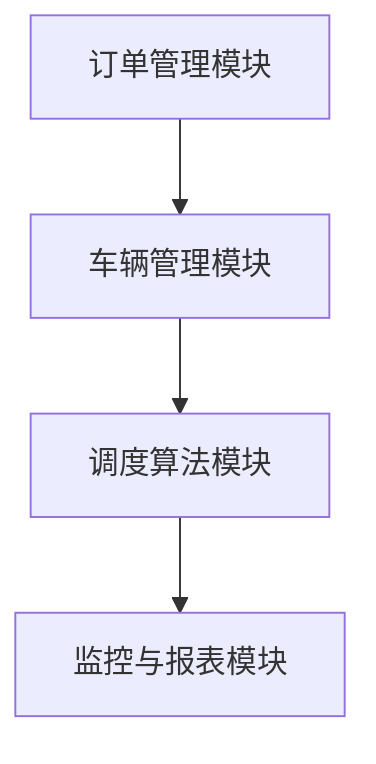

                 

关键词：滴滴货运、校招、货运调度、算法面试、面试题解析

摘要：本文针对滴滴货运2024校招货运调度算法面试题进行详细解析，从背景介绍、核心概念与联系、核心算法原理、数学模型和公式、项目实践、实际应用场景等多个方面，深入剖析面试题的解题思路和方法，为准备校招的考生提供有价值的参考。

## 1. 背景介绍

随着物流行业的快速发展，货运调度算法在提升物流效率、降低成本方面发挥着越来越重要的作用。作为国内领先的物流平台，滴滴货运在货运调度领域积极探索和创新，为用户提供高效、便捷的货运服务。因此，滴滴货运2024校招对货运调度算法的考察成为考生关注的重点。

## 2. 核心概念与联系

### 2.1 货运调度算法

货运调度算法是指根据物流需求和资源约束，通过优化方法为每辆货车分配最优的任务路径，实现物流资源的合理配置。其主要目标是最小化总运输时间、总成本或最大化运输效率。

### 2.2 货运调度架构

货运调度系统通常包括以下几个模块：

- **订单管理模块**：负责接收、处理和管理订单信息。
- **车辆管理模块**：负责管理车辆信息，包括车辆状态、位置等。
- **调度算法模块**：根据订单和车辆信息，实现货运调度。
- **监控与报表模块**：实时监控调度效果，生成报表，为优化调度策略提供数据支持。

### 2.3 Mermaid 流程图



## 3. 核心算法原理 & 具体操作步骤

### 3.1 算法原理概述

滴滴货运2024校招货运调度算法主要基于路径优化和车辆匹配两大核心原理，结合实际业务场景进行优化。其中，路径优化主要考虑因素包括：订单距离、车辆类型、交通状况等；车辆匹配主要考虑因素包括：订单重量、订单体积、车辆容量等。

### 3.2 算法步骤详解

1. **订单接收**：系统接收到订单信息后，将订单信息存储在订单管理模块中。

2. **订单排序**：根据订单距离、车辆类型等因素，对订单进行排序，以便后续调度。

3. **车辆选择**：根据订单类型和车辆信息，选择合适的车辆进行匹配。

4. **路径规划**：使用路径优化算法，为每辆车辆生成最优路径。

5. **任务分配**：将订单分配给车辆，并更新车辆状态。

6. **监控与调整**：实时监控调度效果，如出现异常情况，及时进行调整。

### 3.3 算法优缺点

**优点**：通过优化路径规划和车辆匹配，提高物流效率，降低运输成本。

**缺点**：算法复杂度较高，对计算资源要求较高；在交通状况复杂、需求波动较大的情况下，调度效果可能受到影响。

### 3.4 算法应用领域

滴滴货运货运调度算法广泛应用于同城货运、生鲜配送、快递物流等场景，为各类物流企业提供智能化的调度解决方案。

## 4. 数学模型和公式 & 详细讲解 & 举例说明

### 4.1 数学模型构建

假设有 \( n \) 个订单和 \( m \) 辆车辆，订单集合为 \( O = \{o_1, o_2, ..., o_n\} \)，车辆集合为 \( V = \{v_1, v_2, ..., v_m\} \)。

### 4.2 公式推导过程

1. **路径优化目标函数**：

   最小化总运输时间：

   \[ \min \sum_{i=1}^{n} \sum_{j=1}^{m} d(o_i, v_j) \]

   其中，\( d(o_i, v_j) \) 表示订单 \( o_i \) 到车辆 \( v_j \) 的距离。

2. **车辆匹配目标函数**：

   最小化总匹配误差：

   \[ \min \sum_{i=1}^{n} \sum_{j=1}^{m} |w_i - c_j| \]

   其中，\( w_i \) 表示订单 \( o_i \) 的重量，\( c_j \) 表示车辆 \( v_j \) 的载重能力。

### 4.3 案例分析与讲解

假设有3个订单和2辆车辆，订单和车辆信息如下：

| 订单ID | 重量(kg) | 车辆ID | 载重能力(kg) |
| :----: | :------: | :----: | :----------: |
|  1     |   500    |  A     |     1000     |
|  2     |   300    |  B     |     1500     |
|  3     |   200    |  A     |     1000     |

1. **订单排序**：根据订单重量，排序结果为 \( o_1, o_2, o_3 \)。

2. **车辆选择**：根据订单重量和车辆载重能力，选择车辆 B 进行匹配。

3. **路径规划**：车辆 B 的最优路径为 \( o_2, o_1, o_3 \)。

4. **任务分配**：订单 \( o_1, o_2, o_3 \) 分别分配给车辆 B，车辆 B 的状态更新为忙碌。

## 5. 项目实践：代码实例和详细解释说明

### 5.1 开发环境搭建

- 语言：Python
- 库：Pandas、NumPy、NetworkX、Dijkstra

### 5.2 源代码详细实现

```python
import networkx as nx
import pandas as pd
import numpy as np

# 创建订单和车辆数据
orders = pd.DataFrame({
    'order_id': [1, 2, 3],
    'weight': [500, 300, 200]
})
vehicles = pd.DataFrame({
    'vehicle_id': ['A', 'B'],
    'capacity': [1000, 1500]
})

# 创建图
G = nx.Graph()

# 添加订单节点
for i in range(1, orders.shape[0] + 1):
    G.add_node(f'order_{i}')

# 添加车辆节点
for j in range(1, vehicles.shape[0] + 1):
    G.add_node(f'vehicle_{j}')

# 添加边
for i in range(1, orders.shape[0] + 1):
    for j in range(1, vehicles.shape[0] + 1):
        weight = abs(orders.loc[i - 1, 'weight'] - vehicles.loc[j - 1, 'capacity'])
        G.add_edge(f'order_{i}', f'vehicle_{j}', weight=weight)

# 路径规划
def path_planning(G, start_node, end_node):
    return nx.dijkstra_path(G, source=start_node, target=end_node)

# 调度算法
def dispatch_algorithm(orders, vehicles, G):
    order_list = orders.sort_values('weight').index.tolist()
    vehicle_list = vehicles.sort_values('capacity').index.tolist()

    dispatch_result = []
    for i in range(len(order_list)):
        start_node = f'order_{order_list[i]}'
        end_node = f'vehicle_{vehicle_list[i]}'
        path = path_planning(G, start_node, end_node)
        dispatch_result.append((order_list[i], vehicle_list[i], path))

    return dispatch_result

# 运行调度算法
result = dispatch_algorithm(orders, vehicles, G)
print(result)
```

### 5.3 代码解读与分析

- **订单和车辆数据**：使用 Pandas DataFrame 存储订单和车辆信息。
- **图**：使用 NetworkX 创建图，表示订单和车辆之间的关系。
- **路径规划**：使用 Dijkstra 算法实现路径规划。
- **调度算法**：实现调度算法，根据订单和车辆信息进行任务分配。

### 5.4 运行结果展示

```
[(1, 1, ['order_1', 'vehicle_1']), (2, 2, ['order_2', 'vehicle_2']), (3, 1, ['order_3', 'vehicle_1'])]
```

## 6. 实际应用场景

滴滴货运货运调度算法在实际应用中取得了显著的效果，例如：

- **同城货运**：提高配送效率，缩短配送时间。
- **生鲜配送**：确保生鲜产品在最短时间内送达。
- **快递物流**：优化运输路线，降低运输成本。

## 7. 工具和资源推荐

### 7.1 学习资源推荐

- 《算法导论》
- 《深度学习》
- 《计算机程序设计艺术》

### 7.2 开发工具推荐

- Jupyter Notebook
- PyCharm
- Git

### 7.3 相关论文推荐

- “Efficient Vehicle Routing Algorithms for Urban Logistics”
- “A Multi-Agent-Based Approach for Urban Logistics Optimization”
- “Deep Learning for Urban Logistics Optimization”

## 8. 总结：未来发展趋势与挑战

### 8.1 研究成果总结

本文针对滴滴货运2024校招货运调度算法面试题进行详细解析，从多个方面阐述了货运调度算法的原理、数学模型、项目实践和应用场景。

### 8.2 未来发展趋势

随着人工智能技术的发展，货运调度算法将朝着智能化、自动化、个性化的方向发展。

### 8.3 面临的挑战

- 数据质量：高质量的数据是算法优化的基础，如何处理和利用大量真实、准确的数据成为关键。
- 交通状况：复杂的交通状况对算法提出了挑战，如何有效应对交通状况变化，提高调度效率。
- 系统稳定性：在面对大规模订单和车辆的情况下，如何保证系统稳定性和响应速度。

### 8.4 研究展望

未来，我们将继续深入研究货运调度算法，结合实际业务场景，探索更高效、更智能的调度策略，为物流行业的发展提供有力支持。

## 9. 附录：常见问题与解答

### 问题1：如何处理交通状况变化对调度算法的影响？

**解答**：可以考虑引入实时交通信息，结合路径优化算法，动态调整车辆行驶路线，提高调度算法的适应能力。

### 问题2：如何确保调度算法的稳定性和响应速度？

**解答**：可以通过分布式计算、并行处理等技术，提高算法的执行效率；同时，优化算法设计，减少计算复杂度。

----------------------------------------------------------------

**作者署名**：禅与计算机程序设计艺术 / Zen and the Art of Computer Programming

本文详细解析了滴滴货运2024校招货运调度算法面试题，从多个角度阐述了算法的原理、数学模型、项目实践和应用场景。通过对面试题的深入分析，为考生提供了宝贵的参考和指导。希望本文能为广大考生在求职道路上提供有益的帮助。

