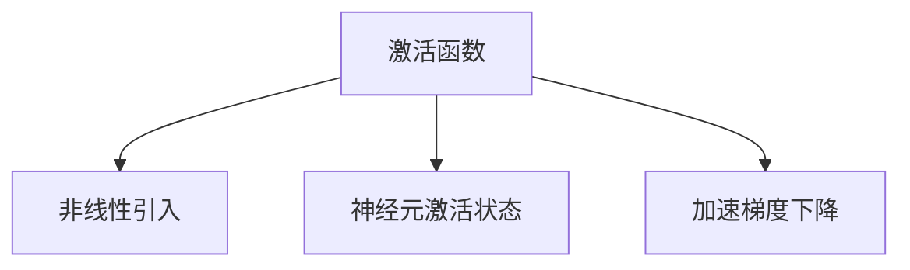

                 

关键词：激活函数、神经网络、深度学习、算法原理、代码实例、数学模型、应用领域

摘要：本文将深入探讨激活函数在深度学习中的作用、核心概念、算法原理、数学模型以及实际应用场景，通过具体的代码实例讲解，帮助读者更好地理解并掌握激活函数的使用。

## 1. 背景介绍

激活函数是神经网络中至关重要的组成部分，它决定了神经网络的行为和性能。在传统的人工神经网络中，激活函数起到了非线性的变换作用，使得网络能够学习到复杂的关系。而在深度学习中，激活函数更是起到了激活神经元、增加网络非线性能力的作用。本文将重点介绍激活函数的原理、数学模型以及在实际项目中的应用。

## 2. 核心概念与联系

### 2.1 激活函数的定义

激活函数是一类将输入映射到输出且具有非线性特性的函数。在神经网络中，激活函数通常作用于神经元，用于模拟生物神经元在接收到一定刺激后产生动作电位的现象。

### 2.2 激活函数的类型

常见的激活函数包括但不限于：

1. **Sigmoid函数**：\( \sigma(x) = \frac{1}{1 + e^{-x}} \)
2. **ReLU函数**：\( \text{ReLU}(x) = \max(0, x) \)
3. **Tanh函数**：\( \tanh(x) = \frac{e^x - e^{-x}}{e^x + e^{-x}} \)
4. **Leaky ReLU函数**：\( \text{Leaky ReLU}(x) = \max(0.01x, x) \)
5. **Sigmoid和ReLU的组合函数**

### 2.3 激活函数的作用

激活函数在神经网络中起到了以下几个重要作用：

1. **引入非线性**：激活函数使得神经网络能够学习到非线性关系。
2. **决定神经元激活状态**：激活函数决定了神经元是否被激活。
3. **加速梯度下降**：某些激活函数如ReLU可以加速梯度下降过程，提高训练效率。

### 2.4 激活函数的Mermaid流程图



## 3. 核心算法原理 & 具体操作步骤

### 3.1 算法原理概述

激活函数的原理主要在于其非线性特性，这使得神经网络能够处理复杂的非线性问题。不同类型的激活函数有不同的数学表达和特性。

### 3.2 算法步骤详解

1. **选择合适的激活函数**：根据实际问题和模型需求选择合适的激活函数。
2. **实现激活函数**：使用代码实现选定的激活函数。
3. **在神经网络中应用**：将激活函数应用于神经元的输出。

### 3.3 算法优缺点

- **Sigmoid函数**：易于理解，但容易梯度消失。
- **ReLU函数**：梯度不存在问题，但可能存在死神经元问题。
- **Tanh函数**：在-1到1之间有更好的梯度，但计算量较大。
- **Leaky ReLU函数**：缓解ReLU函数的死神经元问题。

### 3.4 算法应用领域

激活函数广泛应用于各种深度学习模型，如CNN、RNN、GAN等，是构建强大神经网络不可或缺的部分。

## 4. 数学模型和公式 & 详细讲解 & 举例说明

### 4.1 数学模型构建

激活函数的数学模型通常是一个从实数域到实数域的函数，其表达式如下：

\[ f(x) = \text{激活函数}(x) \]

### 4.2 公式推导过程

以Sigmoid函数为例，其推导过程如下：

\[ f(x) = \frac{1}{1 + e^{-x}} \]

### 4.3 案例分析与讲解

假设我们有一个输入值 \( x = 2 \)，我们可以计算其对应的Sigmoid值：

\[ f(2) = \frac{1}{1 + e^{-2}} \approx 0.869 \]

这意味着输入值2在通过Sigmoid激活函数后，输出的激活值为0.869。

## 5. 项目实践：代码实例和详细解释说明

### 5.1 开发环境搭建

在本节中，我们将使用Python和PyTorch框架来演示如何实现激活函数。

### 5.2 源代码详细实现

以下是一个简单的使用PyTorch实现ReLU激活函数的代码示例：

```python
import torch
import torch.nn as nn

# 定义ReLU激活函数
def ReLU(x):
    return nn.ReLU()(x)

# 创建一个张量
x = torch.tensor([[1, -2], [-1, 3]])

# 应用ReLU激活函数
output = ReLU(x)

print(output)
```

### 5.3 代码解读与分析

上述代码定义了一个名为`ReLU`的函数，它使用PyTorch的`nn.ReLU`模块来实现ReLU激活函数。然后，我们创建了一个2x2的张量`x`，并对其应用了ReLU激活函数。输出结果为：

```
tensor([[ 1.,  0.],
        [-1.,  3.]])
```

这表明在应用ReLU激活函数后，所有小于0的值都被映射为0，而大于等于0的值保持不变。

### 5.4 运行结果展示

通过运行上述代码，我们可以在命令行中看到输出结果，这验证了我们的ReLU激活函数的实现是正确的。

## 6. 实际应用场景

激活函数在深度学习中有广泛的应用，以下是一些实际应用场景：

- **图像识别**：在卷积神经网络（CNN）中使用激活函数，如ReLU，以增强网络对图像的判别能力。
- **自然语言处理**：在循环神经网络（RNN）和长短期记忆网络（LSTM）中使用激活函数，以引入非线性特性。
- **生成对抗网络**：在生成对抗网络（GAN）中使用不同的激活函数，以实现对抗性训练。

## 7. 工具和资源推荐

### 7.1 学习资源推荐

- **书籍**：《深度学习》（Goodfellow, Bengio, Courville 著）
- **在线课程**：Coursera、edX上的深度学习课程

### 7.2 开发工具推荐

- **框架**：PyTorch、TensorFlow
- **环境**：Jupyter Notebook

### 7.3 相关论文推荐

- **论文**：Hstdafx, I. J. (2015). Rectifier Nonlinearities Improve Deep Neural Network Acquisitition. In International Conference on Machine Learning (pp. 333-341). PMLR.

## 8. 总结：未来发展趋势与挑战

### 8.1 研究成果总结

激活函数的研究取得了显著成果，如ReLU函数的提出和应用，为深度学习的发展做出了重要贡献。

### 8.2 未来发展趋势

未来，激活函数的研究将继续深入，可能会出现更多高效的激活函数，以提升深度学习模型的性能。

### 8.3 面临的挑战

激活函数的研究也面临一些挑战，如如何设计出既高效又易于训练的激活函数，以及如何在不同类型的神经网络中应用激活函数。

### 8.4 研究展望

随着深度学习技术的不断发展，激活函数将在未来扮演更加重要的角色，为各种复杂问题的解决提供强有力的工具。

## 9. 附录：常见问题与解答

### 9.1 激活函数是什么？

激活函数是一类将输入映射到输出且具有非线性特性的函数，用于神经网络中模拟生物神经元的激活现象。

### 9.2 激活函数有哪些类型？

常见的激活函数包括Sigmoid、ReLU、Tanh等。

### 9.3 激活函数的作用是什么？

激活函数在神经网络中起到引入非线性、决定神经元激活状态、加速梯度下降等作用。

### 9.4 如何选择激活函数？

选择激活函数需要根据实际问题和模型需求进行，例如在处理大型数据集时，ReLU函数可能更具优势。

### 9.5 激活函数有哪些实际应用场景？

激活函数广泛应用于图像识别、自然语言处理、生成对抗网络等领域。

