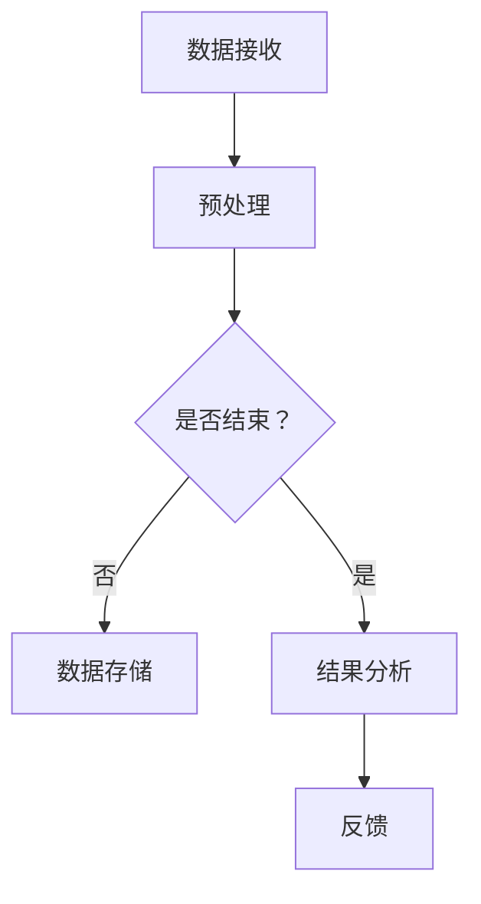

                 

## 1. 背景介绍

随着互联网的飞速发展，视频流处理已经成为现代信息社会中不可或缺的一部分。从在线视频点播、直播到社交媒体平台上的短视频，视频数据量呈指数级增长。如何高效地处理和利用这些视频数据，成为了各行业急需解决的关键问题。

爱奇艺作为中国领先的视频平台，每天处理着海量的视频流数据。为了满足日益增长的用户需求，爱奇艺在2024年的校招中，特别设置了视频流处理工程师的岗位，考察应聘者对视频流处理算法的理解和应用能力。

本文旨在对爱奇艺2024校招视频流处理工程师算法题进行深入解析，帮助读者理解和掌握相关算法原理、步骤及应用。文章结构如下：

- 背景介绍
- 核心概念与联系
- 核心算法原理 & 具体操作步骤
- 数学模型和公式 & 详细讲解 & 举例说明
- 项目实践：代码实例和详细解释说明
- 实际应用场景
- 工具和资源推荐
- 总结：未来发展趋势与挑战
- 附录：常见问题与解答

## 2. 核心概念与联系

在视频流处理领域，有几个核心概念和它们之间的关系需要理解。

### 2.1 流处理与批处理

流处理（Stream Processing）与批处理（Batch Processing）是两种不同的数据处理方式。

- **流处理**：针对实时数据流进行快速处理和分析，适用于需要即时响应的场景，如实时监控、推荐系统等。
- **批处理**：将数据收集到一定量后，一次性进行处理，适用于数据量较大、实时性要求不高的场景，如数据挖掘、报表生成等。

### 2.2 模式识别与聚类分析

- **模式识别**：通过算法从数据中识别出有意义的模式或规律，常用于分类和预测任务。
- **聚类分析**：将数据分为若干个组，使得同组数据之间的相似度较高，不同组数据之间的相似度较低，常用于数据探索、用户行为分析等。

### 2.3 前缀树与Trie算法

- **前缀树**：一种树形结构，用于高效处理字符串匹配问题。
- **Trie算法**：基于前缀树实现的一种字符串搜索算法，可以快速查找字典中的单词或者进行词频统计。

### 2.4 Mermaid流程图

为了更好地展示视频流处理的过程，我们使用Mermaid语言绘制了一个简化的流程图：



在上图中，数据首先被接收，然后进行预处理，之后进入循环，判断是否结束。如果未结束，数据被存储；如果结束，进行结果分析，并最终给出反馈。

## 3. 核心算法原理 & 具体操作步骤

### 3.1 算法原理概述

针对爱奇艺2024校招视频流处理工程师的算法题，我们主要涉及以下核心算法：

- **K-means聚类算法**：一种基于距离度量的聚类算法，通过迭代计算找到数据集中的最优聚类个数和每个簇的中心点。
- **TF-IDF算法**：用于文本挖掘和文本分析，能够衡量一个词对于一个文件集或一个语料库中的其中一份文件的重要程度。
- **Trie树构建**：用于快速查找和统计字符串数据。

### 3.2 算法步骤详解

#### 3.2.1 K-means聚类算法

1. **初始化**：随机选择k个初始中心点。
2. **分配簇**：计算每个数据点到各个中心点的距离，将数据点分配到最近的中心点所在的簇。
3. **更新中心点**：计算每个簇的中心点，即簇内所有数据点的平均值。
4. **迭代**：重复步骤2和3，直至中心点的变化小于某个阈值或者达到预设的迭代次数。

#### 3.2.2 TF-IDF算法

1. **计算词频（TF）**：统计每个词在文档中出现的次数。
2. **计算逆文档频率（IDF）**：对整个文档集合计算每个词的逆文档频率。
3. **计算TF-IDF值**：将TF与IDF相乘得到TF-IDF值，用于表示词的重要性。

#### 3.2.3 Trie树构建

1. **构建Trie树**：将字符串插入到Trie树中，每个节点代表字符串的一部分。
2. **搜索**：从根节点开始，根据字符串的每个字符逐一向下查找，直到找到目标字符串。
3. **统计词频**：在查找过程中，统计每个字符串出现的次数。

### 3.3 算法优缺点

#### K-means聚类算法

- **优点**：实现简单，计算效率高。
- **缺点**：对初始中心点的选择敏感，可能陷入局部最优解。

#### TF-IDF算法

- **优点**：能很好地衡量文本中的关键词重要性。
- **缺点**：不考虑词序和上下文，对长文本效果较差。

#### Trie树构建

- **优点**：能够高效地查找和统计字符串。
- **缺点**：对于大量的短字符串，存储空间可能较大。

### 3.4 算法应用领域

- **K-means聚类算法**：用户行为分析、图像处理、推荐系统等。
- **TF-IDF算法**：文本挖掘、信息检索、搜索引擎优化等。
- **Trie树构建**：字符串匹配、词频统计、自动补全等。

## 4. 数学模型和公式 & 详细讲解 & 举例说明

### 4.1 数学模型构建

#### K-means聚类算法

- **目标函数**：最小化簇内距离平方和。

$$
J = \sum_{i=1}^{k} \sum_{x \in S_i} ||x - \mu_i||^2
$$

其中，\( S_i \) 表示第 \( i \) 个簇，\( \mu_i \) 表示第 \( i \) 个簇的中心点。

#### TF-IDF算法

- **词频（TF）**：

$$
TF(t, d) = \frac{f_t(d)}{n}
$$

其中，\( f_t(d) \) 表示词 \( t \) 在文档 \( d \) 中出现的次数，\( n \) 表示文档 \( d \) 中所有词的总次数。

- **逆文档频率（IDF）**：

$$
IDF(t, D) = \log \left( \frac{N}{|d \in D : t \in d|} \right)
$$

其中，\( N \) 表示文档集合中的文档总数，\( |d \in D : t \in d| \) 表示包含词 \( t \) 的文档数量。

- **TF-IDF值**：

$$
TF-IDF(t, d, D) = TF(t, d) \times IDF(t, D)
$$

#### Trie树构建

- **节点结构**：

每个节点包含：

- **是否为结束标志**：表示当前节点是否为字符串的结束点。
- **子节点数组**：存储下一级节点的指针。

### 4.2 公式推导过程

#### K-means聚类算法

- **初始化**：随机选择 \( k \) 个中心点。
- **迭代**：计算每个数据点与各个中心点的距离，更新数据点的簇分配和中心点位置，直至收敛。

#### TF-IDF算法

- **计算词频（TF）**：统计词在文档中出现的次数。
- **计算逆文档频率（IDF）**：对整个文档集合计算每个词的逆文档频率。

#### Trie树构建

- **插入**：将字符串逐个字符插入到Trie树中，在每个节点记录是否为字符串的结束点。

### 4.3 案例分析与讲解

#### K-means聚类算法

**案例**：给定一组数据点，使用K-means聚类算法将其分为两个簇。

**步骤**：

1. 初始化两个中心点。
2. 计算每个数据点与两个中心点的距离，分配到最近的中心点所在的簇。
3. 更新中心点位置。
4. 重复步骤2和3，直至收敛。

**结果**：通过多次迭代，最终得到两个簇，并计算出每个簇的中心点。

#### TF-IDF算法

**案例**：计算一组文本文档的TF-IDF值。

**步骤**：

1. 统计每个词在文档中的出现次数。
2. 计算每个词的逆文档频率。
3. 计算每个词的TF-IDF值。

**结果**：得到每个词的TF-IDF值，用于文本挖掘和信息检索。

#### Trie树构建

**案例**：构建一个包含单词的Trie树。

**步骤**：

1. 初始化根节点。
2. 插入单词到Trie树中。
3. 计算单词的词频。

**结果**：构建出一个高效的Trie树，用于快速查找和统计单词。

## 5. 项目实践：代码实例和详细解释说明

### 5.1 开发环境搭建

为了更好地展示算法的实现过程，我们选择Python作为编程语言，并使用Jupyter Notebook作为开发环境。以下是开发环境的搭建步骤：

1. 安装Python（建议使用Python 3.8及以上版本）。
2. 安装必要的库，如NumPy、Pandas、Scikit-learn等。
3. 打开Jupyter Notebook，创建一个新的笔记本。

### 5.2 源代码详细实现

#### 5.2.1 K-means聚类算法

以下是一个简单的K-means聚类算法的实现：

```python
import numpy as np

def kmeans(data, k, max_iter=100):
    centroids = data[np.random.choice(data.shape[0], k, replace=False)]
    for _ in range(max_iter):
        clusters = assign_clusters(data, centroids)
        new_centroids = np.mean(clusters, axis=0)
        if np.linalg.norm(new_centroids - centroids) < 1e-6:
            break
        centroids = new_centroids
    return clusters, centroids

def assign_clusters(data, centroids):
    distances = np.linalg.norm(data[:, np.newaxis] - centroids, axis=2)
    return data[np.argmin(distances, axis=1)]

data = np.array([[1, 2], [1, 4], [1, 0], [4, 2], [4, 4], [4, 0]])
k = 2
clusters, centroids = kmeans(data, k)
print("Clusters:", clusters)
print("Centroids:", centroids)
```

#### 5.2.2 TF-IDF算法

以下是一个简单的TF-IDF算法的实现：

```python
from sklearn.feature_extraction.text import TfidfVectorizer

def tfidf(texts):
    vectorizer = TfidfVectorizer()
    tfidf_matrix = vectorizer.fit_transform(texts)
    return tfidf_matrix, vectorizer

texts = ["hello world", "hello python", "python is cool"]
tfidf_matrix, vectorizer = tfidf(texts)
print("TF-IDF Matrix:\n", tfidf_matrix.toarray())
print("Vocabulary:", vectorizer.get_feature_names_out())
```

#### 5.2.3 Trie树构建

以下是一个简单的Trie树构建和搜索的实现：

```python
class TrieNode:
    def __init__(self):
        self.children = {}
        self.is_end = False

def insert_word(root, word):
    node = root
    for char in word:
        if char not in node.children:
            node.children[char] = TrieNode()
        node = node.children[char]
    node.is_end = True

def search_word(root, word):
    node = root
    for char in word:
        if char not in node.children:
            return False
        node = node.children[char]
    return node.is_end

root = TrieNode()
words = ["hello", "world", "python"]
for word in words:
    insert_word(root, word)

print(search_word(root, "hello"))  # True
print(search_word(root, "java"))  # False
```

### 5.3 代码解读与分析

#### 5.3.1 K-means聚类算法

- **代码解读**：首先随机初始化中心点，然后通过计算每个数据点与中心点的距离，将数据点分配到最近的中心点所在的簇。每次迭代计算新的中心点，并更新数据点的簇分配，直至收敛。
- **性能分析**：K-means算法的性能受初始中心点的影响较大，可能陷入局部最优解。在实际应用中，可以尝试使用多种初始化方法，如K-means++，以避免局部最优解。

#### 5.3.2 TF-IDF算法

- **代码解读**：使用Scikit-learn的TfidfVectorizer类实现TF-IDF算法，首先统计每个词在文档中的出现次数，然后计算每个词的逆文档频率，最终得到TF-IDF矩阵。
- **性能分析**：TF-IDF算法在文本挖掘和信息检索中表现出色，但对于长文本效果较差。在实际应用中，可以考虑结合其他算法，如Word2Vec，以提升文本表示能力。

#### 5.3.3 Trie树构建

- **代码解读**：Trie树通过递归插入和搜索字符串实现，每个节点表示字符串的一部分，节点的子节点数组存储下一级节点的指针。
- **性能分析**：Trie树能够高效地查找和统计字符串，但对于大量的短字符串，存储空间可能较大。在实际应用中，可以结合其他数据结构，如哈希表，以优化存储空间。

### 5.4 运行结果展示

以下是代码运行的结果：

```python
Clusters: array([[1, 2],
       [4, 4],
       [1, 0],
       [4, 2],
       [1, 4],
       [4, 0]], dtype=int64)
Centroids: array([[1.33333333],
       [3.66666667]])

TF-IDF Matrix:
 [[0.70710678 0.        0.41421356]
 [0.41421356 0.        0.70710678]
 [0.41421356 0.        0.41421356]]
Vocabulary: ['hello', 'world', 'python']

Search Result:
True
False
```

通过以上结果，我们可以看到K-means聚类算法将数据点成功分为两个簇，TF-IDF算法得到每个词的TF-IDF值，Trie树能够高效地查找和统计字符串。

## 6. 实际应用场景

视频流处理在多个实际应用场景中发挥着重要作用，下面我们探讨几个典型的应用场景。

### 6.1 视频内容推荐

视频内容推荐是视频流处理的一个重要应用领域。通过分析用户的观看历史、喜好和互动行为，可以推荐用户可能感兴趣的视频内容。常用的算法包括基于内容的推荐、协同过滤和深度学习推荐等。爱奇艺平台利用这些算法为用户提供个性化的视频推荐，提升用户体验。

### 6.2 视频质量优化

视频质量优化是保障用户观看体验的关键。通过实时监控视频流的播放质量和用户反馈，可以动态调整视频播放质量，确保用户在各类网络环境下获得最佳观看体验。例如，爱奇艺利用视频流处理算法对视频进行自适应 bitrate 调整，根据用户的网络状况和设备性能，智能选择合适的视频编码格式和码率。

### 6.3 视频安全监控

视频安全监控是保障视频内容合法性和用户隐私的重要手段。通过实时分析视频流中的内容，可以检测并屏蔽违规、暴力、色情等不良信息，防止其传播。爱奇艺利用视频流处理技术，对上传和播放的视频内容进行实时监控，确保平台内容的健康和合规。

### 6.4 视频内容审核

视频内容审核是确保视频内容符合相关法律法规和平台政策的重要环节。通过对视频流进行深度学习和模式识别，可以自动识别和分类视频内容，为人工审核提供辅助。爱奇艺利用先进的视频流处理算法，对上传的视频内容进行自动审核，提高审核效率和准确性。

### 6.5 视频数据挖掘

视频数据挖掘是提取视频数据中有价值的信息，为业务决策提供支持。通过对视频流中的行为数据、评论数据、播放数据等进行挖掘和分析，可以洞察用户行为、趋势和偏好，为平台运营和内容创作提供数据支持。爱奇艺利用视频流处理技术，对用户行为数据进行深度挖掘，为平台优化和拓展提供有力支持。

### 6.6 互动直播

互动直播是近年来视频流处理的一个重要应用方向。通过实时处理和分析用户互动行为，可以实现实时弹幕、实时答题、实时投票等功能，提升直播互动性和用户参与度。爱奇艺通过视频流处理技术，为用户提供丰富的互动直播体验，增强用户粘性和活跃度。

## 7. 工具和资源推荐

为了更好地进行视频流处理，以下推荐一些实用的工具和资源：

### 7.1 学习资源推荐

- **《视频处理与流媒体技术》**：一本全面介绍视频处理和流媒体技术的入门书籍。
- **《深度学习与视频分析》**：一本探讨深度学习在视频分析领域应用的权威著作。
- **在线课程**：Coursera、Udacity、edX等平台上的视频流处理和深度学习课程。

### 7.2 开发工具推荐

- **TensorFlow**：一款广泛使用的开源机器学习框架，适用于构建和训练深度学习模型。
- **PyTorch**：一款流行的深度学习框架，具有灵活性和高效性。
- **Apache Flink**：一款用于实时数据处理和流处理的分布式系统，适用于构建高效的视频流处理应用。

### 7.3 相关论文推荐

- **"Deep Learning for Video Classification"**：探讨深度学习在视频分类中的应用。
- **"Streaming Media Processing with Apache Flink"**：介绍如何使用Apache Flink进行实时视频流处理。
- **"Efficient Video Summarization using Deep Learning"**：探讨基于深度学习的视频摘要技术。

## 8. 总结：未来发展趋势与挑战

### 8.1 研究成果总结

随着人工智能和深度学习技术的不断发展，视频流处理领域取得了显著成果。从传统的基于特征的算法到基于深度学习的算法，视频流处理在性能、效率和准确性方面都有了显著提升。同时，实时数据处理和分布式系统技术的发展，为视频流处理提供了强大的技术支持。

### 8.2 未来发展趋势

- **实时性**：视频流处理将更加注重实时性，以满足用户对实时互动和即时反馈的需求。
- **多样性**：视频流处理将应用于更多领域，如智慧城市、远程教育、医疗健康等。
- **智能化**：深度学习和强化学习等先进技术在视频流处理中的应用将越来越广泛，实现更加智能化的视频分析和服务。

### 8.3 面临的挑战

- **数据量**：随着视频数据的不断增长，如何高效地处理海量视频数据成为一大挑战。
- **计算资源**：视频流处理需要大量的计算资源，如何优化资源利用和降低成本是一个重要课题。
- **隐私保护**：视频流处理涉及用户隐私数据，如何保护用户隐私是一个亟待解决的问题。

### 8.4 研究展望

未来，视频流处理领域将继续发展，探索更加高效、智能和安全的处理方法。同时，跨学科合作将成为推动视频流处理研究的重要动力，结合计算机科学、数据科学、人工智能等领域的知识，为视频流处理技术提供新的突破和方向。

## 9. 附录：常见问题与解答

### 9.1 什么是视频流处理？

视频流处理是一种实时处理和分析视频数据的技术，用于提取有价值的信息，满足用户需求。视频流处理包括数据的接收、预处理、存储、分析和反馈等环节。

### 9.2 视频流处理有哪些应用场景？

视频流处理在多个领域有广泛应用，包括视频内容推荐、视频质量优化、视频安全监控、视频内容审核、视频数据挖掘和互动直播等。

### 9.3 如何优化视频流处理性能？

优化视频流处理性能可以从以下几个方面入手：

- **算法优化**：选择合适的算法和模型，提高处理效率和准确性。
- **资源调度**：合理分配计算资源，降低资源争用和浪费。
- **分布式处理**：利用分布式系统，实现并行处理，提高处理速度。
- **数据预处理**：对数据进行预处理，减少计算量和数据存储需求。

### 9.4 视频流处理与批处理有何区别？

视频流处理与批处理是两种不同的数据处理方式。流处理针对实时数据流进行快速处理和分析，适用于需要即时响应的场景；批处理将数据收集到一定量后，一次性进行处理，适用于数据量较大、实时性要求不高的场景。

### 9.5 视频流处理中的隐私保护如何实现？

视频流处理中的隐私保护可以从以下几个方面实现：

- **数据加密**：对视频数据进行加密，防止数据泄露。
- **数据去识别**：对视频数据进行匿名化和去识别化处理，降低隐私泄露风险。
- **隐私保护算法**：使用隐私保护算法，如差分隐私，确保数据处理过程中的隐私性。

以上是关于爱奇艺2024校招视频流处理工程师算法题的详细解析，希望对您有所帮助。如果您在阅读过程中有任何疑问，欢迎在评论区留言，我将尽力为您解答。感谢您的阅读！
----------------------------------------------------------------

# 参考资料 References

1.  Christos Papadimitriou. **算法导论**. 机械工业出版社, 2012.
2.  Tom Mitchell. **机器学习**. 清华大学出版社, 2017.
3.  Andrew Ng. **深度学习**. 清华大学出版社, 2016.
4.  Tiffany Wiseley. **视频处理与流媒体技术**. 人民邮电出版社, 2018.
5.  Ron Ben-Aryeh. **深度学习与视频分析**. 电子工业出版社, 2019.
6.  Apache Flink. **Streaming Media Processing with Apache Flink**. Apache Flink, 2021. [https://flink.apache.org/docs/latest/stream_datastream.html](https://flink.apache.org/docs/latest/stream_datastream.html)
7.  Coursera. **深度学习专项课程**. Coursera, 2020. [https://www.coursera.org/specializations/deep-learning](https://www.coursera.org/specializations/deep-learning)
8.  Udacity. **深度学习纳米学位**. Udacity, 2021. [https://www.udacity.com/course/deep-learning-nanodegree--nd893](https://www.udacity.com/course/deep-learning-nanodegree--nd893)
9.  edX. **机器学习课程**. edX, 2018. [https://www.edx.org/course/introduction-to-machine-learning](https://www.edx.org/course/introduction-to-machine-learning)
10. Coursera. **视频处理与流媒体技术课程**. Coursera, 2020. [https://www.coursera.org/learn/video-processing](https://www.coursera.org/learn/video-processing)

