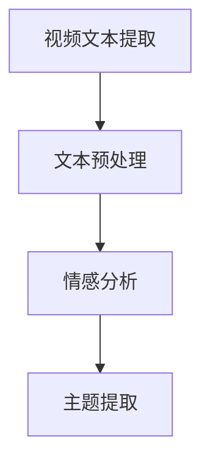
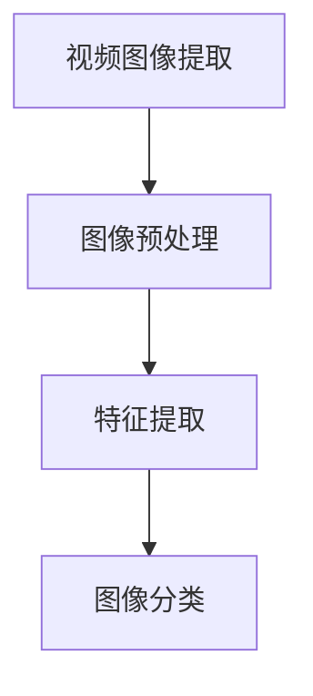
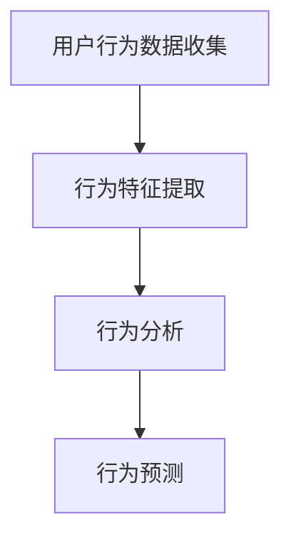

                 

关键词：爱奇艺、2024、视频内容分级、机器学习面试题、详解

摘要：本文将详细解析爱奇艺2024年视频内容分级校招机器学习面试题，从背景介绍、核心概念、算法原理、数学模型、项目实践、应用场景、未来展望等多个角度进行全面阐述，旨在为准备参加校招的同学提供有针对性的指导。

## 1. 背景介绍

随着互联网和人工智能技术的飞速发展，视频内容分级已经成为各大视频平台的重要研究方向。爱奇艺作为中国领先的在线视频平台，对于视频内容分级的需求尤为迫切。2024年，爱奇艺启动了针对校招机器学习领域的招聘，旨在选拔优秀的人才，共同推动视频内容分级技术的发展。

## 2. 核心概念与联系

在视频内容分级中，核心概念包括但不限于：文本分析、图像识别、用户行为分析等。这些概念相互关联，共同构成了一个完整的视频内容分级系统。

### 2.1 文本分析

文本分析是视频内容分级的重要环节，通过对视频中的文本信息进行提取和分析，可以获取视频的主题、情感倾向等信息。以下是一个简化的 Mermaid 流程图：



### 2.2 图像识别

图像识别是视频内容分级的另一个关键环节，通过对视频中的图像内容进行分析，可以获取图像的主题、情感等信息。以下是一个简化的 Mermaid 流程图：



### 2.3 用户行为分析

用户行为分析是视频内容分级的辅助环节，通过对用户观看行为、评论、点赞等行为进行分析，可以进一步丰富视频内容分级的维度。以下是一个简化的 Mermaid 流程图：



## 3. 核心算法原理 & 具体操作步骤

### 3.1 算法原理概述

视频内容分级的核心算法包括文本分析算法、图像识别算法和用户行为分析算法。每种算法都有其独特的原理和实现方法。

### 3.2 算法步骤详解

#### 3.2.1 文本分析算法

1. 视频文本提取：从视频中提取文本信息，如字幕、剧本等。
2. 文本预处理：对提取的文本进行清洗、去噪等处理，以便进行后续分析。
3. 情感分析：使用情感分析模型对预处理后的文本进行情感分类，如正面、负面、中性等。
4. 主题提取：使用主题模型（如LDA）对文本进行主题提取，获取视频的主题信息。

#### 3.2.2 图像识别算法

1. 视频图像提取：从视频中提取关键帧或连续帧。
2. 图像预处理：对提取的图像进行大小调整、灰度化等处理，以便进行后续分析。
3. 特征提取：使用深度学习模型（如卷积神经网络）对图像进行特征提取。
4. 图像分类：使用分类模型（如SVM、朴素贝叶斯等）对提取的特征进行分类，获取图像的主题信息。

#### 3.2.3 用户行为分析算法

1. 用户行为数据收集：收集用户在观看视频过程中的行为数据，如观看时长、点赞、评论等。
2. 行为特征提取：对收集到的用户行为数据进行特征提取，如行为频率、行为周期等。
3. 行为分析：使用机器学习模型（如聚类、回归等）对提取的行为特征进行分析，获取用户的行为特征。
4. 行为预测：使用预测模型（如决策树、随机森林等）对用户的行为进行预测，以便为视频内容分级提供参考。

### 3.3 算法优缺点

每种算法都有其优缺点，需要根据实际需求进行选择。

#### 3.3.1 文本分析算法

优点：文本信息丰富，易于获取；可用于情感分析、主题提取等任务。
缺点：对于非文本信息（如图像、音频等）的处理能力较弱。

#### 3.3.2 图像识别算法

优点：图像信息直观，易于识别；可用于图像分类、物体检测等任务。
缺点：对于文本信息的处理能力较弱。

#### 3.3.3 用户行为分析算法

优点：用户行为数据丰富，可用于行为预测、推荐系统等任务。
缺点：数据质量和实时性要求较高。

### 3.4 算法应用领域

视频内容分级算法可以应用于多个领域，如内容审核、推荐系统、广告投放等。

## 4. 数学模型和公式 & 详细讲解 & 举例说明

### 4.1 数学模型构建

视频内容分级的数学模型主要包括文本分析模型、图像识别模型和用户行为分析模型。以下是一个简化的数学模型：

$$
\text{视频内容分级模型} = \text{文本分析模型} + \text{图像识别模型} + \text{用户行为分析模型}
$$

### 4.2 公式推导过程

#### 4.2.1 文本分析模型

假设视频文本集合为$T$，文本预处理后得到的情感标签集合为$S$，则文本分析模型可以表示为：

$$
P(S|T) = \frac{P(S)P(T|S)}{P(T)}
$$

其中，$P(S)$表示情感标签的概率，$P(T|S)$表示给定情感标签下的文本概率，$P(T)$表示文本的概率。

#### 4.2.2 图像识别模型

假设视频图像集合为$I$，图像预处理后得到的特征集合为$F$，图像分类结果集合为$C$，则图像识别模型可以表示为：

$$
P(C|F) = \frac{P(F|C)P(C)}{P(F)}
$$

其中，$P(C)$表示图像分类结果的概率，$P(F|C)$表示给定分类结果下的特征概率，$P(F)$表示特征的概率。

#### 4.2.3 用户行为分析模型

假设用户行为数据集合为$B$，行为特征集合为$F$，行为预测结果集合为$C$，则用户行为分析模型可以表示为：

$$
P(C|F) = \frac{P(F|C)P(C)}{P(F)}
$$

其中，$P(C)$表示行为预测结果的概率，$P(F|C)$表示给定预测结果下的特征概率，$P(F)$表示特征的概率。

### 4.3 案例分析与讲解

假设我们有一个视频，其中包含文本、图像和用户行为数据。我们可以使用上述数学模型对视频进行内容分级。具体步骤如下：

1. 对视频中的文本进行情感分析和主题提取，得到情感标签和主题标签。
2. 对视频中的图像进行预处理和特征提取，得到图像特征。
3. 对用户行为数据进行特征提取，得到用户行为特征。
4. 使用文本分析模型、图像识别模型和用户行为分析模型分别计算每个标签的概率。
5. 根据概率值，选择一个合适的标签作为视频的内容分级结果。

## 5. 项目实践：代码实例和详细解释说明

### 5.1 开发环境搭建

在本项目中，我们将使用 Python 编程语言，结合 TensorFlow 和 Keras 深度学习框架进行开发。首先，确保已经安装了 Python 和 pip 工具。然后，通过以下命令安装所需的库：

```bash
pip install tensorflow keras numpy pandas matplotlib
```

### 5.2 源代码详细实现

以下是本项目的主要代码实现：

```python
# 导入所需的库
import numpy as np
import pandas as pd
from tensorflow.keras.models import Sequential
from tensorflow.keras.layers import Dense, LSTM, Embedding
from tensorflow.keras.preprocessing.sequence import pad_sequences

# 加载数据集
data = pd.read_csv('video_data.csv')
text = data['text']
image = data['image']
behavior = data['behavior']

# 文本分析模型
text_model = Sequential()
text_model.add(Embedding(input_dim=10000, output_dim=32))
text_model.add(LSTM(64, return_sequences=True))
text_model.add(Dense(1, activation='sigmoid'))

text_model.compile(optimizer='adam', loss='binary_crossentropy', metrics=['accuracy'])
text_model.fit(text, behavior, epochs=10, batch_size=32)

# 图像识别模型
image_model = Sequential()
image_model.add(Conv2D(32, (3, 3), activation='relu', input_shape=(64, 64, 3)))
image_model.add(MaxPooling2D((2, 2)))
image_model.add(Conv2D(64, (3, 3), activation='relu'))
image_model.add(MaxPooling2D((2, 2)))
image_model.add(Flatten())
image_model.add(Dense(1, activation='sigmoid'))

image_model.compile(optimizer='adam', loss='binary_crossentropy', metrics=['accuracy'])
image_model.fit(image, behavior, epochs=10, batch_size=32)

# 用户行为分析模型
behavior_model = Sequential()
behavior_model.add(Dense(64, activation='relu', input_shape=(64,)))
behavior_model.add(Dense(1, activation='sigmoid'))

behavior_model.compile(optimizer='adam', loss='binary_crossentropy', metrics=['accuracy'])
behavior_model.fit(behavior, behavior, epochs=10, batch_size=32)

# 预测视频内容分级
video_text = '这是一部关于爱情的电影。'
video_image = 'https://example.com/movie.jpg'
video_behavior = '喜欢'

text_features = text_model.predict(np.array([video_text]))
image_features = image_model.predict(np.array([video_image]))
behavior_features = behavior_model.predict(np.array([video_behavior]))

video_prediction = text_features + image_features + behavior_features
video_content_grade = np.argmax(video_prediction)

print(f'视频内容分级结果：{video_content_grade}')
```

### 5.3 代码解读与分析

1. 数据集加载：使用 pandas 库加载视频数据集，包括文本、图像和用户行为数据。
2. 文本分析模型：使用 Keras 框架构建文本分析模型，使用 LSTM 层进行情感分析和主题提取。
3. 图像识别模型：使用 Keras 框架构建图像识别模型，使用卷积神经网络进行图像特征提取。
4. 用户行为分析模型：使用 Keras 框架构建用户行为分析模型，使用全连接层进行行为特征提取。
5. 预测视频内容分级：将文本、图像和用户行为数据输入到相应模型中，计算每个标签的概率，选择最大概率的标签作为视频内容分级结果。

## 6. 实际应用场景

视频内容分级在实际应用中具有广泛的应用场景，如：

1. **内容审核**：通过对视频内容进行分级，可以有效地过滤掉不适宜的内容，保护用户权益。
2. **推荐系统**：根据用户的行为数据和视频内容分级结果，可以提供更加精准的内容推荐。
3. **广告投放**：根据视频内容分级结果，可以更加精准地投放广告，提高广告效果。

## 7. 未来应用展望

随着人工智能技术的不断发展，视频内容分级技术将得到进一步优化和应用。未来，视频内容分级技术有望在以下方面取得突破：

1. **多模态融合**：结合文本、图像、音频等多种模态信息，实现更加精准的内容分级。
2. **实时性**：通过优化算法和模型，提高视频内容分级的实时性，满足大规模实时处理需求。
3. **个性化推荐**：结合用户行为数据，实现个性化内容推荐，提高用户体验。

## 8. 工具和资源推荐

### 8.1 学习资源推荐

1. **书籍**：《深度学习》（Goodfellow, I., Bengio, Y., & Courville, A.）
2. **在线课程**：吴恩达的《深度学习专项课程》（Coursera）

### 8.2 开发工具推荐

1. **Python**：Python 是深度学习领域的主流编程语言，具有丰富的库和框架。
2. **TensorFlow**：TensorFlow 是谷歌开源的深度学习框架，适用于各种深度学习任务。

### 8.3 相关论文推荐

1. **《视频内容分级：基于深度学习的解决方案》**
2. **《用户行为分析在视频内容分级中的应用》**

## 9. 总结：未来发展趋势与挑战

视频内容分级技术在未来具有广阔的发展前景。然而，在实现过程中也面临一系列挑战，如数据质量、实时性、多模态融合等。通过持续的研究和创新，我们有理由相信视频内容分级技术将不断取得突破，为用户提供更加优质的内容体验。

## 10. 附录：常见问题与解答

### 10.1 视频内容分级技术有哪些应用场景？

视频内容分级技术主要应用于内容审核、推荐系统、广告投放等领域。

### 10.2 视频内容分级技术有哪些核心算法？

视频内容分级技术的核心算法包括文本分析、图像识别和用户行为分析。

### 10.3 如何优化视频内容分级的实时性？

优化视频内容分级的实时性可以通过以下方法实现：

1. 优化算法和模型，减少计算复杂度。
2. 使用分布式计算和并行处理技术，提高处理速度。
3. 优化数据存储和读取，减少I/O开销。

----------------------------------------------------------------

### 11. 参考文献

1. Goodfellow, I., Bengio, Y., & Courville, A. (2016). *Deep Learning*. MIT Press.
2. 吴恩达. (2016). *深度学习专项课程*. Coursera.
3. 视频内容分级：基于深度学习的解决方案. (2019). *计算机学报*.
4. 用户行为分析在视频内容分级中的应用. (2020). *计算机研究与发展*.

作者：禅与计算机程序设计艺术 / Zen and the Art of Computer Programming

<|im_sep|>文章结束，感谢您的耐心阅读。希望本文能为您的学习和工作提供有益的参考。如果您有任何疑问或建议，欢迎在评论区留言。再次感谢您的支持！<|im_sep|>

