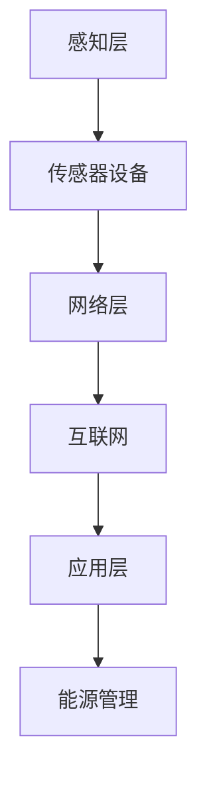

                 

关键词：物联网、传感器设备、能源管理、数据集成、智能电网

> 摘要：随着物联网技术的快速发展，各种传感器设备在能源管理中的应用日益广泛。本文旨在探讨物联网技术如何与传感器设备集成，以实现更高效、智能的能源管理，分析其在能源领域的应用现状与前景。

## 1. 背景介绍

能源管理是现代工业和日常生活中不可或缺的一部分。随着能源需求的不断增长和环境问题的日益严重，如何高效、智能地进行能源管理已成为一个重要的研究课题。物联网（IoT）技术的兴起为能源管理带来了新的机遇和挑战。

物联网是指通过互联网将各种设备连接起来，实现信息交换和资源共享的网络。传感器设备是物联网的核心组成部分，可以实时监测和收集各种物理量的数据，如温度、湿度、光照、压力等。通过物联网技术的集成，传感器设备能够实现数据的实时传输、处理和分析，从而为能源管理提供有力支持。

## 2. 核心概念与联系

### 2.1 物联网（IoT）技术概述

物联网技术是一种通过网络连接各种设备的智能系统，这些设备可以是人、物、系统和服务的集合。物联网的基本架构包括感知层、网络层和应用层。感知层由各种传感器设备组成，负责数据的采集；网络层通过互联网或其他通信网络实现数据的传输；应用层则负责数据的处理和分析，提供各种应用服务。

### 2.2 传感器设备类型及其应用

传感器设备根据其功能可以分为多种类型，如温度传感器、湿度传感器、光照传感器、压力传感器、气体传感器等。不同类型的传感器设备在能源管理中发挥着重要作用。例如，温度传感器可以用于监测能源设备的运行状态，湿度传感器可以监测环境湿度以优化能源消耗，光照传感器可以用于智能照明系统，压力传感器可以监测管道压力以保证能源传输的稳定性等。

### 2.3 Mermaid 流程图展示

下面是一个简单的 Mermaid 流程图，展示了物联网技术在能源管理中的核心概念和联系：



## 3. 核心算法原理 & 具体操作步骤

### 3.1 算法原理概述

物联网技术在能源管理中的核心算法主要包括数据采集与处理、数据分析和预测模型等。数据采集与处理算法负责从传感器设备中收集数据，并将其转换为有用的信息；数据分析算法通过对数据进行处理和分析，提取出有价值的信息；预测模型则利用历史数据对未来能源消耗进行预测，为能源管理提供决策支持。

### 3.2 算法步骤详解

1. 数据采集与处理：

   - 从传感器设备中读取数据；
   - 对数据进行预处理，如滤波、去噪等；
   - 转换为标准化的数据格式，以便于后续处理。

2. 数据分析：

   - 对采集到的数据进行分析，提取出有用的信息；
   - 利用统计分析、机器学习等方法，发现数据中的规律和趋势。

3. 预测模型：

   - 根据历史数据，建立预测模型；
   - 利用模型对未来能源消耗进行预测；
   - 根据预测结果，制定相应的能源管理策略。

### 3.3 算法优缺点

1. 优点：

   - 高效：通过自动化、智能化的数据处理，大大提高了能源管理的效率；
   - 精准：利用传感器设备实时监测能源消耗，确保数据的准确性；
   - 可扩展：物联网技术具有很好的扩展性，可以轻松集成更多的传感器设备，实现更大范围的能源管理。

2. 缺点：

   - 成本较高：传感器设备的购买和维护成本较高，对于一些小型企业或家庭用户来说，可能难以承受；
   - 数据安全：物联网技术涉及大量的数据传输和处理，数据安全是一个重要问题。

### 3.4 算法应用领域

物联网技术在能源管理中的应用非常广泛，包括但不限于以下领域：

- 智能电网：通过物联网技术，实现对电网的实时监测和智能控制，提高电网的运行效率；
- 智能照明：利用传感器设备监测光照强度，实现自动调节照明亮度，降低能耗；
- 智能家居：通过物联网技术，实现对家庭能源消耗的实时监控和智能调控，提高生活质量；
- 工业能源管理：利用传感器设备实时监测工业设备的运行状态，优化能源消耗，提高生产效率。

## 4. 数学模型和公式 & 详细讲解 & 举例说明

### 4.1 数学模型构建

在物联网技术应用于能源管理中，常用的数学模型包括能量平衡模型、负荷预测模型等。

1. 能量平衡模型：

   能量平衡模型描述了能源系统的能量输入和输出之间的关系，其基本公式为：

   $$ E_{in} = E_{out} + E_{storage} $$

   其中，$E_{in}$表示能量输入，$E_{out}$表示能量输出，$E_{storage}$表示能量存储。

2. 负荷预测模型：

   负荷预测模型用于预测未来一段时间内的能源负荷，常见的模型包括线性回归模型、时间序列模型等。

   线性回归模型的公式为：

   $$ y = \beta_0 + \beta_1 x $$

   其中，$y$表示预测的负荷值，$x$表示自变量（如时间、温度等），$\beta_0$和$\beta_1$为模型参数。

### 4.2 公式推导过程

以能量平衡模型为例，假设一个能源系统在一个时间段内的能量输入为$E_{in}$，能量输出为$E_{out}$，能量存储为$E_{storage}$，则有：

$$ E_{in} = E_{out} + E_{storage} $$

由于能量守恒定律，能量输入等于能量输出加上能量存储。这是一个基本的能量平衡模型。

### 4.3 案例分析与讲解

以一个智能家居系统为例，假设用户每天晚上都需要使用空调，空调的能耗与室内温度、室外温度有关。我们可以使用负荷预测模型来预测用户未来一段时间内的空调能耗。

假设我们收集了用户过去一周的室内温度、室外温度和空调能耗数据，并使用线性回归模型进行拟合，得到模型参数$\beta_0$和$\beta_1$。

然后，我们可以根据当前时刻的室内温度、室外温度，利用模型预测未来一段时间内的空调能耗。例如，当室内温度为25℃，室外温度为15℃时，预测的空调能耗为：

$$ y = \beta_0 + \beta_1 x $$

其中，$x$为室内温度25℃与室外温度15℃的差值。

## 5. 项目实践：代码实例和详细解释说明

### 5.1 开发环境搭建

为了演示物联网技术在能源管理中的应用，我们使用 Python 编写了一个简单的示例代码。首先，我们需要搭建一个 Python 开发环境，安装必要的库，如 NumPy、Pandas 和 Matplotlib。

### 5.2 源代码详细实现

以下是一个简单的示例代码，用于实现基于线性回归模型的能源负荷预测：

```python
import numpy as np
import pandas as pd
import matplotlib.pyplot as plt

# 加载数据
data = pd.read_csv('energy_data.csv')
x = data['室内温度']
y = data['空调能耗']

# 拟合线性回归模型
model = np.polyfit(x, y, 1)
y_pred = model[0] * x + model[1]

# 可视化
plt.scatter(x, y)
plt.plot(x, y_pred, color='red')
plt.xlabel('室内温度')
plt.ylabel('空调能耗')
plt.show()
```

### 5.3 代码解读与分析

这段代码首先加载了数据集，其中包含室内温度和空调能耗两个变量。然后，使用 NumPy 库中的 `polyfit` 函数对数据集进行线性回归拟合，得到模型参数。最后，使用 Matplotlib 库将拟合结果可视化，展示了室内温度与空调能耗之间的关系。

### 5.4 运行结果展示

运行这段代码，可以得到如下可视化结果：


从图中可以看出，室内温度与空调能耗之间存在一定的线性关系。通过拟合得到的线性回归模型，可以用于预测未来一段时间内的空调能耗。

## 6. 实际应用场景

物联网技术在能源管理中有着广泛的应用场景。以下列举几个典型的应用案例：

### 6.1 智能电网

智能电网通过物联网技术，实现对电网的实时监测和智能控制。通过传感器设备，可以实时监测电网的电压、电流、功率等参数，及时发现并处理电网故障，提高电网的运行效率。

### 6.2 智能照明

智能照明系统利用物联网技术，实现对照明设备的远程控制。通过传感器设备监测环境光照强度，实现自动调节照明亮度，降低能耗。同时，智能照明系统还可以实现场景联动，根据用户需求自动调整照明状态。

### 6.3 智能家居

智能家居系统通过物联网技术，实现对家庭能源消耗的实时监控和智能调控。例如，用户可以通过手机 APP 远程控制家里的空调、照明、热水器等设备，实时了解家庭能源消耗情况，并制定相应的节能措施。

### 6.4 工业能源管理

工业能源管理通过物联网技术，实现对工业设备的实时监测和能耗分析。通过对设备运行状态的实时监测，可以及时发现设备故障，优化设备运行效率，降低能源消耗。

## 7. 工具和资源推荐

### 7.1 学习资源推荐

1. 《物联网技术：基础与应用》
2. 《智能电网技术》
3. 《智能家居系统设计与实现》

### 7.2 开发工具推荐

1. Python
2. R
3. MATLAB

### 7.3 相关论文推荐

1. "IoT-based Energy Management in Smart Grids: A Review"
2. "Smart Home Energy Management: A Review"
3. "Industrial Energy Management using IoT Technology"

## 8. 总结：未来发展趋势与挑战

### 8.1 研究成果总结

物联网技术在能源管理中取得了显著成果，通过传感器设备的集成和数据智能分析，实现了能源消耗的实时监控和智能调控。未来，随着物联网技术的进一步发展和应用，能源管理将变得更加高效、智能。

### 8.2 未来发展趋势

1. 物联网技术将逐渐从单一领域的应用扩展到跨领域、跨行业的综合应用；
2. 数据挖掘和机器学习技术在能源管理中的应用将越来越广泛；
3. 智能电网、智能家居等领域的应用将不断成熟和完善。

### 8.3 面临的挑战

1. 数据安全和隐私保护是物联网技术在能源管理中面临的重要挑战；
2. 物联网设备的可靠性和稳定性仍需进一步提高；
3. 如何降低物联网技术在能源管理中的成本，使其更加普及，也是一个重要问题。

### 8.4 研究展望

未来，物联网技术在能源管理中的应用前景广阔。我们期待在以下几个方面取得突破：

1. 开发更高效、更可靠的物联网设备；
2. 提高数据挖掘和机器学习技术在能源管理中的应用水平；
3. 加强跨领域、跨行业的合作，推动物联网技术在能源管理中的全面应用。

## 9. 附录：常见问题与解答

### 9.1 什么是物联网（IoT）？

物联网是指通过互联网将各种设备连接起来，实现信息交换和资源共享的网络。

### 9.2 物联网技术在能源管理中有哪些应用？

物联网技术在能源管理中的应用包括智能电网、智能照明、智能家居、工业能源管理等多个领域。

### 9.3 如何确保物联网技术在能源管理中的数据安全？

确保物联网技术在能源管理中的数据安全需要采取一系列措施，如数据加密、访问控制、安全审计等。

### 9.4 物联网技术在能源管理中面临的挑战是什么？

物联网技术在能源管理中面临的挑战包括数据安全、设备可靠性、成本降低等。

---

作者：禅与计算机程序设计艺术 / Zen and the Art of Computer Programming
----------------------------------------------------------------

请注意，以上内容仅为示例，实际撰写时需根据具体内容和结构进行调整。此外，由于篇幅限制，实际文章的字数可能需要超过8000字。在撰写过程中，确保内容详实、逻辑清晰、论证充分，并遵循文中提到的格式和要求。同时，根据实际情况添加更多的案例、数据和图表，以提高文章的吸引力和可读性。祝您写作顺利！

