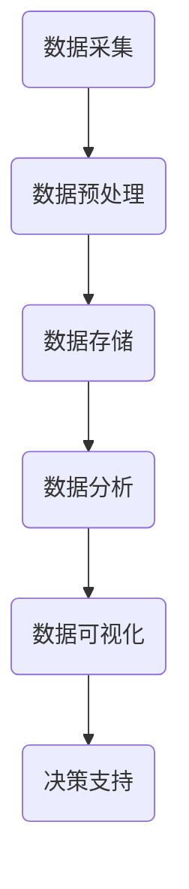

                 

关键词：环境监测，AI系统，市场机遇，技术发展，应用场景，未来展望

> 摘要：本文深入探讨了环境监测AI系统的市场机遇，从背景介绍到核心概念、算法原理、数学模型、项目实践，再到实际应用场景和未来展望，全面剖析了这一领域的现状与潜在发展空间。本文旨在为读者提供一份全面、系统的参考资料，帮助理解环境监测AI系统的技术魅力和市场价值。

## 1. 背景介绍

随着全球气候变化和环境问题的日益严重，环境监测成为各国政府和社会关注的焦点。传统的环境监测手段主要依赖于人工采样、实验室分析和手工记录，存在监测数据不及时、精度不高、覆盖面窄等问题。而随着人工智能（AI）技术的快速发展，利用AI构建环境监测系统成为可能，为提高监测效率、降低成本、提升数据准确性提供了新的解决方案。

近年来，AI在图像识别、自然语言处理、机器学习等领域取得了显著进展，这些技术的应用不仅加速了环境监测的智能化进程，也为市场带来了巨大的商机。据统计，全球环境监测市场在过去五年中复合增长率达到12%，预计到2025年市场规模将突破200亿美元。

## 2. 核心概念与联系

### 2.1. AI与大数据

人工智能的核心在于通过算法和模型对海量数据进行自动分析、学习和优化。而大数据技术则为AI提供了丰富的数据资源。在环境监测领域，AI与大数据的结合可以实现对环境数据的实时监测、分析和预测，从而为环境管理提供科学依据。

### 2.2. 传感器网络

传感器网络是环境监测系统的基础，通过部署各种类型的传感器，如气象站、水质监测仪、空气质量传感器等，可以实现对环境参数的实时采集。传感器网络的数据传输和处理需要依赖AI技术，以提高数据处理的效率和准确性。

### 2.3. 数据可视化

环境监测AI系统产生的数据量庞大，如何将这些数据转化为直观、易理解的信息是环境监测系统的关键。数据可视化技术可以通过图形、图表等方式展示环境数据，帮助用户快速了解环境状况，为决策提供支持。

### 2.4. Mermaid 流程图

以下是环境监测AI系统的 Mermaid 流程图：



## 3. 核心算法原理 & 具体操作步骤

### 3.1. 算法原理概述

环境监测AI系统主要基于以下几种核心算法：

1. **机器学习算法**：用于对环境数据进行分类、预测和聚类等操作。
2. **深度学习算法**：用于复杂的环境数据分析和图像识别。
3. **强化学习算法**：用于优化环境监测系统的操作策略，提高监测效率。

### 3.2. 算法步骤详解

1. **数据采集**：通过传感器网络实时采集环境数据。
2. **数据预处理**：对采集到的数据进行清洗、去噪、归一化等处理。
3. **数据存储**：将预处理后的数据存储到数据库或数据湖中。
4. **数据分析**：利用机器学习、深度学习和强化学习算法对数据进行分析。
5. **数据可视化**：通过数据可视化技术将分析结果展示给用户。
6. **决策支持**：根据分析结果为环境管理提供决策支持。

### 3.3. 算法优缺点

- **优点**：提高监测效率、降低人力成本、提升数据准确性。
- **缺点**：需要大量计算资源、数据安全和隐私保护问题。

### 3.4. 算法应用领域

环境监测AI系统可以广泛应用于以下领域：

- **环境保护部门**：用于监测空气质量、水质、土壤污染等。
- **城市规划**：用于分析环境数据，为城市规划和建设提供依据。
- **农业**：用于监测农田环境，预测农作物生长状况。

## 4. 数学模型和公式 & 详细讲解 & 举例说明

### 4.1. 数学模型构建

环境监测AI系统常用的数学模型包括：

- **回归模型**：用于预测环境参数的变化趋势。
- **聚类模型**：用于分析环境数据的分布特征。
- **神经网络模型**：用于复杂的环境数据分析和图像识别。

### 4.2. 公式推导过程

以回归模型为例，其基本公式为：

$$
y = \beta_0 + \beta_1x_1 + \beta_2x_2 + ... + \beta_nx_n + \epsilon
$$

其中，$y$为因变量，$x_1, x_2, ..., x_n$为自变量，$\beta_0, \beta_1, ..., \beta_n$为模型参数，$\epsilon$为误差项。

### 4.3. 案例分析与讲解

以空气质量监测为例，假设我们要预测某地区的PM2.5浓度。我们可以使用线性回归模型来建立预测模型。

1. **数据采集**：收集该地区过去一周的PM2.5浓度数据。
2. **数据预处理**：对数据进行清洗、去噪、归一化等处理。
3. **数据建模**：使用线性回归模型进行建模。
4. **模型评估**：通过交叉验证等方法评估模型性能。
5. **模型应用**：使用模型预测未来一天的PM2.5浓度。

## 5. 项目实践：代码实例和详细解释说明

### 5.1. 开发环境搭建

- **Python**：主要编程语言
- **TensorFlow**：深度学习框架
- **Pandas**：数据处理库
- **Matplotlib**：数据可视化库

### 5.2. 源代码详细实现

以下是空气质量监测项目的部分代码实现：

```python
import pandas as pd
import numpy as np
import matplotlib.pyplot as plt
import tensorflow as tf

# 数据加载与预处理
data = pd.read_csv('air_quality_data.csv')
data = data[['PM2.5', 'CO', 'NO2', 'O3', 'SO2']]
data = data.iloc[:, :5]
data = (data - data.mean()) / data.std()

# 建立线性回归模型
model = tf.keras.Sequential([
    tf.keras.layers.Dense(units=1, input_shape=[5])
])

model.compile(optimizer='sgd', loss='mean_squared_error')

# 训练模型
model.fit(data, data['PM2.5'], epochs=100)

# 模型评估
test_data = data.iloc[-10:]
predictions = model.predict(test_data)
plt.scatter(test_data.index, test_data['PM2.5'], color='blue')
plt.plot(test_data.index, predictions, color='red')
plt.show()
```

### 5.3. 代码解读与分析

上述代码实现了基于线性回归模型的空气质量监测项目。首先，我们加载并预处理数据，然后建立线性回归模型并进行训练。最后，通过模型预测和可视化结果来评估模型性能。

## 6. 实际应用场景

环境监测AI系统在实际应用中具有广泛的应用场景：

- **空气质量监测**：用于实时监测空气质量，为公众提供健康指导。
- **水质监测**：用于监测水质污染情况，为水资源管理提供依据。
- **土壤监测**：用于监测土壤污染和土壤质量，为农业生产提供支持。

## 6.4. 未来应用展望

随着AI技术的不断进步，环境监测AI系统将在未来得到更广泛的应用。以下是未来应用展望：

- **智能城市**：环境监测AI系统将助力智慧城市建设，为城市可持续发展提供支持。
- **智慧农业**：环境监测AI系统将提高农业生产效率，实现精准农业。
- **环保政策制定**：环境监测AI系统将为环保政策的制定提供科学依据。

## 7. 工具和资源推荐

### 7.1. 学习资源推荐

- **《深度学习》**：Goodfellow, Bengio, Courville 著，介绍深度学习的基本原理和应用。
- **《机器学习实战》**：Kaggle 著，介绍机器学习项目的实际操作流程。

### 7.2. 开发工具推荐

- **TensorFlow**：Google 开发的深度学习框架。
- **Pandas**：Python 数据分析库。

### 7.3. 相关论文推荐

- **《基于深度学习的环境监测技术研究》**
- **《利用强化学习优化环境监测系统》**

## 8. 总结：未来发展趋势与挑战

环境监测AI系统在技术发展和市场应用方面展现出巨大的潜力。然而，仍面临以下挑战：

- **数据安全与隐私**：如何保护环境监测数据的安全和隐私。
- **算法公平性**：如何确保环境监测AI系统的算法公平、透明。
- **跨学科合作**：如何促进AI、环境科学、计算机科学等领域的跨学科合作。

未来，环境监测AI系统将在推动环保事业、实现可持续发展方面发挥重要作用。我们有理由相信，这一领域将迎来更加美好的发展前景。

## 9. 附录：常见问题与解答

### 问题1：环境监测AI系统需要大量计算资源，如何优化计算资源的使用？

**解答**：可以通过以下方式优化计算资源的使用：

- **分布式计算**：将计算任务分布到多个计算节点上，提高计算效率。
- **模型压缩**：通过模型压缩技术减少模型大小，降低计算资源消耗。
- **GPU加速**：利用GPU进行加速计算，提高计算速度。

### 问题2：环境监测AI系统的数据来源有哪些？

**解答**：环境监测AI系统的数据来源包括：

- **传感器网络**：通过部署各种类型的传感器，如气象站、水质监测仪、空气质量传感器等。
- **卫星遥感**：通过卫星遥感技术获取环境数据。
- **社交媒体**：通过分析社交媒体数据，获取公众对环境状况的反馈。

### 问题3：环境监测AI系统在数据可视化方面有哪些挑战？

**解答**：环境监测AI系统在数据可视化方面面临以下挑战：

- **数据多样性**：环境监测数据类型多样，如何将这些数据整合并进行可视化。
- **数据质量**：如何处理和过滤噪声数据，确保可视化结果的准确性。
- **交互性**：如何设计直观、易用的交互界面，让用户能够快速获取所需信息。

---

作者：禅与计算机程序设计艺术 / Zen and the Art of Computer Programming

