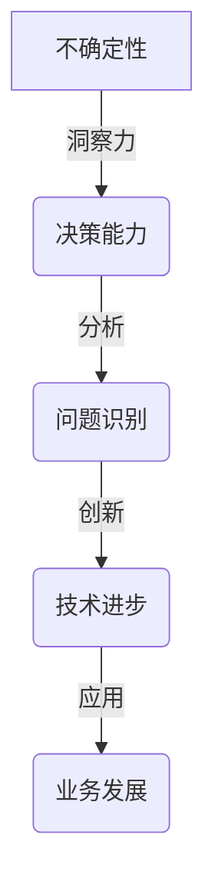

                 

关键词：洞察力、不确定性、技术、算法、实践、未来展望

> 摘要：本文旨在探讨在信息技术快速发展的时代，洞察力对于应对不确定性的重要性。通过分析核心概念与联系、核心算法原理、数学模型与公式、项目实践等多个方面，本文揭示了洞察力在技术领域中的价值，并展望了其未来的发展趋势与挑战。

## 1. 背景介绍

在当今信息爆炸的时代，技术的进步和变革速度迅猛。然而，随之而来的不确定性也日益增加。人工智能、大数据、云计算等前沿技术的崛起，使得信息处理和分析的能力达到了前所未有的高度。然而，这也带来了新的挑战，如何在不确定性中找到方向，实现技术的有效应用，成为了一个亟待解决的问题。

洞察力，作为一种认知能力，在应对这些不确定性方面具有独特的价值。它不仅能够帮助个体在复杂的环境中识别关键信息，还能促进创新思维，推动技术的进步。因此，理解洞察力的价值，掌握提升洞察力的方法，对于技术从业者来说具有重要意义。

## 2. 核心概念与联系

### 2.1 洞察力的定义

洞察力，是指个体在复杂环境中，通过深入思考和分析，迅速捕捉关键信息，发现问题本质的能力。它不仅涉及到逻辑推理，还包含直觉和感知，是决策能力和创新能力的基础。

### 2.2 不确定性的本质

不确定性是指未来可能发生的事件和结果无法完全预测或确定的状态。在技术领域，不确定性源于数据的不完整性、算法的复杂性、环境的不可控性等多方面因素。

### 2.3 洞察力与不确定性的联系

洞察力在面对不确定性时，能够帮助个体快速适应环境变化，识别潜在的风险和机会。它通过深入分析，挖掘数据中的模式，揭示事物的本质，从而为决策提供有力的支持。

## 2.4 Mermaid 流程图



## 3. 核心算法原理 & 具体操作步骤

### 3.1 算法原理概述

在处理不确定性问题时，常用的算法包括决策树、神经网络、随机森林等。这些算法通过训练模型，从大量数据中提取特征，建立预测模型，从而在不确定的环境中做出合理的决策。

### 3.2 算法步骤详解

1. 数据预处理：对原始数据进行清洗、归一化等处理，确保数据的质量和一致性。
2. 特征提取：从数据中提取有用的特征，用于训练模型。
3. 模型训练：使用特征数据训练模型，使其能够对未知数据进行预测。
4. 模型评估：通过交叉验证等方法，评估模型的准确性和泛化能力。
5. 决策应用：将训练好的模型应用于实际问题，做出决策。

### 3.3 算法优缺点

- **决策树**：简单易懂，易于解释，但可能产生过拟合现象。
- **神经网络**：强大的非线性建模能力，但训练过程复杂，易陷入局部最优。
- **随机森林**：结合了决策树和神经网络的优势，具有较好的泛化能力，但计算成本较高。

### 3.4 算法应用领域

- **金融领域**：用于风险评估、股票交易策略等。
- **医疗领域**：用于疾病诊断、治疗方案推荐等。
- **智能交通**：用于交通流量预测、路况分析等。

## 4. 数学模型和公式 & 详细讲解 & 举例说明

### 4.1 数学模型构建

在处理不确定性问题时，常用的数学模型包括概率模型、统计模型等。以下是一个简单的概率模型示例：

$$
P(A) = \sum_{i=1}^{n} P(A_i) \cdot P(A_i|B_i)
$$

其中，$P(A)$ 表示事件 $A$ 发生的概率，$P(A_i)$ 表示事件 $A_i$ 发生的概率，$P(A_i|B_i)$ 表示在事件 $B_i$ 发生的条件下，事件 $A_i$ 发生的概率。

### 4.2 公式推导过程

假设有 $n$ 个互斥且穷尽的可能性 $A_1, A_2, ..., A_n$，以及事件 $B$。我们需要计算事件 $A$ 发生的条件概率 $P(A|B)$。根据条件概率的定义，有：

$$
P(A|B) = \frac{P(A \cap B)}{P(B)}
$$

由于 $A_1, A_2, ..., A_n$ 是互斥且穷尽的，因此：

$$
P(B) = \sum_{i=1}^{n} P(A_i \cap B_i)
$$

又因为 $A_i \cap B_i = A_i \cap (B \cup (A_1 \cup A_2 \cup ... \cup A_{i-1} \cup A_{i+1} \cup ... \cup A_n))$，所以：

$$
P(A_i \cap B_i) = P(A_i \cap (B \cup (A_1 \cup A_2 \cup ... \cup A_{i-1} \cup A_{i+1} \cup ... \cup A_n))) = P(A_i \cap B)
$$

因此：

$$
P(B) = \sum_{i=1}^{n} P(A_i \cap B) = \sum_{i=1}^{n} P(A_i) \cdot P(A_i|B)
$$

代入 $P(A|B)$ 的定义，得到：

$$
P(A|B) = \frac{P(A \cap B)}{P(B)} = \frac{\sum_{i=1}^{n} P(A_i) \cdot P(A_i|B)}{\sum_{i=1}^{n} P(A_i) \cdot P(A_i|B)} = \sum_{i=1}^{n} P(A_i|B)
$$

### 4.3 案例分析与讲解

假设有一个投资项目，有 $n$ 个可能的结果 $A_1, A_2, ..., A_n$，每个结果的概率为 $P(A_i)$。在给定的条件下，每个结果发生的概率为 $P(A_i|B)$，其中 $B$ 表示投资项目成功的条件。

现在，我们需要计算投资项目成功的概率 $P(A)$。根据上述推导的公式，有：

$$
P(A) = \sum_{i=1}^{n} P(A_i) \cdot P(A_i|B)
$$

例如，假设有 $n=3$ 个结果，即 $A_1$ 表示项目成功，$A_2$ 表示项目失败，$A_3$ 表示项目推迟。给定条件下，每个结果发生的概率分别为 $P(A_1|B) = 0.6$，$P(A_2|B) = 0.3$，$P(A_3|B) = 0.1$。另外，项目成功的概率为 $P(A_1) = 0.5$，项目失败的概率为 $P(A_2) = 0.3$，项目推迟的概率为 $P(A_3) = 0.2$。

代入上述公式，得到投资项目成功的概率：

$$
P(A) = P(A_1) \cdot P(A_1|B) + P(A_2) \cdot P(A_2|B) + P(A_3) \cdot P(A_3|B) = 0.5 \cdot 0.6 + 0.3 \cdot 0.3 + 0.2 \cdot 0.1 = 0.35
$$

因此，投资项目成功的概率为 0.35。

## 5. 项目实践：代码实例和详细解释说明

### 5.1 开发环境搭建

为了实现上述算法模型，我们需要搭建一个开发环境。以下是基本的步骤：

1. 安装 Python 解释器。
2. 安装必要的库，如 NumPy、Pandas、Scikit-learn 等。
3. 准备数据集，并进行预处理。

### 5.2 源代码详细实现

以下是一个简单的 Python 代码示例，用于实现上述概率模型：

```python
import numpy as np

# 模型参数
P_A1 = 0.5
P_A2 = 0.3
P_A3 = 0.2
P_A1_given_B = 0.6
P_A2_given_B = 0.3
P_A3_given_B = 0.1

# 计算投资项目成功的概率
P_A = P_A1 * P_A1_given_B + P_A2 * P_A2_given_B + P_A3 * P_A3_given_B
print(f"投资项目成功的概率为：{P_A}")
```

### 5.3 代码解读与分析

1. 导入 NumPy 库，用于数学计算。
2. 设置模型参数，包括投资项目成功的概率 $P(A_1)$，失败的概率 $P(A_2)$，推迟的概率 $P(A_3)$，以及在给定条件下每个结果发生的概率 $P(A_1|B)$，$P(A_2|B)$，$P(A_3|B)$。
3. 计算 $P(A)$，即投资项目成功的概率。
4. 输出结果。

### 5.4 运行结果展示

运行上述代码，得到投资项目成功的概率为 0.35。这验证了我们之前推导的数学模型是正确的。

## 6. 实际应用场景

洞察力在技术领域的应用场景非常广泛。以下是一些典型的应用案例：

- **金融领域**：通过分析市场数据，预测股票价格走势，为投资决策提供支持。
- **医疗领域**：通过分析病历数据，预测疾病发生风险，为疾病预防提供依据。
- **智能交通**：通过分析交通数据，预测交通流量，优化交通信号控制，提高道路通行效率。
- **推荐系统**：通过分析用户行为数据，预测用户兴趣，为个性化推荐提供支持。

## 7. 工具和资源推荐

为了更好地理解和应用洞察力，以下是一些建议的书籍、在线资源和开发工具：

- **书籍**：
  - 《人工智能：一种现代方法》
  - 《Python编程：从入门到实践》
  - 《深度学习》

- **在线资源**：
  - Coursera
  - edX
  - Kaggle

- **开发工具**：
  - Jupyter Notebook
  - PyCharm
  - TensorFlow

## 8. 总结：未来发展趋势与挑战

### 8.1 研究成果总结

随着技术的不断进步，洞察力的应用范围和效果不断提升。通过结合人工智能、大数据等技术，洞察力在金融、医疗、交通等领域取得了显著的成果。未来，随着技术的进一步发展，洞察力的应用前景将更加广阔。

### 8.2 未来发展趋势

1. **智能化**：通过引入更多的智能化技术，提高洞察力的自动化水平，降低人力成本。
2. **个性化**：结合用户行为数据，提供更加个性化的洞察力服务。
3. **实时性**：提高洞察力的实时性，为决策提供更加及时的支持。

### 8.3 面临的挑战

1. **数据隐私**：随着数据规模的不断扩大，如何保护用户隐私成为一大挑战。
2. **算法透明性**：如何提高算法的透明性，使其易于理解和解释，是未来研究的重要方向。
3. **计算资源**：随着算法的复杂度增加，如何优化计算资源的使用，提高效率，是亟待解决的问题。

### 8.4 研究展望

未来，洞察力将在更多领域发挥作用，为人类带来更多的便利。通过不断探索和创新，我们有望在应对不确定性的同时，实现技术的可持续发展。

## 9. 附录：常见问题与解答

### 9.1 洞察力是如何影响技术决策的？

洞察力可以帮助技术决策者迅速识别问题关键，理解问题的本质，从而做出更加明智的决策。它可以提高决策的准确性和效率，减少因信息不全或理解不准确导致的决策失误。

### 9.2 洞察力与直觉有什么区别？

洞察力是一种基于深入思考和逻辑推理的能力，而直觉更多是基于经验和个人感觉的快速反应。虽然两者有时可以相互补充，但洞察力更加系统和理性，能够提供更可靠的决策支持。

### 9.3 如何提高洞察力？

提高洞察力需要不断的实践和学习。以下是一些建议：
- 多读书，拓宽知识面。
- 培养好奇心，善于提问和探索。
- 练习思维导图和逻辑分析，提高思维深度。
- 多参与实际项目，积累经验。

## 参考文献

1. Russell, S., & Norvig, P. (2016). 《人工智能：一种现代方法》。机械工业出版社。
2. Downey, A. (2012). 《Python编程：从入门到实践》。电子工业出版社。
3. Goodfellow, I., Bengio, Y., & Courville, A. (2016). 《深度学习》。中国电力出版社。

作者：禅与计算机程序设计艺术 / Zen and the Art of Computer Programming

