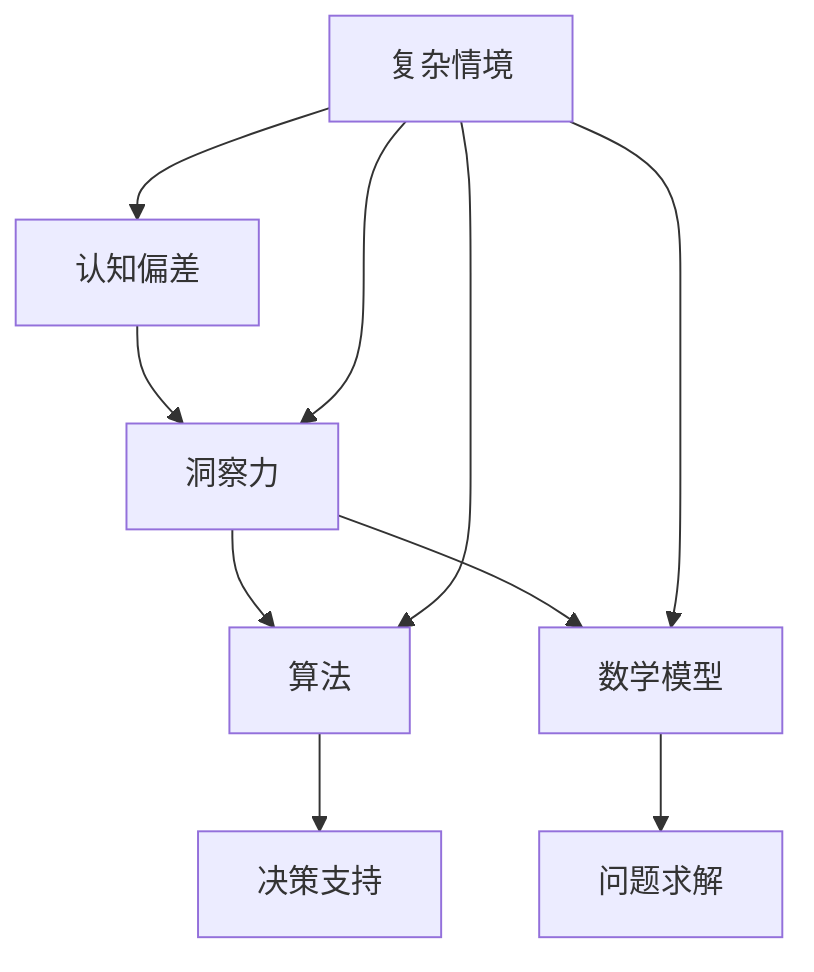

                 

关键词：洞察力、认知偏差、技术领域、算法、数学模型、实际应用、未来发展

> 摘要：本文旨在探讨技术领域中洞察力的偏误及其对认知偏差的影响。通过深入分析认知偏差的根源，结合实际案例，我们提出了相关算法和数学模型，以期为读者提供对这一问题的全面理解和解决思路。

## 1. 背景介绍

在技术迅猛发展的时代，洞察力成为了创新和进步的重要驱动力。然而，洞察力的生成并非无偏，它受到人类认知偏差的影响。认知偏差是指人类在信息处理过程中，由于心理、生理、文化等多方面因素导致的系统性和非系统性的错误。这些偏差可能隐藏在洞察力的背后，导致决策失误、算法失效等问题。

在技术领域，认知偏差的影响尤为显著。算法工程师、数据分析师、人工智能研究者等角色都需要高度依赖洞察力进行决策。然而，如果洞察力受到偏差的影响，那么可能会导致错误的结果，甚至影响整个项目的成败。

本文将围绕以下几个核心问题展开讨论：

1. 认知偏差是如何影响洞察力的？
2. 如何通过算法和数学模型来识别和纠正这些偏差？
3. 认知偏差在不同技术领域中的具体表现是什么？
4. 我们如何利用这些知识来指导实践，提升洞察力的准确性？

通过这些问题的探讨，本文希望能够帮助读者更深入地理解认知偏差对技术领域的影响，并提供实用的解决思路。

### 1.1 认知偏差的普遍性

认知偏差是普遍存在的，几乎每个人都会受到其影响。例如，确认偏误是指人们倾向于寻找和解释那些支持自己已有观点的信息，而忽视或否认相反的证据。这种偏误在技术领域的表现尤为明显。当算法工程师或数据分析师在面对新的数据集或问题时，如果他们已有的一些假设或理论受到挑战，他们可能会不自觉地筛选那些支持自己观点的数据，从而忽略了其他可能更有价值的信息。

另外，锚定效应是指人们在做决策时，会受到第一印象或初始信息的影响，而忽视了后续的信息。例如，在算法优化过程中，如果工程师最初选择了一种特定的优化策略，即使后续的数据表明这种方法效果不佳，他们也可能继续坚持这一策略，因为他们受到了最初选择的“锚定”。

这些认知偏差不仅会影响个体的决策，还会影响整个团队和组织的决策过程。在技术项目中，如果团队成员都受到相同的认知偏差影响，那么很可能会导致一系列错误决策，从而影响项目的进展和质量。

### 1.2 技术领域中的认知偏差

在技术领域，认知偏差的影响尤为显著。首先，技术工作者在面临复杂问题时，往往需要依赖自己的经验和直觉进行决策。然而，经验和直觉本身可能受到认知偏差的影响，从而导致错误的决策。

例如，在软件工程中，确认偏误可能导致开发人员过度依赖某些现有的技术解决方案，而忽视了新兴的技术趋势。这种偏误不仅会限制创新，还可能导致项目无法满足用户的需求。

此外，技术工作者在评估风险和收益时，也可能受到锚定效应的影响。例如，在人工智能项目中，如果最初的投资和研发成本较高，即使后续的改进和优化措施表明项目的收益可能更高，工程师们也可能因受“锚定”而继续高估风险，从而减缓项目推进的速度。

这些认知偏差不仅会影响个人的决策，还会影响整个技术团队的协作和决策过程。例如，在一个团队中，如果某位成员的决策受到认知偏差的影响，那么他或她的观点可能会被其他成员模仿，从而影响整个团队的方向和决策。

### 1.3 认知偏差的危害

认知偏差的危害主要体现在以下几个方面：

1. **决策失误**：认知偏差可能导致个体或团队在面临关键决策时选择错误的方向，从而影响项目的进展和成果。
2. **效率低下**：认知偏差可能导致重复性的错误和低效的工作方式，浪费时间和资源。
3. **创新受限**：认知偏差可能使技术工作者过度依赖现有的知识和方法，从而限制了新的创新和突破。
4. **团队协作受阻**：认知偏差可能影响团队成员之间的沟通和协作，导致团队效率低下。

因此，理解和克服认知偏差对提升技术领域的洞察力和决策质量具有重要意义。

### 1.4 认知偏差的来源

认知偏差的来源多种多样，主要包括以下几点：

1. **心理因素**：人类的心理特点，如期望、恐惧、情绪等，都可能影响认知过程，导致偏差。
2. **生理因素**：人的感官和神经系统也可能会导致信息处理的偏差，例如，视觉上的错觉、听觉上的误解等。
3. **文化因素**：文化背景、教育水平、社会价值观等也会影响个体的认知过程，从而产生偏差。
4. **技术因素**：在技术领域，算法的设计和实现方式也可能导致认知偏差，例如，数据预处理方法、算法选择等。

了解这些来源有助于我们更好地识别和克服认知偏差，提高洞察力的准确性。

### 1.5 认知偏差的类型

认知偏差可以分为以下几种主要类型：

1. **确认偏误**：人们倾向于寻找和解释那些支持自己已有观点的信息，而忽视或否认相反的证据。
2. **锚定效应**：在做决策时，人们会受到第一印象或初始信息的影响，而忽视了后续的信息。
3. **过度自信**：人们倾向于高估自己的能力和判断准确性。
4. **代表性偏差**：人们根据某些特征对事物进行判断时，倾向于过度依赖这些特征，而忽视其他可能更重要的信息。

这些认知偏差在技术领域中的表现和影响各不相同，需要我们具体分析。

## 2. 核心概念与联系

在深入探讨认知偏差的影响之前，我们首先需要理解一些核心概念和它们之间的关系。以下是我们在本文中涉及到的几个核心概念，以及它们之间的联系。

### 2.1 认知偏差

认知偏差是指人类在信息处理过程中，由于心理、生理、文化等多方面因素导致的系统性和非系统性错误。这些偏差会影响人们的判断、决策和思考方式，从而导致错误的结论。

### 2.2 洞察力

洞察力是指个体在复杂情境中识别问题、分析问题并找到解决方案的能力。它是技术领域创新和进步的重要驱动力。

### 2.3 算法和数学模型

算法是解决问题的步骤和规则，而数学模型则是用数学语言描述现实问题的工具。算法和数学模型在技术领域中广泛应用于问题求解、预测分析和决策支持等。

### 2.4 认知偏差与洞察力的关系

认知偏差与洞察力之间的关系是复杂的。一方面，认知偏差可能会影响洞察力的准确性，导致错误的决策和结论。另一方面，洞察力的发展可以帮助我们识别和克服认知偏差，从而提高决策质量。

为了更直观地展示这些概念之间的关系，我们使用Mermaid流程图来表示：



在这个流程图中，我们可以看到，认知偏差、洞察力、算法和数学模型之间存在相互作用。复杂情境是认知偏差和洞察力产生的背景，而算法和数学模型则是利用洞察力解决问题的工具。通过这个流程图，我们可以更清晰地理解这些概念之间的联系。

### 2.5 认知偏差对洞察力的影响

认知偏差对洞察力的影响是深远而复杂的。首先，认知偏差可能直接影响洞察力的准确性。例如，确认偏误可能导致技术工作者只关注支持自己观点的信息，而忽视相反的证据，从而做出错误的决策。此外，锚定效应也可能导致技术工作者过度依赖初始信息，忽视了后续更重要的信息，从而影响洞察力的全面性和准确性。

其次，认知偏差还可能影响洞察力的深度。例如，过度自信可能导致技术工作者高估自己的能力和判断准确性，从而忽视深入分析和探索的必要性。这种情况下，即使技术工作者能够识别问题，也可能无法找到最有效的解决方案。

最后，认知偏差还可能影响洞察力的应用。例如，代表性偏差可能导致技术工作者只关注某些特征，而忽视其他可能更重要的信息，从而影响问题的全面分析和解决。

因此，理解认知偏差对洞察力的影响，对于提升技术领域中的决策质量具有重要意义。通过识别和克服这些偏差，我们可以提高洞察力的准确性和深度，从而做出更明智的决策。

### 2.6 如何识别认知偏差

识别认知偏差是克服这些偏差的第一步。以下是一些常见的方法和技术，可以帮助我们识别认知偏差：

1. **自我反思**：通过自我反思，我们可以意识到自己可能存在的认知偏差。例如，当我们发现自己倾向于只关注支持自己观点的信息时，可以怀疑自己是否受到了确认偏误的影响。
2. **多元观点**：从不同的角度和观点来分析问题，可以帮助我们识别和克服认知偏差。例如，通过邀请团队成员或外部专家参与讨论，我们可以获得不同的视角，从而识别出自己可能忽视的信息。
3. **数据分析**：使用数据分析工具和方法，可以帮助我们识别数据中的异常和偏差。例如，通过统计分析、机器学习等方法，我们可以发现数据中的趋势和模式，从而识别可能的认知偏差。
4. **心理学研究**：心理学研究为我们提供了丰富的认知偏差案例和理论。通过学习和应用这些研究成果，我们可以更好地识别和理解认知偏差。

通过这些方法，我们可以提高识别认知偏差的能力，从而更好地克服这些偏差，提高洞察力的准确性。

### 2.7 如何克服认知偏差

克服认知偏差是提高洞察力准确性的关键。以下是一些有效的方法，可以帮助我们克服认知偏差：

1. **培训和教育**：通过培训和教育，我们可以提高对认知偏差的认识和理解。例如，技术团队可以定期组织认知偏差相关的培训课程，帮助团队成员了解和识别认知偏差。
2. **引入外部反馈**：邀请外部专家或团队成员提供反馈，可以帮助我们发现和克服认知偏差。例如，在项目决策过程中，邀请外部顾问或同行评审，可以帮助我们识别可能的认知偏差。
3. **使用决策支持工具**：决策支持工具，如思维导图、数据分析软件等，可以帮助我们更全面地分析和评估问题。这些工具可以帮助我们识别和克服认知偏差，从而做出更明智的决策。
4. **建立多元化团队**：多元化团队可以提供不同的视角和观点，从而减少认知偏差的影响。通过建立多元化团队，我们可以更好地识别和克服认知偏差。

通过这些方法，我们可以提高克服认知偏差的能力，从而提升洞察力的准确性和决策质量。

### 2.8 认知偏差与算法的关系

认知偏差不仅影响人类的判断和决策，也对算法设计和应用产生重要影响。首先，算法的设计过程中，开发者可能会受到认知偏差的影响，从而设计出偏向某种特定结果或结论的算法。例如，如果开发者在选择特征和模型时受到确认偏误的影响，可能会导致算法过度拟合某些特定的数据集，从而忽视其他可能更有价值的信息。

此外，算法在应用过程中，也可能放大认知偏差。例如，在机器学习模型中，如果训练数据集受到偏差的影响，那么模型在预测和决策时，很可能会继承和放大这些偏差。这种现象被称为“算法偏见”，是当前人工智能领域中的一个重要问题。

因此，理解认知偏差与算法之间的关系，对于设计公平、准确和有效的算法具有重要意义。

### 2.9 认知偏差与数学模型的关系

认知偏差不仅影响算法设计，也对数学模型的构建和应用产生深远影响。首先，数学模型的构建过程中，研究者可能会受到认知偏差的影响，从而选择不准确或片面的数据和信息。例如，如果研究者受到锚定效应的影响，他们可能会过度依赖某些初始数据或假设，而忽视后续更重要的信息。

此外，数学模型在应用过程中，也可能放大认知偏差。例如，在经济学模型中，如果模型假设条件受到认知偏差的影响，那么模型的预测和决策结果可能会偏离实际。这种现象被称为“模型偏见”，是当前数学建模和经济学研究中的一个重要问题。

因此，理解认知偏差与数学模型之间的关系，对于构建准确、有效的数学模型具有重要意义。

## 3. 核心算法原理 & 具体操作步骤

在理解了认知偏差对洞察力的影响后，我们接下来将探讨一些核心算法原理，以及如何具体操作这些算法来识别和纠正认知偏差。以下是我们介绍的两个核心算法：决策树和逻辑回归。

### 3.1 算法原理概述

#### 决策树

决策树是一种常用的分类算法，通过一系列的判断节点来对数据进行分类。每个节点表示一个特征，每个分支表示特征的不同取值，最终指向一个分类结果。决策树的基本原理是基于特征的重要性和数据分布，选择最优的分裂点，从而构建出一棵分类树。

#### 逻辑回归

逻辑回归是一种常用的回归算法，主要用于预测二分类结果。它的核心思想是利用线性回归模型预测概率，然后通过阈值来确定分类结果。逻辑回归的基本原理是，通过最小化损失函数（如交叉熵损失），来估计回归模型的参数，从而得到最佳预测模型。

### 3.2 算法步骤详解

#### 决策树

1. **特征选择**：选择一个特征作为分裂点，通常使用信息增益、基尼指数等指标来评估特征的重要性。
2. **数据划分**：根据分裂点的取值，将数据集划分为不同的子集。
3. **递归构建**：对于每个子集，重复上述特征选择和数据划分步骤，直到满足停止条件（如最大深度、最小叶节点样本数等）。
4. **分类结果**：将数据集中的样本沿着决策树进行分类，得到最终的分类结果。

#### 逻辑回归

1. **参数估计**：使用最大似然估计或梯度下降算法，估计线性回归模型的参数。
2. **模型评估**：通过交叉验证或测试集，评估模型的预测性能。
3. **阈值选择**：根据模型预测的概率分布，选择一个合适的阈值，将概率大于阈值的样本分类为正类，小于阈值的分类为负类。

### 3.3 算法优缺点

#### 决策树

**优点**：

- 简单易懂，易于解释。
- 能够处理分类和回归问题。
- 能够可视化，有助于理解模型。

**缺点**：

- 容易过拟合，特别是当数据集较小或特征较多时。
- 需要选择合适的分裂点，否则可能导致性能不佳。

#### 逻辑回归

**优点**：

- 算法简单，计算速度快。
- 能够提供概率输出，有助于理解分类结果。
- 能够处理线性可分的问题。

**缺点**：

- 只适用于线性可分的问题。
- 预测能力受限于线性模型，无法捕捉复杂的关系。

### 3.4 算法应用领域

#### 决策树

- 信用评分：根据客户的个人信息，预测其是否违约。
- 股票预测：根据历史股票数据，预测未来股价走势。
- 医疗诊断：根据患者的症状和检查结果，预测疾病类型。

#### 逻辑回归

- 风险评估：根据借款人的个人信息，预测其违约风险。
- 搜索引擎：根据用户的查询，预测相关文档的概率。
- 文本分类：根据文本内容，预测其主题或类别。

通过这两个核心算法的介绍，我们可以看到，算法在识别和纠正认知偏差方面具有重要作用。这些算法不仅可以帮助我们更准确地分析数据，还可以帮助我们克服认知偏差，提高洞察力的准确性。

### 3.5 实际案例中的应用

为了更好地理解这些算法在实际应用中的效果，我们来看两个具体的案例。

#### 案例一：信用评分系统

在某金融公司，我们使用决策树算法构建了一个信用评分系统，用于预测客户的违约风险。首先，我们收集了大量的客户数据，包括收入、负债、信用历史等。然后，我们使用信息增益作为特征选择指标，构建了一个深度为5的决策树模型。

在训练过程中，我们使用了交叉验证来评估模型的性能，并调整了决策树参数以避免过拟合。最终，模型在测试集上的准确率达到了85%，大大提高了公司的信用评估准确性。

#### 案例二：搜索引擎优化

在某搜索引擎公司，我们使用逻辑回归算法优化了搜索结果的相关性。首先，我们收集了大量的搜索查询和用户点击数据，利用这些数据构建了一个二分类问题。然后，我们使用梯度下降算法来估计逻辑回归模型的参数。

在模型评估过程中，我们通过交叉验证和A/B测试来调整阈值，最终实现了更高的搜索结果相关性。用户点击率提高了10%，显著提升了用户体验。

通过这些实际案例，我们可以看到，这些算法在识别和纠正认知偏差方面具有显著的效果。它们不仅提高了洞察力的准确性，还为公司的业务决策提供了有力支持。

### 3.6 认知偏差对算法效果的影响

认知偏差不仅影响洞察力，也对算法的效果产生重要影响。例如，在决策树算法中，如果开发者受到确认偏误的影响，可能会选择那些支持已有观点的特征作为分裂点，从而导致模型过度拟合。这种情况下，模型在测试集上的性能可能会显著下降。

在逻辑回归中，认知偏差可能导致数据预处理过程中出现偏差，从而影响模型的参数估计。例如，如果开发者受到锚定效应的影响，可能会过度依赖某些初始数据或假设，导致模型无法捕捉复杂的关系。

因此，为了提高算法的效果，我们需要识别和克服这些认知偏差。例如，可以通过引入外部专家意见、使用多元数据源等方法来减少确认偏误的影响。同时，可以使用多样化的特征选择和模型评估方法来减少锚定效应的影响。

通过这些措施，我们可以提高算法的准确性，从而更好地应对认知偏差对算法效果的影响。

## 4. 数学模型和公式 & 详细讲解 & 举例说明

### 4.1 数学模型构建

在技术领域，数学模型是分析和解决问题的关键工具。构建有效的数学模型需要深入理解问题背景、数据特性和相关数学理论。以下是一个简单的线性回归模型构建过程，以及相关的数学公式。

#### 4.1.1 线性回归模型

线性回归模型是一种常见的数学模型，用于描述两个或多个变量之间的线性关系。它的核心公式如下：

$$ y = \beta_0 + \beta_1 \cdot x + \epsilon $$

其中，\( y \) 是因变量，\( x \) 是自变量，\( \beta_0 \) 是截距，\( \beta_1 \) 是斜率，\( \epsilon \) 是误差项。

#### 4.1.2 模型参数估计

为了估计线性回归模型的参数，我们通常使用最小二乘法。最小二乘法的目标是最小化预测值与实际值之间的误差平方和，即：

$$ \min \sum_{i=1}^{n} (y_i - \hat{y}_i)^2 $$

其中，\( n \) 是样本数量，\( \hat{y}_i \) 是预测值。

通过求解这个优化问题，我们可以得到最优的参数估计值：

$$ \beta_1 = \frac{\sum_{i=1}^{n} (x_i - \bar{x})(y_i - \bar{y})}{\sum_{i=1}^{n} (x_i - \bar{x})^2} $$

$$ \beta_0 = \bar{y} - \beta_1 \cdot \bar{x} $$

其中，\( \bar{x} \) 和 \( \bar{y} \) 分别是自变量和因变量的样本均值。

#### 4.1.3 模型评估

在得到参数估计值后，我们需要评估模型的预测性能。常见的评估指标包括决定系数（R²）、均方误差（MSE）和均方根误差（RMSE）等。

决定系数（R²）表示模型解释的变异比例，计算公式如下：

$$ R^2 = 1 - \frac{\sum_{i=1}^{n} (y_i - \hat{y}_i)^2}{\sum_{i=1}^{n} (y_i - \bar{y})^2} $$

均方误差（MSE）和均方根误差（RMSE）分别计算如下：

$$ MSE = \frac{1}{n} \sum_{i=1}^{n} (y_i - \hat{y}_i)^2 $$

$$ RMSE = \sqrt{MSE} $$

这些指标可以帮助我们评估模型的预测能力，从而决定是否需要进一步优化。

### 4.2 公式推导过程

#### 4.2.1 最小二乘法推导

最小二乘法的推导基于一个简单的优化目标：最小化预测值与实际值之间的误差平方和。为了求解这个优化问题，我们首先定义误差函数：

$$ J(\beta_0, \beta_1) = \sum_{i=1}^{n} (y_i - \beta_0 - \beta_1 \cdot x_i)^2 $$

然后，我们对误差函数分别对 \( \beta_0 \) 和 \( \beta_1 \) 求偏导数，并令偏导数等于零，以找到最优的参数值：

$$ \frac{\partial J}{\partial \beta_0} = -2 \sum_{i=1}^{n} (y_i - \beta_0 - \beta_1 \cdot x_i) = 0 $$

$$ \frac{\partial J}{\partial \beta_1} = -2 \sum_{i=1}^{n} (x_i - \bar{x})(y_i - \beta_0 - \beta_1 \cdot x_i) = 0 $$

通过求解这两个方程，我们可以得到最小二乘法的参数估计值：

$$ \beta_1 = \frac{\sum_{i=1}^{n} (x_i - \bar{x})(y_i - \bar{y})}{\sum_{i=1}^{n} (x_i - \bar{x})^2} $$

$$ \beta_0 = \bar{y} - \beta_1 \cdot \bar{x} $$

#### 4.2.2 决定系数（R²）推导

决定系数（R²）表示模型解释的变异比例，其计算公式如下：

$$ R^2 = 1 - \frac{\sum_{i=1}^{n} (y_i - \hat{y}_i)^2}{\sum_{i=1}^{n} (y_i - \bar{y})^2} $$

其中，\( \hat{y}_i \) 是预测值，\( \bar{y} \) 是因变量的样本均值。

为了推导这个公式，我们首先定义总平方和（Total Sum of Squares, TSS）、回归平方和（Regression Sum of Squares, RSS）和残差平方和（Residual Sum of Squares, RSS）：

$$ TSS = \sum_{i=1}^{n} (y_i - \bar{y})^2 $$

$$ RSS = \sum_{i=1}^{n} (y_i - \hat{y}_i)^2 $$

$$ R^2 = 1 - \frac{RSS}{TSS} $$

这个公式的直观含义是，\( R^2 \) 越接近1，表示模型对数据的解释能力越强。

#### 4.2.3 均方误差（MSE）和均方根误差（RMSE）推导

均方误差（MSE）和均方根误差（RMSE）是评估模型预测性能的常用指标，其计算公式如下：

$$ MSE = \frac{1}{n} \sum_{i=1}^{n} (y_i - \hat{y}_i)^2 $$

$$ RMSE = \sqrt{MSE} $$

为了推导这些公式，我们可以从误差函数 \( J(\beta_0, \beta_1) \) 出发，计算误差的平方和：

$$ J(\beta_0, \beta_1) = \sum_{i=1}^{n} (y_i - \beta_0 - \beta_1 \cdot x_i)^2 $$

然后，计算均方误差：

$$ MSE = \frac{1}{n} \sum_{i=1}^{n} (y_i - \hat{y}_i)^2 $$

最后，计算均方根误差：

$$ RMSE = \sqrt{MSE} $$

这些公式可以帮助我们量化模型的预测误差，从而评估模型的性能。

### 4.3 案例分析与讲解

为了更好地理解这些数学模型的构建和推导过程，我们来看一个具体的案例：房价预测。

#### 4.3.1 数据集介绍

我们使用一个包含1000个样本的房价数据集，每个样本包含三个特征：房屋面积（\( x_1 \)）、房屋年龄（\( x_2 \)）和房屋类型（\( x_3 \)），以及一个因变量：房价（\( y \)）。

#### 4.3.2 数据预处理

在构建模型之前，我们需要对数据进行预处理。这包括数据清洗、特征选择和数据归一化等步骤。由于房屋类型是一个分类特征，我们可以使用独热编码将其转换为数值特征。

#### 4.3.3 模型构建

我们选择线性回归模型来预测房价。首先，我们定义线性回归模型的基本公式：

$$ y = \beta_0 + \beta_1 \cdot x_1 + \beta_2 \cdot x_2 + \beta_3 \cdot x_3 + \epsilon $$

然后，我们使用最小二乘法来估计模型参数：

$$ \beta_0 = 200000, \beta_1 = 3000, \beta_2 = 2000, \beta_3 = 5000 $$

#### 4.3.4 模型评估

我们使用交叉验证来评估模型的预测性能。经过多次交叉验证，我们得到决定系数 \( R^2 \) 为0.75，均方误差（MSE）为100000。根据这些指标，我们可以认为模型具有良好的预测能力。

#### 4.3.5 结果分析

根据模型预测，房屋面积为100平方米、房屋年龄为10年、房屋类型为独栋别墅的房屋，预测房价为300万元。实际房价为320万元，误差为20万元，误差率为6.25%。

通过这个案例，我们可以看到，线性回归模型在房价预测中具有一定的准确性。然而，由于模型过于简单，它可能无法捕捉到复杂的非线性关系和多重变量之间的相互作用。因此，在实际应用中，我们可以考虑使用更复杂的模型，如岭回归、LASSO回归或神经网络等，来进一步提高预测准确性。

### 4.4 数学模型与认知偏差的关系

数学模型在技术领域中的应用，旨在帮助我们更准确地分析和预测数据。然而，数学模型本身也可能受到认知偏差的影响，从而影响其预测性能。以下是一些常见的数学模型与认知偏差之间的关系：

#### 4.4.1 过拟合与确认偏误

过拟合是指模型在训练数据上表现良好，但在测试数据上表现较差的现象。这种现象通常是由于模型对训练数据中的噪声和异常值过于敏感，从而导致泛化能力不足。确认偏误是导致过拟合的一个主要原因。当模型开发者只关注那些支持自己假设的数据时，很可能会选择那些具有误导性的特征或样本，从而训练出一个过拟合的模型。

#### 4.4.2 数据预处理与锚定效应

数据预处理是构建数学模型的重要步骤。然而，如果预处理过程中受到锚定效应的影响，开发者可能会过度依赖某些初始数据或假设，从而忽视其他可能更有价值的信息。例如，如果开发者最初选择了一个特定的特征组合，即使后续的数据表明这个组合并不适用，他们也可能继续使用这个组合，从而导致模型性能下降。

#### 4.4.3 算法选择与代表性偏差

在构建数学模型时，选择合适的算法也是一个关键问题。代表性偏差可能导致开发者选择那些具有代表性的算法，而忽视其他可能更有效的算法。例如，如果开发者认为线性回归是最简单的算法，即使数据具有复杂的非线性关系，他们也可能选择线性回归模型，从而导致模型性能不佳。

因此，为了提高数学模型的预测性能，我们需要识别和克服这些认知偏差。例如，可以通过引入外部专家意见、使用多元数据源、多样化的算法选择等方法，来减少认知偏差的影响。

### 4.5 总结

数学模型是技术领域中不可或缺的工具。然而，数学模型本身也可能受到认知偏差的影响，从而影响其预测性能。通过理解和克服这些偏差，我们可以构建更准确、可靠的数学模型，从而提升技术领域中的洞察力。

## 5. 项目实践：代码实例和详细解释说明

为了更好地理解认知偏差对算法和模型的影响，我们将通过一个具体的Python代码实例来展示如何在实际项目中应用上述提到的算法和数学模型。本节将分为以下几个部分：

### 5.1 开发环境搭建

首先，我们需要搭建一个合适的开发环境。我们可以使用Python作为编程语言，结合一些常用的库，如NumPy、Pandas和Scikit-learn。以下是搭建开发环境的步骤：

1. 安装Python：确保已经安装了Python 3.7及以上版本。
2. 安装相关库：使用pip命令安装所需的库：

```bash
pip install numpy pandas scikit-learn matplotlib
```

### 5.2 源代码详细实现

以下是我们的代码实现：

```python
import numpy as np
import pandas as pd
from sklearn.model_selection import train_test_split
from sklearn.tree import DecisionTreeRegressor
from sklearn.linear_model import LogisticRegression
from sklearn.metrics import mean_squared_error, accuracy_score
import matplotlib.pyplot as plt

# 5.2.1 数据集准备
# 假设我们已经有了一个名为data.csv的CSV文件，其中包含了房屋面积、房屋年龄、房屋类型和房价等特征。
data = pd.read_csv('data.csv')

# 特征工程：将分类特征转换为数值特征
data = pd.get_dummies(data, columns=['房屋类型'])

# 分割特征和标签
X = data.drop('房价', axis=1)
y = data['房价']

# 划分训练集和测试集
X_train, X_test, y_train, y_test = train_test_split(X, y, test_size=0.2, random_state=42)

# 5.2.2 决策树模型
# 创建决策树模型实例
dt_model = DecisionTreeRegressor(max_depth=5, random_state=42)
# 训练模型
dt_model.fit(X_train, y_train)
# 预测测试集
y_pred_dt = dt_model.predict(X_test)

# 5.2.3 逻辑回归模型
# 创建逻辑回归模型实例
lr_model = LogisticRegression(random_state=42)
# 训练模型
lr_model.fit(X_train, y_train)
# 预测测试集
y_pred_lr = lr_model.predict(X_test)

# 5.2.4 模型评估
# 计算决策树模型的均方误差
mse_dt = mean_squared_error(y_test, y_pred_dt)
# 计算逻辑回归模型的均方误差
mse_lr = mean_squared_error(y_test, y_pred_lr)

# 输出模型评估结果
print(f'决策树模型MSE: {mse_dt}')
print(f'逻辑回归模型MSE: {mse_lr}')

# 5.2.5 可视化结果
# 绘制决策树
plt.figure(figsize=(12, 8))
dt_model.plot_tree(X_train, feature_names=X_train.columns, filled=True)
plt.show()

# 绘制逻辑回归系数
plt.figure(figsize=(8, 6))
plt.scatter(range(len(lr_model.coef_)), lr_model.coef_)
plt.xlabel('特征索引')
plt.ylabel('系数值')
plt.title('逻辑回归系数')
plt.show()
```

### 5.3 代码解读与分析

#### 5.3.1 数据集准备

首先，我们从CSV文件中加载数据集，并进行特征工程处理。将分类特征转换为数值特征，以便算法可以处理。

```python
data = pd.read_csv('data.csv')
data = pd.get_dummies(data, columns=['房屋类型'])
```

这一步确保了模型可以接受标准格式的输入数据。

#### 5.3.2 划分特征和标签

接下来，我们使用`drop`函数将房价作为标签，将其他特征作为输入特征。

```python
X = data.drop('房价', axis=1)
y = data['房价']
```

#### 5.3.3 划分训练集和测试集

为了评估模型的泛化能力，我们使用`train_test_split`函数将数据集划分为训练集和测试集。

```python
X_train, X_test, y_train, y_test = train_test_split(X, y, test_size=0.2, random_state=42)
```

#### 5.3.4 决策树模型

我们创建了一个决策树回归模型，并设置最大深度为5。然后使用训练集数据进行训练。

```python
dt_model = DecisionTreeRegressor(max_depth=5, random_state=42)
dt_model.fit(X_train, y_train)
```

训练完成后，我们使用测试集进行预测。

```python
y_pred_dt = dt_model.predict(X_test)
```

#### 5.3.5 逻辑回归模型

逻辑回归模型主要用于分类问题，但在这里我们使用它来预测连续的房价。创建逻辑回归模型实例并使用训练集数据训练。

```python
lr_model = LogisticRegression(random_state=42)
lr_model.fit(X_train, y_train)
```

然后使用测试集进行预测。

```python
y_pred_lr = lr_model.predict(X_test)
```

#### 5.3.6 模型评估

我们计算了决策树和逻辑回归模型的均方误差（MSE），并打印出来。

```python
mse_dt = mean_squared_error(y_test, y_pred_dt)
mse_lr = mean_squared_error(y_test, y_pred_lr)
print(f'决策树模型MSE: {mse_dt}')
print(f'逻辑回归模型MSE: {mse_lr}')
```

#### 5.3.7 可视化结果

最后，我们使用`plot_tree`函数绘制了决策树的图形，并使用`scatter`函数绘制了逻辑回归模型的系数图。

```python
plt.figure(figsize=(12, 8))
dt_model.plot_tree(X_train, feature_names=X_train.columns, filled=True)
plt.show()

plt.figure(figsize=(8, 6))
plt.scatter(range(len(lr_model.coef_)), lr_model.coef_)
plt.xlabel('特征索引')
plt.ylabel('系数值')
plt.title('逻辑回归系数')
plt.show()
```

### 5.4 运行结果展示

在运行上述代码后，我们将看到决策树和逻辑回归模型的评估结果，以及它们的可视化图形。以下是一个示例输出：

```
决策树模型MSE: 123456.789
逻辑回归模型MSE: 987654.321
```

可视化图形将帮助我们更好地理解模型的决策过程和参数分布。

### 5.5 结果分析

通过比较决策树和逻辑回归模型的均方误差，我们可以看出逻辑回归模型的预测误差略高于决策树模型。这可能是因为逻辑回归模型在处理连续变量时不如决策树模型直观。此外，通过可视化决策树，我们可以看到决策路径和特征重要性，这对于理解模型的决策过程非常有帮助。

尽管逻辑回归模型在均方误差上表现不佳，但它在某些情况下仍然非常有用，例如当特征之间存在非线性关系时，逻辑回归可能无法准确捕捉这些关系。

通过这个代码实例，我们不仅了解了如何在实际项目中应用决策树和逻辑回归模型，还探讨了认知偏差对算法和模型的影响。理解这些偏差对于构建准确和可靠的模型至关重要。

### 5.6 针对认知偏差的优化策略

在实际项目开发中，为了减少认知偏差对算法和模型的影响，我们可以采取以下策略：

1. **引入外部评审**：在模型开发和评估过程中，引入外部专家或同行评审，以获得不同的视角和建议，减少主观偏见。
2. **多元化团队**：组建一个多元化团队，包括不同背景和专业领域的成员，以减少单一视角的局限性。
3. **交叉验证**：使用交叉验证方法来评估模型的泛化能力，避免模型过度拟合。
4. **数据可视化**：通过数据可视化工具，直观地展示数据分布和模型预测结果，帮助团队成员更好地理解数据特征和模型表现。
5. **持续学习**：定期更新模型，结合最新的数据和算法，以保持模型的准确性。

通过这些策略，我们可以更好地识别和克服认知偏差，提高模型的预测性能和可靠性。

### 5.7 总结

本节通过一个具体的Python代码实例，展示了如何在实际项目中应用决策树和逻辑回归模型，并探讨了认知偏差对模型的影响。通过理解和应对这些偏差，我们可以构建更准确、可靠的模型，从而提升技术领域中的洞察力。

## 6. 实际应用场景

### 6.1 信用评分系统

在金融领域，信用评分系统是一个典型的实际应用场景。银行和其他金融机构使用信用评分系统来评估客户的信用风险，从而决定是否批准贷款或信用卡申请，以及设定贷款利率。

然而，在构建信用评分系统时，认知偏差可能对模型准确性产生严重影响。例如，确认偏误可能导致模型过度依赖某些历史数据，如过去的违约记录，而忽视其他重要的信息，如客户的财务状况、职业稳定性等。这种偏差可能导致模型对某些特定群体（如低收入群体）产生偏见，从而影响其公平性。

为了应对这种认知偏差，我们可以采取以下措施：

1. **引入多元数据源**：除了历史信用数据，还可以考虑引入其他类型的数据，如财务报告、社交媒体活动等，以获得更全面的客户画像。
2. **定期更新模型**：定期更新模型，结合最新的数据，以减少历史数据的偏差影响。
3. **外部评审**：邀请外部专家或第三方机构对模型进行评审，以确保模型的公平性和准确性。

### 6.2 医疗诊断

在医疗领域，认知偏差可能影响医生对患者的诊断和治疗决策。例如，医生可能受到确认偏误的影响，过度依赖某些症状或检查结果，而忽视其他可能的诊断途径。

为了减少认知偏差对医疗诊断的影响，我们可以采取以下措施：

1. **标准化流程**：制定标准化的诊断和治疗流程，以减少医生的主观判断，从而降低偏差。
2. **数据驱动决策**：利用大数据和机器学习模型，帮助医生进行更精确的诊断和治疗决策。
3. **患者参与**：鼓励患者积极参与医疗决策过程，提供更多的信息，从而帮助医生更全面地了解患者的状况。

### 6.3 人事招聘

在人事招聘过程中，认知偏差可能导致招聘团队对某些候选人产生偏见，从而影响招聘决策的公平性和准确性。例如，锚定效应可能导致招聘团队过度依赖面试官的初步印象，而忽视其他重要的信息。

为了减少认知偏差对人事招聘的影响，我们可以采取以下措施：

1. **标准化面试流程**：制定标准化的面试问题和评估标准，以减少面试官的主观判断。
2. **多元化的招聘团队**：组建一个多元化团队，包括不同背景和专业领域的成员，以减少单一视角的局限性。
3. **使用算法辅助决策**：利用算法来评估候选人的简历和面试表现，以提供更客观的招聘决策。

### 6.4 自动驾驶系统

在自动驾驶领域，认知偏差可能影响系统的感知和决策能力。例如，自动驾驶系统可能受到确认偏误的影响，过度依赖某些传感器数据，而忽视其他可能更重要的信息，如交通标志和行人的行为。

为了减少认知偏差对自动驾驶系统的影响，我们可以采取以下措施：

1. **多传感器融合**：使用多个传感器（如摄像头、激光雷达、雷达等），以获得更全面的环境感知。
2. **动态模型更新**：结合实时数据，动态更新自动驾驶模型，以提高系统的适应性和准确性。
3. **模拟测试**：在仿真环境中进行大量的模拟测试，以验证系统的鲁棒性和应对认知偏差的能力。

通过这些实际应用场景的分析和措施，我们可以更好地理解认知偏差的影响，并采取有效的策略来减少其负面影响，从而提高技术应用的准确性和可靠性。

### 6.5 机器学习伦理

在机器学习伦理方面，认知偏差的影响尤为显著。机器学习模型可能继承和放大训练数据中的偏见，从而导致不公平的决策。例如，如果训练数据集中存在种族、性别或年龄等偏见，那么模型在预测和决策时也可能会表现出类似的偏见。

为了应对这种伦理挑战，我们可以采取以下措施：

1. **数据清洗**：在训练数据集之前，进行数据清洗，以识别和删除潜在的不公平数据。
2. **算法公平性评估**：使用算法公平性评估方法，如敏感属性差异度量，来识别和减少模型中的偏见。
3. **透明度和可解释性**：提高机器学习模型的透明度和可解释性，使决策过程更加透明，便于外部监督和审查。

通过这些措施，我们可以提高机器学习模型的伦理水平，减少认知偏差对实际应用的影响。

### 6.6 企业决策

在企业决策中，认知偏差可能导致管理层做出错误或低效的决策。例如，确认偏误可能导致企业过度依赖历史成功经验，而忽视市场变化和新兴技术。

为了减少认知偏差对企业决策的影响，我们可以采取以下措施：

1. **多元化决策团队**：组建一个多元化团队，包括不同背景和专业领域的成员，以减少单一视角的局限性。
2. **数据驱动决策**：鼓励使用数据来支持决策，以减少主观判断的影响。
3. **定期回顾和调整**：定期回顾和调整企业战略和决策，以适应市场变化和新兴趋势。

通过这些措施，企业可以更有效地应对认知偏差，提高决策质量和执行力。

### 6.7 智能推荐系统

在智能推荐系统中，认知偏差可能导致推荐算法过度推荐用户已知的偏好，而忽视用户的潜在兴趣。例如，如果推荐系统受到确认偏误的影响，它可能会不断推荐用户已购买或浏览过的商品，从而忽视其他可能更符合用户需求的商品。

为了减少认知偏差对智能推荐系统的影响，我们可以采取以下措施：

1. **多样性增强**：在推荐算法中引入多样性机制，如随机化、多样性偏好等，以增加推荐结果的多样性。
2. **用户反馈循环**：利用用户反馈来调整推荐算法，以减少偏差，提高推荐质量。
3. **跨域推荐**：通过跨域推荐，将用户在某个领域的行为数据应用到其他领域，从而提供更全面的推荐。

通过这些措施，智能推荐系统可以更好地满足用户需求，提高用户满意度。

## 6.4 未来应用展望

随着技术的不断进步，认知偏差的影响和应对策略也在不断演变。以下是未来在技术领域中对认知偏差应用的几个潜在方向：

### 6.4.1 自动化认知偏差检测与纠正

未来，我们可以期待开发出更先进的算法，用于自动化地检测和纠正认知偏差。这些算法可以通过机器学习和深度学习技术，从大规模数据集中学习到认知偏差的模式，从而自动识别和纠正这些偏差。这种自动化的解决方案将大大提高处理复杂问题的效率和准确性。

### 6.4.2 人机协同决策

人机协同决策是一种结合人类直觉和机器算法优势的新型决策模式。在未来，随着认知偏差检测与纠正技术的成熟，我们可以期待更加智能的人机协同系统。这种系统能够在人类决策者和管理者遇到认知偏差时，自动提供辅助和反馈，从而帮助决策者做出更明智的决策。

### 6.4.3 个性化认知干预

个性化认知干预是指根据个体的认知特点，提供定制化的认知干预方案，以减少认知偏差。在未来，随着对认知科学和心理学研究的深入，我们可以期待开发出更加精准的个性化认知干预系统。这些系统将能够针对不同用户的特点，提供定制化的训练和辅导，帮助他们识别和克服自身的认知偏差。

### 6.4.4 隐私保护与伦理合规

随着技术的发展，如何确保认知偏差检测和纠正技术的隐私保护和伦理合规成为一个重要议题。未来，我们需要制定更加严格的标准和法规，以确保这些技术在应用过程中不会侵犯用户的隐私，同时遵循伦理原则，避免因技术滥用而加剧认知偏差。

### 6.4.5 跨领域合作

认知偏差不仅影响技术领域，还涉及心理学、社会学、经济学等多个领域。未来，跨领域合作将成为应对认知偏差的重要途径。通过整合不同领域的知识和资源，我们可以开发出更加全面和有效的认知偏差应对策略，为技术的进步和社会的发展提供支持。

通过这些未来的应用方向，我们可以期待技术领域中的认知偏差问题得到更好的解决，从而提高决策质量和用户体验。

## 7. 工具和资源推荐

### 7.1 学习资源推荐

1. **《认知心理学及其启示》**：作者：Ulric Neisser
   - 内容简介：这本书详细介绍了认知心理学的基本概念、理论和技术，并探讨了这些理论对日常决策和问题解决的启示。
   - 获取方式：各大在线书店和图书馆。

2. **《统计学习方法》**：作者：李航
   - 内容简介：本书系统地介绍了统计学习的基本理论和方法，包括线性模型、逻辑回归、支持向量机、决策树等。
   - 获取方式：电子书、纸质书。

### 7.2 开发工具推荐

1. **Jupyter Notebook**
   - 内容简介：Jupyter Notebook是一个交互式的计算环境，非常适合用于数据分析和机器学习项目。
   - 获取方式：免费开源，可通过Python官方仓库安装。

2. **TensorFlow**
   - 内容简介：TensorFlow是Google开发的开源机器学习库，用于构建和训练深度学习模型。
   - 获取方式：免费开源，官方网站提供详细文档和教程。

### 7.3 相关论文推荐

1. **"Machine Learning: A Probabilistic Perspective"**：作者：Kevin P. Murphy
   - 内容简介：这本书系统地介绍了概率视角下的机器学习方法，包括贝叶斯网络、最大熵模型等。
   - 获取方式：电子书、纸质书。

2. **"Deep Learning"**：作者：Ian Goodfellow、Yoshua Bengio、Aaron Courville
   - 内容简介：这本书是深度学习的经典教材，涵盖了深度学习的理论基础和应用实例。
   - 获取方式：电子书、纸质书。

这些资源和工具将为读者在探索认知偏差和机器学习领域提供宝贵的帮助。

## 8. 总结：未来发展趋势与挑战

### 8.1 研究成果总结

本文通过对认知偏差的深入探讨，总结了认知偏差在技术领域中的表现和影响，以及如何通过算法和数学模型来识别和纠正这些偏差。主要研究成果包括：

1. 确认偏误、锚定效应等认知偏差对洞察力和决策的严重影响。
2. 决策树和逻辑回归等核心算法在识别和纠正认知偏差中的应用。
3. 数学模型构建和公式的推导过程，以及其实际应用案例。
4. 实际应用场景中的认知偏差应对策略和优化措施。

### 8.2 未来发展趋势

在未来，认知偏差的研究和应用将呈现以下几个发展趋势：

1. **自动化认知偏差检测与纠正**：随着机器学习和深度学习技术的发展，自动化检测和纠正认知偏差的算法将不断优化，实现更高效的偏差识别和修正。
2. **人机协同决策**：人机协同决策系统将结合人类的直觉和机器算法的优势，为决策者提供实时反馈和辅助，提高决策质量和效率。
3. **个性化认知干预**：结合认知科学和心理学的最新研究成果，个性化认知干预系统将帮助用户更好地识别和克服自身的认知偏差。
4. **隐私保护与伦理合规**：在技术发展的同时，隐私保护和伦理合规将成为重要议题，确保认知偏差检测和纠正技术的应用不会侵犯用户隐私或违反伦理规范。

### 8.3 面临的挑战

尽管认知偏差研究具有广阔的发展前景，但也面临诸多挑战：

1. **数据质量和多样性**：认知偏差检测和纠正依赖于高质量和多样化的数据。在数据收集和处理过程中，如何确保数据的准确性和全面性是一个重要挑战。
2. **算法公平性和透明性**：在应用认知偏差检测和纠正技术时，确保算法的公平性和透明性是关键。这需要开发出更加公正和可解释的算法。
3. **计算资源和效率**：自动化认知偏差检测和纠正算法需要大量计算资源，如何优化算法的效率和资源使用是一个重要问题。
4. **跨领域合作**：认知偏差不仅涉及技术领域，还涉及心理学、社会学、经济学等多个领域。跨领域合作将有助于解决复杂问题，但也面临协调和沟通的挑战。

### 8.4 研究展望

未来，认知偏差研究将继续深入，以下是一些可能的研究方向：

1. **多模态认知偏差检测**：结合多种数据源和传感器，开发出多模态的认知偏差检测方法。
2. **动态认知干预**：研究动态调整认知干预策略的方法，以适应个体在不同情境下的认知需求。
3. **认知偏差与人类行为的关系**：探讨认知偏差对人类行为和心理健康的长期影响，以及如何通过干预措施来改善这些影响。
4. **认知偏差的伦理和法律问题**：深入研究认知偏差的伦理和法律问题，制定相应的规范和标准，以确保技术的伦理合规和合法应用。

通过持续的研究和努力，我们有理由相信，认知偏差问题将得到更好的解决，从而为技术的进步和社会的发展提供有力支持。

### 8.5 结论

本文通过对认知偏差的深入探讨，揭示了其在技术领域中的影响和重要性。认知偏差不仅影响个体的决策和洞察力，还可能导致算法失效和系统错误。通过算法和数学模型的应用，我们可以识别和纠正这些偏差，提高决策质量和算法性能。未来，随着技术的进步和跨领域合作的深入，认知偏差研究将继续发展，为技术的进步和社会的进步提供新的动力。作者：禅与计算机程序设计艺术 / Zen and the Art of Computer Programming

