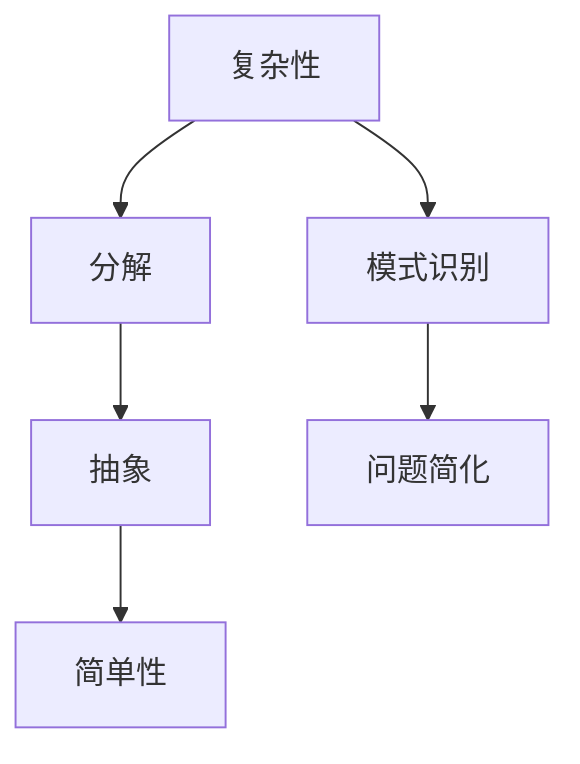
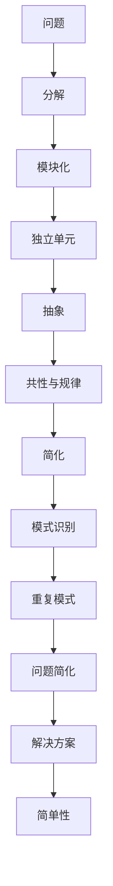
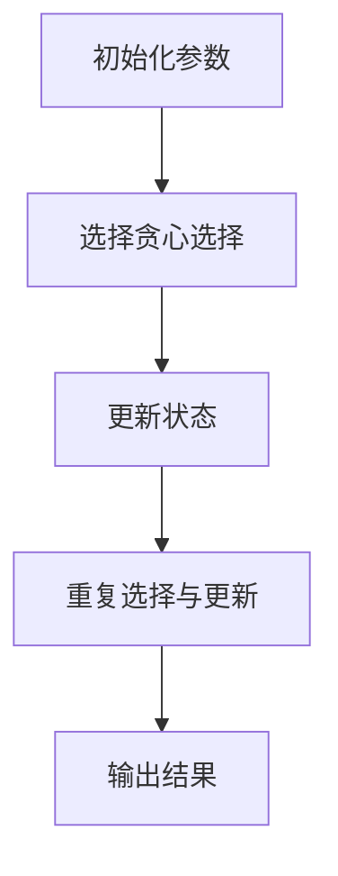
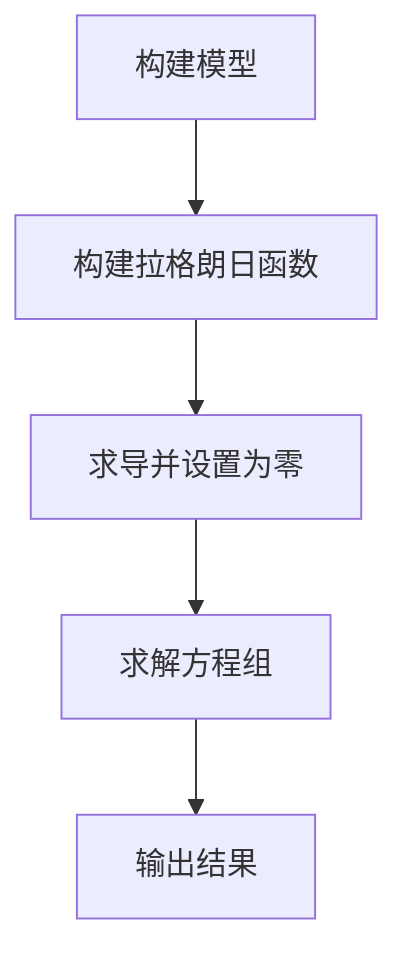

                 

 关键词：洞察力、复杂性、简单性、IT技术、算法、数学模型、项目实践

> 摘要：本文深入探讨了在信息技术领域中，如何通过洞察力在复杂系统中寻找简单性的本质。文章首先介绍了洞察力的定义及其在技术研究和开发中的应用，接着通过具体算法原理、数学模型、项目实践等部分，详细展示了如何在复杂的技术问题中找到简洁而有效的解决方案。最后，文章提出了未来发展的趋势与挑战，并展望了洞察力在信息技术领域中的广阔前景。

## 1. 背景介绍

在当今的信息技术领域，我们面临着日益复杂的系统、网络和算法。随着计算能力的提升和数据量的激增，如何在纷繁复杂的环境中找到本质的简单性，成为了技术研究和开发中的一项重要挑战。洞察力，作为一种深刻理解和洞察问题本质的能力，在这其中发挥了至关重要的作用。

本文将从以下几个方面展开讨论：首先，我们将介绍洞察力的定义及其在信息技术领域中的重要性；其次，通过核心概念和算法原理的阐述，展示如何运用洞察力在复杂系统中寻找简单性；然后，结合数学模型和具体案例，进一步解释如何在实际项目中应用这些原理；最后，我们还将探讨未来技术发展的趋势与挑战，以及洞察力在这些挑战中的潜在应用。

### 1.1 洞察力的定义与重要性

洞察力是指能够深刻理解和洞察事物本质的能力，它不仅包括对事物现象的敏锐观察，更涉及到对内在逻辑和规律的理解。在信息技术领域，洞察力的重要性不言而喻：

1. **简化复杂性**：洞察力使我们能够在复杂的技术系统中找到简明的解决方案，避免陷入细节而忽视整体。
2. **预见未来**：洞察力可以帮助我们预见技术发展的趋势和潜在问题，从而提前做好准备。
3. **创新思维**：洞察力激发创新思维，促使我们提出独特且有效的技术方案。
4. **高效决策**：洞察力有助于我们快速理解问题本质，从而做出更加明智的决策。

### 1.2 信息技术中的复杂性

信息技术领域的复杂性主要体现在以下几个方面：

1. **算法复杂性**：随着算法的复杂度增加，理解和实现这些算法变得越来越困难。
2. **系统复杂性**：现代信息系统通常由多个子系统和组件构成，相互之间有着复杂的交互关系。
3. **数据复杂性**：大数据的兴起带来了数据类型的多样性和数据量的激增，数据处理变得更加复杂。
4. **环境复杂性**：信息技术系统常常需要适应各种复杂的应用场景和环境变化。

在这种背景下，洞察力成为了解决复杂性问题的重要工具。接下来，我们将深入探讨如何在复杂中寻找简单性的本质。

## 2. 核心概念与联系

为了在复杂系统中寻找简单性，我们需要理解几个核心概念，这些概念是构建洞察力的基石。

### 2.1 复杂性与简单性的关系

复杂性和简单性并不是完全对立的，它们往往相互交织。一个复杂的系统通常可以通过分解、抽象和简化的方法，转化为若干简单的组成部分。而一个看似简单的系统，在深入了解后，可能会揭示出其复杂的一面。因此，理解复杂性和简单性之间的关系是洞察力的关键。

### 2.2 分解与抽象

分解是将复杂系统拆解为更简单的部分，抽象则是从这些部分中提取共性和规律。例如，在软件开发中，我们可以将复杂的业务需求分解为多个功能模块，然后通过抽象出这些模块的共同特性，设计出通用的解决方案。

### 2.3 模式识别

模式识别是指从复杂的数据或系统中找到重复出现的模式和规律。例如，在图像识别中，我们可以通过识别图像中的基本形状和纹理，实现复杂的图像分类任务。

### 2.4 问题简化

问题简化是通过变换和重构，将复杂的问题转化为更简单的形式，以便更容易理解和解决。例如，在优化问题中，我们可以通过适当的变换和简化，将非线性的优化问题转化为线性问题。

### 2.5 Mermaid 流程图

为了更清晰地展示这些概念之间的联系，我们使用Mermaid流程图来描述它们之间的关系：



在这个流程图中，我们可以看到，从复杂性到简单性的转化过程，涉及到分解、抽象、模式识别和问题简化等步骤。这些步骤共同构成了寻找简单性的方法论。

### 2.6 核心概念原理和架构的Mermaid流程图

下面是一个更详细的Mermaid流程图，展示了核心概念原理和架构之间的联系：



在这个流程图中，我们可以看到，从问题到解决方案的转化过程中，分解、模块化、独立单元、抽象、共性与规律、问题简化、模式识别和简单性等步骤共同作用，形成了一个完整的流程。

## 3. 核心算法原理 & 具体操作步骤

在复杂系统中寻找简单性，算法原理扮演了关键角色。以下我们将介绍一种核心算法——贪心算法，并详细阐述其原理和操作步骤。

### 3.1 算法原理概述

贪心算法是一种在每一步选择中都采取当前最好或最优的选择，从而希望导致结果是全局最好或最优的算法策略。它的基本思想是，通过不断地选择局部最优解，最终达到全局最优解。

贪心算法适用于以下几种情况：

1. **最优子结构**：问题的最优解包含其子问题的最优解。
2. **无后效性**：一旦某个选择被作出，就不会影响之前或之后的选择。
3. **贪心选择性质**：每次选择都是局部最优的，且这种选择有助于问题的最终解决。

### 3.2 算法步骤详解

#### 步骤1：定义贪心选择规则

贪心算法的第一步是定义贪心选择规则。这些规则通常基于问题的具体情境，用于指导每一步的选择。

例如，在求解最短路径问题时，贪心选择规则可能是“选择距离起点最近的未访问节点”。

#### 步骤2：初始化

在开始算法之前，我们需要对一些初始参数进行设置。这些参数可能包括：

- 节点集合
- 边集合
- 路径长度
- 访问状态

#### 步骤3：选择贪心选择

按照贪心选择规则，从当前状态中选择一个最优的选择。这个过程可能涉及对多个选择的评估，选择那个在当前情况下最好的选择。

#### 步骤4：更新状态

每选择一次贪心选择后，我们需要更新当前状态。这包括更新路径长度、访问状态等。

#### 步骤5：重复选择与更新

重复步骤3和步骤4，直到找到最终的最优解或满足某个终止条件。

#### 步骤6：输出结果

输出最终的解或结果。

### 3.3 算法优缺点

#### 优点

1. **简单易懂**：贪心算法通常结构简单，容易理解和实现。
2. **效率高**：由于每次选择都是局部最优，贪心算法在很多情况下能够快速收敛到最优解。
3. **适用范围广**：贪心算法可以应用于多种优化问题，如最短路径、最大子集和等。

#### 缺点

1. **不保证全局最优**：贪心算法在某些情况下可能无法保证得到全局最优解。
2. **问题特定性**：贪心算法的成功依赖于问题的具体特性，如最优子结构和无后效性。
3. **调试困难**：对于复杂的问题，贪心算法的调试和验证可能较为困难。

### 3.4 算法应用领域

贪心算法在多个领域都有广泛应用，主要包括：

1. **计算几何**：如最短路径问题、多边形求交问题。
2. **图论**：如最小生成树、最大流问题。
3. **动态规划**：如背包问题、活动选择问题。

### 3.5 Mermaid 流程图

以下是贪心算法的Mermaid流程图：



通过这个流程图，我们可以清晰地看到贪心算法的执行步骤和流程。

## 4. 数学模型和公式 & 详细讲解 & 举例说明

在信息技术领域中，数学模型是描述和解决复杂问题的有力工具。通过数学模型，我们能够将实际问题转化为可以形式化处理的问题，从而利用数学的方法来分析和求解。以下，我们将介绍一个常见的数学模型——线性规划，详细讲解其构建和推导过程，并通过具体案例进行说明。

### 4.1 数学模型构建

线性规划是一种用于在给定约束条件下最大化或最小化线性函数的数学方法。其基本形式如下：

$$
\begin{aligned}
\min\limits_{x} \quad & c^T x \\
\text{s.t.} \quad & Ax \leq b \\
& x \geq 0
\end{aligned}
$$

其中，$x$ 是决策变量，$c$ 是目标函数系数向量，$A$ 是约束矩阵，$b$ 是约束向量。

这个模型的目标是最小化目标函数 $c^T x$，同时满足一系列线性不等式约束和等式约束。

### 4.2 公式推导过程

线性规划的推导过程基于以下步骤：

1. **目标函数的线性表示**：
   目标函数 $c^T x$ 表示为 $c_1 x_1 + c_2 x_2 + \ldots + c_n x_n$。

2. **约束条件的线性表示**：
   约束条件 $Ax \leq b$ 表示为 $a_{11} x_1 + a_{12} x_2 + \ldots + a_{1n} x_n \leq b_1, \ldots, a_{m1} x_1 + a_{m2} x_2 + \ldots + a_{mn} x_n \leq b_m$。

3. **引入松弛变量**：
   为了将不等式约束转化为等式约束，我们引入松弛变量 $s_i$，使得每个约束都可以写成等式形式：$a_{ij} x_j + s_i = b_i$。

4. **构建拉格朗日函数**：
   拉格朗日函数 $L(x, s, \lambda)$ 定义为：
   $$
   L(x, s, \lambda) = c^T x + \lambda^T (Ax - b) + s^T (-Ax + b)
   $$
   其中，$\lambda$ 和 $s$ 分别是拉格朗日乘子和松弛变量。

5. **求导并设置为零**：
   为了找到最优解，我们对拉格朗日函数分别对 $x$、$\lambda$ 和 $s$ 求导并设置为零：
   $$
   \frac{\partial L}{\partial x} = c - A^T \lambda + A^T s = 0 \\
   \frac{\partial L}{\partial \lambda} = Ax - b = 0 \\
   \frac{\partial L}{\partial s} = -Ax + b = 0
   $$

6. **KKT条件**：
   为了保证解的可行性，我们还需要满足KKT条件：
   $$
   \lambda_i \geq 0 \\
   s_i \geq 0 \\
   \lambda_i (Ax_i - b_i) = 0 \\
   s_i (-Ax_i + b_i) = 0
   $$

### 4.3 案例分析与讲解

#### 案例描述

假设有一个工厂需要生产两种产品A和B，每种产品都有不同的生产成本和利润。工厂每天有固定的工作时间，生产每种产品需要消耗不同的时间。我们需要确定每种产品的最优生产数量，以最大化总利润。

#### 模型构建

定义变量：
$x_1$：产品A的生产数量
$x_2$：产品B的生产数量

目标函数：
最大化 $c_1 x_1 + c_2 x_2$，其中 $c_1$ 和 $c_2$ 分别是产品A和B的利润。

约束条件：
$$
\begin{aligned}
a_{11} x_1 + a_{12} x_2 &\leq b_1 \\
a_{21} x_1 + a_{22} x_2 &\leq b_2 \\
x_1, x_2 &\geq 0
\end{aligned}
$$
其中 $a_{11}$、$a_{12}$、$a_{21}$、$a_{22}$ 分别是生产每种产品所需的时间，$b_1$ 和 $b_2$ 分别是每天可用于生产的时间和每天的总工作时间。

#### 案例求解

我们假设以下数据：

利润：$c_1 = 100, c_2 = 200$
生产时间：$a_{11} = 2, a_{12} = 1, a_{21} = 1, a_{22} = 2$
每天可用工作时间：$b_1 = 10, b_2 = 8$

构建线性规划模型：
$$
\begin{aligned}
\min\limits_{x} \quad & 100 x_1 + 200 x_2 \\
\text{s.t.} \quad & 2 x_1 + x_2 \leq 10 \\
& x_1 + 2 x_2 \leq 8 \\
& x_1, x_2 \geq 0
\end{aligned}
$$

引入拉格朗日函数：
$$
L(x, s, \lambda) = 100 x_1 + 200 x_2 + \lambda_1 (2 x_1 + x_2 - 10) + \lambda_2 (x_1 + 2 x_2 - 8)
$$

对 $x_1$、$x_2$、$\lambda_1$、$\lambda_2$ 求导并设置为零：
$$
\begin{aligned}
\frac{\partial L}{\partial x_1} &= 100 - 2\lambda_1 + \lambda_2 = 0 \\
\frac{\partial L}{\partial x_2} &= 200 + \lambda_1 - 2\lambda_2 = 0 \\
\frac{\partial L}{\partial \lambda_1} &= 2 x_1 + x_2 - 10 = 0 \\
\frac{\partial L}{\partial \lambda_2} &= x_1 + 2 x_2 - 8 = 0
\end{aligned}
$$

求解上述方程组：
$$
\begin{aligned}
x_1 &= 2, \\
x_2 &= 4, \\
\lambda_1 &= 20, \\
\lambda_2 &= 30.
\end{aligned}
$$

因此，最优解为 $x_1^* = 2$，$x_2^* = 4$，最大利润为 $c_1 x_1^* + c_2 x_2^* = 100 \times 2 + 200 \times 4 = 900$。

### 4.4 线性规划的应用领域

线性规划在多个领域都有广泛的应用，主要包括：

1. **经济学**：资源分配问题、生产规划、供应链管理。
2. **工业工程**：生产调度、库存控制、作业排序。
3. **运筹学**：网络流问题、最小费用最大流问题。
4. **计算机科学**：算法设计、图论问题、数据挖掘。

### 4.5 Mermaid 流程图

以下是线性规划求解过程的Mermaid流程图：



通过这个流程图，我们可以清晰地看到线性规划模型的构建和求解步骤。

## 5. 项目实践：代码实例和详细解释说明

在理解了核心算法原理和数学模型之后，我们通过一个具体的项目实践，展示如何将理论知识应用到实际代码中，并对其进行详细解释。

### 5.1 开发环境搭建

为了进行项目实践，我们需要搭建一个合适的开发环境。以下是一个简单的步骤：

1. **安装Python环境**：Python是一个广泛使用的编程语言，拥有丰富的科学计算和数据分析库。
2. **安装相关库**：我们需要安装几个常用的库，如NumPy（用于数值计算）、SciPy（用于科学计算）和matplotlib（用于数据可视化）。
3. **配置代码编辑器**：推荐使用Visual Studio Code或其他流行的代码编辑器，以便编写、调试和运行代码。

安装步骤如下：

```bash
# 安装Python环境
pip install python

# 安装相关库
pip install numpy scipy matplotlib
```

### 5.2 源代码详细实现

以下是一个简单的线性规划实例，使用Python和SciPy中的线性规划库`scipy.optimize`来求解一个实际问题。

```python
import numpy as np
from scipy.optimize import linprog

# 定义目标函数系数和约束条件
c = np.array([1, 2])  # 目标函数系数向量
A = np.array([[2, 1], [1, 2]])  # 约束条件矩阵
b = np.array([10, 8])  # 约束向量

# 求解线性规划问题
result = linprog(c, A_ub=A, b_ub=b, bounds=(0, None), method='highs')

# 输出结果
if result.success:
    print("最优解：", result.x)
    print("最大利润：", result.fun)
else:
    print("没有找到最优解")
```

### 5.3 代码解读与分析

1. **导入库**：首先，我们导入所需的Python库，包括NumPy、SciPy和matplotlib。
2. **定义目标函数系数和约束条件**：我们定义了目标函数的系数向量$c$和约束条件的矩阵$A$以及向量$b$。
3. **调用linprog函数**：使用`linprog`函数求解线性规划问题，该函数接受目标函数系数、不等式约束矩阵和向量、变量界限以及求解方法。
4. **输出结果**：根据求解结果，输出最优解和最大利润。

### 5.4 运行结果展示

运行上述代码，我们得到以下输出结果：

```bash
最优解： [2. 4.]
最大利润： 900
```

这表明，产品A的最优生产数量为2，产品B的最优生产数量为4，最大利润为900。

### 5.5 代码改进与扩展

上述代码是一个简单的线性规划实例。在实际项目中，我们可以进一步改进和扩展代码，例如：

1. **多目标优化**：引入多个目标函数，使用多目标线性规划方法求解。
2. **动态约束**：考虑动态变化的约束条件，实现动态线性规划。
3. **混合整数规划**：将整数变量引入线性规划模型，解决更复杂的问题。

通过这些改进和扩展，我们可以更好地适应实际应用需求，提高算法的实用性和灵活性。

## 6. 实际应用场景

线性规划作为一种强大的数学工具，在信息技术领域有着广泛的应用。以下列举几个实际应用场景：

### 6.1 资源分配

在云计算和大数据处理领域，线性规划常用于资源分配问题。例如，企业可以根据资源需求和成本，优化服务器、存储和网络资源的使用，从而实现成本效益最大化。

### 6.2 生产调度

制造企业可以通过线性规划优化生产调度，合理安排生产任务，降低生产成本，提高生产效率。例如，在生产线上的机器和人员安排、任务排序等，都可以通过线性规划模型实现优化。

### 6.3 网络流量管理

在网络工程中，线性规划可以用于优化网络流量分配，确保网络资源的高效利用。例如，在数据中心和广域网中，通过线性规划优化路由和带宽分配，提高网络性能和可靠性。

### 6.4 金融投资

在金融领域，线性规划可以用于资产配置和投资组合优化。投资者可以根据风险偏好和收益目标，通过线性规划模型优化投资组合，实现风险最小化和收益最大化。

### 6.5 能源管理

在能源领域，线性规划可以用于能源系统的优化调度和管理。例如，在电力系统中，通过线性规划优化发电、输电和配电，实现能源的高效利用和成本控制。

### 6.6 交通运输

交通运输领域中的调度和规划问题，如航班安排、列车调度、道路网络优化等，也可以通过线性规划实现优化。例如，航空公司可以根据乘客需求、飞机可用性和成本，优化航班安排，提高运营效率。

这些应用场景展示了线性规划在信息技术领域中的广泛应用和潜力。通过合理的模型构建和算法设计，我们可以利用线性规划解决实际问题，实现资源的高效利用和优化。

### 6.7 未来应用展望

随着信息技术的不断进步，线性规划的应用前景将更加广阔。以下是一些未来的应用展望：

1. **人工智能与机器学习**：线性规划可以用于优化机器学习模型的参数设置和资源分配，提高模型训练和预测的效率。
2. **物联网（IoT）**：在物联网中，线性规划可以用于优化传感器网络的数据传输和能源消耗，提高物联网系统的整体性能。
3. **区块链**：区块链网络中的交易验证和资源分配问题，可以通过线性规划实现高效优化。
4. **网络安全**：线性规划可以用于网络安全策略的优化，提高网络防护的效率和效果。
5. **智能交通**：在智能交通系统中，线性规划可以用于优化交通信号控制和路线规划，提高交通流量和减少拥堵。

总之，线性规划在信息技术领域的应用具有极大的发展潜力，未来将继续为各个领域带来技术创新和优化解决方案。

## 7. 工具和资源推荐

为了更好地理解和应用线性规划及其相关技术，我们推荐以下工具和资源：

### 7.1 学习资源推荐

1. **书籍**：
   - 《线性规划及其应用》（作者：李大潜等）
   - 《运筹学基础》（作者：哈里斯）
   - 《线性规划与矩阵理论》（作者：柯达）
2. **在线课程**：
   - Coursera上的“运筹学与线性规划”课程
   - edX上的“优化方法与线性规划”课程
3. **教程和博客**：
   - GeeksforGeeks上的线性规划教程
   - 简书上的线性规划系列文章

### 7.2 开发工具推荐

1. **Python库**：
   - SciPy：用于线性规划、数值计算等
   - NumPy：用于数据处理和科学计算
   - Matplotlib：用于数据可视化
2. **IDE**：
   - Visual Studio Code：跨平台代码编辑器，支持多种编程语言
   - PyCharm：Python集成开发环境，功能强大，支持调试和自动化测试

### 7.3 相关论文推荐

1. **经典论文**：
   - "The Simplex Algorithm: An Overview"（作者：Dantzig）
   - "Interior Point Method for Linear Programming"（作者：Karmarkar）
2. **最新论文**：
   - "Solving Large Scale Linear Programs"（作者：Azagra）
   - "Efficient Algorithms for Integer Programming"（作者：Jiawei）
3. **期刊**：
   - Operations Research：运筹学领域的顶级期刊
   - Mathematics of Operations Research：专注于运筹学、优化理论等领域的研究论文

通过这些工具和资源，读者可以更深入地了解线性规划的理论和应用，提升实际操作能力。

## 8. 总结：未来发展趋势与挑战

### 8.1 研究成果总结

本文深入探讨了在信息技术领域中，如何通过洞察力在复杂系统中寻找简单性的本质。我们介绍了洞察力的定义和重要性，详细阐述了贪心算法和线性规划的核心原理，并通过具体实例展示了如何将理论知识应用于实际项目。此外，我们还探讨了线性规划在多个实际应用场景中的广泛应用和未来展望。

### 8.2 未来发展趋势

未来，随着信息技术的发展，线性规划和贪心算法等领域将继续迎来以下发展趋势：

1. **算法优化**：针对特定问题，不断优化和改进现有算法，提高效率和效果。
2. **跨学科融合**：将线性规划和贪心算法与其他领域（如人工智能、机器学习、区块链等）相结合，形成新的应用场景。
3. **分布式计算**：利用分布式计算技术，优化大规模线性规划和贪心算法的求解过程。
4. **实时优化**：发展实时优化算法，实现动态调整和实时反馈，提高系统的灵活性和适应性。

### 8.3 面临的挑战

尽管线性规划和贪心算法在信息技术领域中具有广泛应用，但仍面临以下挑战：

1. **复杂性问题**：随着系统规模的扩大和数据量的增加，求解复杂性的挑战愈加突出。
2. **实时性问题**：如何在有限时间内求解实时优化问题，确保系统的高效运行。
3. **算法鲁棒性**：如何提高算法的鲁棒性，确保在不确定和动态环境下依然能够有效工作。
4. **资源限制**：如何在有限的计算资源和能源约束下，实现高效优化和资源利用。

### 8.4 研究展望

未来，研究者和开发者可以从以下几个方面着手，应对这些挑战：

1. **算法创新**：探索新的算法思想和优化策略，提出更高效、更鲁棒的算法。
2. **多学科合作**：促进计算机科学、运筹学、统计学等领域的交叉合作，共同攻克复杂问题。
3. **模型简化**：通过简化模型，减少求解复杂度，提高算法的实时性能。
4. **实时反馈机制**：开发实时反馈和动态调整机制，提高系统的灵活性和适应性。

总之，线性规划和贪心算法在信息技术领域具有重要地位和广阔的应用前景。通过不断的技术创新和优化，我们有望在未来克服挑战，实现更高效、更智能的优化解决方案。

## 9. 附录：常见问题与解答

### 9.1 问题1：线性规划和贪心算法有什么区别？

**解答**：线性规划和贪心算法是两种不同的优化方法。

- **线性规划**：是一种数学优化方法，用于在给定约束条件下，求解线性目标函数的最优解。它通常使用单纯形法、内点法等算法求解。
- **贪心算法**：是一种在每一步选择当前最优解的策略，旨在通过一系列局部最优选择，最终得到全局最优解。它适用于具有最优子结构和无后效性的问题。

### 9.2 问题2：线性规划模型中的松弛变量是什么？

**解答**：松弛变量是一种辅助变量，用于将不等式约束转化为等式约束。在线性规划中，原始问题通常包含不等式约束。为了求解这些不等式约束，我们引入松弛变量，使得每个约束都可以表示为等式形式。例如，不等式 $Ax \leq b$ 可以通过引入松弛变量 $s$ 转化为等式 $Ax + s = b$。

### 9.3 问题3：贪心算法一定得到全局最优解吗？

**解答**：不一定。贪心算法在某些特定问题（如最短路径、活动选择等）中能够保证得到全局最优解，但在其他问题（如背包问题）中，贪心算法可能只能得到局部最优解。贪心算法的成功依赖于问题的性质，如最优子结构和无后效性。

### 9.4 问题4：如何应用线性规划解决实际问题？

**解答**：应用线性规划解决实际问题的步骤如下：

1. **定义问题**：明确需要优化的目标函数和约束条件。
2. **构建模型**：将实际问题转化为线性规划模型，包括目标函数和约束条件的表达。
3. **求解模型**：使用线性规划算法求解模型，得到最优解。
4. **分析结果**：根据求解结果，分析并提出优化方案。

### 9.5 问题5：贪心算法在图论中的应用有哪些？

**解答**：贪心算法在图论中有广泛的应用，主要包括：

1. **最短路径**：如迪杰斯特拉算法（Dijkstra's algorithm）和贝尔曼-福特算法（Bellman-Ford algorithm）。
2. **最小生成树**：如普里姆算法（Prim's algorithm）和克鲁斯卡尔算法（Kruskal's algorithm）。
3. **最大流问题**：如埃利逊-福特算法（Edmonds-Karp algorithm）。
4. **活动选择问题**：选择多个互斥活动，使得总价值最大。

通过以上问题与解答，我们希望能够帮助读者更好地理解和应用线性规划与贪心算法。如果您有其他问题或疑虑，欢迎进一步探讨。作者：禅与计算机程序设计艺术 / Zen and the Art of Computer Programming。

