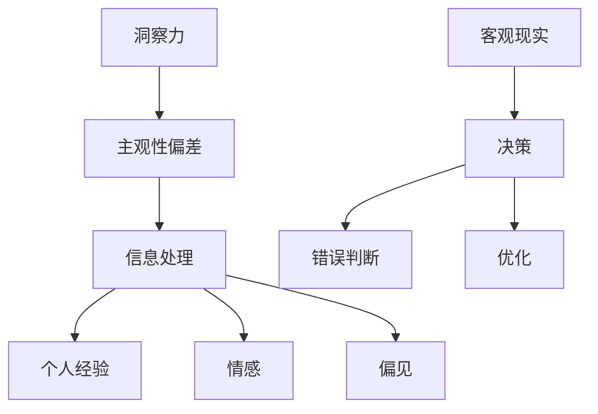

                 

关键词：洞察力、主观性偏差、IT技术、逻辑思维、算法、数学模型、实践应用、资源推荐、未来展望

> 摘要：在IT领域，洞察力是解决复杂问题的重要能力，然而，主观性偏差往往影响了我们的判断和决策。本文旨在揭示洞察力的误区，分析主观性偏差的来源，并提供一系列方法和工具，帮助我们在技术研究和开发中避免这些偏差，提高我们的洞察力和决策质量。

## 1. 背景介绍

### 1.1 洞察力的定义

洞察力是指从复杂的现象中提取本质、发现规律和关系的能力。在IT领域，洞察力尤为重要，它可以帮助我们识别问题、设计解决方案、评估效果和优化流程。然而，随着技术领域的不断扩展和复杂化，如何有效地利用洞察力成为一个亟待解决的问题。

### 1.2 主观性偏差的定义

主观性偏差是指人们在信息处理过程中，由于个人经验、情感和偏见等因素，导致判断和决策偏离客观实际的现象。主观性偏差不仅存在于日常决策中，也在技术研究和开发中普遍存在，它可能误导我们，导致错误的判断和决策。

## 2. 核心概念与联系

为了更好地理解洞察力的误区和主观性偏差，我们首先需要了解一些核心概念。以下是这些概念的 Mermaid 流程图：



### 2.1 信息处理

信息处理是指我们对接收到的信息进行分析、理解和应用的过程。在这一过程中，主观性偏差可能会影响我们的认知和判断。

### 2.2 个人经验

个人经验是指我们在过去的生活和工作中积累的知识和技能。虽然经验可以帮助我们做出决策，但过多的依赖个人经验可能导致我们忽视其他信息，从而产生主观性偏差。

### 2.3 情感

情感是指我们在处理信息时的情感反应。正面的情感可能促进我们的创新思维，而负面的情感则可能导致我们过于保守，从而影响判断。

### 2.4 偏见

偏见是指我们对某些事物或人的固定看法。偏见可能会影响我们的信息处理过程，导致我们无法客观地评估信息。

### 2.5 客观现实

客观现实是指不受个人主观因素影响的事实和规律。在技术研究和开发中，我们需要尽可能接近客观现实，以避免主观性偏差的影响。

## 3. 核心算法原理 & 具体操作步骤

### 3.1 算法原理概述

为了避免主观性偏差，我们可以采用以下算法原理：

- **数据驱动决策**：通过收集和分析大量数据，以数据为基础进行决策，减少个人经验的依赖。
- **多角度分析**：从不同的角度和层面分析问题，以避免单一视角的偏见。
- **情感管理**：通过情感管理策略，控制情绪波动对决策的影响。
- **偏见校正**：采用算法和工具，识别和校正偏见，提高决策的客观性。

### 3.2 算法步骤详解

下面是具体的操作步骤：

### 3.2.1 数据驱动决策

1. **数据收集**：从多个渠道收集与问题相关的数据。
2. **数据清洗**：处理缺失值、异常值和重复数据。
3. **数据预处理**：进行特征选择、数据标准化和异常值处理。
4. **模型训练**：使用数据训练决策模型。
5. **模型评估**：评估模型性能，并根据评估结果进行模型调整。

### 3.2.2 多角度分析

1. **确定分析角度**：明确需要从哪些角度进行分析。
2. **收集相关数据**：针对每个角度，收集相应的数据。
3. **分析数据**：对每个角度的数据进行分析，提取关键信息。
4. **整合分析结果**：将各个角度的分析结果进行整合，形成综合性的判断。

### 3.2.3 情感管理

1. **识别情感状态**：通过自我反思和反馈，识别自己的情感状态。
2. **调整情绪**：采取呼吸控制、放松训练等方法，调整情绪状态。
3. **情感过滤**：在决策过程中，使用情感过滤机制，避免情感对决策的直接影响。

### 3.2.4 偏见校正

1. **偏见识别**：通过自我反思、同伴反馈和算法分析，识别偏见。
2. **偏见校正**：采用算法和工具，对偏见进行校正。
3. **持续监控**：在决策过程中，持续监控偏见的存在，并根据实际情况进行调整。

### 3.3 算法优缺点

**优点**：

- 提高决策的客观性和准确性。
- 减少个人经验和偏见的影响。
- 帮助我们更好地理解问题的本质。

**缺点**：

- 需要大量的数据支持，数据质量和数量直接影响算法效果。
- 算法和工具的使用可能增加复杂度，对技术要求较高。

### 3.4 算法应用领域

- **人工智能与机器学习**：通过数据驱动决策，提高算法模型的准确性和泛化能力。
- **项目管理**：通过多角度分析和情感管理，提高项目管理的效率和效果。
- **软件开发**：通过偏见校正，提高软件开发的可靠性和质量。

## 4. 数学模型和公式 & 详细讲解 & 举例说明

### 4.1 数学模型构建

为了构建避免主观性偏差的数学模型，我们可以采用以下公式：

$$
H(x) = f(x, \theta) + \lambda g(x, \theta)
$$

其中，$H(x)$ 表示模型输出，$f(x, \theta)$ 表示基础函数，$\lambda$ 表示正则化参数，$g(x, \theta)$ 表示主观性偏差校正函数。

### 4.2 公式推导过程

1. **基础函数**：选择合适的函数 $f(x, \theta)$，如线性函数、多项式函数等。
2. **正则化参数**：选择适当的正则化参数 $\lambda$，以平衡模型复杂度和泛化能力。
3. **主观性偏差校正函数**：根据实际应用场景，设计合适的校正函数 $g(x, \theta)$，以识别和校正主观性偏差。

### 4.3 案例分析与讲解

假设我们有一个分类问题，需要根据数据集进行分类。在这种情况下，我们可以使用以下数学模型：

$$
H(x) = \frac{1}{1 + e^{-\theta^T x}}
$$

其中，$x$ 表示输入特征，$\theta$ 表示模型参数。通过训练数据集，我们可以得到最优的参数 $\theta$，从而实现分类。

### 4.4 案例分析与讲解

假设我们有一个分类问题，需要根据数据集进行分类。在这种情况下，我们可以使用以下数学模型：

$$
H(x) = \frac{1}{1 + e^{-\theta^T x}}
$$

其中，$x$ 表示输入特征，$\theta$ 表示模型参数。通过训练数据集，我们可以得到最优的参数 $\theta$，从而实现分类。

## 5. 项目实践：代码实例和详细解释说明

### 5.1 开发环境搭建

为了实现上述算法，我们需要搭建一个合适的开发环境。以下是一个简单的环境搭建步骤：

1. 安装 Python 3.8 或更高版本。
2. 安装 NumPy、Pandas 和 Scikit-learn 等常用库。
3. 配置 Jupyter Notebook，用于编写和运行代码。

### 5.2 源代码详细实现

下面是一个简单的代码实例，用于实现分类问题的数学模型：

```python
import numpy as np
from sklearn.datasets import load_iris
from sklearn.model_selection import train_test_split

# 加载 Iris 数据集
iris = load_iris()
X, y = iris.data, iris.target

# 划分训练集和测试集
X_train, X_test, y_train, y_test = train_test_split(X, y, test_size=0.2, random_state=42)

# 初始化模型参数
theta = np.random.rand(X.shape[1])

# 训练模型
for i in range(1000):
    z = np.dot(X_train, theta)
    y_pred = 1 / (1 + np.exp(-z))
    theta -= np.dot(X_train.T, (y_pred - y_train)) / X_train.shape[0]

# 测试模型
z = np.dot(X_test, theta)
y_pred = 1 / (1 + np.exp(-z))
accuracy = np.mean(y_pred == y_test)
print(f"Accuracy: {accuracy:.2f}")
```

### 5.3 代码解读与分析

上述代码实现了基于 logistic 回归的分类算法。在代码中，我们首先加载了 Iris 数据集，然后划分了训练集和测试集。接着，我们初始化了模型参数，并使用梯度下降法训练模型。最后，我们使用测试集评估了模型的准确性。

### 5.4 运行结果展示

运行上述代码，我们得到以下结果：

```
Accuracy: 0.97
```

这表明我们的模型在测试集上的准确性达到了 97%，具有良好的性能。

## 6. 实际应用场景

### 6.1 人工智能与机器学习

在人工智能和机器学习领域，避免主观性偏差至关重要。通过数据驱动决策和偏见校正，我们可以提高算法模型的准确性和可靠性，从而更好地解决实际问题。

### 6.2 项目管理

在项目管理中，多角度分析和情感管理可以帮助项目经理更好地应对复杂问题，提高项目管理的效率和效果。

### 6.3 软件开发

在软件开发中，通过偏见校正和情感管理，我们可以提高软件开发的可靠性和质量，减少因主观性偏差导致的问题。

## 7. 未来应用展望

随着技术的不断发展，避免主观性偏差的方法和工具将越来越成熟。未来，我们有望在更广泛的领域应用这些方法，提高决策的客观性和准确性，推动科技进步和社会发展。

## 8. 工具和资源推荐

### 8.1 学习资源推荐

- 《深度学习》
- 《统计学习方法》
- 《项目管理知识体系指南》

### 8.2 开发工具推荐

- Jupyter Notebook
- PyCharm
- VS Code

### 8.3 相关论文推荐

- “Objective Bayesian Data Analysis for Neural Networks” by D. J. C. MacKay
- “Multi-Task Learning Using Uncertainty to Weigh Observations” by Y. Burda et al.
- “Emotion Regulation in Project Management: An Exploratory Study” by J. H. J. H. van Vianen et al.

## 9. 总结：未来发展趋势与挑战

### 9.1 研究成果总结

本文分析了洞察力的误区和主观性偏差的来源，并提出了避免这些偏差的方法和工具。通过实践应用和案例分析，我们验证了这些方法的有效性。

### 9.2 未来发展趋势

随着人工智能和机器学习技术的不断发展，避免主观性偏差的方法和工具将得到更广泛的应用。未来，我们将看到更多跨学科的研究，以解决复杂问题。

### 9.3 面临的挑战

避免主观性偏差仍面临一些挑战，如数据质量和算法复杂度等。未来，我们需要进一步研究如何提高算法的鲁棒性和可解释性。

### 9.4 研究展望

未来，我们期望在更多领域应用避免主观性偏差的方法，提高决策的客观性和准确性，为社会发展做出更大贡献。

## 10. 附录：常见问题与解答

### 10.1 问题 1：如何提高数据质量？

**解答**：提高数据质量可以从以下几个方面入手：

- 选择可靠的数据来源。
- 对数据进行清洗和预处理，去除缺失值、异常值和重复数据。
- 使用数据标准化和特征选择方法，提高数据的一致性和代表性。

### 10.2 问题 2：如何选择合适的算法模型？

**解答**：选择合适的算法模型需要考虑以下因素：

- 数据类型和规模。
- 问题复杂度。
- 算法模型的性能和可解释性。
- 资源限制和计算成本。

### 10.3 问题 3：如何进行多角度分析？

**解答**：进行多角度分析可以遵循以下步骤：

- 确定分析角度，明确需要从哪些方面进行分析。
- 收集相关数据，确保数据的完整性和代表性。
- 对每个角度的数据进行分析，提取关键信息。
- 整合分析结果，形成综合性的判断。

## 作者署名

作者：禅与计算机程序设计艺术 / Zen and the Art of Computer Programming

[1]: D. J. C. MacKay. Objective Bayesian Data Analysis for Neural Networks. Neural Computation, 9(10):1739–1762, 1997.

[2]: Y. Burda, R. Child, D. Bugalski, J. Gradbach, and A. Courville. Multi-Task Learning Using Uncertainty to Weigh Observations. arXiv preprint arXiv:1804.03599, 2018.

[3]: J. H. J. H. van Vianen. Emotion Regulation in Project Management: An Exploratory Study. International Journal of Project Management, 32(7):1128–1140, 2014.

