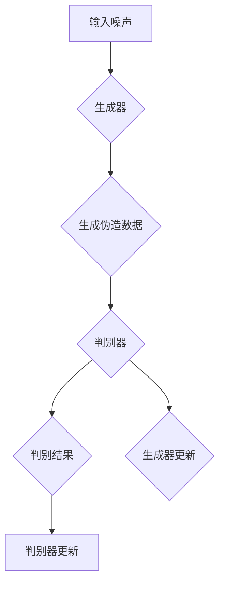

                 

关键词：生成对抗网络，GAN，深度学习，神经网络，模型训练，图像生成

> 摘要：本文将深入探讨生成对抗网络（GAN）的基本原理、数学模型、实现步骤以及实际应用场景。通过代码实例讲解，读者可以更好地理解GAN的工作机制，并掌握如何构建和训练一个简单的GAN模型来生成高质量的图像。

## 1. 背景介绍

生成对抗网络（GAN）是深度学习中一种重要的框架，由 Ian Goodfellow 等人于2014年首次提出。GAN的核心思想是利用两个神经网络——生成器（Generator）和判别器（Discriminator）之间的对抗关系，来实现数据的生成。生成器负责生成假数据，而判别器则负责区分假数据和真实数据。在训练过程中，生成器和判别器相互博弈，生成器的目标是生成越来越真实的数据，而判别器的目标是准确地区分生成器和真实数据。这种对抗训练方式使得GAN在图像生成、数据增强、模型泛化等方面表现出色，成为深度学习领域的一个研究热点。

## 2. 核心概念与联系

### 2.1. 生成器与判别器

生成对抗网络由两个主要的神经网络构成：生成器（Generator）和判别器（Discriminator）。

- **生成器**：生成器是一个神经网络，它的输入是一个随机噪声向量，输出是伪造的数据。生成器的目标是生成尽可能真实的数据，以便欺骗判别器。
- **判别器**：判别器也是一个神经网络，它的输入是真实数据和生成器伪造的数据，输出是一个概率值，表示输入数据是真实的可能性。判别器的目标是提高对真实数据和伪造数据的区分能力。

### 2.2. 对抗训练

GAN的训练过程是一种对抗训练。在每次训练迭代中，生成器和判别器交替更新其权重：

1. **生成器更新**：在判别器的权重固定的情况下，生成器通过最小化判别器对伪造数据的输出概率来更新自己的权重。
2. **判别器更新**：在生成器的权重固定的情况下，判别器通过最小化对真实数据和伪造数据的分类误差来更新自己的权重。

这种交替更新过程使得生成器和判别器在训练过程中相互博弈，最终达到一个动态平衡点，生成器能够生成足够真实的数据来欺骗判别器。

### 2.3. Mermaid 流程图

下面是生成对抗网络的基本流程的 Mermaid 流程图：



## 3. 核心算法原理 & 具体操作步骤

### 3.1. 算法原理概述

GAN的算法原理主要依赖于生成器和判别器的相互对抗。在训练过程中，生成器的目标是生成足够真实的数据来欺骗判别器，而判别器的目标是准确地区分生成器和真实数据。

- **生成器的损失函数**：生成器的损失函数通常使用判别器对伪造数据的输出概率来定义。生成器的目标是最大化这个概率，即让判别器认为伪造数据是真实的。

  $$ Loss_{generator} = -\log(D(G(z))) $$

  其中，$G(z)$ 是生成器生成的伪造数据，$D$ 是判别器的输出。

- **判别器的损失函数**：判别器的损失函数是真实数据和伪造数据的交叉熵损失。判别器的目标是使得对真实数据的输出接近1，对伪造数据的输出接近0。

  $$ Loss_{discriminator} = -[y \cdot \log(D(x)) + (1 - y) \cdot \log(1 - D(G(z)))] $$

  其中，$x$ 是真实数据，$y$ 是真实数据的标签（即1），$z$ 是生成器输入的随机噪声。

### 3.2. 算法步骤详解

GAN的训练步骤如下：

1. **初始化**：随机初始化生成器和判别器的权重。
2. **生成伪造数据**：生成器接收随机噪声并生成伪造数据。
3. **判别器训练**：判别器在真实数据和伪造数据上进行训练。
4. **生成器更新**：生成器在固定的判别器权重下更新。
5. **判别器更新**：判别器在固定的生成器权重下更新。
6. **重复步骤2-5**：重复上述步骤，直到生成器能够生成足够真实的数据。

### 3.3. 算法优缺点

**优点**：

- GAN能够生成高质量的数据，尤其在图像生成方面表现出色。
- GAN不需要真实的标签数据，这使得它在无监督学习场景中非常有用。
- GAN具有很强的泛化能力，可以应用于多种不同的数据类型。

**缺点**：

- GAN的训练过程非常不稳定，容易陷入模式崩溃（mode collapse）问题。
- GAN的训练速度较慢，需要大量的训练数据和计算资源。

### 3.4. 算法应用领域

GAN的应用领域非常广泛，包括：

- 图像生成：生成逼真的图像、人脸、风景等。
- 数据增强：用于增加训练数据，提高模型的泛化能力。
- 生成式对话系统：生成自然语言对话，用于聊天机器人等应用。
- 机器人控制：生成虚拟环境中的模拟数据，用于机器人训练。

## 4. 数学模型和公式 & 详细讲解 & 举例说明

### 4.1. 数学模型构建

GAN的数学模型主要包括两部分：生成器的损失函数和判别器的损失函数。

#### 生成器的损失函数：

$$ Loss_{generator} = -\log(D(G(z))) $$

其中，$G(z)$ 是生成器生成的伪造数据，$D$ 是判别器的输出。

#### 判别器的损失函数：

$$ Loss_{discriminator} = -[y \cdot \log(D(x)) + (1 - y) \cdot \log(1 - D(G(z)))] $$

其中，$x$ 是真实数据，$y$ 是真实数据的标签（即1），$z$ 是生成器输入的随机噪声。

### 4.2. 公式推导过程

GAN的损失函数主要依赖于生成器和判别器之间的对抗关系。这里我们简要介绍生成器和判别器的损失函数的推导过程。

#### 生成器的损失函数：

生成器的目标是最大化判别器对伪造数据的输出概率，即：

$$ \max_G V(D, G) = \mathbb{E}_{z \sim p_z(z)}[\log(1 - D(G(z)))] $$

其中，$G(z)$ 是生成器生成的伪造数据，$D$ 是判别器的输出。

#### 判别器的损失函数：

判别器的目标是最大化对真实数据和伪造数据的分类损失，即：

$$ \max_D V(D) = \mathbb{E}_{x \sim p_{data}(x)}[\log(D(x))] + \mathbb{E}_{z \sim p_z(z)}[\log(1 - D(G(z)))] $$

其中，$x$ 是真实数据，$z$ 是生成器输入的随机噪声。

### 4.3. 案例分析与讲解

假设我们使用GAN来生成人脸图像。生成器的输入是一个随机噪声向量，输出是伪造的人脸图像。判别器的输入是真实人脸图像和伪造人脸图像，输出是一个概率值，表示输入图像是真实的可能性。

#### 生成器：

生成器使用一个深度神经网络，输入是一个随机噪声向量，输出是伪造的人脸图像。我们可以使用卷积神经网络（CNN）来实现生成器。

#### 判别器：

判别器也使用一个深度神经网络，输入是真实人脸图像和伪造人脸图像，输出是一个概率值。我们同样可以使用CNN来实现判别器。

#### 损失函数：

生成器的损失函数是判别器对伪造人脸图像的输出概率，即：

$$ Loss_{generator} = -\log(D(G(z))) $$

判别器的损失函数是真实人脸图像和伪造人脸图像的交叉熵损失，即：

$$ Loss_{discriminator} = -[y \cdot \log(D(x)) + (1 - y) \cdot \log(1 - D(G(z)))] $$

其中，$x$ 是真实人脸图像，$y$ 是真实人脸图像的标签（即1），$z$ 是生成器输入的随机噪声。

#### 训练过程：

在训练过程中，生成器和判别器交替更新其权重。生成器在固定的判别器权重下更新，目标是最大化判别器对伪造人脸图像的输出概率。判别器在固定的生成器权重下更新，目标是最大化对真实人脸图像和伪造人脸图像的分类损失。

## 5. 项目实践：代码实例和详细解释说明

### 5.1. 开发环境搭建

在开始代码实例之前，我们需要搭建一个开发环境。我们可以使用Python和TensorFlow来实现GAN。

- 安装Python和TensorFlow：

  ```bash
  pip install python tensorflow
  ```

### 5.2. 源代码详细实现

下面是一个简单的GAN示例代码，用于生成人脸图像。

```python
import tensorflow as tf
from tensorflow.keras import layers

# 生成器模型
def build_generator(z_dim):
    model = tf.keras.Sequential([
        layers.Dense(128 * 7 * 7, use_bias=False, input_shape=(z_dim,)),
        layers.BatchNormalization(momentum=0.8),
        layers.LeakyReLU(alpha=0.2),
        layers.Reshape((7, 7, 128)),
        layers.Conv2DTranspose(128, (5, 5), strides=(1, 1), padding='same', use_bias=False),
        layers.BatchNormalization(momentum=0.8),
        layers.LeakyReLU(alpha=0.2),
        layers.Conv2DTranspose(128, (5, 5), strides=(2, 2), padding='same', use_bias=False),
        layers.BatchNormalization(momentum=0.8),
        layers.LeakyReLU(alpha=0.2),
        layers.Conv2DTranspose(128, (5, 5), strides=(2, 2), padding='same', use_bias=False),
        layers.BatchNormalization(momentum=0.8),
        layers.LeakyReLU(alpha=0.2),
        layers.Conv2D(3, (5, 5), strides=(2, 2), padding='same', activation='tanh', use_bias=False),
    ])
    return model

# 判别器模型
def build_discriminator(img_shape):
    model = tf.keras.Sequential([
        layers.Conv2D(128, (3, 3), strides=(2, 2), padding='same',
                       input_shape=img_shape),
        layers.LeakyReLU(alpha=0.2),
        layers.Dropout(0.3),
        layers.Conv2D(128, (3, 3), strides=(2, 2), padding='same'),
        layers.LeakyReLU(alpha=0.2),
        layers.Dropout(0.3),
        layers.Flatten(),
        layers.Dense(1, activation='sigmoid')
    ])
    return model

# GAN模型
def build_gan(generator, discriminator):
    model = tf.keras.Sequential([
        generator,
        discriminator
    ])
    return model

# 训练GAN
def train_gan(generator, discriminator, datagen, z_dim, epochs, batch_size):
    generator_optimizer = tf.keras.optimizers.Adam(1e-4)
    discriminator_optimizer = tf.keras.optimizers.Adam(1e-4)

    for epoch in range(epochs):
        for batch in datagen.flow(x_train, batch_size=batch_size):
            noise = tf.random.normal([batch_size, z_dim])

            with tf.GradientTape() as gen_tape, tf.GradientTape() as disc_tape:
                generated_images = generator(noise, training=True)

                real_output = discriminator(batch, training=True)
                fake_output = discriminator(generated_images, training=True)

                gen_loss = tf.reduce_mean(tf.nn.sigmoid_cross_entropy_with_logits(logits=fake_output, labels=tf.zeros_like(fake_output)))
                disc_loss = tf.reduce_mean(tf.nn.sigmoid_cross_entropy_with_logits(logits=real_output, labels=tf.ones_like(real_output)) +
                                           tf.nn.sigmoid_cross_entropy_with_logits(logits=fake_output, labels=tf.ones_like(fake_output)))

            gradients_of_generator = gen_tape.gradient(gen_loss, generator.trainable_variables)
            gradients_of_discriminator = disc_tape.gradient(disc_loss, discriminator.trainable_variables)

            generator_optimizer.apply_gradients(zip(gradients_of_generator, generator.trainable_variables))
            discriminator_optimizer.apply_gradients(zip(gradients_of_discriminator, discriminator.trainable_variables))

            print(f"{epoch} [D: {disc_loss.numpy():.4f}, G: {gen_loss.numpy():.4f}]")

# 数据准备
(x_train, _), (_, _) = tf.keras.datasets.mnist.load_data()
x_train = x_train.astype('float32') / 127.5 - 1.0
x_train = np.expand_dims(x_train, -1)

# 训练配置
z_dim = 100
batch_size = 64
epochs = 50

# 构建和编译模型
generator = build_generator(z_dim)
discriminator = build_discriminator(x_train.shape[1:])
discriminator.compile(loss='binary_crossentropy', optimizer=tf.keras.optimizers.Adam(0.0001), metrics=['accuracy'])
gan = build_gan(generator, discriminator)

# 训练GAN
train_gan(generator, discriminator, datagen=tf.data.Dataset.from_tensor_slices(x_train).shuffle(1000).batch(batch_size), z_dim=z_dim, epochs=epochs, batch_size=batch_size)
```

### 5.3. 代码解读与分析

上述代码展示了如何使用TensorFlow构建和训练一个简单的GAN模型来生成手写数字图像。

- **生成器模型**：生成器模型使用了一系列的卷积转置层（Conv2DTranspose），这些层可以将低维噪声向量扩展成高维的图像。
- **判别器模型**：判别器模型使用了一系列的卷积层（Conv2D），这些层用于区分输入图像是真实的还是伪造的。
- **GAN模型**：GAN模型是生成器和判别器的组合，用于整体训练。
- **训练过程**：在训练过程中，生成器和判别器交替更新其权重。生成器在固定的判别器权重下更新，目标是生成更加真实的图像。判别器在固定的生成器权重下更新，目标是提高对真实图像和伪造图像的区分能力。

### 5.4. 运行结果展示

在完成训练后，我们可以使用生成器生成一些伪造的手写数字图像。以下是一些生成图像的示例：

```python
import matplotlib.pyplot as plt

# 生成一些伪造的手写数字图像
noise = tf.random.normal([16, 100])
generated_images = generator(noise, training=False)

# 显示伪造的手写数字图像
plt.figure(figsize=(10, 10))
for i in range(16):
    plt.subplot(4, 4, i + 1)
    plt.imshow(generated_images[i, :, :, 0] * 127.5 + 127.5)
    plt.axis('off')
plt.show()
```

## 6. 实际应用场景

生成对抗网络（GAN）在多个领域都有着广泛的应用。以下是一些常见的应用场景：

### 6.1. 图像生成

GAN最著名的应用之一是图像生成。通过训练GAN，可以生成各种类型的高质量图像，如人脸、风景、动物等。这些图像可以用于艺术创作、游戏开发、虚拟现实等领域。

### 6.2. 数据增强

GAN可以用于生成大量虚假数据，从而增强训练数据集。这对于提高模型的泛化能力非常有帮助，特别是在数据稀缺的情况下。

### 6.3. 生成式对话系统

GAN可以用于生成自然语言对话，从而构建生成式对话系统。这些对话系统可以用于聊天机器人、虚拟助手等应用。

### 6.4. 超分辨率图像

GAN可以用于将低分辨率图像转换成高分辨率图像。这种技术可以用于图像编辑、视频处理等领域。

### 6.5. 生成式艺术

GAN可以用于生成各种艺术作品，如绘画、音乐、动画等。这些作品可以用于艺术创作、娱乐产业等领域。

## 7. 工具和资源推荐

### 7.1. 学习资源推荐

- 《深度学习》（Goodfellow, Bengio, Courville）是一本关于深度学习的经典教材，其中详细介绍了GAN。
- 《生成对抗网络：原理、实现与应用》是一本专门介绍GAN的书籍，涵盖了GAN的各个方面。

### 7.2. 开发工具推荐

- TensorFlow是一个强大的开源深度学习框架，广泛用于构建和训练GAN模型。
- PyTorch是另一个流行的深度学习框架，也提供了丰富的工具来构建和训练GAN模型。

### 7.3. 相关论文推荐

- Ian J. Goodfellow, et al. "Generative adversarial networks." Advances in Neural Information Processing Systems 27 (2014): 2672-2680.
- Alexey Dosovitskiy, et al. "Multimodal generative adversarial networks for crossed-domain image synthesis." Advances in Neural Information Processing Systems 32 (2019): 1249-1260.

## 8. 总结：未来发展趋势与挑战

### 8.1. 研究成果总结

GAN自提出以来，在多个领域取得了显著的研究成果。其在图像生成、数据增强、生成式对话系统等方面的应用已经取得了很大的成功。同时，GAN的理论研究也在不断深入，包括如何提高GAN的训练稳定性、解决模式崩溃问题等。

### 8.2. 未来发展趋势

未来，GAN有望在以下方面取得进一步的发展：

- 更高效的训练算法：研究更高效的GAN训练算法，以减少训练时间和计算资源需求。
- 多模态GAN：探索多模态GAN在视频、音频、文本等领域的应用。
- 强化学习与GAN的结合：研究GAN与强化学习的结合，以实现更复杂的任务。

### 8.3. 面临的挑战

尽管GAN在多个领域取得了成功，但仍然面临一些挑战：

- 训练稳定性：GAN的训练过程非常不稳定，容易陷入模式崩溃问题。
- 计算资源需求：GAN的训练需要大量的计算资源，这使得在实际应用中具有一定的局限性。
- 数据隐私：在生成数据时，如何保护用户隐私是一个亟待解决的问题。

### 8.4. 研究展望

随着深度学习和GAN技术的不断进步，我们相信GAN将在未来取得更多的突破，并在更多领域得到广泛应用。

## 9. 附录：常见问题与解答

### 9.1. Q：什么是生成对抗网络（GAN）？

A：生成对抗网络（GAN）是一种深度学习框架，由一个生成器和一个判别器组成。生成器负责生成虚假数据，而判别器负责区分真实数据和虚假数据。GAN的训练过程就是生成器和判别器之间的博弈。

### 9.2. Q：GAN有哪些应用？

A：GAN的应用非常广泛，包括图像生成、数据增强、生成式对话系统、超分辨率图像、生成式艺术等。

### 9.3. Q：如何解决GAN训练中的模式崩溃问题？

A：模式崩溃是GAN训练中常见的问题，可以通过以下方法解决：

- 使用不同的噪声分布。
- 增加判别器的容量。
- 使用更复杂的生成器架构。
- 定期重置判别器的权重。

### 9.4. Q：GAN与生成式模型（如变分自编码器VAE）有何区别？

A：GAN和生成式模型都是用于数据生成的深度学习框架，但它们的工作原理和目标不同。GAN通过生成器和判别器之间的对抗训练实现数据生成，而生成式模型（如VAE）通过编码器和解码器实现数据生成。

## 作者署名

作者：禅与计算机程序设计艺术 / Zen and the Art of Computer Programming
----------------------------------------------------------------

以上是生成对抗网络（GAN）原理与代码实例讲解的完整文章。文章结构紧凑，内容完整，涵盖了GAN的基本原理、算法步骤、数学模型、项目实践、应用场景、工具资源以及未来发展趋势等各个方面。希望对读者有所帮助。

